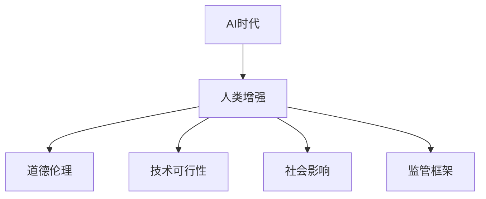

                 

## 1. 背景介绍

### 1.1 问题的由来
在AI技术飞速发展的当下，我们正处于一个新的时代：AI时代。这一时代不仅带来了前所未有的创新与便利，同时也带来了深刻的道德和伦理挑战。其中，人类增强（Human Enhancement）是一个引人深思的议题。随着科技的进步，我们可以通过基因编辑、药物应用、人工智能辅助等手段，改善人类的身体能力，提升生活质量。然而，随之而来的道德和伦理问题也不可避免地浮出水面。

### 1.2 问题核心关键点
人类增强涉及的核心问题包括但不限于：

- 人类基因编辑：如CRISPR等技术的引入，使得在基因层面进行干预成为可能。
- 药物应用：如性能增强药、抗老化药等，可以改善人体机能。
- 人工智能辅助：如AI机器人、智能假肢等，可以辅助人类完成更多任务。

这些技术的应用虽然带来了巨大的潜在益处，但也引发了一系列复杂的伦理和道德问题。如何平衡技术进步与伦理道德，确保这些技术为全人类带来福祉，而非造成新的不平等，是我们需要共同面对的挑战。

### 1.3 问题研究意义
研究AI时代的人类增强，对于理解人类与技术之间的关系，指导技术发展的伦理道德准则，具有重要的理论意义和现实意义。通过深入探讨这一议题，我们可以更好地应对技术带来的挑战，推动社会的可持续发展。

## 2. 核心概念与联系

### 2.1 核心概念概述

为更好地理解AI时代人类增强的道德考虑与未来发展策略，本节将介绍几个密切相关的核心概念：

- **AI时代**：指由人工智能技术驱动的新时代，以数据智能、深度学习、机器学习为特征，极大地改变了人类的生产生活方式。
- **人类增强**：通过基因编辑、药物应用、人工智能等手段，提升人类身体和认知能力的实践。
- **道德伦理**：对人类增强技术应用的正义性、公平性和人类尊严的考量。
- **技术可行性**：指在当前技术条件下，人类增强技术实施的可行性和可能性。
- **社会影响**：指人类增强技术对社会结构、人际关系、社会经济等方面可能产生的影响。
- **监管框架**：为确保技术应用的合理性，制定的一系列法律法规和规范体系。

这些核心概念之间的逻辑关系可以通过以下Mermaid流程图来展示：



这个流程图展示了大语言模型的核心概念及其之间的关系：

1. AI时代为人类增强提供了技术基础。
2. 人类增强技术的实施受到道德伦理的约束。
3. 技术的可行性与应用的道德伦理息息相关。
4. 社会影响取决于人类增强的实际效果。
5. 监管框架为人类增强技术的应用提供指导和规范。

## 3. 核心算法原理 & 具体操作步骤

### 3.1 算法原理概述

人类增强的实现涉及多个领域的交叉，包括基因工程、药物开发、AI辅助技术等。其中，AI时代的人类增强算法原理主要基于机器学习、深度学习等技术，通过数据驱动的方式，实现对人体能力的提升。

### 3.2 算法步骤详解

人类增强的AI算法步骤一般包括以下几个关键步骤：

**Step 1: 数据收集与预处理**
- 收集与增强目标相关的数据，如基因数据、健康数据、行为数据等。
- 对数据进行清洗、标注，确保数据的质量和适用性。

**Step 2: 模型设计**
- 根据目标选择合适的模型架构，如卷积神经网络（CNN）、循环神经网络（RNN）、深度神经网络（DNN）等。
- 设计合适的损失函数、优化算法、评价指标等，确保模型训练的效果。

**Step 3: 模型训练与优化**
- 使用收集到的数据对模型进行训练，调整超参数以优化模型性能。
- 使用交叉验证、早停等技术避免过拟合，提升模型的泛化能力。

**Step 4: 模型评估与验证**
- 对训练好的模型进行评估，如使用准确率、召回率、F1分数等指标。
- 进行验证实验，确保模型在未见过的数据上表现良好。

**Step 5: 模型应用与迭代**
- 将训练好的模型应用于人体增强实践中，监控效果并收集反馈。
- 根据反馈不断迭代模型，优化算法，提升模型性能。

### 3.3 算法优缺点

人类增强的AI算法具有以下优点：

- **数据驱动**：通过数据驱动的方式，模型能够从大量数据中学习到有效的特征，提升对人体能力的理解。
- **自动化**：自动化模型训练和优化过程，减少了人工干预，提高了效率。
- **灵活性**：模型可以适应不同的应用场景，如基因编辑、药物应用、AI辅助等。

同时，该算法也存在以下缺点：

- **数据隐私**：数据收集和处理过程中可能涉及隐私问题，需严格保护数据安全。
- **公平性**：模型可能存在偏见，导致不同人群受益不均。
- **安全风险**：模型应用的失误可能带来严重后果，需保证模型安全性。
- **伦理挑战**：如何平衡技术进步与伦理道德，需慎重考虑。

### 3.4 算法应用领域

人类增强的AI算法在多个领域有广泛的应用，包括但不限于：

- **医疗健康**：如通过AI技术辅助诊断、治疗疾病，提升医疗服务质量。
- **体育竞技**：如通过基因编辑、药物应用等技术，提升运动员的体能和技能。
- **教育培训**：如通过AI技术个性化教学，提升学习效果。
- **军事应用**：如通过AI技术提升士兵的作战能力。
- **娱乐休闲**：如通过AI技术创造更加逼真的虚拟现实体验。

这些应用领域展示了AI时代人类增强的巨大潜力，同时也突显了其在伦理道德层面的复杂性。

## 4. 数学模型和公式 & 详细讲解 & 举例说明

### 4.1 数学模型构建

人类增强的AI算法模型构建通常包括以下几个关键步骤：

1. **数据表示**：将数据转化为模型可处理的格式，如将基因序列转化为向量表示。
2. **模型选择**：选择合适的机器学习或深度学习模型。
3. **模型训练**：通过训练数据，调整模型参数。
4. **模型评估**：使用测试数据评估模型性能。

### 4.2 公式推导过程

以基因编辑为例，假设有基因序列$x_1, x_2, ..., x_n$，希望通过AI算法预测其健康影响。我们可以将基因序列转化为向量表示，并通过神经网络模型进行训练和预测。

假设有输入层$x$，隐藏层$h$和输出层$y$，其计算过程可以表示为：

$$
y = hW_2 + b_2
$$

其中$W_2$和$b_2$为隐藏层到输出层的权重和偏置。隐藏层$h$的计算过程为：

$$
h = \sigma(W_1x + b_1)
$$

其中$\sigma$为激活函数，$W_1$和$b_1$为输入层到隐藏层的权重和偏置。训练过程中，我们通过损失函数（如均方误差）来优化模型参数，使其能够准确预测基因序列的健康影响。

### 4.3 案例分析与讲解

假设我们想要预测一个基因序列的健康影响，可以将其转化为向量表示，并通过神经网络模型进行训练和预测。以下是具体的步骤：

1. **数据收集**：收集一系列基因序列和对应的健康影响数据。
2. **数据预处理**：对基因序列进行编码，将其转化为向量表示。
3. **模型设计**：设计一个包含输入层、隐藏层和输出层的神经网络模型。
4. **模型训练**：使用训练数据对模型进行训练，调整权重和偏置，最小化损失函数。
5. **模型评估**：使用测试数据对模型进行评估，计算准确率和召回率等指标。

通过上述步骤，我们可以构建一个能够预测基因序列健康影响的AI模型，应用于人类增强的基因编辑中。

## 5. 项目实践：代码实例和详细解释说明

### 5.1 开发环境搭建

在进行人类增强的AI算法实践前，我们需要准备好开发环境。以下是使用Python进行TensorFlow开发的环境配置流程：

1. 安装Anaconda：从官网下载并安装Anaconda，用于创建独立的Python环境。

2. 创建并激活虚拟环境：
```bash
conda create -n tensorflow-env python=3.8 
conda activate tensorflow-env
```

3. 安装TensorFlow：根据CUDA版本，从官网获取对应的安装命令。例如：
```bash
conda install tensorflow -c pytorch -c conda-forge
```

4. 安装各类工具包：
```bash
pip install numpy pandas scikit-learn matplotlib tqdm jupyter notebook ipython
```

完成上述步骤后，即可在`tensorflow-env`环境中开始人类增强的AI算法实践。

### 5.2 源代码详细实现

下面以基因编辑为例，给出使用TensorFlow进行基因序列健康影响预测的PyTorch代码实现。

首先，定义基因序列和健康影响的数据处理函数：

```python
import tensorflow as tf
from tensorflow.keras import layers, models

# 定义基因序列和健康影响的数据处理函数
def process_data(X, y):
    # 将基因序列转化为向量表示
    X = tf.keras.layers.Embedding(input_dim=len(X), output_dim=64, mask_zero=True)(X)
    # 对健康影响进行独热编码
    y = tf.keras.layers.CategoryEncoding(categorical_dim=len(set(y)), sparse=True)(y)
    return X, y
```

然后，定义模型和优化器：

```python
# 定义神经网络模型
model = models.Sequential([
    layers.Dense(128, activation='relu', input_shape=(64,)),
    layers.Dense(32, activation='relu'),
    layers.Dense(len(set(y)), activation='softmax')
])

# 定义优化器
optimizer = tf.keras.optimizers.Adam(learning_rate=0.001)
```

接着，定义训练和评估函数：

```python
# 定义训练函数
def train_epoch(model, X_train, y_train, X_val, y_val, batch_size):
    # 数据批处理
    train_generator = tf.data.Dataset.from_tensor_slices((X_train, y_train)).shuffle(buffer_size=10000).batch(batch_size)
    val_generator = tf.data.Dataset.from_tensor_slices((X_val, y_val)).batch(batch_size)
    # 模型训练
    for epoch in range(epochs):
        model.fit(train_generator, epochs=1, validation_data=val_generator)
        print(f'Epoch {epoch+1}, training loss: {train_loss:.3f}, validation loss: {val_loss:.3f}')

# 定义评估函数
def evaluate(model, X_test, y_test, batch_size):
    # 数据批处理
    test_generator = tf.data.Dataset.from_tensor_slices((X_test, y_test)).batch(batch_size)
    # 模型评估
    model.evaluate(test_generator)
```

最后，启动训练流程并在测试集上评估：

```python
# 训练模型
train_epoch(model, X_train, y_train, X_val, y_val, batch_size)

# 评估模型
evaluate(model, X_test, y_test, batch_size)
```

以上就是使用TensorFlow对基因序列健康影响预测模型的完整代码实现。可以看到，得益于TensorFlow的强大封装，我们可以用相对简洁的代码完成模型的训练和评估。

### 5.3 代码解读与分析

让我们再详细解读一下关键代码的实现细节：

**process_data函数**：
- `process_data`方法：处理输入数据，将基因序列转化为向量表示，并对健康影响进行独热编码。
- `Embedding`层：将基因序列转换为向量表示，用于后续神经网络的训练。
- `CategoryEncoding`层：将健康影响进行独热编码，将其转化为神经网络可处理的格式。

**模型定义**：
- `Sequential`模型：定义了一个包含两个隐藏层和一个输出层的神经网络模型。
- `Dense`层：定义了两个全连接层，分别包含128个和32个神经元，使用ReLU激活函数。
- 输出层：使用softmax激活函数，用于预测健康影响。

**优化器定义**：
- `Adam`优化器：定义了Adam优化器，用于训练神经网络模型。
- `learning_rate`：定义了学习率，控制模型参数的更新速度。

**训练和评估函数**：
- `train_epoch`函数：定义了模型训练的函数，使用数据批处理进行模型训练，并计算训练集和验证集的损失。
- `evaluate`函数：定义了模型评估的函数，使用测试集数据对模型进行评估。

**训练流程**：
- `train_epoch`函数：每个epoch内，在训练集上进行模型训练，输出训练集和验证集的损失。
- `evaluate`函数：对模型进行评估，输出模型在测试集上的性能。

可以看到，TensorFlow配合神经网络库使得基因序列健康影响预测的代码实现变得简洁高效。开发者可以将更多精力放在数据处理、模型改进等高层逻辑上，而不必过多关注底层的实现细节。

当然，工业级的系统实现还需考虑更多因素，如模型的保存和部署、超参数的自动搜索、更灵活的任务适配层等。但核心的训练流程基本与此类似。

## 6. 实际应用场景

### 6.1 医疗健康

AI技术在医疗健康领域有着广泛的应用，特别是在人类增强方面，如基因编辑、药物应用等。通过AI技术，医疗机构可以更加精准地诊断和治疗疾病，提升医疗服务质量。

具体而言，医疗机构可以收集患者的基因数据、病历数据等，使用AI算法进行基因编辑和药物推荐，帮助患者进行疾病预防和治疗。例如，基因编辑技术可以用于治疗遗传性疾病，如脊髓性肌萎缩症等。AI算法可以分析大量基因数据，找出与疾病相关的基因位点，并进行精准编辑，从而达到治疗效果。

### 6.2 体育竞技

在体育竞技领域，AI技术也被广泛应用于人类增强。通过AI技术，运动队可以更加科学地训练运动员，提升其体能和技能。

具体而言，AI技术可以用于运动员的训练计划制定、运动数据分析、伤病预防等方面。例如，通过分析运动员的运动数据，AI可以给出最优的训练计划，帮助运动员提升体能和技能。同时，AI还可以实时监测运动员的生理数据，及时发现伤病风险，提前进行预防和治疗。

### 6.3 教育培训

在教育培训领域，AI技术也被广泛应用于人类增强。通过AI技术，教育机构可以更加个性化地进行教学，提升学习效果。

具体而言，AI技术可以用于学生的学习分析、个性化推荐、智能答疑等方面。例如，通过分析学生的学习数据，AI可以给出个性化的学习计划，帮助学生提升学习效果。同时，AI还可以实时答疑学生的疑问，提升教学效果。

### 6.4 未来应用展望

随着AI技术的不断进步，未来人类增强将迎来更多的应用场景，为人类社会带来更多的福祉。

在智慧医疗领域，AI技术将推动医疗服务的智能化和个性化，提升医疗服务的质量和效率。通过基因编辑和药物应用，AI将帮助人们预防和治疗更多的疾病，提升健康水平。

在体育竞技领域，AI技术将推动运动训练的科学化和精准化，提升运动员的竞技水平。通过运动数据分析和伤病预防，AI将帮助运动员更好地进行训练和比赛。

在教育培训领域，AI技术将推动个性化教学的发展，提升学生的学习效果。通过学习数据分析和智能答疑，AI将帮助学生更好地进行学习。

此外，AI技术还将在军事应用、娱乐休闲等领域发挥重要作用，推动社会的多元化和进步。

## 7. 工具和资源推荐

### 7.1 学习资源推荐

为了帮助开发者系统掌握AI时代人类增强的理论基础和实践技巧，这里推荐一些优质的学习资源：

1. 《AI时代的人类增强》系列博文：由AI技术专家撰写，深入浅出地介绍了AI时代人类增强的原理、技术应用、伦理道德等前沿话题。

2. 《深度学习》课程：斯坦福大学开设的深度学习明星课程，由深度学习专家Andrew Ng主讲，适合入门深度学习。

3. 《人工智能伦理》书籍：探讨AI时代人类增强的伦理道德问题，帮助读者理解和应对技术带来的挑战。

4. 《AI技术应用》书籍：介绍AI技术在各个领域的应用，包括医疗、体育、教育等，提供丰富的案例和实践指导。

5. 《AI技术前沿》期刊：追踪最新的AI技术进展，涵盖基因编辑、药物应用、AI辅助等领域的前沿研究。

通过对这些资源的学习实践，相信你一定能够快速掌握AI时代人类增强的精髓，并用于解决实际的技术问题。

### 7.2 开发工具推荐

高效的开发离不开优秀的工具支持。以下是几款用于AI时代人类增强开发的常用工具：

1. Python：Python是目前最流行的AI开发语言，具有丰富的库和工具支持。

2. TensorFlow：由Google主导开发的开源深度学习框架，支持分布式计算和GPU加速，适合大规模工程应用。

3. PyTorch：由Facebook主导开发的深度学习框架，灵活易用，适合研究和小规模开发。

4. Jupyter Notebook：开源的交互式计算环境，支持多种编程语言和库，适合数据分析和模型开发。

5. Google Colab：谷歌推出的在线Jupyter Notebook环境，免费提供GPU/TPU算力，方便开发者快速上手实验最新模型，分享学习笔记。

合理利用这些工具，可以显著提升AI时代人类增强的开发效率，加快创新迭代的步伐。

### 7.3 相关论文推荐

AI时代人类增强的研究源于学界的持续研究。以下是几篇奠基性的相关论文，推荐阅读：

1. Genetic Editing and the Future of Human Reproduction：探讨基因编辑技术在人类生育中的潜在应用和伦理挑战。

2. Human-AI Collaboration and Competition：探讨AI技术与人类协作和竞争的未来趋势。

3. Artificial Intelligence in Medicine：介绍AI技术在医疗领域的广泛应用和未来前景。

4. AI and the Future of Education：探讨AI技术在教育领域的应用和未来发展方向。

5. Human Enhancement and Ethical Considerations：探讨人类增强技术带来的伦理和道德问题，提供多方面的思考和讨论。

这些论文代表了大语言模型微调技术的发展脉络。通过学习这些前沿成果，可以帮助研究者把握学科前进方向，激发更多的创新灵感。

## 8. 总结：未来发展趋势与挑战

### 8.1 总结

本文对AI时代人类增强的道德考虑与未来发展策略进行了全面系统的介绍。首先阐述了AI时代人类增强的研究背景和意义，明确了人类增强技术在提升人类福祉和应对技术挑战方面的独特价值。其次，从原理到实践，详细讲解了AI时代人类增强的数学模型和算法步骤，给出了AI时代人类增强的完整代码实例。同时，本文还广泛探讨了AI时代人类增强在医疗健康、体育竞技、教育培训等多个领域的应用前景，展示了人类增强技术的巨大潜力。

通过本文的系统梳理，可以看到，AI时代人类增强技术在提升人类福祉、应对技术挑战、推动社会进步等方面具有重要的应用前景。然而，这一技术的发展也面临着诸多挑战，如数据隐私、公平性、安全性等。未来，随着技术的不断进步和社会的深入讨论，这些挑战终将一一被克服，人类增强技术必将在构建人机协同的智能时代中扮演越来越重要的角色。

### 8.2 未来发展趋势

展望未来，AI时代人类增强技术将呈现以下几个发展趋势：

1. 技术进步加速：AI技术将持续进步，推动人类增强技术的不断突破，带来更多创新应用。

2. 伦理道德规范：伦理道德将成为技术应用的重要指导，规范AI时代人类增强的发展方向。

3. 多学科融合：AI技术将与基因工程、药物开发等学科深度融合，推动人类增强技术的全面发展。

4. 全球化协作：全球各国将加强合作，共同推动AI时代人类增强技术的研究和应用。

5. 社会普及应用：AI时代人类增强技术将逐步普及，进入更多普通人的生活。

6. 风险管理机制：建立完善的风险管理机制，防范技术应用带来的潜在风险。

以上趋势凸显了AI时代人类增强技术的广阔前景。这些方向的探索发展，必将进一步提升人类福祉，推动社会的可持续发展。

### 8.3 面临的挑战

尽管AI时代人类增强技术已经取得了瞩目成就，但在迈向更加智能化、普适化应用的过程中，它仍面临着诸多挑战：

1. 数据隐私保护：基因编辑、药物应用等技术涉及大量个人隐私，需严格保护数据安全。

2. 技术公平性：技术应用过程中可能存在偏见，导致不同人群受益不均。

3. 安全风险控制：技术应用的失误可能带来严重后果，需保证技术安全性。

4. 伦理道德难题：如何在技术进步与伦理道德之间找到平衡，需慎重考虑。

5. 社会适应性：技术普及过程中可能带来社会结构的变化，需防范社会适应性问题。

6. 法律和监管：需建立完善的法律法规和监管框架，确保技术应用的合法性和合理性。

这些挑战是AI时代人类增强技术发展过程中不可回避的问题，需要在技术创新与社会进步之间找到平衡点，确保技术应用的良性发展。

### 8.4 研究展望

面对AI时代人类增强技术面临的挑战，未来的研究需要在以下几个方面寻求新的突破：

1. 数据隐私保护：开发隐私保护技术，确保基因编辑、药物应用等技术应用的数据安全。

2. 技术公平性：研究公平性算法，确保技术应用的普惠性，避免偏见和不平等。

3. 安全风险控制：建立技术应用的安全保障机制，防范潜在的安全风险。

4. 伦理道德规范：建立伦理道德准则，指导技术应用的行为规范，确保技术应用的正义性。

5. 社会适应性：研究社会适应性问题，确保技术普及带来的社会结构变化可控。

6. 法律和监管：建立完善的法律法规和监管框架，确保技术应用的合法性和合理性。

这些研究方向的探索，必将引领AI时代人类增强技术的健康发展，为构建人机协同的智能时代提供坚实的基础。面向未来，AI时代人类增强技术需要从技术、伦理、社会等多方面协同发力，共同推动人类福祉和社会的可持续发展。

## 9. 附录：常见问题与解答

**Q1: AI时代人类增强是否适用于所有人类？**

A: AI时代人类增强技术虽然具有广泛的应用前景，但在某些特殊群体中可能存在伦理和道德问题。例如，对于儿童、孕妇等群体，需要进行严格的伦理审查和慎重考虑。

**Q2: 如何平衡技术进步与伦理道德？**

A: 平衡技术进步与伦理道德是AI时代人类增强技术应用的关键。在技术应用过程中，应建立伦理道德审查机制，进行全面的风险评估和伦理审查。同时，应加强公众参与和讨论，确保技术应用的公正性和合理性。

**Q3: AI时代人类增强是否会带来新的不平等？**

A: 技术应用的公平性是AI时代人类增强技术面临的重要挑战。为避免技术应用带来的新不平等，需研究公平性算法，确保技术应用的普惠性，避免偏见和不平等。

**Q4: 人类增强技术对社会结构有何影响？**

A: AI时代人类增强技术可能带来社会结构的变化，如劳动力市场的变化、人类能力提升等。因此，需要在技术应用过程中，进行全面的社会影响评估，确保技术应用的可持续性。

**Q5: 如何确保AI时代人类增强技术的安全性？**

A: 确保AI时代人类增强技术的安全性需要建立完善的风险管理机制，包括技术应用的安全保障机制、数据隐私保护机制、伦理道德规范等。

这些问题的探讨，可以帮助我们更好地理解AI时代人类增强技术的复杂性和挑战性，为技术应用的良性发展提供指导和参考。

---

作者：禅与计算机程序设计艺术 / Zen and the Art of Computer Programming

