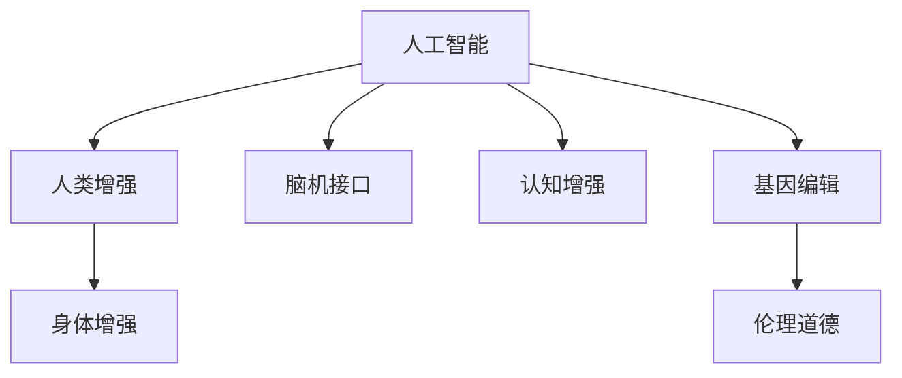

                 

# AI时代的人类增强：道德考虑与身体增强的未来趋势与挑战

> 关键词：人工智能(AI),人类增强,身体增强,道德伦理,未来趋势,技术挑战

## 1. 背景介绍

### 1.1 问题由来
随着人工智能技术的迅猛发展，人类增强技术正在快速崛起。从脑机接口(Brain-Computer Interface, BCI)到身体增强(Physical Enhancement)，从基因编辑(Gene Editing)到认知增强(Cognitive Enhancement)，这些技术为人类的身体和智力能力带来了前所未有的扩展潜力。然而，这些技术的涌现也引发了一系列道德和法律问题。例如，如何保障增强技术的安全性、公平性、隐私性和道德性？增强技术对人类社会的伦理道德将产生何种影响？如何在技术发展与社会接受之间找到平衡点？

### 1.2 问题核心关键点
人类增强技术具有深远的伦理和道德影响，如何在保障技术创新和社会福祉之间找到平衡点，是当前社会和学术界关注的焦点。本文将从AI时代的人类增强技术的定义、分类、应用及其引发的道德和法律问题等维度，全面探讨该领域的未来趋势与挑战。

### 1.3 问题研究意义
研究AI时代的人类增强技术，对于拓展人类潜能、推动社会进步、保障人类福祉具有重要意义。但同时，这一技术领域又面临着严峻的道德和法律挑战，必须慎重处理。通过对人类增强技术及其道德伦理的深入研究，可以为技术发展提供指导，为社会治理提供参考，为伦理法律体系提供借鉴。

## 2. 核心概念与联系

### 2.1 核心概念概述

为更好地理解AI时代的人类增强技术，本节将介绍几个密切相关的核心概念：

- **人工智能(AI)**：利用机器学习、深度学习等技术，使计算机具备类似于人类的智能能力，能够感知、学习、推理、决策等。
- **人类增强(Human Enhancement)**：通过技术手段提升人类的身体和认知能力，如运动能力、记忆能力、感知能力等。
- **身体增强(Physical Enhancement)**：通过植入芯片、基因编辑等方式，增强人类的身体机能，如视力、听力、体力等。
- **脑机接口(Brain-Computer Interface, BCI)**：通过直接采集大脑信号，实现人与计算机的直接交互。
- **认知增强(Cognitive Enhancement)**：通过药物、技术等方式，提升人类的认知能力，如记忆力、注意力、情绪调节等。
- **基因编辑(Gene Editing)**：通过CRISPR-Cas9等技术，改变生物体DNA序列，提升遗传特性。
- **伦理道德(Ethical Moral)**：在技术创新过程中，必须考虑其对人类社会、个体权利和伦理道德的影响。

这些核心概念之间的逻辑关系可以通过以下Mermaid流程图来展示：



这个流程图展示出AI时代人类增强技术的核心概念及其之间的关系：

1. 人工智能提供了技术基础。
2. 人类增强技术利用AI提升人类身体和认知能力。
3. 身体增强、脑机接口、认知增强、基因编辑等技术，是实现人类增强的具体方式。
4. 伦理道德是评价和制约这些技术的重要准则。

## 3. 核心算法原理 & 具体操作步骤
### 3.1 算法原理概述

AI时代的人类增强技术，通常依赖于深度学习、神经网络等先进算法。其核心思想是利用AI技术对人类身体或认知能力进行增强。

以脑机接口技术为例，其原理是：通过脑电图(EEG)、功能性磁共振成像(fMRI)等方式，获取大脑活动信号，经过算法处理后，转化为机器可理解的形式，从而实现对外部设备的控制。核心算法包括信号预处理、特征提取、模式识别等。

以基因编辑技术为例，其原理是：通过CRISPR-Cas9等技术，精准地修改DNA序列，实现特定基因的增加、删除或替换。核心算法包括DNA序列设计、剪切酶选择、编辑效率评估等。

以认知增强药物为例，其原理是：通过神经递质调节、基因表达调控等方式，提升神经系统的功能和效率。核心算法包括神经递质浓度监测、基因表达调控、药物剂量优化等。

### 3.2 算法步骤详解

以脑机接口技术为例，其微调流程一般包括以下几个关键步骤：

**Step 1: 信号采集**
- 使用EEG、fMRI等设备，采集大脑信号。
- 对信号进行预处理，如滤波、归一化、去噪等。

**Step 2: 特征提取**
- 提取大脑信号中的重要特征，如频率、幅度、相位等。
- 使用傅里叶变换、小波变换等方法进行信号分解。

**Step 3: 模式识别**
- 将大脑信号转化为机器可理解的编码，如特征向量。
- 使用支持向量机(SVM)、深度学习模型等进行模式识别。

**Step 4: 输出控制**
- 根据模式识别结果，控制外部设备。如控制机械臂、模拟打字等。
- 实时调整算法参数，优化控制效果。

### 3.3 算法优缺点

AI时代的人类增强技术具有以下优点：
1. 提升人类能力。通过增强技术，可以显著提升人类的身体和认知能力，如增强视力、记忆力、体力等。
2. 促进科学研究。增强技术为科学研究提供了新的工具和方法，推动了人类对大脑和认知机制的理解。
3. 改善生活质量。增强技术可以提升生活质量，如辅助残障人士、治疗疾病等。

同时，该技术也存在一定的局限性：
1. 安全性问题。增强技术可能引发副作用，如神经损伤、免疫反应等。
2. 公平性问题。增强技术可能带来社会不平等，使部分人群受益而其他人群受限。
3. 伦理问题。增强技术可能带来伦理道德困境，如基因编辑的伦理争议。
4. 法律问题。增强技术可能引发法律风险，如隐私泄露、知识产权争议等。

尽管存在这些局限性，但AI时代的人类增强技术仍是大势所趋。未来相关研究需进一步探讨其伦理和法律问题，制定相应的规范和标准，确保技术的安全和公平。

### 3.4 算法应用领域

AI时代的人类增强技术，已经在多个领域取得了显著成果，以下是一些主要应用：

- **医疗健康**：利用增强技术提升诊断和治疗效果，如脑机接口用于神经系统疾病治疗、基因编辑用于遗传疾病治疗等。
- **体育竞技**：利用增强技术提升运动员的体能和技能，如脑机接口用于运动员的训练和康复、认知增强药物用于提高注意力和反应速度等。
- **智能制造**：利用增强技术提升工人操作效率，如脑机接口用于辅助作业、认知增强药物用于提高工作专注度等。
- **教育培训**：利用增强技术提升学习效果，如认知增强药物用于提高记忆力、基因编辑用于改善学习潜力等。
- **娱乐体验**：利用增强技术提升用户体验，如虚拟现实(VR)、增强现实(AR)等技术用于游戏和娱乐体验。

这些应用展示了增强技术在各行各业的广泛应用，展现了其巨大的发展潜力。

## 4. 数学模型和公式 & 详细讲解 & 举例说明
### 4.1 数学模型构建

以脑机接口技术为例，其核心数学模型包括：

1. 信号预处理模型：$X = F(S)$，其中 $X$ 为处理后的信号，$S$ 为原始信号，$F$ 为预处理函数。
2. 特征提取模型：$Y = G(X)$，其中 $Y$ 为提取的特征，$X$ 为预处理后的信号，$G$ 为特征提取函数。
3. 模式识别模型：$Z = H(Y)$，其中 $Z$ 为识别结果，$Y$ 为提取的特征，$H$ 为模式识别函数。

### 4.2 公式推导过程

以支持向量机(SVM)为例，其核心公式如下：

- 支持向量机：$H_{\omega,b}(x) = sign(\omega \cdot x + b)$
- 目标函数：$min_{\omega,b} \frac{1}{2} \lVert \omega \rVert^2 + C \lVert \omega \rVert$
- 约束条件：$y_i(\omega \cdot x_i + b) - 1 \geq 0$

其中 $\omega$ 为分类超平面，$b$ 为偏移量，$C$ 为正则化系数，$x_i$ 为训练样本，$y_i$ 为样本标签。

### 4.3 案例分析与讲解

以基于支持向量机的脑机接口为例，其具体实现步骤如下：

1. 数据采集：使用EEG设备采集神经信号，存储为时间序列数据。
2. 预处理：对神经信号进行滤波、归一化、去噪等预处理。
3. 特征提取：使用小波变换提取神经信号的频域特征。
4. 模型训练：使用支持向量机进行模式识别训练。
5. 输出控制：根据识别结果，控制外部设备，如机械臂、模拟打字等。
6. 实时调整：根据实时反馈，动态调整算法参数，优化控制效果。

## 5. 项目实践：代码实例和详细解释说明
### 5.1 开发环境搭建

在进行脑机接口技术实践前，我们需要准备好开发环境。以下是使用Python进行PyTorch开发的环境配置流程：

1. 安装Anaconda：从官网下载并安装Anaconda，用于创建独立的Python环境。

2. 创建并激活虚拟环境：
```bash
conda create -n pytorch-env python=3.8 
conda activate pytorch-env
```

3. 安装PyTorch：根据CUDA版本，从官网获取对应的安装命令。例如：
```bash
conda install pytorch torchvision torchaudio cudatoolkit=11.1 -c pytorch -c conda-forge
```

4. 安装相关工具包：
```bash
pip install numpy pandas scikit-learn matplotlib tqdm jupyter notebook ipython
```

完成上述步骤后，即可在`pytorch-env`环境中开始脑机接口技术实践。

### 5.2 源代码详细实现

这里我们以基于支持向量机的脑机接口为例，给出使用PyTorch进行脑机接口技术实现的PyTorch代码实现。

首先，定义训练数据和标签：

```python
import torch
from sklearn.datasets import make_classification
from sklearn.model_selection import train_test_split
from sklearn.svm import SVC
from sklearn.preprocessing import StandardScaler
from torch.utils.data import TensorDataset, DataLoader

X, y = make_classification(n_samples=1000, n_features=10, n_informative=5, n_redundant=0, n_classes=2)
X = StandardScaler().fit_transform(X)
X_train, X_test, y_train, y_test = train_test_split(X, y, test_size=0.2, random_state=42)
dataset = TensorDataset(torch.tensor(X_train), torch.tensor(y_train))
train_loader = DataLoader(dataset, batch_size=32, shuffle=True)
test_loader = DataLoader(dataset, batch_size=32, shuffle=False)
```

然后，定义模型和优化器：

```python
from torch import nn
from torch.nn import Linear, ReLU, Softmax
from torch.optim import SGD

class SVM(nn.Module):
    def __init__(self, input_dim):
        super(SVM, self).__init__()
        self.fc1 = Linear(input_dim, 16)
        self.fc2 = Linear(16, 1)
    
    def forward(self, x):
        x = ReLU(self.fc1(x))
        x = self.fc2(x)
        return x

model = SVM(input_dim=10)
optimizer = SGD(model.parameters(), lr=0.01)
```

接着，定义训练和评估函数：

```python
def train_epoch(model, loader, optimizer):
    model.train()
    loss = 0
    for batch in loader:
        inputs, labels = batch
        optimizer.zero_grad()
        outputs = model(inputs)
        loss += nn.BCELoss()(outputs, labels).item()
        loss.backward()
        optimizer.step()
    return loss / len(loader)

def evaluate(model, loader):
    model.eval()
    loss = 0
    correct = 0
    with torch.no_grad():
        for batch in loader:
            inputs, labels = batch
            outputs = model(inputs)
            loss += nn.BCELoss()(outputs, labels).item()
            _, predicted = torch.max(outputs, 1)
            correct += (predicted == labels).sum().item()
    accuracy = correct / len(loader.dataset)
    return loss / len(loader), accuracy
```

最后，启动训练流程并在测试集上评估：

```python
epochs = 10

for epoch in range(epochs):
    train_loss = train_epoch(model, train_loader, optimizer)
    test_loss, test_acc = evaluate(model, test_loader)
    print(f'Epoch {epoch+1}, train loss: {train_loss:.4f}, test loss: {test_loss:.4f}, test accuracy: {test_acc:.4f}')
```

以上就是使用PyTorch对基于支持向量机的脑机接口进行训练的完整代码实现。可以看到，借助PyTorch的便捷接口，我们能够快速实现复杂的深度学习模型，并进行训练和评估。

### 5.3 代码解读与分析

让我们再详细解读一下关键代码的实现细节：

**make_classification函数**：
- 生成随机分类数据，用于模拟实际信号。

**StandardScaler函数**：
- 对特征进行标准化，便于模型训练。

**TensorDataset和DataLoader**：
- 将数据转换为TensorDataset格式，方便模型训练。
- 使用DataLoader进行数据批处理，以提高训练效率。

**SVM模型定义**：
- 使用PyTorch定义支持向量机模型，包含两个全连接层。
- 使用ReLU激活函数和非线性变换。

**SGD优化器**：
- 定义随机梯度下降优化器，控制学习率。

**train_epoch和evaluate函数**：
- 训练函数使用PyTorch的nn.BCELoss计算二分类交叉熵损失。
- 评估函数使用准确率作为性能指标。

**训练循环**：
- 循环训练模型，记录每个epoch的训练损失和测试损失。
- 输出每个epoch的训练结果。

可以看到，使用PyTorch进行脑机接口技术实践，代码简洁高效，易于理解和实现。借助PyTorch的强大功能和丰富资源，我们可以更加专注于算法和模型的设计，而不必过多关注底层实现细节。

当然，工业级的系统实现还需考虑更多因素，如模型的保存和部署、超参数的自动搜索、更灵活的任务适配层等。但核心的脑机接口技术基本与此类似。

## 6. 实际应用场景
### 6.1 智能健康医疗

脑机接口技术在智能健康医疗领域具有广泛的应用前景。通过脑机接口技术，可以实时监测和调控大脑活动，辅助诊断和治疗神经系统疾病，提升患者的生活质量。

具体应用包括：

- **神经系统疾病治疗**：利用脑机接口技术，对帕金森病、癫痫、抑郁症等神经系统疾病进行监测和治疗。
- **神经康复**：通过脑机接口技术，辅助脑卒中、脑损伤等神经功能障碍患者的康复训练。
- **心理治疗**：利用脑机接口技术，监测患者情绪和心理状态，辅助进行心理治疗。

这些应用展示了脑机接口技术在医疗健康领域的巨大潜力，为患者提供了新的治疗手段和治疗方案。

### 6.2 体育竞技训练

脑机接口技术在体育竞技训练中也具有重要应用。通过脑机接口技术，可以实时获取运动员的脑电信号，进行运动分析和训练优化。

具体应用包括：

- **运动分析**：利用脑机接口技术，分析运动员的运动状态和注意力水平，提供训练建议和优化方案。
- **神经反馈**：通过脑机接口技术，实时调整训练强度和内容，帮助运动员提升运动能力和比赛表现。
- **增强感知**：利用脑机接口技术，提高运动员对环境的感知能力和反应速度，增强比赛竞争力。

这些应用展示了脑机接口技术在体育竞技训练中的优势，为运动员提供了科学的训练方法和训练工具。

### 6.3 工业制造控制

脑机接口技术在工业制造控制中也具有重要应用。通过脑机接口技术，可以实现人机协同操作，提升生产效率和设备自动化水平。

具体应用包括：

- **辅助作业**：利用脑机接口技术，辅助工人进行作业操作，提升工作效率和操作精度。
- **设备控制**：通过脑机接口技术，实现对工业设备的操作和控制，提高生产自动化水平。
- **安全监控**：利用脑机接口技术，实时监测工人的注意力和操作状态，保障安全生产。

这些应用展示了脑机接口技术在工业制造控制中的潜在价值，为工业生产带来了新的思路和方法。

### 6.4 未来应用展望

随着脑机接口技术的不断发展，未来在人类增强领域将有更多突破和创新。

- **智能化**：脑机接口技术将与AI、机器学习等技术深度融合，实现智能化操作和智能决策。
- **可穿戴化**：脑机接口技术将更加可穿戴化，便于用户随时使用，提升用户体验和便利性。
- **多功能化**：脑机接口技术将集成了更多功能，如健康监测、社交互动等，提升用户生活质量。
- **普及化**：脑机接口技术将变得更加普及，进入更多家庭和学校，成为日常生活的必需品。
- **智能化**：脑机接口技术将与AI、机器学习等技术深度融合，实现智能化操作和智能决策。

这些趋势展示了脑机接口技术未来的广阔前景，为人类的生活质量和生产效率带来了新的可能。

## 7. 工具和资源推荐
### 7.1 学习资源推荐

为了帮助开发者系统掌握脑机接口技术的理论基础和实践技巧，这里推荐一些优质的学习资源：

1. 《Deep Brain Stimulation》系列博文：由脑机接口专家撰写，深入浅出地介绍了脑机接口的原理、方法和应用。

2. IEEE PAMI《Brain-Computer Interfaces: A Review》期刊：IEEE PAMI发表的脑机接口综述文章，涵盖脑机接口的最新研究成果和应用进展。

3. 《Brain-Computer Interfaces: Methods, Tools, and Applications》书籍：全面介绍了脑机接口的原理、方法和应用，适合初学者和专业人士参考。

4. NIPS《Brain-Computer Interfaces》课程：斯坦福大学开设的脑机接口课程，涵盖脑机接口的最新研究成果和实践技术。

5. Brain-Computer Interface Data Repository（BCIDR）：包含多种脑机接口数据集，支持研究者进行脑机接口技术的研究和评估。

通过对这些资源的学习实践，相信你一定能够快速掌握脑机接口技术的精髓，并用于解决实际的脑机接口问题。

### 7.2 开发工具推荐

高效的开发离不开优秀的工具支持。以下是几款用于脑机接口技术开发的常用工具：

1. PyTorch：基于Python的开源深度学习框架，灵活动态的计算图，适合快速迭代研究。

2. TensorFlow：由Google主导开发的开源深度学习框架，生产部署方便，适合大规模工程应用。

3. OpenViBE：开源的脑机接口平台，支持多种信号采集、处理和分析工具。

4. EEGlab：商业化的脑电图处理软件，提供丰富的预处理和分析功能。

5. SPM：开源的脑成像软件，支持多种磁共振成像数据处理和分析。

合理利用这些工具，可以显著提升脑机接口技术开发效率，加快创新迭代的步伐。

### 7.3 相关论文推荐

脑机接口技术的研究源于学界的持续研究。以下是几篇奠基性的相关论文，推荐阅读：

1. Witteveen et al.《Simultaneous EEG and fMRI Feedback to Improve BCIs》：介绍了利用EEG和fMRI数据，实时反馈训练BCI的方法。

2. Hinterberger et al.《A Brain-Computer Interface for Spelling Using Electroencephalogram-Based Bidirectional Corticocortical System》：介绍了基于EEG的BCI方法，实现词语拼写任务。

3. Bach et al.《Epilepsy and Brain-Computer Interfaces》：综述了BCI在癫痫诊断和治疗中的应用。

4. Hwang et al.《A Long-Term Usability Study on Using a Brain-Computer Interface for Neurorehabilitation》：介绍了BCI在神经康复中的应用和效果。

5. Nunez et al.《Cognitive Enhancement by Transcranial Direct Current Stimulation: A Randomized Double-Blind Placebo-Controlled Pilot Study》：介绍了TDCS对认知能力的影响。

这些论文代表了大脑接口技术的发展脉络。通过学习这些前沿成果，可以帮助研究者把握学科前进方向，激发更多的创新灵感。

## 8. 总结：未来发展趋势与挑战

### 8.1 总结

本文对AI时代的人类增强技术的定义、分类、应用及其引发的道德和法律问题等维度，全面探讨了该领域的未来趋势与挑战。首先介绍了人类增强技术的核心概念和应用场景，明确了脑机接口技术的定义和关键算法。其次，从原理到实践，详细讲解了脑机接口技术的具体实现步骤，并给出了代码实例。同时，本文还广泛探讨了脑机接口技术在医疗、体育、工业等领域的未来应用前景，展示了其巨大的发展潜力。此外，本文精选了脑机接口技术的各类学习资源，力求为读者提供全方位的技术指引。

通过本文的系统梳理，可以看到，AI时代的人类增强技术正在成为医学、体育、工业等领域的重要技术手段，为人类的身体和认知能力带来了前所未有的扩展潜力。但与此同时，这些技术也面临着严峻的伦理和法律挑战，必须慎重处理。未来，脑机接口技术需要在安全性、公平性、隐私性、道德性等方面进行深入研究，确保技术的健康发展。

### 8.2 未来发展趋势

展望未来，脑机接口技术将呈现以下几个发展趋势：

1. **智能化**：脑机接口技术将与AI、机器学习等技术深度融合，实现智能化操作和智能决策。
2. **可穿戴化**：脑机接口技术将更加可穿戴化，便于用户随时使用，提升用户体验和便利性。
3. **多功能化**：脑机接口技术将集成了更多功能，如健康监测、社交互动等，提升用户生活质量。
4. **普及化**：脑机接口技术将变得更加普及，进入更多家庭和学校，成为日常生活的必需品。
5. **国际化**：脑机接口技术将更加国际化，全球科研机构和企业合作，共享研究成果和应用成果。

这些趋势展示了脑机接口技术的未来发展方向，为人类的生活质量和生产效率带来了新的可能。

### 8.3 面临的挑战

尽管脑机接口技术已经取得了一定进展，但在迈向更加智能化、普适化应用的过程中，它仍面临诸多挑战：

1. **安全性问题**：脑机接口技术可能引发副作用，如神经损伤、免疫反应等。如何保障用户安全，避免技术风险，是首要问题。
2. **隐私保护**：脑机接口技术涉及大量个人隐私数据，如何保障数据安全和隐私保护，是重要难题。
3. **公平性问题**：脑机接口技术可能带来社会不平等，使部分人群受益而其他人群受限。如何确保技术的公平性和可及性，需要进一步探索。
4. **伦理道德问题**：脑机接口技术涉及诸多伦理道德问题，如基因编辑的伦理争议、增强技术的伦理边界等。如何在技术创新与社会伦理之间找到平衡点，是关键问题。

尽管面临这些挑战，但脑机接口技术的巨大潜力使其成为人类增强技术的重要方向，必将为人类生活质量和生产效率带来革命性影响。相信通过科研界和产业界的共同努力，这些挑战终将一一克服，脑机接口技术必将在构建人机协同的智能时代中扮演越来越重要的角色。

### 8.4 研究展望

面对脑机接口技术所面临的诸多挑战，未来的研究需要在以下几个方面寻求新的突破：

1. **安全性研究**：开展脑机接口技术的安全性评估和测试，制定相关的安全标准和规范，确保用户安全。
2. **隐私保护研究**：开发隐私保护算法和技术，保障数据安全和隐私保护，确保用户隐私。
3. **公平性研究**：开展脑机接口技术的公平性评估和测试，确保技术的公平性和可及性，避免社会不平等。
4. **伦理道德研究**：探讨脑机接口技术的伦理道德问题，建立伦理导向的评估指标，确保技术发展的伦理边界。

这些研究方向的探索，必将引领脑机接口技术迈向更高的台阶，为构建安全、可靠、可解释、可控的智能系统铺平道路。面向未来，脑机接口技术还需要与其他人工智能技术进行更深入的融合，如知识表示、因果推理、强化学习等，多路径协同发力，共同推动智能交互系统的进步。只有勇于创新、敢于突破，才能不断拓展脑机接口技术的边界，让人工智能技术更好地造福人类社会。

## 9. 附录：常见问题与解答

**Q1：脑机接口技术是否安全可靠？**

A: 脑机接口技术的安全性和可靠性是当前研究的重点之一。尽管已经有一些成功案例，但仍存在潜在的风险和未知因素。例如，脑电信号的采集和处理可能受到环境噪声、生物信号变化等因素的影响，导致误判和误操作。因此，在使用脑机接口技术时，需要综合考虑多种因素，确保其安全性和可靠性。

**Q2：脑机接口技术是否会影响用户的隐私？**

A: 脑机接口技术涉及大量个人隐私数据，如脑电信号、心理状态等。如果数据泄露或被滥用，将对用户隐私造成严重威胁。因此，在使用脑机接口技术时，需要加强数据隐私保护，制定严格的数据使用规范，确保用户隐私不受侵害。

**Q3：脑机接口技术是否会带来社会不平等？**

A: 脑机接口技术可能带来社会不平等，如技术获取的不平等、应用成本的高低等。部分人群可能由于经济、技术、知识等方面的限制，难以受益于脑机接口技术，从而加剧社会不平等。因此，在使用脑机接口技术时，需要考虑社会公平性，确保技术普惠。

**Q4：脑机接口技术是否会带来伦理道德困境？**

A: 脑机接口技术涉及诸多伦理道德问题，如基因编辑的伦理争议、增强技术的伦理边界等。例如，基因编辑可能导致“基因编辑婴儿”等伦理问题，增强技术可能导致社会不平等、隐私泄露等问题。因此，在使用脑机接口技术时，需要认真考虑伦理道德问题，制定相关规范和标准，确保技术健康发展。

**Q5：脑机接口技术是否可以大规模推广应用？**

A: 脑机接口技术的推广应用需要考虑多种因素，如技术成本、用户体验、社会接受度等。尽管一些应用场景（如医疗、体育等）已经取得了一定进展，但大规模推广仍需进一步探索和优化。例如，设备成本较高、操作复杂等问题，可能限制其大规模应用。因此，在使用脑机接口技术时，需要综合考虑多种因素，逐步推进技术普及。

这些问题的回答，展示了脑机接口技术的潜在风险和挑战，需要科研界和产业界共同努力，确保技术的安全性、公平性、隐私性和伦理道德边界，推动脑机接口技术健康发展。

