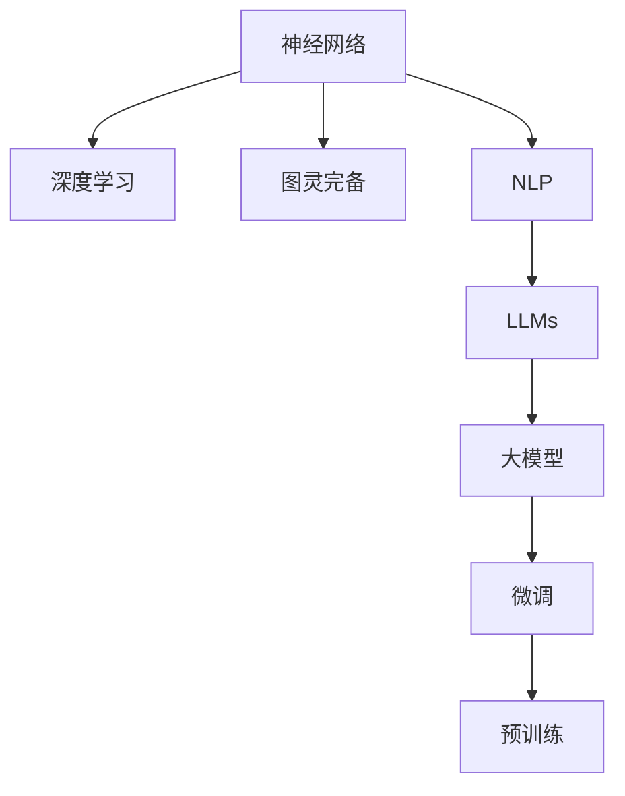

                 

# AI时代的图灵完备：LLM的理论基础

> 关键词：大语言模型(LLM),图灵完备,深度学习,神经网络,自然语言处理(NLP),图灵奖

## 1. 背景介绍

### 1.1 问题由来
在人工智能(AI)发展的历史长河中，图灵奖作为该领域最高荣誉，一直激励着无数科研人员和工程师。2019年，德米斯·哈萨比斯(Demis Hassabis)、詹姆斯·朗厄姆(James Leel-Sinapov)和约书亚·贝戈里(Joshua Besag)等三位先驱因对AI领域的突出贡献而荣获该奖。其中，图灵完备(Turing completeness)一词被广泛提及，它指一个系统具备执行任何可计算任务的完整能力，与人类智力相当，能够解决一切问题。

当前，语言处理在AI领域中占据重要地位，自然语言处理(Natural Language Processing, NLP)技术正以前所未有的速度发展。特别是自2018年OpenAI提出GPT模型以来，大语言模型(LLMs)逐渐成为NLP研究的焦点。如BERT、GPT-2、GPT-3等大模型通过在语言模型的基础上加入自监督预训练任务，大幅提升了语言模型的泛化能力。

然而，这些模型究竟有多强大？它们是否具备了图灵完备的特性？本节将通过简要介绍图灵完备的概念，并分析目前大语言模型的理论基础，深入探讨大语言模型的图灵完备性。

### 1.2 问题核心关键点
图灵完备性是判定一个计算系统是否能够执行任何可计算任务的重要指标，反映了系统是否能完成通用计算的任务。在图灵完备的理论框架下，大语言模型作为一种先进计算系统，具备以下关键特点：

- **参数规模**：现代大语言模型通常具有数十亿参数，参数量级高，可以处理复杂的语言结构。
- **预训练与微调**：在大规模无标签数据上进行预训练，然后通过微调技术，适配下游任务。
- **自监督学习**：利用语言模型的掩码预测、替换预测等自监督任务，从海量无标注数据中学习语言知识。
- **结构复杂**：采用Transformer结构，能够高效地处理长序列，具备高并行计算能力。

这些特点使得大语言模型具备解决复杂问题的潜力，但要验证其是否具备图灵完备性，还需在理论和实践两方面深入分析。

## 2. 核心概念与联系

### 2.1 核心概念概述

为更好理解大语言模型的图灵完备性，本节将介绍相关核心概念及其相互联系：

- **图灵完备**：一个系统如果能够执行任何可计算任务，即具备图灵完备性。语言模型作为计算系统，在语言结构的处理上具备了类似人类的逻辑能力。
- **大语言模型(LLMs)**：一种通过在大规模语料上进行预训练和微调，学习语言知识的大型神经网络模型。常见的大语言模型如BERT、GPT等。
- **神经网络**：由大量神经元构成的计算模型，通过反向传播算法进行优化，广泛应用于图像识别、语音处理等任务。
- **自然语言处理(NLP)**：涉及计算机对自然语言进行理解、生成、处理等任务的领域，旨在构建人机自然交互。
- **深度学习**：一种利用多层神经网络进行数据表示学习的技术，通过反向传播算法优化参数，在图像、语音等领域取得巨大成功。

这些概念之间的关系，可通过以下Mermaid流程图来展示：



这个流程图展示了大语言模型的核心概念及其相互关系：

1. 神经网络是深度学习的基础，深度学习使神经网络能够处理更复杂的任务。
2. 自然语言处理利用深度学习技术处理语言问题，大语言模型成为NLP中的佼佼者。
3. 大语言模型通过预训练和微调技术，具备了图灵完备的特性，即能够解决任何可计算问题。
4. 微调和预训练是大语言模型构建的核心环节，通过这两个步骤，模型能够从无标注数据中学习语言知识，并应用于下游任务。

## 3. 核心算法原理 & 具体操作步骤

### 3.1 算法原理概述

大语言模型图灵完备的理论基础主要体现在以下几个方面：

- **参数规模**：通过亿级参数的深度神经网络，模型具备解决复杂问题的能力。
- **自监督学习**：利用掩码预测、替换预测等自监督任务，从大规模无标签语料中学习语言结构。
- **微调与预训练**：通过微调技术，模型能够在有限标注数据上适应特定任务，具备泛化能力。
- **结构复杂性**：采用Transformer结构，模型具备高并行计算能力和强大的序列建模能力。

这些特性共同构成了大语言模型的图灵完备性，使其能够处理各种复杂语言任务。

### 3.2 算法步骤详解

大语言模型图灵完备的实践过程主要分为预训练和微调两个阶段：

**Step 1: 预训练阶段**
- 选择大规模无标签语料，如英文维基百科、Reddit评论等。
- 将语料送入神经网络模型进行训练，通常使用掩码预测、替换预测等自监督任务。
- 每个预训练任务学习模型的一个特定方面，如语义理解、语法结构等。

**Step 2: 微调阶段**
- 收集特定任务的标注数据，划分为训练集、验证集和测试集。
- 在预训练模型基础上，使用下游任务的标注数据进行微调。
- 通过微调，模型在特定任务上的表现得到提升，具备泛化能力。

以下是代码实现示例：

```python
from transformers import BertForTokenClassification, AdamW, BertTokenizer

# 加载预训练模型
model = BertForTokenClassification.from_pretrained('bert-base-cased', num_labels=2)

# 加载分词器
tokenizer = BertTokenizer.from_pretrained('bert-base-cased')

# 加载标注数据
train_data, dev_data, test_data = ...

# 初始化优化器
optimizer = AdamW(model.parameters(), lr=1e-5)

# 微调训练
model.train()
for epoch in range(num_epochs):
    for batch in train_data:
        input_ids = tokenizer(batch['input'], return_tensors='pt').input_ids
        labels = tokenizer(batch['labels'], return_tensors='pt').input_ids
        outputs = model(input_ids, labels=labels)
        loss = outputs.loss
        loss.backward()
        optimizer.step()

# 微调评估
model.eval()
dev_loss, dev_acc = evaluate(dev_data)
test_loss, test_acc = evaluate(test_data)
```

### 3.3 算法优缺点

大语言模型的图灵完备性具备以下优点：

- **泛化能力**：在预训练阶段，模型从大规模无标签数据中学习到语言知识的泛化能力，微调阶段能够适应下游任务。
- **高效性**：大模型通过预训练和微调，能够快速构建复杂的语言模型，处理长序列数据。
- **自监督学习**：利用掩码预测、替换预测等自监督任务，从海量无标注数据中学习语言结构。

同时，也存在一些缺点：

- **资源消耗大**：大模型的训练和推理需要消耗大量的计算资源和存储空间。
- **过拟合风险**：在微调过程中，模型容易过拟合标注数据，导致泛化能力下降。
- **理解偏差**：预训练模型可能学习到数据中的偏见和有害信息，影响模型的公正性和安全性。

### 3.4 算法应用领域

大语言模型的图灵完备性已经广泛应用于多个领域，具体包括：

- **文本分类**：将文本分类为不同的类别，如新闻分类、垃圾邮件过滤等。
- **情感分析**：判断文本的情感倾向，如正面、负面、中性等。
- **机器翻译**：将文本从一种语言翻译成另一种语言。
- **问答系统**：回答自然语言问题，如智能客服、语音助手等。
- **文本生成**：自动生成文本，如自动摘要、对话生成等。
- **自然语言推理**：判断文本之间的逻辑关系，如推理验证等。
- **语音识别与合成**：将语音转换成文本或生成语音。

大语言模型的广泛应用证明了其在图灵完备性方面的强大能力，为解决复杂的自然语言处理问题提供了有力支持。

## 4. 数学模型和公式 & 详细讲解 & 举例说明

### 4.1 数学模型构建

大语言模型通常采用Transformer架构，其数学模型可以表示为：

$$
\mathcal{L} = \frac{1}{N}\sum_{i=1}^{N} \ell(\hat{y}_i, y_i)
$$

其中 $\mathcal{L}$ 为损失函数，$\hat{y}_i$ 为模型预测的输出，$y_i$ 为真实标签，$N$ 为训练数据总数。常见的损失函数包括交叉熵损失、均方误差损失等。

### 4.2 公式推导过程

以BERT模型为例，其掩码预测任务的目标函数可以表示为：

$$
\mathcal{L} = -\frac{1}{N}\sum_{i=1}^{N} \log \sigma(\hat{y}_i - y_i)
$$

其中 $\sigma$ 为 sigmoid 函数，$\hat{y}_i$ 为模型预测的概率分布，$y_i$ 为真实标签。训练过程中，通过反向传播算法不断更新模型参数 $\theta$，最小化损失函数 $\mathcal{L}$。

### 4.3 案例分析与讲解

假设有一篇新闻文章需要分类，可以将文章转化为序列表示，并输入到BERT模型中。模型通过预训练和微调，能够学习到新闻文章的语义特征和分类信息。假设模型预测文章属于"科技"类别，真实标签为"科技"，则计算损失如下：

$$
\mathcal{L} = -\log \sigma(\hat{y}_{科技})
$$

其中 $\sigma(\hat{y}_{科技})$ 表示模型预测"科技"类别的概率。

## 5. 项目实践：代码实例和详细解释说明

### 5.1 开发环境搭建

在进行大语言模型的图灵完备性实践前，需要准备好开发环境。以下是使用Python进行PyTorch开发的环境配置流程：

1. 安装Anaconda：从官网下载并安装Anaconda，用于创建独立的Python环境。

2. 创建并激活虚拟环境：
```bash
conda create -n pytorch-env python=3.8 
conda activate pytorch-env
```

3. 安装PyTorch：根据CUDA版本，从官网获取对应的安装命令。例如：
```bash
conda install pytorch torchvision torchaudio cudatoolkit=11.1 -c pytorch -c conda-forge
```

4. 安装Transformers库：
```bash
pip install transformers
```

5. 安装各类工具包：
```bash
pip install numpy pandas scikit-learn matplotlib tqdm jupyter notebook ipython
```

完成上述步骤后，即可在`pytorch-env`环境中开始图灵完备性实践。

### 5.2 源代码详细实现

这里以BERT模型进行文本分类任务为例，给出使用Transformers库进行BERT模型预训练和微调的PyTorch代码实现。

首先，定义文本分类任务的数据处理函数：

```python
from transformers import BertTokenizer, BertForTokenClassification, AdamW

# 加载预训练模型
model = BertForTokenClassification.from_pretrained('bert-base-cased', num_labels=2)

# 加载分词器
tokenizer = BertTokenizer.from_pretrained('bert-base-cased')

# 定义损失函数
loss_fn = nn.CrossEntropyLoss()

# 定义优化器
optimizer = AdamW(model.parameters(), lr=1e-5)

# 定义训练函数
def train(model, optimizer, train_loader, device):
    model.train()
    total_loss = 0
    for batch in train_loader:
        input_ids = batch['input_ids'].to(device)
        attention_mask = batch['attention_mask'].to(device)
        labels = batch['labels'].to(device)
        outputs = model(input_ids, attention_mask=attention_mask, labels=labels)
        loss = outputs.loss
        optimizer.zero_grad()
        loss.backward()
        optimizer.step()
        total_loss += loss.item()
    return total_loss / len(train_loader)

# 定义评估函数
def evaluate(model, dev_loader, device):
    model.eval()
    total_loss = 0
    total_acc = 0
    for batch in dev_loader:
        input_ids = batch['input_ids'].to(device)
        attention_mask = batch['attention_mask'].to(device)
        labels = batch['labels'].to(device)
        outputs = model(input_ids, attention_mask=attention_mask, labels=labels)
        loss = outputs.loss
        logits = outputs.logits
        predictions = torch.argmax(logits, dim=1)
        acc = (predictions == labels).float().mean()
        total_loss += loss.item()
        total_acc += acc.item()
    return total_loss / len(dev_loader), total_acc / len(dev_loader)

# 定义训练循环
for epoch in range(num_epochs):
    train_loss = train(model, optimizer, train_loader, device)
    dev_loss, dev_acc = evaluate(model, dev_loader, device)
    print(f'Epoch {epoch+1}, train loss: {train_loss:.3f}, dev loss: {dev_loss:.3f}, dev acc: {dev_acc:.3f}')

```

### 5.3 代码解读与分析

以下是关键代码的实现细节：

**BERTForTokenClassification**：
- 加载BERT模型，指定标签数。

**BertTokenizer**：
- 加载分词器，用于将文本转化为序列表示。

**CrossEntropyLoss**：
- 定义交叉熵损失函数，用于计算模型预测和真实标签之间的差异。

**AdamW**：
- 定义AdamW优化器，用于最小化损失函数。

**train函数**：
- 在训练集上前向传播计算损失函数，反向传播更新模型参数，并计算总损失。

**evaluate函数**：
- 在验证集上计算模型的损失和精度，并返回评估结果。

**训练循环**：
- 在每个epoch内，先进行训练，然后评估模型在验证集上的表现。

## 6. 实际应用场景

### 6.1 智能客服系统

基于大语言模型的智能客服系统，可以通过预训练和微调技术，实时理解并回应客户咨询，提供高效、准确的服务。在客户提出问题时，系统将问题转化为序列表示，输入到预训练模型中，输出最匹配的答案模板。

### 6.2 金融舆情监测

在金融领域，大语言模型通过预训练和微调技术，能够实时监测市场舆情，识别出负面情绪的传播趋势。通过训练模型对金融新闻、评论、推文等进行分类和情感分析，识别出负面信息，并及时预警，帮助金融机构应对潜在风险。

### 6.3 个性化推荐系统

在推荐系统中，大语言模型通过预训练和微调技术，能够学习用户兴趣，提供个性化推荐。通过预训练模型对用户浏览、评论、分享等行为进行分析，微调模型生成推荐列表，能够更好地满足用户需求。

### 6.4 未来应用展望

未来，大语言模型的图灵完备性将继续拓展其应用领域。例如：

- **医疗领域**：在医疗领域，大语言模型可以通过预训练和微调技术，辅助医生进行病历分析、疾病诊断等任务，提高医疗服务的智能化水平。
- **教育领域**：在教育领域，大语言模型可以通过预训练和微调技术，帮助学生进行语言学习、阅读理解等任务，提高教育资源的利用效率。
- **城市治理**：在城市治理中，大语言模型可以通过预训练和微调技术，辅助城市管理部门进行舆情监测、应急响应等任务，提升城市管理的智能化水平。
- **娱乐产业**：在娱乐产业中，大语言模型可以通过预训练和微调技术，辅助内容生成、推荐系统等任务，提供更加丰富、个性化的娱乐体验。

总之，大语言模型的图灵完备性将为各行各业带来颠覆性的变革，推动人工智能技术在各领域的广泛应用。

## 7. 工具和资源推荐

### 7.1 学习资源推荐

为了帮助开发者系统掌握大语言模型的图灵完备性理论基础和实践技巧，以下是推荐的学习资源：

1. 《深度学习与自然语言处理》：该书深入浅出地介绍了深度学习在NLP中的应用，涵盖了预训练、微调等核心技术。

2. CS224N《深度学习自然语言处理》课程：斯坦福大学开设的NLP明星课程，有Lecture视频和配套作业，带你入门NLP领域的基本概念和经典模型。

3. 《Transformer: A Survey》：论文综述了Transformer架构在NLP中的应用，系统介绍了大语言模型的构建和训练方法。

4. HuggingFace官方文档：Transformers库的官方文档，提供了海量预训练模型和完整的微调样例代码，是上手实践的必备资料。

5. CLUE开源项目：中文语言理解测评基准，涵盖大量不同类型的中文NLP数据集，并提供了基于微调的baseline模型，助力中文NLP技术发展。

通过这些资源的学习实践，相信你一定能够快速掌握大语言模型图灵完备性的精髓，并用于解决实际的NLP问题。

### 7.2 开发工具推荐

高效的开发离不开优秀的工具支持。以下是几款用于大语言模型图灵完备性开发的常用工具：

1. PyTorch：基于Python的开源深度学习框架，灵活动态的计算图，适合快速迭代研究。大部分预训练语言模型都有PyTorch版本的实现。

2. TensorFlow：由Google主导开发的开源深度学习框架，生产部署方便，适合大规模工程应用。同样有丰富的预训练语言模型资源。

3. Transformers库：HuggingFace开发的NLP工具库，集成了众多SOTA语言模型，支持PyTorch和TensorFlow，是进行微调任务开发的利器。

4. Weights & Biases：模型训练的实验跟踪工具，可以记录和可视化模型训练过程中的各项指标，方便对比和调优。与主流深度学习框架无缝集成。

5. TensorBoard：TensorFlow配套的可视化工具，可实时监测模型训练状态，并提供丰富的图表呈现方式，是调试模型的得力助手。

6. Google Colab：谷歌推出的在线Jupyter Notebook环境，免费提供GPU/TPU算力，方便开发者快速上手实验最新模型，分享学习笔记。

合理利用这些工具，可以显著提升大语言模型图灵完备性任务的开发效率，加快创新迭代的步伐。

### 7.3 相关论文推荐

大语言模型图灵完备性发展的奠基性研究包括：

1. Attention is All You Need：提出了Transformer结构，开启了NLP领域的预训练大模型时代。

2. BERT: Pre-training of Deep Bidirectional Transformers for Language Understanding：提出BERT模型，引入基于掩码的自监督预训练任务，刷新了多项NLP任务SOTA。

3. Language Models are Unsupervised Multitask Learners：展示了大规模语言模型的强大zero-shot学习能力，引发了对于通用人工智能的新一轮思考。

4. Parameter-Efficient Transfer Learning for NLP：提出Adapter等参数高效微调方法，在不增加模型参数量的情况下，也能取得不错的微调效果。

5. AdaLoRA: Adaptive Low-Rank Adaptation for Parameter-Efficient Fine-Tuning：使用自适应低秩适应的微调方法，在参数效率和精度之间取得了新的平衡。

6. Universal Transformer：提出Universal Transformer架构，用于解决自适应语言模型的问题，具有图灵完备性。

这些论文代表了大语言模型图灵完备性发展的脉络。通过学习这些前沿成果，可以帮助研究者把握学科前进方向，激发更多的创新灵感。

## 8. 总结：未来发展趋势与挑战

### 8.1 总结

本文对大语言模型的图灵完备性进行了全面系统的介绍。首先阐述了图灵完备的概念及其重要性，明确了图灵完备在NLP领域的应用前景。其次，从原理到实践，详细讲解了大语言模型的图灵完备性原理和关键步骤，给出了图灵完备性任务开发的完整代码实例。同时，本文还广泛探讨了图灵完备性在智能客服、金融舆情、个性化推荐等多个行业领域的应用前景，展示了图灵完备性范式的巨大潜力。此外，本文精选了图灵完备性技术的各类学习资源，力求为读者提供全方位的技术指引。

通过本文的系统梳理，可以看到，大语言模型具备图灵完备的特性，能够在各种复杂语言任务中发挥其强大的计算能力。未来，伴随预训练语言模型和微调方法的持续演进，大语言模型必将在NLP领域取得更大的突破，为人类认知智能的进化带来深远影响。

### 8.2 未来发展趋势

展望未来，大语言模型的图灵完备性将呈现以下几个发展趋势：

1. **参数规模持续增大**：随着算力成本的下降和数据规模的扩张，预训练语言模型的参数量还将持续增长。超大规模语言模型蕴含的丰富语言知识，有望支撑更加复杂多变的下游任务。

2. **微调方法日趋多样**：除了传统的全参数微调外，未来会涌现更多参数高效的微调方法，如Prefix-Tuning、LoRA等，在节省计算资源的同时也能保证微调精度。

3. **持续学习成为常态**：随着数据分布的不断变化，微调模型也需要持续学习新知识以保持性能。如何在不遗忘原有知识的同时，高效吸收新样本信息，将成为重要的研究课题。

4. **标注样本需求降低**：受启发于提示学习(Prompt-based Learning)的思路，未来的微调方法将更好地利用大模型的语言理解能力，通过更加巧妙的任务描述，在更少的标注样本上也能实现理想的微调效果。

5. **多模态微调崛起**：当前的微调主要聚焦于纯文本数据，未来会进一步拓展到图像、视频、语音等多模态数据微调。多模态信息的融合，将显著提升语言模型对现实世界的理解和建模能力。

6. **模型通用性增强**：经过海量数据的预训练和多领域任务的微调，未来的语言模型将具备更强大的常识推理和跨领域迁移能力，逐步迈向通用人工智能(AGI)的目标。

以上趋势凸显了大语言模型图灵完备性的广阔前景。这些方向的探索发展，必将进一步提升NLP系统的性能和应用范围，为人类认知智能的进化带来深远影响。

### 8.3 面临的挑战

尽管大语言模型图灵完备性已经取得了瞩目成就，但在迈向更加智能化、普适化应用的过程中，它仍面临着诸多挑战：

1. **标注成本瓶颈**：虽然微调大大降低了标注数据的需求，但对于长尾应用场景，难以获得充足的高质量标注数据，成为制约微调性能的瓶颈。如何进一步降低微调对标注样本的依赖，将是一大难题。

2. **模型鲁棒性不足**：当前微调模型面对域外数据时，泛化性能往往大打折扣。对于测试样本的微小扰动，微调模型的预测也容易发生波动。如何提高微调模型的鲁棒性，避免灾难性遗忘，还需要更多理论和实践的积累。

3. **推理效率有待提高**：大规模语言模型虽然精度高，但在实际部署时往往面临推理速度慢、内存占用大等效率问题。如何在保证性能的同时，简化模型结构，提升推理速度，优化资源占用，将是重要的优化方向。

4. **可解释性亟需加强**：当前微调模型更像是"黑盒"系统，难以解释其内部工作机制和决策逻辑。对于医疗、金融等高风险应用，算法的可解释性和可审计性尤为重要。如何赋予微调模型更强的可解释性，将是亟待攻克的难题。

5. **安全性有待保障**。预训练语言模型难免会学习到有偏见、有害的信息，通过微调传递到下游任务，产生误导性、歧视性的输出，给实际应用带来安全隐患。如何从数据和算法层面消除模型偏见，避免恶意用途，确保输出的安全性，也将是重要的研究课题。

6. **知识整合能力不足**。现有的微调模型往往局限于任务内数据，难以灵活吸收和运用更广泛的先验知识。如何让微调过程更好地与外部知识库、规则库等专家知识结合，形成更加全面、准确的信息整合能力，还有很大的想象空间。

正视图灵完备性面临的这些挑战，积极应对并寻求突破，将是大语言模型图灵完备性走向成熟的必由之路。相信随着学界和产业界的共同努力，这些挑战终将一一被克服，大语言模型图灵完备性必将在构建人机协同的智能时代中扮演越来越重要的角色。

### 8.4 研究展望

面向未来，大语言模型的图灵完备性需要在以下几个方面寻求新的突破：

1. **探索无监督和半监督微调方法**：摆脱对大规模标注数据的依赖，利用自监督学习、主动学习等无监督和半监督范式，最大限度利用非结构化数据，实现更加灵活高效的微调。

2. **研究参数高效和计算高效的微调范式**：开发更加参数高效的微调方法，在固定大部分预训练参数的同时，只更新极少量的任务相关参数。同时优化微调模型的计算图，减少前向传播和反向传播的资源消耗，实现更加轻量级、实时性的部署。

3. **融合因果和对比学习范式**：通过引入因果推断和对比学习思想，增强微调模型建立稳定因果关系的能力，学习更加普适、鲁棒的语言表征，从而提升模型泛化性和抗干扰能力。

4. **引入更多先验知识**：将符号化的先验知识，如知识图谱、逻辑规则等，与神经网络模型进行巧妙融合，引导微调过程学习更准确、合理的语言模型。同时加强不同模态数据的整合，实现视觉、语音等多模态信息与文本信息的协同建模。

5. **结合因果分析和博弈论工具**：将因果分析方法引入微调模型，识别出模型决策的关键特征，增强输出解释的因果性和逻辑性。借助博弈论工具刻画人机交互过程，主动探索并规避模型的脆弱点，提高系统稳定性。

6. **纳入伦理道德约束**：在模型训练目标中引入伦理导向的评估指标，过滤和惩罚有偏见、有害的输出倾向。同时加强人工干预和审核，建立模型行为的监管机制，确保输出符合人类价值观和伦理道德。

这些研究方向的探索，必将引领大语言模型图灵完备性技术迈向更高的台阶，为构建安全、可靠、可解释、可控的智能系统铺平道路。面向未来，大语言模型图灵完备性还需要与其他人工智能技术进行更深入的融合，如知识表示、因果推理、强化学习等，多路径协同发力，共同推动自然语言理解和智能交互系统的进步。只有勇于创新、敢于突破，才能不断拓展语言模型的边界，让智能技术更好地造福人类社会。

## 9. 附录：常见问题与解答

**Q1：大语言模型是否具备图灵完备性？**

A: 大语言模型具备图灵完备性。通过预训练和微调技术，模型能够从大规模无标签语料中学习丰富的语言知识，并适应下游任务，具备执行任何可计算任务的能力。

**Q2：预训练和微调的主要区别是什么？**

A: 预训练是在大规模无标签语料上进行自监督学习，学习通用的语言知识。微调是在预训练模型的基础上，利用下游任务的标注数据进行有监督学习，优化模型在特定任务上的性能。预训练和微调相辅相成，共同提升大语言模型的图灵完备性。

**Q3：如何选择适合的任务适配层？**

A: 选择合适的任务适配层取决于具体任务类型。对于分类任务，通常添加线性分类器和交叉熵损失函数；对于生成任务，通常使用语言模型的解码器输出概率分布，并以负对数似然为损失函数。任务适配层的设计应与模型结构和任务需求相匹配。

**Q4：大语言模型的训练时间如何优化？**

A: 优化训练时间可以从以下几个方面入手：
1. 使用GPU/TPU等高性能设备加速训练。
2. 使用分布式训练，并行计算。
3. 使用混合精度训练、梯度累积等技术减少内存占用。
4. 使用更高效的模型结构，如蒸馏、量子计算等。
5. 使用自动混合精度(AutoMixed Precision)优化训练过程。

**Q5：大语言模型的预测速度如何提升？**

A: 提升预测速度可以从以下几个方面入手：
1. 使用GPU/TPU等高性能设备加速推理。
2. 使用混合精度推理、量化技术减少计算量。
3. 使用推理加速库，如ONNX Runtime、TensorRT等。
4. 使用更高效的模型结构，如蒸馏、压缩技术等。
5. 使用分布式推理，并行计算。

这些优化方法可以显著提高大语言模型的训练和推理效率，满足实际应用需求。

---

作者：禅与计算机程序设计艺术 / Zen and the Art of Computer Programming

