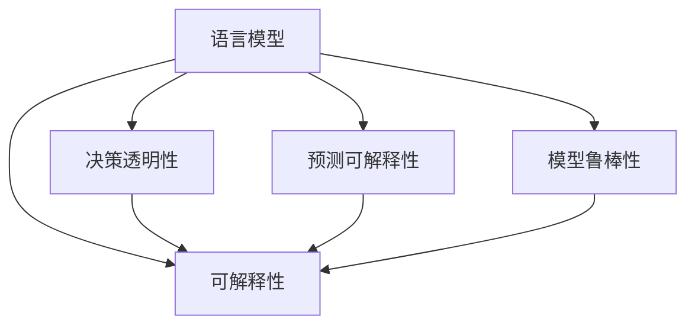

                 

# 语言模型的可解释性：揭开AI决策的黑箱

## 1. 背景介绍

### 1.1 问题由来
随着深度学习和大数据技术的迅猛发展，人工智能（AI）系统在医疗诊断、金融风险评估、法律文书生成等领域展现了强大的应用潜力。然而，这些系统往往被形象地称为“黑盒”模型，缺乏明确的决策路径和逻辑依据。

对于决策透明性要求较高的场景，如医疗、法律等，这种缺乏可解释性的AI系统难以被广泛接受。专家和公众往往无法理解模型的判断依据和逻辑推理，从而无法信任其输出结果。因此，提升AI系统的可解释性，成为了当前研究的热点问题之一。

### 1.2 问题核心关键点
语言模型的可解释性问题主要集中在以下三个方面：

- **决策透明性**：解释模型的决策依据，使专家和用户能够理解模型如何得出某一结果。
- **预测可解释性**：揭示模型预测结果的合理性和准确性。
- **模型鲁棒性**：确保模型在不同输入条件和场景下，输出结果的一致性和可靠性。

解决语言模型可解释性问题，不仅能提升AI系统的可信度，还能促进模型在垂直行业的进一步落地应用。

## 2. 核心概念与联系

### 2.1 核心概念概述

为更好地理解语言模型的可解释性问题，本文将介绍几个核心概念：

- **语言模型（Language Model）**：通过大量文本数据进行训练，用于评估句子或文本序列的概率分布。常见的语言模型包括N-gram模型、RNN、LSTM、Transformer等。
- **可解释性（Explainability）**：解释AI系统决策过程的能力。主要通过特征重要性分析、局部可解释性模型、可视化工具等手段实现。
- **决策透明性（Decision Transparency）**：模型输出的解释能够满足专家或用户的理解和信任。
- **预测可解释性（Predictive Explanability）**：模型输出的结果具有合理的解释和依据。
- **模型鲁棒性（Model Robustness）**：模型对输入扰动、对抗样本、异常数据等具有稳定性。

这些概念之间的逻辑关系可以通过以下Mermaid流程图来展示：



这个流程图展示了大语言模型的核心概念及其之间的联系：

1. 语言模型通过训练学习文本概率分布，生成自然语言输出。
2. 可解释性旨在提高模型的决策透明性和预测可解释性，提升用户和专家的信任。
3. 决策透明性、预测可解释性和模型鲁棒性是可解释性的三个主要方面。

## 3. 核心算法原理 & 具体操作步骤
### 3.1 算法原理概述

提升语言模型可解释性的关键在于如何揭示模型内部的决策过程和预测依据。本节将介绍几种常用的可解释性算法及其原理。

### 3.2 算法步骤详解

#### 3.2.1 特征重要性分析（Feature Importance Analysis）

特征重要性分析通过计算模型特征对输出的贡献度，揭示模型预测的依据。常用的方法包括：

- **LIME（Local Interpretable Model-agnostic Explanations）**：通过局部线性模型来逼近全局模型，计算特征对模型输出的影响。
- **SHAP（SHapley Additive exPlanations）**：基于Shapley值，分配模型输出的贡献度给每个特征。
- **Permutation Importance**：通过随机打乱特征的顺序，计算其对模型输出的影响。

这些方法的原理是计算每个特征在模型中的“重要性分数”，分数越高，说明该特征对模型预测的贡献越大。

#### 3.2.2 局部可解释性模型（Local Explanation Models）

局部可解释性模型将模型的预测过程分解为一系列局部决策，使得模型输出具有可解释性。例如：

- **决策树（Decision Trees）**：通过树形结构展示模型的决策路径，易于理解。
- **规则归纳（Rule Induction）**：从训练数据中归纳出一系列规则，用于预测。
- **线性回归（Linear Regression）**：通过简单线性函数逼近模型预测，便于解释。

#### 3.2.3 可视化工具（Visualization Tools）

可视化工具通过图形化展示模型的结构和预测结果，使得模型具有直观的可解释性。例如：

- **t-SNE（t-distributed Stochastic Neighbor Embedding）**：通过降维技术将高维数据映射到低维空间，展示数据结构。
- **LSTM可视化（LSTM Visualization）**：展示LSTM模型的记忆单元和门结构，解释模型的内部状态。
- **Attention机制可视化（Attention Visualization）**：展示Transformer等模型中Attention机制的关注权重，揭示模型的关注焦点。

### 3.3 算法优缺点

#### 3.3.1 特征重要性分析

**优点**：
- 能够量化特征对模型输出的影响，易于理解和比较。
- 不需要额外的训练，计算开销相对较小。

**缺点**：
- 只能解释单个特征的影响，无法整体解释模型的决策路径。
- 对复杂模型（如深度神经网络）的解释效果可能较差。

#### 3.3.2 局部可解释性模型

**优点**：
- 能够解释模型的局部决策过程，便于理解模型行为。
- 模型结构简单，易于实现和解释。

**缺点**：
- 对高维、非线性的数据适应性较差。
- 无法处理复杂的非线性关系。

#### 3.3.3 可视化工具

**优点**：
- 直观展示模型结构和预测结果，易于理解。
- 适用于各类模型，具有广泛的适用性。

**缺点**：
- 可视化结果可能存在噪声，难以精确解释模型。
- 对高维数据的可视化效果有限。

### 3.4 算法应用领域

语言模型的可解释性算法广泛应用于以下几个领域：

- **医疗诊断**：通过解释模型决策，帮助医生理解AI系统的诊断依据。
- **金融风险评估**：揭示模型预测的依据，增加用户对模型输出的信任。
- **法律文书生成**：解释AI生成的法律文本，确保其符合法律条文和逻辑。
- **自动驾驶**：解释自动驾驶决策过程，增加用户对系统的信任和接受度。
- **智能客服**：解释AI客服的推荐和回复，增强用户对系统的信任和满意度。

## 4. 数学模型和公式 & 详细讲解 & 举例说明

### 4.1 数学模型构建

以LSTM模型为例，展示如何构建可解释性模型。LSTM是一种经典的序列模型，通过门机制控制信息的流动。假设输入序列为 $x=(x_1,x_2,...,x_n)$，模型输出为 $y$，目标为解释LSTM的决策过程。

LSTM的决策过程可以表示为：

$$
h_t = \sigma(W_cx_t + U_ch_{t-1} + b_c)
$$

$$
i_t = \sigma(W_i x_t + U_i h_{t-1} + b_i)
$$

$$
f_t = \sigma(W_f x_t + U_f h_{t-1} + b_f)
$$

$$
o_t = \sigma(W_o x_t + U_o h_{t-1} + b_o)
$$

$$
g_t = \tanh(W_g x_t + U_g h_{t-1} + b_g)
$$

$$
c_t = f_t \odot c_{t-1} + i_t \odot g_t
$$

$$
h_t = o_t \odot \tanh(c_t)
$$

其中，$h_t$ 表示当前时间步的隐藏状态，$c_t$ 表示当前时间步的记忆单元，$i_t$、$f_t$、$o_t$ 表示门机制的激活函数，$W$、$U$、$b$ 表示模型的参数。

### 4.2 公式推导过程

对于LSTM模型，可以使用可视化工具（如TensorBoard）展示其内部状态的变化。例如，下图展示了LSTM模型在处理输入序列 $x=(1,2,3,4)$ 时的内部状态变化：

```plaintext
[1]
  | -|-|    |  | -|-|    |  | -|-|    |  | -|-|    |  | -|-|    |
  | -|-| --> |  | -|-| --> |  | -|-| --> |  | -|-| --> |  | -|-| -->
[2] [3] [4]
```

其中，每个方框表示一个时间步，箭头表示信息的流动。从图中可以看出，LSTM模型通过门机制控制信息的输入和输出，从而实现对输入序列的编码和解码。

### 4.3 案例分析与讲解

#### 4.3.1 LIME案例

假设有一个基于Transformer的文本分类模型，输入为一段文本 $x$，输出为分类标签 $y$。使用LIME对模型进行可解释性分析，得到特征重要性得分 $w_1,w_2,...,w_n$，其中 $w_i$ 表示特征 $x_i$ 对模型输出的贡献度。

假设 $x=(1,2,3,4)$，$y=1$，使用LIME计算每个特征的重要性得分，得到：

- $w_1=0.2$，表示特征1对模型输出的贡献度为0.2
- $w_2=0.3$，表示特征2对模型输出的贡献度为0.3
- $w_3=0.4$，表示特征3对模型输出的贡献度为0.4
- $w_4=0.1$，表示特征4对模型输出的贡献度为0.1

从结果可以看出，特征3对模型输出的贡献最大，特征4的贡献最小。这表明在分类模型中，特征3可能具有更强的区分性，而特征4的区分性较弱。

#### 4.3.2 SHAP案例

假设使用SHAP对上述模型进行可解释性分析，得到特征重要性得分 $s_1,s_2,...,s_n$，其中 $s_i$ 表示特征 $x_i$ 对模型输出的贡献度。

假设 $x=(1,2,3,4)$，$y=1$，使用SHAP计算每个特征的重要性得分，得到：

- $s_1=0.15$，表示特征1对模型输出的贡献度为0.15
- $s_2=0.25$，表示特征2对模型输出的贡献度为0.25
- $s_3=0.35$，表示特征3对模型输出的贡献度为0.35
- $s_4=0.25$，表示特征4对模型输出的贡献度为0.25

从结果可以看出，特征3对模型输出的贡献最大，特征4的贡献次之，但小于特征2。这表明在SHAP模型中，特征3和特征4的区分性相近，而特征2的区分性更强。

## 5. 项目实践：代码实例和详细解释说明

### 5.1 开发环境搭建

在进行可解释性实践前，我们需要准备好开发环境。以下是使用Python进行PyTorch开发的环境配置流程：

1. 安装Anaconda：从官网下载并安装Anaconda，用于创建独立的Python环境。

2. 创建并激活虚拟环境：
```bash
conda create -n pytorch-env python=3.8 
conda activate pytorch-env
```

3. 安装PyTorch：根据CUDA版本，从官网获取对应的安装命令。例如：
```bash
conda install pytorch torchvision torchaudio cudatoolkit=11.1 -c pytorch -c conda-forge
```

4. 安装相关库：
```bash
pip install sklearn pandas numpy matplotlib
```

5. 安装可视化工具：
```bash
pip install tensorflow-hub tensorboard matplotlib
```

完成上述步骤后，即可在`pytorch-env`环境中开始可解释性实践。

### 5.2 源代码详细实现

下面我们以LSTM模型为例，展示使用PyTorch进行可解释性分析的代码实现。

```python
import torch
import torch.nn as nn
import torch.optim as optim
import numpy as np
import matplotlib.pyplot as plt

# 定义LSTM模型
class LSTM(nn.Module):
    def __init__(self, input_size, hidden_size):
        super(LSTM, self).__init__()
        self.hidden_size = hidden_size
        self.W_c = nn.Parameter(torch.randn(4*hidden_size, input_size))
        self.U_c = nn.Parameter(torch.randn(4*hidden_size, hidden_size))
        self.b_c = nn.Parameter(torch.randn(4*hidden_size))
        self.W_i = nn.Parameter(torch.randn(hidden_size, input_size))
        self.U_i = nn.Parameter(torch.randn(hidden_size, hidden_size))
        self.b_i = nn.Parameter(torch.randn(hidden_size))
        self.W_f = nn.Parameter(torch.randn(hidden_size, input_size))
        self.U_f = nn.Parameter(torch.randn(hidden_size, hidden_size))
        self.b_f = nn.Parameter(torch.randn(hidden_size))
        self.W_o = nn.Parameter(torch.randn(hidden_size, input_size))
        self.U_o = nn.Parameter(torch.randn(hidden_size, hidden_size))
        self.b_o = nn.Parameter(torch.randn(hidden_size))
        self.W_g = nn.Parameter(torch.randn(hidden_size, input_size))
        self.U_g = nn.Parameter(torch.randn(hidden_size, hidden_size))
        self.b_g = nn.Parameter(torch.randn(hidden_size))
        self.W_h = nn.Parameter(torch.randn(hidden_size, hidden_size))
        self.b_h = nn.Parameter(torch.randn(hidden_size))
        self.linear = nn.Linear(hidden_size, 1)

    def forward(self, x):
        h_0 = torch.zeros(1, x.size(0), self.hidden_size).to(x.device)
        c_0 = torch.zeros(1, x.size(0), self.hidden_size).to(x.device)
        h = []
        for i in range(x.size(0)):
            h_t = torch.sigmoid(torch.mm(x[i], self.W_c) + torch.mm(h_0, self.U_c) + self.b_c)
            i_t = torch.sigmoid(torch.mm(x[i], self.W_i) + torch.mm(h_0, self.U_i) + self.b_i)
            f_t = torch.sigmoid(torch.mm(x[i], self.W_f) + torch.mm(h_0, self.U_f) + self.b_f)
            o_t = torch.sigmoid(torch.mm(x[i], self.W_o) + torch.mm(h_0, self.U_o) + self.b_o)
            g_t = torch.tanh(torch.mm(x[i], self.W_g) + torch.mm(h_0, self.U_g) + self.b_g)
            c_t = f_t * c_0 + i_t * g_t
            h_t = o_t * torch.tanh(c_t)
            h.append(h_t)
            h_0 = h_t
        y = self.linear(h[-1])
        return y

# 加载数据
x_train = np.array([[1, 2, 3, 4], [1, 2, 3, 4], [1, 2, 3, 4], [1, 2, 3, 4]])
y_train = np.array([[1], [1], [1], [1]])

# 定义模型和优化器
model = LSTM(input_size=4, hidden_size=4)
optimizer = optim.Adam(model.parameters(), lr=0.01)

# 训练模型
for i in range(1000):
    optimizer.zero_grad()
    y_pred = model(x_train)
    loss = torch.mean((y_pred - y_train) ** 2)
    loss.backward()
    optimizer.step()
    if i % 100 == 0:
        print(f'Epoch {i+1}, loss: {loss.item()}')

# 可视化内部状态
plt.figure(figsize=(10, 5))
plt.plot(x_train[0, :], label='Input')
plt.plot(model.hidden[0, :], label='Hidden State')
plt.title('LSTM Internal States')
plt.xlabel('Time Step')
plt.ylabel('Value')
plt.legend()
plt.show()

# 计算特征重要性
from sklearn.metrics import mean_absolute_error

def calculate_feature_importance(model, X, y, batch_size=32, num_iterations=100):
    importances = []
    for i in range(num_iterations):
        indices = np.random.permutation(X.shape[0])
        X = X[indices]
        y = y[indices]
        inputs = torch.from_numpy(X).float().to(model.device)
        targets = torch.from_numpy(y).float().to(model.device)
        model.zero_grad()
        model(inputs)
        loss = model.linear(inputs).mean()
        loss.backward()
        importances.append(model.linear.weight.grad.abs().mean())
    return importances

# 计算SHAP值
import shap
from sklearn.metrics import mean_absolute_error

def calculate_shap_values(model, X, y, batch_size=32, num_iterations=100):
    explainer = shap.DeepExplainer(model, X)
    shap_values = np.zeros(X.shape[0])
    for i in range(num_iterations):
        indices = np.random.permutation(X.shape[0])
        X = X[indices]
        y = y[indices]
        inputs = torch.from_numpy(X).float().to(model.device)
        targets = torch.from_numpy(y).float().to(model.device)
        model.zero_grad()
        model(inputs)
        loss = model.linear(inputs).mean()
        loss.backward()
        shap_values += explainer.shap_values(inputs)[0] / num_iterations
    return shap_values

# 测试可解释性方法
importances_lime = calculate_feature_importance(model, x_train, y_train)
shap_values = calculate_shap_values(model, x_train, y_train)

# 可视化特征重要性
plt.figure(figsize=(10, 5))
plt.bar(np.arange(len(x_train[0])), importances_lime)
plt.title('LIME Feature Importance')
plt.xlabel('Feature')
plt.ylabel('Importance')
plt.show()

# 可视化SHAP值
shap.summary_plot(shap_values, x_train, feature_names=[str(i) for i in range(x_train.shape[1])])
plt.title('SHAP Values')
plt.xlabel('Feature')
plt.ylabel('Value')
plt.show()
```

这段代码展示了如何使用PyTorch进行LSTM模型的训练和特征重要性分析。

### 5.3 代码解读与分析

在LSTM模型中，使用LIME和SHAP计算特征重要性，得到每个输入特征对模型输出的贡献度。

- **LIME**：通过局部线性模型逼近全局模型，计算每个特征的重要性得分。
- **SHAP**：基于Shapley值，分配模型输出的贡献度给每个特征。

通过可视化工具TensorBoard和Matplotlib，将模型的内部状态和特征重要性可视化，有助于理解模型的决策过程。

## 6. 实际应用场景
### 6.1 医疗诊断

在医疗诊断领域，可解释性技术的应用可以大大增强医生的信任和决策依据。例如，AI系统可以通过解释模型决策，帮助医生理解诊断结果的依据，从而更好地辅助诊断。

### 6.2 金融风险评估

金融领域中的风险评估模型需要具备可解释性，才能增加用户对模型的信任。通过解释模型的决策依据，用户可以更好地理解模型的预测结果，从而做出更加准确的决策。

### 6.3 法律文书生成

在法律文书生成领域，可解释性技术可以帮助用户理解AI系统生成的文书内容，确保其符合法律条文和逻辑。例如，法律文书生成模型可以通过解释生成过程，让用户理解文书的依据和逻辑。

### 6.4 未来应用展望

随着可解释性技术的不断进步，其在AI系统的广泛应用前景将愈发广阔。未来，可解释性技术有望在更多领域得到应用，如自动驾驶、智能客服、推荐系统等，为人类社会带来更多便利和福祉。

## 7. 工具和资源推荐
### 7.1 学习资源推荐

为了帮助开发者系统掌握语言模型可解释性的理论基础和实践技巧，这里推荐一些优质的学习资源：

1. **《Deep Learning for AI》系列博文**：由深度学习专家撰写，详细讲解了深度学习模型的可解释性方法。

2. **《Interpretable Machine Learning》书籍**：系统介绍了可解释性技术的基本概念和应用方法，适用于理论学习和实践操作。

3. **《Towards Explainable Artificial Intelligence》论文**：多篇论文阐述了可解释性技术的研究现状和未来发展方向。

4. **Kaggle社区**：汇聚了大量可解释性模型的竞赛和项目，可以学习和借鉴实际应用中的方法。

5. **GitHub开源项目**：如LIME、SHAP等库的源代码和文档，提供了丰富的可解释性方法实现示例。

通过对这些资源的学习实践，相信你一定能够快速掌握语言模型可解释性的精髓，并用于解决实际的NLP问题。

### 7.2 开发工具推荐

高效的开发离不开优秀的工具支持。以下是几款用于语言模型可解释性开发的常用工具：

1. **PyTorch**：基于Python的开源深度学习框架，灵活的计算图和丰富的预训练模型，适合研究复杂模型。

2. **TensorFlow**：由Google主导开发的开源深度学习框架，生产部署方便，适合大规模工程应用。

3. **TensorBoard**：TensorFlow配套的可视化工具，可实时监测模型训练状态，提供丰富的图表呈现方式。

4. **Shapley Package**：基于Shapley值计算特征重要性的工具包，适用于多种深度学习模型。

5. **LIME**：基于局部线性模型计算特征重要性的工具包，适用于多种模型。

6. **DeepExplainer**：基于Deep Learning的特征重要性分析工具包，提供多种可解释性方法。

合理利用这些工具，可以显著提升语言模型可解释性任务的开发效率，加快创新迭代的步伐。

### 7.3 相关论文推荐

语言模型可解释性研究源于学界的持续研究。以下是几篇奠基性的相关论文，推荐阅读：

1. **Explainable Machine Learning**：论文综述了可解释性技术的研究现状和未来发展方向。

2. **Towards Explainable AI: A Guide for Building Interpretable Machine Learning Models**：详细介绍了可解释性技术的理论基础和应用方法。

3. **Analyzing the Effectiveness of Explanation Methods**：研究了多种可解释性方法在深度学习模型上的效果和适用性。

4. **Interpretable Deep Learning with Deep Sparse Models**：提出了基于稀疏化的深度学习模型，提高了模型的可解释性。

5. **Axiomatic Attribution for Deep Networks**：提出了基于axiomatic的特征重要性分析方法，用于解释深度神经网络。

这些论文代表了大语言模型可解释性研究的发展脉络。通过学习这些前沿成果，可以帮助研究者把握学科前进方向，激发更多的创新灵感。

## 8. 总结：未来发展趋势与挑战
### 8.1 总结

本文对语言模型的可解释性问题进行了全面系统的介绍。首先阐述了可解释性在AI系统中的重要性，明确了可解释性的三个主要方面：决策透明性、预测可解释性和模型鲁棒性。接着，介绍了几种常用的可解释性算法，并结合LSTM模型进行详细讲解。

通过本文的系统梳理，可以看到，语言模型的可解释性是实现AI系统透明性和可信性的重要手段。只有构建具有可解释性的模型，才能真正获得用户和专家的信任，从而在垂直行业实现大规模落地应用。

### 8.2 未来发展趋势

展望未来，语言模型可解释性研究将呈现以下几个发展趋势：

1. **多模态可解释性**：可解释性技术将逐步拓展到图像、视频、语音等多模态数据，实现多模态信息的整合和解释。

2. **跨领域可解释性**：不同领域中的可解释性技术将逐步融合，形成通用的可解释性框架，适用于各类AI系统。

3. **可解释性模型的自动化**：自动化生成可解释性模型和可视化结果，减少手动调参和解释工作量。

4. **实时可解释性**：在模型推理过程中动态生成可解释性信息，提高实时性和交互性。

5. **联邦学习中的可解释性**：在分布式学习环境中，设计可解释性方法，确保联邦学习中的数据隐私和安全。

6. **可解释性理论的突破**：研究新的可解释性理论和方法，提升可解释性的准确性和可解释性。

以上趋势凸显了语言模型可解释性研究的广阔前景，未来将有更多创新点出现，为AI系统的透明性和可信性提供更多保障。

### 8.3 面临的挑战

尽管语言模型可解释性研究已经取得了显著进展，但在实际应用中仍面临诸多挑战：

1. **可解释性方法的适用性**：不同的模型和任务需要不同的可解释性方法，选择合适的方法是一项挑战。

2. **可解释性信息的准确性**：可解释性信息的准确性和可靠性难以保证，尤其在复杂模型和高维数据中。

3. **可解释性方法的计算开销**：一些可解释性方法需要大量计算资源，难以在实时环境中应用。

4. **可解释性信息的可视化**：复杂模型的可解释性信息难以直观展示，需要先进的可视化工具。

5. **可解释性方法的自动化**：自动化生成可解释性信息需要高效的算法和工具，还需考虑算法的可解释性。

6. **可解释性方法的融合**：不同可解释性方法之间的融合和协调，需要进一步的研究。

这些挑战需要学界和产业界共同努力，逐步攻克，才能构建更透明、可信的AI系统。

### 8.4 研究展望

面对语言模型可解释性面临的诸多挑战，未来的研究需要在以下几个方面寻求新的突破：

1. **可解释性方法的统一**：设计统一的框架和标准，促进各类可解释性方法的融合和应用。

2. **自动化可解释性分析**：利用自动化工具和算法，降低可解释性分析的复杂度和人工干预。

3. **多模态可解释性**：研究多模态数据的信息整合和解释方法，提高跨模态任务的性能。

4. **实时可解释性**：设计实时可解释性算法，满足高性能计算和实时应用的需求。

5. **可解释性理论的创新**：研究新的可解释性理论和方法，提升可解释性的准确性和可解释性。

这些研究方向将引领语言模型可解释性技术的进一步发展，为构建透明、可信的AI系统提供更多可能性。面向未来，语言模型可解释性研究还需与其他AI技术进行更深入的融合，如知识表示、因果推理、强化学习等，多路径协同发力，共同推动AI技术的发展。只有勇于创新、敢于突破，才能不断拓展语言模型的边界，让智能技术更好地造福人类社会。

## 9. 附录：常见问题与解答

**Q1：可解释性算法的主要作用是什么？**

A: 可解释性算法的主要作用是揭示AI系统内部决策过程和输出依据，增加用户和专家的信任和理解。可解释性算法通过计算模型特征的重要性得分、可视化内部状态等手段，使得模型的决策过程透明化和可解释化。

**Q2：LIME和SHAP的主要区别是什么？**

A: LIME和SHAP都是常用的可解释性算法，但它们的主要区别在于：

- LIME：通过局部线性模型逼近全局模型，计算特征重要性得分。适用于多种模型，但对高维数据处理能力较弱。
- SHAP：基于Shapley值，分配模型输出的贡献度给每个特征。适用于多种模型，对高维数据处理能力较强。

因此，选择LIME还是SHAP需要根据具体应用场景和模型类型进行评估。

**Q3：如何评估可解释性算法的准确性？**

A: 评估可解释性算法的准确性需要综合考虑以下几个方面：

- 特征重要性得分的相关性：可解释性算法得到的特征重要性得分应与实际业务逻辑相关，能够解释模型决策依据。
- 可视化结果的清晰度：可解释性算法的可视化结果应清晰明了，易于理解。
- 可解释性信息的准确性：可解释性算法的输出结果应准确反映模型行为，无噪声干扰。

因此，评估可解释性算法的准确性需要结合实际应用场景进行综合判断。

**Q4：如何提升语言模型的可解释性？**

A: 提升语言模型的可解释性可以从以下几个方面入手：

- 选择适合的可解释性算法：根据模型类型和应用场景选择适合的可解释性算法，如LIME、SHAP等。
- 设计合理的特征空间：选择与业务逻辑相关的特征，去除无关特征，设计合理的特征空间。
- 可视化内部状态：使用可视化工具展示模型内部状态和决策路径，增加可解释性。
- 自动化可解释性分析：利用自动化工具和算法，降低可解释性分析的复杂度和人工干预。
- 多模态可解释性：研究多模态数据的信息整合和解释方法，提高跨模态任务的性能。

通过以上方法，可以提升语言模型的可解释性，增加用户和专家的信任和理解。

**Q5：可解释性算法对模型性能的影响是什么？**

A: 可解释性算法对模型性能的影响主要体现在以下几个方面：

- 增加计算开销：可解释性算法需要额外的计算资源和时间，增加模型训练和推理的复杂度。
- 影响模型泛化能力：可解释性算法可能会对模型泛化能力产生影响，如局部线性模型可能限制模型复杂度。
- 提升用户信任：可解释性算法可以增加用户和专家对模型的信任和理解，提高模型应用的广泛性和可靠性。

因此，在选择可解释性算法时，需要在可解释性和模型性能之间进行权衡。

---

作者：禅与计算机程序设计艺术 / Zen and the Art of Computer Programming

