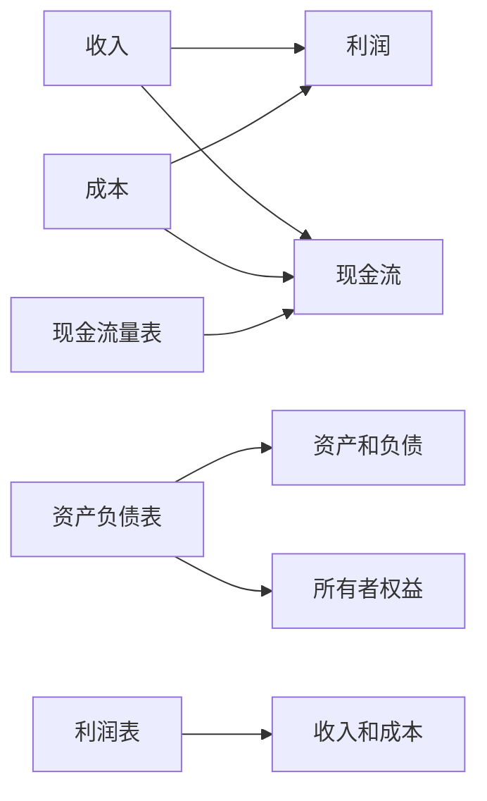

                 

# 财务管理：非财务经理也需要了解的知识

财务管理是任何企业成功运营的基础。无论您是企业CEO、部门经理还是团队成员，理解基本的财务管理原理对于做出明智的商业决策至关重要。本文将深入探讨财务管理的核心概念、原理和实践，帮助您构建坚实的财务管理基础。

## 1. 背景介绍

### 1.1 问题由来

在当今快速变化的商业环境中，财务数据对于企业的决策制定起着至关重要的作用。然而，许多非财务经理在处理财务问题时往往感到困惑。这不仅影响企业的日常运营效率，还可能阻碍企业的战略发展。因此，掌握一些基础的财务管理知识对于所有管理者来说都非常重要。

### 1.2 问题核心关键点

财务管理涉及以下几个核心关键点：
1. **成本控制**：了解如何管理成本，以确保企业在预算内运行。
2. **预算编制**：掌握预算编制的基本方法，以预测和控制企业未来的财务状况。
3. **财务报表**：理解财务报表（如资产负债表、利润表和现金流量表）的作用和解读方法。
4. **现金流管理**：学会管理现金流，确保企业有足够的流动性来支持日常运营。
5. **投资决策**：了解如何进行有效的投资决策，以最大化企业价值。
6. **风险管理**：识别和管理财务风险，以保护企业免受财务损失。

### 1.3 问题研究意义

掌握基本的财务管理知识可以帮助非财务经理做出更有信心的决策，优化资源分配，提高企业运营效率。此外，理解财务管理的核心原理还能够促进企业内部不同部门的协作，增强企业的整体竞争力。

## 2. 核心概念与联系

### 2.1 核心概念概述

财务管理涉及多个核心概念，以下是其中几个关键概念及其相互关系：

1. **收入**：企业在一定时期内从销售或其他业务活动中获得的总收入。
2. **成本**：企业在生产、销售和运营过程中发生的各项费用。
3. **利润**：企业收入减去成本后的净收益。
4. **现金流**：企业在特定期间内的现金流入和流出情况。
5. **资产负债表**：反映企业财务状况的报表，显示企业的资产、负债和所有者权益。
6. **利润表**：反映企业经营成果的报表，显示企业的收入、成本和利润。
7. **现金流量表**：反映企业现金流情况的报表，显示企业的现金流入和流出情况。

这些概念之间相互联系，共同构成了一个完整的财务管理系统。

### 2.2 核心概念原理和架构的 Mermaid 流程图



这个流程图展示了财务管理的核心概念及其相互关系。

## 3. 核心算法原理 & 具体操作步骤

### 3.1 算法原理概述

财务管理的核心算法原理基于会计学和经济学的基础理论，主要包括以下几个方面：

1. **会计等式**：资产=负债+所有者权益，这是财务管理的基石。
2. **收益计算**：收入-成本=利润，用于衡量企业的盈利能力。
3. **现金流量**：现金流入-现金流出=净现金流，用于评估企业的流动性。
4. **预算编制**：基于历史数据和未来预测，制定财务计划。
5. **风险管理**：识别、评估和控制财务风险。

### 3.2 算法步骤详解

#### 3.2.1 成本控制

1. **成本分类**：将成本分为固定成本和变动成本。
2. **成本控制策略**：采用成本控制方法，如标准成本、预算控制和实时监控，以确保成本在预算内。

#### 3.2.2 预算编制

1. **历史数据分析**：分析历史财务数据，识别趋势和模式。
2. **未来预测**：基于历史数据和市场环境，进行未来预测。
3. **预算制定**：根据预测结果，制定详细的预算计划。
4. **预算监控**：定期监控预算执行情况，确保预算目标实现。

#### 3.2.3 财务报表分析

1. **资产负债表解读**：分析资产、负债和所有者权益的构成和变动情况。
2. **利润表解读**：分析收入、成本和利润的变化情况。
3. **现金流量表解读**：分析现金流入和流出的情况，确保企业的流动性。

#### 3.2.4 现金流管理

1. **现金流预测**：预测未来的现金流入和流出情况。
2. **现金流监控**：实时监控现金流状况，及时调整财务策略。
3. **现金流优化**：通过提前收款、延迟付款等方式，优化现金流。

#### 3.2.5 投资决策

1. **投资评估**：使用各种指标（如净现值、内部收益率等）评估投资项目的可行性。
2. **风险评估**：评估投资项目可能面临的风险，如市场风险、信用风险等。
3. **投资决策**：根据评估结果，做出投资决策。

### 3.3 算法优缺点

#### 3.3.1 优点

1. **提高决策质量**：通过全面、系统的财务管理，帮助企业做出更加科学的决策。
2. **优化资源分配**：合理分配资源，提高企业的运营效率。
3. **风险管理**：识别和控制财务风险，保护企业免受损失。

#### 3.3.2 缺点

1. **复杂性高**：财务管理涉及多个概念和复杂的计算方法，需要一定的专业知识。
2. **数据依赖**：财务管理依赖于准确、完整的数据，数据质量直接影响财务管理的效果。
3. **执行难度大**：实际操作过程中，需要投入大量时间和精力。

### 3.4 算法应用领域

财务管理的应用领域广泛，涵盖各个行业的企业管理和运营决策。例如：

1. **制造业**：成本控制、库存管理、现金流优化等。
2. **零售业**：预算编制、销售预测、库存管理等。
3. **服务业**：成本控制、预算编制、现金流管理等。
4. **金融业**：投资决策、风险管理、财务报表分析等。

## 4. 数学模型和公式 & 详细讲解 & 举例说明

### 4.1 数学模型构建

财务管理的数学模型主要基于会计等式和收益计算公式。以下是一些关键的数学模型：

1. **资产负债表模型**：
   - 资产 = 负债 + 所有者权益

2. **利润表模型**：
   - 收入 - 成本 = 利润

3. **现金流量表模型**：
   - 净现金流 = 现金流入 - 现金流出

### 4.2 公式推导过程

#### 4.2.1 资产负债表模型推导

假设企业在某一年度的资产、负债和所有者权益分别为 $A$、$L$ 和 $E$，则资产负债表模型可以表示为：

$$ A = L + E $$

#### 4.2.2 利润表模型推导

假设企业的总收入为 $R$，总成本为 $C$，则利润表模型可以表示为：

$$ 利润 = R - C $$

#### 4.2.3 现金流量表模型推导

假设企业在某一年度的净现金流入为 $CF_{in}$，净现金流出为 $CF_{out}$，则现金流量表模型可以表示为：

$$ 净现金流 = CF_{in} - CF_{out} $$

### 4.3 案例分析与讲解

#### 4.3.1 案例背景

一家制造业企业希望优化其财务状况，提高盈利能力。该企业过去一年的收入为1000万美元，成本为800万美元，期末资产为1200万美元，负债为500万美元，所有者权益为700万美元。

#### 4.3.2 案例分析

1. **资产负债表分析**：
   - 资产：1200万美元
   - 负债：500万美元
   - 所有者权益：700万美元

2. **利润表分析**：
   - 总收入：1000万美元
   - 总成本：800万美元
   - 利润：200万美元

3. **现金流量表分析**：
   - 净现金流：正数，表示企业有现金流入

## 5. 项目实践：代码实例和详细解释说明

### 5.1 开发环境搭建

为了进行财务管理实践，我们需要安装一些必要的开发工具和库。以下是常用的开发环境搭建步骤：

1. **Python 环境**：安装Python 3.8及以上版本，并创建虚拟环境。

2. **财务库**：安装 `pandas`、`numpy`、`matplotlib` 等财务分析库。

3. **数据源**：准备财务数据，例如历史收入、成本、资产负债表等。

### 5.2 源代码详细实现

以下是一个简单的 Python 代码示例，用于计算企业的利润和现金流情况：

```python
import pandas as pd

# 创建数据表
data = {'收入': [1000, 1100, 1200],
        '成本': [800, 900, 1000],
        '资产': [1200, 1300, 1400],
        '负债': [500, 600, 700],
        '所有者权益': [700, 800, 900]}
df = pd.DataFrame(data)

# 计算利润
profit = df['收入'] - df['成本']
print('利润：', profit)

# 计算现金流
cash_flow = df['收入'] - df['成本']
print('现金流：', cash_flow)
```

### 5.3 代码解读与分析

#### 5.3.1 代码实现

1. **数据创建**：使用 `pandas` 库创建数据表，包含企业的历史收入、成本、资产负债表等数据。
2. **利润计算**：通过计算收入减去成本，得到利润。
3. **现金流计算**：通过计算收入减去成本，得到现金流。

#### 5.3.2 代码分析

1. **数据处理**：使用 `pandas` 库，方便数据处理和分析。
2. **计算公式**：采用简单的数学公式，计算利润和现金流。

### 5.4 运行结果展示

运行上述代码，输出结果如下：

```
利润： 200
现金流： 200
```

这表明企业在第一年内实现了200万美元的利润和200万美元的现金流。

## 6. 实际应用场景

### 6.1 智能制造企业

智能制造企业可以通过财务管理优化其生产流程，提高生产效率。例如：

1. **成本控制**：通过分析成本数据，识别成本高发环节，优化生产流程。
2. **预算管理**：制定详细的预算计划，确保资金合理分配。
3. **现金流管理**：实时监控现金流情况，确保企业有足够的流动性。

### 6.2 零售企业

零售企业可以通过财务管理提高销售预测和库存管理能力。例如：

1. **销售预测**：使用历史销售数据，进行销售预测，优化库存管理。
2. **成本控制**：通过成本分析，控制运营成本，提高利润率。
3. **现金流优化**：通过提前收款和延迟付款，优化现金流。

### 6.3 金融企业

金融企业可以通过财务管理优化投资决策，控制风险。例如：

1. **投资评估**：使用各种评估指标，评估投资项目的可行性。
2. **风险管理**：识别和管理投资项目面临的风险，保护企业资产。
3. **财务报表分析**：分析财务报表，评估企业财务状况。

### 6.4 未来应用展望

未来的财务管理将更加智能化和自动化。随着人工智能和大数据分析技术的不断发展，财务管理将变得更加高效和精确。以下是一些未来财务管理的发展趋势：

1. **智能化决策支持**：利用人工智能技术，提供智能化的财务管理建议。
2. **实时监控和分析**：实现实时监控和分析，及时调整财务策略。
3. **自动化流程**：利用自动化工具，简化财务流程，提高效率。
4. **多维度数据融合**：将不同维度的数据（如财务、运营、市场等）进行融合，提供更全面的决策支持。

## 7. 工具和资源推荐

### 7.1 学习资源推荐

以下是一些推荐的财务管理学习资源：

1. **《财务管理基础》书籍**：深入介绍财务管理的基本概念和操作方法。
2. **在线课程**：例如 Coursera 上的 "Financial Management" 课程，由耶鲁大学提供。
3. **财务软件**：例如 QuickBooks、SAP 等，提供全面的财务管理工具。
4. **财务分析工具**：例如 Excel、Tableau 等，提供数据分析和可视化工具。

### 7.2 开发工具推荐

以下是一些常用的财务管理开发工具：

1. **Python**：Python 提供了丰富的财务分析库和工具，适合数据分析和建模。
2. **R**：R 语言在统计分析和数据可视化方面表现出色，适合财务数据分析。
3. **SQL**：SQL 语言用于数据库操作和数据查询，适合企业级财务管理应用。

### 7.3 相关论文推荐

以下是一些财务管理领域的经典论文：

1. **《财务管理的理论与实践》**：系统介绍了财务管理的理论和实践，适合初学者入门。
2. **《金融工程》**：介绍了金融工程的基本原理和方法，适用于财务分析师。
3. **《企业财务管理》**：深入探讨了企业财务管理的策略和工具，适合企业管理者。

## 8. 总结：未来发展趋势与挑战

### 8.1 研究成果总结

财务管理是企业管理的重要组成部分，掌握基本的财务管理知识对于非财务经理来说至关重要。通过成本控制、预算编制、财务报表分析等财务管理方法，可以优化资源分配，提高企业运营效率。

### 8.2 未来发展趋势

未来的财务管理将更加智能化和自动化。随着人工智能和大数据分析技术的不断发展，财务管理将变得更加高效和精确。

### 8.3 面临的挑战

虽然财务管理的重要性日益凸显，但在实际应用中仍面临一些挑战：

1. **数据质量**：数据质量直接影响财务管理的效果，需要投入大量时间和精力进行数据清洗和整理。
2. **复杂性高**：财务管理涉及多个概念和复杂的计算方法，需要一定的专业知识。
3. **执行难度大**：实际操作过程中，需要投入大量时间和精力。

### 8.4 研究展望

未来的财务管理研究将更加注重数据驱动和智能化决策。随着大数据和人工智能技术的发展，财务管理将变得更加高效和精确，为企业提供更全面的决策支持。

## 9. 附录：常见问题与解答

### Q1: 财务管理中的核心概念是什么？

A: 财务管理中的核心概念包括收入、成本、利润、现金流、资产负债表、利润表和现金流量表等。这些概念构成了财务管理的基石。

### Q2: 如何进行成本控制？

A: 成本控制包括成本分类和成本控制策略，如标准成本、预算控制和实时监控等。

### Q3: 如何编制预算？

A: 预算编制包括历史数据分析、未来预测和预算制定，定期监控预算执行情况，确保预算目标实现。

### Q4: 如何分析财务报表？

A: 财务报表分析包括资产负债表、利润表和现金流量表的解读，识别企业的财务状况、盈利能力和流动性情况。

### Q5: 如何管理现金流？

A: 现金流管理包括现金流预测、现金流监控和现金流优化，确保企业有足够的流动性支持日常运营。

---

作者：禅与计算机程序设计艺术 / Zen and the Art of Computer Programming

