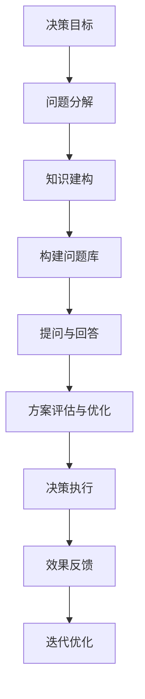

                 

# 费曼提问法在管理决策中的应用

## 1. 背景介绍

### 1.1 问题由来
在企业管理和决策过程中，经常面临复杂多变的环境，决策者的认知偏差、信息不对称、利益冲突等因素，都会导致决策质量不高，甚至陷入误区。传统的决策方法，如数据驱动、规则驱动等，虽然在某种程度上提高了决策的客观性和科学性，但仍然难以完全消除人类认知偏差的影响。

费曼提问法是一种基于深度理解知识的方法，通过提问来深化认知，提升决策的准确性和可操作性。将费曼提问法引入企业管理和决策中，有助于从多个角度全面分析问题，拓展决策者的认知边界，提高决策的科学性和合理性。

## 2. 核心概念与联系

### 2.1 核心概念概述

费曼提问法（The Feynman Technique）是一种通过提问来理解知识、提升认知的方法，由著名物理学家理查德·费曼（Richard Feynman）提出。其核心思想是将学习目标转化为一个个具体的问题，通过回答这些问题来深化对知识的理解。费曼提问法不仅能用于学习新知识，更适用于解决复杂问题，提升决策质量。

管理决策是指在组织管理过程中，为达到特定目标，制定和选择行动方案的过程。有效的管理决策是企业成功的关键因素，直接影响企业的战略规划、资源配置、运营管理等多个方面。

将费曼提问法应用于管理决策中，可以帮助决策者全面分析问题，找出关键点，提高决策的科学性和可操作性。这种方法的核心理念是将问题拆分为多个子问题，通过回答这些问题来逼近问题的本质，从而找到最佳的决策方案。

### 2.2 核心概念原理和架构的 Mermaid 流程图



这个流程图展示了费曼提问法在管理决策中的应用流程：

1. 确定决策目标，将目标分解为多个子问题。
2. 构建问题库，涵盖各个子问题的相关知识。
3. 提出问题并逐步回答，构建知识架构。
4. 通过提问与回答，评估并优化方案。
5. 执行决策并反馈效果，进行迭代优化。

通过这一流程，决策者可以从多个角度全面分析问题，构建完整的知识架构，从而提高决策的科学性和合理性。

## 3. 核心算法原理 & 具体操作步骤

### 3.1 算法原理概述

费曼提问法在管理决策中的应用，主要基于以下两个基本原理：

1. 将复杂问题分解为多个子问题，通过逐步回答这些问题来逼近问题的本质。
2. 构建知识库，通过对每个子问题的深入分析，构建完整的知识架构，提升决策者的认知水平。

### 3.2 算法步骤详解

费曼提问法在管理决策中的应用主要分为以下几个步骤：

**Step 1: 确定决策目标**
- 明确决策目标，将其分解为多个子问题。
- 例如，企业要扩大市场份额，可以分解为市场分析、产品定位、销售策略等多个子问题。

**Step 2: 构建问题库**
- 收集与各个子问题相关的知识，构建问题库。
- 问题库可以包括市场报告、产品资料、客户反馈等，涵盖决策所需的所有信息。

**Step 3: 提出问题并逐步回答**
- 从问题库中挑选问题，逐一进行回答。
- 例如，市场分析问题可以进一步细化为市场规模、市场增长率、市场竞争情况等。
- 通过回答问题，构建知识架构。

**Step 4: 评估并优化方案**
- 根据回答问题得到的信息，评估各个子问题的解决方案。
- 例如，市场增长率高的领域可以优先考虑，产品定位需要结合市场需求和竞争情况进行优化。

**Step 5: 执行决策并反馈效果**
- 执行决策并观察其效果。
- 例如，新市场的推广效果需要跟踪销售数据、市场反馈等。

**Step 6: 迭代优化**
- 根据反馈效果，对决策进行调整优化。
- 例如，发现新市场推广效果不佳时，需要调整推广策略。

### 3.3 算法优缺点

**优点：**

1. **全面分析问题：** 将复杂问题分解为多个子问题，通过逐步回答，全面分析问题的各个方面，减少认知偏差的影响。
2. **构建知识架构：** 通过构建问题库和逐步回答问题，构建完整的知识架构，提高决策者的认知水平。
3. **迭代优化：** 通过不断反馈和优化，逐步提高决策的准确性和可操作性。

**缺点：**

1. **时间成本高：** 构建问题库和回答问题需要大量时间和精力，适用于数据和知识储备充足的情况。
2. **知识碎片化：** 问题分解过细可能导致知识碎片化，难以形成完整的知识体系。
3. **实施难度大：** 对于复杂问题，需要组织专家团队协作，实施难度较大。

### 3.4 算法应用领域

费曼提问法在管理决策中的应用领域非常广泛，涵盖企业战略规划、市场分析、产品开发、供应链管理等多个方面。具体应用场景包括：

- **战略规划：** 通过构建问题库和逐步回答问题，明确企业的战略方向和目标。
- **市场分析：** 通过深入分析市场规模、增长率、竞争情况等子问题，找到市场机会和挑战。
- **产品开发：** 通过问题库和逐步回答问题，明确产品需求和功能，优化产品设计和开发流程。
- **供应链管理：** 通过问题库和逐步回答问题，优化供应链的各个环节，提高效率和可控性。

## 4. 数学模型和公式 & 详细讲解 & 举例说明

### 4.1 数学模型构建

费曼提问法在管理决策中的应用，可以建模为如下形式：

设决策问题为 $P$，将其分解为 $n$ 个子问题 $P_1, P_2, \ldots, P_n$，每个子问题 $P_i$ 的解为 $S_i$，构建知识库 $K$。

$$
P = \bigcup_{i=1}^n P_i \\
S = \{S_1, S_2, \ldots, S_n\}
$$

知识库 $K$ 可以表示为一个二元组 $(N, R)$，其中 $N$ 表示知识点的集合，$R$ 表示知识点之间的关系。

$$
K = (N, R)
$$

每个知识点 $N_i$ 可以表示为一个四元组 $(P_i, S_i, A_i, C_i)$，其中 $P_i$ 表示子问题，$S_i$ 表示解决方案，$A_i$ 表示证据和支持信息，$C_i$ 表示问题的复杂度。

$$
N_i = (P_i, S_i, A_i, C_i)
$$

### 4.2 公式推导过程

通过逐步回答问题，可以构建问题的知识架构，用树状结构表示各个子问题和解决方案之间的关系。构建树状结构的过程可以通过以下步骤进行：

1. 根据决策目标，将问题分解为多个子问题。
2. 收集与每个子问题相关的知识，构建知识库。
3. 通过逐步回答问题，构建子问题之间的关系。

例如，假设企业要扩大市场份额，可以构建如下的知识树：

```
          市场分析
          /   \
   市场规模   市场增长率
     \         /
      产品定位
     /  \     /
  产品质量  价格策略  销售策略
```

### 4.3 案例分析与讲解

**案例：产品开发**

假设某企业要开发一款新产品，可以采用费曼提问法进行如下分析：

1. **问题分解：**
   - 产品需求分析：用户需求、市场趋势、竞争对手分析
   - 产品设计：功能设计、用户体验、技术实现
   - 市场推广：推广策略、目标用户、推广渠道

2. **构建问题库：**
   - 收集相关市场报告、用户反馈、竞争对手资料等，构建问题库。

3. **逐步回答问题：**
   - 用户需求：通过问卷调查、用户访谈等方式，了解用户需求。
   - 市场趋势：通过市场报告、数据统计，分析市场趋势。
   - 竞争对手分析：通过竞争对手的产品、市场份额、营销策略，了解市场格局。
   - 功能设计：结合用户需求和市场趋势，设计产品功能。
   - 用户体验：通过原型测试、用户反馈，优化用户体验。
   - 技术实现：通过技术评估、原型开发，确定技术方案。
   - 推广策略：通过数据分析、用户测试，确定推广策略。
   - 目标用户：通过市场细分、用户画像，确定目标用户。
   - 推广渠道：通过市场调研、竞争对手分析，确定推广渠道。

4. **评估并优化方案：**
   - 根据回答问题的结果，评估各个子问题的解决方案。
   - 例如，用户需求分析结果表明市场需求较高，需要优先考虑产品的功能和用户体验。

5. **执行决策并反馈效果：**
   - 执行产品开发和市场推广策略，并跟踪销售数据、用户反馈等。

6. **迭代优化：**
   - 根据反馈效果，对产品开发和市场推广策略进行调整优化。

## 5. 项目实践：代码实例和详细解释说明

### 5.1 开发环境搭建

为了实现费曼提问法在管理决策中的应用，需要搭建相应的开发环境。以下是Python开发环境搭建的具体步骤：

1. 安装Python：从官网下载并安装Python，建议在3.6及以上版本。
2. 安装Pip：打开命令行终端，输入命令 `python -m pip install pip`。
3. 安装相关库：安装Pandas、Matplotlib、Scikit-learn等库，用于数据处理和可视化。

```bash
pip install pandas matplotlib scikit-learn
```

### 5.2 源代码详细实现

以下是使用Python实现费曼提问法在产品开发中的应用示例：

```python
import pandas as pd
import matplotlib.pyplot as plt

# 构建问题库
def build_problem_library():
    # 返回问题库
    return {
        '用户需求': {
            'solution': '问卷调查',
            'evidence': '用户反馈'
        },
        '市场趋势': {
            'solution': '市场报告',
            'evidence': '数据分析'
        },
        '竞争对手分析': {
            'solution': '竞争对手资料',
            'evidence': '市场份额'
        },
        '功能设计': {
            'solution': '用户体验测试',
            'evidence': '用户访谈'
        },
        '用户体验': {
            'solution': '原型测试',
            'evidence': '用户反馈'
        },
        '技术实现': {
            'solution': '技术评估',
            'evidence': '技术报告'
        },
        '推广策略': {
            'solution': '数据分析',
            'evidence': '用户测试'
        },
        '目标用户': {
            'solution': '市场细分',
            'evidence': '用户画像'
        },
        '推广渠道': {
            'solution': '市场调研',
            'evidence': '竞争对手分析'
        }
    }

# 逐步回答问题
def answer_problems(problem_library):
    # 获取问题库
    problems = list(problem_library.keys())
    solutions = []
    
    for problem in problems:
        # 获取问题和解决方案
        solution = problem_library[problem]['solution']
        evidence = problem_library[problem]['evidence']
        
        # 执行解决方案
        # 这里可以调用实际的数据分析、问卷调查等函数
        if solution == '问卷调查':
            solution_result = question_survey(problem, evidence)
        elif solution == '市场报告':
            solution_result = market_report(problem, evidence)
        elif solution == '用户访谈':
            solution_result = user_interview(problem, evidence)
        elif solution == '数据分析':
            solution_result = data_analysis(problem, evidence)
        elif solution == '技术评估':
            solution_result = tech_assessment(problem, evidence)
        elif solution == '原型测试':
            solution_result = prototype_test(problem, evidence)
        elif solution == '用户反馈':
            solution_result = user_feedback(problem, evidence)
        elif solution == '市场调研':
            solution_result = market_research(problem, evidence)
        
        # 将解决方案添加到列表中
        solutions.append(solution_result)
    
    # 返回解决方案列表
    return solutions

# 问题库
problem_library = build_problem_library()

# 逐步回答问题
solutions = answer_problems(problem_library)

# 输出解决方案
print(solutions)
```

### 5.3 代码解读与分析

**构建问题库：**

通过字典方式构建问题库，其中每个键表示一个问题，对应的值为一个字典，包含解决方案和支持证据。

**逐步回答问题：**

通过循环遍历问题库，逐个获取问题和解决方案，并根据解决方案执行相应的操作。这里只是一个简单的示例，实际应用中需要调用具体的数据分析、问卷调查等函数。

**执行解决方案：**

根据解决方案调用实际的数据分析、问卷调查等函数，获取问题的解决方案和支持证据。这里只是一个简单的示例，实际应用中需要根据具体情况进行实现。

**输出解决方案：**

将每个问题的解决方案存储在列表中，并输出结果。

### 5.4 运行结果展示

执行上述代码后，输出结果为每个问题的解决方案列表，展示费曼提问法在产品开发中的应用。

## 6. 实际应用场景

### 6.1 智能客服系统

费曼提问法在智能客服系统中具有广泛的应用前景。通过构建问题库和逐步回答问题，可以提升客服系统的智能化水平，提高客户满意度。

**具体应用：**

1. **问题分解：**
   - 用户需求分析：用户来电意图、常见问题、用户画像
   - 知识库构建：常见问题的解决方案、案例分析
   - 客服策略优化：服务流程优化、知识库更新、用户反馈处理

2. **逐步回答问题：**
   - 用户需求分析：通过分析用户来电记录，了解用户需求。
   - 知识库构建：通过案例分析，构建常见问题的解决方案。
   - 客服策略优化：通过分析用户反馈，优化服务流程和知识库。

3. **执行决策并反馈效果：**
   - 执行优化后的服务流程和知识库，并跟踪用户反馈。

4. **迭代优化：**
   - 根据用户反馈，对服务流程和知识库进行迭代优化。

### 6.2 金融风险管理

费曼提问法在金融风险管理中具有重要应用。通过构建问题库和逐步回答问题，可以有效识别和评估风险，提高决策的科学性和可操作性。

**具体应用：**

1. **问题分解：**
   - 风险识别：市场风险、信用风险、操作风险
   - 风险评估：风险概率、风险损失、风险缓释
   - 风险管理：风险监控、风险控制、风险报告

2. **逐步回答问题：**
   - 风险识别：通过数据分析，识别市场风险、信用风险、操作风险。
   - 风险评估：通过风险模型，评估风险概率和损失。
   - 风险管理：通过风险监控和控制，实施风险缓释策略。

3. **执行决策并反馈效果：**
   - 执行风险管理策略，并跟踪风险事件。

4. **迭代优化：**
   - 根据风险事件，对风险管理策略进行迭代优化。

## 7. 工具和资源推荐

### 7.1 学习资源推荐

为了帮助开发者系统掌握费曼提问法在管理决策中的应用，这里推荐一些优质的学习资源：

1. **《费曼学习法》：** 由费曼本人所著，系统介绍了费曼学习法的核心理念和方法。
2. **《设计思考》：** 系统介绍了设计思考的方法论，可以帮助决策者从多个角度分析问题。
3. **《系统思考》：** 介绍了系统思考的方法论，帮助决策者构建完整的知识架构。
4. **《项目管理知识体系》：** 介绍了项目管理的知识体系，帮助决策者系统化管理项目。

### 7.2 开发工具推荐

高效的开发离不开优秀的工具支持。以下是几款用于费曼提问法在管理决策中的应用开发的常用工具：

1. **Jupyter Notebook：** 免费的Python开发环境，支持代码编辑和可视化。
2. **Git：** 版本控制系统，方便团队协作和代码管理。
3. **GitHub：** 代码托管平台，提供代码托管和协作功能。
4. **Google Colab：** 免费的在线Jupyter Notebook环境，方便快速实验和分享。

### 7.3 相关论文推荐

费曼提问法在管理决策中的应用是一个前沿的交叉领域，以下是几篇奠基性的相关论文，推荐阅读：

1. **《费曼学习法》：** 费曼本人所著，系统介绍了费曼学习法的核心理念和方法。
2. **《设计思考》：** 系统介绍了设计思考的方法论，帮助决策者从多个角度分析问题。
3. **《系统思考》：** 介绍了系统思考的方法论，帮助决策者构建完整的知识架构。
4. **《项目管理知识体系》：** 介绍了项目管理的知识体系，帮助决策者系统化管理项目。

## 8. 总结：未来发展趋势与挑战

### 8.1 研究成果总结

费曼提问法在管理决策中的应用，主要集中在以下几个方面：

1. **问题分解：** 通过将复杂问题分解为多个子问题，减少认知偏差的影响。
2. **知识建构：** 通过构建问题库和逐步回答问题，构建完整的知识架构。
3. **迭代优化：** 通过不断反馈和优化，逐步提高决策的准确性和可操作性。

### 8.2 未来发展趋势

费曼提问法在管理决策中的应用，未来可能呈现以下几个发展趋势：

1. **人工智能技术融合：** 与人工智能技术进行更深层次的融合，提升决策的智能化水平。
2. **多领域应用拓展：** 在更多领域进行应用，如智能客服、金融风险管理等。
3. **多学科交叉：** 与其他学科进行交叉融合，形成更加全面和深入的方法论。

### 8.3 面临的挑战

尽管费曼提问法在管理决策中的应用已经取得一定的成果，但在应用过程中仍面临一些挑战：

1. **时间成本高：** 构建问题库和回答问题需要大量时间和精力。
2. **知识碎片化：** 问题分解过细可能导致知识碎片化。
3. **实施难度大：** 对于复杂问题，需要组织专家团队协作，实施难度较大。

### 8.4 研究展望

未来的研究应在以下几个方面进行探索：

1. **自动化构建问题库：** 通过人工智能技术自动构建问题库，提高效率。
2. **知识图谱整合：** 将知识库与知识图谱进行整合，构建更完整的知识架构。
3. **多领域应用：** 在更多领域进行应用，提升应用效果。

通过不断探索和优化，费曼提问法在管理决策中的应用将更加高效和普适，为决策者提供更有力的支持。

## 9. 附录：常见问题与解答

**Q1：费曼提问法在管理决策中的应用有哪些具体步骤？**

A: 费曼提问法在管理决策中的应用主要分为以下几个步骤：

1. 确定决策目标，将目标分解为多个子问题。
2. 构建问题库，涵盖各个子问题的相关知识。
3. 提出问题并逐步回答，构建知识架构。
4. 评估并优化方案。
5. 执行决策并反馈效果。
6. 迭代优化。

**Q2：费曼提问法在管理决策中是否适用于所有问题？**

A: 费曼提问法在管理决策中的应用，适用于复杂度较高、数据和知识储备充足的问题。对于简单问题，可以考虑直接回答，无需使用费曼提问法。

**Q3：费曼提问法在管理决策中如何保证高效性？**

A: 费曼提问法在管理决策中的高效性主要体现在以下几个方面：

1. 问题分解：将复杂问题分解为多个子问题，减少认知偏差的影响。
2. 知识建构：通过构建问题库和逐步回答问题，构建完整的知识架构，提升决策者的认知水平。
3. 迭代优化：通过不断反馈和优化，逐步提高决策的准确性和可操作性。

**Q4：费曼提问法在管理决策中如何结合人工智能技术？**

A: 费曼提问法在管理决策中可以结合人工智能技术，提升决策的智能化水平。具体方法包括：

1. 自动构建问题库：使用自然语言处理技术自动构建问题库，提高效率。
2. 智能知识图谱：将知识库与知识图谱进行整合，构建更完整的知识架构。
3. 机器学习预测：通过机器学习技术进行预测分析，提供更准确的决策支持。

**Q5：费曼提问法在管理决策中如何应用到实际项目中？**

A: 费曼提问法在管理决策中可以通过以下步骤应用到实际项目中：

1. 确定决策目标，将目标分解为多个子问题。
2. 构建问题库，涵盖各个子问题的相关知识。
3. 提出问题并逐步回答，构建知识架构。
4. 评估并优化方案。
5. 执行决策并反馈效果。
6. 迭代优化。

以上是费曼提问法在管理决策中的系统介绍和应用实践，希望对读者有所帮助。

---

作者：禅与计算机程序设计艺术 / Zen and the Art of Computer Programming

