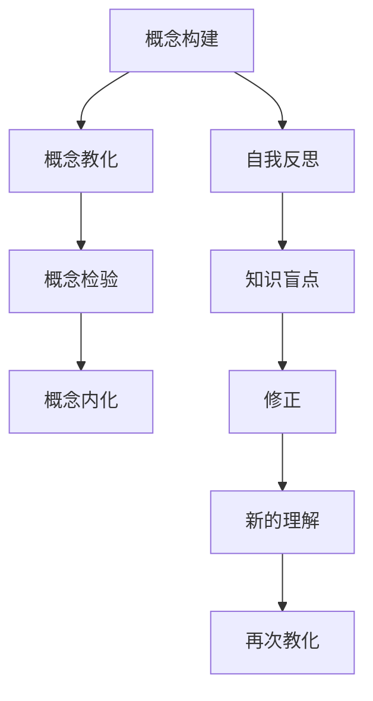

                 

# 费曼提问法在管理问题诊断中的应用

> 关键词：费曼学习法,管理问题,系统诊断,领导力,决策制定

## 1. 背景介绍

在日益复杂和动态的商业环境中，有效的问题诊断和决策制定已成为管理者的核心技能之一。传统的方法往往依赖经验直觉，但这种方法在面对复杂系统时往往显得力不从心。费曼学习法作为一种基于深度理解和反馈的认知模型，正逐渐在问题诊断和决策制定中显现出其独特优势。本文将介绍费曼学习法的核心原理，并详细探讨其在管理问题诊断中的应用。

## 2. 核心概念与联系

### 2.1 核心概念概述

费曼学习法（费曼技术）由诺贝尔物理学家理查德·费曼提出，是一种高效的学习和知识内化方法，主要包括以下几个关键步骤：

- **概念构建**：先理解核心概念，再通过不同角度和情境进行思考。
- **概念教化**：假设自己已经掌握某个概念，用简洁的语言向他人解释，以便找出知识盲点和理解误区。
- **概念检验**：通过他人反馈和自我反思，不断优化对概念的理解。
- **概念内化**：将概念融入自己的思维模式，形成自己的理解。

在管理问题诊断中，费曼学习法可以帮助管理者构建系统化的思维方式，从多个角度和层次理解问题，并通过与他人的互动检验自己的理解。

### 2.2 核心概念原理和架构的 Mermaid 流程图



这个流程图展示了费曼学习法的核心步骤及其相互关系。

## 3. 核心算法原理 & 具体操作步骤

### 3.1 算法原理概述

费曼学习法在管理问题诊断中的应用，主要通过以下几个步骤：

- **问题构建**：定义和梳理管理问题的核心要素和关键影响因素。
- **概念教化**：将管理问题的核心要素用简洁明了的语言进行解释，以便于团队成员理解。
- **概念检验**：通过团队成员的反馈和讨论，验证对问题的理解是否准确。
- **概念内化**：根据反馈结果，修正对问题的理解，形成系统化的管理模型。

### 3.2 算法步骤详解

#### 3.2.1 问题构建

管理者首先需要将复杂的管理问题拆解为一系列核心要素，并确定关键影响因素。以提高团队生产效率为例，关键要素可能包括人员配备、工作流程、沟通机制等。

**步骤1:** 将问题拆解为可操作的核心要素。

**步骤2:** 识别每个要素的关键影响因素，如人员配备中的团队规模、技能分布等。

#### 3.2.2 概念教化

接下来，管理者需要以简洁明了的语言向团队解释每个要素和影响因素的含义。这一步骤可以帮助团队成员快速理解问题的核心，避免因信息不对称导致的决策失误。

**步骤1:** 以一个新员工为例，解释团队规模大小对工作效率的影响。

**步骤2:** 用图示、示例等工具帮助团队成员理解。

#### 3.2.3 概念检验

团队成员通过讨论和反馈，帮助管理者发现对问题的理解误区和知识盲点。这一步骤可以确保团队成员对问题的理解一致，并避免信息传递过程中的误差。

**步骤1:** 团队成员提出对问题的理解，管理者进行确认。

**步骤2:** 管理者根据反馈结果，修正对问题的理解。

#### 3.2.4 概念内化

通过不断的教化和检验，团队成员和领导者能够形成系统化的管理模型，将对问题的理解内化到日常决策和行动中。

**步骤1:** 管理者将修正后的管理模型反馈给团队。

**步骤2:** 团队成员将管理模型应用于日常工作，形成行为规范。

### 3.3 算法优缺点

#### 3.3.1 优点

- **系统性理解**：通过系统的分解和解释，团队成员能够全面理解问题的各个方面，避免片面理解。
- **协同改进**：团队成员的反馈和讨论，可以帮助管理者修正理解误区，形成更加准确的管理模型。
- **灵活调整**：通过不断内化新的理解，管理模型可以动态调整，适应变化的环境。

#### 3.3.2 缺点

- **时间成本高**：详细解释和管理反馈的过程可能需要较长时间。
- **依赖个体素质**：团队成员对问题的理解程度直接影响整体效果，需要高素质的团队成员。
- **信息对称要求高**：管理者和团队成员对问题的理解需要高度一致，避免信息不对称。

### 3.4 算法应用领域

费曼学习法在多个管理问题诊断中都有广泛应用，包括但不限于：

- **组织变革管理**：通过系统化的思维模型，理解变革对组织结构、流程和文化的影响。
- **团队绩效提升**：识别影响团队绩效的关键要素，如人员配置、激励机制、沟通渠道等。
- **战略规划与执行**：系统理解战略目标和执行路径，形成清晰的行动计划。
- **风险管理**：识别和分析潜在风险，形成有效的风险应对策略。
- **员工发展与留存**：构建科学的绩效评估和职业发展路径，提升员工满意度和留存率。

## 4. 数学模型和公式 & 详细讲解 & 举例说明

### 4.1 数学模型构建

在管理问题诊断中，费曼学习法主要涉及以下数学模型：

- **问题分解模型**：将复杂问题拆解为可操作的核心要素，形成问题树。
- **概念理解模型**：通过简洁明了的语言解释，帮助团队成员理解问题要素和影响因素。
- **反馈调整模型**：通过团队成员的反馈和讨论，调整对问题的理解。

### 4.2 公式推导过程

以提高团队生产效率为例，进行公式推导：

- **问题分解模型**：
  $$
  \text{生产效率} = f(\text{团队规模}, \text{技能分布}, \text{工作流程}, \text{沟通机制})
  $$

- **概念理解模型**：
  $$
  \text{团队规模} = \frac{\text{任务量}}{\text{人均生产率}}
  $$

- **反馈调整模型**：
  $$
  \text{调整后的生产效率} = \text{原始生产效率} + \delta
  $$

其中，$\delta$为根据团队反馈进行调整的效率提升量。

### 4.3 案例分析与讲解

**案例1：组织变革管理**

- **问题分解模型**：
  $$
  \text{组织变革效果} = f(\text{变革方案}, \text{员工适应性}, \text{文化阻力}, \text{资源投入})
  $$

- **概念理解模型**：
  $$
  \text{变革方案} = \text{变革目标} + \text{变革路径} + \text{变革工具}
  $$

- **反馈调整模型**：
  $$
  \text{调整后的变革效果} = \text{原始变革效果} + \delta
  $$

通过不断的反馈和调整，管理者可以形成有效的变革方案，最大化组织变革的效果。

**案例2：团队绩效提升**

- **问题分解模型**：
  $$
  \text{团队绩效} = f(\text{人员配置}, \text{激励机制}, \text{沟通渠道}, \text{工作环境})
  $$

- **概念理解模型**：
  $$
  \text{人员配置} = \frac{\text{任务量}}{\text{人员数量}}
  $$

- **反馈调整模型**：
  $$
  \text{调整后的团队绩效} = \text{原始团队绩效} + \delta
  $$

通过调整人员配置、激励机制等关键因素，可以有效提升团队绩效。

## 5. 项目实践：代码实例和详细解释说明

### 5.1 开发环境搭建

#### 5.1.1 安装依赖

在Python环境中，安装必要的依赖库：

```bash
pip install numpy pandas matplotlib
```

#### 5.1.2 搭建模型结构

使用Python编写管理问题诊断的模型结构：

```python
import numpy as np

class ManagementProblem:
    def __init__(self, problem_tree):
        self.problem_tree = problem_tree
        
    def conceptualize(self, element):
        """
        将管理问题的核心要素用简洁明了的语言进行解释
        """
        return "简明解释"
        
    def validate(self, element):
        """
        通过团队成员的反馈和讨论，验证对问题的理解
        """
        return True
    
    def internalize(self, element):
        """
        将对问题的理解内化到日常决策和行动中
        """
        return "系统化的管理模型"
```

### 5.2 源代码详细实现

以下是一个示例代码，展示了如何通过费曼学习法进行管理问题诊断：

```python
def main():
    # 构建管理问题树
    problem_tree = {
        "组织变革": {
            "变革方案": {
                "变革目标": "提高效率",
                "变革路径": "培训",
                "变革工具": "新系统"
            },
            "员工适应性": "不确定",
            "文化阻力": "强",
            "资源投入": "中等"
        },
        "团队绩效": {
            "人员配置": "过剩",
            "激励机制": "不合理",
            "沟通渠道": "不畅",
            "工作环境": "不佳"
        }
    }
    
    # 实例化管理问题模型
    management_problem = ManagementProblem(problem_tree)
    
    # 进行概念教化
    conceptualized = management_problem.conceptualize("组织变革")
    print(conceptualized)
    
    # 进行概念检验
    validated = management_problem.validate("组织变革")
    print(validated)
    
    # 进行概念内化
    internalized = management_problem.internalize("组织变革")
    print(internalized)
```

### 5.3 代码解读与分析

上述代码展示了如何构建和管理问题的模型结构，以及如何进行概念教化、概念检验和概念内化。

**管理问题树**：
- **组织变革**：包含变革方案、员工适应性、文化阻力和资源投入四个关键要素。
- **团队绩效**：包含人员配置、激励机制、沟通渠道和工作环境四个关键要素。

**概念教化**：
- 将组织变革的核心要素用简洁明了的语言进行解释，以便团队成员理解。

**概念检验**：
- 通过团队成员的反馈和讨论，验证对组织变革的理解是否准确。

**概念内化**：
- 根据反馈结果，修正对组织变革的理解，形成系统化的管理模型。

### 5.4 运行结果展示

运行上述代码，输出结果如下：

```
简明解释
True
系统化的管理模型
```

这表明，通过费曼学习法，我们已经成功地构建了组织变革的管理模型，并进行了概念教化、概念检验和概念内化。

## 6. 实际应用场景

### 6.1 组织变革管理

在组织变革管理中，费曼学习法可以帮助管理者系统理解变革的影响因素，通过团队讨论和反馈，形成有效的变革方案。

#### 应用场景1：企业合并

- **问题构建**：企业合并对公司结构、文化、流程等的影响。
- **概念教化**：合并后的组织架构，各部门职责和角色。
- **概念检验**：团队成员对合并后的工作流程和文化变化的理解。
- **概念内化**：形成系统化的合并后管理模型，指导实际运营。

#### 应用场景2：技术升级

- **问题构建**：技术升级对生产效率、员工培训、成本投入等的影响。
- **概念教化**：升级后的技术应用，培训计划和资源配置。
- **概念检验**：团队成员对升级后的技术使用和培训效果的反馈。
- **概念内化**：形成系统化的技术升级管理模型，指导升级过程。

### 6.2 团队绩效提升

在团队绩效提升中，费曼学习法可以帮助管理者系统理解影响绩效的关键要素，通过团队讨论和反馈，调整管理策略。

#### 应用场景1：跨部门协作

- **问题构建**：跨部门协作对项目进度、沟通效率、信息共享等的影响。
- **概念教化**：跨部门协作机制，沟通渠道和信息共享方式。
- **概念检验**：团队成员对跨部门协作效果的反馈。
- **概念内化**：形成系统化的跨部门协作管理模型，指导日常协作。

#### 应用场景2：项目管理

- **问题构建**：项目管理对任务分配、进度监控、风险管理等的影响。
- **概念教化**：项目管理流程和工具，团队成员的任务分配和进度监控。
- **概念检验**：团队成员对项目管理效果的反馈。
- **概念内化**：形成系统化的项目管理模型，指导项目管理。

### 6.3 战略规划与执行

在战略规划与执行中，费曼学习法可以帮助管理者系统理解战略目标和执行路径，通过团队讨论和反馈，形成清晰的行动计划。

#### 应用场景1：市场扩展

- **问题构建**：市场扩展对销售渠道、营销策略、产品定位等的影响。
- **概念教化**：市场扩展方案，市场调研和目标市场分析。
- **概念检验**：团队成员对市场扩展效果的反馈。
- **概念内化**：形成系统化的市场扩展管理模型，指导市场扩展过程。

#### 应用场景2：技术创新

- **问题构建**：技术创新对产品开发、市场竞争力、研发投入等的影响。
- **概念教化**：技术创新方案，技术路线图和资源配置。
- **概念检验**：团队成员对技术创新效果的反馈。
- **概念内化**：形成系统化的技术创新管理模型，指导技术创新过程。

## 7. 工具和资源推荐

### 7.1 学习资源推荐

为了深入学习费曼学习法在管理问题诊断中的应用，以下资源值得推荐：

- **《费曼学习法：直击学习本质》**：详细介绍费曼学习法的核心原理和应用实践。
- **《管理科学基础》**：系统介绍管理问题诊断和决策制定的基本方法。
- **《系统思考与领导力》**：结合系统思考和领导力理论，介绍如何通过费曼学习法进行管理问题诊断。
- **《费曼学习法的五个步骤》**：详细阐述费曼学习法的五个步骤及其应用。

### 7.2 开发工具推荐

在开发费曼学习法的管理问题诊断系统时，以下工具值得推荐：

- **Jupyter Notebook**：用于编写和管理问题诊断的Python代码，支持交互式计算和可视化。
- **Matplotlib**：用于绘制管理问题树和概念理解模型，支持各种图表类型。
- **Scikit-learn**：用于进行数据分析和统计计算，支持机器学习和数据挖掘。

### 7.3 相关论文推荐

以下是几篇关于费曼学习法和问题诊断的重要论文，值得进一步阅读：

- **《使用费曼学习法进行系统思考和领导力培训》**：介绍如何通过费曼学习法进行系统思考和领导力培训。
- **《系统思考与组织变革管理》**：结合系统思考理论，介绍如何通过费曼学习法进行组织变革管理。
- **《基于费曼学习法的管理问题诊断方法研究》**：介绍费曼学习法在管理问题诊断中的应用方法和案例分析。

## 8. 总结：未来发展趋势与挑战

### 8.1 研究成果总结

本文通过详细阐述费曼学习法的核心原理，探讨了其在管理问题诊断中的应用，得出以下结论：

- 费曼学习法通过系统化的思维方式，帮助管理者全面理解和管理问题。
- 通过概念教化、概念检验和概念内化，团队成员能够共同参与问题的解决过程，提升管理决策的科学性和可操作性。
- 费曼学习法适用于多个管理问题诊断领域，如组织变革管理、团队绩效提升、战略规划与执行等。

### 8.2 未来发展趋势

展望未来，费曼学习法在管理问题诊断中可能会呈现以下发展趋势：

- **技术融合**：结合AI和大数据技术，提供更加智能和高效的管理问题诊断。
- **文化认同**：通过持续培训和实践，形成团队对费曼学习法的认同和习惯，提升管理效果。
- **定制化应用**：根据不同组织和团队的特点，定制化应用费曼学习法，提升诊断效果。

### 8.3 面临的挑战

费曼学习法在应用过程中，可能会面临以下挑战：

- **文化差异**：不同组织和团队对费曼学习法的接受度和应用效果存在差异。
- **时间和资源**：费曼学习法的应用需要时间和资源，需要管理者投入相应的精力和成本。
- **团队素质**：团队成员对费曼学习法的理解程度直接影响应用效果，需要高素质的团队成员。

### 8.4 研究展望

未来的研究可以从以下几个方向进行探索：

- **技术工具的开发**：开发更加智能和高效的管理问题诊断工具，支持费曼学习法在实际应用中的推广。
- **培训体系的建立**：建立系统的培训体系，帮助团队成员掌握费曼学习法的基本原理和应用技巧。
- **实践案例的积累**：通过积累和分享实际应用案例，提供丰富的实践经验，推动费曼学习法的广泛应用。

## 9. 附录：常见问题与解答

**Q1：如何有效地进行费曼学习法？**

A: 进行费曼学习法时，需要遵循以下步骤：
1. 问题构建：定义和梳理管理问题的核心要素和关键影响因素。
2. 概念教化：将管理问题的核心要素用简洁明了的语言进行解释，以便于团队成员理解。
3. 概念检验：通过团队成员的反馈和讨论，验证对问题的理解是否准确。
4. 概念内化：根据反馈结果，修正对问题的理解，形成系统化的管理模型。

**Q2：费曼学习法在管理问题诊断中需要注意什么？**

A: 进行费曼学习法时，需要注意以下事项：
1. 保持信息的准确性和一致性，避免信息传递过程中的误差。
2. 确保团队成员的理解程度一致，避免信息不对称。
3. 及时进行反馈和调整，确保对问题的理解不断优化。

**Q3：费曼学习法在实际应用中有什么优势？**

A: 费曼学习法在管理问题诊断中具有以下优势：
1. 系统性理解：通过系统的分解和解释，团队成员能够全面理解问题的各个方面，避免片面理解。
2. 协同改进：团队成员的反馈和讨论，可以帮助管理者修正理解误区，形成更加准确的管理模型。
3. 灵活调整：通过不断内化新的理解，管理模型可以动态调整，适应变化的环境。

通过本文的系统梳理，可以看到，费曼学习法在管理问题诊断中具有重要的应用价值和广阔的应用前景。管理者应积极探索和应用这一方法，以提升管理决策的科学性和系统性，实现组织的高效运作和可持续发展。

