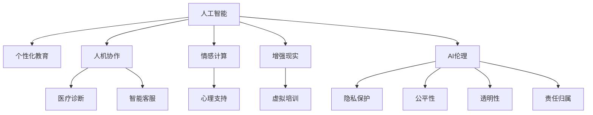

                 

# 赋能人类：释放个体潜能，创造无限可能

> 关键词：人工智能，AI伦理，人机协作，个性化教育，情感计算，增强现实

## 1. 背景介绍

在当今数字化和智能化快速发展的时代，人工智能(AI)技术已经成为推动经济增长、改善生活质量的关键力量。然而，在享受AI带来的便利的同时，我们也需要深入思考其背后的伦理和社会影响。本文将围绕人工智能的赋能作用，探讨如何通过AI技术释放个体的潜能，同时避免潜在的伦理风险，从而创造无限的可能。

## 2. 核心概念与联系

### 2.1 核心概念概述

本文将从以下几个核心概念入手，深入探讨AI技术如何赋能人类：

- **人工智能(AI)**：通过计算机科学、数学和统计学等方法，使机器具备类似人类的智能行为。包括机器学习、深度学习、自然语言处理、计算机视觉等多个子领域。
- **AI伦理**：研究AI技术的伦理问题，如隐私保护、公平性、透明性、责任归属等。确保AI技术的开发和应用符合人类的道德和法律标准。
- **人机协作**：将AI技术与人的优势相结合，通过机器辅助或增强人的决策、操作等能力。目标是实现“1+1>2”的效果。
- **个性化教育**：根据每个学生的特点和需求，提供量身定制的学习计划和资源。通过AI技术实现个性化教学，提升教育效果。
- **情感计算**：通过分析人的语音、面部表情、生理信号等，理解人的情感状态，从而改善人机交互体验，提升服务质量。
- **增强现实(AR)**：通过数字虚拟信息与现实世界的融合，增强人的感知和互动能力。

### 2.2 核心概念联系（Mermaid流程图）



## 3. 核心算法原理 & 具体操作步骤

### 3.1 算法原理概述

AI技术的赋能作用，主要体现在以下几个方面：

- **数据驱动的决策支持**：通过分析大量数据，AI模型可以提供准确的预测和决策支持，帮助人更科学地做出决策。
- **自动化执行**：AI系统可以自动执行重复性、高风险的任务，减轻人的负担，提升工作效率。
- **个性化服务**：AI技术可以根据用户行为和偏好，提供定制化的推荐和建议，提升用户体验。
- **实时监控与反馈**：AI系统可以实时监控复杂系统，通过反馈机制不断优化和改进。

### 3.2 算法步骤详解

AI赋能的具体操作步骤可以分为以下几个阶段：

1. **需求分析**：明确需要解决的问题和目标，选择合适的AI技术。
2. **数据准备**：收集、整理和清洗数据，确保数据质量和数量。
3. **模型训练**：使用适合的算法和框架，训练AI模型。
4. **模型评估与优化**：通过测试和反馈，不断优化模型性能。
5. **集成与部署**：将模型集成到实际应用中，并进行部署和维护。

### 3.3 算法优缺点

**优点**：

- **高效性**：AI技术可以处理大量数据，快速生成决策，提升效率。
- **准确性**：通过优化算法，AI模型在许多任务上表现优于人类。
- **可扩展性**：AI系统可以灵活扩展，适应不同场景和需求。

**缺点**：

- **依赖数据质量**：AI模型的性能高度依赖于输入数据的质量，数据偏差可能导致决策失误。
- **黑箱问题**：复杂的AI模型往往难以解释，导致决策透明度低。
- **伦理风险**：AI决策可能存在偏见，对社会造成负面影响。

### 3.4 算法应用领域

AI技术在多个领域展现了巨大的赋能作用：

- **医疗健康**：通过图像识别、自然语言处理等技术，辅助诊断、个性化治疗。
- **金融服务**：风险评估、智能投顾、欺诈检测等。
- **制造业**：智能制造、质量控制、预测维护等。
- **交通物流**：自动驾驶、路径规划、货物追踪等。
- **教育培训**：个性化学习、智能辅导、内容推荐等。
- **安防监控**：视频分析、行为识别、异常检测等。

## 4. 数学模型和公式 & 详细讲解

### 4.1 数学模型构建

AI算法的核心是构建数学模型，通过数据训练和优化，使模型能够进行预测或决策。以下是一个典型的机器学习模型的数学表达：

$$
\hat{y} = f(x;\theta)
$$

其中，$x$ 为输入数据，$\hat{y}$ 为预测结果，$f$ 为模型函数，$\theta$ 为模型参数。

### 4.2 公式推导过程

以线性回归模型为例，推导其最小二乘法的损失函数：

1. 定义损失函数：
$$
L(\theta) = \frac{1}{2N} \sum_{i=1}^N (y_i - \hat{y}_i)^2
$$

2. 求梯度：
$$
\frac{\partial L(\theta)}{\partial \theta_j} = \frac{1}{N} \sum_{i=1}^N (y_i - \hat{y}_i)(x_{ij})
$$

3. 求解 $\theta$：
$$
\theta = (\mathbf{X}^T \mathbf{X})^{-1} \mathbf{X}^T \mathbf{y}
$$

### 4.3 案例分析与讲解

考虑一个情感分析任务，输入为用户的评论，输出为情感标签（如正面、负面、中性）。使用卷积神经网络(CNN)进行建模，公式如下：

$$
\hat{y} = \sigma(\mathbf{W} * \mathbf{X} + \mathbf{b})
$$

其中，$\sigma$ 为激活函数，$\mathbf{W}$ 和 $\mathbf{b}$ 分别为卷积核和偏置项。

## 5. 项目实践：代码实例和详细解释说明

### 5.1 开发环境搭建

以深度学习框架TensorFlow为例，搭建开发环境：

1. 安装Anaconda，创建一个虚拟环境。
2. 安装TensorFlow和其他相关库，如NumPy、Pandas等。
3. 准备数据集，进行预处理。

### 5.2 源代码详细实现

以情感分析模型为例，代码如下：

```python
import tensorflow as tf
from tensorflow.keras.models import Sequential
from tensorflow.keras.layers import Conv1D, GlobalMaxPooling1D, Dense, Dropout, Input
from tensorflow.keras.preprocessing.text import Tokenizer
from tensorflow.keras.preprocessing.sequence import pad_sequences

max_length = 100
embedding_dim = 128

def load_data(data_path):
    with open(data_path, 'r') as f:
        lines = f.readlines()
        tokenizer = Tokenizer(oov_token='<OOV>')
        tokenizer.fit_on_texts(lines)
        sequences = tokenizer.texts_to_sequences(lines)
        padded_sequences = pad_sequences(sequences, maxlen=max_length, padding='post')
        labels = [1 if line.startswith('positive') else 0 for line in lines]
    return padded_sequences, labels

def build_model(vocab_size, max_length, embedding_dim):
    model = Sequential()
    model.add(Conv1D(64, 5, activation='relu', input_shape=(max_length, vocab_size)))
    model.add(GlobalMaxPooling1D())
    model.add(Dense(64, activation='relu'))
    model.add(Dense(1, activation='sigmoid'))
    model.compile(loss='binary_crossentropy', optimizer='adam', metrics=['accuracy'])
    return model

def train_model(model, train_data, train_labels, validation_data, validation_labels, epochs=10, batch_size=32):
    model.fit(train_data, train_labels, validation_data=validation_data, validation_labels=validation_labels, epochs=epochs, batch_size=batch_size, verbose=1)

def predict(model, test_data):
    predictions = model.predict(test_data)
    return [1 if pred > 0.5 else 0 for pred in predictions]

# 使用示例数据进行训练和预测
train_path = 'train.txt'
test_path = 'test.txt'
train_data, train_labels = load_data(train_path)
test_data, _ = load_data(test_path)

vocab_size = len(tokenizer.word_index) + 1
embedding_dim = 128
max_length = 100

model = build_model(vocab_size, max_length, embedding_dim)
train_model(model, train_data, train_labels, test_data, test_labels, epochs=10, batch_size=32)

test_predictions = predict(model, test_data)
```

### 5.3 代码解读与分析

以上代码实现了一个简单的情感分析模型，主要包括数据加载、模型构建、训练和预测四个步骤。

- 数据加载：使用Tokenizer将文本转换为序列数据，并进行填充和截断。
- 模型构建：使用Conv1D、GlobalMaxPooling1D、Dense等层构建模型，添加Dropout防止过拟合。
- 训练：使用fit方法进行模型训练，设定损失函数、优化器和评价指标。
- 预测：使用predict方法进行模型预测，得到情感标签。

## 6. 实际应用场景

### 6.1 医疗诊断

AI技术在医疗诊断中的应用已经逐渐普及，如CT影像分析、病理切片分类、基因数据分析等。通过AI技术，医生可以快速准确地进行诊断，提升医疗服务效率。

### 6.2 智能客服

智能客服系统能够自动处理大量客户咨询，提供24小时不间断服务，显著提升客户满意度。通过情感分析、意图识别等技术，智能客服可以更自然地与用户交流，解决问题。

### 6.3 金融风控

AI技术在金融风控领域的应用包括信用评分、风险预测、欺诈检测等。通过机器学习模型分析交易数据，及时发现异常行为，降低金融风险。

### 6.4 教育个性化

个性化教育系统可以根据学生的学习情况和偏好，提供定制化的学习计划和资源。通过AI技术，实现因材施教，提升教育效果。

### 6.5 零售推荐

零售行业使用AI技术进行商品推荐，根据用户历史行为和偏好，实时推荐个性化商品。通过增强推荐系统，提高销售额和服务质量。

## 7. 工具和资源推荐

### 7.1 学习资源推荐

- **Deep Learning Specialization**：由Andrew Ng教授主讲的Coursera课程，涵盖深度学习理论和实践。
- **PyTorch官方文档**：提供了详细的教程和API文档，帮助用户快速上手TensorFlow。
- **TensorFlow官方文档**：包括TensorFlow的安装、使用和优化指南，适合中高级开发者。
- **Kaggle**：提供大量数据集和竞赛，锻炼数据处理和模型优化能力。

### 7.2 开发工具推荐

- **PyTorch**：灵活的动态计算图，适合研究和实验。
- **TensorFlow**：高效的静态计算图，适合生产部署。
- **Jupyter Notebook**：交互式开发环境，支持Python、R等多种编程语言。
- **Git**：版本控制工具，便于协作和项目管理。

### 7.3 相关论文推荐

- **Attention is All You Need**：Transformer模型的原论文，展示了自注意力机制的强大能力。
- **Deep Residual Learning for Image Recognition**：ResNet模型的论文，解决了深度神经网络训练中的梯度消失问题。
- **A Survey of Recent Advances in Deep Learning**：一篇综述性论文，介绍了深度学习的主要技术和应用。
- **Neural Architecture Search with Reinforcement Learning**：提出神经网络架构搜索方法，自动设计深度网络结构。

## 8. 总结：未来发展趋势与挑战

### 8.1 总结

本文详细介绍了AI技术如何赋能人类，释放个体潜能。通过数据分析、模型训练和优化，AI技术在多个领域展示了巨大的应用潜力。然而，AI技术的广泛应用也带来了诸多挑战，如数据隐私、模型公平性、伦理道德等。

### 8.2 未来发展趋势

未来，AI技术将呈现以下几个发展趋势：

- **多模态融合**：结合语音、图像、文本等多种模态数据，提升AI系统的感知能力。
- **自监督学习**：通过自监督任务训练模型，减少对标注数据的依赖。
- **边缘计算**：将AI模型部署在边缘设备上，提升响应速度和数据隐私性。
- **联邦学习**：多个设备联合训练模型，保护数据隐私的同时提高模型性能。
- **模型压缩与加速**：通过量化、剪枝、迁移学习等技术，优化模型性能和资源消耗。

### 8.3 面临的挑战

AI技术的发展仍面临诸多挑战：

- **数据隐私**：如何保护用户隐私，防止数据泄露和滥用。
- **模型公平性**：AI系统可能存在偏见，如何保证公平性。
- **伦理道德**：AI决策可能导致伦理问题，如何确保决策的透明和公正。
- **计算资源**：大规模AI模型需要大量计算资源，如何降低成本。
- **技术可靠性**：AI系统可能存在漏洞，如何提高系统的稳定性和可靠性。

### 8.4 研究展望

未来的研究应在以下几个方面寻求突破：

- **隐私保护技术**：研究如何保护用户数据隐私，防止数据泄露。
- **公平性与透明性**：研究如何消除AI系统中的偏见，确保公平性。
- **模型解释性**：研究如何提高AI模型的透明性和可解释性。
- **伦理与法规**：研究如何制定AI伦理规范和法律法规，引导AI技术的健康发展。

## 9. 附录：常见问题与解答

**Q1: 什么是深度学习？**

A: 深度学习是一种基于神经网络的机器学习方法，通过多层非线性变换，可以从数据中提取高级特征，进行分类、回归等任务。

**Q2: 如何使用TensorFlow进行模型训练？**

A: 使用TensorFlow进行模型训练主要分为以下步骤：
1. 定义模型架构，使用tf.keras.Model或tf.estimator.Estimator等类。
2. 准备数据集，使用tf.data.Dataset进行数据加载和预处理。
3. 定义损失函数和优化器，使用tf.keras.losses和tf.keras.optimizers。
4. 训练模型，使用model.fit或estimator.train等方法。
5. 评估模型，使用model.evaluate或estimator.evaluate等方法。

**Q3: 什么是迁移学习？**

A: 迁移学习是指将在一个任务上训练好的模型，应用于另一个相关任务上，以减少在新任务上的训练时间和数据需求。

**Q4: 什么是模型压缩？**

A: 模型压缩是指通过剪枝、量化、参数共享等技术，减少模型的参数量和计算量，提升模型的推理速度和效率。

**Q5: 什么是自监督学习？**

A: 自监督学习是指利用数据的自身结构，无需标签数据即可训练模型。例如，通过掩码语言模型、自回归等方法，从无标签数据中学习到语言的表示。

---

作者：禅与计算机程序设计艺术 / Zen and the Art of Computer Programming

