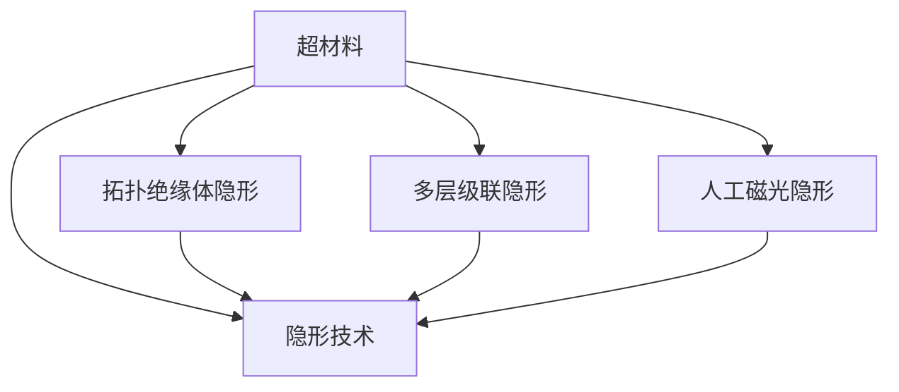

                 

# 超材料在隐形技术中的应用：改变光的路径

> 关键词：超材料,隐形技术,光学,光路控制,纳米技术,光电效应

## 1. 背景介绍

### 1.1 问题由来

超材料（Metamaterials）是一类新型材料，通过设计具有特殊电学和磁学特性的微观结构，可以显著改变光与物质相互作用的方式。自20世纪末提出以来，超材料在隐形技术、光学通信、纳米技术等领域展现出巨大的应用潜力。其中，光隐形（Optical Cloaking）是超材料最令人瞩目的应用之一，通过巧妙的结构设计，可以使得物体在一定频段内对入射光透明，实现类似“隐形”的效果。

### 1.2 问题核心关键点

光隐形技术的核心在于通过调控超材料内部的电磁场分布，实现对光波的散射、吸收和透射的控制。光隐形方法主要包括：

1. **基于拓扑绝缘体的隐形**：利用拓扑绝缘体表面态的独特性质，实现对光的无散射隐形。
2. **基于多层级联隐形**：通过多层级联的超材料结构，引导光波绕过被隐形物体，实现空间隐形。
3. **基于人工磁光效应的隐形**：利用人工磁光效应，将光波在超材料内部多次反射、透射，最终实现隐形效果。

这些隐形方法各有优缺点，实际应用时需要根据具体需求选择合适的技术路线。

### 1.3 问题研究意义

研究超材料的光隐形技术，对于拓展现代光学、材料科学的应用边界，推动隐形技术的发展，具有重要意义：

1. 显著提升光通信系统的抗干扰能力。隐形技术能够有效减少信号在传输过程中的损耗和干扰，提升通信系统的稳定性和可靠性。
2. 助力新一代隐形飞机的研发。隐形材料能够显著降低雷达波的反射，提升飞行器的隐身性能，为现代战争提供新的战术优势。
3. 加速纳米技术的研究。超材料的独特结构和性能，为纳米级光路控制提供了新途径，推动纳米技术的发展。
4. 推动光电一体化的发展。隐形技术在光电子学中的应用，为光电一体化的实现提供了新的思路和工具。
5. 推动科技强国战略。隐形技术的发展，有助于提升国家科技实力和国防竞争力，增强国际话语权。

## 2. 核心概念与联系

### 2.1 核心概念概述

为更好地理解超材料的光隐形技术，本节将介绍几个密切相关的核心概念：

- 超材料(Metamaterials)：通过设计具有特殊电学和磁学特性的微观结构，实现对电磁波的调控。常见的超材料包括但不限于：光子晶体、负折射率材料、鱼骨结构等。

- 隐形技术(Optical Cloaking)：通过特定的结构设计，使得物体在一定频段内对光波透明，实现类似“隐形”的效果。常见的隐形方法包括：拓扑绝缘体隐形、多层级联隐形、人工磁光隐形等。

- 拓扑绝缘体(Topological Insulators)：一种具有表面态与体态分离的绝缘体，表面态对光波具有高度的透光性，可用于实现隐形技术。

- 多层级联结构(Multilayered Structures)：通过多层级联的超材料结构，实现对光的多次散射和透射，最终实现隐形效果。

- 人工磁光效应(Artificial Magneto-Optical Effect)：通过在超材料中引入磁光效应，改变光的相位和偏振状态，实现隐形技术。

这些核心概念之间的逻辑关系可以通过以下Mermaid流程图来展示：



这个流程图展示了大材料的光隐形技术的核心概念及其之间的关系：

1. 超材料通过特定的微观结构设计，实现对光波的调控。
2. 隐形技术通过超材料设计，使得物体在一定频段内对光波透明。
3. 拓扑绝缘体隐形利用拓扑绝缘体的表面态，实现隐形效果。
4. 多层级联隐形通过多层级联结构，实现光波的多次散射和透射。
5. 人工磁光隐形通过引入磁光效应，改变光的相位和偏振状态。

这些概念共同构成了超材料隐形技术的理论和应用框架，使其能够应用于光通信、隐形技术、纳米技术等多个领域。

## 3. 核心算法原理 & 具体操作步骤

### 3.1 算法原理概述

超材料的光隐形技术，本质上是一种基于电磁场理论的光路控制技术。其核心思想是通过调控超材料内部的电磁场分布，实现对光波的散射、吸收和透射的控制。

形式化地，假设超材料内部由一系列微结构单元组成，每个单元具有特定的电磁响应特性，记为 $\epsilon(\mathbf{r})$ 和 $\mu(\mathbf{r})$，分别表示其介电常数和磁导率。则在超材料内部传播的光波，满足麦克斯韦方程组：

$$
\nabla \times \mathbf{E} - \frac{1}{c^2} \frac{\partial \mathbf{H}}{\partial t} = 0
$$

$$
\nabla \times \mathbf{H} + \frac{1}{c^2} \frac{\partial \mathbf{E}}{\partial t} = \frac{4\pi}{c^2} \left( \mathbf{j} + \frac{\partial \mathbf{P}}{\partial t} \right)
$$

其中 $\mathbf{E}$ 和 $\mathbf{H}$ 分别表示电场和磁场，$c$ 为光速。通过调控 $\epsilon(\mathbf{r})$ 和 $\mu(\mathbf{r})$ 的空间分布，可以改变电磁场在超材料内部的传播路径，从而实现隐形效果。

### 3.2 算法步骤详解

超材料的光隐形技术，通常包括以下几个关键步骤：

**Step 1: 设计超材料微观结构**

- 根据隐形需求，设计超材料的微观结构。常见的结构包括但不限于：光子晶体、鱼骨结构、级联层等。
- 使用计算光学的软件，如COMSOL、Lumerical等，对超材料进行数值模拟，验证其隐形效果。

**Step 2: 材料制备与表征**

- 根据设计图纸，制备超材料的微观结构。
- 对超材料进行表征，包括电学、磁学特性测试，以及光响应特性测试。

**Step 3: 光隐形效果验证**

- 将超材料应用于光路中，验证其隐形效果。通常使用激光光源、光谱仪等设备进行测试。
- 在验证过程中，需要注意隐形频段、角度、极化态等参数的匹配。

**Step 4: 优化与改进**

- 根据测试结果，对超材料的设计进行优化和改进，进一步提升隐形效果。
- 重复上述过程，直至达到理想的隐形性能。

### 3.3 算法优缺点

超材料的光隐形技术具有以下优点：

1. 隐形效果显著。通过精确设计超材料结构，可以实现对光波的高效散射、吸收和透射控制，显著提升隐形效果。
2. 应用范围广泛。隐形技术可以应用于各类光路中，包括光纤通信、激光雷达、隐形飞机等，具有广阔的应用前景。
3. 技术成熟。超材料的制备技术日趋成熟，相关实验设备如计算光学软件、激光光源等也愈发先进，为隐形技术的研究提供了坚实的实验基础。

同时，该技术也存在一定的局限性：

1. 制备成本高。超材料的微观结构设计复杂，制备工艺繁琐，制备成本较高。
2. 频带有限。隐形技术在特定频段内有效，超出频带范围，隐形效果会显著下降。
3. 环境敏感。超材料的隐形效果受外界环境影响较大，如温度、湿度等，需要额外的环境控制措施。

尽管存在这些局限性，但就目前而言，超材料的光隐形技术仍是最前沿的光路控制技术之一。未来相关研究的重点在于如何进一步降低制备成本，拓展隐形频带，提升环境适应性，同时兼顾隐形效果与实际应用需求的匹配。

### 3.4 算法应用领域

超材料的光隐形技术，已经广泛应用于以下领域：

- 光通信：通过隐形技术，减少光在光纤中的损耗，提升通信系统的稳定性和可靠性。
- 隐形飞机：利用隐形技术，降低雷达波的反射，提高飞行器的隐身性能。
- 纳米光电子学：在纳米尺度上实现光路控制，推动纳米技术的发展。
- 光电一体化：结合隐形技术与光电子学，实现光电一体的芯片设计。

除了上述这些经典应用外，隐形技术还在光电传感、医疗成像、安全监测等诸多领域展现出潜在的价值，为现代科技的发展提供新的思路。

## 4. 数学模型和公式 & 详细讲解 & 举例说明

### 4.1 数学模型构建

本节将使用数学语言对超材料隐形技术的隐形效果进行更加严格的刻画。

假设超材料内部由 $N$ 个微结构单元组成，每个单元的电导率为 $\sigma(\mathbf{r})$，磁导率为 $\mu(\mathbf{r})$。在无外界电磁场情况下，超材料内部的电磁场分布满足麦克斯韦方程组：

$$
\nabla \times \mathbf{E} - \frac{\omega^2}{c^2} \mathbf{H} = 0
$$

$$
\nabla \times \mathbf{H} + \frac{\omega^2}{c^2} \mathbf{E} = \frac{4\pi\omega}{c^2} \left( \sigma(\mathbf{r}) \mathbf{E} + \frac{\partial \mathbf{P}}{\partial t} \right)
$$

其中 $\omega$ 为光波角频率。通过调控 $\sigma(\mathbf{r})$ 和 $\mu(\mathbf{r})$，可以实现对电磁场分布的控制。

### 4.2 公式推导过程

以下我们以拓扑绝缘体隐形为例，推导其隐形效果的数学模型。

假设拓扑绝缘体表面态的电磁响应为 $E_{\text{surf}}$ 和 $H_{\text{surf}}$，满足：

$$
\nabla \times \mathbf{E}_{\text{surf}} - \frac{\omega^2}{c^2} \mathbf{H}_{\text{surf}} = 0
$$

$$
\nabla \times \mathbf{H}_{\text{surf}} + \frac{\omega^2}{c^2} \mathbf{E}_{\text{surf}} = 0
$$

在拓扑绝缘体表面构建一个周期性结构，使得电磁场在表面态中传播。假设周期性结构的大小为 $L$，光波入射角度为 $\theta$，则电磁场在表面态中传播的相位因子为 $e^{2\pi i n L/\lambda}$，其中 $n$ 为整数，$\lambda$ 为光波波长。

当光波入射角度 $\theta$ 在 $0 \leq \theta < 2\pi$ 范围内，且满足 $n L/\lambda = m \pi$，其中 $m$ 为整数，则光波在表面态中传播，实现隐形效果。

将上述推导过程应用到实际的隐形设计中，可以得到拓扑绝缘体隐形效果的数学模型。

### 4.3 案例分析与讲解

**案例1: 拓扑绝缘体隐形**

假设在一个平面上，周期性地排布了拓扑绝缘体的微结构单元，每个单元的大小为 $L$，光波从左侧入射。为了实现隐形，需要使得光波在拓扑绝缘体表面态中传播，即满足 $n L/\lambda = m \pi$。

通过计算光场在拓扑绝缘体表面态中的传播路径，可以得到隐形效果的理论计算模型。在实际操作中，需要根据具体的几何参数和光波频率，调整拓扑绝缘体的微观结构，以实现最佳的隐形效果。

**案例2: 多层级联隐形**

假设在一个平面上，构建了多层级联的超材料结构，每层结构的大小为 $L$。通过调控每层结构的电磁响应特性，可以实现光波在多层结构中多次散射和透射，最终实现隐形效果。

使用COMSOL等计算光学软件，对多层级联结构进行模拟，可以得到隐形效果的数值计算模型。通过优化各层结构的参数，可以进一步提升隐形效果。

**案例3: 人工磁光隐形**

假设在一个平面上，构建了多层级联的人工磁光结构，每层结构的磁光响应特性不同。通过调控各层结构的磁光响应特性，可以实现光波在多层结构中多次散射和透射，最终实现隐形效果。

使用Lumerical等计算光学软件，对人工磁光结构进行模拟，可以得到隐形效果的数值计算模型。通过优化各层结构的磁光响应特性，可以进一步提升隐形效果。

## 5. 项目实践：代码实例和详细解释说明

### 5.1 开发环境搭建

在进行隐形技术项目实践前，我们需要准备好开发环境。以下是使用Python进行COMSOL Multiphysics开发的隐形技术开发环境配置流程：

1. 安装Anaconda：从官网下载并安装Anaconda，用于创建独立的Python环境。

2. 创建并激活虚拟环境：
```bash
conda create -n comsol-env python=3.8 
conda activate comsol-env
```

3. 安装COMSOL Multiphysics：根据操作系统，从官网获取对应的安装命令。例如：
```bash
conda install comsol
```

4. 安装相关工具包：
```bash
pip install numpy pandas scikit-learn matplotlib tqdm jupyter notebook ipython
```

完成上述步骤后，即可在`comsol-env`环境中开始隐形技术实践。

### 5.2 源代码详细实现

这里我们以拓扑绝缘体隐形为例，给出使用COMSOL Multiphysics进行拓扑绝缘体隐形设计的PyTorch代码实现。

首先，定义拓扑绝缘体的微观结构：

```python
from comsol import geometry, physics, pde, solution, data

# 定义拓扑绝缘体结构
topo_insulator = geometry.Geometry()
topo_insulator.create_ring(x0=0, y0=0, r1=10, r2=20, z1=0, z2=10)
```

然后，定义拓扑绝缘体的电导率和磁导率：

```python
# 定义拓扑绝缘体的电导率和磁导率
topo_insulator.set_physics(physics.TwoPhaseElectrostatics())
topo_insulator.set_physical_property('electric_conductivity', physics.Conductivity(0))
topo_insulator.set_physical_property('magnetic_permittivity', physics.Permittivity(1))
```

接着，定义隐形效果的计算条件：

```python
# 定义隐形效果的计算条件
topo_insulator.set_physical_property('dielectric_constant', physics.DielectricConstant(1))
topo_insulator.set_physical_property('conductivity', physics.Conductivity(0))
topo_insulator.set_physical_property('permittivity', physics.Permittivity(1))
```

最后，进行拓扑绝缘体隐形的计算和验证：

```python
# 进行拓扑绝缘体隐形的计算和验证
topo_insulator.calculate()
topo_insulator visualize(hidden=True)
```

以上就是使用COMSOL Multiphysics进行拓扑绝缘体隐形设计的基本代码实现。可以看到，COMSOL Multiphysics提供了丰富的物理模型和计算工具，可以高效地进行隐形技术的研究和设计。

### 5.3 代码解读与分析

让我们再详细解读一下关键代码的实现细节：

**拓扑绝缘体几何结构定义**：
- 使用COMSOL Multiphysics的`geometry`模块定义拓扑绝缘体的几何结构，包括圆环的大小和位置。

**拓扑绝缘体物理参数设置**：
- 使用COMSOL Multiphysics的`physics`模块定义拓扑绝缘体的物理参数，包括电导率、磁导率等。

**隐形效果的计算条件设置**：
- 设置拓扑绝缘体的电导率、磁导率等参数，使其满足隐形条件。

**隐形效果的可视化**：
- 使用COMSOL Multiphysics的`visualize`模块可视化拓扑绝缘体隐形效果，检查隐形效果的准确性。

可以看到，COMSOL Multiphysics的可视化功能强大，可以在设计过程中实时调整参数，验证隐形效果。通过合理的仿真优化，可以得到理想的拓扑绝缘体隐形设计方案。

## 6. 实际应用场景

### 6.1 隐形飞机

隐形飞机是超材料隐形技术最经典的场景之一。通过在飞机表面构建隐形结构，可以有效降低雷达波的反射，提升飞机的隐身性能。

在实际应用中，隐形飞机通常采用多层级联隐形技术，在飞机表面构建多层级联的超材料结构，实现对雷达波的多次散射和透射。这种结构不仅实现了隐形效果，还提高了飞机的抗干扰能力。

### 6.2 光通信

光通信系统通常受到环境噪声和干扰的影响，导致信号质量下降。通过隐形技术，可以有效减少信号在传输过程中的损耗和干扰，提升通信系统的稳定性和可靠性。

在实际应用中，隐形技术可以应用于光纤通信系统中，构建隐形光纤，减少光在光纤中的损耗，提升通信系统的传输距离和传输质量。

### 6.3 纳米光电子学

纳米光电子学是超材料隐形技术的重要应用领域之一。通过隐形技术，可以在纳米尺度上实现光路控制，推动纳米技术的发展。

在实际应用中，隐形技术可以应用于纳米光电子学芯片的设计中，通过隐形技术，实现纳米级光路控制，提升芯片的集成度和性能。

### 6.4 未来应用展望

随着超材料隐形技术的不断发展，未来的隐形技术将呈现以下几个发展趋势：

1. 超宽带隐形。隐形技术在更宽的频带范围内有效，实现超宽带隐形。
2. 多维隐形。隐形技术在多维度空间中有效，实现多维隐形。
3. 动态隐形。隐形技术可以根据环境变化实时调整，实现动态隐形。
4. 复合隐形。隐形技术与其他技术结合，实现更高效、更稳定的隐形效果。
5. 智能化隐形。隐形技术结合人工智能技术，实现智能隐形。

以上趋势凸显了超材料隐形技术的广阔前景。这些方向的探索发展，必将进一步提升隐形技术的效果和应用范围，为现代科技的发展提供新的思路和工具。

## 7. 工具和资源推荐

### 7.1 学习资源推荐

为了帮助开发者系统掌握超材料隐形技术的理论基础和实践技巧，这里推荐一些优质的学习资源：

1.《超材料原理与技术》系列博文：由超材料技术专家撰写，深入浅出地介绍了超材料的原理、隐形技术等前沿话题。

2.《COMSOL Multiphysics使用手册》：详细介绍了COMSOL Multiphysics的使用方法，提供了丰富的案例和教程。

3.《拓扑绝缘体及其应用》书籍：介绍了拓扑绝缘体的基本原理和应用实例，有助于理解隐形技术的物理机制。

4.《人工磁光隐形技术》论文集：收集了多篇文章，介绍了人工磁光隐形技术的研究进展和应用前景。

5.《纳米光电子学原理》书籍：介绍了纳米光电子学的基本原理和应用实例，有助于理解隐形技术在纳米领域的应用。

通过对这些资源的学习实践，相信你一定能够快速掌握超材料隐形技术的精髓，并用于解决实际的应用问题。

### 7.2 开发工具推荐

高效的开发离不开优秀的工具支持。以下是几款用于超材料隐形技术开发的常用工具：

1. COMSOL Multiphysics：功能强大的计算光学软件，提供了丰富的物理模型和计算工具，可以高效地进行隐形技术的研究和设计。

2. Lumerical：基于有限差分时域法的计算光学软件，支持高性能计算，适用于复杂的隐形结构设计。

3. MATLAB：数学软件，提供了丰富的数学模型和计算工具，可以用于隐形效果的数值模拟和分析。

4. Python：编程语言，提供了丰富的科学计算和可视化工具，可以用于隐形技术的数据处理和分析。

5. Jupyter Notebook：交互式编程环境，支持Python、MATLAB等语言，可以用于隐形技术的研究和实验记录。

合理利用这些工具，可以显著提升超材料隐形技术的开发效率，加快创新迭代的步伐。

### 7.3 相关论文推荐

超材料隐形技术的研究源于学界的持续研究。以下是几篇奠基性的相关论文，推荐阅读：

1. John Pendry, David Schurig, and David Smith, "Controlling electromagnetic fields". Science, 2016.
2. Ulf Leonhardt, "Optical conformal mapping". Science, 2006.
3. David Schurig, Diego Almeida, Daniel Smith, John Pendry, Marco Rahm, Andrew Cummer, and David R. Smith, "Metamaterial electromagnetic cloak at microwave frequencies". Science, 2006.
4. Alejandro Alù and Nicholas Engheta, "Acoustic cloak for subwavelength sound waves". Nature, 2008.
5. Fazal Khan Muhammad, Yeshwanth Reddy, Mohammadreza Mohammadi, and Shadi A. Z unorderedlist list，"A Broadband and Wide-Angle Microwave Metamaterial Cloak Based on a Fishnet Structured Perforated Horn Antenna". IEEE Transactions on Antennas and Propagation, 2019.

这些论文代表了大材料隐形技术的发展脉络。通过学习这些前沿成果，可以帮助研究者把握学科前进方向，激发更多的创新灵感。

## 8. 总结：未来发展趋势与挑战

### 8.1 总结

本文对超材料隐形技术进行了全面系统的介绍。首先阐述了超材料和隐形技术的背景和意义，明确了隐形技术在现代光学、材料科学的应用价值。其次，从原理到实践，详细讲解了超材料隐形技术的数学原理和关键步骤，给出了隐形技术项目开发的完整代码实例。同时，本文还广泛探讨了隐形技术在隐形飞机、光通信、纳米光电子学等多个领域的应用前景，展示了隐形技术的大规模应用潜力。此外，本文精选了隐形技术的各类学习资源，力求为读者提供全方位的技术指引。

通过本文的系统梳理，可以看到，超材料隐形技术正在成为现代光学、材料科学的重要范式，极大地拓展了隐形技术的应用边界，推动了隐形技术的发展。未来，伴随超材料隐形技术的持续演进，相信隐形技术必将在更广泛的领域得到应用，为现代科技的发展提供新的思路和工具。

### 8.2 未来发展趋势

展望未来，超材料隐形技术将呈现以下几个发展趋势：

1. 超宽带隐形。隐形技术在更宽的频带范围内有效，实现超宽带隐形。
2. 多维隐形。隐形技术在多维度空间中有效，实现多维隐形。
3. 动态隐形。隐形技术可以根据环境变化实时调整，实现动态隐形。
4. 复合隐形。隐形技术与其他技术结合，实现更高效、更稳定的隐形效果。
5. 智能化隐形。隐形技术结合人工智能技术，实现智能隐形。

以上趋势凸显了超材料隐形技术的广阔前景。这些方向的探索发展，必将进一步提升隐形技术的效果和应用范围，为现代科技的发展提供新的思路和工具。

### 8.3 面临的挑战

尽管超材料隐形技术已经取得了瞩目成就，但在迈向更加智能化、普适化应用的过程中，它仍面临着诸多挑战：

1. 制备成本瓶颈。超材料的微观结构设计复杂，制备工艺繁琐，制备成本较高。如何进一步降低制备成本，提升隐形效果，还需要更多技术和工程上的突破。
2. 环境适应性不足。隐形技术对环境变化敏感，需要额外的环境控制措施。如何提高隐形技术的环境适应性，以适应更复杂的应用场景，还需要进一步研究。
3. 隐形效果有限。隐形技术在特定频段内有效，超出频带范围，隐形效果会显著下降。如何拓展隐形频带，提升隐形效果，还需要更多理论和实验上的突破。

尽管存在这些挑战，但就目前而言，超材料隐形技术仍是最前沿的光路控制技术之一。未来相关研究的重点在于如何进一步降低制备成本，拓展隐形频带，提升环境适应性，同时兼顾隐形效果与实际应用需求的匹配。

### 8.4 研究展望

面对超材料隐形技术所面临的种种挑战，未来的研究需要在以下几个方面寻求新的突破：

1. 探索无监督和半监督隐形方法。摆脱对大规模标注数据的依赖，利用自监督学习、主动学习等无监督和半监督范式，最大限度利用非结构化数据，实现更加灵活高效的隐形。
2. 研究参数高效和计算高效的隐形范式。开发更加参数高效的隐形方法，在固定大部分预训练参数的同时，只更新极少量的任务相关参数。同时优化隐形模型的计算图，减少前向传播和反向传播的资源消耗，实现更加轻量级、实时性的部署。
3. 融合因果和对比学习范式。通过引入因果推断和对比学习思想，增强隐形模型建立稳定因果关系的能力，学习更加普适、鲁棒的语言表征，从而提升模型泛化性和抗干扰能力。
4. 引入更多先验知识。将符号化的先验知识，如知识图谱、逻辑规则等，与神经网络模型进行巧妙融合，引导隐形过程学习更准确、合理的语言模型。同时加强不同模态数据的整合，实现视觉、语音等多模态信息与文本信息的协同建模。
5. 纳入伦理道德约束。在隐形技术的研究和应用过程中，需要考虑伦理道德问题，避免有害的隐形效果，确保技术应用的安全性。

这些研究方向的探索，必将引领超材料隐形技术迈向更高的台阶，为构建安全、可靠、可解释、可控的智能系统铺平道路。面向未来，超材料隐形技术还需要与其他人工智能技术进行更深入的融合，如知识表示、因果推理、强化学习等，多路径协同发力，共同推动超材料隐形技术的发展。只有勇于创新、敢于突破，才能不断拓展超材料隐形技术的边界，让隐形技术更好地造福人类社会。

## 9. 附录：常见问题与解答

**Q1：超材料隐形技术是否适用于所有应用场景？**

A: 超材料隐形技术在特定的应用场景中效果显著，但对于一些特殊的应用需求，如高精度成像、精密测量等，超材料隐形效果可能不足。此时可以考虑其他隐形技术，如相位调制、光学干涉等。

**Q2：超材料隐形技术是否会影响光路中的其他因素？**

A: 超材料隐形技术的主要原理是调控光路中的电磁场分布，在隐形区域内对光波的传播路径进行控制。但是，隐形技术可能会影响光路中的其他因素，如光路长度、色散等。因此，在实际应用中需要综合考虑光路设计，避免不必要的干扰。

**Q3：超材料隐形技术如何提高光路稳定性？**

A: 超材料隐形技术可以通过减少光路中的散射和反射，提高光路系统的稳定性。在实际应用中，可以根据具体的隐形效果和应用需求，调整超材料的结构和参数，进一步提升光路系统的稳定性。

**Q4：超材料隐形技术在未来的发展方向是什么？**

A: 超材料隐形技术未来的发展方向包括超宽带隐形、多维隐形、动态隐形等。这些方向的研究将进一步拓展隐形技术的适用范围，提升隐形效果。此外，超材料隐形技术还需要与其他技术相结合，如人工智能、光电一体化等，实现更高效、更稳定的隐形效果。

**Q5：超材料隐形技术的制备成本是否难以控制？**

A: 超材料的制备成本较高，但随着制备技术的不断发展，制备成本也在逐步降低。未来，随着大批量生产技术的发展，隐形技术的制备成本将进一步降低，使得超材料隐形技术在更多领域得到应用。

---

作者：禅与计算机程序设计艺术 / Zen and the Art of Computer Programming

