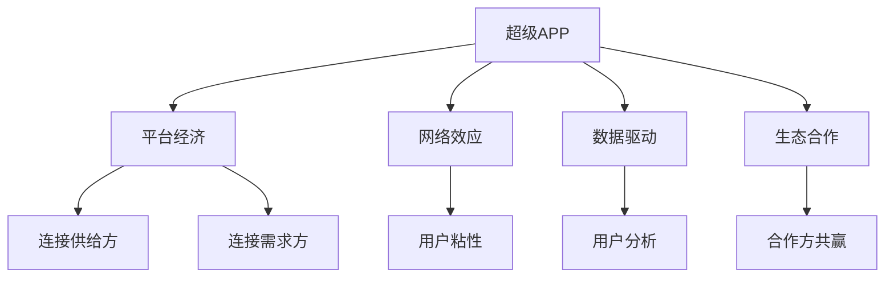

                 

## 1. 背景介绍

在移动互联网的浪潮下，超级APP（Super App）逐渐成为连接用户与服务的桥梁，构筑起一个生态闭环，在衣食住行、娱乐教育、商务合作等方面为亿万用户提供全方位、多层次的“一站式”服务。超级APP不仅极大地提升了用户的生活效率，也为创业者和开发者提供了广阔的空间，让他们可以借助大平台的力量，打造出更加优质、智能化的产品。

然而，超级APP的开发、运营、管理不仅需要强大的技术实力，还需要深入理解其背后的商业模式和平台逻辑。本文将从平台经济的角度出发，探讨超级APP创业的战略、运营和商业模式，为有意投身这一领域的创业者提供全面的指导。

## 2. 核心概念与联系

### 2.1 核心概念概述

为更好地理解超级APP创业的平台经济模式，本节将介绍几个核心概念：

- **超级APP**：以移动互联网为载体，提供“一站式”服务的综合性平台。超级APP不仅集成了各种服务和功能，还具备极强的用户粘性和市场竞争力。

- **平台经济**：通过提供公共基础设施、标准规则和市场机制，连接供给方和需求方，实现资源高效配置和价值共创的商业模式。平台经济的核心在于“连接”，即通过大平台连接千万用户和亿万商家，形成强大的生态系统。

- **网络效应**：用户数量越多，超级APP提供的价值越大，从而吸引更多用户。网络效应不仅推动了平台的发展，还提升了用户的使用体验。

- **数据驱动**：超级APP的运营离不开对海量数据的分析和利用，通过数据驱动的方式不断优化产品和服务，提升用户体验。

- **生态合作**：超级APP不仅是一个独立的平台，更是连接各行各业的桥梁，通过开放接口、提供SDK等形式，与第三方服务供应商、内容创作者等进行深度合作，构建起一个多层次、多维度、多利益相关方的生态系统。

这些核心概念之间的逻辑关系可以通过以下Mermaid流程图来展示：



这个流程图展示了大平台经济中超级APP的关键角色和其与其他核心概念之间的联系。

## 3. 核心算法原理 & 具体操作步骤
### 3.1 算法原理概述

超级APP创业的平台经济模式，涉及的算法原理主要包括：

- **推荐算法**：根据用户的行为数据和偏好，推荐个性化的内容和服务，提升用户体验。推荐算法包括协同过滤、基于内容的推荐、深度学习等方法。

- **定价策略**：基于用户价值和市场环境，制定合理的商品和服务价格，获取最大化的收益。定价策略包括动态定价、捆绑销售、拍卖等。

- **匹配算法**：匹配供给方和需求方，优化资源配置，提升平台效率。匹配算法包括撮合算法、双边市场匹配理论等。

- **流量调度**：通过智能算法，合理分配流量资源，避免资源浪费，提升平台整体效率。流量调度算法包括多臂老虎机、强化学习等。

- **用户行为分析**：通过对用户行为数据进行分析，优化产品和服务，提升用户满意度。用户行为分析包括聚类分析、关联规则挖掘、时间序列分析等。

### 3.2 算法步骤详解

超级APP的运营和商业模型中，主要包括以下几个关键步骤：

**Step 1: 平台构建**

- **技术架构设计**：根据业务需求，设计适合的技术架构，选择合适的开发框架和技术栈。例如，采用微服务架构，提高系统的可扩展性和可靠性。

- **用户体验设计**：设计和实现美观、易用的UI/UX，提升用户使用体验。例如，采用响应式设计，适配不同的设备和屏幕大小。

**Step 2: 产品开发**

- **功能模块开发**：根据用户需求，开发功能模块，如支付、社交、地图、搜索等。每个模块应独立开发，便于维护和扩展。

- **接口开放**：开发开放API和SDK，方便第三方开发者接入平台，丰富平台功能。例如，提供地图API，支持位置服务。

**Step 3: 用户获取与运营**

- **市场推广**：通过广告、公关、合作伙伴等方式，快速获取大量用户。例如，利用社交媒体平台推广超级APP。

- **用户留存**：通过个性化推荐、积分奖励、社区建设等方式，提升用户粘性，增加用户留存率。例如，提供定制化推送和积分系统。

**Step 4: 商业模式设计**

- **流量变现**：通过广告、电商、金融等渠道，实现流量变现。例如，在应用内设置广告位，按点击量或展示量收费。

- **增值服务**：开发高附加值的服务和产品，如VIP会员、高级版功能等。例如，提供高级搜索、广告投放优化等增值服务。

**Step 5: 数据驱动决策**

- **用户数据分析**：收集用户行为数据，进行分析，优化产品和服务。例如，分析用户的搜索行为，优化搜索算法。

- **运营优化**：通过数据分析，优化运营策略，提升平台效率。例如，根据用户反馈调整推荐算法。

### 3.3 算法优缺点

超级APP平台经济的主要优点包括：

- **规模效应**：由于连接了海量的用户和商家，平台拥有强大的用户粘性和流量优势，可以提供“一站式”服务，降低用户切换成本。

- **共享基础设施**：平台可以共享基础设施和服务，如支付、地图、广告等，降低开发成本，提升系统稳定性。

- **数据共享**：平台内部可以共享用户数据和行为数据，优化推荐和服务，提升用户体验。

- **多渠道变现**：平台可以通过多种渠道实现流量变现，降低单一业务的依赖风险，提升平台收益。

- **生态共赢**：平台通过与第三方合作，可以引入更多资源和服务，构建多层次的生态系统，形成良性循环。

然而，平台经济也存在一些缺点：

- **数据隐私问题**：平台需要收集和分析大量的用户数据，可能涉及隐私问题。平台需要遵守相关法律法规，保护用户隐私。

- **依赖性强**：平台对合作伙伴的依赖性强，一旦合作伙伴出现问题，可能会影响平台正常运营。

- **竞争压力大**：由于平台的竞争性，新进入者可能会采取低价策略吸引用户，对平台的盈利能力造成压力。

- **用户体验复杂**：由于平台提供的服务众多，用户需要在不同的应用间切换，用户体验可能会变得复杂。

### 3.4 算法应用领域

超级APP平台经济的应用领域非常广泛，主要包括：

- **社交电商**：通过社交网络与电商平台结合，提升用户购物体验，增加交易转化率。例如，微信通过微信支付、朋友圈广告等方式，推动电商业务。

- **生活服务**：提供衣食住行、医疗健康、教育培训等综合服务，提升用户生活质量。例如，美团通过开放API，连接各种生活服务资源。

- **金融科技**：通过支付、理财、贷款等金融服务，满足用户各种金融需求。例如，支付宝通过开放接口，推动金融业务的发展。

- **企业服务**：为企业提供办公软件、云服务、HR系统等服务，提升企业管理效率。例如，钉钉通过开放API，推动企业服务市场。

- **教育培训**：提供在线课程、在线辅导、证书考试等服务，满足用户学习和职业发展的需求。例如，好未来通过超级APP平台，提供教育培训服务。

## 4. 数学模型和公式 & 详细讲解 & 举例说明

### 4.1 数学模型构建

超级APP平台经济的数学模型，主要包括以下几个方面：

- **用户行为模型**：描述用户在不同场景下的行为模式，例如，用户在电商平台的购买行为、在社交网络上的互动行为等。

- **推荐系统模型**：基于用户行为和商品属性，推荐个性化内容和服务。推荐系统模型包括协同过滤、基于内容的推荐、深度学习等。

- **价格优化模型**：根据市场需求和成本，制定合理的商品和服务价格。价格优化模型包括动态定价、捆绑销售、拍卖等。

- **流量分配模型**：优化流量资源的分配，提高平台效率。流量分配模型包括多臂老虎机、强化学习等。

- **用户分析模型**：通过数据分析，优化产品和服务，提升用户满意度。用户分析模型包括聚类分析、关联规则挖掘、时间序列分析等。

### 4.2 公式推导过程

以下我们以协同过滤推荐系统为例，推导推荐算法的核心公式。

假设用户集为 $U$，商品集为 $I$，用户对商品的评分矩阵为 $R$。协同过滤算法根据用户之间的相似度，为用户推荐商品。设用户 $u_i$ 和 $u_j$ 的相似度为 $\text{sim}(u_i,u_j)$，用户 $u_i$ 对商品 $i$ 的评分向量为 $r_i=(\{r_{i1},r_{i2},\dots,r_{im}\})$，推荐算法如下：

$$
\hat{r}_{ij} = \text{sim}(u_i,u_j) \sum_{k=1}^m \frac{r_{kj}}{\sqrt{\sum_{l=1}^m r_{lk}^2 + \epsilon} \sqrt{\sum_{l=1}^m r_{il}^2 + \epsilon}}
$$

其中 $\epsilon$ 为平滑项，避免除以0的情况。推荐向量 $\hat{r}_{ij}$ 表示用户 $u_i$ 对商品 $i$ 的预测评分。

### 4.3 案例分析与讲解

以下以美团为例，分析其超级APP平台经济模型的具体应用。

**美团的推荐系统**：美团通过收集用户的搜索、浏览、购物等行为数据，分析用户的偏好和需求，采用协同过滤和深度学习等方法，为用户推荐餐厅、酒店、景点等服务。推荐系统不仅提高了用户的使用粘性，还增加了平台的收入。

**美团的流量变现**：美团通过开放API，接入第三方支付、金融、地图等服务，实现了流量变现。例如，美团通过微信支付，增加了平台交易额，并通过地图服务，提升了用户的使用体验。

**美团的数据分析**：美团利用大数据技术，分析用户行为数据，优化推荐算法和搜索结果。例如，通过分析用户的搜索行为，优化搜索结果排序，提升用户满意度。

**美团的运营优化**：美团通过数据分析，优化运营策略，提升平台效率。例如，通过用户反馈调整推荐算法，优化用户体验。

## 5. 项目实践：代码实例和详细解释说明
### 5.1 开发环境搭建

在进行超级APP开发前，我们需要准备好开发环境。以下是使用Python进行Flutter开发的环境配置流程：

1. 安装Dart SDK：从官网下载并安装Dart SDK，用于创建Flutter项目。

2. 创建并激活虚拟环境：
```bash
conda create -n flutter-env python=3.8 
conda activate flutter-env
```

3. 安装Flutter：从官网获取Flutter安装命令，进行安装。

4. 安装各类工具包：
```bash
pip install numpy pandas scikit-learn matplotlib tqdm jupyter notebook ipython
```

完成上述步骤后，即可在`flutter-env`环境中开始超级APP的开发。

### 5.2 源代码详细实现

这里我们以美团为例，给出使用Flutter进行超级APP开发的代码实现。

```dart
import 'package:flutter/material.dart';

void main() {
  runApp(MyApp());
}

class MyApp extends StatelessWidget {
  @override
  Widget build(BuildContext context) {
    return MaterialApp(
      title: '美团超级APP',
      home: Home(),
    );
  }
}

class Home extends StatelessWidget {
  @override
  Widget build(BuildContext context) {
    return Scaffold(
      appBar: AppBar(
        title: Text('美团超级APP'),
      ),
      body: Center(
        child: Column(
          children: [
            TextField(),
            RaisedButton(
              onPressed: () {},
              child: Text('搜索'),
            ),
          ],
        ),
      ),
    );
  }
}
```

### 5.3 代码解读与分析

让我们再详细解读一下关键代码的实现细节：

**MyApp类**：
- `main`方法：启动应用。
- `build`方法：定义应用的初始化逻辑。

**Home类**：
- `build`方法：定义应用的页面结构。
- 使用`MaterialApp`创建应用实例，包含`AppBar`和`Scaffold`等组件。
- 使用`TextField`和`RaisedButton`组件实现简单的搜索功能。

以上代码展示了使用Flutter进行超级APP开发的基本流程，包括创建应用、定义页面结构、实现功能模块等。

## 6. 实际应用场景

### 6.1 社交电商

超级APP的社交电商功能，通过将社交网络与电商平台结合，大大提升了用户购物的便捷性和趣味性。用户可以通过社交网络分享商品，获取更多推荐和优惠，同时也可以在社交平台上与好友互动，增加购物体验。例如，微信通过朋友圈、微信支付等方式，推动电商业务的发展。

### 6.2 生活服务

超级APP提供的生活服务，涵盖衣食住行、医疗健康、教育培训等多个领域，极大地丰富了用户的生活选择。例如，美团通过开放API，连接各种生活服务资源，用户可以在一个平台上完成订餐、打车、购票等服务。

### 6.3 金融科技

超级APP的金融科技功能，通过提供支付、理财、贷款等金融服务，满足了用户的各种金融需求。例如，支付宝通过开放接口，推动金融业务的发展，用户可以在一个平台上完成支付、转账、理财等操作。

### 6.4 企业服务

超级APP的企业服务功能，通过提供办公软件、云服务、HR系统等服务，提升了企业的管理效率。例如，钉钉通过开放API，推动企业服务市场，企业可以在一个平台上完成办公协作、文档管理、招聘等操作。

### 6.5 教育培训

超级APP的教育培训功能，通过提供在线课程、在线辅导、证书考试等服务，满足了用户的学习和职业发展的需求。例如，好未来通过超级APP平台，提供教育培训服务，用户可以在一个平台上完成在线学习、考试报名等操作。

## 7. 工具和资源推荐
### 7.1 学习资源推荐

为了帮助开发者系统掌握超级APP平台经济的理论基础和实践技巧，这里推荐一些优质的学习资源：

1. 《超级APP平台经济》系列博文：由超级APP技术专家撰写，深入浅出地介绍了平台经济的原理、实践和创新点。

2. Coursera《移动互联网应用开发》课程：由Coursera提供的在线课程，涵盖Flutter、React Native等移动应用开发技术。

3. Udacity《平台经济设计》课程：由Udacity提供的在线课程，系统介绍了平台经济的基本概念和设计原则。

4. Google官方文档：Flutter官方文档，提供了丰富的开发教程、API文档和示例代码，是Flutter开发的必备资料。

5. 美团官方文档：美团官方文档，提供了丰富的开发接口和文档，是美团开发的必备资料。

通过对这些资源的学习实践，相信你一定能够快速掌握超级APP平台经济的精髓，并用于解决实际的NLP问题。

### 7.2 开发工具推荐

高效的开发离不开优秀的工具支持。以下是几款用于超级APP开发的常用工具：

1. Flutter：由Google开发的移动应用开发框架，支持iOS和Android平台，提供了丰富的组件和插件，便于快速开发。

2. React Native：由Facebook开发的跨平台开发框架，支持iOS和Android平台，提供了丰富的组件和插件，便于快速开发。

3. Xcode和Android Studio：由苹果和谷歌提供的开发工具，支持iOS和Android平台，提供了丰富的开发环境和调试工具，是移动应用开发的主流选择。

4. GitLab和GitHub：代码版本控制平台，支持团队协作和代码托管，是软件开发的重要工具。

5. JIRA和Trello：项目管理工具，支持任务分配、进度跟踪和团队协作，是软件开发的重要工具。

合理利用这些工具，可以显著提升超级APP的开发效率，加快创新迭代的步伐。

### 7.3 相关论文推荐

超级APP平台经济的发展源于学界的持续研究。以下是几篇奠基性的相关论文，推荐阅读：

1. Platform Economy: A Survey on Marketplaces（平台经济综述）：由市场研究专家撰写，介绍了平台经济的基本概念和市场特征。

2. Understanding Platform Economies: A Multi-Stakeholder Approach（理解平台经济）：由商业分析师撰写，介绍了平台经济的多利益相关方模型和运作机制。

3. The Value of Platforms: A Network Effects Approach（平台价值）：由经济学家撰写，介绍了平台价值的多维度衡量方法。

4. Social Commerce: A New Challenge for E-Commerce Platforms（社交电商挑战）：由电子商务专家撰写，介绍了社交电商的市场趋势和运营策略。

5. Cloud Computing in Platform Economies（云计算平台经济）：由云计算专家撰写，介绍了云计算在平台经济中的应用和发展。

这些论文代表了大平台经济的发展脉络。通过学习这些前沿成果，可以帮助研究者把握学科前进方向，激发更多的创新灵感。

## 8. 总结：未来发展趋势与挑战
### 8.1 总结

本文对超级APP创业的平台经济模式进行了全面系统的介绍。首先阐述了超级APP的战略、运营和商业模式，明确了平台经济的核心在于“连接”，即通过大平台连接千万用户和亿万商家，形成强大的生态系统。其次，从推荐算法、定价策略、匹配算法等核心算法原理出发，详细讲解了平台经济下的运营和技术实现细节。最后，通过美团等实际案例，展示了超级APP平台经济的广泛应用和巨大潜力。

通过本文的系统梳理，可以看到，超级APP平台经济正在成为移动互联网时代的重要范式，为亿万用户提供“一站式”服务，极大地提升了用户的生活效率和体验。未来，伴随平台经济的不断演进，超级APP必将在更多领域大放异彩，推动社会的数字化转型。

### 8.2 未来发展趋势

展望未来，超级APP平台经济将呈现以下几个发展趋势：

1. **多元化服务**：超级APP将进一步拓展服务种类，涵盖更多领域，如智能家居、车联网等，成为全面的智能生活服务平台。

2. **智能化运营**：超级APP将引入更多人工智能技术，如自然语言处理、计算机视觉、语音识别等，提升平台的智能化水平，为用户提供更精准的服务。

3. **生态系统化**：超级APP将与更多行业和平台进行深度合作，构建更加完善的生态系统，形成良性循环。

4. **国际化扩展**：超级APP将加速国际化布局，拓展海外市场，提升全球竞争力。

5. **数据驱动决策**：超级APP将进一步强化数据驱动决策，通过大数据和人工智能技术，优化运营和产品，提升用户体验。

### 8.3 面临的挑战

尽管超级APP平台经济已经取得了瞩目成就，但在迈向更加智能化、普适化应用的过程中，它仍面临着诸多挑战：

1. **用户隐私问题**：超级APP需要收集和分析大量的用户数据，可能涉及隐私问题。平台需要遵守相关法律法规，保护用户隐私。

2. **平台依赖性强**：超级APP对合作伙伴的依赖性强，一旦合作伙伴出现问题，可能会影响平台正常运营。

3. **市场竞争压力大**：由于平台的竞争性，新进入者可能会采取低价策略吸引用户，对平台的盈利能力造成压力。

4. **用户体验复杂**：由于平台提供的服务众多，用户需要在不同的应用间切换，用户体验可能会变得复杂。

5. **安全性问题**：超级APP需要防范网络攻击、数据泄露等安全风险，保障用户和平台的安全。

6. **法律法规风险**：超级APP需要遵守各国法律法规，避免侵犯用户权益和违反法律法规。

### 8.4 研究展望

面对超级APP平台经济所面临的挑战，未来的研究需要在以下几个方面寻求新的突破：

1. **隐私保护技术**：开发更高效、更安全的隐私保护技术，如差分隐私、联邦学习等，确保用户数据安全。

2. **平台生态优化**：优化平台生态系统，提升平台和合作伙伴的合作效率，降低依赖风险。

3. **竞争策略优化**：研究新型竞争策略，如社区运营、内容聚合等，提升平台的竞争力。

4. **用户体验优化**：提升用户体验，减少用户切换成本，提升用户粘性。

5. **安全保障技术**：开发更强大的安全保障技术，如加密技术、区块链等，保障用户和平台的安全。

6. **法律法规研究**：加强对法律法规的研究，确保平台运营符合各国法律法规，避免法律风险。

这些研究方向的探索，必将引领超级APP平台经济迈向更高的台阶，为亿万用户提供更加优质、智能、安全的服务。未来，伴随技术、市场、政策等多方面的协同发力，超级APP必将在更多领域大放异彩，推动社会的数字化转型和智能化升级。

## 9. 附录：常见问题与解答

**Q1：超级APP创业需要哪些核心资源？**

A: 超级APP创业需要以下核心资源：

1. **技术人才**：需要具备移动互联网开发、数据分析、人工智能等技术背景的人才，负责开发和运营。

2. **用户资源**：需要大量的用户资源，通过市场推广、社交媒体等手段，快速获取用户。

3. **合作伙伴**：需要与第三方服务供应商、内容创作者等进行深度合作，丰富平台功能。

4. **资金资源**：需要充足的资金支持，用于开发、运营、推广等。

5. **政策支持**：需要政策支持，如政府补贴、税收优惠等，降低运营成本。

**Q2：如何构建超级APP的推荐系统？**

A: 构建超级APP的推荐系统，主要包括以下几个步骤：

1. **数据收集**：收集用户行为数据，如搜索、浏览、购买等。

2. **数据清洗**：对数据进行清洗，去除无效和异常数据。

3. **用户建模**：构建用户画像，分析用户的行为模式和偏好。

4. **商品建模**：构建商品特征，分析商品的属性和属性关系。

5. **推荐算法**：采用协同过滤、基于内容的推荐、深度学习等算法，为用户推荐商品。

6. **模型评估**：使用AUC、RMSE等指标，评估推荐模型的效果。

7. **模型优化**：根据评估结果，优化推荐模型，提升推荐效果。

**Q3：如何优化超级APP的用户体验？**

A: 优化超级APP的用户体验，主要包括以下几个方面：

1. **界面设计**：设计美观、易用的UI/UX，提升用户使用体验。

2. **功能完善**：丰富应用功能，满足用户的多样化需求。

3. **性能优化**：提升应用的响应速度和稳定性，减少用户等待时间。

4. **个性化推荐**：根据用户行为数据，提供个性化的服务和内容。

5. **社区建设**：建立用户社区，增强用户粘性，提升用户参与度。

6. **反馈机制**：建立用户反馈机制，及时了解用户需求，优化产品和服务。

7. **用户体验测试**：通过用户测试，不断优化用户体验，提升用户满意度。

**Q4：如何保障超级APP的数据安全？**

A: 保障超级APP的数据安全，主要包括以下几个方面：

1. **数据加密**：对用户数据进行加密存储和传输，防止数据泄露。

2. **访问控制**：采用严格的访问控制策略，确保只有授权人员才能访问敏感数据。

3. **安全监控**：建立安全监控系统，实时监测异常行为，及时发现和处理安全威胁。

4. **合规审查**：遵守各国法律法规，确保数据处理符合法律法规。

5. **应急响应**：制定应急响应计划，及时处理安全事件，保障平台和用户的安全。

6. **隐私保护技术**：采用差分隐私、联邦学习等技术，保护用户隐私。

以上问题及解答，展示了超级APP平台经济的广阔前景和复杂挑战，相信通过深入研究和不断实践，未来的超级APP必将实现更高的发展，为用户和社会带来更多的价值。

---

作者：禅与计算机程序设计艺术 / Zen and the Art of Computer Programming

