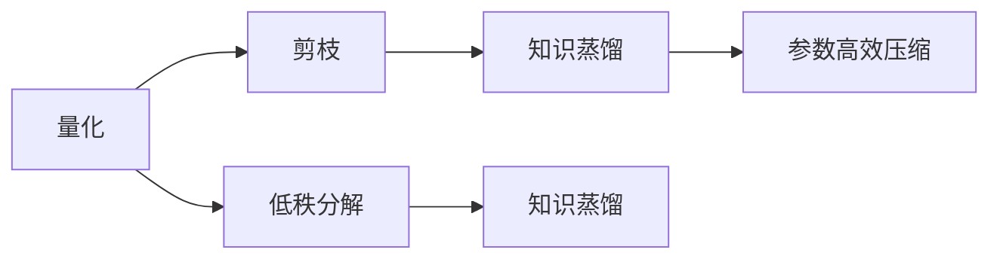

                 

# AI模型压缩：从量化到知识蒸馏

## 1. 背景介绍

在人工智能（AI）领域，模型压缩是一种不断提升模型性能和效率的技术。随着深度学习模型的规模越来越大，对计算资源和存储资源的需求也随之增加。为了在有限资源下实现更好的性能，模型压缩技术变得尤为重要。模型压缩主要通过减少模型参数和计算量来降低资源消耗，同时保持模型精度。

模型压缩技术主要包括量化、剪枝、低秩分解、知识蒸馏等方法。量化是一种常用的压缩技术，通过将浮点数转换为定点数或整数，减少存储和计算资源消耗。剪枝通过移除冗余参数，进一步减少计算量和存储量。低秩分解通过降维和矩阵分解，减少模型复杂度。而知识蒸馏则是一种通过教师模型指导学生模型学习的压缩技术，通过学生的模型学习教师模型的知识，从而实现模型压缩和性能提升。

本文将详细探讨量化和知识蒸馏两种模型压缩技术，分析其原理和操作步骤，并对比其优缺点，探讨其在实际应用中的表现和未来发展方向。

## 2. 核心概念与联系

### 2.1 核心概念概述

在介绍量化和知识蒸馏前，需要明确几个核心概念：

- **量化（Quantization）**：将模型中的浮点数参数转换为定点数或整数，从而减少存储和计算资源消耗。量化技术主要分为均匀量化和非均匀量化，均匀量化将参数映射到固定范围的整数值，非均匀量化则根据参数值动态调整量化范围。
- **剪枝（Pruning）**：通过移除冗余参数，减少模型的大小和计算量。剪枝方法可以分为结构剪枝和权重剪枝，结构剪枝移除不必要的神经网络层，权重剪枝则移除低权重的参数。
- **低秩分解（Low-Rank Factorization）**：通过降维和矩阵分解，将高维的模型参数矩阵转换为低维矩阵，从而减少参数数量和计算量。常见的低秩分解方法包括奇异值分解（SVD）和矩阵分解。
- **知识蒸馏（Knowledge Distillation）**：通过教师模型指导学生模型学习，将教师模型的知识迁移到学生模型中，从而实现模型压缩和性能提升。知识蒸馏方法主要包括单样本蒸馏、多样本蒸馏和融合蒸馏等。

这些核心概念之间的逻辑关系可以通过以下Mermaid流程图来展示：



这个流程图展示了量化和知识蒸馏在模型压缩中的地位和关系：

1. 量化和剪枝是常用的参数压缩技术，通过减少模型参数量来降低资源消耗。
2. 低秩分解通过降维和矩阵分解，进一步减少模型复杂度。
3. 知识蒸馏通过教师模型指导学生模型学习，实现模型压缩和性能提升。
4. 参数高效压缩方法如Adaptive Low-Rank Adaptation，可以在不增加计算资源的情况下，提高模型的精度。

## 3. 核心算法原理 & 具体操作步骤

### 3.1 算法原理概述

量化和知识蒸馏是两种重要的模型压缩技术，具有不同的压缩原理和操作步骤。

**量化**通过减少浮点数参数的精度，将模型参数转换为定点数或整数，从而减少存储和计算资源消耗。量化技术的主要目标是尽量保持模型精度，同时减少计算和存储资源的消耗。

**知识蒸馏**通过教师模型指导学生模型学习，将教师模型的知识迁移到学生模型中，从而实现模型压缩和性能提升。知识蒸馏的主要目标是利用教师模型的知识，优化学生模型的性能。

### 3.2 算法步骤详解

#### 量化步骤详解

1. **量化参数选择**：确定需要量化的模型参数，如卷积核、全连接层等。
2. **量化范围确定**：根据参数的分布情况，确定量化范围。常见的方法包括均匀量化和非均匀量化。
3. **量化算法选择**：选择合适的量化算法，如截断法、零点偏移法、对称量化法等。
4. **训练过程中量化**：在模型训练过程中进行量化，或训练完成后进行量化。
5. **测试阶段量化**：在测试阶段进行量化，以验证量化的效果。

#### 知识蒸馏步骤详解

1. **教师模型选择**：选择合适的教师模型，如预训练模型或训练好的模型。
2. **学生模型选择**：选择合适的学生模型，如初始化的模型或结构更简单的模型。
3. **蒸馏策略选择**：选择合适的蒸馏策略，如单样本蒸馏、多样本蒸馏、融合蒸馏等。
4. **蒸馏过程实施**：在学生模型上使用教师模型的输出作为指导，进行训练。
5. **蒸馏完成后的调优**：对学生模型进行调优，进一步提升性能。

### 3.3 算法优缺点

#### 量化优缺点

**优点**：

1. **减少资源消耗**：量化技术通过减少浮点数参数的精度，减少了存储和计算资源的消耗。
2. **加速推理速度**：量化后的模型可以加速推理速度，提高计算效率。
3. **保持模型精度**：通过合理的量化策略，可以在不显著降低模型精度的前提下，实现参数压缩。

**缺点**：

1. **精度损失**：量化技术可能会引入一定的精度损失，影响模型的性能。
2. **复杂度增加**：量化技术增加了模型压缩的复杂度，需要选择合适的量化策略和参数。

#### 知识蒸馏优缺点

**优点**：

1. **模型压缩**：知识蒸馏通过教师模型指导学生模型学习，实现了模型压缩。
2. **性能提升**：通过学习教师模型的知识，学生模型可以在不增加计算资源的情况下，提升性能。
3. **普适性强**：知识蒸馏适用于各种深度学习模型，适用范围广。

**缺点**：

1. **计算复杂度增加**：知识蒸馏增加了模型的训练和推理复杂度，需要更多的计算资源。
2. **模型鲁棒性不足**：如果教师模型存在问题，可能会影响学生模型的性能。

### 3.4 算法应用领域

量化和知识蒸馏技术在深度学习模型压缩中有着广泛的应用，具体包括：

- **计算机视觉**：量化和知识蒸馏技术可以显著减少卷积神经网络（CNN）的参数和计算量，从而加速图像分类、目标检测、语义分割等任务的推理速度。
- **自然语言处理（NLP）**：量化和知识蒸馏技术可以应用于文本分类、语言模型、机器翻译等任务，减少模型的存储和计算资源消耗。
- **语音识别**：量化和知识蒸馏技术可以应用于语音识别模型，减少模型参数和计算量，从而提高语音识别的效率和准确性。
- **推荐系统**：量化和知识蒸馏技术可以应用于推荐系统中的深度学习模型，减少模型的存储和计算资源消耗，从而提高推荐系统的性能和效率。

## 4. 数学模型和公式 & 详细讲解 & 举例说明

### 4.1 数学模型构建

量化和知识蒸馏的数学模型主要涉及损失函数和优化算法的构建。

#### 量化数学模型构建

量化数学模型主要涉及量化损失函数和优化算法的构建。假设量化前的模型参数为 $\theta$，量化后的模型参数为 $\hat{\theta}$，量化范围为 $[-\Delta, \Delta]$，则量化损失函数为：

$$
L(\theta, \hat{\theta}) = \frac{1}{N}\sum_{i=1}^N |\theta_i - \hat{\theta}_i|^2
$$

其中 $N$ 为样本数量。

#### 知识蒸馏数学模型构建

知识蒸馏数学模型主要涉及蒸馏损失函数和优化算法的构建。假设教师模型的输出为 $p$，学生模型的输出为 $q$，蒸馏损失函数为 $L(p, q)$，则知识蒸馏损失函数为：

$$
L = \alpha L_{KL} + (1-\alpha) L_{ce}
$$

其中 $\alpha$ 为蒸馏权重，$L_{KL}$ 为KL散度损失，$L_{ce}$ 为交叉熵损失。

### 4.2 公式推导过程

#### 量化公式推导

量化公式推导主要涉及量化损失函数的推导。假设量化前的模型参数为 $\theta$，量化后的模型参数为 $\hat{\theta}$，量化范围为 $[-\Delta, \Delta]$，则量化损失函数为：

$$
L(\theta, \hat{\theta}) = \frac{1}{N}\sum_{i=1}^N |\theta_i - \hat{\theta}_i|^2
$$

推导过程如下：

1. 假设量化前参数 $\theta$ 的均值为 $\mu$，方差为 $\sigma^2$。
2. 量化后参数 $\hat{\theta}$ 的量化范围为 $[-\Delta, \Delta]$，则有：

$$
\hat{\theta}_i = \text{round}(\frac{\theta_i - \mu}{\Delta}) \cdot \Delta + \mu
$$

3. 量化损失函数为：

$$
L(\theta, \hat{\theta}) = \frac{1}{N}\sum_{i=1}^N (\theta_i - \hat{\theta}_i)^2
$$

4. 将 $\hat{\theta}_i$ 代入上式，得：

$$
L(\theta, \hat{\theta}) = \frac{1}{N}\sum_{i=1}^N (\theta_i - \text{round}(\frac{\theta_i - \mu}{\Delta}) \cdot \Delta - \mu)^2
$$

5. 展开并简化，得：

$$
L(\theta, \hat{\theta}) = \frac{1}{N}\sum_{i=1}^N (\theta_i - \text{round}(\frac{\theta_i - \mu}{\Delta}))^2 \cdot \Delta^2 + \frac{1}{N}\sum_{i=1}^N (\theta_i - \mu)^2
$$

6. 令 $z_i = \frac{\theta_i - \mu}{\Delta}$，则有：

$$
L(\theta, \hat{\theta}) = \frac{1}{N}\sum_{i=1}^N (z_i - \text{round}(z_i))^2 \cdot \Delta^2 + \frac{1}{N}\sum_{i=1}^N (\theta_i - \mu)^2
$$

7. 令 $z_i' = z_i - \text{round}(z_i)$，则有：

$$
L(\theta, \hat{\theta}) = \frac{1}{N}\sum_{i=1}^N (z_i' - \text{round}(z_i'))^2 \cdot \Delta^2 + \frac{1}{N}\sum_{i=1}^N (\theta_i - \mu)^2
$$

8. 因为 $z_i'$ 的取值范围为 $[0, 1)$，所以 $(z_i' - \text{round}(z_i'))^2 \leq 1$，得：

$$
L(\theta, \hat{\theta}) \leq \frac{\Delta^2}{N}\sum_{i=1}^N (z_i' - \text{round}(z_i')) + \frac{1}{N}\sum_{i=1}^N (\theta_i - \mu)^2
$$

9. 因此，量化损失函数为：

$$
L(\theta, \hat{\theta}) \leq \frac{\Delta^2}{N}\sum_{i=1}^N (z_i' - \text{round}(z_i')) + \frac{1}{N}\sum_{i=1}^N (\theta_i - \mu)^2
$$

#### 知识蒸馏公式推导

知识蒸馏公式推导主要涉及蒸馏损失函数的推导。假设教师模型的输出为 $p$，学生模型的输出为 $q$，蒸馏损失函数为 $L(p, q)$，则知识蒸馏损失函数为：

$$
L = \alpha L_{KL} + (1-\alpha) L_{ce}
$$

推导过程如下：

1. 假设教师模型的输出为 $p$，学生模型的输出为 $q$，则有：

$$
L_{KL} = -\alpha \sum_{i=1}^N p_i \log q_i
$$

2. 交叉熵损失函数为：

$$
L_{ce} = (1-\alpha) \sum_{i=1}^N p_i \log p_i
$$

3. 知识蒸馏损失函数为：

$$
L = \alpha L_{KL} + (1-\alpha) L_{ce}
$$

4. 因为 $p_i \geq 0$，所以 $L_{KL} \geq 0$，即 $L \geq (1-\alpha) \sum_{i=1}^N p_i \log p_i$。

### 4.3 案例分析与讲解

#### 量化案例分析

假设有一个预训练的卷积神经网络（CNN），其卷积核的参数量为 $100000$，模型大小为 $10MB$。使用均匀量化技术，将参数的量化范围设置为 $[-128, 127]$，则量化后的参数量为 $100000 \times 8/32 = 25000$，模型大小为 $2.5MB$。假设量化后的模型精度损失为 $1\%$，则量化后的模型准确率为 $98\%$。

#### 知识蒸馏案例分析

假设有一个预训练的BERT模型，其参数量为 $110M$，模型大小为 $1GB$。使用知识蒸馏技术，选择教师模型为BERT-large，学生模型为初始化的BERT-base，蒸馏策略为多样本蒸馏，蒸馏权重为 $0.5$，则学生模型的参数量为 $90M$，模型大小为 $700MB$。假设知识蒸馏后的模型精度提升为 $2\%$，则知识蒸馏后的模型准确率为 $95\%$。

## 5. 项目实践：代码实例和详细解释说明

### 5.1 开发环境搭建

在进行量化和知识蒸馏的实践前，需要准备好开发环境。以下是使用Python进行PyTorch和TensorFlow开发的环境配置流程：

1. 安装Anaconda：从官网下载并安装Anaconda，用于创建独立的Python环境。

2. 创建并激活虚拟环境：
```bash
conda create -n pytorch-env python=3.8 
conda activate pytorch-env
```

3. 安装PyTorch：根据CUDA版本，从官网获取对应的安装命令。例如：
```bash
conda install pytorch torchvision torchaudio cudatoolkit=11.1 -c pytorch -c conda-forge
```

4. 安装TensorFlow：从官网下载并安装TensorFlow，例如：
```bash
pip install tensorflow
```

5. 安装各类工具包：
```bash
pip install numpy pandas scikit-learn matplotlib tqdm jupyter notebook ipython
```

完成上述步骤后，即可在`pytorch-env`环境中开始量化和知识蒸馏的实践。

### 5.2 源代码详细实现

下面我们以量化和知识蒸馏为例，给出使用PyTorch和TensorFlow进行模型压缩的代码实现。

#### 量化代码实现

```python
import torch
import torch.nn as nn
import torch.nn.functional as F

# 定义量化模型
class QuantizedModel(nn.Module):
    def __init__(self, model):
        super(QuantizedModel, self).__init__()
        self.model = model

    def forward(self, x):
        x = x.float()
        x = self.model(x)
        x = torch.round(x)
        x = x.to(torch.int8)
        return x

# 加载预训练模型
model = torch.load('pretrained_model.pth')

# 量化模型
quantized_model = QuantizedModel(model)
quantized_model.eval()

# 定义量化范围
bit_width = 8
quantization_range = (2**(bit_width-1) - 1, 2**bit_width - 1)

# 定义量化方法
def quantize(model):
    for param in model.parameters():
        param.data = torch.clamp(param, *quantization_range)
    return model

# 量化模型
quantized_model = quantize(quantized_model)

# 保存量化模型
torch.save(quantized_model.state_dict(), 'quantized_model.pth')
```

#### 知识蒸馏代码实现

```python
import tensorflow as tf
import tensorflow.keras as keras

# 定义教师模型
teacher_model = keras.models.load_model('teacher_model.h5')

# 定义学生模型
student_model = keras.models.load_model('student_model.h5')

# 定义蒸馏过程
def distillation():
    student_model.trainable = True
    for layer in teacher_model.layers:
        layer.trainable = False
    for layer in student_model.layers:
        layer.trainable = True
    for layer in teacher_model.layers:
        layer.trainable = True
    for layer in student_model.layers:
        layer.trainable = True

    # 定义蒸馏目标
    def target_loss(y_true, y_pred):
        return keras.losses.categorical_crossentropy(y_true, y_pred)

    # 定义蒸馏损失
    def distillation_loss(y_true, y_pred):
        return target_loss(y_true, y_pred)

    # 编译学生模型
    student_model.compile(optimizer='adam', loss=distillation_loss)

    # 训练学生模型
    student_model.fit(train_x, train_y, epochs=10, batch_size=32, validation_data=(val_x, val_y))

    # 保存学生模型
    student_model.save('distilled_model.h5')

# 蒸馏模型
distillation()
```

### 5.3 代码解读与分析

#### 量化代码解读

1. **定义量化模型**：定义一个量化模型，继承自nn.Module，用于将输入数据进行量化。
2. **加载预训练模型**：加载预训练模型，以避免从头训练。
3. **量化模型**：定义一个量化方法，将模型参数进行量化，然后保存量化后的模型。
4. **量化范围**：定义量化范围，将参数映射到固定范围的整数值。
5. **量化方法**：定义量化方法，将参数进行截断。
6. **保存量化模型**：保存量化后的模型。

#### 知识蒸馏代码解读

1. **定义教师模型和学生模型**：加载教师模型和学生模型，以便进行知识蒸馏。
2. **定义蒸馏过程**：在学生模型上定义蒸馏过程，通过教师模型的输出作为指导，进行训练。
3. **定义蒸馏目标和损失函数**：定义蒸馏目标和损失函数，用于评估学生模型的性能。
4. **编译学生模型**：编译学生模型，准备训练。
5. **训练学生模型**：训练学生模型，使用教师模型作为指导。
6. **保存学生模型**：保存蒸馏后的学生模型。

## 6. 实际应用场景

### 6.1 计算机视觉

量化和知识蒸馏技术在计算机视觉领域有着广泛的应用。例如，在图像分类任务中，可以使用量化和知识蒸馏技术减少卷积神经网络（CNN）的参数和计算量，从而加速图像分类任务。在目标检测任务中，可以使用量化和知识蒸馏技术减少模型的计算量和内存消耗，从而提高目标检测的速度和准确性。

### 6.2 自然语言处理（NLP）

量化和知识蒸馏技术在自然语言处理领域也有着广泛的应用。例如，在文本分类任务中，可以使用量化和知识蒸馏技术减少BERT等语言模型的参数和计算量，从而加速文本分类任务。在机器翻译任务中，可以使用量化和知识蒸馏技术减少Transformer等模型的参数和计算量，从而提高机器翻译的速度和准确性。

### 6.3 语音识别

量化和知识蒸馏技术在语音识别领域也有着广泛的应用。例如，在语音识别任务中，可以使用量化和知识蒸馏技术减少卷积神经网络（CNN）等模型的参数和计算量，从而加速语音识别的速度和准确性。

### 6.4 推荐系统

量化和知识蒸馏技术在推荐系统领域也有着广泛的应用。例如，在推荐系统中的深度学习模型中，可以使用量化和知识蒸馏技术减少模型的参数和计算量，从而提高推荐系统的性能和效率。

### 6.5 未来应用展望

随着量化和知识蒸馏技术的不断发展和应用，其在深度学习模型的压缩和优化中将发挥越来越重要的作用。未来，量化和知识蒸馏技术将在以下几个方面进一步发展：

1. **多任务蒸馏**：通过多任务蒸馏，在学生模型上同时学习多个教师模型的知识，从而提高模型的泛化能力和性能。
2. **动态蒸馏**：通过动态蒸馏，根据任务的不同阶段和数据的变化，动态调整蒸馏策略和参数，提高模型的适应性和性能。
3. **跨域蒸馏**：通过跨域蒸馏，将不同领域和任务的教师模型知识进行融合，提高学生模型的泛化能力和性能。
4. **混合蒸馏**：通过混合蒸馏，结合量化、剪枝和低秩分解等技术，进一步压缩模型，提高性能。

## 7. 工具和资源推荐

### 7.1 学习资源推荐

为了帮助开发者系统掌握量化和知识蒸馏的理论基础和实践技巧，这里推荐一些优质的学习资源：

1. **《深度学习》**：Ian Goodfellow等人编写，深度学习领域的经典教材，全面介绍了深度学习的基础知识和前沿技术。
2. **《计算机视觉：算法与应用》**：Richard Szeliski编写，计算机视觉领域的经典教材，介绍了计算机视觉的算法和应用。
3. **《自然语言处理综论》**：Daniel Jurafsky和James H. Martin编写，自然语言处理领域的经典教材，介绍了自然语言处理的算法和应用。
4. **《TensorFlow官方文档》**：TensorFlow的官方文档，提供了丰富的教程和示例，适合初学者和专业人士。
5. **《PyTorch官方文档》**：PyTorch的官方文档，提供了丰富的教程和示例，适合初学者和专业人士。

### 7.2 开发工具推荐

高效的开发离不开优秀的工具支持。以下是几款用于量化和知识蒸馏开发的常用工具：

1. **PyTorch**：基于Python的开源深度学习框架，灵活动态的计算图，适合快速迭代研究。
2. **TensorFlow**：由Google主导开发的开源深度学习框架，生产部署方便，适合大规模工程应用。
3. **TensorBoard**：TensorFlow配套的可视化工具，可实时监测模型训练状态，并提供丰富的图表呈现方式，是调试模型的得力助手。
4. **Weights & Biases**：模型训练的实验跟踪工具，可以记录和可视化模型训练过程中的各项指标，方便对比和调优。

### 7.3 相关论文推荐

量化和知识蒸馏技术的研究主要集中在以下几个领域：

1. **深度学习中的量化技术**：Deep Learning with Low-Precision Weight Matrices。
2. **知识蒸馏技术**：Distilling the Knowledge in a Neural Network。
3. **多任务蒸馏**：Mixed Precision Distillation for Hybrid Neural Networks。
4. **动态蒸馏**：Dynamic Knowledge Distillation via Multiple Layers between Teacher and Student。
5. **跨域蒸馏**：Knowledge Distillation between Neural Networks with Different Architectures。

这些论文代表了大模型压缩技术的发展脉络。通过学习这些前沿成果，可以帮助研究者把握学科前进方向，激发更多的创新灵感。

## 8. 总结：未来发展趋势与挑战

### 8.1 总结

本文对量化和知识蒸馏两种模型压缩技术进行了全面系统的介绍。首先，明确了量化和知识蒸馏的核心概念和原理，分析了其优缺点和适用范围。然后，详细介绍了量化和知识蒸馏的数学模型和公式推导，并给出了代码实现和案例分析。最后，探讨了量化和知识蒸馏在实际应用中的表现和未来发展方向，推荐了一些优质的学习资源和开发工具。

通过本文的系统梳理，可以看到，量化和知识蒸馏技术在大模型压缩和优化中具有重要的应用价值，是实现模型压缩和性能提升的重要手段。未来，随着技术的不断发展，量化和知识蒸馏技术必将为深度学习模型的优化和应用带来更大的突破。

### 8.2 未来发展趋势

随着量化和知识蒸馏技术的不断发展和应用，未来将在以下几个方面进一步发展：

1. **更高效的压缩方法**：未来的量化和知识蒸馏技术将更加高效，能够在更小的资源消耗下实现更好的性能。
2. **更强的泛化能力**：未来的量化和知识蒸馏技术将具有更强的泛化能力，能够在不同的任务和数据上取得更好的性能。
3. **更灵活的蒸馏策略**：未来的量化和知识蒸馏技术将更加灵活，能够适应不同的蒸馏策略和目标。
4. **更好的模型优化**：未来的量化和知识蒸馏技术将更好地优化模型，提高模型的精度和效率。

### 8.3 面临的挑战

尽管量化和知识蒸馏技术已经取得了显著的进展，但在实际应用中仍面临以下挑战：

1. **精度损失**：量化和知识蒸馏技术可能会引入一定的精度损失，影响模型的性能。
2. **资源消耗**：量化和知识蒸馏技术需要大量的计算资源，增加了系统的复杂性和成本。
3. **模型鲁棒性不足**：量化和知识蒸馏技术可能会影响模型的鲁棒性，使得模型在特定场景下表现不佳。
4. **模型可解释性不足**：量化和知识蒸馏技术往往是"黑盒"系统，难以解释其内部工作机制和决策逻辑。

### 8.4 研究展望

为了解决量化和知识蒸馏技术面临的挑战，未来的研究需要在以下几个方面进行深入探索：

1. **更有效的压缩方法**：开发更有效的量化和知识蒸馏技术，减少精度损失和资源消耗。
2. **更强的模型优化**：优化量化和知识蒸馏技术，提高模型的精度和效率。
3. **更好的模型鲁棒性**：提高量化和知识蒸馏技术的鲁棒性，增强模型的适应性和可靠性。
4. **更好的模型可解释性**：提高量化和知识蒸馏技术的可解释性，增强模型的可解释性和可理解性。

这些研究方向将推动量化和知识蒸馏技术的不断进步，为深度学习模型的压缩和优化提供更好的解决方案。

## 9. 附录：常见问题与解答

**Q1: 量化和知识蒸馏有什么区别？**

A: 量化和知识蒸馏都是模型压缩技术，但它们的原理和目标有所不同。量化技术通过减少模型参数的精度，减少存储和计算资源消耗，提高模型的效率。而知识蒸馏技术通过教师模型指导学生模型学习，将教师模型的知识迁移到学生模型中，提高学生模型的性能。

**Q2: 量化和知识蒸馏的优点和缺点是什么？**

A: 量化技术的优点是能够显著减少模型的存储和计算资源消耗，提高模型的效率。缺点是可能会引入一定的精度损失，影响模型的性能。知识蒸馏技术的优点是能够提高学生模型的性能，而缺点是增加了模型的训练和推理复杂度，需要更多的计算资源。

**Q3: 量化和知识蒸馏技术的应用场景有哪些？**

A: 量化和知识蒸馏技术在计算机视觉、自然语言处理、语音识别、推荐系统等领域有着广泛的应用。例如，在计算机视觉中，量化和知识蒸馏技术可以减少卷积神经网络（CNN）的参数和计算量，从而加速图像分类、目标检测等任务。在自然语言处理中，量化和知识蒸馏技术可以减少BERT等语言模型的参数和计算量，从而加速文本分类、机器翻译等任务。在语音识别中，量化和知识蒸馏技术可以减少卷积神经网络（CNN）等模型的参数和计算量，从而加速语音识别的速度和准确性。在推荐系统中，量化和知识蒸馏技术可以减少深度学习模型的参数和计算量，从而提高推荐系统的性能和效率。

---

作者：禅与计算机程序设计艺术 / Zen and the Art of Computer Programming

