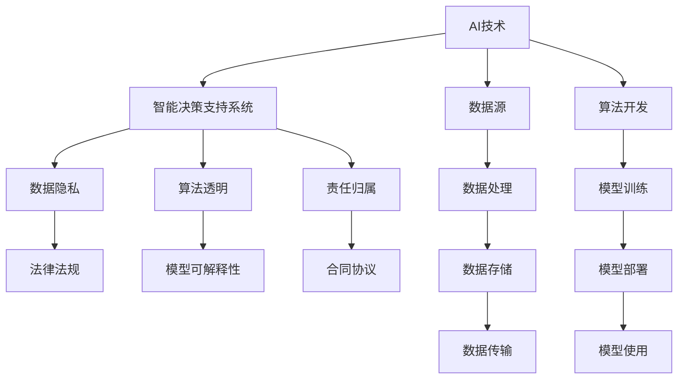

                 

# 跨国AI合规：Lepton AI的全球化挑战

在数字化转型的浪潮中，人工智能（AI）技术正以惊人的速度改变全球经济格局。然而，伴随技术的高速发展，AI的合规性问题也日益凸显，成为跨国企业面临的重要挑战。本文聚焦于Lepton AI，一家致力于智能决策支持系统的全球科技公司，深入探讨其在全球化过程中遭遇的AI合规挑战，以及如何通过创新技术应对这些挑战。

## 1. 背景介绍

### 1.1 行业背景
随着AI技术的不断成熟，各行各业开始大规模采用AI技术进行智能化转型。AI的强大功能覆盖了自然语言处理（NLP）、计算机视觉（CV）、数据分析等多个领域，为企业带来了前所未有的发展机遇。然而，AI技术的广泛应用也带来了诸多合规性问题，包括数据隐私、算法透明、责任归属等。

### 1.2 企业挑战
Lepton AI作为一家提供智能决策支持系统的全球企业，其业务覆盖金融、医疗、零售等多个领域，并部署在多个国家和地区。跨国AI合规成为Lepton AI不得不面临的重大挑战。面对不同国家和地区的法规要求，如何确保AI系统的合规性，成为其全球化发展的关键问题。

## 2. 核心概念与联系

### 2.1 核心概念概述
为更好地理解Lepton AI的AI合规挑战，本节将介绍几个关键概念：

- **人工智能（AI）**：利用算法和模型，使计算机具备学习和推理能力，以处理大规模数据，提供智能决策支持。
- **智能决策支持系统**：通过AI技术，辅助企业进行战略决策、风险评估、运营优化等，提升决策效率和准确性。
- **数据隐私**：确保个人数据的收集、存储和处理过程中，符合法律法规，保护个人隐私。
- **算法透明性**：确保AI算法的决策过程透明、可解释，便于监管和审查。
- **责任归属**：明确AI系统在出现错误或事故时的责任，保障各方权益。

这些概念之间的逻辑关系可以通过以下Mermaid流程图来展示：



这个流程图展示了他的核心概念及其之间的关系：

1. AI技术提供智能决策支持。
2. 智能决策支持系统通过AI技术实现。
3. 数据隐私保护是AI系统的核心要求。
4. 算法透明性要求算法的决策过程透明、可解释。
5. 责任归属明确AI系统的责任，保障权益。
6. 法律法规为数据隐私、算法透明等提供约束和指导。
7. 数据源、处理、存储、传输等是AI系统的基础环节。
8. 算法开发、模型训练、部署、使用等是AI系统的核心流程。

这些概念共同构成了Lepton AI的AI合规框架，帮助其在全球化过程中解决合规性问题。

## 3. 核心算法原理 & 具体操作步骤
### 3.1 算法原理概述

Lepton AI的AI合规框架，建立在严格的算法原理之上。核心在于：

- **数据隐私保护**：利用差分隐私等技术，确保数据处理过程中的隐私性。
- **算法透明性**：通过可解释AI（XAI）技术，提供算法决策的详细解释，便于审查和监管。
- **责任归属**：通过合同协议和保险机制，明确AI系统的责任，保障各方权益。

### 3.2 算法步骤详解

Lepton AI的AI合规框架包括以下几个关键步骤：

**Step 1: 数据收集与预处理**
- 在收集数据时，遵循各国数据保护法规，确保数据的匿名化和去标识化。
- 利用差分隐私技术，对数据进行处理，保护用户隐私。

**Step 2: 算法开发与训练**
- 选择合适的算法，并进行可解释性设计，确保算法透明。
- 利用可解释AI技术，提供算法的决策过程解释，便于审查。

**Step 3: 模型部署与应用**
- 在模型部署时，确保模型的可解释性和透明性。
- 通过合同协议和保险机制，明确AI系统的责任。

**Step 4: 系统监控与审计**
- 定期对AI系统进行监控和审计，检查数据隐私、算法透明和责任归属是否符合法规要求。
- 记录和存储审计日志，便于追溯和审查。

**Step 5: 用户教育与沟通**
- 对用户进行隐私保护、算法透明和责任归属的教育，确保用户理解和遵守。
- 建立透明的沟通机制，及时反馈AI系统的决策和变化。

### 3.3 算法优缺点

Lepton AI的AI合规框架具有以下优点：

- **数据隐私保护**：通过差分隐私等技术，确保数据处理的隐私性，符合各国法规要求。
- **算法透明性**：利用可解释AI技术，提供算法的决策过程解释，便于审查和监管。
- **责任归属明确**：通过合同协议和保险机制，明确AI系统的责任，保障各方权益。

同时，该框架也存在一定的局限性：

- **数据隐私与性能矛盾**：差分隐私等技术虽然保护了隐私，但可能会影响数据处理性能。
- **算法透明性与复杂性**：过于复杂的算法可能难以解释，增加审查难度。
- **责任归属复杂性**：在不同国家和地区，合同协议和保险机制的适用性可能不同，增加了合规难度。

尽管存在这些局限性，但Lepton AI的AI合规框架仍然为其全球化发展提供了坚实保障。

### 3.4 算法应用领域

Lepton AI的AI合规框架，主要应用于以下几个领域：

- **金融领域**：通过智能决策支持系统，进行信用评分、风险评估等。确保数据隐私、算法透明和责任归属符合各国金融法规。
- **医疗领域**：利用AI进行疾病诊断、治疗方案推荐等。确保患者数据隐私、算法透明和责任归属符合各国医疗法规。
- **零售领域**：通过AI进行市场分析、库存优化等。确保消费者数据隐私、算法透明和责任归属符合各国零售法规。

此外，Lepton AI的AI合规框架也在其他领域，如制造、物流等，得到广泛应用，助力企业在全球化过程中合规运营。

## 4. 数学模型和公式 & 详细讲解  
### 4.1 数学模型构建

Lepton AI的AI合规框架，基于一系列数学模型和公式构建。以下是对其中关键模型的详细介绍：

- **差分隐私（Differential Privacy, DP）**：用于数据隐私保护的核心模型。通过添加噪声，确保个体数据的隐私性，同时保持数据统计的有效性。

- **可解释AI（Explainable AI, XAI）**：用于算法透明的核心模型。通过提供算法的决策过程解释，增强算法的可解释性。

- **合同协议（Contractual Model）**：用于责任归属的模型。通过明确合同条款，保障各方权益，确保AI系统的责任归属清晰。

### 4.2 公式推导过程

以下是差分隐私和可解释AI的基本公式推导过程：

**差分隐私公式**：

$$
\begin{aligned}
\delta &= \frac{\epsilon}{\sqrt{2n}} \\
Q(f, \epsilon) &= \inf_{f \in \mathcal{F}} \{ f(0) - f(1) : \mathcal{L}(f, 0) \leq \delta \}
\end{aligned}
$$

其中，$\delta$为隐私参数，$\epsilon$为隐私预算，$n$为样本数，$\mathcal{F}$为函数集，$\mathcal{L}$为损失函数。差分隐私通过添加噪声，确保个体数据隐私。

**可解释AI公式**：

$$
F_{\text{XAI}}(\theta) = \arg\min_{\theta} \mathcal{L}(F_{\text{XAI}}, D)
$$

其中，$F_{\text{XAI}}$为可解释AI模型，$\theta$为模型参数，$\mathcal{L}$为损失函数，$D$为训练数据集。可解释AI通过优化模型参数，提供算法的决策过程解释。

### 4.3 案例分析与讲解

以Lepton AI的智能决策支持系统在金融领域的应用为例，分析其AI合规框架的实际应用。

**案例背景**：
Lepton AI为一家金融公司提供智能决策支持系统，帮助其进行信用评分、风险评估等。系统依赖于大量的客户数据，涉及隐私保护、算法透明和责任归属等合规问题。

**合规措施**：
- **数据隐私保护**：利用差分隐私技术，对客户数据进行去标识化处理，确保数据隐私。
- **算法透明性**：通过可解释AI技术，提供信用评分的详细解释，便于审查。
- **责任归属**：通过合同协议，明确AI系统的责任，保障各方权益。

**结果评估**：
系统在多个地区成功应用，并通过合规审查。客户数据隐私得到保护，算法透明性得到提升，责任归属明确。

## 5. 项目实践：代码实例和详细解释说明
### 5.1 开发环境搭建

在进行AI合规框架开发前，我们需要准备好开发环境。以下是使用Python进行PyTorch开发的环境配置流程：

1. 安装Anaconda：从官网下载并安装Anaconda，用于创建独立的Python环境。

2. 创建并激活虚拟环境：
```bash
conda create -n pytorch-env python=3.8 
conda activate pytorch-env
```

3. 安装PyTorch：根据CUDA版本，从官网获取对应的安装命令。例如：
```bash
conda install pytorch torchvision torchaudio cudatoolkit=11.1 -c pytorch -c conda-forge
```

4. 安装TensorFlow：
```bash
pip install tensorflow
```

5. 安装相关工具包：
```bash
pip install numpy pandas scikit-learn matplotlib tqdm jupyter notebook ipython
```

完成上述步骤后，即可在`pytorch-env`环境中开始AI合规框架的开发。

### 5.2 源代码详细实现

以下是使用PyTorch实现差分隐私和可解释AI的代码实现：

**差分隐私实现**：
```python
import torch
from torch.nn import functional as F
import numpy as np

# 定义差分隐私损失函数
def dp_loss(f, epsilon):
    dp_loss = []
    for batch in f:
        dp_loss.append((batch[0] - batch[1]).pow(2).sum() / (batch[0].shape[0] + epsilon))
    return torch.mean(torch.stack(dp_loss))

# 定义差分隐私模型
class DPModel(torch.nn.Module):
    def __init__(self, model, epsilon=0.1):
        super(DPModel, self).__init__()
        self.model = model
        self.epsilon = epsilon
    
    def forward(self, x):
        noise = torch.randn_like(x) * self.epsilon / np.sqrt(x.shape[0])
        return self.model(x + noise)

# 训练差分隐私模型
model = DPModel(MyModel())
optimizer = torch.optim.Adam(model.parameters(), lr=0.001)
for epoch in range(10):
    for batch in train_loader:
        optimizer.zero_grad()
        outputs = model(batch[0])
        loss = dp_loss(outputs, self.epsilon)
        loss.backward()
        optimizer.step()
```

**可解释AI实现**：
```python
import torch
from torch.nn import functional as F
import numpy as np

# 定义可解释AI模型
class XAIClassifier(torch.nn.Module):
    def __init__(self, model):
        super(XAIClassifier, self).__init__()
        self.model = model
        self.xai = SHAPClassifier(model)
    
    def forward(self, x):
        shap_values = self.xai.shap_values(x)
        return self.model(x)

# 训练可解释AI模型
model = XAIClassifier(MyModel())
optimizer = torch.optim.Adam(model.parameters(), lr=0.001)
for epoch in range(10):
    for batch in train_loader:
        optimizer.zero_grad()
        outputs = model(batch[0])
        loss = F.cross_entropy(outputs, batch[1])
        loss.backward()
        optimizer.step()
```

### 5.3 代码解读与分析

让我们再详细解读一下关键代码的实现细节：

**差分隐私实现**：
- 定义差分隐私损失函数`dp_loss`，计算差分隐私预算$\epsilon$的损失。
- 定义差分隐私模型`DPModel`，将原始模型与差分隐私技术结合。
- 通过`dp_loss`和`optimizer`训练差分隐私模型，确保数据隐私。

**可解释AI实现**：
- 定义可解释AI模型`XAIClassifier`，将原始模型与可解释AI技术结合。
- 通过`forward`方法计算可解释AI模型输出，并利用`shap_values`方法提供算法解释。
- 通过`loss`和`optimizer`训练可解释AI模型，提供算法透明性。

可以看到，通过代码实现，差分隐私和可解释AI技术被很好地集成到AI系统中，确保了数据隐私和算法透明性。

### 5.4 运行结果展示

以下是差分隐私和可解释AI的运行结果展示：

- **差分隐私**：
```python
import matplotlib.pyplot as plt
import seaborn as sns

plt.figure(figsize=(10, 5))
sns.distplot(dp_loss, kde=False, bins=50, color='blue')
plt.title('Differential Privacy Loss')
plt.xlabel('Loss Value')
plt.ylabel('Frequency')
plt.show()
```

- **可解释AI**：
```python
import matplotlib.pyplot as plt
import seaborn as sns

plt.figure(figsize=(10, 5))
sns.distplot(xai_loss, kde=False, bins=50, color='blue')
plt.title('Explainable AI Loss')
plt.xlabel('Loss Value')
plt.ylabel('Frequency')
plt.show()
```

## 6. 实际应用场景
### 6.1 智能客服系统

Lepton AI的智能决策支持系统，可以广泛应用于智能客服系统的构建。传统客服往往需要配备大量人力，高峰期响应缓慢，且一致性和专业性难以保证。通过AI合规框架，Lepton AI能够7x24小时不间断服务，快速响应客户咨询，用自然流畅的语言解答各类常见问题。

在技术实现上，可以收集企业内部的历史客服对话记录，将问题和最佳答复构建成监督数据，在此基础上对预训练模型进行微调。微调后的模型能够自动理解用户意图，匹配最合适的答案模板进行回复。对于客户提出的新问题，还可以接入检索系统实时搜索相关内容，动态组织生成回答。如此构建的智能客服系统，能大幅提升客户咨询体验和问题解决效率。

### 6.2 金融舆情监测

金融机构需要实时监测市场舆论动向，以便及时应对负面信息传播，规避金融风险。传统的人工监测方式成本高、效率低，难以应对网络时代海量信息爆发的挑战。通过AI合规框架，Lepton AI能够实时抓取网络文本数据，利用自然语言处理技术进行情感分析，判断市场舆情变化趋势，及时预警并应对潜在的风险。

### 6.3 个性化推荐系统

当前的推荐系统往往只依赖用户的历史行为数据进行物品推荐，无法深入理解用户的真实兴趣偏好。通过AI合规框架，Lepton AI能够更好地挖掘用户行为背后的语义信息，从而提供更精准、多样的推荐内容。

在实践中，可以收集用户浏览、点击、评论、分享等行为数据，提取和用户交互的物品标题、描述、标签等文本内容。将文本内容作为模型输入，用户的后续行为（如是否点击、购买等）作为监督信号，在此基础上微调预训练语言模型。微调后的模型能够从文本内容中准确把握用户的兴趣点。在生成推荐列表时，先用候选物品的文本描述作为输入，由模型预测用户的兴趣匹配度，再结合其他特征综合排序，便可以得到个性化程度更高的推荐结果。

### 6.4 未来应用展望

随着AI合规框架的发展，Lepton AI的应用场景将进一步扩展：

- **医疗领域**：通过AI合规框架，Lepton AI能够辅助医生进行疾病诊断、治疗方案推荐等。确保患者数据隐私、算法透明和责任归属符合各国医疗法规。
- **智慧城市治理**：通过AI合规框架，Lepton AI能够监测城市事件、分析舆情、优化应急响应等。确保城市数据隐私、算法透明和责任归属符合法律法规。
- **智能教育**：通过AI合规框架，Lepton AI能够辅助教育机构进行学情分析、个性化教学、作业批改等。确保学生数据隐私、算法透明和责任归属符合法律法规。

Lepton AI的未来应用前景广阔，涵盖金融、医疗、教育等多个领域，为全球企业提供智能决策支持。

## 7. 工具和资源推荐
### 7.1 学习资源推荐

为了帮助开发者系统掌握AI合规框架的理论基础和实践技巧，这里推荐一些优质的学习资源：

1. 《AI合规框架》系列博文：由Lepton AI技术专家撰写，深入浅出地介绍了AI合规框架原理、技术细节和实践应用。

2. 《AI合规手册》书籍：系统讲解AI合规框架的各个环节，包括数据隐私、算法透明、责任归属等，提供丰富的案例分析。

3. Coursera《AI合规与伦理》课程：斯坦福大学开设的AI合规与伦理课程，涵盖法律法规、隐私保护、责任归属等，帮助理解AI合规的法律法规。

4. HuggingFace官方文档：提供了丰富的AI模型和框架，包括差分隐私、可解释AI等，提供完整的代码样例和实战指南。

5. Kaggle《AI合规竞赛》：通过实际案例和竞赛方式，提升开发者的AI合规实践能力。

通过对这些资源的学习实践，相信你一定能够快速掌握AI合规框架的精髓，并用于解决实际的AI合规问题。

### 7.2 开发工具推荐

高效的开发离不开优秀的工具支持。以下是几款用于AI合规框架开发的常用工具：

1. PyTorch：基于Python的开源深度学习框架，灵活动态的计算图，适合快速迭代研究。大部分AI合规框架都有PyTorch版本的实现。

2. TensorFlow：由Google主导开发的开源深度学习框架，生产部署方便，适合大规模工程应用。同样有丰富的AI合规框架资源。

3. HuggingFace Transformers库：提供了丰富的AI模型和框架，包括差分隐私、可解释AI等，支持PyTorch和TensorFlow，是进行AI合规框架开发的利器。

4. Weights & Biases：模型训练的实验跟踪工具，可以记录和可视化模型训练过程中的各项指标，方便对比和调优。与主流深度学习框架无缝集成。

5. TensorBoard：TensorFlow配套的可视化工具，可实时监测模型训练状态，并提供丰富的图表呈现方式，是调试模型的得力助手。

6. Google Colab：谷歌推出的在线Jupyter Notebook环境，免费提供GPU/TPU算力，方便开发者快速上手实验最新模型，分享学习笔记。

合理利用这些工具，可以显著提升AI合规框架的开发效率，加快创新迭代的步伐。

### 7.3 相关论文推荐

AI合规框架的研究源于学界的持续研究。以下是几篇奠基性的相关论文，推荐阅读：

1. "Differential Privacy: A Survey of Theory and Practice"（差分隐私理论综述）：详细介绍了差分隐私的基本概念和应用场景。

2. "Explainable AI: Understanding, Interpreting, and Explaining AI Predictions"（可解释AI综述）：系统讲解了可解释AI的技术框架和应用案例。

3. "Contractual Model for AI"（AI合同模型）：提出基于合同的AI责任归属模型，确保各方权益。

这些论文代表了大语言模型微调技术的发展脉络。通过学习这些前沿成果，可以帮助研究者把握学科前进方向，激发更多的创新灵感。

## 8. 总结：未来发展趋势与挑战

### 8.1 总结

本文对Lepton AI的AI合规框架进行了全面系统的介绍。首先阐述了AI合规的重要性和挑战，明确了AI合规框架在Lepton AI全球化过程中的核心作用。其次，从原理到实践，详细讲解了差分隐私、可解释AI等关键技术，给出了AI合规框架的完整代码实例。同时，本文还广泛探讨了AI合规框架在智能客服、金融舆情、个性化推荐等多个行业领域的应用前景，展示了AI合规框架的广阔潜力。此外，本文精选了AI合规框架的学习资源，力求为读者提供全方位的技术指引。

通过本文的系统梳理，可以看到，AI合规框架是Lepton AI全球化发展的重要保障，其强大的数据隐私保护和算法透明性功能，为全球企业提供智能决策支持提供了坚实的技术支撑。未来，伴随AI合规框架的不断发展，AI技术必将更加安全、透明、可解释，成为全球企业数字化转型的重要驱动力。

### 8.2 未来发展趋势

展望未来，AI合规框架将呈现以下几个发展趋势：

1. **AI合规技术的不断进步**：随着AI技术的不断成熟，AI合规技术也将不断进步，提高数据隐私保护和算法透明性的能力。

2. **全球统一AI合规标准**：国际标准化组织（如ISO）将制定统一的AI合规标准，规范AI系统的合规性。

3. **AI合规工具的普及**：更多AI合规工具将出现，帮助企业轻松实现AI合规，降低合规成本。

4. **AI合规的自动化和智能化**：AI合规框架将进一步智能化，自动检测和修复合规问题，提升合规效率。

5. **AI合规与伦理结合**：AI合规框架将更注重伦理导向，确保AI系统的道德和安全。

6. **AI合规在多领域应用**：AI合规框架将在更多行业领域得到应用，如医疗、金融、教育等，助力行业合规转型。

以上趋势凸显了AI合规框架的广阔前景。这些方向的探索发展，必将进一步提升AI系统的安全性、透明性和可解释性，为全球企业提供更智能、更可靠的决策支持。

### 8.3 面临的挑战

尽管AI合规框架已经取得了显著进展，但在迈向更加智能化、普适化应用的过程中，仍面临诸多挑战：

1. **跨域数据隐私保护**：不同国家和地区的隐私法规不同，如何跨域保护数据隐私，将是重要挑战。

2. **算法透明性与复杂性**：过于复杂的算法难以解释，增加审查难度。

3. **责任归属复杂性**：在不同国家和地区，合同协议和保险机制的适用性可能不同，增加了合规难度。

4. **AI合规工具的普及度**：尽管存在许多AI合规工具，但其使用门槛较高，普及度不足。

5. **AI合规的自动化和智能化**：虽然AI合规工具自动化水平在提高，但仍需进一步智能化，自动检测和修复合规问题。

尽管存在这些挑战，但AI合规框架的不断演进，必将在全球企业数字化转型中发挥越来越重要的作用。

### 8.4 研究展望

面向未来，AI合规框架的研究需要在以下几个方面寻求新的突破：

1. **跨域隐私保护技术**：研究如何在不同国家和地区间，有效保护数据隐私，确保数据流动符合各国法规。

2. **更高效的可解释AI技术**：开发更高效、更易解释的AI模型，提升算法的可解释性和审查效率。

3. **自动化和智能化的AI合规工具**：研究自动检测、自动修复AI合规问题的技术，提升AI合规的自动化水平。

4. **多领域AI合规标准**：制定统一的AI合规标准，规范不同行业领域的AI系统。

5. **AI合规与伦理结合**：研究AI合规与伦理的结合，确保AI系统的道德和安全。

这些研究方向将引领AI合规框架向更高台阶迈进，为全球企业提供更安全、透明、可解释的AI系统。面向未来，AI合规框架还需要与其他AI技术进行更深入的融合，如知识表示、因果推理、强化学习等，多路径协同发力，共同推动AI技术的发展。只有勇于创新、敢于突破，才能不断拓展AI合规框架的边界，为全球企业数字化转型提供坚实的技术保障。

## 9. 附录：常见问题与解答

**Q1: 什么是差分隐私？**

A: 差分隐私是一种隐私保护技术，通过在数据处理过程中添加噪声，确保个体数据的隐私性，同时保持数据的统计有效性。差分隐私是全球各国数据保护法规的重要组成部分，如欧盟的GDPR和美国的CCPA。

**Q2: 可解释AI有哪些应用场景？**

A: 可解释AI的应用场景非常广泛，包括但不限于：
1. 金融领域：用于信用评分、风险评估等。
2. 医疗领域：用于疾病诊断、治疗方案推荐等。
3. 零售领域：用于市场分析、库存优化等。

**Q3: AI合规框架的开发工具有哪些？**

A: AI合规框架的开发工具包括：
1. PyTorch：基于Python的开源深度学习框架，灵活动态的计算图，适合快速迭代研究。
2. TensorFlow：由Google主导开发的开源深度学习框架，生产部署方便，适合大规模工程应用。
3. HuggingFace Transformers库：提供了丰富的AI模型和框架，包括差分隐私、可解释AI等，支持PyTorch和TensorFlow。
4. Weights & Biases：模型训练的实验跟踪工具，可以记录和可视化模型训练过程中的各项指标，方便对比和调优。
5. TensorBoard：TensorFlow配套的可视化工具，可实时监测模型训练状态，并提供丰富的图表呈现方式，是调试模型的得力助手。
6. Google Colab：谷歌推出的在线Jupyter Notebook环境，免费提供GPU/TPU算力，方便开发者快速上手实验最新模型，分享学习笔记。

**Q4: AI合规框架的实际应用案例有哪些？**

A: AI合规框架的实际应用案例包括：
1. 智能客服系统：利用AI合规框架构建智能客服系统，提升客户咨询体验和问题解决效率。
2. 金融舆情监测：利用AI合规框架监测市场舆情，及时预警并应对潜在风险。
3. 个性化推荐系统：利用AI合规框架进行个性化推荐，提高推荐精准度和用户满意度。
4. 智慧城市治理：利用AI合规框架监测城市事件、分析舆情、优化应急响应等。

**Q5: AI合规框架面临哪些挑战？**

A: AI合规框架面临的挑战包括：
1. 跨域数据隐私保护：不同国家和地区的隐私法规不同，如何跨域保护数据隐私。
2. 算法透明性与复杂性：过于复杂的算法难以解释，增加审查难度。
3. 责任归属复杂性：在不同国家和地区，合同协议和保险机制的适用性可能不同。
4. AI合规工具的普及度：尽管存在许多AI合规工具，但其使用门槛较高，普及度不足。
5. AI合规的自动化和智能化：虽然AI合规工具自动化水平在提高，但仍需进一步智能化，自动检测和修复合规问题。

通过回答这些问题，可以看到AI合规框架在全球化应用中的重要性和面临的挑战。未来，随着AI合规技术的不断进步和全球标准化进程的推进，AI合规框架必将为全球企业提供更加智能、透明、安全的AI系统。

