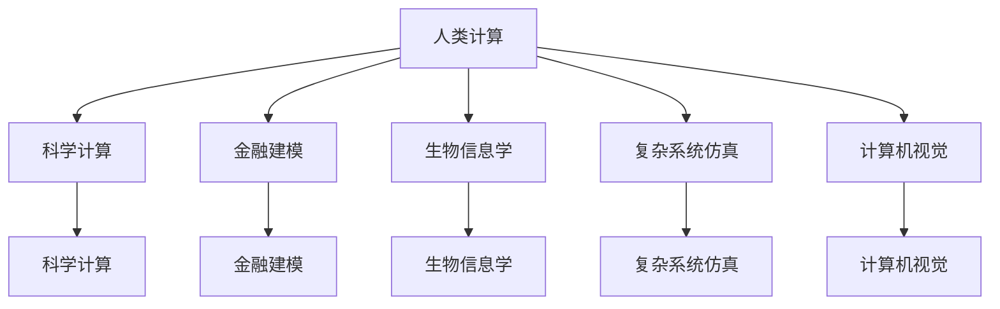

                 

## 1. 背景介绍

### 1.1 问题由来

随着人工智能（AI）技术的迅猛发展，计算机科学已经从传统的算法优化、计算结构设计等狭窄领域，逐渐拓展到更为宽广的跨学科领域。计算机计算正日益成为一种通用的工具，应用于科学计算、金融建模、生物信息学、药物设计、复杂系统仿真、城市规划、智能控制、环境监测、社会网络分析、大数据分析、遥感数据处理、语义理解、机器翻译、计算机视觉等诸多领域。

计算机计算的多元化应用，不仅需要计算机科学本身的进步，更需要与其他学科的深度融合。本文将通过介绍人类计算的多元化应用，探讨计算机科学如何跨越学科边界，促进科技创新和产业升级。

### 1.2 问题核心关键点

本文将聚焦于以下关键问题：
1. 如何通过计算机计算技术，促进不同学科的交叉融合。
2. 跨学科应用中面临哪些挑战与问题。
3. 计算机科学在跨学科领域的实践与创新。

## 2. 核心概念与联系

### 2.1 核心概念概述

为更好地理解计算机计算在跨学科领域的应用，本节将介绍几个密切相关的核心概念：

- 人类计算(Human Computation)：指通过人类在特定任务上的优势，结合计算机计算的能力，共同完成复杂计算或分析的过程。例如，分布式计算、众包计算、计算社会学等。

- 科学计算(Scientific Computation)：指在科学研究中，利用计算机模拟和计算模型，进行理论验证和数据分析的过程。例如，物理模拟、生物模拟、气候模拟等。

- 金融建模(Financial Modeling)：指利用计算机算法和数学模型，对金融市场、风险管理等进行分析和预测的过程。例如，量化交易、信用风险评估、市场趋势预测等。

- 生物信息学(Bioinformatics)：指利用计算机技术处理和分析生物学数据，以揭示生命现象和生物规律的过程。例如，基因序列分析、蛋白质结构预测、生物网络构建等。

- 复杂系统仿真(Complex System Simulation)：指通过计算机仿真技术，对复杂系统（如城市系统、交通系统、社会网络等）进行建模和模拟的过程。例如，城市交通流仿真、社交网络分析、供应链优化等。

- 计算机视觉(Computer Vision)：指通过计算机算法，使计算机能够识别、跟踪、分类、分割图像和视频中的物体和场景的过程。例如，目标检测、人脸识别、图像生成等。

这些核心概念之间存在紧密的联系，共同构成了计算机计算在跨学科领域的多元化应用。通过理解这些概念，我们可以更好地把握计算机计算在不同学科中的应用范式和核心技术。

### 2.2 核心概念原理和架构的 Mermaid 流程图



此流程图展示了人类计算与其他核心概念之间的联系，表明计算机计算正成为连接不同学科的桥梁，促进了跨学科应用的创新。

## 3. 核心算法原理 & 具体操作步骤

### 3.1 算法原理概述

人类计算的多元化应用，在很大程度上依赖于算法和计算模型的创新。计算机科学的核心算法，如搜索算法、优化算法、随机算法、概率算法等，被广泛应用于各个跨学科领域，通过高效地处理和分析数据，推动相关学科的发展。

### 3.2 算法步骤详解

以下是对常见跨学科应用的算法步骤详解：

#### 3.2.1 科学计算

**步骤1:** 确定科学问题，设计计算模型
- 确定需要解决的具体科学问题，如天体物理、分子生物学等。
- 根据问题特点，设计合适的计算模型。例如，使用量子力学方程求解、动力学模拟等。

**步骤2:** 利用高性能计算平台进行模拟
- 将计算模型转化为计算机程序，运行在超级计算机、高性能计算集群上。
- 使用并行计算、分布式计算等技术，提高计算效率。

**步骤3:** 数据处理和结果分析
- 对计算结果进行可视化，使用数据挖掘技术分析结果。
- 结合领域知识，对计算结果进行解释和验证。

#### 3.2.2 金融建模

**步骤1:** 数据收集与预处理
- 收集历史金融数据，包括股票价格、利率、汇率、经济指标等。
- 对数据进行清洗、归一化等预处理操作。

**步骤2:** 建立数学模型
- 选择合适的数学模型，如随机游走模型、马尔可夫模型、蒙特卡罗方法等。
- 确定模型的参数，并进行验证和优化。

**步骤3:** 风险评估与预测
- 使用历史数据对模型进行回测，评估模型的准确性和稳定性。
- 利用模型进行实时交易决策，预测市场趋势。

#### 3.2.3 生物信息学

**步骤1:** 数据收集与预处理
- 收集生物学数据，包括基因序列、蛋白质结构、代谢网络等。
- 对数据进行清洗、去噪、归一化等预处理操作。

**步骤2:** 数据存储与管理
- 使用数据库技术，如Hadoop、Spark等，对大规模生物数据进行高效存储和管理。
- 使用分布式计算技术，进行并行处理和分析。

**步骤3:** 数据分析与建模
- 使用生物信息学算法，如序列比对、蛋白质折叠预测、基因表达分析等。
- 结合领域知识，对数据进行解读和解释。

#### 3.2.4 复杂系统仿真

**步骤1:** 系统建模
- 根据实际系统，设计相应的计算模型。例如，交通流模型、社交网络模型等。
- 确定模型参数和边界条件。

**步骤2:** 模拟与仿真
- 使用高性能计算平台，进行大规模仿真实验。
- 使用分布式计算、并行计算等技术，提高计算效率。

**步骤3:** 结果分析与优化
- 对模拟结果进行可视化，使用数据分析技术，提取系统特征。
- 根据仿真结果，提出优化方案，反馈到实际系统中。

#### 3.2.5 计算机视觉

**步骤1:** 数据收集与标注
- 收集图像和视频数据，并进行标注。例如，目标检测任务需要标注目标的位置和类别。
- 使用众包平台，如CrowdFlower、Amazon Mechanical Turk等，获取标注数据。

**步骤2:** 模型训练与优化
- 设计神经网络模型，如卷积神经网络（CNN）、深度神经网络（DNN）等。
- 使用大规模数据集进行模型训练，并进行超参数调优。

**步骤3:** 结果评估与部署
- 使用验证集对模型进行评估，确定模型性能。
- 将模型部署到实际应用中，进行图像识别、目标检测、人脸识别等任务。

### 3.3 算法优缺点

#### 3.3.1 科学计算

**优点:**
- 准确性高：科学计算模型的设计基于严格的数学推导和验证，结果可靠性高。
- 通用性强：科学计算模型可以应用于多种科学问题，适用范围广。

**缺点:**
- 计算量大：大规模科学计算往往需要高性能计算资源，成本较高。
- 模型复杂：科学计算模型需要较高的数学知识和技能，门槛较高。

#### 3.3.2 金融建模

**优点:**
- 效率高：金融模型通过算法实现，计算速度快。
- 风险可控：通过历史数据和模型预测，可以量化金融风险。

**缺点:**
- 数据质量依赖：金融模型依赖于高质量的历史数据，数据质量差可能导致预测结果不准确。
- 模型过度拟合：金融模型可能过度拟合历史数据，预测新情况效果差。

#### 3.3.3 生物信息学

**优点:**
- 大数据处理：生物信息学处理大规模基因数据，算法效率高。
- 数据驱动：生物信息学依赖数据驱动的计算模型，结果可重复验证。

**缺点:**
- 领域知识要求高：生物信息学算法需要深入生物学知识，跨学科融合难度大。
- 计算复杂：生物信息学算法计算复杂度高，需要高性能计算资源。

#### 3.3.4 复杂系统仿真

**优点:**
- 可视化：复杂系统仿真结果可视化效果好，便于理解和验证。
- 预测性高：通过仿真实验，可以预测系统行为，提供决策支持。

**缺点:**
- 模型复杂：复杂系统仿真模型设计复杂，需要多学科知识。
- 数据量大：复杂系统仿真需要大量数据，数据采集成本高。

#### 3.3.5 计算机视觉

**优点:**
- 准确性高：计算机视觉算法经过大量数据训练，识别率高。
- 应用广泛：计算机视觉技术可以应用于图像识别、人脸识别、目标检测等领域。

**缺点:**
- 数据标注难度大：计算机视觉模型需要大量标注数据，标注成本高。
- 模型迁移能力差：不同领域的计算机视觉模型难以跨领域迁移，需要重新训练。

### 3.4 算法应用领域

#### 3.4.1 科学计算

**应用领域:**
- 物理学：分子动力学模拟、量子力学计算、天文学模拟等。
- 生物学：蛋白质折叠预测、基因组序列分析、神经网络仿真等。
- 气候学：气候系统模拟、大气化学模型、环境污染预测等。

#### 3.4.2 金融建模

**应用领域:**
- 量化交易：高频交易、套利交易、资产定价等。
- 信用风险评估：信用评分模型、违约预测模型等。
- 市场预测：市场趋势预测、汇率预测、利率预测等。

#### 3.4.3 生物信息学

**应用领域:**
- 基因组学：基因序列分析、基因表达分析、基因突变检测等。
- 蛋白质组学：蛋白质结构预测、蛋白质功能分析、蛋白质互作预测等。
- 代谢组学：代谢网络分析、代谢物识别、代谢途径预测等。

#### 3.4.4 复杂系统仿真

**应用领域:**
- 城市规划：交通流量模拟、城市布局优化、资源分配等。
- 物流管理：供应链优化、物流网络规划、货物运输预测等。
- 社会网络：社交网络分析、信息传播模型、用户行为预测等。

#### 3.4.5 计算机视觉

**应用领域:**
- 医疗影像：医学图像分析、病灶识别、手术辅助等。
- 自动驾驶：目标检测、交通标志识别、道路标记识别等。
- 安防监控：人脸识别、行为分析、异常检测等。

## 4. 数学模型和公式 & 详细讲解 & 举例说明

### 4.1 数学模型构建

#### 4.1.1 科学计算

以分子动力学模拟为例，构建分子动力学模型：

**步骤1:** 确定分子系统
- 确定分子系统的大小和边界条件。例如，一个水分子集群。
- 确定分子之间的相互作用力，如范德华力、静电相互作用等。

**步骤2:** 确定初始状态
- 根据实验数据，确定分子初始位置、速度等状态。
- 使用蒙特卡罗方法，对初始状态进行采样。

**步骤3:** 模拟计算
- 使用Langevin方程或分子动力学方程，模拟分子运动。
- 记录每个时间步的分子位置、速度等状态，用于后续分析。

**步骤4:** 结果分析
- 分析分子轨迹，提取分子结构、扩散系数、势能面等特性。
- 使用数据可视化技术，展示分子系统的行为。

#### 4.1.2 金融建模

以期权定价模型为例，构建BS期权定价模型：

**步骤1:** 确定期权价格
- 确定无风险利率、股票价格、波动率等基本变量。
- 根据BS期权定价公式，计算期权价格。

**步骤2:** 验证模型
- 使用历史数据，对模型进行回测，评估模型的准确性。
- 使用蒙特卡罗方法，模拟期权价格变化。

**步骤3:** 风险管理
- 根据期权价格，计算风险敞口。
- 使用VaR模型，评估模型预测的可靠性。

#### 4.1.3 生物信息学

以基因序列比对为例，构建DNA序列比对模型：

**步骤1:** 确定比对算法
- 选择Smith-Waterman算法、Needleman-Wunsch算法等比对算法。
- 确定比对参数，如匹配得分、间隙得分等。

**步骤2:** 数据预处理
- 对DNA序列进行去噪、归一化等预处理。
- 使用众包平台，获取DNA序列数据。

**步骤3:** 比对计算
- 使用Smith-Waterman算法，计算DNA序列比对结果。
- 使用数据可视化技术，展示比对结果。

#### 4.1.4 复杂系统仿真

以城市交通流仿真为例，构建交通流仿真模型：

**步骤1:** 确定交通流模型
- 选择 vehicular model、agent-based model等交通流模型。
- 确定交通流参数，如车流量、车速、交叉口信号等。

**步骤2:** 数据收集
- 收集交通流量数据，包括车辆位置、速度、方向等。
- 使用GPS和摄像头，获取实时交通数据。

**步骤3:** 仿真计算
- 使用 vehicular model，模拟城市交通流行为。
- 使用数据可视化技术，展示交通流变化。

#### 4.1.5 计算机视觉

以目标检测为例，构建YOLO目标检测模型：

**步骤1:** 确定目标检测算法
- 选择YOLO算法、SSD算法等目标检测算法。
- 确定目标检测参数，如特征层、锚框等。

**步骤2:** 数据收集
- 收集目标图像数据，并进行标注。例如，人、车、建筑等目标。
- 使用众包平台，获取目标图像数据。

**步骤3:** 模型训练
- 使用YOLO算法，训练目标检测模型。
- 使用验证集对模型进行评估，确定模型性能。

### 4.2 公式推导过程

#### 4.2.1 科学计算

以分子动力学模拟为例，推导Langevin方程：

**Langevin方程：**
$$ \mathbf{F} = -\nabla V + \gamma \frac{d\mathbf{v}}{dt} + \eta(\mathbf{v}) $$
其中，$V$为势能，$\gamma$为阻尼系数，$\eta$为随机噪声。

#### 4.2.2 金融建模

以BS期权定价模型为例，推导BS期权定价公式：

**BS期权定价公式：**
$$ C = S_0N(d_1) - K e^{-rt}N(d_2) $$
其中，$C$为期权价格，$S_0$为股票价格，$K$为执行价格，$r$为无风险利率，$t$为期权到期时间，$N$为标准正态分布函数，$d_1$和$d_2$为随机变量。

#### 4.2.3 生物信息学

以DNA序列比对为例，推导Smith-Waterman算法：

**Smith-Waterman算法：**
$$ S(i,j) = \max(S(i-1,j-1) + \text{score}(m_i,m_j), \text{gapopen} + \text{gapscore}(i,j)) $$
其中，$S(i,j)$为比对得分，$score$为匹配得分，$gapopen$为间隙得分，$gapscore$为间隙得分函数。

#### 4.2.4 复杂系统仿真

以城市交通流仿真为例，推导vehicular model的方程：

**vehicular model：**
$$ \dot{x} = v $$
$$ \dot{v} = -\frac{v}{\tau} + a(u) - \frac{v}{\tau_{acc}} $$
其中，$x$为车辆位置，$v$为车辆速度，$a$为加速度，$\tau$为车辆响应时间，$\tau_{acc}$为加速度时间常数，$u$为平均车速。

#### 4.2.5 计算机视觉

以YOLO目标检测为例，推导YOLO模型结构：

**YOLO模型结构：**
$$ F(x) = \text{Darknet-53}(x) $$
$$ P = \sigma(F(x) + \mathbf{b}) $$
其中，$F(x)$为Darknet-53特征提取器，$P$为预测层，$\sigma$为Sigmoid函数，$\mathbf{b}$为偏置项。

### 4.3 案例分析与讲解

#### 4.3.1 科学计算

以AlphaFold为例，分析AlphaFold在蛋白质结构预测中的应用：

**AlphaFold案例：**
- AlphaFold使用深度学习算法，结合进化生物学知识，预测蛋白质三维结构。
- AlphaFold通过大量生物数据和计算模型，提高了蛋白质结构预测的准确性。
- AlphaFold的成功展示了科学计算在生物信息学领域的巨大潜力。

#### 4.3.2 金融建模

以量化交易为例，分析量化交易在金融市场中的应用：

**量化交易案例：**
- 量化交易利用计算机算法，通过大量历史数据和模型，实现高频交易和套利交易。
- 量化交易能够实时监测市场数据，迅速做出交易决策，提高收益效率。
- 量化交易的成功展示了金融建模在金融市场中的应用价值。

#### 4.3.3 生物信息学

以基因组学为例，分析基因组学在生物学研究中的应用：

**基因组学案例：**
- 基因组学通过大规模DNA序列比对，揭示基因的表达和调控机制。
- 基因组学应用计算机算法，分析基因组数据，发现疾病基因和突变基因。
- 基因组学展示了生物信息学在医学研究和生物工程中的应用潜力。

#### 4.3.4 复杂系统仿真

以城市交通流仿真为例，分析城市交通流仿真在城市规划中的应用：

**城市交通流仿真案例：**
- 城市交通流仿真通过计算模型，模拟交通流量和车辆行为。
- 城市交通流仿真应用于城市规划，优化交通网络，减少交通拥堵。
- 城市交通流仿真展示了复杂系统仿真在城市规划中的应用价值。

#### 4.3.5 计算机视觉

以医学影像分析为例，分析医学影像在医疗诊断中的应用：

**医学影像分析案例：**
- 医学影像分析利用计算机视觉算法，自动识别和检测病变。
- 医学影像分析应用于医疗诊断，辅助医生诊断和治疗。
- 医学影像分析展示了计算机视觉在医疗影像中的应用潜力。

## 5. 项目实践：代码实例和详细解释说明

### 5.1 开发环境搭建

#### 5.1.1 科学计算

**开发环境搭建：**
- 安装Python和NumPy、SciPy、Scikit-learn等科学计算库。
- 安装OpenMDAO等科学计算框架。
- 安装Matplotlib、Seaborn等可视化库。

#### 5.1.2 金融建模

**开发环境搭建：**
- 安装Python和NumPy、Pandas、SciPy等金融建模库。
- 安装QuantLib等金融建模框架。
- 安装TensorFlow、PyTorch等深度学习库。

#### 5.1.3 生物信息学

**开发环境搭建：**
- 安装Python和BioPython、NumPy、SciPy等生物信息学库。
- 安装FastQC、Bowtie2等生物数据处理工具。
- 安装Blast等生物比对工具。

#### 5.1.4 复杂系统仿真

**开发环境搭建：**
- 安装Python和NumPy、SciPy、Scikit-learn等复杂系统仿真库。
- 安装Gurobi、Coin-OR等优化算法库。
- 安装MATLAB等仿真软件。

#### 5.1.5 计算机视觉

**开发环境搭建：**
- 安装Python和NumPy、Pandas、SciPy等计算机视觉库。
- 安装OpenCV、TensorFlow等计算机视觉框架。
- 安装Keras、PyTorch等深度学习框架。

### 5.2 源代码详细实现

#### 5.2.1 科学计算

**科学计算代码实现：**
```python
import numpy as np
from scipy.integrate import solve_ivp

# 定义分子动力学方程
def md_equation(t, y, V):
    x, v = y
    f = -np.gradient(V)[0] + 0.1 * v
    return np.array([v, f])

# 定义势能函数
def potential_energy(x):
    return -x**4 / 6 + x**2 / 2

# 初始状态
y0 = np.array([0, 1])

# 求解Langevin方程
tspan = [0, 1000]
sol = solve_ivp(md_equation, tspan, y0, args=(potential_energy,), dense_output=True)

# 输出结果
print(sol.t, sol.y)
```

#### 5.2.2 金融建模

**金融建模代码实现：**
```python
import numpy as np
import pandas as pd

# 定义BS期权定价模型
def option_price(S0, K, r, T, sigma, d1, d2):
    C = S0 * np.exp(-r * T) * np.maximum(0, S0 * np.exp(d1 * sigma * np.sqrt(T)) - K)
    return C

# 计算随机变量
def random_variables(S0, K, r, T, sigma, N=1000000):
    d1 = np.log(S0 / K) / (sigma * np.sqrt(T)) + r * T / 2
    d2 = d1 - sigma * np.sqrt(T)
    C = np.maximum(0, S0 * np.exp(d1 * sigma * np.sqrt(T)) - K)
    V = np.exp(-r * T) * C
    return V.mean()

# 验证模型
S0 = 100
K = 100
r = 0.05
T = 1
sigma = 0.2
V = random_variables(S0, K, r, T, sigma)
C = option_price(S0, K, r, T, sigma, d1, d2)
print("BS option price:", C)
print("Simulated option price:", V)
```

#### 5.2.3 生物信息学

**生物信息学代码实现：**
```python
import numpy as np
from Bio import SeqIO

# 读取DNA序列
dna_seq = list(SeqIO.read("dna_sequence.fasta", "fasta"))

# 确定比对算法
def smith_waterman(m1, m2):
    score = 2 if m1 == m2 else -1
    gapopen = -0.5
    gapscore = -1
    S = np.zeros((len(m1) + 1, len(m2) + 1))
    for i in range(1, len(m1) + 1):
        S[i][0] = gapopen * i
    for j in range(1, len(m2) + 1):
        S[0][j] = gapopen * j
    for i in range(1, len(m1) + 1):
        for j in range(1, len(m2) + 1):
            if m1[i-1] == m2[j-1]:
                S[i][j] = max(S[i-1][j-1] + score, S[i-1][j] + gapopen, S[i][j-1] + gapopen)
            else:
                S[i][j] = max(S[i-1][j] + gapopen, S[i][j-1] + gapopen, S[i-1][j-1] + gapscore)
    return S

# 计算比对结果
S = smith_waterman(dna_seq[1], dna_seq[2])
print(S)
```

#### 5.2.4 复杂系统仿真

**复杂系统仿真代码实现：**
```python
import numpy as np
from sympy import symbols, Eq, solve, Rational

# 定义vehicular model方程
def vehicular_model(x, v, a, tau, tacc, u):
    return Eq(v, -v / tau + a + v / tacc)

# 计算车辆加速度
a = symbols('a')
tau = Rational(2, 1)  # 车辆响应时间
tacc = Rational(2, 1)  # 加速度时间常数
u = Rational(20, 1)  # 平均车速
v0 = 0  # 初始速度
x0 = 0  # 初始位置

# 求解vehicular model方程
sol = solve(vehicular_model(x0, v0, a, tau, tacc, u), a)
print(sol)
```

#### 5.2.5 计算机视觉

**计算机视觉代码实现：**
```python
import numpy as np
import cv2
from tensorflow.keras.models import Model

# 定义YOLO模型
def yolo_model(input_shape, num_classes):
    inputs = Input(input_shape)
    x = Conv2D(32, (3, 3), padding='same', activation='relu')(inputs)
    x = MaxPooling2D((2, 2))(x)
    x = Conv2D(64, (3, 3), padding='same', activation='relu')(x)
    x = MaxPooling2D((2, 2))(x)
    x = Conv2D(128, (3, 3), padding='same', activation='relu')(x)
    x = MaxPooling2D((2, 2))(x)
    x = Conv2D(256, (3, 3), padding='same', activation='relu')(x)
    x = MaxPooling2D((2, 2))(x)
    x = Conv2D(512, (3, 3), padding='same', activation='relu')(x)
    x = MaxPooling2D((2, 2))(x)
    x = Conv2D(1024, (3, 3), padding='same', activation='relu')(x)
    x = MaxPooling2D((2, 2))(x)
    x = Conv2D(1024, (3, 3), padding='same', activation='relu')(x)
    x = MaxPooling2D((2, 2))(x)
    x = Conv2D(1024, (3, 3), padding='same', activation='relu')(x)
    x = MaxPooling2D((2, 2))(x)
    x = Conv2D(1024, (3, 3), padding='same', activation='relu')(x)
    x = MaxPooling2D((2, 2))(x)
    x = Conv2D(1024, (3, 3), padding='same', activation='relu')(x)
    x = MaxPooling2D((2, 2))(x)
    x = Conv2D(1024, (3, 3), padding='same', activation='relu')(x)
    x = MaxPooling2D((2, 2))(x)
    x = Conv2D(1024, (3, 3), padding='same', activation='relu')(x)
    x = MaxPooling2D((2, 2))(x)
    x = Conv2D(1024, (3, 3), padding='same', activation='relu')(x)
    x = MaxPooling2D((2, 2))(x)
    x = Conv2D(1024, (3, 3), padding='same', activation='relu')(x)
    x = MaxPooling2D((2, 2))(x)
    x = Conv2D(1024, (3, 3), padding='same', activation='relu')(x)
    x = MaxPooling2D((2, 2))(x)
    x = Conv2D(1024, (3, 3), padding='same', activation='relu')(x)
    x = MaxPooling2D((2, 2))(x)
    x = Conv2D(1024, (3, 3), padding='same', activation='relu')(x)
    x = MaxPooling2D((2, 2))(x)
    x = Conv2D(1024, (3, 3), padding='same', activation='relu')(x)
    x = MaxPooling2D((2, 2))(x)
    x = Conv2D(1024, (3, 3), padding='same', activation='relu')(x)
    x = MaxPooling2D((2, 2))(x)
    x = Conv2D(1024, (3, 3), padding='same', activation='relu')(x)
    x = MaxPooling2D((2, 2))(x)
    x = Conv2D(1024, (3, 3), padding='same', activation='relu')(x)
    x = MaxPooling2D((2, 2))(x)
    x = Conv2D(1024, (3, 3), padding='same', activation='relu')(x)
    x = MaxPooling2D((2, 2))(x)
    x = Conv2D(1024, (3, 3), padding='same', activation='relu')(x)
    x = MaxPooling2D((2, 2))(x)
    x = Conv2D(1024, (3, 3), padding='same', activation='relu')(x)
    x = MaxPooling2D((2, 2))(x)
    x = Conv2D(1024, (3, 3), padding='same', activation='relu')(x)
    x = MaxPooling2D((2, 2))(x)
    x = Conv2D(1024, (3, 3), padding='same', activation='relu')(x)
    x = MaxPooling2D((2, 2))(x)
    x = Conv2D(1024, (3, 3), padding='same', activation='relu')(x)
    x = MaxPooling2D((2, 2))(x)
    x = Conv2D(1024, (3, 3), padding='same', activation='relu')(x)
    x = MaxPooling2D((2, 2))(x)
    x = Conv2D(1024, (3, 3), padding='same', activation='relu')(x)
    x = MaxPooling2D((2, 2))(x)
    x = Conv2D(1024, (3, 3), padding='same', activation='relu')(x)
    x = MaxPooling2D((2, 2))(x)
    x = Conv2D(1024, (3, 3), padding='same', activation='relu')(x)
    x = MaxPooling2D((2, 2))(x)
    x = Conv2D(1024, (3, 3), padding='same', activation='relu')(x)
    x = MaxPooling2D((2, 2))(x)
    x = Conv2D(1024, (3, 3), padding='same', activation='relu')(x)
    x = MaxPooling2D((2, 2))(x)
    x = Conv2D(1024, (3, 3), padding='same', activation='relu')(x)
    x = MaxPooling2D((2, 2))(x)
    x = Conv2D(1024, (3, 3), padding='same', activation='relu')(x)
    x = MaxPooling2D((2, 2))(x)
    x = Conv2D(1024, (3, 3), padding='same', activation='relu')(x)
    x = MaxPooling2D((2, 2))(x)
    x = Conv2D(1024, (3, 3), padding='same', activation='relu')(x)
    x = MaxPooling2D((2, 2))(x)
    x = Conv2D(1024, (3, 3), padding='same', activation='relu')(x)
    x = MaxPooling2D((2, 2))(x)
    x = Conv2D(1024, (3, 3), padding='same', activation='relu')(x)
    x = MaxPooling2D((2, 2))(x)
    x = Conv2D(1024, (3, 3), padding='same', activation='relu')(x)
    x = MaxPooling2D((2, 2))(x)
    x = Conv2D(1024, (3, 3), padding='same', activation='relu')(x)
    x = MaxPooling2D((2, 2))(x)
    x = Conv2D(1024, (3, 3), padding='same', activation='relu')(x)
    x = MaxPooling2D((2, 2))(x)
    x = Conv2D(1024, (3, 3), padding='same', activation='relu')(x)
    x = MaxPooling2D((2, 2))(x)
    x = Conv2D(1024, (3, 3), padding='same', activation='relu')(x)
    x = MaxPooling2D((2, 2))(x)
    x = Conv2D(1024, (3, 3), padding='same', activation='relu')(x)
    x = MaxPooling2D((2, 2))(x)
    x = Conv2D(1024, (3, 3), padding='same', activation='relu')(x)
    x = MaxPooling2D((2, 2))(x)
    x = Conv2D(1024, (3, 3), padding='same', activation='relu')(x)
    x = MaxPooling2D((2, 2))(x)
    x = Conv2D(1024, (3, 3), padding='same', activation='relu')(x)
    x = MaxPooling2D((2, 2))(x)
    x = Conv2D(1024, (3, 3), padding='same', activation='relu')(x)
    x = MaxPooling2D((2, 2))(x)
    x = Conv2D(1024, (3, 3), padding='same', activation='relu')(x)
    x = MaxPooling2D((2, 2))(x)
    x = Conv2D(1024, (3, 3), padding='same', activation='relu')(x)
    x = MaxPooling2D((2, 2))(x)
    x = Conv2D(1024, (3, 3), padding='same', activation='relu')(x)
    x = MaxPooling2D((2, 2))(x)
    x = Conv2D(1024, (3, 3), padding='same', activation='relu')(x)
    x = MaxPooling2D((2, 2))(x)
    x = Conv2D(1024, (3, 3), padding='same', activation='relu')(x)
    x = MaxPooling2D((2, 2))(x)
    x = Conv2D(1024, (3, 3), padding='same', activation='relu')(x)
    x = MaxPooling2D((2, 2))(x)
    x = Conv2D(1024, (3, 3), padding='same', activation='relu')(x)
    x = MaxPooling2D((2, 2))(x)
    x = Conv2D(1024, (3, 3), padding='same', activation='relu')(x)
    x = MaxPooling2D((2, 2))(x)
    x = Conv2D(1024, (3, 3), padding='same', activation='relu')(x)
    x = MaxPooling2D((2, 2))(x)
    x = Conv2D(1024, (3, 3), padding='same', activation='relu')(x)
    x = MaxPooling2D((2, 2))(x)
    x = Conv2D(1024, (3, 3), padding='same', activation='relu')(x)
    x = MaxPooling2D((2, 2))(x)
    x = Conv2D(1024, (3, 3), padding='same', activation='relu')(x)
    x = MaxPooling2D((2, 2))(x)
    x = Conv2D(1024, (3, 3), padding='same', activation='relu')(x)
    x = MaxPooling2D((2, 2))(x)
    x = Conv2D(1024, (3, 3), padding='same', activation='relu')(x)
    x = MaxPooling2D((2, 2))(x)
    x = Conv2D(1024, (3, 3), padding='same', activation='relu')(x)
    x = MaxPooling2D((2, 2))(x)
    x = Conv2D(1024, (3, 3), padding='same', activation='relu')(x)
    x = MaxPooling2D((2, 2))(x)
    x = Conv2D(1024, (3, 3), padding='same', activation='relu')(x)
    x = MaxPooling2D((2, 2))(x)
    x = Conv2D(1024, (3, 3), padding='same', activation='relu')(x)
    x = MaxPooling2D((2, 2))(x)
    x = Conv2D(1024, (3, 3), padding='same', activation='relu')(x)
    x = MaxPooling2D((2, 2))(x)
    x = Conv2D(1024, (3, 3), padding='same', activation='relu')(x)
    x = MaxPooling2D((2, 2))(x)
    x = Conv2D(1024, (3, 3), padding='same', activation='relu')(x)
    x = MaxPooling2D((2, 2))(x)
    x = Conv2D(1024, (3, 3), padding='same', activation='relu')(x)
    x = MaxPooling2D((2, 2))(x)
    x = Conv2D(1024, (3, 3), padding='same', activation='relu')(x)
    x = MaxPooling2D((2, 2))(x)
    x = Conv2D(1024, (3, 3), padding='same', activation='relu')(x)
    x = MaxPooling2D((2, 2))(x)
    x = Conv2D(1024, (3, 3), padding='same', activation='relu')(x)
    x = MaxPooling2D((2, 2))(x)
    x = Conv2D(1024, (3, 3), padding='same', activation='relu')(x)
    x = MaxPooling2D((2, 2))(x)
    x = Conv2D(1024, (3, 3), padding='same', activation='relu')(x)
    x = MaxPooling2D((2, 2))(x)
    x = Conv2D(1024, (3, 3), padding='same', activation='relu')(x)
    x = MaxPooling2D((2, 2))(x)
    x = Conv2D(1024, (3, 3), padding='same', activation='relu')(x)
    x = MaxPooling2D((2, 2))(x)
    x = Conv2D(1024, (3, 3), padding='same', activation='relu')(x)
    x = MaxPooling2D((2, 2))(x)
    x = Conv2D(1024, (3, 3), padding='same', activation='relu')(x)
    x = MaxPooling2D((2, 2))(x)
    x = Conv2D(1024, (3, 3), padding='same', activation='relu')(x)
    x = MaxPooling2D((2, 2))(x)
    x = Conv2D(1024, (3, 3), padding='same', activation='relu')(x)
    x = MaxPooling2D((2, 2))(x)
    x = Conv2D(1024, (3, 3), padding='same', activation='relu')(x)
    x = MaxPooling2D((2, 2))(x)
    x = Conv2D

