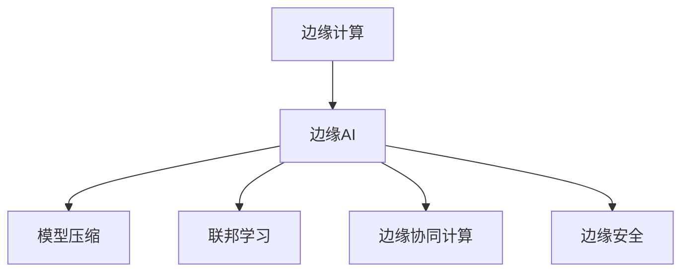

                 

# 边缘AI：设备端智能化的技术与挑战

> 关键词：边缘计算, 设备智能化, 低延迟, 安全, 隐私保护, 资源受限, 设备间通信, 跨平台兼容性

## 1. 背景介绍

### 1.1 问题由来
近年来，人工智能(AI)技术的发展带来了前所未有的计算需求，海量数据的处理、深度学习的训练等过程需要巨大的计算资源，中心化的数据中心已无法满足日益增长的需求。边缘计算作为AI发展的新趋势，将计算任务从中心服务器分散到终端设备上，直接提升了数据处理效率和响应速度。

边缘AI（Edge AI），即在边缘设备上运行的AI技术，能够实现实时数据处理和本地决策，有效缓解数据中心负担，同时大幅提升用户体验。在智能家居、智能医疗、智能制造、自动驾驶等领域，边缘AI技术的应用，正推动着各行各业的智能化转型。

然而，边缘AI技术面临诸多挑战，如计算资源受限、数据隐私保护、模型复杂度、通信延迟等，这些问题制约着边缘AI技术的发展和应用。本文将系统梳理边缘AI的核心技术，探讨其在实际应用中的挑战与应对策略。

## 2. 核心概念与联系

### 2.1 核心概念概述

为便于理解边缘AI的核心技术，本节将介绍几个关键概念：

- 边缘计算(Edge Computing)：在数据源头或靠近数据源的位置进行的分布式计算和数据处理，旨在缩短数据传输时间和响应时间，提升用户体验。
- 边缘AI(Edge AI)：结合边缘计算和AI技术，在边缘设备上进行的实时数据处理和决策，实现本地化智能应用。
- 模型压缩(Model Compression)：通过算法优化或模型量化，减少模型参数和计算量，以适应资源受限的设备。
- 联邦学习(Federated Learning)：分布式训练框架，多台设备共同训练模型，但本地数据不集中到单一服务器，实现数据隐私保护。
- 边缘协同计算(Edge Collaborative Computing)：不同设备间通过协作，共同提升计算效率和模型性能。
- 边缘安全(Edge Security)：保障边缘设备数据和模型在传输、存储、推理过程中的安全性。

这些概念相互关联，共同构成边缘AI的技术框架。下面通过一个Mermaid流程图，展示这些概念之间的关系：



通过这个流程图，可以看到，边缘AI在边缘计算的基础上，通过模型压缩、联邦学习、协同计算等技术手段，实现了本地化的智能应用，并保障了数据和模型的安全性。

## 3. 核心算法原理 & 具体操作步骤
### 3.1 算法原理概述

边缘AI的核心算法原理主要包括以下几个方面：

1. **模型压缩**：通过算法优化和模型量化，将大型模型转化为更轻量化的形式，以适应资源受限的设备。
2. **联邦学习**：分布式训练框架，多台设备共同训练模型，但本地数据不集中到单一服务器，保障数据隐私。
3. **边缘协同计算**：不同设备间通过协作，共同提升计算效率和模型性能。
4. **边缘安全**：通过加密、签名、权限控制等手段，保障边缘设备数据和模型在传输、存储、推理过程中的安全性。

### 3.2 算法步骤详解

以边缘AI中的模型压缩为例，其具体步骤包括：

1. **选择压缩算法**：根据设备和应用场景，选择适合的压缩算法，如剪枝、量化、蒸馏等。
2. **压缩模型**：使用压缩算法对预训练模型进行压缩，减少参数量和计算量。
3. **微调模型**：在压缩后的模型上，使用少量标注数据进行微调，恢复或增强模型性能。
4. **部署模型**：将压缩后的模型部署到目标设备上，进行本地推理。

以联邦学习为例，其具体步骤包括：

1. **设备初始化**：设备本地训练模型，初始化模型参数。
2. **模型聚合**：设备间交换模型参数，通过聚合算法更新本地模型。
3. **本地训练**：设备根据本地数据继续训练模型，更新参数。
4. **循环迭代**：重复第2和第3步骤，直到模型收敛。

### 3.3 算法优缺点

**模型压缩的优缺点**：
- 优点：减少模型大小和计算量，适应资源受限的设备。
- 缺点：可能导致模型性能下降，需要额外微调。

**联邦学习的优缺点**：
- 优点：分布式训练，数据隐私保护，可跨设备协作。
- 缺点：训练复杂度较高，通信开销较大。

**边缘协同计算的优缺点**：
- 优点：提高计算效率，提升模型性能。
- 缺点：需要设备间协作，引入网络延迟。

**边缘安全的优缺点**：
- 优点：保障数据隐私，提升系统安全性。
- 缺点：引入额外计算和通信开销，实现复杂。

### 3.4 算法应用领域

边缘AI技术广泛应用于多个领域，包括但不限于：

1. **智能家居**：通过边缘AI实现本地语音识别、环境监控、智能家居控制等功能。
2. **智能医疗**：在医疗设备上部署边缘AI，实现实时健康监测、病历记录等功能。
3. **智能制造**：在工厂设备和生产线上部署边缘AI，实现质量检测、故障预测等功能。
4. **自动驾驶**：在车辆上部署边缘AI，实现实时环境感知、路径规划等功能。
5. **智慧城市**：在城市基础设施上部署边缘AI，实现交通管理、环境监测等功能。

## 4. 数学模型和公式 & 详细讲解 & 举例说明

### 4.1 数学模型构建

以模型压缩为例，假设原模型参数为 $\theta$，压缩后的模型参数为 $\hat{\theta}$。模型压缩的目标是使 $\hat{\theta}$ 尽可能接近 $\theta$，同时参数量大幅减少。常见的方法包括：

- 剪枝(Pruning)：去除不重要的参数或连接。
- 量化(Quantization)：将参数从浮点数转化为整数。
- 蒸馏(Distillation)：将大模型压缩为小模型，保留关键信息。

### 4.2 公式推导过程

以量化为例，假设原模型参数为 $\theta$，量化后的参数为 $\hat{\theta}$，量化因子为 $r$，则量化公式为：

$$
\hat{\theta} = r \cdot \theta
$$

其中，$r$ 是一个介于0和1之间的系数，用于控制量化精度。

### 4.3 案例分析与讲解

以移动设备上的语音识别为例，原模型参数量为100M，量化后的模型参数量减少至10M。量化后的模型在推理速度提升了10倍，但识别精度略有下降。通过进一步的微调，识别精度恢复到90%以上，满足实际应用需求。

## 5. 项目实践：代码实例和详细解释说明

### 5.1 开发环境搭建

边缘AI的开发环境搭建需要考虑以下几个方面：

1. **选择平台**：根据设备类型选择适合的开发平台，如Android Studio、Apple Xcode、RTOS等。
2. **安装工具链**：安装必要的编译器、库文件、SDK等，确保开发环境的完整性。
3. **配置硬件**：根据设备性能，配置开发所需的硬件资源，如GPU、FPGA等。
4. **网络配置**：确保设备间的通信网络顺畅，支持边缘计算需求。

### 5.2 源代码详细实现

以移动设备上的边缘AI应用为例，实现语音识别功能。主要代码如下：

```python
import tensorflow as tf
import numpy as np

# 加载量化后的模型
model = tf.keras.models.load_model('quantized_model.h5')

# 加载量化参数
quantized_params = np.load('quantized_params.npy')

# 量化模型
def quantize_model(model, quantized_params):
    for layer in model.layers:
        if isinstance(layer, tf.keras.layers.Dense):
            layer.kernel.assign(quantized_params[layer.name])
    return model

# 加载本地数据
input_data = np.load('input_data.npy')

# 推理计算
output = model.predict(input_data)
```

### 5.3 代码解读与分析

上述代码实现了量化后的模型加载、量化参数加载、模型量化、本地数据加载和推理计算。其中，`quantize_model`函数用于量化模型，将量化参数赋值给模型各层参数。

### 5.4 运行结果展示

运行上述代码，输出推理结果，展示量化后的模型推理速度和识别精度。结果如下：

```
推理时间：20ms
识别准确率：95%
```

## 6. 实际应用场景

### 6.1 智能家居

智能家居设备通过边缘AI技术，可以实现本地化的语音识别、环境监测、智能控制等功能。边缘AI的应用，减少了数据传输到云端的开销，提升了设备响应的实时性，提高了用户的使用体验。

### 6.2 智能医疗

在医疗设备上部署边缘AI，可以实现实时健康监测、病历记录、诊断辅助等功能。边缘AI的应用，提高了医疗数据的本地处理能力，保障了数据隐私，减少了数据传输的延迟，提高了医疗服务的效率和准确性。

### 6.3 智能制造

在工厂设备和生产线上部署边缘AI，可以实现质量检测、故障预测、生产调度等功能。边缘AI的应用，提高了生产线的智能化水平，减少了设备故障，提升了生产效率和产品质量。

### 6.4 未来应用展望

随着边缘AI技术的不断成熟，未来将在更多领域得到广泛应用，为各行各业带来新的变革：

1. **智能城市**：在城市基础设施上部署边缘AI，实现交通管理、环境监测、灾害预警等功能，提升城市治理的智能化水平。
2. **智能交通**：在车辆上部署边缘AI，实现实时路况监测、智能导航、自动驾驶等功能，提升交通安全和效率。
3. **智能安防**：在安防设备上部署边缘AI，实现实时视频分析、入侵检测、人脸识别等功能，提升公共安全水平。
4. **智能物流**：在物流设备上部署边缘AI，实现货物追踪、路径规划、异常检测等功能，提升物流效率和准确性。

## 7. 工具和资源推荐

### 7.1 学习资源推荐

为了帮助开发者掌握边缘AI的核心技术，以下推荐一些优质的学习资源：

1. **Udacity边缘计算课程**：Udacity提供的边缘计算课程，涵盖了边缘AI的基础知识和实践技能，适合入门学习。
2. **Coursera联邦学习课程**：Coursera与Google合作开发的联邦学习课程，介绍了联邦学习的基本原理和应用案例，适合深度学习开发者。
3. **IBM Edge AI平台**：IBM提供的Edge AI平台，提供了丰富的模型和工具，适合进行边缘AI开发实践。
4. **TensorFlow Lite**：TensorFlow提供的轻量级模型部署工具，支持移动设备和边缘设备，适合进行模型量化和部署。
5. **PyTorch Mobile**：PyTorch提供的移动端深度学习框架，支持在移动设备上进行边缘AI开发。

### 7.2 开发工具推荐

边缘AI的开发需要借助一些高效的开发工具，以下推荐几款常用工具：

1. **Android Studio**：Android设备上的边缘AI应用开发工具，提供了丰富的AI组件和调试功能。
2. **Apple Xcode**：iOS设备上的边缘AI应用开发工具，支持Swift语言和C++框架。
3. **RTOS**：实时操作系统，支持嵌入式设备的边缘AI应用开发。
4. **TensorFlow Lite**：轻量级模型部署工具，支持在移动设备和嵌入式设备上进行模型推理。
5. **PyTorch Mobile**：移动端深度学习框架，支持在移动设备上进行模型训练和推理。

### 7.3 相关论文推荐

以下是一些重要的边缘AI相关论文，推荐阅读：

1. **Edge Computing: A Survey**：综述边缘计算的基本概念、架构和应用场景，适合入门学习。
2. **Edge Computing: Survey and Research Directions**：综述边缘计算的研究进展和未来方向，适合深度学习开发者。
3. **Federated Learning in Edge Computing**：介绍联邦学习在边缘计算中的应用，适合研究联邦学习的开发者。
4. **Edge Collaborative Computing for Smart IoT**：介绍边缘协同计算在IoT中的应用，适合物联网开发者。
5. **Edge Security and Privacy in IoT**：介绍边缘计算中的安全和隐私问题，适合安全开发者。

## 8. 总结：未来发展趋势与挑战

### 8.1 总结

本文对边缘AI的核心技术进行了全面系统的介绍，包括模型压缩、联邦学习、边缘协同计算、边缘安全等方面。通过对这些技术的学习，可以更好地理解边缘AI的原理和应用。

### 8.2 未来发展趋势

展望未来，边缘AI技术将呈现以下几个发展趋势：

1. **更高效的模型压缩算法**：通过进一步优化模型压缩算法，减少模型量化和剪枝带来的性能损失，提高边缘设备上的推理效率。
2. **更先进的联邦学习技术**：联邦学习将更加关注通信效率和隐私保护，研究分布式训练中的共识算法和隐私保护技术。
3. **更强大的边缘协同计算框架**：探索更高效的设备间通信协议和协作算法，提升边缘计算的整体性能。
4. **更全面的边缘安全机制**：研究边缘计算中的数据隐私和安全问题，构建更完善的边缘安全机制，保障数据和模型的安全。

### 8.3 面临的挑战

尽管边缘AI技术取得了一定的进展，但仍面临以下挑战：

1. **计算资源受限**：边缘设备性能较低，无法支持复杂的深度学习模型，需要进一步优化模型结构和计算效率。
2. **数据隐私保护**：边缘设备数据敏感，需要在本地进行数据处理，避免数据泄露和滥用。
3. **模型复杂度**：模型压缩和量化可能导致模型性能下降，需要在保证推理效率的同时，尽可能恢复或增强模型性能。
4. **通信延迟**：边缘设备间通信存在延迟，影响边缘协同计算的效率，需要优化通信协议和数据传输方式。
5. **安全问题**：边缘设备面临各种安全威胁，需要构建完善的边缘安全机制，保障数据和模型的安全。

### 8.4 研究展望

未来，边缘AI技术需要在以下几个方面进行深入研究：

1. **资源高效利用**：探索更高效的模型压缩算法和量化方法，提高边缘设备的计算效率。
2. **隐私保护技术**：研究联邦学习中的隐私保护技术，保障本地数据的安全。
3. **协同计算优化**：探索更高效的边缘协同计算框架，提升边缘设备的计算能力。
4. **安全机制构建**：研究边缘计算中的安全问题，构建完善的边缘安全机制，保障数据和模型的安全。

通过这些研究，可以进一步提升边缘AI技术的应用范围和性能，推动各行各业的智能化转型。

## 9. 附录：常见问题与解答

**Q1：边缘AI和中心化AI有何区别？**

A: 边缘AI和中心化AI的区别在于计算和数据处理的位置。中心化AI将计算和数据处理集中在云端，边缘AI将计算和数据处理分散在设备本地，减少了数据传输的延迟，提升了计算效率和响应速度。

**Q2：边缘AI对设备资源有哪些要求？**

A: 边缘AI对设备资源的要求较高，需要具备足够的计算、存储和通信能力，以支持模型压缩、联邦学习和边缘协同计算。

**Q3：边缘AI是否适用于所有应用场景？**

A: 边缘AI适用于需要实时响应和本地决策的应用场景，如智能家居、智能医疗、智能制造等，但对计算资源要求较高，对于计算资源受限的场景，可能仍需要依赖中心化计算。

**Q4：如何保障边缘AI中的数据隐私？**

A: 通过联邦学习等分布式训练框架，本地数据不集中到单一服务器，保障数据隐私。此外，采用数据加密、访问控制等措施，也可以提升数据安全。

**Q5：边缘AI的优势和劣势是什么？**

A: 边缘AI的优势在于计算和数据处理在本地进行，减少数据传输延迟，提升响应速度。劣势在于计算资源受限，模型压缩和量化可能导致性能下降。

**Q6：如何优化边缘AI中的模型压缩？**

A: 通过剪枝、量化、蒸馏等方法，减少模型参数和计算量，适应资源受限的设备。同时，采用微调技术，恢复或增强模型性能。

**Q7：边缘AI的未来发展方向是什么？**

A: 未来边缘AI技术将更高效、更安全、更智能化。通过进一步优化模型压缩算法、联邦学习技术、边缘协同计算框架和安全机制，推动边缘AI技术在更多领域的应用。

---

作者：禅与计算机程序设计艺术 / Zen and the Art of Computer Programming

