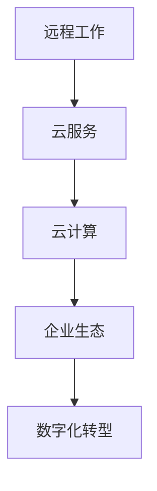

                 

# 远程创业：打造无边界的企业生态

> 关键词：远程工作,远程管理,企业生态,数字化转型,云计算,人工智能

## 1. 背景介绍

### 1.1 问题由来

随着全球化和技术发展的加速，远程办公和远程创业成为一种新的工作和生活方式。新冠疫情的爆发更是推动了这一趋势的发展，许多企业不得不转向远程模式以保持运营。然而，这种快速的变化带来了诸多挑战，如团队协作、项目管理、数据安全等，如何有效应对这些挑战，并充分利用数字化技术推动企业的长期发展，成为当前远程创业和企业管理的核心问题。

### 1.2 问题核心关键点

远程创业和企业管理的核心在于如何构建一个灵活、高效、安全的数字化企业生态。这个生态应包括：

- **灵活的工作方式**：打破时间和空间的限制，支持团队成员的远程办公和协作。
- **高效的沟通和协作工具**：使用云端协作工具，支持实时沟通、项目管理、文档协作等。
- **先进的安全措施**：保护企业数据和知识产权，防止信息泄露和网络攻击。
- **数据驱动的决策**：通过分析大数据，辅助企业制定决策，提高管理效率。
- **持续的创新能力**：利用云计算和人工智能等技术，驱动企业持续创新。

## 2. 核心概念与联系

### 2.1 核心概念概述

为了更好地理解远程创业和企业管理，我们首先介绍一些关键概念：

- **远程工作**：指员工不再到公司集中办公，而是通过互联网远程接入公司的系统资源和数据，进行工作和沟通。
- **云服务**：指通过互联网提供计算资源、软件和数据存储服务的模式，可以支持远程办公的企业服务。
- **云计算**：是一种基于云服务的企业架构模式，支持企业以按需和弹性的方式使用计算资源。
- **企业生态**：指企业内外所有相关利益者（如员工、客户、合作伙伴等）形成的生态系统，通过数字化技术实现互连互通。
- **数字化转型**：指企业通过数字化技术优化业务流程、提升运营效率和市场响应速度，实现商业模式的创新。

### 2.2 核心概念原理和架构的 Mermaid 流程图(Mermaid 流程节点中不要有括号、逗号等特殊字符)



这个流程图展示了远程工作、云服务、云计算、企业生态和数字化转型之间的联系。其中，远程工作是基础，通过云服务在云计算架构下实现企业生态的构建，并通过数字化转型推动企业的发展和创新。

## 3. 核心算法原理 & 具体操作步骤
### 3.1 算法原理概述

远程创业和企业管理涉及的核心算法和技术包括云计算、大数据、人工智能等。以下是一些基本的算法原理和技术实现：

#### 3.1.1 云计算
云计算的核心技术包括弹性计算、分布式存储、云计算平台、云安全等。弹性计算通过虚拟化技术，将物理资源抽象成计算资源池，支持按需分配和动态扩展。分布式存储通过多台服务器协同工作，实现数据的冗余和高可用性。云安全通过加密、访问控制、网络监控等手段，保障数据和应用的安全性。

#### 3.1.2 大数据
大数据的核心技术包括数据采集、数据存储、数据处理、数据分析、数据可视化等。数据采集通过ETL（抽取、转换、加载）技术，从各个数据源收集数据。数据存储通过Hadoop、Spark等分布式存储系统，支持大规模数据的存储和管理。数据处理通过MapReduce、Spark等分布式计算框架，实现大规模数据的并行处理。数据分析通过机器学习、深度学习等算法，挖掘数据中的有价值信息。数据可视化通过Tableau、Power BI等工具，直观展示数据分析结果。

#### 3.1.3 人工智能
人工智能的核心技术包括自然语言处理（NLP）、计算机视觉、机器学习、深度学习等。NLP通过文本分类、命名实体识别、情感分析等技术，实现对文本数据的理解和处理。计算机视觉通过图像识别、目标检测等技术，实现对图像数据的理解和处理。机器学习和深度学习通过分类、回归、聚类等算法，实现对数据的建模和预测。

### 3.2 算法步骤详解

#### 3.2.1 云服务搭建
1. **选择合适的云服务提供商**：如AWS、Azure、Google Cloud等，根据企业需求选择合适的云服务。
2. **搭建云基础设施**：包括虚拟网络和云服务器，支持企业的数据存储和计算需求。
3. **部署云应用**：将企业应用部署到云平台上，通过云平台提供的API进行访问和管理。

#### 3.2.2 大数据平台搭建
1. **数据采集**：收集企业内部的业务数据、客户数据、市场数据等，通过ETL工具进行数据清洗和整合。
2. **数据存储**：使用Hadoop、Spark等分布式存储系统，将数据存储在云端。
3. **数据处理**：通过MapReduce、Spark等分布式计算框架，对数据进行并行处理和分析。
4. **数据可视化**：使用Tableau、Power BI等工具，将分析结果以图表形式展示，辅助企业决策。

#### 3.2.3 人工智能应用
1. **自然语言处理**：使用BERT、GPT等预训练模型，对文本数据进行情感分析、命名实体识别等处理。
2. **计算机视觉**：使用YOLO、ResNet等模型，对图像数据进行目标检测、图像分类等处理。
3. **机器学习和深度学习**：使用TensorFlow、PyTorch等框架，构建分类、回归、聚类等模型，实现对数据的建模和预测。

### 3.3 算法优缺点
#### 3.3.1 云服务的优点
- **灵活性**：云服务可以按需分配计算资源，支持企业弹性扩展。
- **安全性**：云服务提供多层次的安全措施，保障企业数据和应用的安全。
- **可扩展性**：云服务支持大规模数据的存储和处理，满足企业快速增长的需求。

#### 3.3.2 云服务的缺点
- **成本高**：初期建设成本较高，需要投入大量资源和人力。
- **依赖性**：企业对云服务提供商的依赖较大，存在服务中断的风险。

#### 3.3.3 大数据的优点
- **数据量庞大**：通过大数据分析，企业可以获取大量有价值的信息。
- **实时性**：大数据平台支持实时数据处理，提供即时反馈。
- **自动化**：大数据平台支持自动化数据处理，减少人工干预。

#### 3.3.4 大数据的缺点
- **复杂性**：大数据平台搭建和维护复杂，需要专业技能。
- **数据隐私**：大数据分析需要处理大量敏感数据，存在数据隐私和安全风险。

#### 3.3.5 人工智能的优点
- **智能决策**：通过AI算法，企业可以做出更加精准的决策。
- **高效性**：AI算法能够快速处理大量数据，提高企业效率。
- **创新性**：AI技术支持企业创新，开拓新的业务领域。

#### 3.3.6 人工智能的缺点
- **技术门槛高**：AI技术需要专业技能和知识，门槛较高。
- **数据需求大**：AI算法需要大量数据进行训练和优化。
- **模型复杂性**：AI模型结构复杂，维护和解释难度大。

### 3.4 算法应用领域

远程创业和企业管理涉及多个领域，包括但不限于：

- **人力资源管理**：使用云服务和大数据分析，优化招聘、培训、绩效管理等流程。
- **客户关系管理**：通过云计算和大数据平台，实现客户数据的整合和分析，提升客户满意度。
- **供应链管理**：利用云服务和AI技术，优化供应链管理，提高物流效率。
- **市场营销**：通过大数据和AI技术，精准定位目标客户，实现个性化营销。
- **财务管理**：使用云服务和大数据分析，优化财务管理，降低成本。
- **产品开发**：通过AI技术和数据分析，加速产品创新和开发。

## 4. 数学模型和公式 & 详细讲解 & 举例说明
### 4.1 数学模型构建

为了更好地理解远程创业和企业管理中的算法和模型，我们定义一些核心数学模型和公式。

#### 4.1.1 云计算模型

云计算的核心模型是资源池模型，通过虚拟化技术将物理资源抽象成计算资源池，支持弹性分配和动态扩展。模型的基本形式如下：

$$
R = C + S
$$

其中，$R$ 表示计算资源，$C$ 表示计算能力，$S$ 表示计算存储。

#### 4.1.2 大数据模型

大数据的核心模型是分布式存储和处理模型，通过多台服务器协同工作，实现大规模数据的存储和管理。模型的基本形式如下：

$$
D = \sum_{i=1}^n D_i
$$

其中，$D$ 表示大数据集，$D_i$ 表示分布式存储和处理的一个数据片段。

#### 4.1.3 人工智能模型

人工智能的核心模型是深度学习模型，通过多层神经网络对数据进行建模和预测。模型的基本形式如下：

$$
\hat{y} = f(x; \theta)
$$

其中，$\hat{y}$ 表示预测结果，$x$ 表示输入数据，$\theta$ 表示模型参数，$f$ 表示深度学习算法。

### 4.2 公式推导过程

#### 4.2.1 云计算模型推导

云计算资源池模型的推导过程如下：

1. **计算能力模型**：

$$
C = P + D
$$

其中，$P$ 表示物理计算资源，$D$ 表示分布式计算资源。

2. **计算存储模型**：

$$
S = H + C
$$

其中，$H$ 表示存储资源。

3. **资源池模型**：

$$
R = C + S = P + D + H
$$

其中，$P$ 表示物理计算资源，$D$ 表示分布式计算资源，$H$ 表示存储资源。

#### 4.2.2 大数据模型推导

大数据分布式存储和处理模型的推导过程如下：

1. **分布式存储模型**：

$$
D = \sum_{i=1}^n D_i
$$

其中，$D_i$ 表示分布式存储的一个数据片段。

2. **分布式处理模型**：

$$
\hat{D} = \sum_{i=1}^n \hat{D}_i
$$

其中，$\hat{D}_i$ 表示分布式处理的一个数据片段。

3. **大数据模型**：

$$
D = \hat{D}
$$

其中，$D$ 表示大数据集，$\hat{D}$ 表示分布式处理后的数据集。

#### 4.2.3 人工智能模型推导

人工智能深度学习模型的推导过程如下：

1. **多层神经网络模型**：

$$
\hat{y} = f(x; \theta)
$$

其中，$\hat{y}$ 表示预测结果，$x$ 表示输入数据，$\theta$ 表示模型参数，$f$ 表示深度学习算法。

2. **反向传播算法**：

$$
\frac{\partial \hat{y}}{\partial x} = \frac{\partial \hat{y}}{\partial \theta} \cdot \frac{\partial f(x; \theta)}{\partial x}
$$

其中，$\frac{\partial \hat{y}}{\partial x}$ 表示梯度向量，$\frac{\partial f(x; \theta)}{\partial x}$ 表示反向传播的梯度。

3. **梯度下降算法**：

$$
\theta \leftarrow \theta - \alpha \cdot \frac{\partial \hat{y}}{\partial x}
$$

其中，$\alpha$ 表示学习率，$\theta$ 表示模型参数。

### 4.3 案例分析与讲解

#### 4.3.1 云计算案例分析

某公司通过云计算平台搭建企业级应用，包括ERP、CRM、HRM等系统。公司使用AWS云服务，搭建了虚拟网络和云服务器，部署了企业应用。通过AWS提供的API，实现对云资源的访问和管理。公司还使用AWS的安全措施，保障企业数据和应用的安全。

#### 4.3.2 大数据案例分析

某电商平台通过大数据平台实现客户数据的整合和分析，提升客户满意度。平台使用Hadoop和Spark进行数据存储和处理，实现实时数据分析。通过大数据分析，平台能够精准定位客户需求，实现个性化推荐。

#### 4.3.3 人工智能案例分析

某金融公司通过人工智能技术优化财务决策，提高管理效率。公司使用深度学习模型对市场数据进行分析和预测，支持企业制定精准的财务决策。通过自然语言处理技术，公司能够快速处理大量的金融新闻和公告，提供实时市场信息。

## 5. 项目实践：代码实例和详细解释说明
### 5.1 开发环境搭建

在进行远程创业和企业管理实践前，我们需要准备好开发环境。以下是使用Python进行开发的环境配置流程：

1. **安装Python**：从官网下载并安装最新版本的Python。
2. **安装云服务SDK**：安装AWS SDK、Azure SDK、Google Cloud SDK等云服务SDK，支持企业接入云服务。
3. **安装大数据工具**：安装Hadoop、Spark等大数据工具，支持企业处理大规模数据。
4. **安装AI工具**：安装TensorFlow、PyTorch等AI工具，支持企业构建深度学习模型。
5. **安装协作工具**：安装Slack、Zoom等协作工具，支持团队远程协作和沟通。

完成上述步骤后，即可在开发环境中进行远程创业和企业管理实践。

### 5.2 源代码详细实现

下面我们以云计算平台搭建为例，给出使用Python进行AWS云服务开发的代码实现。

首先，安装AWS SDK：

```python
pip install awscli
```

然后，配置AWS CLI：

```python
aws configure
```

输入相应的AWS账户ID、密钥等配置信息，完成配置。

接着，搭建云服务：

```python
import boto3

# 创建EC2实例
ec2 = boto3.resource('ec2')
instance = ec2.create_instances(
    ImageId='ami-0abcdef1234567890', 
    MinCount=1,
    MaxCount=1,
    InstanceType='t2.micro',
    KeyName='my-key-pair'
)
print(instance[0].id)

# 创建云存储
s3 = boto3.resource('s3')
bucket = s3.create_bucket(Bucket='my-bucket')
print(bucket.name)

# 创建云数据库
rds = boto3.client('rds')
db_instance = rds.create_db_instance(
    DBInstanceIdentifier='my-db-instance',
    Engine='mysql',
    MasterUsername='root',
    MasterUserPassword='password',
    AllocatedStorage=20)
print(db_instance['DBInstance']['DBInstanceIdentifier'])
```

运行上述代码，即可在AWS云平台创建EC2实例、云存储和云数据库，搭建企业级云计算平台。

### 5.3 代码解读与分析

**AWS SDK**：
- `aws configure`：配置AWS CLI，输入相应的AWS账户ID、密钥等配置信息。
- `boto3.resource('ec2')`：创建EC2资源，使用云服务API进行实例管理。
- `boto3.client('rds')`：创建RDS资源，使用云服务API进行数据库管理。

**云存储**：
- `s3.create_bucket(Bucket='my-bucket')`：创建S3桶，用于存储企业数据。
- `db_instance['DBInstance']['DBInstanceIdentifier']`：返回数据库实例ID，支持企业访问数据库。

**云数据库**：
- `rds.create_db_instance()`：创建RDS实例，使用云服务API进行数据库实例化。
- `db_instance['DBInstance']['DBInstanceIdentifier']`：返回数据库实例ID，支持企业访问数据库。

### 5.4 运行结果展示

运行上述代码后，AWS CLI会自动输出创建的EC2实例、云存储和云数据库的ID和信息，支持企业进行后续操作。例如，通过SSH访问EC2实例，使用云数据库进行数据存储和查询。

## 6. 实际应用场景
### 6.1 智能客服系统

某电商企业通过远程创业方式，搭建智能客服系统。系统使用云计算和大数据平台，实现客户数据的整合和分析，提升客户满意度。通过自然语言处理技术，系统能够自动理解客户咨询内容，生成最佳回复，提高服务效率。

### 6.2 金融风控系统

某金融公司通过远程创业方式，搭建金融风控系统。系统使用云计算和人工智能技术，实现对客户数据的深度分析和预测，支持企业制定精准的财务决策。通过深度学习模型，系统能够识别异常交易行为，及时发现和防范金融风险。

### 6.3 制造企业管理系统

某制造企业通过远程创业方式，搭建企业管理系统。系统使用云计算和物联网技术，实现生产数据的实时采集和分析，优化生产流程和资源配置。通过大数据分析，系统能够预测设备故障，提前进行维护，减少生产中断和损失。

### 6.4 未来应用展望

未来，随着云计算、大数据、人工智能等技术的进一步发展，远程创业和企业管理将迎来更加广阔的应用前景：

- **物联网与AI结合**：通过物联网技术，企业可以实现设备、生产线的实时监控和远程管理，提升生产效率和质量。
- **区块链与AI结合**：通过区块链技术，企业可以实现数据透明和可信，保障数据安全和隐私。
- **5G与AI结合**：通过5G网络，企业可以实现超高速的数据传输和低延迟的实时交互，提升远程协作和管理的效率。
- **边缘计算与AI结合**：通过边缘计算技术，企业可以实现数据本地化处理，降低数据传输成本，提高实时性。

## 7. 工具和资源推荐
### 7.1 学习资源推荐

为了帮助开发者系统掌握远程创业和企业管理的技术基础，这里推荐一些优质的学习资源：

1. **《云计算基础》课程**：由云服务提供商提供的官方在线课程，涵盖云服务的基本概念、搭建和运维等知识。
2. **《大数据技术与应用》课程**：由大数据提供商提供的官方在线课程，涵盖大数据的基本概念、搭建和运维等知识。
3. **《人工智能基础》课程**：由AI提供商提供的官方在线课程，涵盖人工智能的基本概念、模型和算法等知识。
4. **《远程工作管理》书籍**：详细介绍远程工作管理和团队协作的实用技巧和方法。
5. **《数字化转型》书籍**：涵盖数字化转型的基本概念、战略和实施方法。

通过对这些资源的学习实践，相信你一定能够快速掌握远程创业和企业管理的技术基础，并用于解决实际的业务问题。

### 7.2 开发工具推荐

高效的开发离不开优秀的工具支持。以下是几款用于远程创业和企业管理开发的常用工具：

1. **AWS CloudFormation**：用于自动化云资源的搭建和配置，支持企业快速部署云应用。
2. **Kubernetes**：用于容器编排和资源管理，支持企业高效管理云资源。
3. **Jupyter Notebook**：用于数据科学和机器学习，支持企业进行数据分析和模型训练。
4. **Slack**：用于团队沟通和协作，支持企业实时沟通和协作。
5. **Zoom**：用于视频会议和远程培训，支持企业进行远程管理和培训。

合理利用这些工具，可以显著提升远程创业和企业管理任务的开发效率，加快创新迭代的步伐。

### 7.3 相关论文推荐

远程创业和企业管理涉及的技术领域广泛，以下是几篇相关的重要论文，推荐阅读：

1. **《云计算与企业生态》**：详细讨论云计算对企业生态的影响和优化方法。
2. **《大数据与企业管理》**：讨论大数据技术在企业管理中的应用和优化方法。
3. **《人工智能与智能制造》**：探讨人工智能技术在制造企业中的应用和优化方法。
4. **《远程办公与企业管理》**：讨论远程办公对企业管理的影响和优化方法。
5. **《物联网与智能制造》**：探讨物联网技术在智能制造中的应用和优化方法。

这些论文代表了大数据、云计算、人工智能等技术在远程创业和企业管理中的应用现状和发展方向。通过学习这些前沿成果，可以帮助研究者把握学科前进方向，激发更多的创新灵感。

## 8. 总结：未来发展趋势与挑战
### 8.1 研究成果总结

本文对远程创业和企业管理进行了全面系统的介绍，涵盖了云计算、大数据、人工智能等核心技术的应用。通过系统梳理，可以看到，远程创业和企业管理涉及多个技术领域，需要通过多学科知识进行综合应用。

### 8.2 未来发展趋势

展望未来，远程创业和企业管理将呈现以下几个发展趋势：

1. **技术融合加速**：云计算、大数据、人工智能等技术将进一步融合，为企业提供更加全面和高效的服务。
2. **数据驱动决策**：大数据技术将支持企业进行精准决策，提升管理效率和市场响应速度。
3. **数字化转型深入**：企业将通过数字化技术实现业务流程的优化和创新，提升竞争力。
4. **智能制造普及**：物联网、云计算、人工智能等技术将广泛应用于制造企业，实现智能制造。
5. **远程协作优化**：远程办公将更加普及和优化，企业将通过先进的协作工具实现高效沟通和协作。

### 8.3 面临的挑战

尽管远程创业和企业管理技术取得了显著进展，但在迈向更加智能化、普适化应用的过程中，仍面临诸多挑战：

1. **技术复杂性**：远程创业和企业管理涉及多种技术，需要专业知识和技能。
2. **数据隐私和安全**：企业需要保护客户和企业数据，防止信息泄露和网络攻击。
3. **成本投入高**：云服务和人工智能技术需要高昂的投入，企业需要合理规划和管理。
4. **用户体验不足**：远程办公和协作工具需要不断优化，提升用户体验和满意度。
5. **系统复杂度**：远程创业和企业管理系统复杂，需要持续维护和优化。

### 8.4 研究展望

为了应对这些挑战，未来的研究需要在以下几个方面寻求新的突破：

1. **技术标准化**：制定云服务、大数据和人工智能的标准化规范，提升系统的互操作性和可靠性。
2. **安全性提升**：引入加密、访问控制等安全技术，保障数据和应用的安全性。
3. **成本控制**：通过云计算的按需计费模式，降低企业的运营成本。
4. **用户体验优化**：不断优化远程办公和协作工具，提升用户体验和满意度。
5. **系统自动化**：引入自动化工具和流程，提升系统的稳定性和效率。

## 9. 附录：常见问题与解答

**Q1：远程办公如何保障数据安全和隐私？**

A: 远程办公需要建立严格的安全管理制度，保障数据安全和隐私。主要措施包括：

- **数据加密**：使用AES、RSA等加密算法，对数据进行加密传输和存储。
- **访问控制**：设置访问权限，限制只有授权人员可以访问数据。
- **网络监控**：使用防火墙、入侵检测等技术，监控网络流量，防止非法访问。
- **多因素认证**：使用多因素认证技术，提高账户安全性。

**Q2：远程办公如何提升团队协作效率？**

A: 远程办公需要建立高效的协作工具和流程，提升团队协作效率。主要措施包括：

- **协作工具**：使用Slack、Trello等协作工具，支持实时沟通、任务管理和文件共享。
- **项目管理**：使用JIRA、Asana等项目管理工具，制定明确的任务和进度计划，保障项目按时完成。
- **文档管理**：使用Google Drive、Dropbox等文档管理工具，支持文档的共享和版本控制。
- **视频会议**：使用Zoom、Skype等视频会议工具，支持远程视频会议和培训。

**Q3：远程办公如何保证员工的工作效率？**

A: 远程办公需要建立明确的工作制度和考核机制，保障员工的工作效率。主要措施包括：

- **工作时间**：制定明确的工作时间表，保障员工的工作时间和休息时间。
- **任务分配**：根据员工的能力和兴趣，分配合适的工作任务，提高工作满意度。
- **目标管理**：设定明确的工作目标和考核标准，及时反馈工作进展和结果。
- **激励机制**：建立激励机制，对表现优秀的员工进行奖励和认可。

通过这些措施，可以提升远程办公的效率和效果，支持企业持续发展。

---

作者：禅与计算机程序设计艺术 / Zen and the Art of Computer Programming

