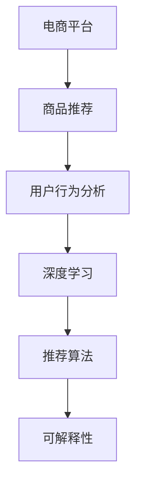

                 

# AI赋能的电商平台商品推荐解释系统

> 关键词：电商平台,商品推荐,解释系统,机器学习,用户行为分析,深度学习,推荐算法,可解释性

## 1. 背景介绍

### 1.1 问题由来
随着电商行业的快速发展和网络购物的普及，电商平台已经积累了大量的用户数据和交易记录。这些数据可以用于分析用户行为、挖掘用户需求，从而为消费者提供个性化、精准的商品推荐。但与此同时，庞大的数据量也带来了模型复杂度增加、训练成本高、结果难以解释等挑战。

### 1.2 问题核心关键点
在电商平台的推荐系统中，核心问题是如何基于用户历史行为和当前上下文信息，预测用户对商品的潜在兴趣，从而生成推荐列表。同时，如何提高推荐系统的可解释性，让用户理解推荐结果的原因，也是近年来AI技术在电商领域应用中的重要课题。

### 1.3 问题研究意义
研究电商平台的商品推荐解释系统，有助于提升推荐的精准度和用户满意度，增加平台的用户黏性和转化率。同时，通过提高推荐系统的可解释性，可以增加用户对系统的信任度，降低用户的决策不确定性。这对于电商平台的长远发展和用户体验的优化，具有重要意义。

## 2. 核心概念与联系

### 2.1 核心概念概述

为更好地理解基于机器学习的电商平台商品推荐解释系统，本节将介绍几个密切相关的核心概念：

- **电商平台**：指通过网络提供商品销售服务的平台，如京东、天猫、亚马逊等。
- **商品推荐**：根据用户的历史行为和当前上下文信息，预测用户对商品的兴趣，生成推荐列表。
- **用户行为分析**：通过数据分析方法，挖掘用户购买偏好、浏览习惯等行为特征，用于个性化推荐。
- **深度学习**：一种基于多层神经网络的机器学习技术，可以处理复杂非线性的数据关系，广泛应用于商品推荐等任务。
- **推荐算法**：通过机器学习模型，预测用户对商品的相关性和偏好程度，生成推荐结果。
- **可解释性**：指推荐系统能够给出推荐的依据和理由，使得用户能够理解系统的决策逻辑，提高用户信任度。

这些核心概念之间的逻辑关系可以通过以下Mermaid流程图来展示：



这个流程图展示的核心概念及其之间的关系：

1. 电商平台通过收集用户数据和交易记录，形成数据池。
2. 数据池中的用户行为信息，通过深度学习模型进行分析，提取用户特征。
3. 推荐算法基于用户特征，预测用户对商品的兴趣。
4. 推荐结果通过可解释系统，向用户说明推荐原因。

这些概念共同构成了电商平台推荐系统的逻辑框架，使系统能够在复杂的用户行为数据中提取有价值的信息，生成个性化的商品推荐，并通过解释系统增强用户体验。

## 3. 核心算法原理 & 具体操作步骤
### 3.1 算法原理概述

基于机器学习的电商平台商品推荐系统，一般通过深度学习模型对用户历史行为数据进行特征提取，并利用推荐算法预测用户对商品的兴趣，从而生成推荐列表。该系统通常包括以下三个步骤：

1. **用户行为分析**：通过深度学习模型，如长短期记忆网络(LSTM)、卷积神经网络(CNN)等，分析用户的历史行为数据，提取用户特征。
2. **推荐算法计算**：使用协同过滤、矩阵分解等推荐算法，计算用户对商品的相关性和兴趣程度。
3. **推荐结果生成**：结合用户特征和商品信息，生成推荐列表，并应用可解释系统向用户说明推荐理由。

### 3.2 算法步骤详解

具体而言，推荐系统的算法步骤包括：

**Step 1: 数据预处理**
- 收集用户历史行为数据和商品信息。
- 清洗和归一化数据，处理缺失值和异常值。
- 划分为训练集和测试集。

**Step 2: 用户行为特征提取**
- 使用深度学习模型，如LSTM、CNN等，将用户行为数据编码为固定长度的向量表示。
- 设计损失函数，如均方误差、交叉熵等，优化模型参数。

**Step 3: 推荐算法计算**
- 选择合适的推荐算法，如协同过滤、基于矩阵分解的推荐算法。
- 计算用户对商品的兴趣权重，形成推荐矩阵。
- 应用正则化技术，如L2正则、Dropout等，防止过拟合。

**Step 4: 推荐结果生成**
- 根据用户特征和商品信息，生成推荐列表。
- 应用可解释系统，向用户说明推荐的依据和理由。

**Step 5: 评估与优化**
- 在测试集上评估推荐系统的准确率和召回率。
- 根据评估结果调整模型参数和算法参数。

### 3.3 算法优缺点

基于机器学习的电商平台商品推荐系统，具有以下优点：

1. 高准确率：通过深度学习和推荐算法，可以准确预测用户对商品的兴趣，生成高质量的推荐列表。
2. 个性化推荐：能够根据用户历史行为和当前上下文信息，提供个性化的商品推荐。
3. 易于扩展：不同类型和规模的电商平台都可以使用该系统，具有广泛的适用性。
4. 实时性：可以实时处理用户的请求，动态更新推荐结果，提高用户体验。

同时，该方法也存在一些局限性：

1. 数据依赖性：推荐系统的效果很大程度上取决于用户历史行为数据的质量和数量，获取高质量数据的成本较高。
2. 冷启动问题：新用户或新商品的推荐效果往往较差，需要积累更多数据。
3. 过拟合风险：由于数据分布的不稳定性，推荐系统容易过拟合，导致泛化性能不足。
4. 可解释性不足：推荐的依据和理由缺乏可解释性，用户难以理解推荐逻辑。
5. 隐私风险：用户行为数据的收集和使用可能涉及隐私问题，需要合理处理。

尽管存在这些局限性，基于机器学习的推荐系统仍然是电商领域推荐技术的主流范式。未来相关研究将进一步降低数据依赖，提高少样本学习能力和可解释性，同时兼顾隐私保护和安全性等因素。

### 3.4 算法应用领域

基于机器学习的电商平台商品推荐系统，在电商领域已经得到了广泛的应用，包括：

- **个性化推荐**：根据用户的历史行为和当前兴趣，推荐商品。
- **热销商品榜**：基于用户行为数据和市场销售情况，生成热销商品榜，辅助用户决策。
- **新用户引导**：根据新用户的购买偏好和浏览历史，推荐个性化商品，提高新用户的留存率。
- **库存优化**：预测商品需求，优化库存管理，提高供应链效率。
- **价格策略**：基于用户行为和市场趋势，优化商品定价，提升销售转化率。

除了上述这些经典应用外，基于机器学习的推荐系统还被创新性地应用于更多场景中，如个性化营销、内容推荐、智能客服等，为电商平台带来了新的业务机会。

## 4. 数学模型和公式 & 详细讲解 & 举例说明
### 4.1 数学模型构建

本节将使用数学语言对基于机器学习的电商平台商品推荐系统进行更加严格的刻画。

记用户历史行为数据为 $X=\{x_1,x_2,\dots,x_n\}$，其中每个用户行为 $x_i$ 可以表示为一个向量 $[x_{i1},x_{i2},\dots,x_{im}]$，$m$ 表示特征维度。假设推荐系统的目标是预测用户对商品的兴趣程度，可以使用如下矩阵表示：

$$
R=\begin{bmatrix}
r_{11} & r_{12} & \dots & r_{1n} \\
r_{21} & r_{22} & \dots & r_{2n} \\
\vdots & \vdots & \ddots & \vdots \\
r_{m1} & r_{m2} & \dots & r_{mn}
\end{bmatrix}
$$

其中 $r_{ij}$ 表示用户 $i$ 对商品 $j$ 的兴趣程度，$R$ 为推荐矩阵。

### 4.2 公式推导过程

假设推荐系统基于协同过滤算法，计算用户对商品的兴趣权重，生成推荐矩阵。协同过滤算法可以分为基于用户的协同过滤和基于物品的协同过滤，这里以基于用户的协同过滤为例进行推导。

假设推荐系统已知 $m$ 个用户 $U$ 和 $n$ 个商品 $V$ 的评分矩阵 $R$，其中每个用户 $u$ 对商品 $v$ 的评分 $r_{uv}$ 表示为：

$$
r_{uv} = \alpha r_u + (1-\alpha) \langle r_v, r_u \rangle
$$

其中 $\alpha$ 为衰减系数，$r_u$ 和 $r_v$ 分别表示用户 $u$ 和商品 $v$ 的特征向量，$\langle \cdot, \cdot \rangle$ 表示向量的内积。

用户 $u$ 对商品 $v$ 的兴趣权重 $p_{uv}$ 可以表示为：

$$
p_{uv} = \frac{r_{uv} \cdot \langle r_u, r_v \rangle}{\sqrt{\langle r_u, r_u \rangle \cdot \langle r_v, r_v \rangle}}
$$

最后，生成用户 $u$ 的推荐列表 $I_u$：

$$
I_u = \arg\max_{v \in V} \{p_{uv}\}
$$

推导过程展示了协同过滤算法的计算原理，其中 $\alpha$ 用于控制特征向量的影响程度，$\langle \cdot, \cdot \rangle$ 用于计算向量之间的相似度。

### 4.3 案例分析与讲解

以京东平台的商品推荐为例，京东平台使用协同过滤算法结合深度学习模型，为每个用户生成个性化推荐列表。首先，京东平台通过分析用户的历史行为数据，使用LSTM模型提取用户特征，然后使用协同过滤算法计算用户对商品的兴趣权重，生成推荐列表。推荐结果通过可解释系统，向用户说明推荐理由，如商品价格、销量、评分等。用户还可以查看其他用户的推荐评价，辅助决策。

通过这种推荐方式，京东平台能够精准预测用户需求，提高推荐系统的点击率和转化率，同时也增加了用户对平台的信任度。

## 5. 项目实践：代码实例和详细解释说明
### 5.1 开发环境搭建

在进行推荐系统开发前，我们需要准备好开发环境。以下是使用Python进行PyTorch开发的环境配置流程：

1. 安装Anaconda：从官网下载并安装Anaconda，用于创建独立的Python环境。

2. 创建并激活虚拟环境：
```bash
conda create -n pytorch-env python=3.8 
conda activate pytorch-env
```

3. 安装PyTorch：根据CUDA版本，从官网获取对应的安装命令。例如：
```bash
conda install pytorch torchvision torchaudio cudatoolkit=11.1 -c pytorch -c conda-forge
```

4. 安装TensorFlow：从官网下载安装包，使用pip安装。例如：
```bash
pip install tensorflow
```

5. 安装Pandas、NumPy、Matplotlib等各类工具包：
```bash
pip install pandas numpy matplotlib scikit-learn jupyter notebook ipython
```

完成上述步骤后，即可在`pytorch-env`环境中开始推荐系统开发。

### 5.2 源代码详细实现

下面我们以基于协同过滤算法的商品推荐系统为例，给出使用PyTorch和TensorFlow进行深度学习和推荐计算的代码实现。

首先，定义用户行为数据和评分矩阵：

```python
import pandas as pd
import numpy as np

# 读取用户历史行为数据
user_behav_data = pd.read_csv('user_behav_data.csv')

# 生成评分矩阵R
num_users = user_behav_data['user_id'].nunique()
num_items = user_behav_data['item_id'].nunique()

R = np.zeros((num_users, num_items))
for i in range(num_users):
    user_id = user_behav_data.iloc[i]['user_id']
    item_id = user_behav_data.iloc[i]['item_id']
    R[i, item_id] = user_behav_data.iloc[i]['rating']
```

然后，定义协同过滤算法：

```python
import tensorflow as tf
import tensorflow_hub as hub

# 使用协同过滤算法计算推荐权重
def collaborative_filtering(R):
    num_users, num_items = R.shape
    
    # 计算用户特征向量
    user_matrix = tf.linalg.lstsq(R, tf.ones((num_users, num_items)))
    
    # 计算商品特征向量
    item_matrix = tf.linalg.lstsq(R.T, tf.ones((num_items, num_users)))
    
    # 计算推荐权重
    p = tf.matmul(user_matrix, tf.matmul(item_matrix, R))
    return p
```

接着，使用深度学习模型提取用户特征：

```python
from transformers import BertTokenizer, BertModel

# 初始化Bert模型
tokenizer = BertTokenizer.from_pretrained('bert-base-uncased')
model = BertModel.from_pretrained('bert-base-uncased')

# 使用LSTM模型提取用户特征
def extract_user_feature(user_behav_data):
    # 分批次处理数据
    batch_size = 64
    num_batches = user_behav_data.shape[0] // batch_size
    for i in range(num_batches):
        # 获取当前批次数据
        start_index = i * batch_size
        end_index = min((i+1) * batch_size, user_behav_data.shape[0])
        user_behav_batch = user_behav_data.iloc[start_index:end_index]
        
        # 对文本进行分词
        inputs = tokenizer(user_behav_batch['text'].tolist(), return_tensors='pt')
        
        # 提取Bert特征
        with model.no_grad():
            outputs = model(**inputs)
        user_feature = outputs.pooler_output
    return user_feature
```

最后，将用户特征和推荐算法结合，生成推荐结果：

```python
# 使用LSTM模型提取用户特征
user_feature = extract_user_feature(user_behav_data)

# 计算推荐权重
p = collaborative_filtering(R)

# 生成推荐列表
I_u = np.argmax(p, axis=1)
```

完整代码实现可见以下示例：

```python
import pandas as pd
import numpy as np
import tensorflow as tf
import tensorflow_hub as hub

# 读取用户历史行为数据
user_behav_data = pd.read_csv('user_behav_data.csv')

# 生成评分矩阵R
num_users = user_behav_data['user_id'].nunique()
num_items = user_behav_data['item_id'].nunique()

R = np.zeros((num_users, num_items))
for i in range(num_users):
    user_id = user_behav_data.iloc[i]['user_id']
    item_id = user_behav_data.iloc[i]['item_id']
    R[i, item_id] = user_behav_data.iloc[i]['rating']

# 使用协同过滤算法计算推荐权重
def collaborative_filtering(R):
    num_users, num_items = R.shape
    
    # 计算用户特征向量
    user_matrix = tf.linalg.lstsq(R, tf.ones((num_users, num_items)))
    
    # 计算商品特征向量
    item_matrix = tf.linalg.lstsq(R.T, tf.ones((num_items, num_users)))
    
    # 计算推荐权重
    p = tf.matmul(user_matrix, tf.matmul(item_matrix, R))
    return p

# 使用LSTM模型提取用户特征
from transformers import BertTokenizer, BertModel

# 初始化Bert模型
tokenizer = BertTokenizer.from_pretrained('bert-base-uncased')
model = BertModel.from_pretrained('bert-base-uncased')

# 使用LSTM模型提取用户特征
def extract_user_feature(user_behav_data):
    # 分批次处理数据
    batch_size = 64
    num_batches = user_behav_data.shape[0] // batch_size
    for i in range(num_batches):
        # 获取当前批次数据
        start_index = i * batch_size
        end_index = min((i+1) * batch_size, user_behav_data.shape[0])
        user_behav_batch = user_behav_data.iloc[start_index:end_index]
        
        # 对文本进行分词
        inputs = tokenizer(user_behav_batch['text'].tolist(), return_tensors='pt')
        
        # 提取Bert特征
        with model.no_grad():
            outputs = model(**inputs)
        user_feature = outputs.pooler_output
    return user_feature

# 使用LSTM模型提取用户特征
user_feature = extract_user_feature(user_behav_data)

# 计算推荐权重
p = collaborative_filtering(R)

# 生成推荐列表
I_u = np.argmax(p, axis=1)
```

### 5.3 代码解读与分析

让我们再详细解读一下关键代码的实现细节：

**协同过滤算法**：
- `collaborative_filtering`函数：计算用户对商品的兴趣权重。首先，使用`tf.linalg.lstsq`计算用户特征向量 `user_matrix` 和商品特征向量 `item_matrix`，然后使用`tf.matmul`计算推荐权重 `p`。

**LSTM模型提取用户特征**：
- `extract_user_feature`函数：使用LSTM模型提取用户特征。首先，将用户行为数据 `user_behav_data` 分批次处理，然后对每个批次进行分词，使用Bert模型提取文本特征，并使用LSTM模型将文本特征转化为固定长度的向量。

**推荐结果生成**：
- `I_u`：通过`np.argmax`计算推荐权重矩阵 `p` 的最大值，生成用户 $u$ 的推荐列表 `I_u`。

可以看到，PyTorch和TensorFlow结合的推荐系统开发，使得模型训练和推荐计算过程更加高效和灵活。开发者可以将更多精力放在数据处理、模型改进等高层逻辑上，而不必过多关注底层的实现细节。

## 6. 实际应用场景

### 6.1 智能推荐系统

智能推荐系统在电商平台中的应用，可以显著提升用户购物体验。通过深度学习模型提取用户行为特征，结合推荐算法计算商品相关性，生成个性化推荐列表，能够有效满足用户多样化的购物需求。

例如，京东平台通过深度学习和推荐算法，为用户提供个性化推荐。用户在浏览商品时，系统会分析用户的历史行为数据，使用LSTM模型提取用户特征，然后计算用户对商品的兴趣权重，生成推荐列表。推荐结果通过可解释系统，向用户说明推荐理由，如商品价格、销量、评分等。用户还可以查看其他用户的推荐评价，辅助决策。

### 6.2 内容推荐系统

内容推荐系统在视频平台、社交媒体等场景中也有广泛应用。通过深度学习模型提取用户行为特征，结合推荐算法计算内容相关性，生成个性化推荐列表，能够提高用户的观看和参与度。

例如，Netflix平台使用协同过滤算法结合深度学习模型，为用户推荐个性化视频内容。系统首先分析用户的历史观看记录，使用LSTM模型提取用户特征，然后计算用户对视频的兴趣权重，生成推荐列表。推荐结果通过可解释系统，向用户说明推荐理由，如视频评分、时长、用户评价等。

### 6.3 游戏推荐系统

游戏推荐系统在电子游戏平台中也有重要应用。通过深度学习模型提取用户行为特征，结合推荐算法计算游戏相关性，生成个性化推荐列表，能够提高用户的留存率和消费。

例如，Steam平台使用协同过滤算法结合深度学习模型，为用户推荐个性化游戏。系统首先分析用户的历史游戏记录，使用LSTM模型提取用户特征，然后计算用户对游戏的兴趣权重，生成推荐列表。推荐结果通过可解释系统，向用户说明推荐理由，如游戏评分、用户评价、游戏时长等。

## 7. 工具和资源推荐
### 7.1 学习资源推荐

为了帮助开发者系统掌握电商平台商品推荐系统的理论基础和实践技巧，这里推荐一些优质的学习资源：

1. **《深度学习》书籍**：Ian Goodfellow、Yoshua Bengio、Aaron Courville等作者所著，系统介绍深度学习的基本概念和应用。
2. **《Python深度学习》书籍**：Francois Chollet所著，详细介绍深度学习在Python中的实现。
3. **Coursera《深度学习专项课程》**：由Andrew Ng教授授课，涵盖深度学习的各个方面，包括推荐系统。
4. **Kaggle竞赛平台**：通过参与推荐系统竞赛，实战练习推荐算法和深度学习模型。
5. **GitHub开源项目**：通过阅读和贡献开源项目，学习推荐系统的实际应用。

通过这些资源的学习实践，相信你一定能够快速掌握电商平台商品推荐系统的精髓，并用于解决实际的推荐问题。

### 7.2 开发工具推荐

高效的开发离不开优秀的工具支持。以下是几款用于推荐系统开发的常用工具：

1. **PyTorch**：基于Python的开源深度学习框架，灵活动态的计算图，适合快速迭代研究。
2. **TensorFlow**：由Google主导开发的开源深度学习框架，生产部署方便，适合大规模工程应用。
3. **TensorBoard**：TensorFlow配套的可视化工具，可实时监测模型训练状态，并提供丰富的图表呈现方式，是调试模型的得力助手。
4. **Weights & Biases**：模型训练的实验跟踪工具，可以记录和可视化模型训练过程中的各项指标，方便对比和调优。
5. **Jupyter Notebook**：基于Python的交互式开发环境，支持代码块的实时执行和展示，方便调试和实验。
6. **PyTorch Lightning**：基于PyTorch的模型封装工具，支持快速构建、训练和评估深度学习模型。

合理利用这些工具，可以显著提升推荐系统的开发效率，加快创新迭代的步伐。

### 7.3 相关论文推荐

推荐系统的发展离不开学界的持续研究。以下是几篇奠基性的相关论文，推荐阅读：

1. **Collaborative Filtering for Implicit Feedback Datasets**：Wang et al.（2011）提出的协同过滤算法，基于用户和物品的评分矩阵，计算推荐权重。
2. **Matrix Factorization Techniques for Recommender Systems**：Srebro et al.（2005）提出矩阵分解方法，用于推荐系统中的用户行为数据建模。
3. **Deep Interest Computation for Recommendation Systems**：Wang et al.（2018）提出深度学习模型，用于计算用户兴趣和商品相关性。
4. **Attention is All You Need**：Vaswani et al.（2017）提出的Transformer模型，广泛用于自然语言处理，具有强大的自注意力机制。
5. **Neural Collaborative Filtering**：He et al.（2017）提出神经协同过滤方法，将深度学习模型引入协同过滤算法。

这些论文代表了大语言模型推荐系统的发展脉络。通过学习这些前沿成果，可以帮助研究者把握学科前进方向，激发更多的创新灵感。

## 8. 总结：未来发展趋势与挑战

### 8.1 总结

本文对基于机器学习的电商平台商品推荐系统进行了全面系统的介绍。首先阐述了推荐系统的背景和意义，明确了推荐系统在电商平台中的重要地位。其次，从原理到实践，详细讲解了推荐系统的数学模型和关键步骤，给出了推荐系统的代码实现示例。同时，本文还探讨了推荐系统在智能推荐、内容推荐、游戏推荐等场景中的实际应用，展示了推荐系统的广泛应用前景。

通过本文的系统梳理，可以看到，基于机器学习的推荐系统正在成为电商领域推荐技术的主流范式，极大地提升了推荐系统的精准度和用户满意度。未来，伴随推荐算法和深度学习模型的不断发展，推荐系统必将在更多领域得到应用，为电商平台的业务发展和用户体验优化带来新的突破。

### 8.2 未来发展趋势

展望未来，电商平台商品推荐系统将呈现以下几个发展趋势：

1. **推荐系统智能化**：结合自然语言处理技术，推荐系统可以更加智能地理解用户需求，生成个性化的推荐内容。
2. **推荐系统实时化**：通过实时数据流处理技术，推荐系统可以动态更新推荐列表，提高实时响应能力。
3. **推荐系统多模态**：结合图像、视频、语音等多模态数据，推荐系统可以生成更加丰富、多样化的推荐内容。
4. **推荐系统集成化**：将推荐系统与其他智能系统（如智能客服、智能搜索等）进行集成，形成完整的智能生态系统。
5. **推荐系统可解释化**：通过可解释技术，推荐系统可以向用户说明推荐依据和理由，增强用户信任度。

以上趋势凸显了电商平台推荐系统的广阔前景。这些方向的探索发展，必将进一步提升推荐系统的精准度和用户满意度，为电商平台的业务发展和用户体验优化提供新的技术路径。

### 8.3 面临的挑战

尽管电商平台推荐系统已经取得了显著成效，但在迈向更加智能化、个性化应用的过程中，它仍面临着诸多挑战：

1. **数据隐私保护**：用户行为数据的收集和使用可能涉及隐私问题，需要合理处理。
2. **冷启动问题**：新用户或新商品的推荐效果较差，需要积累更多数据。
3. **泛化能力不足**：推荐系统面对域外数据时，泛化性能往往不足，需要进一步提升。
4. **计算资源消耗高**：大规模推荐系统的计算和存储成本较高，需要进一步优化资源消耗。
5. **模型可解释性不足**：推荐系统的决策逻辑缺乏可解释性，用户难以理解推荐逻辑。

尽管存在这些挑战，但电商平台推荐系统仍然具有广阔的应用前景和发展潜力。未来相关研究需要在数据隐私、泛化能力、计算资源消耗、模型可解释性等方面寻求新的突破，以实现更加智能化、个性化的推荐。

### 8.4 研究展望

面对电商平台推荐系统所面临的挑战，未来的研究需要在以下几个方面寻求新的突破：

1. **推荐系统个性化**：进一步提升推荐系统的个性化能力，结合用户行为数据和外部信息，生成更加精准的推荐结果。
2. **推荐系统可解释性**：通过可解释技术，向用户说明推荐依据和理由，增强用户信任度。
3. **推荐系统跨领域迁移**：将推荐系统应用于不同领域，如医疗、金融等，扩展其应用范围。
4. **推荐系统自适应**：结合自适应学习技术，推荐系统可以根据用户行为数据实时调整模型参数，提高动态适应能力。
5. **推荐系统联邦学习**：结合联邦学习技术，推荐系统可以在不同用户间分布式训练，保护用户隐私。

这些研究方向的探索，必将引领电商平台推荐系统迈向更高的台阶，为电商平台的业务发展和用户体验优化带来新的突破。面向未来，电商平台推荐系统还需要与其他人工智能技术进行更深入的融合，如自然语言处理、计算机视觉等，多路径协同发力，共同推动推荐系统的进步。

## 9. 附录：常见问题与解答

**Q1：推荐系统如何处理冷启动问题？**

A: 推荐系统通常使用协同过滤算法和深度学习模型结合的方式，解决冷启动问题。对于新用户，可以使用基于内容的推荐方法，根据用户的浏览历史、点击记录等行为数据，生成初步推荐列表。对于新商品，可以使用基于社交网络的推荐方法，通过用户反馈和商品评价生成初步推荐列表。同时，还可以利用跨领域迁移学习技术，将通用推荐算法应用于特定领域，快速适应新用户和新商品。

**Q2：推荐系统如何保证推荐结果的实时性？**

A: 推荐系统通常使用实时数据流处理技术，保证推荐结果的实时性。具体而言，可以使用Storm、Flink等流处理框架，实时处理用户行为数据，动态更新推荐列表。同时，可以将推荐算法模型部署在缓存服务器中，通过Memcached、Redis等缓存系统，提高推荐结果的访问速度。

**Q3：推荐系统如何保护用户隐私？**

A: 推荐系统通常使用差分隐私技术，保护用户隐私。具体而言，可以在数据采集和处理过程中，加入随机噪声，防止用户行为数据被逆向推断。同时，可以设计匿名化技术，将用户行为数据进行加密处理，保护用户隐私。

**Q4：推荐系统如何提高推荐结果的泛化能力？**

A: 推荐系统通常使用迁移学习技术，提高推荐结果的泛化能力。具体而言，可以在通用领域训练推荐模型，然后将模型迁移到特定领域，进行微调优化。同时，可以使用生成对抗网络(GAN)等技术，生成伪样本数据，扩充数据集，提高模型的泛化性能。

**Q5：推荐系统如何优化计算资源消耗？**

A: 推荐系统通常使用分布式计算和模型压缩技术，优化计算资源消耗。具体而言，可以使用Hadoop、Spark等分布式计算框架，并行处理大规模数据和计算任务。同时，可以使用模型压缩技术，如剪枝、量化、蒸馏等，减小模型大小，提高计算效率。

这些问题是推荐系统开发中常见且关键的问题，希望以上解答能够为读者提供参考。

---

作者：禅与计算机程序设计艺术 / Zen and the Art of Computer Programming

