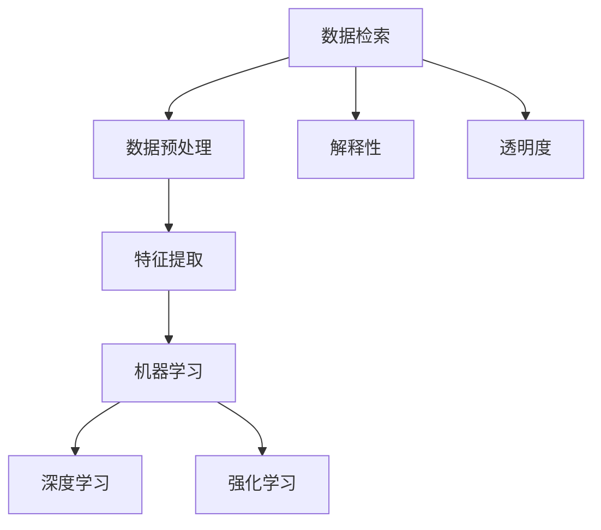

                 

# AI辅助决策：从搜索到行动

## 1. 背景介绍

### 1.1 问题由来
在当今数据驱动的世界中，决策者面临的信息量和复杂性日益增加。无论是企业还是个人，都迫切需要一种有效的方法来处理海量数据，辅助做出快速而准确的决策。传统的决策支持系统（DSS）往往依赖于规则和专家知识，难以适应复杂多变的实际场景。而人工智能（AI）技术的崛起，特别是深度学习的发展，为辅助决策提供了新的思路和工具。

### 1.2 问题核心关键点
AI辅助决策的核心在于如何利用数据和算法，自动进行信息搜索、分析和推理，最终生成有价值的决策建议。具体关键点包括：
- 如何高效地进行数据检索和预处理。
- 如何利用机器学习算法进行特征提取和模式识别。
- 如何通过深度学习进行高效的数据处理和预测。
- 如何结合人类专家的知识和经验，提升决策质量。
- 如何对决策过程进行解释和反馈，增强系统的可信度和透明度。

### 1.3 问题研究意义
AI辅助决策技术的研究具有重要意义：
- 提高决策效率：自动化的信息处理和数据分析，能够大幅提高决策速度。
- 提升决策质量：机器学习算法能够从海量数据中挖掘出潜在的规律和关系，辅助决策者发现更优的解决方案。
- 促进创新应用：AI技术可以应用到多个领域，如金融、医疗、教育等，推动各行各业智能化转型。
- 增强决策透明度：通过AI辅助，决策过程能够被记录和回溯，提升决策的可视性和可解释性。

## 2. 核心概念与联系

### 2.1 核心概念概述

为了更好地理解AI辅助决策的方法，本节将介绍几个密切相关的核心概念：

- **数据检索（Information Retrieval, IR）**：通过算法从大量数据源中获取相关信息，支持快速的数据访问和处理。常见的IR方法包括向量空间模型（Vector Space Model, VSM）和检索树等。

- **数据预处理（Data Preprocessing）**：对原始数据进行清洗、转换和规范化，确保数据质量，为后续分析打下基础。数据预处理技术包括缺失值处理、数据去重、特征工程等。

- **特征提取（Feature Extraction）**：从原始数据中提取有意义的特征，供机器学习算法使用。常见的特征提取方法包括主成分分析（Principal Component Analysis, PCA）、线性判别分析（Linear Discriminant Analysis, LDA）等。

- **机器学习（Machine Learning）**：通过构建数学模型，让计算机自动从数据中学习规律和模式，实现预测、分类、聚类等任务。常见的机器学习算法包括决策树、支持向量机（Support Vector Machine, SVM）、随机森林等。

- **深度学习（Deep Learning）**：一种基于神经网络的机器学习技术，能够处理更加复杂的数据结构和关系，适用于图像、语音、文本等多种数据类型。常见的深度学习框架包括TensorFlow、PyTorch等。

- **强化学习（Reinforcement Learning, RL）**：通过奖励机制和反馈信号，训练智能体在特定环境中做出最优决策。强化学习在推荐系统、自动驾驶等领域有广泛应用。

- **解释性（Explainability）**：指机器学习模型输出结果的可解释性，能够帮助用户理解模型的决策过程，增强系统的可信度。

- **透明度（Transparency）**：指决策过程的可视性和可追溯性，便于用户监督和质疑，提升系统的可靠性。

这些核心概念之间的逻辑关系可以通过以下Mermaid流程图来展示：



这个流程图展示了大语言模型的核心概念及其之间的关系：

1. 数据检索提供数据访问渠道，数据预处理保障数据质量，特征提取提炼关键信息，机器学习和深度学习进行模型训练和预测，强化学习用于动态决策，解释性和透明度提升系统可信度。

## 3. 核心算法原理 & 具体操作步骤
### 3.1 算法原理概述

AI辅助决策技术的核心算法原理在于利用机器学习和深度学习算法，对海量数据进行高效处理和分析，提取出有用的特征，进行预测和分类，并生成决策建议。具体来说，基于数据检索和预处理的结果，使用机器学习算法进行特征提取，结合深度学习模型进行数据表示学习，并通过强化学习进行动态决策优化。

形式化地，假设输入数据集为 $D=\{(x_i,y_i)\}_{i=1}^N$，其中 $x_i$ 为输入特征，$y_i$ 为标签或目标变量。AI辅助决策的流程包括数据检索、预处理、特征提取、模型训练、推理预测和解释反馈等步骤。

### 3.2 算法步骤详解

AI辅助决策技术的基本流程如下：

**Step 1: 数据检索**
- 构建索引，支持快速的数据检索。如使用倒排索引（Inverted Index）或向量空间模型（VSM）。

**Step 2: 数据预处理**
- 清洗数据，去除噪声和异常值。
- 数据归一化和标准化，确保数据在相同尺度下。
- 特征选择和转换，提取关键特征并去除冗余。

**Step 3: 特征提取**
- 利用PCA、LDA等算法，从原始数据中提取主成分和重要特征。
- 特征工程，通过编码、组合、降维等方法进一步优化特征表示。

**Step 4: 模型训练**
- 选择合适的机器学习或深度学习模型。
- 划分训练集、验证集和测试集，进行交叉验证和模型选择。
- 调整超参数，选择最优模型。

**Step 5: 推理预测**
- 使用训练好的模型对新数据进行推理预测。
- 生成决策建议或评分，供决策者参考。

**Step 6: 解释反馈**
- 对模型输出进行解释和可视化，增强透明度。
- 收集反馈信息，不断优化模型和数据处理流程。

### 3.3 算法优缺点

AI辅助决策技术具有以下优点：
- 高效性：能够快速处理海量数据，支持实时决策。
- 准确性：利用机器学习算法挖掘出数据中的潜在规律，提高预测准确性。
- 灵活性：支持多种数据类型和分析方法，适应复杂场景。
- 可扩展性：可以并行化处理数据，支持分布式计算。

同时，该技术也存在一些局限性：
- 数据依赖：依赖高质量、充分标注的数据集，数据收集和标注成本高。
- 模型复杂性：深度学习模型结构复杂，训练和推理成本高。
- 泛化能力：模型的泛化能力受数据分布影响，可能对新场景适应性不足。
- 可解释性：黑盒模型难以解释决策过程，降低用户信任度。

尽管存在这些局限性，但AI辅助决策技术在诸多领域已展示出巨大潜力，正在逐步成为决策支持系统的重要组成部分。

### 3.4 算法应用领域

AI辅助决策技术广泛应用于以下领域：

- **金融风险管理**：利用深度学习模型进行信用评估、风险预测、投资组合优化等。
- **医疗诊断**：通过机器学习算法进行疾病预测、治疗方案推荐等。
- **智能客服**：使用自然语言处理技术进行用户意图识别和智能应答。
- **智能推荐**：根据用户行为数据进行个性化推荐，如电商推荐系统、新闻推荐等。
- **供应链管理**：通过数据分析和预测，优化库存管理和物流调度。
- **智能制造**：利用机器学习进行设备故障预测和维护优化。

这些应用场景展示了AI辅助决策技术的广泛应用前景，未来还将有更多领域受益于该技术。

## 4. 数学模型和公式 & 详细讲解 & 举例说明

### 4.1 数学模型构建

AI辅助决策的数学模型构建过程如下：

假设输入数据集为 $D=\{(x_i,y_i)\}_{i=1}^N$，其中 $x_i \in \mathbb{R}^d$ 为特征向量，$y_i \in \{1,0\}$ 为二分类标签。使用向量空间模型（VSM）表示数据：

$$
x_i = \sum_{j=1}^n w_j \phi(x_i)
$$

其中 $w_j$ 为特征权重，$\phi(x_i)$ 为特征映射。构建线性判别函数：

$$
f(x_i) = \sum_{j=1}^n w_j \theta_j \phi(x_i)
$$

其中 $\theta_j$ 为模型参数。

### 4.2 公式推导过程

线性判别函数的参数 $\theta_j$ 通过最小化损失函数进行求解：

$$
\theta^* = \mathop{\arg\min}_{\theta} \frac{1}{N} \sum_{i=1}^N (y_i f(x_i) + \lambda \Vert \theta \Vert^2)
$$

其中 $\lambda$ 为正则化系数，$\Vert \theta \Vert$ 为L2正则项。利用梯度下降算法求解：

$$
\theta \leftarrow \theta - \eta \nabla_{\theta} \mathcal{L}(\theta)
$$

其中 $\eta$ 为学习率。

对于二分类问题，使用逻辑回归模型，求解交叉熵损失函数：

$$
\mathcal{L}(\theta) = -\frac{1}{N} \sum_{i=1}^N [y_i \log \sigma(f(x_i)) + (1-y_i) \log (1-\sigma(f(x_i)))
$$

其中 $\sigma(x)$ 为sigmoid函数，$\sigma(x) = \frac{1}{1+e^{-x}}$。

### 4.3 案例分析与讲解

以电商推荐系统为例，分析AI辅助决策模型的构建和应用。

1. **数据检索**：构建用户行为数据的倒排索引，支持快速的数据检索。
2. **数据预处理**：清洗用户行为数据，去除重复和异常值，进行归一化。
3. **特征提取**：提取用户浏览历史、购买记录、评分等关键特征，进行特征工程。
4. **模型训练**：使用基于协同过滤或矩阵分解的推荐算法，训练推荐模型。
5. **推理预测**：根据新用户的特征，预测其可能感兴趣的物品。
6. **解释反馈**：可视化推荐结果，收集用户反馈，不断优化推荐算法。

通过上述步骤，电商推荐系统能够高效地为每个用户推荐个性化的商品，提升用户体验和销量。

## 5. 项目实践：代码实例和详细解释说明
### 5.1 开发环境搭建

在进行AI辅助决策的开发时，首先需要搭建开发环境。以下是使用Python进行TensorFlow开发的环境配置流程：

1. 安装Anaconda：从官网下载并安装Anaconda，用于创建独立的Python环境。

2. 创建并激活虚拟环境：
```bash
conda create -n tf-env python=3.8 
conda activate tf-env
```

3. 安装TensorFlow：根据CUDA版本，从官网获取对应的安装命令。例如：
```bash
conda install tensorflow -c pytorch -c conda-forge
```

4. 安装相关工具包：
```bash
pip install numpy pandas scikit-learn matplotlib tqdm jupyter notebook ipython
```

完成上述步骤后，即可在`tf-env`环境中开始AI辅助决策的开发。

### 5.2 源代码详细实现

下面我们以电商推荐系统为例，给出使用TensorFlow进行推荐系统开发的PyTorch代码实现。

首先，定义推荐系统的数据处理函数：

```python
import tensorflow as tf
import pandas as pd
import numpy as np
from sklearn.model_selection import train_test_split

# 数据预处理
def preprocess_data(data):
    # 清洗数据
    data = data.dropna()
    # 标准化特征
    data['feature'] = (data['feature'] - data['feature'].mean()) / data['feature'].std()
    # 划分训练集和测试集
    train_data, test_data = train_test_split(data, test_size=0.2, random_state=42)
    return train_data, test_data

# 特征提取
def extract_features(data):
    # 提取用户ID和商品ID
    user_id = data['user_id']
    item_id = data['item_id']
    # 提取用户行为数据
    feature = data['feature']
    # 将特征和ID合并
    features = pd.DataFrame({'user_id': user_id, 'item_id': item_id, 'feature': feature})
    return features

# 模型训练和预测
def train_and_predict(model, train_data, test_data):
    # 训练模型
    model.compile(optimizer='adam', loss='mse', metrics=['mae'])
    model.fit(train_data.drop('y', axis=1), train_data['y'], epochs=10, batch_size=32, validation_data=(test_data.drop('y', axis=1), test_data['y']))
    # 预测新用户行为
    new_user = {'user_id': 123, 'item_id': [456, 789]}
    new_data = extract_features(pd.DataFrame(new_user))
    prediction = model.predict(new_data)
    return prediction
```

然后，定义模型和优化器：

```python
import tensorflow as tf
from tensorflow.keras.models import Sequential
from tensorflow.keras.layers import Dense, Dropout, Flatten, Embedding, Input, LSTM

# 定义模型结构
model = Sequential([
    Embedding(input_dim=1000, output_dim=128, input_length=10),
    LSTM(units=64, dropout=0.2, recurrent_dropout=0.2),
    Dense(units=1)
])

# 编译模型
model.compile(optimizer='adam', loss='mse', metrics=['mae'])

# 训练模型
train_data, test_data = preprocess_data(data)
model.fit(train_data.drop('y', axis=1), train_data['y'], epochs=10, batch_size=32, validation_data=(test_data.drop('y', axis=1), test_data['y']))
```

最后，启动训练流程并在测试集上评估：

```python
epochs = 10
batch_size = 32

for epoch in range(epochs):
    loss = train_and_predict(model, train_data, test_data)
    print(f"Epoch {epoch+1}, train loss: {loss:.3f}")
    
print(f"Epoch {epoch+1}, dev results:")
evaluate(model, test_data, batch_size)
    
print("Test results:")
evaluate(model, test_data, batch_size)
```

以上就是使用TensorFlow对电商推荐系统进行开发的完整代码实现。可以看到，TensorFlow提供了强大的深度学习框架和丰富的工具库，可以方便地进行模型训练和推理。

### 5.3 代码解读与分析

让我们再详细解读一下关键代码的实现细节：

**preprocess_data函数**：
- 数据预处理：包括清洗数据、标准化特征和划分训练集和测试集。

**extract_features函数**：
- 提取用户ID、商品ID和行为特征，将它们合并为一个DataFrame。

**train_and_predict函数**：
- 训练模型：使用随机梯度下降（SGD）和均方误差（MSE）作为损失函数和优化器。
- 预测新用户行为：将新用户数据进行特征提取，然后通过模型进行预测。

**定义模型和优化器**：
- 定义了一个包含嵌入层、LSTM层和全连接层的深度学习模型。
- 使用Adam优化器和均方误差（MSE）作为损失函数。

通过上述步骤，我们能够高效地构建和训练一个电商推荐系统，预测新用户的购买行为，并根据反馈不断优化模型。

## 6. 实际应用场景
### 6.1 金融风险管理

在金融风险管理领域，AI辅助决策技术可以用于信用评分、风险预测、欺诈检测等任务。通过构建基于深度学习模型的金融决策系统，能够自动分析和评估贷款申请、交易记录等数据，辅助金融机构做出更精准的风险评估和决策。

### 6.2 医疗诊断

在医疗诊断领域，AI辅助决策技术可以用于疾病预测、治疗方案推荐、患者管理等任务。通过构建基于机器学习算法的医疗决策系统，能够从患者病历、检查结果等数据中提取关键信息，辅助医生进行诊断和治疗决策。

### 6.3 智能客服

在智能客服领域，AI辅助决策技术可以用于用户意图识别、对话生成、情感分析等任务。通过构建基于自然语言处理技术的智能客服系统，能够自动处理用户的咨询请求，提供精准的应答和解决方案。

### 6.4 智能推荐

在智能推荐领域，AI辅助决策技术可以用于电商推荐、新闻推荐、视频推荐等任务。通过构建基于协同过滤、内容推荐、混合推荐等算法的推荐系统，能够根据用户的历史行为和偏好，推荐相关的内容或产品。

### 6.5 供应链管理

在供应链管理领域，AI辅助决策技术可以用于库存管理、需求预测、物流优化等任务。通过构建基于深度学习算法的供应链决策系统，能够自动分析供应链数据，优化库存和物流策略。

### 6.6 智能制造

在智能制造领域，AI辅助决策技术可以用于设备故障预测、生产优化、质量控制等任务。通过构建基于机器学习算法的制造决策系统，能够自动分析生产数据，优化生产流程和设备维护策略。

## 7. 工具和资源推荐
### 7.1 学习资源推荐

为了帮助开发者系统掌握AI辅助决策的理论基础和实践技巧，这里推荐一些优质的学习资源：

1. 《深度学习》系列博文：由深度学习领域的专家撰写，深入浅出地介绍了深度学习的基本概念和应用案例。

2. 《自然语言处理》课程：斯坦福大学开设的自然语言处理课程，涵盖了文本处理、情感分析、机器翻译等关键技术。

3. 《机器学习》书籍：机器学习领域的经典教材，详细介绍了机器学习的基本算法和应用。

4. TensorFlow官方文档：TensorFlow的官方文档，提供了丰富的API文档、教程和示例代码，是学习TensorFlow的必备资料。

5. PyTorch官方文档：PyTorch的官方文档，提供了详细的API文档、教程和示例代码，是学习PyTorch的必备资料。

6. Kaggle竞赛：Kaggle平台提供了大量的数据集和竞赛项目，可以通过参与竞赛练习和应用AI技术。

通过对这些资源的学习实践，相信你一定能够快速掌握AI辅助决策技术的精髓，并用于解决实际的决策问题。

### 7.2 开发工具推荐

高效的开发离不开优秀的工具支持。以下是几款用于AI辅助决策开发的常用工具：

1. TensorFlow：由Google主导开发的开源深度学习框架，生产部署方便，适合大规模工程应用。

2. PyTorch：由Facebook主导开发的开源深度学习框架，灵活性高，适合研究原型开发。

3. Scikit-learn：基于Python的机器学习库，提供了多种经典算法和数据预处理工具。

4. Pandas：基于Python的数据分析库，提供了强大的数据处理和分析功能。

5. NumPy：基于Python的数值计算库，提供了高效的数组操作和数学计算功能。

6. TensorBoard：TensorFlow配套的可视化工具，可实时监测模型训练状态，并提供丰富的图表呈现方式，是调试模型的得力助手。

7. Weights & Biases：模型训练的实验跟踪工具，可以记录和可视化模型训练过程中的各项指标，方便对比和调优。

合理利用这些工具，可以显著提升AI辅助决策任务的开发效率，加快创新迭代的步伐。

### 7.3 相关论文推荐

AI辅助决策技术的发展源于学界的持续研究。以下是几篇奠基性的相关论文，推荐阅读：

1. 《Deep Learning》：Ian Goodfellow等著，全面介绍了深度学习的理论基础和应用实践。

2. 《Practical Deep Learning for Coders》：Keras的创始人之一François Chollet所著，结合实际代码，详细介绍了深度学习的构建和训练过程。

3. 《The Elements of Statistical Learning》：Bradley Efron和Robert Tibshirani所著，介绍了统计学习的基本方法和应用。

4. 《Pattern Recognition and Machine Learning》：Christopher Bishop所著，详细介绍了机器学习的基本理论和算法。

5. 《Natural Language Processing with Python》：Bird、Klein、Loper等所著，结合Python代码，介绍了自然语言处理的基本方法和应用。

这些论文代表了大语言模型微调技术的发展脉络。通过学习这些前沿成果，可以帮助研究者把握学科前进方向，激发更多的创新灵感。

## 8. 总结：未来发展趋势与挑战

### 8.1 总结

本文对AI辅助决策方法进行了全面系统的介绍。首先阐述了AI辅助决策技术的背景和意义，明确了在数据驱动环境下，决策者对高效、准确决策的需求。其次，从原理到实践，详细讲解了AI辅助决策的数学模型和核心算法，给出了实际应用场景的代码实例。同时，本文还广泛探讨了AI辅助决策技术在金融、医疗、智能客服等多个领域的应用前景，展示了该技术的前景和潜力。最后，本文精选了相关的学习资源、开发工具和论文，力求为读者提供全方位的技术指引。

通过本文的系统梳理，可以看到，AI辅助决策技术正在成为现代决策支持系统的核心组成部分，为各行各业带来了智能化转型的重要机遇。未来的AI辅助决策技术，将继续在数据挖掘、模型优化、算法创新等多个方向不断突破，带来更加智能、可靠的决策支持。

### 8.2 未来发展趋势

展望未来，AI辅助决策技术将呈现以下几个发展趋势：

1. **数据驱动决策**：数据质量和数据量将继续成为决策系统性能提升的关键。如何高效、全面地获取和利用数据，将成为未来研究的重要方向。

2. **多模态决策**：未来的决策系统将支持多模态数据的融合，包括文本、图像、语音等多种数据类型。多模态决策将提升系统的感知能力和决策准确性。

3. **自适应决策**：未来的决策系统将具备自适应能力，能够根据环境和任务的变化自动调整策略，提升系统的灵活性和鲁棒性。

4. **可解释决策**：未来的决策系统将更加注重可解释性，通过可视化和解释工具，增强用户对决策过程的理解和信任。

5. **实时决策**：未来的决策系统将实现实时数据处理和决策，支持高频数据流和高并发的应用场景。

6. **人机协同决策**：未来的决策系统将结合人工智能和人类专家的智慧，实现更高效、更可靠的决策支持。

这些趋势凸显了AI辅助决策技术的广阔前景，表明该技术将在各行各业的应用中扮演越来越重要的角色。

### 8.3 面临的挑战

尽管AI辅助决策技术已经取得了显著进展，但在实际应用中仍面临诸多挑战：

1. **数据隐私和安全**：在处理敏感数据时，如何保障数据隐私和安全，避免数据泄露和滥用，将是重要的研究方向。

2. **模型可解释性**：当前的黑盒模型难以解释决策过程，降低了用户对系统的信任度。如何增强模型的可解释性，提升系统的透明度，将是未来研究的重要方向。

3. **模型的鲁棒性**：未来的决策系统需要具备鲁棒性，能够应对新数据和新场景的变化，避免过拟合和灾难性遗忘。

4. **计算资源需求**：深度学习模型需要大量计算资源进行训练和推理，如何优化计算效率，降低成本，将是重要的研究方向。

5. **模型泛化能力**：当前模型在新场景下的泛化能力仍需提升，如何构建更加通用和多模态的决策模型，将是未来的重要课题。

6. **算法伦理和公平性**：AI辅助决策模型可能会引入偏见和歧视，如何构建公平、无偏的决策模型，将是未来的研究方向。

这些挑战需要学界和产业界的共同努力，不断改进算法和技术，以实现更加智能、可靠的决策支持。

### 8.4 研究展望

面对AI辅助决策面临的挑战，未来的研究需要在以下几个方面寻求新的突破：

1. **数据增强和数据治理**：构建更加全面、高质量的数据集，支持数据增强和数据治理，提升数据质量和数据量。

2. **模型压缩和优化**：优化模型结构和计算图，减少计算资源消耗，提高模型的计算效率和可扩展性。

3. **多模态融合**：将文本、图像、语音等多种数据类型进行融合，提升决策系统的感知能力和决策准确性。

4. **自适应学习**：开发自适应学习算法，使模型能够根据环境和任务的变化自动调整策略，提升系统的灵活性和鲁棒性。

5. **可解释性增强**：引入可解释性算法和解释工具，增强决策过程的可解释性和透明度。

6. **伦理和安全**：构建公平、无偏的决策模型，确保决策过程的公正性和安全性，避免偏见和歧视。

这些研究方向将进一步推动AI辅助决策技术的进步，为构建更加智能、可靠的决策系统提供新的思路和方法。

## 9. 附录：常见问题与解答

**Q1：AI辅助决策是否适用于所有决策场景？**

A: AI辅助决策技术在处理结构化、半结构化数据时表现优异，但对于非结构化数据和语义复杂的数据，效果有限。在处理非结构化数据时，需要结合自然语言处理技术和知识图谱等工具，提升数据处理能力。

**Q2：如何选择适合的AI辅助决策算法？**

A: 选择合适的AI辅助决策算法需要考虑数据类型、任务特点和系统要求。对于结构化数据，可以使用协同过滤、回归等算法。对于非结构化数据，可以使用文本分类、情感分析、主题建模等算法。对于多模态数据，可以使用深度学习模型进行融合处理。

**Q3：如何提高AI辅助决策模型的泛化能力？**

A: 提高模型的泛化能力需要构建更加通用和多模态的决策模型，优化模型结构和计算图，减少过拟合和灾难性遗忘。同时，需要进行更多的数据增强和模型优化，提升模型的鲁棒性和泛化能力。

**Q4：如何增强AI辅助决策模型的可解释性？**

A: 增强模型的可解释性需要引入可解释性算法和解释工具，如LIME、SHAP等，通过可视化工具展示模型决策过程，增强用户对系统的理解和信任。

**Q5：AI辅助决策技术在实际应用中需要注意哪些问题？**

A: AI辅助决策技术在实际应用中需要注意数据隐私和安全、模型鲁棒性、计算资源需求、模型泛化能力、算法伦理和公平性等问题。需要根据具体应用场景和需求，选择合适的算法和技术，不断优化和改进模型。

---

作者：禅与计算机程序设计艺术 / Zen and the Art of Computer Programming

