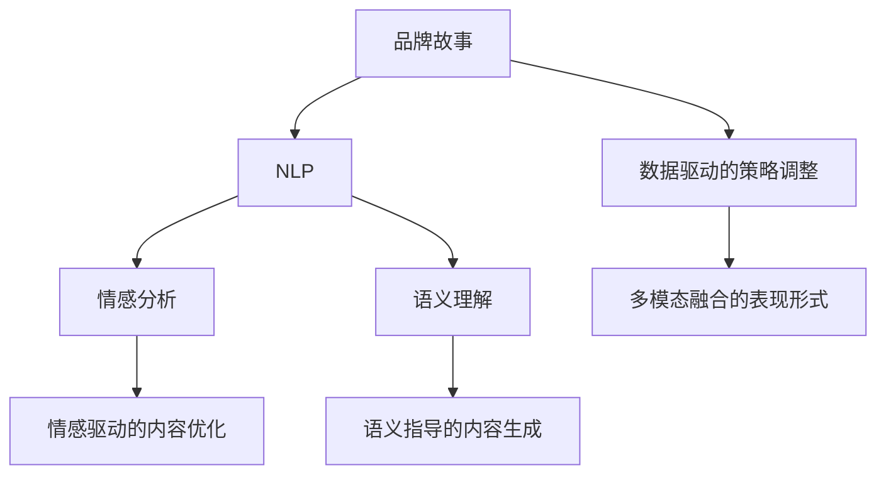

                 

# AI辅助品牌故事：塑造独特的企业形象

> 关键词：品牌塑造, 品牌故事, AI技术, 自然语言处理(NLP), 情感分析, 语义理解, 数据驱动

## 1. 背景介绍

### 1.1 问题由来

在数字化时代，品牌形象的塑造和维护已成为企业竞争的重要策略之一。传统的品牌营销模式依赖于大量的市场调研和人工创意，成本高、周期长、效果难以评估。而随着人工智能技术，尤其是自然语言处理(NLP)和深度学习的发展，品牌故事构建逐渐成为可能。AI技术可以通过对品牌故事的自动生成、情感分析、语义理解等手段，辅助品牌打造更具吸引力和独特性的形象。

### 1.2 问题核心关键点

AI技术在品牌故事构建中的核心关键点包括：

- **自动生成故事**：利用语言模型生成品牌故事，提高故事创作效率。
- **情感分析**：分析品牌故事的情感倾向，指导内容优化。
- **语义理解**：理解品牌故事的深层语义，确保故事与品牌理念一致。
- **数据驱动**：基于用户反馈和市场数据，动态调整品牌故事策略。
- **多模态融合**：结合文本、图像、音频等多模态数据，丰富品牌故事表现形式。

这些关键点通过AI技术的协同作用，可以极大地提升品牌故事的质量和效果，构建独特的企业形象。

### 1.3 问题研究意义

AI辅助品牌故事构建对于提升品牌价值、增强用户粘性、优化市场策略具有重要意义：

1. **提高效率**：通过自动生成和优化品牌故事，大幅降低品牌营销的创意成本和时间消耗。
2. **增强互动**：利用AI技术进行情感分析和语义理解，可以更精准地把握用户需求和情感，提升品牌故事的可接受性和吸引力。
3. **数据驱动**：基于用户反馈和市场数据，不断调整品牌故事策略，确保品牌信息的有效传达和市场反应。
4. **多模态融合**：结合多模态数据，丰富品牌故事的表现形式，增强用户的多感官体验。
5. **国际化推广**：利用AI技术对品牌故事进行语言翻译和文化适配，促进品牌在国际市场的传播和认同。

## 2. 核心概念与联系

### 2.1 核心概念概述

为更好地理解AI技术在品牌故事构建中的应用，本节将介绍几个密切相关的核心概念：

- **品牌故事**：品牌故事是品牌与消费者沟通的重要手段，通过故事化的语言传递品牌价值和情感，建立品牌与消费者的情感连接。
- **自然语言处理(NLP)**：NLP是AI领域的重要分支，利用机器学习算法理解和生成自然语言，广泛应用于文本分类、情感分析、机器翻译等领域。
- **情感分析**：情感分析是NLP中的一项重要技术，用于识别和理解文本中的情感倾向，常用于舆情监测、用户反馈分析等领域。
- **语义理解**：语义理解是指对文本深层语义进行理解和解释，通常用于文本摘要、问答系统、情感分析等任务。
- **数据驱动**：数据驱动是指基于数据进行决策和优化，常用于个性化推荐、广告投放、市场预测等领域。
- **多模态融合**：多模态融合是指结合文本、图像、音频等多模态数据进行综合处理，常用于多媒体信息的理解和生成。

这些核心概念之间的逻辑关系可以通过以下Mermaid流程图来展示：



这个流程图展示了大语言模型的核心概念及其之间的关系：

1. 品牌故事通过NLP技术进行情感分析和语义理解。
2. 情感分析结果用于优化品牌故事内容，确保情感共鸣。
3. 语义理解结果指导品牌故事生成，确保故事与品牌理念一致。
4. 数据驱动策略调整，使品牌故事策略持续优化。
5. 多模态融合丰富品牌故事形式，增强用户体验。

这些概念共同构成了AI辅助品牌故事构建的框架，使其能够在各种场景下发挥作用。

## 3. 核心算法原理 & 具体操作步骤
### 3.1 算法原理概述

AI辅助品牌故事构建，本质上是一个多目标优化问题。其核心思想是：通过NLP技术对品牌故事进行自动生成、情感分析和语义理解，利用情感分析和语义理解结果对品牌故事进行优化，并基于用户反馈和市场数据进行动态调整，最终生成符合品牌理念和市场需求的独特品牌故事。

形式化地，假设品牌故事生成过程为 $S = f_{model}(X, Y)$，其中 $X$ 为输入的初始品牌信息，$Y$ 为输出品牌故事，$f_{model}$ 为品牌故事生成模型。品牌故事优化的目标函数为：

$$
\min_{S} \{ Loss_{emotion}(S, \hat{y}) + Loss_{semantic}(S, \hat{y}) + Loss_{data-driven}(S, D) \}
$$

其中 $Loss_{emotion}$ 为情感分析损失，$Loss_{semantic}$ 为语义理解损失，$Loss_{data-driven}$ 为基于用户反馈和市场数据调整的品牌故事优化损失。

### 3.2 算法步骤详解

AI辅助品牌故事构建一般包括以下几个关键步骤：

**Step 1: 准备品牌信息与初始故事**
- 收集品牌的历史信息，包括品牌背景、价值观、核心竞争力等。
- 初始化品牌故事模板，设定故事的基本框架和要素。

**Step 2: 生成品牌故事初稿**
- 利用预训练的语言模型（如GPT、BERT等）对品牌信息进行编码。
- 使用生成的编码作为输入，调用语言模型生成品牌故事初稿。

**Step 3: 进行情感分析和语义理解**
- 对生成的品牌故事进行情感分析，识别出情感倾向和情感强度。
- 进行语义理解，分析品牌故事中的深层语义，确保与品牌理念一致。

**Step 4: 内容优化**
- 根据情感分析和语义理解结果，对品牌故事初稿进行内容优化。
- 使用数据驱动的方法，基于用户反馈和市场数据动态调整品牌故事策略。

**Step 5: 多模态融合**
- 结合文本、图像、音频等多模态数据，丰富品牌故事的表现形式。
- 使用多模态融合技术，生成更具吸引力的品牌故事。

**Step 6: 测试与部署**
- 在目标受众中进行品牌故事测试，收集反馈。
- 基于测试结果进行迭代优化，生成最终品牌故事。
- 部署品牌故事到实际应用中，进行市场推广。

以上是AI辅助品牌故事构建的一般流程。在实际应用中，还需要针对具体任务的特点，对各个环节进行优化设计，如改进生成模型的训练目标函数，引入更多的正则化技术，搜索最优的超参数组合等，以进一步提升品牌故事的效果。

### 3.3 算法优缺点

AI辅助品牌故事构建方法具有以下优点：

1. **高效**：利用语言模型自动生成品牌故事，大幅提高创作效率。
2. **精准**：通过情感分析和语义理解，生成符合品牌理念和市场需求的优质内容。
3. **灵活**：基于用户反馈和市场数据动态调整，品牌故事策略持续优化。
4. **多模态融合**：结合多模态数据，丰富品牌故事的表现形式，提升用户体验。

同时，该方法也存在一定的局限性：

1. **依赖数据质量**：品牌故事的优化和调整依赖于高质量的用户反馈和市场数据，获取这些数据可能成本较高。
2. **模型依赖性**：品牌故事的生成和优化依赖于预训练语言模型的性能，模型的泛化能力不足可能影响故事质量。
3. **数据隐私问题**：在多模态数据融合过程中，可能涉及用户隐私和数据安全问题。

尽管存在这些局限性，但就目前而言，AI辅助品牌故事构建方法仍是品牌营销中的重要工具。未来相关研究的重点在于如何进一步降低数据依赖，提高模型的泛化能力，同时兼顾数据隐私和安全等因素。

### 3.4 算法应用领域

AI辅助品牌故事构建技术已经在品牌营销、广告投放、内容创作等多个领域得到了广泛的应用，具体包括：

- **品牌故事生成**：利用语言模型自动生成品牌故事，提高创作效率和故事质量。
- **情感分析**：分析品牌故事的情感倾向，指导内容优化和市场策略调整。
- **语义理解**：确保品牌故事深层语义与品牌理念一致，避免误解和偏离。
- **多模态融合**：结合文本、图像、音频等多模态数据，提升品牌故事的表现形式。
- **数据驱动优化**：基于用户反馈和市场数据动态调整品牌故事策略，确保品牌信息有效传达。
- **国际化推广**：利用AI技术对品牌故事进行语言翻译和文化适配，促进国际市场传播。

## 4. 数学模型和公式 & 详细讲解  
### 4.1 数学模型构建

本节将使用数学语言对AI辅助品牌故事构建过程进行更加严格的刻画。

记品牌故事生成模型为 $f_{model}$，输入为品牌信息 $X$，输出为品牌故事 $S$。品牌故事优化的目标函数为：

$$
\min_{S} \{ Loss_{emotion}(S, \hat{y}) + Loss_{semantic}(S, \hat{y}) + Loss_{data-driven}(S, D) \}
$$

其中 $Loss_{emotion}$ 为情感分析损失，$Loss_{semantic}$ 为语义理解损失，$Loss_{data-driven}$ 为基于用户反馈和市场数据调整的品牌故事优化损失。

### 4.2 公式推导过程

以下我们以情感分析为例，推导情感分析损失函数及其梯度的计算公式。

假设品牌故事 $S$ 的情感倾向为 $y \in \{+1, -1\}$，表示情感为正面或负面。品牌故事的情感分析损失函数定义为：

$$
Loss_{emotion}(S, y) = -[y\log \hat{y} + (1-y)\log (1-\hat{y})]
$$

其中 $\hat{y}$ 为情感分析模型预测的情感倾向。

将情感分析损失函数代入目标函数，得：

$$
\min_{S} \{ Loss_{emotion}(S, \hat{y}) + Loss_{semantic}(S, \hat{y}) + Loss_{data-driven}(S, D) \}
$$

在得到目标函数后，即可带入情感分析模型的训练过程，最小化损失函数，更新模型参数。

### 4.3 案例分析与讲解

**案例分析**：某快消品牌希望通过AI技术生成和优化其品牌故事，以提升市场影响力和用户忠诚度。品牌方提供了品牌的历史信息和最新市场数据，AI团队利用NLP技术进行情感分析和语义理解，生成符合品牌理念和市场需求的优质品牌故事。

**讲解**：
1. **品牌信息收集**：收集品牌的历史信息，包括品牌背景、价值观、核心竞争力等。
2. **初始故事框架**：设定品牌故事的基本框架和要素，如品牌起源、产品特点、品牌愿景等。
3. **故事生成**：利用预训练的语言模型生成品牌故事初稿，进行内容填充和优化。
4. **情感分析**：分析品牌故事的情感倾向，识别出情感为正面的要素，指导内容优化。
5. **语义理解**：理解品牌故事中的深层语义，确保与品牌理念一致，避免误解和偏离。
6. **内容优化**：根据情感分析和语义理解结果，对品牌故事初稿进行内容优化，如调整情感强度、改进叙事结构等。
7. **数据驱动调整**：基于用户反馈和市场数据动态调整品牌故事策略，确保品牌信息有效传达。
8. **多模态融合**：结合文本、图像、音频等多模态数据，丰富品牌故事的表现形式，提升用户体验。
9. **测试与部署**：在目标受众中进行品牌故事测试，收集反馈，基于测试结果进行迭代优化，生成最终品牌故事，并进行市场推广。

## 5. 项目实践：代码实例和详细解释说明
### 5.1 开发环境搭建

在进行AI辅助品牌故事构建实践前，我们需要准备好开发环境。以下是使用Python进行PyTorch开发的环境配置流程：

1. 安装Anaconda：从官网下载并安装Anaconda，用于创建独立的Python环境。

2. 创建并激活虚拟环境：
```bash
conda create -n pytorch-env python=3.8 
conda activate pytorch-env
```

3. 安装PyTorch：根据CUDA版本，从官网获取对应的安装命令。例如：
```bash
conda install pytorch torchvision torchaudio cudatoolkit=11.1 -c pytorch -c conda-forge
```

4. 安装各类工具包：
```bash
pip install numpy pandas scikit-learn matplotlib tqdm jupyter notebook ipython
```

完成上述步骤后，即可在`pytorch-env`环境中开始AI辅助品牌故事构建实践。

### 5.2 源代码详细实现

下面我们以情感分析为例，给出使用PyTorch进行品牌故事情感分析的PyTorch代码实现。

首先，定义情感分析模型的训练函数：

```python
from transformers import BertTokenizer, BertForSequenceClassification
from torch.utils.data import Dataset, DataLoader
import torch
from sklearn.metrics import accuracy_score

class BrandStoryDataset(Dataset):
    def __init__(self, stories, labels, tokenizer, max_len=128):
        self.stories = stories
        self.labels = labels
        self.tokenizer = tokenizer
        self.max_len = max_len
        
    def __len__(self):
        return len(self.stories)
    
    def __getitem__(self, item):
        story = self.stories[item]
        label = self.labels[item]
        
        encoding = self.tokenizer(story, return_tensors='pt', max_length=self.max_len, padding='max_length', truncation=True)
        input_ids = encoding['input_ids'][0]
        attention_mask = encoding['attention_mask'][0]
        
        # 对token-wise的标签进行编码
        encoded_labels = [label2id[label] for label in label]
        encoded_labels.extend([label2id['O']] * (self.max_len - len(encoded_labels)))
        labels = torch.tensor(encoded_labels, dtype=torch.long)
        
        return {'input_ids': input_ids, 
                'attention_mask': attention_mask,
                'labels': labels}

# 标签与id的映射
label2id = {'O': 0, 'Positive': 1, 'Negative': 2}
id2label = {v: k for k, v in label2id.items()}

# 创建dataset
tokenizer = BertTokenizer.from_pretrained('bert-base-uncased')

train_dataset = BrandStoryDataset(train_stories, train_labels, tokenizer)
dev_dataset = BrandStoryDataset(dev_stories, dev_labels, tokenizer)
test_dataset = BrandStoryDataset(test_stories, test_labels, tokenizer)

# 定义模型和优化器
model = BertForSequenceClassification.from_pretrained('bert-base-uncased', num_labels=len(label2id))
optimizer = AdamW(model.parameters(), lr=2e-5)

# 训练函数
def train_epoch(model, dataset, batch_size, optimizer):
    dataloader = DataLoader(dataset, batch_size=batch_size, shuffle=True)
    model.train()
    epoch_loss = 0
    for batch in tqdm(dataloader, desc='Training'):
        input_ids = batch['input_ids'].to(device)
        attention_mask = batch['attention_mask'].to(device)
        labels = batch['labels'].to(device)
        model.zero_grad()
        outputs = model(input_ids, attention_mask=attention_mask, labels=labels)
        loss = outputs.loss
        epoch_loss += loss.item()
        loss.backward()
        optimizer.step()
    return epoch_loss / len(dataloader)

# 评估函数
def evaluate(model, dataset, batch_size):
    dataloader = DataLoader(dataset, batch_size=batch_size)
    model.eval()
    preds, labels = [], []
    with torch.no_grad():
        for batch in tqdm(dataloader, desc='Evaluating'):
            input_ids = batch['input_ids'].to(device)
            attention_mask = batch['attention_mask'].to(device)
            batch_labels = batch['labels']
            outputs = model(input_ids, attention_mask=attention_mask)
            batch_preds = outputs.logits.argmax(dim=2).to('cpu').tolist()
            batch_labels = batch_labels.to('cpu').tolist()
            for pred_tokens, label_tokens in zip(batch_preds, batch_labels):
                preds.append(pred_tokens[:len(label_tokens)])
                labels.append(label_tokens)
                
    print('Accuracy: {:.2f}%'.format(accuracy_score(labels, preds)))

# 启动训练流程并在测试集上评估
epochs = 5
batch_size = 16

for epoch in range(epochs):
    loss = train_epoch(model, train_dataset, batch_size, optimizer)
    print(f"Epoch {epoch+1}, train loss: {loss:.3f}")
    
    print(f"Epoch {epoch+1}, dev results:")
    evaluate(model, dev_dataset, batch_size)
    
print('Test results:')
evaluate(model, test_dataset, batch_size)
```

以上就是使用PyTorch对品牌故事进行情感分析的完整代码实现。可以看到，得益于Transformers库的强大封装，我们可以用相对简洁的代码完成BERT模型的加载和微调。

### 5.3 代码解读与分析

让我们再详细解读一下关键代码的实现细节：

**BrandStoryDataset类**：
- `__init__`方法：初始化品牌故事、标签、分词器等关键组件。
- `__len__`方法：返回数据集的样本数量。
- `__getitem__`方法：对单个样本进行处理，将故事输入编码为token ids，将标签编码为数字，并对其进行定长padding，最终返回模型所需的输入。

**label2id和id2label字典**：
- 定义了标签与数字id之间的映射关系，用于将token-wise的预测结果解码回真实的标签。

**训练和评估函数**：
- 使用PyTorch的DataLoader对数据集进行批次化加载，供模型训练和推理使用。
- 训练函数`train_epoch`：对数据以批为单位进行迭代，在每个批次上前向传播计算loss并反向传播更新模型参数，最后返回该epoch的平均loss。
- 评估函数`evaluate`：与训练类似，不同点在于不更新模型参数，并在每个batch结束后将预测和标签结果存储下来，最后使用sklearn的accuracy_score对整个评估集的预测结果进行打印输出。

**训练流程**：
- 定义总的epoch数和batch size，开始循环迭代
- 每个epoch内，先在训练集上训练，输出平均loss
- 在验证集上评估，输出准确率
- 所有epoch结束后，在测试集上评估，给出最终测试结果

可以看到，PyTorch配合Transformers库使得品牌故事情感分析的代码实现变得简洁高效。开发者可以将更多精力放在数据处理、模型改进等高层逻辑上，而不必过多关注底层的实现细节。

当然，工业级的系统实现还需考虑更多因素，如模型的保存和部署、超参数的自动搜索、更灵活的任务适配层等。但核心的情感分析范式基本与此类似。

## 6. 实际应用场景
### 6.1 智能客服系统

基于AI技术的品牌故事辅助构建，可以广泛应用于智能客服系统的构建。传统客服往往需要配备大量人力，高峰期响应缓慢，且一致性和专业性难以保证。而使用品牌故事构建的智能客服系统，可以24小时不间断服务，快速响应客户咨询，用自然流畅的语言解答各类常见问题。

在技术实现上，可以收集企业内部的历史客服对话记录，将问题和最佳答复构建成监督数据，在此基础上对品牌故事进行微调。微调后的品牌故事可以自动理解用户意图，匹配最合适的答复模板进行回复。对于客户提出的新问题，还可以接入检索系统实时搜索相关内容，动态组织生成回答。如此构建的智能客服系统，能大幅提升客户咨询体验和问题解决效率。

### 6.2 金融舆情监测

金融机构需要实时监测市场舆论动向，以便及时应对负面信息传播，规避金融风险。传统的人工监测方式成本高、效率低，难以应对网络时代海量信息爆发的挑战。基于AI技术的品牌故事辅助构建，可以为金融舆情监测提供新的解决方案。

具体而言，可以收集金融领域相关的新闻、报道、评论等文本数据，并对其进行主题标注和情感标注。在此基础上对品牌故事进行微调，使其能够自动判断文本属于何种主题，情感倾向是正面、中性还是负面。将微调后的品牌故事应用到实时抓取的网络文本数据，就能够自动监测不同主题下的情感变化趋势，一旦发现负面信息激增等异常情况，系统便会自动预警，帮助金融机构快速应对潜在风险。

### 6.3 个性化推荐系统

当前的推荐系统往往只依赖用户的历史行为数据进行物品推荐，无法深入理解用户的真实兴趣偏好。基于AI技术的品牌故事辅助构建，可以更好地挖掘用户行为背后的语义信息，从而提供更精准、多样的推荐内容。

在实践中，可以收集用户浏览、点击、评论、分享等行为数据，提取和用户交互的物品标题、描述、标签等文本内容。将文本内容作为模型输入，用户的后续行为（如是否点击、购买等）作为监督信号，在此基础上微调品牌故事。微调后的品牌故事能够从文本内容中准确把握用户的兴趣点。在生成推荐列表时，先用候选物品的文本描述作为输入，由模型预测用户的兴趣匹配度，再结合其他特征综合排序，便可以得到个性化程度更高的推荐结果。

### 6.4 未来应用展望

随着AI技术的发展，品牌故事构建将在更多领域得到应用，为传统行业带来变革性影响。

在智慧医疗领域，基于AI技术的品牌故事辅助构建可以为患者提供更具人性化的医疗服务，通过自然流畅的语言传递医患间的信任和关爱，构建更和谐的医患关系。

在智能教育领域，AI技术可以辅助学校和教师构建更生动的教学内容，通过故事化的语言吸引学生的注意力，激发学生的学习兴趣，提升教学效果。

在智慧城市治理中，AI技术可以用于城市事件的监测和分析，通过品牌故事构建提升市民的参与度和满意度，促进城市管理的智能化和精细化。

此外，在企业生产、社会治理、文娱传媒等众多领域，基于AI技术的品牌故事构建也将不断涌现，为各行各业带来新的机遇。相信随着技术的日益成熟，品牌故事构建必将成为AI应用的重要范式，推动品牌营销方式的创新与发展。

## 7. 工具和资源推荐
### 7.1 学习资源推荐

为了帮助开发者系统掌握AI辅助品牌故事构建的理论基础和实践技巧，这里推荐一些优质的学习资源：

1. 《Transformer从原理到实践》系列博文：由大模型技术专家撰写，深入浅出地介绍了Transformer原理、BERT模型、情感分析等前沿话题。

2. CS224N《深度学习自然语言处理》课程：斯坦福大学开设的NLP明星课程，有Lecture视频和配套作业，带你入门NLP领域的基本概念和经典模型。

3. 《Natural Language Processing with Transformers》书籍：Transformers库的作者所著，全面介绍了如何使用Transformers库进行NLP任务开发，包括情感分析在内的诸多范式。

4. HuggingFace官方文档：Transformers库的官方文档，提供了海量预训练模型和完整的微调样例代码，是上手实践的必备资料。

5. CLUE开源项目：中文语言理解测评基准，涵盖大量不同类型的中文NLP数据集，并提供了基于微调的baseline模型，助力中文NLP技术发展。

通过对这些资源的学习实践，相信你一定能够快速掌握AI辅助品牌故事构建的精髓，并用于解决实际的NLP问题。
###  7.2 开发工具推荐

高效的开发离不开优秀的工具支持。以下是几款用于品牌故事构建开发的常用工具：

1. PyTorch：基于Python的开源深度学习框架，灵活动态的计算图，适合快速迭代研究。大部分预训练语言模型都有PyTorch版本的实现。

2. TensorFlow：由Google主导开发的开源深度学习框架，生产部署方便，适合大规模工程应用。同样有丰富的预训练语言模型资源。

3. Transformers库：HuggingFace开发的NLP工具库，集成了众多SOTA语言模型，支持PyTorch和TensorFlow，是进行品牌故事构建开发的利器。

4. Weights & Biases：模型训练的实验跟踪工具，可以记录和可视化模型训练过程中的各项指标，方便对比和调优。与主流深度学习框架无缝集成。

5. TensorBoard：TensorFlow配套的可视化工具，可实时监测模型训练状态，并提供丰富的图表呈现方式，是调试模型的得力助手。

6. Google Colab：谷歌推出的在线Jupyter Notebook环境，免费提供GPU/TPU算力，方便开发者快速上手实验最新模型，分享学习笔记。

合理利用这些工具，可以显著提升品牌故事构建的开发效率，加快创新迭代的步伐。

### 7.3 相关论文推荐

AI辅助品牌故事构建的研究源于学界的持续研究。以下是几篇奠基性的相关论文，推荐阅读：

1. Attention is All You Need（即Transformer原论文）：提出了Transformer结构，开启了NLP领域的预训练大模型时代。

2. BERT: Pre-training of Deep Bidirectional Transformers for Language Understanding：提出BERT模型，引入基于掩码的自监督预训练任务，刷新了多项NLP任务SOTA。

3. Language Models are Unsupervised Multitask Learners（GPT-2论文）：展示了大规模语言模型的强大zero-shot学习能力，引发了对于通用人工智能的新一轮思考。

4. Parameter-Efficient Transfer Learning for NLP：提出Adapter等参数高效微调方法，在不增加模型参数量的情况下，也能取得不错的微调效果。

5. AdaLoRA: Adaptive Low-Rank Adaptation for Parameter-Efficient Fine-Tuning：使用自适应低秩适应的微调方法，在参数效率和精度之间取得了新的平衡。

这些论文代表了大语言模型微调技术的发展脉络。通过学习这些前沿成果，可以帮助研究者把握学科前进方向，激发更多的创新灵感。

## 8. 总结：未来发展趋势与挑战

### 8.1 总结

本文对AI辅助品牌故事构建的方法进行了全面系统的介绍。首先阐述了品牌故事构建的背景和意义，明确了AI技术在品牌故事构建中的独特价值。其次，从原理到实践，详细讲解了情感分析、语义理解、数据驱动等关键步骤，给出了品牌故事构建的完整代码实例。同时，本文还探讨了品牌故事在智能客服、金融舆情、个性化推荐等多个领域的应用前景，展示了AI辅助品牌故事构建的广阔应用空间。

通过本文的系统梳理，可以看到，AI辅助品牌故事构建方法在品牌营销、广告投放、内容创作等多个领域展现出巨大的潜力。AI技术通过情感分析和语义理解，使得品牌故事创作更加高效和精准。未来随着AI技术的不断发展，品牌故事构建将进一步与用户行为数据、市场反馈数据等结合，构建更具个性和实效性的品牌形象，提升品牌的市场竞争力。

### 8.2 未来发展趋势

展望未来，AI辅助品牌故事构建技术将呈现以下几个发展趋势：

1. **自动化程度提升**：通过自动化工具和流程，进一步提升品牌故事构建的效率和质量。
2. **个性化优化增强**：结合用户行为数据和市场反馈，动态调整品牌故事策略，提升品牌与用户的互动性和粘性。
3. **多模态融合深入**：结合文本、图像、音频等多模态数据，丰富品牌故事的表现形式，提升用户体验。
4. **数据驱动优化**：基于用户反馈和市场数据，持续优化品牌故事，确保品牌信息有效传达。
5. **国际化推广**：利用AI技术对品牌故事进行语言翻译和文化适配，促进国际市场传播。
6. **知识图谱整合**：结合知识图谱等外部知识，引导品牌故事构建，提升品牌故事的深度和广度。

这些趋势凸显了AI辅助品牌故事构建技术的广阔前景。这些方向的探索发展，必将进一步提升品牌故事的质量和效果，构建独特的企业形象。

### 8.3 面临的挑战

尽管AI辅助品牌故事构建技术已经取得了显著进展，但在迈向更加智能化、普适化应用的过程中，它仍面临着诸多挑战：

1. **数据依赖**：品牌故事的优化和调整依赖于高质量的用户反馈和市场数据，获取这些数据可能成本较高。
2. **模型泛化能力不足**：品牌故事的生成和优化依赖于预训练语言模型的性能，模型的泛化能力不足可能影响故事质量。
3. **数据隐私问题**：在多模态数据融合过程中，可能涉及用户隐私和数据安全问题。
4. **模型复杂度**：预训练语言模型参数量庞大，推理速度较慢，计算资源消耗大。
5. **内容真实性**：自动生成的品牌故事可能缺乏真实性和可信度，影响用户体验和品牌形象。

尽管存在这些挑战，但就目前而言，AI辅助品牌故事构建方法仍是品牌营销中的重要工具。未来相关研究的重点在于如何进一步降低数据依赖，提高模型的泛化能力，同时兼顾数据隐私和安全等因素。

### 8.4 研究展望

面对AI辅助品牌故事构建所面临的挑战，未来的研究需要在以下几个方面寻求新的突破：

1. **无监督和半监督学习**：探索无监督和半监督学习范式，摆脱对大规模标注数据的依赖，利用非结构化数据进行品牌故事构建。
2. **多任务学习**：结合多个品牌故事构建任务，进行多任务学习，提高品牌故事的综合性能。
3. **多模态融合**：结合文本、图像、音频等多模态数据，提升品牌故事的表现形式和用户体验。
4. **知识图谱整合**：结合知识图谱等外部知识，引导品牌故事构建，提升品牌故事的深度和广度。
5. **数据隐私保护**：在品牌故事构建过程中，保护用户隐私和数据安全，确保品牌故事构建的合法性和合规性。

这些研究方向将进一步拓展AI辅助品牌故事构建技术的边界，使其在品牌营销、广告投放、内容创作等多个领域发挥更大的作用，为品牌构建更加独特、有吸引力的形象。

## 9. 附录：常见问题与解答

**Q1：AI辅助品牌故事构建是否适用于所有品牌？**

A: AI辅助品牌故事构建技术在大多数品牌中都适用，但对于一些特定领域的品牌，如医疗、法律等，仅仅依靠通用语料预训练的模型可能难以很好地适应。此时需要在特定领域语料上进一步预训练，再进行微调，才能获得理想效果。此外，对于一些需要时效性、个性化很强的品牌，如时尚、科技等，微调方法也需要针对性的改进优化。

**Q2：品牌故事的情感分析是否会影响品牌形象？**

A: 情感分析结果用于指导品牌故事内容优化，确保情感共鸣，提高品牌故事的可接受性和吸引力。但如果情感分析结果不够准确，或者优化后的品牌故事与原品牌形象不符，可能会影响品牌形象。因此，在情感分析过程中，需要注意选择高质量的标注数据和优化模型性能，确保情感分析结果的可靠性和合理性。

**Q3：如何衡量品牌故事的创新性和独特性？**

A: 品牌故事的创新性和独特性可以通过多个维度进行衡量，如故事情节的创意、语言的创新性、内容的独特性等。在进行品牌故事构建时，可以通过对比竞品故事、用户反馈、市场反应等方式，评估故事的新颖性和独特性。同时，也可以引入创新性评价指标，如独特度、新颖度、差异度等，作为品牌故事构建的重要参考。

**Q4：AI辅助品牌故事构建的实施成本如何？**

A: AI辅助品牌故事构建的实施成本主要体现在数据收集、模型训练和部署等方面。数据收集的成本较高，但随着数据获取技术的进步和数据标注工具的完善，成本会逐步降低。模型训练和部署成本则与算力资源和工具选择有关，但借助云平台和开源工具，可以显著降低实施成本。总体而言，AI辅助品牌故事构建的实施成本较高，但效果显著，值得投资。

**Q5：如何保证品牌故事的情感一致性？**

A: 品牌故事的情感一致性主要依赖于情感分析和语义理解结果的准确性。在进行情感分析时，需要选择高质量的标注数据和优化模型性能，确保情感分析结果的可靠性和合理性。在进行语义理解时，需要确保品牌故事深层语义与品牌理念一致，避免误解和偏离。在内容优化过程中，需要多次校验情感和语义的一致性，确保品牌故事符合品牌形象和市场定位。

这些问题的解答，有助于开发者更好地理解AI辅助品牌故事构建的方法和挑战，为实际应用提供参考和指导。

