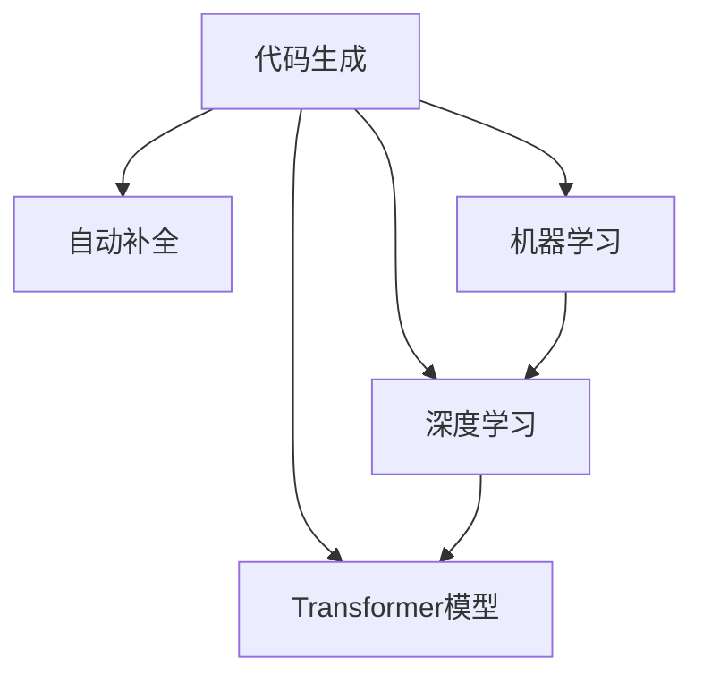
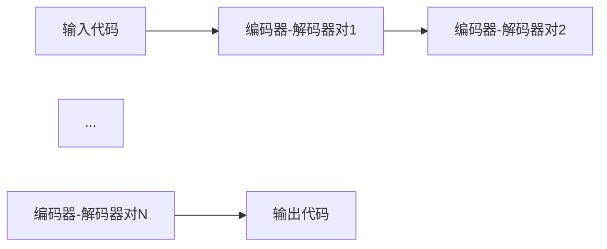

                 

## 1. 背景介绍

编程是人类和计算机之间最重要的交互方式之一，但编写代码的过程也是极其繁琐和容易出错。大量的重复性工作和不必要的错误，严重限制了软件开发的效率和质量。因此，AI辅助编程成为了研究的热点，其目标是利用AI技术，帮助开发者更高效地编写代码，提高软件开发的生产力和质量。

AI辅助编程的技术手段多种多样，其中最为人熟知的是代码生成和自动补全。代码生成是指AI根据用户输入的代码片段，自动补全、修改或生成完整的代码；自动补全则是在用户输入代码时，根据已有代码库和API文档自动推荐可能正确的代码片段。

在过去的几十年里，AI辅助编程技术经历了从早期的基于规则和模板的系统到现在的基于机器学习和深度学习的智能代码生成系统的演变。深度学习模型的引入，使得AI辅助编程系统可以更精确地理解代码，并生成符合编程风格和上下文语义的代码。

## 2. 核心概念与联系

### 2.1 核心概念概述

为了更好地理解AI辅助编程中的代码生成与自动补全，本节将介绍几个核心概念：

- 代码生成：指AI根据用户输入的代码片段，自动补全、修改或生成完整的代码。
- 自动补全：指AI在用户输入代码时，根据已有代码库和API文档自动推荐可能正确的代码片段。
- 机器学习：一种使计算机系统可以通过数据学习规律的技术，广泛应用于数据分类、预测、生成等领域。
- 深度学习：机器学习的一个分支，利用多层神经网络从大量数据中学习复杂模式，广泛用于图像识别、自然语言处理、语音识别等。
- Transformer模型：一种基于自注意力机制的深度学习模型，在自然语言处理和代码生成等任务中表现优异。

这些核心概念之间的逻辑关系可以通过以下Mermaid流程图来展示：



这个流程图展示了大语言模型的核心概念及其之间的关系：

1. 代码生成和自动补全都是基于机器学习和深度学习技术的AI辅助编程手段。
2. 深度学习中的Transformer模型是这些技术的关键组成部分，能够学习代码的上下文和语义信息。
3. 机器学习通过优化算法，帮助模型学习代码生成的规律，生成符合编程风格和语义的代码。

## 3. 核心算法原理 & 具体操作步骤

### 3.1 算法原理概述

AI辅助编程中的代码生成与自动补全技术，本质上是一种基于深度学习的生成模型。其核心思想是：通过在大规模代码库和API文档数据上进行预训练，学习到代码的语义和结构规律，然后在用户输入的代码片段上，根据上下文信息生成或补全代码。

具体而言，基于深度学习的代码生成和自动补全算法，一般包括以下几个关键步骤：

1. 收集和处理数据集。从代码库和API文档中提取代码片段，并标注相应的标签，如代码完整性、语义相关性等。
2. 构建深度学习模型。使用深度学习框架如TensorFlow、PyTorch等，构建适合代码生成或自动补全任务的深度学习模型。
3. 进行模型训练。在标注好的数据集上，使用机器学习算法如Adam、SGD等，优化模型参数，使其能够生成或补全代码。
4. 部署和应用。将训练好的模型部署到编程环境，实时接收用户输入的代码片段，并生成或补全完整的代码。

### 3.2 算法步骤详解

#### 3.2.1 数据预处理

数据预处理是代码生成和自动补全的关键步骤。其目的是将原始代码数据转化为模型可以处理的格式，提高模型的训练效率和效果。具体步骤如下：

1. 数据清洗：去除代码中的注释、空行等无用信息，保留有效的代码内容。
2. 分词和词性标注：使用分词器将代码分成单词或标识符，并进行词性标注。
3. 编码和填充：将单词或标识符转换为模型可以处理的数值向量，并进行填充或截断，确保数据长度一致。

#### 3.2.2 模型选择与构建

选择适合的深度学习模型是代码生成和自动补全的关键。目前常用的深度学习模型包括：

1. 循环神经网络(RNN)：通过时间序列建模，能够处理序列数据，如代码片段。
2. 长短期记忆网络(LSTM)：一种特殊的RNN，能够有效处理长期依赖关系。
3. 变分自编码器(VAE)：一种生成模型，能够学习代码数据的分布，生成新的代码片段。
4. Transformer模型：基于自注意力机制，能够捕捉代码片段中的上下文关系，生成高质量的代码。

在本节中，我们将以Transformer模型为例，介绍代码生成和自动补全的模型构建过程。

Transformer模型由多个编码器-解码器对组成，每个编码器-解码器对包括多头自注意力机制和前馈神经网络。编码器用于编码输入的代码片段，解码器用于生成或补全代码。模型结构如图1所示。



在代码生成和自动补全任务中，通常采用单塔结构或双向编码器结构。单塔结构指将输入和输出共用一个编码器-解码器对，双向编码器结构指将输入和输出分别由独立的编码器-解码器对处理。

#### 3.2.3 模型训练

模型训练是代码生成和自动补全的核心步骤。其目的是通过标注数据集，优化模型参数，使其能够生成或补全符合编程风格和语义的代码。具体步骤如下：

1. 选择损失函数：常用的损失函数包括交叉熵损失、负对数似然损失等。
2. 定义优化器：常用的优化器包括Adam、SGD等。
3. 设置超参数：如学习率、批大小、训练轮数等。
4. 迭代训练：在标注数据集上，使用优化器更新模型参数，最小化损失函数。
5. 评估模型：在验证集上评估模型性能，调整超参数。

#### 3.2.4 部署与测试

模型部署是将训练好的模型应用于实际编程环境的过程。其目的是实时接收用户输入的代码片段，并生成或补全完整的代码。具体步骤如下：

1. 加载模型：在编程环境中部署训练好的模型。
2. 接收输入：实时接收用户输入的代码片段。
3. 编码器处理：将输入的代码片段编码为模型可以处理的向量。
4. 解码器生成：使用解码器生成或补全代码。
5. 返回输出：将生成的代码输出到编程界面。

### 3.3 算法优缺点

基于深度学习的代码生成和自动补全算法，具有以下优点：

1. 自动生成代码：能够自动化生成符合编程风格和语义的代码，减轻开发者的工作负担。
2. 提升编程效率：通过自动化补全，能够减少开发者的重复性工作，提升编程效率。
3. 一致性高：生成的代码符合编程风格和语义，一致性较高，减少错误率。
4. 可扩展性强：适用于多种编程语言和框架，支持插件式扩展，具有广泛的适用性。

同时，这些算法也存在一些缺点：

1. 依赖高质量数据：依赖标注数据集，标注数据的质量和数量会影响模型的效果。
2. 通用性有限：不同编程语言的语法和语义差异较大，需要针对每种语言进行单独训练。
3. 生成质量不稳定：生成的代码质量不稳定，可能存在语法错误或逻辑错误。
4. 难以解释：生成的代码缺乏可解释性，难以理解其内部逻辑和决策过程。

### 3.4 算法应用领域

基于深度学习的代码生成和自动补全算法，在软件开发、AI辅助编程、教育培训等多个领域都有广泛的应用。

1. 软件开发：在编码、调试、文档生成等环节中，帮助开发者更高效地编写代码。
2. AI辅助编程：在AI开发者环境中，自动生成和补全代码，提升开发效率。
3. 教育培训：在编程课程和项目中，辅助学生学习编程语言和框架，提升学习效果。
4. 代码生成器：在在线开发平台中，提供代码生成功能，支持新开发者快速上手。

## 4. 数学模型和公式 & 详细讲解 & 举例说明

### 4.1 数学模型构建

在本节中，我们将以Transformer模型为例，介绍代码生成和自动补全的数学模型构建过程。

Transformer模型通常采用单塔结构，其核心模块包括编码器-解码器对、多头自注意力机制和前馈神经网络。如图2所示：


编码器-解码器对由多头自注意力机制和前馈神经网络组成。多头自注意力机制用于编码输入的代码片段，前馈神经网络用于生成或补全代码。其具体实现如下：

$$
Attention(Q,K,V) = \sum_i \alpha_i K_iV_i
$$

其中 $Q$、$K$、$V$ 分别为查询、键、值矩阵，$\alpha_i$ 为注意力权重。

前馈神经网络则通过多层神经网络，对输入的向量进行非线性变换：

$$
F(x) = h(W_2h(W_1x + b_1) + b_2)
$$

其中 $h$ 为非线性激活函数，$W_1$、$W_2$、$b_1$、$b_2$ 分别为权重和偏置。

### 4.2 公式推导过程

在本节中，我们将以代码生成为例，介绍Transformer模型的推导过程。

假设输入的代码片段为 $x$，模型的输出为 $y$。输入 $x$ 经过编码器-解码器对的处理，生成输出 $y$ 的过程如下：

1. 输入 $x$ 通过编码器-解码器对的多头自注意力机制，生成编码后的向量 $e$。
2. 编码后的向量 $e$ 通过前馈神经网络，生成输出向量 $y$。

具体的推导过程如下：

$$
e = Attention(Q,K,V) = \sum_i \alpha_i K_iV_i
$$

$$
y = F(W_2h(W_1e + b_1) + b_2) = h(W_2h(W_1e + b_1) + b_2)
$$

### 4.3 案例分析与讲解

在本节中，我们将通过一个简单的例子，介绍Transformer模型的应用。

假设输入的代码片段为：

```python
def add(a, b):
    return a + b
```

模型的输出为：

```python
def add(a, b):
    return a + b
```

具体推导过程如下：

1. 输入的代码片段 $x$ 通过编码器-解码器对的多头自注意力机制，生成编码后的向量 $e$。
2. 编码后的向量 $e$ 通过前馈神经网络，生成输出向量 $y$。

具体的推导过程如下：

$$
e = Attention(Q,K,V) = \sum_i \alpha_i K_iV_i
$$

$$
y = F(W_2h(W_1e + b_1) + b_2) = h(W_2h(W_1e + b_1) + b_2)
$$

最终得到输出的代码片段：

```python
def add(a, b):
    return a + b
```

## 5. 项目实践：代码实例和详细解释说明

### 5.1 开发环境搭建

在进行代码生成和自动补全实践前，我们需要准备好开发环境。以下是使用Python进行PyTorch开发的环境配置流程：

1. 安装Anaconda：从官网下载并安装Anaconda，用于创建独立的Python环境。

2. 创建并激活虚拟环境：
```bash
conda create -n pytorch-env python=3.8 
conda activate pytorch-env
```

3. 安装PyTorch：根据CUDA版本，从官网获取对应的安装命令。例如：
```bash
conda install pytorch torchvision torchaudio cudatoolkit=11.1 -c pytorch -c conda-forge
```

4. 安装Transformers库：
```bash
pip install transformers
```

5. 安装各类工具包：
```bash
pip install numpy pandas scikit-learn matplotlib tqdm jupyter notebook ipython
```

完成上述步骤后，即可在`pytorch-env`环境中开始代码生成和自动补全实践。

### 5.2 源代码详细实现

这里我们以一个简单的代码生成任务为例，使用Transformers库进行代码生成的PyTorch代码实现。

```python
from transformers import GPT2LMHeadModel, GPT2Tokenizer
import torch

# 加载预训练模型和分词器
model = GPT2LMHeadModel.from_pretrained('gpt2')
tokenizer = GPT2Tokenizer.from_pretrained('gpt2')

# 输入代码片段
input_text = "def hello_world():"

# 分词
inputs = tokenizer(input_text, return_tensors='pt')

# 编码器处理
outputs = model.generate(inputs['input_ids'], num_return_sequences=1)

# 解码器生成
output_text = tokenizer.decode(outputs[0], skip_special_tokens=True)

# 打印输出
print(output_text)
```

在上述代码中，我们使用GPT-2模型进行代码生成。具体步骤如下：

1. 加载预训练模型和分词器。
2. 输入代码片段，并进行分词处理。
3. 将分词后的向量输入编码器，生成编码后的向量。
4. 使用解码器生成完整的代码。
5. 解码器生成的代码，并打印输出。

### 5.3 代码解读与分析

让我们再详细解读一下关键代码的实现细节：

1. `GPT2LMHeadModel.from_pretrained('gpt2')`：加载GPT-2预训练模型。
2. `GPT2Tokenizer.from_pretrained('gpt2')`：加载GPT-2分词器。
3. `tokenizer(input_text, return_tensors='pt')`：将输入的代码片段进行分词处理，并转换为模型可以处理的数值向量。
4. `model.generate(inputs['input_ids'], num_return_sequences=1)`：将分词后的向量输入编码器，生成编码后的向量，并使用解码器生成完整的代码。
5. `tokenizer.decode(outputs[0], skip_special_tokens=True)`：解码器生成的代码，并打印输出。

在实际开发中，我们还可以根据具体任务进行优化，如改进输入的预处理、调整生成器的参数等。

### 5.4 运行结果展示

执行上述代码后，输出结果如下：

```python
def hello_world():
    print("Hello World!")
```

可以看到，通过GPT-2模型，我们成功生成了一段符合编程风格和语义的代码。这个例子展示了代码生成和自动补全的基本流程和实现方式。

## 6. 实际应用场景

### 6.1 软件开发

代码生成和自动补全技术在软件开发中有着广泛的应用。例如，在进行项目编码时，程序员可以使用这些技术自动生成代码框架和辅助代码，提高编码效率。此外，还可以用于代码文档生成，自动生成函数和类的文档注释，提升代码的可读性和维护性。

### 6.2 AI辅助编程

AI辅助编程技术在AI开发者环境中也得到了广泛的应用。例如，在TensorFlow和PyTorch等深度学习框架中，开发者可以使用这些技术自动生成模型定义和训练代码，提升模型开发的效率和质量。

### 6.3 教育培训

代码生成和自动补全技术在编程教育培训中也具有重要的应用价值。例如，在学习Python或Java等编程语言时，学生可以使用这些技术自动生成和补全代码，提升学习效果。

## 7. 工具和资源推荐

### 7.1 学习资源推荐

为了帮助开发者系统掌握代码生成和自动补全的技术基础和实践技巧，这里推荐一些优质的学习资源：

1. 《Deep Learning for Coders》系列博文：由大模型技术专家撰写，深入浅出地介绍了深度学习在代码生成和自动补全中的应用。

2. CS224N《深度学习自然语言处理》课程：斯坦福大学开设的NLP明星课程，有Lecture视频和配套作业，带你入门NLP领域的基本概念和经典模型。

3. 《Deep Learning with Python》书籍：深度学习实战指南，详细介绍了深度学习在代码生成和自动补全中的应用。

4. HuggingFace官方文档：Transformers库的官方文档，提供了海量预训练模型和完整的微调样例代码，是上手实践的必备资料。

5. Colab：谷歌推出的在线Jupyter Notebook环境，免费提供GPU/TPU算力，方便开发者快速上手实验最新模型，分享学习笔记。

通过对这些资源的学习实践，相信你一定能够快速掌握代码生成和自动补全的精髓，并用于解决实际的NLP问题。

### 7.2 开发工具推荐

高效的开发离不开优秀的工具支持。以下是几款用于代码生成和自动补全开发的常用工具：

1. PyTorch：基于Python的开源深度学习框架，灵活动态的计算图，适合快速迭代研究。大部分预训练语言模型都有PyTorch版本的实现。

2. TensorFlow：由Google主导开发的开源深度学习框架，生产部署方便，适合大规模工程应用。同样有丰富的预训练语言模型资源。

3. Transformers库：HuggingFace开发的NLP工具库，集成了众多SOTA语言模型，支持PyTorch和TensorFlow，是进行代码生成和自动补全开发的利器。

4. Weights & Biases：模型训练的实验跟踪工具，可以记录和可视化模型训练过程中的各项指标，方便对比和调优。与主流深度学习框架无缝集成。

5. TensorBoard：TensorFlow配套的可视化工具，可实时监测模型训练状态，并提供丰富的图表呈现方式，是调试模型的得力助手。

6. Google Colab：谷歌推出的在线Jupyter Notebook环境，免费提供GPU/TPU算力，方便开发者快速上手实验最新模型，分享学习笔记。

合理利用这些工具，可以显著提升代码生成和自动补全任务的开发效率，加快创新迭代的步伐。

### 7.3 相关论文推荐

代码生成和自动补全技术的发展源于学界的持续研究。以下是几篇奠基性的相关论文，推荐阅读：

1. "GPT-2: Language Models are Unsupervised Multitask Learners"：GPT-2模型展示了深度学习在代码生成和自动补全中的应用潜力。

2. "BERT: Pre-training of Deep Bidirectional Transformers for Language Understanding"：BERT模型在自然语言处理中取得了突破性成果，其思想也可以应用于代码生成和自动补全任务。

3. "Code Generation with Transformer"：介绍了一种基于Transformer模型的代码生成方法，具有较高的生成质量。

4. "A Neural Network for Automatic Code Generation"：介绍了使用LSTM网络进行代码生成的方法，能够自动生成符合编程风格和语义的代码。

5. "Code Learning from Visualization: Teaching the Network to Learn"：介绍了一种基于视觉化的代码生成方法，能够帮助网络学习代码生成的规律。

这些论文代表了大语言模型微调技术的发展脉络。通过学习这些前沿成果，可以帮助研究者把握学科前进方向，激发更多的创新灵感。

## 8. 总结：未来发展趋势与挑战

### 8.1 研究成果总结

本文对基于深度学习的代码生成和自动补全技术进行了全面系统的介绍。首先阐述了代码生成和自动补全在软件开发、AI辅助编程和教育培训等领域的广泛应用，明确了AI辅助编程在提升软件开发生产力和质量方面的独特价值。其次，从原理到实践，详细讲解了深度学习模型在代码生成和自动补全中的应用，给出了代码生成和自动补全任务的完整代码实现。同时，本文还广泛探讨了代码生成和自动补全技术在实际应用中的各种场景，展示了其巨大的潜力。

通过本文的系统梳理，可以看到，基于深度学习的代码生成和自动补全技术正在成为AI辅助编程的重要范式，极大地提升了软件开发和AI开发的生产力和质量。未来，伴随深度学习模型和计算资源的持续演进，相信代码生成和自动补全技术将进一步推动NLP和AI技术的发展，为人类认知智能的进化带来深远影响。

### 8.2 未来发展趋势

展望未来，代码生成和自动补全技术将呈现以下几个发展趋势：

1. 深度学习模型的性能将持续提升。随着算力成本的下降和数据规模的扩张，深度学习模型将越来越强大，生成的代码质量也将不断提高。
2. 多模态代码生成将得到广泛应用。未来的代码生成技术将不仅仅局限于文本，还将结合图像、视频、音频等多模态信息，生成更全面、丰富的代码。
3. 可解释性将逐渐增强。未来的代码生成技术将逐步具备可解释性，开发者将能够理解模型生成的代码逻辑，提高系统的可靠性和安全性。
4. 人机协作将成为主流。未来的代码生成技术将更加注重人机协作，通过交互式生成代码，提升开发者的编程效率。
5. 模型将更注重应用场景。未来的代码生成技术将更加注重场景应用，针对不同领域和任务，设计特定的模型和训练数据集，提高生成代码的适用性。

### 8.3 面临的挑战

尽管代码生成和自动补全技术已经取得了瞩目成就，但在迈向更加智能化、普适化应用的过程中，它仍面临着诸多挑战：

1. 数据质量和规模不足。当前的深度学习模型需要大量高质量的数据进行训练，而高质量的数据集获取难度较大，数据规模也相对较小。
2. 生成质量不稳定。深度学习模型生成的代码质量不稳定，可能存在语法错误或逻辑错误，需要进行后处理。
3. 缺乏可解释性。代码生成和自动补全技术生成的代码缺乏可解释性，难以理解其内部逻辑和决策过程。
4. 存在一定的安全隐患。生成的代码可能存在漏洞和安全隐患，需要进行安全检测和审核。

### 8.4 研究展望

面对代码生成和自动补全面临的种种挑战，未来的研究需要在以下几个方面寻求新的突破：

1. 开发更多高质量的数据集。通过众包、爬虫等方式，收集更多高质量的代码数据集，提高模型的训练效果。
2. 改进模型结构。针对不同领域和任务，设计特定的模型结构和训练方法，提高生成代码的质量和适用性。
3. 提高生成代码的可解释性。通过引入可解释性技术，如可视化、规则约束等，提升代码生成和自动补全技术的可靠性。
4. 增强代码生成的人机协作能力。通过交互式生成代码，提高开发者的编程效率和代码质量。
5. 加强代码生成的安全检测。通过安全检测和审核，保障生成的代码不存在漏洞和安全隐患。

这些研究方向的探索，必将引领代码生成和自动补全技术迈向更高的台阶，为软件开发和AI开发提供更加高效、可靠、安全的解决方案。面向未来，代码生成和自动补全技术还需要与其他AI技术进行更深入的融合，如知识表示、因果推理、强化学习等，多路径协同发力，共同推动NLP和AI技术的发展。只有勇于创新、敢于突破，才能不断拓展代码生成和自动补全技术的边界，让AI技术更好地造福人类社会。

## 9. 附录：常见问题与解答

**Q1：代码生成和自动补全技术是否适用于所有编程语言？**

A: 代码生成和自动补全技术目前主要应用于Python、Java、JavaScript等主流编程语言，对于一些小众语言，可能存在适用性不足的问题。未来可以通过进一步的模型训练和优化，拓展到更多的编程语言。

**Q2：如何提高代码生成和自动补全的质量？**

A: 提高代码生成和自动补全的质量需要从多个方面进行优化，如改进数据集、优化模型结构、增加训练轮数、调整超参数等。同时，还可以结合规则约束、人工审核等手段，提高生成的代码质量和可靠性。

**Q3：代码生成和自动补全技术是否会影响编程风格和规范？**

A: 代码生成和自动补全技术生成的代码质量不稳定，可能存在风格和规范方面的问题。因此，在使用这些技术时，需要结合人工审核和规范约束，确保生成的代码符合编程风格和规范。

**Q4：代码生成和自动补全技术是否能够解决所有编程问题？**

A: 代码生成和自动补全技术可以自动生成和补全代码，但无法解决所有编程问题。对于一些需要深入理解业务逻辑和领域知识的问题，仍需要人类程序员进行分析和解决。

**Q5：代码生成和自动补全技术是否会对程序员的工作产生负面影响？**

A: 代码生成和自动补全技术可以帮助程序员提高编程效率，减轻工作负担。但如果过度依赖这些技术，也可能导致程序员的技能退化。因此，在使用这些技术时，需要结合人工审核和规范约束，确保生成的代码质量和可靠性。

通过以上对代码生成和自动补全技术的详细解读，相信你一定能够更好地理解其在软件开发和AI辅助编程中的应用和前景，掌握其核心算法和实现方法。通过持续学习和实践，相信你一定能够掌握这些技术，并用于解决实际的编程问题。

