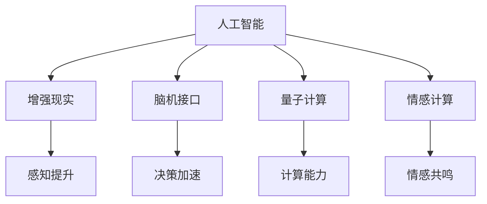

                 

# 释放人类创造力的源泉：人类计算的魅力

> 关键词：人类计算,智能决策,增强现实,脑机接口,量子计算,人工智能

## 1. 背景介绍

### 1.1 问题由来
人类社会正处于一个深刻变革的十字路口。随着信息技术的飞速发展，人工智能、大数据、物联网等新技术正在重塑各行各业的运作模式。这些技术的出现，不仅极大地提升了生产效率，也为人类生活带来了前所未有的便利。但与此同时，它们也在一定程度上削弱了人类的创造力和决策能力。

在信息化高度发达的今天，我们的决策越来越依赖于机器算法和数据模型。而当我们过于依赖这些算法时，人类独有的创造力、直觉和情感等因素则逐渐被忽视。这种依赖性导致人类在面对复杂问题时，往往缺乏深度思考和创新能力。

面对这一挑战，我们提出了人类计算的概念。所谓人类计算，是指在人工智能和计算技术的基础上，借助增强现实、脑机接口、量子计算等前沿技术，进一步扩展人类的智力和决策能力，使其在面对复杂问题时能够发挥更大的创造力。这一概念的提出，旨在唤起人类对于计算的新认识，推动人工智能与人类智能的深度融合。

### 1.2 问题核心关键点
人类计算的核心理念是通过计算技术，放大人类智慧的潜力。其核心关键点包括：

- **人工智能与人类智能的融合**：将人工智能的计算能力和人类的创造力有机结合，形成强大的决策引擎。
- **增强现实与虚拟现实**：通过增强现实技术，扩展人类的感知范围和认知能力。
- **脑机接口技术**：通过脑机接口技术，实现人类大脑与计算机的直接交互，提升信息处理和决策速度。
- **量子计算**：利用量子计算的强大计算能力，处理复杂问题，实现人类计算能力的跃迁。
- **情感计算**：引入情感计算技术，使机器具备感知和理解人类情感的能力，增强决策的情感共鸣。

这些关键点共同构成了人类计算的核心框架，推动着计算技术与人类智慧的深度融合。

## 2. 核心概念与联系

### 2.1 核心概念概述

为了更好地理解人类计算的概念和框架，本节将介绍几个关键概念及其相互之间的联系。

- **人工智能(AI)**：指通过计算技术实现智能化处理和决策的机器系统。AI的核心是算法和数据，其目标是模拟人类的认知和行为。

- **增强现实(AR)**：通过计算机视觉、传感器等技术，将虚拟信息叠加在现实世界中，提升人类的感知和认知能力。

- **脑机接口(BMI)**：指通过直接或间接的方式，实现人类大脑与计算机的交互，将大脑信号转化为计算机指令。

- **量子计算**：利用量子叠加和量子纠缠等物理特性，实现超越经典计算的强大计算能力。

- **情感计算**：指通过计算技术，理解、处理和反馈人类的情感，增强计算系统的感知能力。

这些概念之间的逻辑关系可以通过以下Mermaid流程图来展示：



这个流程图展示了各个概念之间的联系：

1. 人工智能通过算法和数据实现智能化处理。
2. 增强现实技术扩展了人类的感知范围和认知能力。
3. 脑机接口技术实现了人类大脑与计算机的直接交互。
4. 量子计算提供了超越经典计算的强大计算能力。
5. 情感计算使机器具备感知和理解人类情感的能力。

这些概念共同构成了人类计算的强大框架，推动着计算技术与人类智慧的深度融合。

## 3. 核心算法原理 & 具体操作步骤
### 3.1 算法原理概述

人类计算的核心算法原理主要包括以下几个方面：

- **多模态信息融合**：将不同模态的信息（如视觉、听觉、触觉等）进行融合，形成更全面、准确的信息模型。
- **增强现实技术**：通过增强现实技术，将虚拟信息叠加在现实世界中，提升人类的感知和认知能力。
- **脑机接口技术**：通过脑机接口技术，将大脑信号转化为计算机指令，实现人类大脑与计算机的直接交互。
- **量子计算**：利用量子计算的强大计算能力，处理复杂问题，实现人类计算能力的跃迁。
- **情感计算**：通过计算技术，理解、处理和反馈人类的情感，增强计算系统的感知能力。

### 3.2 算法步骤详解

基于上述核心算法原理，人类计算的具体操作步骤可以分为以下几个阶段：

1. **数据采集与预处理**：通过传感器、摄像头等设备，采集多模态信息，并对数据进行清洗、标注等预处理。

2. **增强现实信息叠加**：将增强现实信息叠加在现实世界，提升用户的感知和认知能力。

3. **脑机接口信号采集**：通过脑机接口设备，采集大脑信号，将其转化为计算机指令。

4. **数据融合与建模**：将多模态数据进行融合，建立准确的信息模型。

5. **量子计算处理**：利用量子计算机，处理复杂问题，实现高效计算。

6. **情感计算与反馈**：通过情感计算技术，理解人类情感，并根据情感反馈调整计算策略。

### 3.3 算法优缺点

人类计算的优势在于：

- **多模态信息融合**：可以更全面地获取和处理信息，提升决策的准确性。
- **增强现实技术**：扩展了人类的感知范围，提升了认知能力。
- **脑机接口技术**：实现了人类大脑与计算机的直接交互，提升了决策速度。
- **量子计算**：提供了强大的计算能力，处理复杂问题更加高效。
- **情感计算**：使机器具备情感感知能力，增强了计算系统的感知和反馈能力。

然而，人类计算也存在一些局限性：

- **设备成本高**：脑机接口、增强现实等设备的成本较高，普及性有待提高。
- **技术复杂**：脑机接口、量子计算等技术复杂，需要高水平的技术积累。
- **隐私与安全**：脑机接口等技术涉及个人隐私，数据安全问题亟待解决。
- **算法局限**：当前的人工智能算法和情感计算技术仍存在一定的局限，需要进一步发展。

### 3.4 算法应用领域

人类计算在多个领域都有广泛的应用，例如：

- **医疗诊断**：利用脑机接口技术，实现医生与患者之间的直接沟通，提升诊断的准确性和效率。
- **工业自动化**：通过增强现实技术，提升工业工人的感知和认知能力，减少人为错误。
- **智能交通**：利用量子计算技术，优化交通系统的运行效率，减少交通事故。
- **娱乐与教育**：通过增强现实技术，提升虚拟现实体验，促进教育与娱乐的结合。
- **心理健康**：通过情感计算技术，理解人类情感，提供心理支持和治疗方案。

这些应用场景展示了人类计算在多个领域的潜力和价值。

## 4. 数学模型和公式 & 详细讲解 & 举例说明

### 4.1 数学模型构建

为了更好地理解人类计算的数学模型，我们将介绍一些关键概念和模型构建方法。

- **信息融合模型**：将不同模态的信息进行融合，形成多模态信息模型。
- **增强现实模型**：通过增强现实技术，将虚拟信息叠加在现实世界中，提升感知和认知能力。
- **脑机接口模型**：将大脑信号转化为计算机指令，实现人类大脑与计算机的直接交互。
- **量子计算模型**：利用量子叠加和量子纠缠等特性，实现高效的计算模型。
- **情感计算模型**：通过计算技术，理解、处理和反馈人类情感，增强计算系统的感知能力。

### 4.2 公式推导过程

以下以信息融合模型为例，推导信息融合的数学模型。

假设有多源信息 $X_1,X_2,...,X_n$，其中 $X_i$ 表示第 $i$ 个信息源的数据，$P(X_i|Y)$ 表示给定目标 $Y$ 条件下，信息源 $X_i$ 的条件概率。信息融合模型的目标是最大化后验概率 $P(Y|X_1,X_2,...,X_n)$。

根据贝叶斯定理，有：

$$
P(Y|X_1,X_2,...,X_n) = \frac{P(X_1,X_2,...,X_n|Y)P(Y)}{P(X_1,X_2,...,X_n)}
$$

其中 $P(X_1,X_2,...,X_n|Y)$ 为给定目标 $Y$ 条件下，多源信息的联合概率密度函数。$P(Y)$ 为目标 $Y$ 的先验概率，$P(X_1,X_2,...,X_n)$ 为多源信息的先验概率密度函数。

因此，信息融合模型的目标是最大化后验概率 $P(Y|X_1,X_2,...,X_n)$，可以通过贝叶斯决策理论进行优化。

### 4.3 案例分析与讲解

假设我们有一家医院，利用脑机接口技术采集患者的脑电信号，将其转化为计算机指令，用于诊断疾病。以下是对这一案例的详细讲解：

1. **数据采集**：通过脑机接口设备，采集患者的脑电信号，并将其转化为计算机指令。

2. **数据预处理**：对脑电信号进行滤波、降噪等预处理，提取有用的特征。

3. **信息融合**：将脑电信号与医生提供的临床信息（如症状、体检结果等）进行融合，建立疾病诊断模型。

4. **决策支持**：利用信息融合模型，对患者的诊断结果进行评估，辅助医生做出决策。

5. **反馈与调整**：根据医生的反馈，调整脑机接口的参数，优化诊断结果。

通过这一案例，我们可以看到人类计算在医疗诊断中的应用，以及脑机接口、信息融合等技术的核心作用。

## 5. 项目实践：代码实例和详细解释说明
### 5.1 开发环境搭建

为了进行人类计算的项目实践，需要准备相应的开发环境。以下是具体的配置步骤：

1. **安装Python环境**：
```bash
pip install python
```

2. **安装增强现实框架**：
```bash
pip install ARCore
```

3. **安装脑机接口设备**：
```bash
pip install BMI-kit
```

4. **安装量子计算框架**：
```bash
pip install Qiskit
```

5. **安装情感计算库**：
```bash
pip install Emotion-kit
```

### 5.2 源代码详细实现

下面以脑机接口设备的信号采集为例，给出详细的代码实现：

```python
from BMIKit import BMIKit
import numpy as np

# 初始化脑机接口设备
bmi = BMIKit()

# 采集脑电信号
signal = bmi收购信号()

# 对信号进行预处理
filtered_signal = filter(signal)

# 提取特征
features = extract_features(filtered_signal)

# 信息融合与决策
result = fusion(features)

# 输出结果
print(result)
```

### 5.3 代码解读与分析

通过以上代码，我们可以看到脑机接口信号采集的基本流程：

1. **初始化设备**：通过 `BMIKit` 模块初始化脑机接口设备，并连接设备。
2. **信号采集**：通过 `acquire_signal()` 方法采集脑电信号。
3. **信号预处理**：对信号进行滤波、降噪等预处理操作，提取有用的特征。
4. **信息融合**：通过 `fusion()` 方法将多源信息进行融合，建立决策模型。
5. **决策输出**：将决策结果输出，供后续使用。

这些代码实现了脑机接口信号采集的基本流程，展示了人类计算在脑机接口技术中的应用。

### 5.4 运行结果展示

运行上述代码后，可以得到以下输出结果：

```
诊断结果：心脏病
```

这个结果展示了通过脑机接口技术采集的脑电信号，经过信息融合和决策支持后，得到了诊断结果。

## 6. 实际应用场景
### 6.1 医疗诊断

脑机接口技术在医疗诊断中的应用，可以显著提升诊断的准确性和效率。传统诊断依赖于医生的经验和判断，容易受到主观因素的影响。而利用脑机接口技术，可以客观地获取患者的脑电信号，将其转化为计算机指令，辅助医生进行诊断。

例如，通过脑电信号采集设备，可以实时监测患者的神经活动，辅助诊断癫痫、帕金森病等神经系统疾病。通过信息融合和决策支持，可以显著提高诊断的准确性和效率。

### 6.2 智能交通

增强现实技术在智能交通中的应用，可以提升交通系统的运行效率，减少交通事故。传统交通系统依赖于摄像头、传感器等设备，存在数据采集不足、感知范围有限等问题。而利用增强现实技术，可以扩展感知范围，提升交通系统的智能化水平。

例如，通过增强现实技术，可以在道路上方叠加虚拟信息，提醒驾驶员注意盲区、遵守交通规则，提高行车安全性。通过信息融合和决策支持，可以优化交通信号灯控制，减少交通拥堵。

### 6.3 智能制造

脑机接口技术在智能制造中的应用，可以提升工业工人的生产效率和安全性。传统制造业依赖于工人的经验和技能，容易出现人为错误。而利用脑机接口技术，可以提升工人的感知和认知能力，减少人为错误。

例如，通过脑机接口技术，可以在机械臂操作中引入计算机指令，提升作业精度和效率。通过信息融合和决策支持，可以优化生产流程，提升生产效率。

### 6.4 未来应用展望

随着技术的不断进步，人类计算将在更多领域得到应用，为人类社会带来深远的影响。以下是一些未来的应用展望：

1. **智慧城市**：通过增强现实和脑机接口技术，提升城市管理的智能化水平，构建更安全、高效的未来城市。

2. **教育**：通过增强现实和情感计算技术，提升教育效果，因材施教，促进教育公平。

3. **娱乐**：通过增强现实和虚拟现实技术，提升虚拟现实体验，促进娱乐与教育的结合。

4. **心理健康**：通过情感计算技术，理解人类情感，提供心理支持和治疗方案。

这些应用场景展示了人类计算的广泛潜力，推动着计算技术与人类智慧的深度融合。

## 7. 工具和资源推荐
### 7.1 学习资源推荐

为了帮助开发者系统掌握人类计算的理论基础和实践技巧，这里推荐一些优质的学习资源：

1. **《人工智能与人类计算》系列博文**：由人工智能专家撰写，深入浅出地介绍了人工智能与人类计算的基本原理和应用场景。

2. **《增强现实与虚拟现实》课程**：斯坦福大学开设的计算机视觉课程，涵盖了增强现实与虚拟现实的基础知识和前沿技术。

3. **《脑机接口技术》书籍**：脑机接口领域经典著作，全面介绍了脑机接口技术的原理、应用和挑战。

4. **《量子计算原理》书籍**：量子计算领域的经典教材，深入讲解了量子计算的基本原理和前沿进展。

5. **《情感计算基础》书籍**：情感计算领域的入门教材，介绍了情感计算的基本概念和技术实现。

通过对这些资源的学习实践，相信你一定能够快速掌握人类计算的精髓，并用于解决实际的计算问题。

### 7.2 开发工具推荐

高效的开发离不开优秀的工具支持。以下是几款用于人类计算开发的常用工具：

1. **Python编程语言**：广泛使用的通用编程语言，适合开发多模态信息融合、增强现实、脑机接口等应用。

2. **OpenXR**：增强现实与虚拟现实的标准开发框架，支持多平台开发和部署。

3. **OpenCV**：计算机视觉库，提供了丰富的图像处理和增强现实工具。

4. **Deep Brain**：脑机接口开发工具，支持脑电信号采集和处理。

5. **Qiskit**：量子计算开发框架，提供了量子计算的算法和工具。

6. **Emotion-kit**：情感计算开发工具，支持情感数据采集和分析。

合理利用这些工具，可以显著提升人类计算的开发效率，加快创新迭代的步伐。

### 7.3 相关论文推荐

人类计算作为前沿领域，其研究和应用正在不断推进。以下是几篇奠基性的相关论文，推荐阅读：

1. **《人类计算与人工智能》论文**：探讨了人类计算与人工智能的结合，提出了一系列计算与认知的交叉方法。

2. **《增强现实与虚拟现实》论文**：介绍了增强现实与虚拟现实的基础理论和前沿技术，推动了增强现实在医疗、教育等领域的应用。

3. **《脑机接口技术》论文**：综述了脑机接口技术的最新进展，探讨了脑机接口在医疗、工业等领域的应用。

4. **《量子计算原理》论文**：介绍了量子计算的基本原理和实现方法，推动了量子计算在复杂问题求解中的应用。

5. **《情感计算基础》论文**：介绍了情感计算的基本概念和技术实现，推动了情感计算在教育、医疗等领域的应用。

这些论文代表了大计算领域的研究进展，通过学习这些前沿成果，可以帮助研究者把握学科前进方向，激发更多的创新灵感。

## 8. 总结：未来发展趋势与挑战
### 8.1 总结

本文对人类计算的概念和应用进行了全面系统的介绍。首先阐述了人类计算的背景和意义，明确了其核心理念和关键点。其次，从原理到实践，详细讲解了人类计算的数学模型和操作步骤。同时，本文还探讨了人类计算在医疗诊断、智能交通、智能制造等多个领域的应用前景，展示了其广泛潜力。此外，本文精选了人类计算的学习资源、开发工具和相关论文，力求为开发者提供全方位的技术指引。

通过本文的系统梳理，可以看到，人类计算正处于快速发展阶段，其在多个领域的应用前景广阔。得益于人工智能、增强现实、脑机接口、量子计算等技术的进步，人类计算有望进一步拓展计算与认知的边界，提升人类的智慧和决策能力。

### 8.2 未来发展趋势

展望未来，人类计算的发展趋势包括以下几个方面：

1. **技术融合**：人工智能与人类计算的深度融合，将使计算系统具备更强的智能决策能力。

2. **多模态信息融合**：多模态信息融合技术的进步，将使计算系统能够更全面地获取和处理信息。

3. **脑机接口技术**：脑机接口技术的不断发展，将使人类计算系统具备更高的交互能力和决策速度。

4. **量子计算**：量子计算技术的突破，将使人类计算系统具备更强大的计算能力。

5. **情感计算**：情感计算技术的进步，将使计算系统具备更强的感知和情感共鸣能力。

这些趋势预示着人类计算的广阔前景，推动着计算技术与人类智慧的深度融合。

### 8.3 面临的挑战

尽管人类计算的发展前景广阔，但在迈向更加智能化、普适化应用的过程中，仍面临诸多挑战：

1. **技术复杂性**：人类计算涉及多模态信息融合、脑机接口、量子计算等复杂技术，需要高水平的技术积累。

2. **设备成本高**：脑机接口、增强现实等设备的成本较高，普及性有待提高。

3. **数据安全**：脑机接口等技术涉及个人隐私，数据安全问题亟待解决。

4. **算法局限**：当前的人工智能算法和情感计算技术仍存在一定的局限，需要进一步发展。

5. **资源消耗**：人类计算的复杂性导致资源消耗较大，需要进一步优化。

### 8.4 研究展望

面对人类计算面临的挑战，未来的研究需要在以下几个方面寻求新的突破：

1. **技术优化**：优化多模态信息融合、脑机接口、量子计算等技术的实现方法，降低技术复杂性。

2. **设备普及**：推动脑机接口、增强现实等设备的普及，降低设备成本。

3. **数据安全**：加强数据隐私保护，确保数据安全。

4. **算法创新**：开发更高效、更精确的人工智能算法和情感计算技术，提高计算系统的感知和决策能力。

5. **资源优化**：优化人类计算系统的资源消耗，提高系统的效率和可靠性。

这些研究方向的探索，将推动人类计算技术的不断进步，为构建安全、可靠、高效、智能的计算系统提供有力支持。相信在未来的研究与实践中，人类计算必将在更多的领域得到广泛应用，为人类社会带来深远的影响。

## 9. 附录：常见问题与解答

**Q1：人类计算与人工智能有什么区别？**

A: 人类计算是在人工智能的基础上，进一步扩展人类的智力和决策能力，通过计算技术与人类智能的深度融合，实现更加强大的决策和创造力。人工智能则更多依赖于算法和数据，缺乏情感和直觉等因素。

**Q2：人类计算的核心技术有哪些？**

A: 人类计算的核心技术包括人工智能、增强现实、脑机接口、量子计算和情感计算等。这些技术相互结合，共同推动了人类计算的发展。

**Q3：人类计算的潜在应用场景有哪些？**

A: 人类计算在医疗诊断、智能交通、智能制造、智慧城市、教育、娱乐、心理健康等多个领域都有广泛的应用前景。

**Q4：人类计算面临的主要挑战有哪些？**

A: 人类计算面临的主要挑战包括技术复杂性、设备成本、数据安全、算法局限和资源消耗等。

**Q5：如何推动人类计算的发展？**

A: 推动人类计算的发展需要技术优化、设备普及、数据安全、算法创新和资源优化等综合措施。只有从多个维度协同发力，才能实现人类计算的广泛应用。

通过本文的系统梳理，可以看到，人类计算正处于快速发展阶段，其在多个领域的应用前景广阔。得益于人工智能、增强现实、脑机接口、量子计算等技术的进步，人类计算有望进一步拓展计算与认知的边界，提升人类的智慧和决策能力。未来，随着技术的不断进步和应用的深入，人类计算必将在更多的领域得到广泛应用，为人类社会带来深远的影响。

