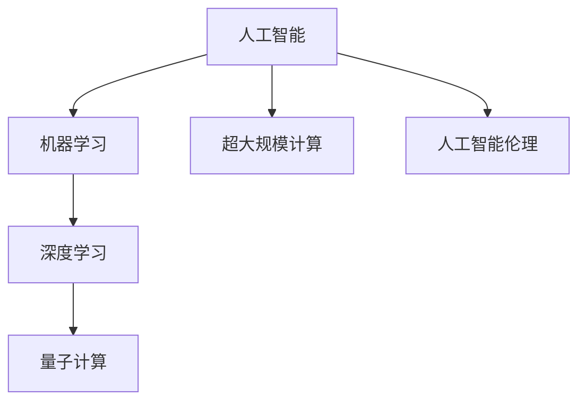

                 

# 释放人类潜力的无限可能：人类计算的目标

> 关键词：计算，人工智能，量子计算，深度学习，超大规模计算，未来科技

## 1. 背景介绍

### 1.1 问题由来

计算技术的快速发展，已经彻底改变了人类社会的运作方式。从早期的机械计数器、电子计算机，到现今的人工智能与量子计算，每一步都大大扩展了人类处理信息的能力，提升了社会的整体生产力。特别是在近年来，人工智能（AI）技术的飞跃，使得计算不再仅是物质生产的助推器，更是人类潜能的挖掘器。

在人工智能的时代，人类的认知能力与计算能力获得了前所未有的结合。机器学习算法通过庞大的数据集进行训练，可以识别模式、学习知识，并在此基础上生成预测、优化决策，甚至进行创造性的工作。这种智能机器的兴起，为人类提供了前所未有的可能性。

同时，计算技术的边界也正被不断拓展。量子计算作为一种新的计算范式，以颠覆性的速度处理信息，它不仅有望解决传统计算无法解决的复杂问题，也将开启全新的计算能力维度。超大规模计算的出现，如高性能数据中心、分布式计算系统，则进一步加速了数据处理和计算能力的飞跃，催生了大数据、云计算等新技术，推动了各种应用领域的快速发展。

### 1.2 问题核心关键点

在当前的技术背景下，人类计算的目标可以归结为以下几个核心关键点：

1. **效率最大化**：如何通过计算技术，最大程度地提高社会生产效率，实现资源的最优配置。
2. **知识挖掘与创造**：如何让机器通过计算，从海量数据中挖掘出知识，并通过创造性算法，生成新的信息与解决方案。
3. **智能决策支持**：如何借助计算，辅助人类进行更加精准、高效的决策。
4. **隐私与安全**：如何在数据计算与信息处理过程中，保障用户隐私与数据安全。
5. **伦理与社会影响**：如何确保计算技术的道德伦理底线，使之服务于人类社会的全面发展。

这些关键点构成了当前人类计算研究与应用的重点，也是未来技术发展的方向。

## 2. 核心概念与联系

### 2.1 核心概念概述

在探讨人类计算目标的过程中，我们需要关注几个核心概念：

- **人工智能（AI）**：使计算机能够模拟人类智能行为的科学和技术。
- **机器学习（ML）**：一种使计算机能够通过数据学习、自我改进的算法。
- **深度学习（DL）**：一种特殊的机器学习算法，使用多层次的神经网络来解析和学习数据。
- **量子计算**：利用量子力学的原理，实现高效并行的计算过程。
- **超大规模计算**：涉及海量数据的处理和分析，如分布式计算、云计算等。
- **人工智能伦理**：关于AI技术应用中的道德与法律问题，包括隐私保护、算法公平性、责任归属等。

这些概念相互联系，共同构成了当前计算技术的研究与应用框架。

### 2.2 核心概念原理和架构的 Mermaid 流程图



这个流程图展示了人工智能、机器学习、深度学习、量子计算、超大规模计算和人工智能伦理之间的逻辑关系。这些概念相互支撑，共同推动着计算技术的发展和应用。

## 3. 核心算法原理 & 具体操作步骤

### 3.1 算法原理概述

人类计算的核心算法原理可以分为两大类：基于数据驱动的计算与基于知识驱动的计算。

- **数据驱动的计算**：通过大量的数据输入，机器学习算法能够从中找到隐藏的模式和规律，从而实现预测与优化。这种计算方式广泛应用于推荐系统、图像识别、自然语言处理等领域。
- **知识驱动的计算**：基于人类专家知识，构建规则和模型，使计算机能够模拟专家的决策过程。这种计算方式在医疗诊断、金融预测、自动驾驶等领域有广泛应用。

### 3.2 算法步骤详解

在实际应用中，这些算法步骤大致如下：

1. **数据收集与预处理**：收集相关的数据，并进行清洗、归一化、标记等预处理操作。
2. **模型选择与设计**：根据任务类型和数据特点，选择合适的算法模型。
3. **模型训练**：使用训练集数据训练模型，优化模型参数。
4. **模型评估与调优**：在验证集上评估模型性能，根据评估结果进行模型调优。
5. **模型部署与应用**：将模型部署到生产环境中，实现实际应用。

### 3.3 算法优缺点

- **优点**：
  - **高效性**：算法能够自动从数据中学习规律，提高处理速度。
  - **自适应性**：算法能够根据新数据进行自我调整，保持模型性能。
  - **可扩展性**：算法可以应用于各种规模的数据集，适应不同的应用场景。

- **缺点**：
  - **依赖数据质量**：算法的性能高度依赖于输入数据的准确性与完整性。
  - **模型可解释性**：许多复杂的算法模型，如深度学习模型，难以解释其决策过程。
  - **资源消耗大**：特别是在深度学习和量子计算中，需要大量的计算资源和时间。

### 3.4 算法应用领域

这些算法已经广泛应用于多个领域，如：

- **医疗领域**：通过机器学习模型，辅助医生进行诊断与治疗。
- **金融领域**：利用算法进行风险评估、投资预测。
- **交通领域**：基于传感器数据，优化交通流量管理。
- **教育领域**：通过个性化学习推荐，提升教学质量。
- **艺术创作**：利用生成对抗网络（GAN）等算法生成艺术作品。

## 4. 数学模型和公式 & 详细讲解 & 举例说明

### 4.1 数学模型构建

以深度学习中的卷积神经网络（CNN）为例，构建数学模型：

设输入数据为$x$，神经网络结构由$n$个卷积层与$m$个全连接层组成。输出层与标签数据$y$之间的关系为：

$$ y = f(x; \theta) $$

其中，$f(\cdot)$为深度神经网络模型，$\theta$为模型参数。

### 4.2 公式推导过程

以CNN中的卷积操作为例，假设输入数据$x$大小为$h \times w \times c$，卷积核大小为$k \times k \times c$，步长为$s$，填充为$pad$，则卷积层的输出特征图大小为：

$$ H = \left\lfloor \frac{h - k + 2 \times pad}{s} + 1 \right\rfloor $$
$$ W = \left\lfloor \frac{w - k + 2 \times pad}{s} + 1 \right\rfloor $$

其中，$\left\lfloor \cdot \right\rfloor$表示向下取整。

### 4.3 案例分析与讲解

通过一个简单的图像识别案例，演示CNN的工作原理：

设输入图像$x$大小为$28 \times 28 \times 1$，卷积核大小为$5 \times 5 \times 1$，步长为$1$，填充为$0$，则第一层的卷积特征图大小为$24 \times 24 \times 6$，其中$6$为卷积核个数。

通过多次卷积、池化、全连接层等操作，最终输出预测标签$y$。这一过程中，模型通过数据驱动的方式，自动学习图像特征，生成预测结果。

## 5. 项目实践：代码实例和详细解释说明

### 5.1 开发环境搭建

搭建开发环境时，主要需要以下步骤：

1. 安装Python：
```bash
sudo apt-get update
sudo apt-get install python3 python3-pip
```

2. 安装相关依赖：
```bash
pip install numpy scipy matplotlib
```

3. 搭建Python虚拟环境：
```bash
python -m venv env
source env/bin/activate
```

### 5.2 源代码详细实现

以手写数字识别为例，使用TensorFlow搭建CNN模型：

```python
import tensorflow as tf
from tensorflow.keras.datasets import mnist

(x_train, y_train), (x_test, y_test) = mnist.load_data()

x_train, x_test = x_train / 255.0, x_test / 255.0

model = tf.keras.models.Sequential([
    tf.keras.layers.Conv2D(32, (3, 3), activation='relu', input_shape=(28, 28, 1)),
    tf.keras.layers.MaxPooling2D((2, 2)),
    tf.keras.layers.Flatten(),
    tf.keras.layers.Dense(10, activation='softmax')
])

model.compile(optimizer='adam', loss='sparse_categorical_crossentropy', metrics=['accuracy'])

model.fit(x_train, y_train, epochs=5, validation_data=(x_test, y_test))
```

### 5.3 代码解读与分析

这段代码中，首先加载了MNIST手写数字数据集，并进行预处理。然后构建了一个包含卷积层、池化层和全连接层的CNN模型。在训练时，使用了Adam优化器和交叉熵损失函数，并在验证集上评估模型性能。

## 6. 实际应用场景

### 6.1 医疗诊断

在医疗诊断领域，人工智能可以通过深度学习算法分析医学影像，提供快速、准确的诊断结果。例如，利用卷积神经网络分析X光片、CT图像，检测肿瘤、病变等异常情况。

### 6.2 自动驾驶

自动驾驶技术中，计算机通过处理传感器数据，实现对道路环境的理解与导航。例如，利用卷积神经网络分析摄像头图像，识别车辆、行人等目标，进行路径规划与决策。

### 6.3 金融风控

金融领域中，人工智能可以通过机器学习算法分析交易数据，识别异常交易行为，防范金融风险。例如，利用异常检测算法，监控账户交易，识别潜在的欺诈行为。

### 6.4 未来应用展望

未来，计算技术将继续扩展人类潜能，迎来更加智能化的未来：

1. **量子计算**：突破经典计算极限，解决复杂计算问题。
2. **深度学习**：实现更加精细的图像、语音、自然语言处理等应用。
3. **超大规模计算**：支持大数据分析与实时计算，推动智慧城市、智能交通等领域发展。
4. **人工智能伦理**：构建更加公平、透明、可解释的人工智能系统。

## 7. 工具和资源推荐

### 7.1 学习资源推荐

1. 《深度学习》（Goodfellow et al.）：介绍深度学习基本概念与算法。
2. 《人工智能伦理》（Gross & Langlois）：探讨AI技术应用中的伦理问题。
3. 《量子计算导论》（nielsen）：深入讲解量子计算原理与技术。
4. TensorFlow官方文档：提供详细的TensorFlow使用教程。
5. PyTorch官方文档：提供详细的PyTorch使用教程。

### 7.2 开发工具推荐

1. TensorFlow：功能强大的深度学习框架，支持分布式计算。
2. PyTorch：灵活的深度学习框架，适合研究和原型开发。
3. Jupyter Notebook：交互式的开发环境，支持Python代码的编写与运行。

### 7.3 相关论文推荐

1. "Deep Learning"（Goodfellow et al.）：介绍深度学习原理与应用。
2. "Quantum Computing Since Democritus"（nielsen）：讲解量子计算原理与技术。
3. "Human-Computer Interaction"（Minsky）：探讨人机交互的未来发展。

## 8. 总结：未来发展趋势与挑战

### 8.1 总结

本文探讨了计算技术在人类社会发展中的重要性，强调了人工智能、深度学习、量子计算等技术的突破对未来社会的深远影响。通过详细讲解深度学习算法原理与应用，展示了计算技术在医疗、自动驾驶、金融风控等领域的广泛应用。

### 8.2 未来发展趋势

未来计算技术的趋势包括以下几点：

1. **量子计算的普及**：量子计算将成为解决复杂计算问题的新范式。
2. **深度学习的进一步发展**：深度学习技术将不断优化，应用于更多领域。
3. **超大规模计算的普及**：云计算、大数据技术将进一步普及，提供更高效的数据处理能力。
4. **人工智能伦理的重视**：人工智能伦理问题将受到更多关注，推动AI技术的健康发展。

### 8.3 面临的挑战

尽管计算技术带来了许多机遇，但面临的挑战也不容忽视：

1. **数据隐私与安全**：如何保护用户数据隐私，防止数据泄露。
2. **算法公平性**：如何确保算法公平性，避免算法偏见。
3. **资源消耗**：如何在保持高性能的同时，减少资源消耗。
4. **算法可解释性**：如何提高算法的可解释性，确保算法透明。

### 8.4 研究展望

未来的研究方向包括：

1. **量子计算与经典计算的融合**：探索量子计算与经典计算的结合，提升计算效率。
2. **深度学习模型的可解释性**：提高深度学习模型的可解释性，确保算法的透明与公平。
3. **人工智能伦理的深入研究**：构建更加透明、可解释的AI系统，确保AI技术的健康发展。

## 9. 附录：常见问题与解答

**Q1: 什么是人工智能？**

A: 人工智能是指使计算机能够模拟人类智能行为的技术，包括机器学习、深度学习、自然语言处理等。

**Q2: 人工智能的优缺点是什么？**

A: 人工智能的优点包括：高效性、自适应性、可扩展性等。缺点包括：依赖数据质量、模型可解释性、资源消耗大等。

**Q3: 人工智能的应用领域有哪些？**

A: 人工智能广泛应用于医疗诊断、自动驾驶、金融风控、智能推荐等领域。

**Q4: 未来人工智能的发展趋势是什么？**

A: 未来人工智能的发展趋势包括量子计算、深度学习、超大规模计算、人工智能伦理等方向。

**Q5: 人工智能面临的挑战有哪些？**

A: 人工智能面临的挑战包括数据隐私与安全、算法公平性、资源消耗、算法可解释性等。

本文通过探讨人工智能、深度学习、量子计算等技术在人类社会发展中的重要性，展示计算技术的广泛应用，展望未来技术的发展趋势，旨在为计算技术的研究与实践提供参考。

