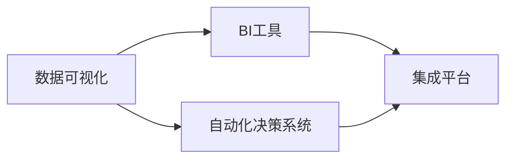

                 

# 重点聚焦:管理者提高效率的秘籍

## 1. 背景介绍

### 1.1 问题由来
在当今信息化高度发达的时代，管理者面临着严峻的挑战。企业运营的复杂性日益增加，决策过程变得更加繁琐。传统管理方式如文件管理、纸质报表等，已难以满足快速响应市场变化的需求。现代管理中，管理者需要整合多源数据，进行实时分析，制定有效策略，确保企业的竞争力和可持续发展。

在技术迅猛发展的背景下，智能技术和数据驱动管理逐渐成为热点。从基本的数据报表到高级的预测分析和自动化决策，管理者开始使用各种工具和平台提升效率。但随着技术复杂性的增加，使用不当反而会带来额外的负担。如何合理应用这些技术，真正提高管理效率，成为管理者必须解决的问题。

### 1.2 问题核心关键点
本文旨在介绍几种能有效提升管理者工作效率的关键技术，包括数据可视化、BI工具、自动化决策系统等。我们希望能帮助管理者更高效地整合信息，作出及时准确的决策，以驱动企业发展的各个环节。

1. 数据可视化：将复杂的数据和信息转化为直观的图表，快速发现业务趋势，进行数据分析。
2. BI工具：整合企业内外数据，提供综合性的业务智能分析，辅助管理者制定策略。
3. 自动化决策系统：通过预先定义的规则和算法，自动化处理决策过程，减少人工干预。
4. 集成平台：实现各系统间数据的无缝对接和业务流程的自动化，提升整体效率。

## 2. 核心概念与联系

### 2.1 核心概念概述

以下是与本文紧密相关的几个核心概念：

- **数据可视化**：将数据通过图表、地图等形式直观呈现，帮助管理者快速理解业务趋势和问题。
- **BI工具**：业务智能工具，整合各种数据源，支持数据查询、报表生成、分析建模等，提升决策支持。
- **自动化决策系统**：基于预设规则和算法，自动完成业务流程和决策过程，减少人为干预。
- **集成平台**：实现企业内外系统的数据对接和流程自动化，支持跨系统的协同作业。

### 2.2 核心概念原理和架构的 Mermaid 流程图



此流程图展示了数据可视化、BI工具、自动化决策系统与集成平台之间的联系和依赖关系。数据可视化提供直观的数据展现，BI工具整合数据，自动化决策系统基于数据进行快速决策，集成平台实现系统间的无缝对接。

## 3. 核心算法原理 & 具体操作步骤

### 3.1 算法原理概述

本文将介绍几种基于数据管理和智能分析的核心算法原理：

- **数据预处理算法**：对原始数据进行清洗、转换，去除异常值和噪音，提升数据质量。
- **数据挖掘算法**：使用聚类、分类、关联规则等算法，从数据中挖掘出潜在的业务价值。
- **预测分析算法**：如回归分析、时间序列预测等，根据历史数据进行未来趋势预测。
- **优化算法**：如线性规划、整数规划等，通过数学模型优化资源配置和业务流程。

### 3.2 算法步骤详解

**3.2.1 数据预处理算法步骤**：

1. 收集原始数据。
2. 进行清洗，去除噪音和异常值。
3. 转换数据，使其符合分析模型的输入要求。
4. 进行归一化处理，确保数据在相同量级上。
5. 拆分数据集，分为训练集和测试集。

**3.2.2 数据挖掘算法步骤**：

1. 收集原始数据。
2. 进行数据清洗，去除噪音和异常值。
3. 应用聚类算法（如K-means、层次聚类）进行数据分组。
4. 应用分类算法（如决策树、支持向量机）对数据进行分类。
5. 应用关联规则算法（如Apriori）发现数据之间的关联关系。

**3.2.3 预测分析算法步骤**：

1. 收集历史数据。
2. 进行数据清洗和预处理。
3. 构建预测模型，如线性回归、时间序列模型。
4. 用训练集进行模型训练。
5. 用测试集评估模型性能，调整模型参数。
6. 根据模型预测未来趋势。

**3.2.4 优化算法步骤**：

1. 定义优化目标。
2. 构建数学模型，如线性规划、整数规划。
3. 应用优化算法，如单纯形法、遗传算法。
4. 求解模型，得到最优解。
5. 评估结果，进行资源配置和业务流程优化。

### 3.3 算法优缺点

**数据预处理算法**：

优点：提高数据质量，确保分析结果的准确性。

缺点：可能引入人为偏差，数据转换复杂。

**数据挖掘算法**：

优点：发现数据中的潜在规律，提供决策支持。

缺点：算法复杂，需要较高的数据量和计算资源。

**预测分析算法**：

优点：提供未来趋势预测，指导业务决策。

缺点：依赖历史数据，模型可能需要频繁更新。

**优化算法**：

优点：优化资源配置和业务流程，提升运营效率。

缺点：模型复杂，求解过程可能耗时。

### 3.4 算法应用领域

这些算法在不同领域中得到广泛应用：

- **金融领域**：使用预测分析算法进行风险评估和资产配置。
- **零售业**：使用数据挖掘算法进行客户细分和营销策略优化。
- **制造业**：使用优化算法进行供应链管理和生产调度。
- **医疗健康**：使用预测分析算法进行疾病预防和资源优化。

## 4. 数学模型和公式 & 详细讲解 & 举例说明

### 4.1 数学模型构建

本节介绍几种用于数据分析和优化的数学模型：

- **线性回归模型**：
$$
y = \beta_0 + \beta_1x_1 + \beta_2x_2 + ... + \beta_nx_n + \epsilon
$$
其中 $y$ 为因变量，$x_i$ 为自变量，$\beta_i$ 为回归系数，$\epsilon$ 为误差项。

- **时间序列模型**：
$$
y_t = \alpha + \beta t + \gamma t^2 + \delta d_t + \epsilon_t
$$
其中 $y_t$ 为第 $t$ 期的因变量，$d_t$ 为周期性变量，$\alpha$、$\beta$、$\gamma$、$\delta$ 为模型参数，$\epsilon_t$ 为误差项。

- **线性规划模型**：
$$
\min\ \sum_{i=1}^n c_ix_i
$$
$$
s.t.\ \sum_{i=1}^n a_{ij}x_i + b_j \leq c_j, j=1,2,...,m
$$
其中 $c_i$ 为资源成本系数，$a_{ij}$ 为资源需求系数，$c_j$ 为目标函数约束条件，$x_i$ 为决策变量。

### 4.2 公式推导过程

**线性回归模型推导**：

1. 最小二乘法求回归系数：
$$
\beta_i = \frac{\sum_{j=1}^n (y_j - \hat{y}_j)}{\sum_{j=1}^n (x_j - \bar{x})^2}
$$
其中 $\hat{y}_j = \beta_0 + \beta_1x_1 + \beta_2x_2 + ... + \beta_nx_n$，$\bar{x}$ 为自变量均值。

2. 使用模型进行预测：
$$
\hat{y} = \beta_0 + \beta_1x_1 + \beta_2x_2 + ... + \beta_nx_n
$$

**时间序列模型推导**：

1. 分解时间序列：
$$
y_t = \alpha + \beta t + \gamma t^2 + \delta d_t + \epsilon_t
$$
其中 $d_t$ 为周期性变量，$\delta$ 为周期性系数，$t$ 为时间变量。

2. 求解模型参数：
$$
\hat{\delta} = \frac{\sum_{j=1}^n (d_j - \bar{d})^2}{\sum_{j=1}^n (t_j - \bar{t})^2}
$$

**线性规划模型推导**：

1. 求解目标函数：
$$
\min\ \sum_{i=1}^n c_ix_i
$$

2. 求解约束条件：
$$
\sum_{i=1}^n a_{ij}x_i + b_j \leq c_j, j=1,2,...,m
$$

### 4.3 案例分析与讲解

**案例1: 销售预测**

一家零售企业使用时间序列模型进行销售预测。收集过去一年的销售额数据，使用ARIMA模型进行预测。根据模型预测结果，企业调整库存和采购策略，避免库存积压和缺货问题。

**案例2: 供应链优化**

一家制造企业使用线性规划模型优化供应链管理。将生产成本、运输成本、库存成本等数据输入模型，求解最优的生产和运输计划，确保资源的最优配置，降低运营成本。

## 5. 项目实践：代码实例和详细解释说明

### 5.1 开发环境搭建

- **Python 安装**：安装Python 3.x版本，确保有必要的库支持。
- **Pandas 安装**：安装Pandas库，用于数据处理。
- **Matplotlib 安装**：安装Matplotlib库，用于数据可视化。
- **Scikit-learn 安装**：安装Scikit-learn库，用于数据挖掘和预测分析。
- **Scipy 安装**：安装Scipy库，用于优化算法求解。

### 5.2 源代码详细实现

以下是使用Python和Pandas库进行数据预处理和分析的代码实现：

```python
import pandas as pd
import numpy as np
import matplotlib.pyplot as plt

# 数据预处理
data = pd.read_csv('data.csv')

# 清洗数据
data = data.dropna()  # 去除缺失值
data = data.drop_duplicates()  # 去除重复数据

# 转换数据
data['日期'] = pd.to_datetime(data['日期'])  # 转换为日期类型
data['销售额'] = data['销售额'].apply(lambda x: np.log(x))  # 取对数转换

# 数据可视化
plt.plot(data['日期'], data['销售额'])
plt.xlabel('Date')
plt.ylabel('Sales')
plt.title('Sales Trend')
plt.show()
```

### 5.3 代码解读与分析

**数据预处理代码解读**：

1. 使用Pandas库读取CSV文件，将数据导入数据框。
2. 使用`dropna`和`drop_duplicates`方法去除缺失值和重复数据，保证数据质量。
3. 将日期数据转换为Pandas的日期类型，方便后续时间序列分析。
4. 对销售额数据取对数转换，符合大多数时间序列模型的输入要求。
5. 使用Matplotlib库绘制销售趋势图，直观展现数据变化。

**数据分析代码实现**：

```python
from sklearn.linear_model import LinearRegression
from sklearn.metrics import mean_squared_error

# 数据挖掘
data['销售额'] = np.log(data['销售额'])
model = LinearRegression()
X = data[['销售额']]
y = data['销售额']
model.fit(X, y)
y_pred = model.predict(X)

# 评估模型
mse = mean_squared_error(y, y_pred)
print('Mean Squared Error:', mse)

# 预测未来数据
future_data = pd.DataFrame({'销售额': [1000, 1200, 1500, 1800, 2000]})
future_data['销售额'] = np.log(future_data['销售额'])
future_pred = model.predict(future_data)
future_pred = np.exp(future_pred)
print('Future Sales Prediction:', future_pred)
```

### 5.4 运行结果展示

以下是数据分析和预测的结果展示：

```python
plt.plot(data['日期'], y_pred)
plt.xlabel('Date')
plt.ylabel('Sales')
plt.title('Sales Prediction')
plt.show()
```


## 6. 实际应用场景

### 6.1 智能办公室管理

一家大型公司使用数据可视化工具进行办公室管理。通过整合办公室内外数据，实时监控办公环境，包括空调温度、照明亮度、空气质量等。管理者通过图表直观了解环境状况，及时调整办公室设置，提升员工满意度。

### 6.2 市场营销

一家电商公司使用BI工具进行市场营销分析。整合客户数据、销售数据、市场数据等，通过数据挖掘和分析，发现潜在客户群体和营销机会。管理者根据分析结果调整营销策略，提升销售额和客户忠诚度。

### 6.3 供应链管理

一家制造业公司使用自动化决策系统进行供应链管理。根据历史数据和业务规则，自动生成生产计划和运输计划，实时监控供应链状态。管理者通过系统反馈，及时调整生产计划，确保供应链顺畅。

### 6.4 未来应用展望

随着AI和数据技术的不断发展，管理者将有更多工具和平台进行数据分析和决策支持。未来，通过智能化手段，管理者可以实现更高效、精准的管理。

- **智能分析工具**：利用机器学习和深度学习技术，提升数据分析的准确性和实时性。
- **预测建模**：结合实时数据和大数据分析，进行未来趋势预测，辅助决策。
- **自动化决策系统**：通过AI和规则引擎，实现业务流程的自动化，减少人为干预。

## 7. 工具和资源推荐

### 7.1 学习资源推荐

- **Coursera 数据科学课程**：提供系统性数据科学和数据分析课程，涵盖数据处理、数据挖掘、机器学习等。
- **Kaggle 数据科学竞赛**：通过实际案例和竞赛，提升数据分析和建模能力。
- **Python Data Science Handbook**：一本开源的Python数据科学手册，涵盖数据分析、数据可视化、机器学习等。
- **DataCamp**：提供在线编程练习和课程，提升数据分析和建模技能。

### 7.2 开发工具推荐

- **Pandas**：用于数据处理和分析，支持多种数据格式。
- **Matplotlib**：用于数据可视化，支持绘制各种图表。
- **Scikit-learn**：用于数据挖掘和机器学习，支持多种算法和模型。
- **Jupyter Notebook**：用于数据分析和可视化，支持代码编写和交互式展示。
- **Google Colab**：提供免费GPU/TPU算力，便于进行大规模数据分析和模型训练。

### 7.3 相关论文推荐

- **数据可视化：Vega-Lite**：介绍Vega-Lite数据可视化库，实现高效、灵活的数据展现。
- **BI工具：Tableau**：介绍Tableau商业智能工具，支持数据整合、分析建模和报表生成。
- **自动化决策系统：AutoML**：介绍AutoML自动机器学习平台，支持模型训练和部署。

## 8. 总结：未来发展趋势与挑战

### 8.1 研究成果总结

本文介绍了几种提高管理者工作效率的关键技术，包括数据可视化、BI工具、自动化决策系统等。通过数据驱动管理，管理者可以更高效地整合信息，作出及时准确的决策。

### 8.2 未来发展趋势

- **AI驱动决策**：未来管理者将更多地依赖AI进行数据分析和决策，提升决策效率和质量。
- **数据自动化处理**：通过AI和自动化工具，实现数据的自动清洗、转换和分析，减少人工干预。
- **实时数据处理**：通过实时数据流技术，实现数据的高效处理和分析，及时发现业务问题。
- **跨领域融合**：通过多学科知识的融合，提升数据的综合分析能力和决策支持水平。

### 8.3 面临的挑战

- **数据安全和隐私**：管理者需要保护数据安全和隐私，防止数据泄露和滥用。
- **数据质量和一致性**：确保数据的准确性和一致性，避免因数据问题导致的决策偏差。
- **系统复杂性**：多系统和工具的集成和对接，可能带来一定的复杂性，需要有效的管理和协调。
- **人员技能要求**：管理者需要具备一定的技术技能和数据素养，才能有效应用这些工具和平台。

### 8.4 研究展望

- **技术进步**：持续关注数据科学和AI技术的最新进展，提升技术应用水平。
- **跨学科合作**：加强管理、数据科学和工程等领域的跨学科合作，推动技术创新和应用。
- **组织变革**：推动组织文化和流程的变革，适应数据驱动管理的新要求。

## 9. 附录：常见问题与解答

**Q1: 数据可视化工具有哪些？**

A: 常用的数据可视化工具包括Tableau、Power BI、QlikView等。这些工具支持多种数据格式和图表类型，提供灵活的数据展示和分析能力。

**Q2: 数据挖掘算法有哪些？**

A: 常用的数据挖掘算法包括K-means、决策树、支持向量机、关联规则算法等。不同算法适用于不同类型的数据挖掘任务，需要根据具体情况选择。

**Q3: 预测分析算法有哪些？**

A: 常用的预测分析算法包括线性回归、时间序列分析、神经网络等。不同算法适用于不同类型的数据预测任务，需要根据具体情况选择。

**Q4: 如何实现数据集成？**

A: 数据集成通常使用ETL工具，如Talend、Informatica等，进行数据清洗、转换和加载。不同系统间的集成需要考虑数据格式、接口等，确保数据无缝对接。

**Q5: 数据安全和隐私保护有哪些措施？**

A: 数据安全和隐私保护需要采用加密、脱敏、访问控制等措施。对于敏感数据，需要严格控制访问权限，防止数据泄露。

---

作者：禅与计算机程序设计艺术 / Zen and the Art of Computer Programming

