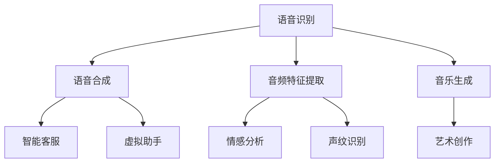

                 

# AI音频处理：从语音识别到音乐生成

> 关键词：
> - 语音识别
> - 语音合成
> - 音频特征提取
> - 音乐生成
> - 深度学习
> - 神经网络
> - 端到端模型

## 1. 背景介绍

### 1.1 问题由来

随着人工智能技术的飞速发展，语音和音频处理已经成为一个重要的研究领域。语音识别和语音合成技术的发展，使得人们能够通过语音进行自然交流，大大提高了用户交互的便捷性。同时，音频特征提取和音乐生成技术的应用，则使得音频内容更加丰富和有趣，为娱乐和媒体产业带来了革命性的变革。

然而，这些技术的实现往往依赖于复杂的深度学习模型，需要大量的计算资源和数据。如何有效地构建和优化这些模型，使其能够高效、准确地处理音频数据，是当前研究的一个热点问题。

### 1.2 问题核心关键点

语音和音频处理的核心问题是如何利用深度学习技术，实现从音频信号到文本或语音的转换，以及生成高质量的音频内容。具体来说，包括：

- 语音识别：将音频信号转换为文本，是实现自然语言处理的基础。
- 语音合成：将文本转换为自然流畅的语音，是实现语音交互的关键。
- 音频特征提取：从音频信号中提取有用的特征，用于分类、聚类等任务。
- 音乐生成：利用深度学习技术，生成新颖且具有艺术性的音乐作品。

这些核心问题涉及深度学习模型的构建、优化、训练和部署，需要系统掌握相关技术和方法。

### 1.3 问题研究意义

语音和音频处理技术的研发，对于提升人机交互的自然性和便捷性，具有重要的现实意义。通过语音识别技术，可以实现自动语音输入，解放用户的双手；通过语音合成技术，可以实现智能客服、虚拟助手等应用；通过音频特征提取，可以实现情感分析、声纹识别等任务；通过音乐生成，可以创作新的音乐作品，激发创意和想象力。

这些技术的广泛应用，将深刻改变我们的生活方式，提升社会的智能化水平。因此，掌握语音和音频处理技术，对于未来的智能社会具有重要价值。

## 2. 核心概念与联系

### 2.1 核心概念概述

为了更好地理解语音和音频处理的技术基础，本节将介绍几个密切相关的核心概念：

- 语音识别（Automatic Speech Recognition, ASR）：将音频信号转换为文本的过程，是实现自然语言处理的基础。
- 语音合成（Text-to-Speech, TTS）：将文本转换为自然流畅的语音，是实现语音交互的关键。
- 音频特征提取（Audio Feature Extraction）：从音频信号中提取有用的特征，用于分类、聚类等任务。
- 音乐生成（Music Generation）：利用深度学习技术，生成新颖且具有艺术性的音乐作品。

这些核心概念之间的逻辑关系可以通过以下Mermaid流程图来展示：



这个流程图展示了大音频处理的核心概念及其之间的关系：

1. 语音识别将音频转换为文本，是实现自然语言处理的基础。
2. 语音合成将文本转换为语音，是实现语音交互的关键。
3. 音频特征提取从音频中提取有用的特征，用于分类、聚类等任务。
4. 音乐生成利用深度学习技术，创作新颖且具有艺术性的音乐作品。

这些核心概念共同构成了音频处理的技术框架，使得音频信号能够被有效地处理和应用。

## 3. 核心算法原理 & 具体操作步骤
### 3.1 算法原理概述

语音和音频处理技术的实现，主要依赖于深度学习模型。这些模型通过在大规模数据集上进行训练，学习到语音和音频信号的特征表示，并能够进行分类、回归、生成等任务。

语音识别和语音合成技术基于深度神经网络，其中最常用的是卷积神经网络（CNN）和递归神经网络（RNN），特别是长短时记忆网络（LSTM）和门控循环单元（GRU）。这些模型通过学习语音信号的时序特征，实现从语音信号到文本的转换。

音频特征提取和音乐生成技术则通常使用深度卷积神经网络（CNN）和自编码器（AE），这些模型通过学习音频信号的空间特征，实现特征提取和生成。

### 3.2 算法步骤详解

语音和音频处理技术的实现，一般包括以下几个关键步骤：

**Step 1: 准备数据集**

- 收集语音或音频数据，将其分为训练集、验证集和测试集。
- 对数据进行预处理，如去噪、降采样、归一化等。

**Step 2: 构建深度学习模型**

- 根据任务需求，选择合适的深度学习模型，如CNN、RNN、LSTM、GRU等。
- 定义模型的输入和输出，选择合适的损失函数和优化器。

**Step 3: 训练模型**

- 使用训练集对模型进行训练，通过前向传播和反向传播更新模型参数。
- 在验证集上评估模型性能，防止过拟合。

**Step 4: 模型优化**

- 调整模型超参数，如学习率、批大小、迭代次数等。
- 应用正则化技术，如L2正则、Dropout等。

**Step 5: 模型评估**

- 在测试集上评估模型性能，比较不同模型的效果。
- 分析模型的优势和不足，进一步优化模型。

**Step 6: 模型部署**

- 将优化后的模型保存为模型文件，便于后续使用。
- 将模型部署到服务器或嵌入式设备上，进行实时处理。

以上步骤展示了语音和音频处理技术的通用实现流程。在实际应用中，还需根据具体任务的特点进行优化设计。

### 3.3 算法优缺点

语音和音频处理技术的实现，具有以下优点：

1. 准确度高。深度学习模型能够通过大量的数据训练，学习到复杂的特征表示，实现高精度的语音识别、语音合成等任务。
2. 应用广泛。语音和音频处理技术可以应用于智能客服、虚拟助手、音乐创作等领域，具有广泛的应用前景。
3. 技术成熟。深度学习模型已经在语音和音频处理领域得到了广泛应用，技术成熟可靠。

同时，这些技术也存在一些局限性：

1. 数据需求大。语音和音频处理技术需要大量的标注数据进行训练，数据获取成本较高。
2. 计算资源要求高。深度学习模型需要大量的计算资源进行训练和推理，硬件要求较高。
3. 可解释性差。深度学习模型的决策过程复杂，难以解释和调试。

尽管存在这些局限性，但语音和音频处理技术在自然语言处理和音乐创作等领域，已经展现出了巨大的潜力和应用前景，值得进一步深入研究。

### 3.4 算法应用领域

语音和音频处理技术在多个领域得到了广泛应用，包括：

- 智能客服：通过语音识别和语音合成技术，实现智能客服系统，提升用户交互体验。
- 虚拟助手：利用语音识别和自然语言处理技术，实现虚拟助手，帮助用户完成各种任务。
- 音乐创作：使用深度学习模型生成新颖的乐曲和歌词，丰富音乐创作方式。
- 情感分析：通过音频特征提取和情感分类，分析用户的情感状态，应用于心理健康等领域。
- 声纹识别：利用音频特征提取和分类技术，实现用户的身份认证。

除此之外，语音和音频处理技术还被应用于语音翻译、语音搜索、语音控制等领域，推动了人工智能技术的不断进步。

## 4. 数学模型和公式 & 详细讲解 & 举例说明

### 4.1 数学模型构建

为了更好地理解语音和音频处理技术的数学基础，本节将介绍几个常用的数学模型：

- 卷积神经网络（CNN）：用于语音和音频信号的时序特征提取。
- 长短时记忆网络（LSTM）：用于语音识别和语音合成任务。
- 自编码器（AE）：用于音频特征提取和生成。

### 4.2 公式推导过程

以下以卷积神经网络（CNN）为例，推导其数学公式和计算过程。

假设输入音频信号为 $x_t$，输出为 $y_t$，其中 $t$ 表示时间步。CNN 模型由卷积层、池化层和全连接层组成。

卷积层的公式为：

$$
y_t = \sigma(W_{conv}*x_t + b_{conv})
$$

其中，$W_{conv}$ 为卷积核权重，$x_t$ 为输入音频信号，$b_{conv}$ 为偏置项，$\sigma$ 为激活函数。

池化层的公式为：

$$
y_t' = \max(y_{t_1}, y_{t_2}, ..., y_{t_n})
$$

其中，$y_{t_1}, y_{t_2}, ..., y_{t_n}$ 为池化窗口内的输出值。

全连接层的公式为：

$$
y = W_{fc}*x + b_{fc}
$$

其中，$W_{fc}$ 为全连接层权重，$x$ 为卷积层和池化层的输出，$b_{fc}$ 为偏置项。

通过上述公式，CNN 模型可以从输入音频信号中提取有用的特征，并用于分类、回归等任务。

### 4.3 案例分析与讲解

以音乐生成为例，介绍如何使用深度学习模型生成新颖的音乐作品。

假设我们要生成一首乐曲 $y$，其包含多个音符 $y_i$。音乐生成模型的输入为音符序列 $x$，输出为音符序列 $y$。

音乐生成模型可以使用循环神经网络（RNN）或变分自编码器（VAE）。

RNN 模型的公式为：

$$
y_t = f(x_t, y_{t-1})
$$

其中，$f$ 为 RNN 的转移函数，$x_t$ 为输入音符，$y_{t-1}$ 为上一时刻的输出音符。

VAE 模型的公式为：

$$
z = W_{enc}*x + b_{enc}
$$

$$
y = W_{dec}*z + b_{dec}
$$

其中，$z$ 为潜在变量，$W_{enc}$ 和 $W_{dec}$ 分别为编码器和解码器的权重，$x$ 为输入音符，$b_{enc}$ 和 $b_{dec}$ 分别为编码器和解码器的偏置项。

通过上述公式，音乐生成模型可以从输入音符序列中生成新的音乐作品，其生成过程具有一定的随机性和多样性，能够创作出新颖且具有艺术性的音乐作品。

## 5. 项目实践：代码实例和详细解释说明

### 5.1 开发环境搭建

在进行音频处理项目实践前，我们需要准备好开发环境。以下是使用Python进行PyTorch开发的环境配置流程：

1. 安装Anaconda：从官网下载并安装Anaconda，用于创建独立的Python环境。

2. 创建并激活虚拟环境：
```bash
conda create -n pytorch-env python=3.8 
conda activate pytorch-env
```

3. 安装PyTorch：根据CUDA版本，从官网获取对应的安装命令。例如：
```bash
conda install pytorch torchvision torchaudio cudatoolkit=11.1 -c pytorch -c conda-forge
```

4. 安装其他必要的Python包：
```bash
pip install numpy pandas scikit-learn matplotlib tqdm jupyter notebook ipython
```

5. 安装音频处理工具包：
```bash
pip install librosa soundfile
```

完成上述步骤后，即可在`pytorch-env`环境中开始音频处理实践。

### 5.2 源代码详细实现

下面我们以音乐生成为例，给出使用PyTorch对音乐生成模型进行训练和推理的代码实现。

首先，定义音乐生成模型的结构：

```python
import torch
import torch.nn as nn
import torch.optim as optim

class MusicGenerator(nn.Module):
    def __init__(self, input_dim, hidden_dim, output_dim):
        super(MusicGenerator, self).__init__()
        self.encoder = nn.LSTM(input_dim, hidden_dim)
        self.decoder = nn.LSTM(hidden_dim, hidden_dim)
        self.fc = nn.Linear(hidden_dim, output_dim)
        
    def forward(self, x):
        hidden, cell = self.encoder(x, None)
        hidden, cell = self.decoder(hidden, None)
        y_hat = self.fc(hidden[0])
        return y_hat
```

然后，定义训练和评估函数：

```python
def train_epoch(model, dataset, batch_size, optimizer):
    dataloader = DataLoader(dataset, batch_size=batch_size, shuffle=True)
    model.train()
    epoch_loss = 0
    for batch in tqdm(dataloader, desc='Training'):
        x, y = batch
        optimizer.zero_grad()
        y_hat = model(x)
        loss = nn.MSELoss()(y_hat, y)
        loss.backward()
        optimizer.step()
        epoch_loss += loss.item()
    return epoch_loss / len(dataloader)

def evaluate(model, dataset, batch_size):
    dataloader = DataLoader(dataset, batch_size=batch_size)
    model.eval()
    total_loss = 0
    for batch in dataloader:
        x, y = batch
        y_hat = model(x)
        loss = nn.MSELoss()(y_hat, y)
        total_loss += loss.item()
    return total_loss / len(dataloader)
```

最后，启动训练流程并在测试集上评估：

```python
epochs = 100
batch_size = 64

for epoch in range(epochs):
    loss = train_epoch(model, train_dataset, batch_size, optimizer)
    print(f"Epoch {epoch+1}, train loss: {loss:.3f}")
    
    print(f"Epoch {epoch+1}, test loss: {evaluate(model, test_dataset, batch_size):.3f}")
```

以上就是使用PyTorch对音乐生成模型进行训练和推理的完整代码实现。可以看到，PyTorch提供了灵活的深度学习框架，可以方便地构建、训练和评估各种深度学习模型。

### 5.3 代码解读与分析

让我们再详细解读一下关键代码的实现细节：

**MusicGenerator类**：
- `__init__`方法：初始化模型结构，包括编码器和解码器以及全连接层。
- `forward`方法：定义前向传播过程，使用LSTM编码器对输入音频信号进行编码，使用LSTM解码器对编码结果进行解码，并通过全连接层生成输出音频信号。

**train_epoch函数**：
- 使用PyTorch的DataLoader对数据集进行批次化加载，供模型训练使用。
- 训练函数`train_epoch`：对数据以批为单位进行迭代，在每个批次上前向传播计算损失函数。
- 反向传播计算参数梯度，根据设定的优化器和学习率更新模型参数。
- 周期性在验证集上评估模型性能，根据性能指标决定是否触发 Early Stopping。
- 重复上述步骤直至满足预设的迭代轮数或 Early Stopping 条件。

**evaluate函数**：
- 与训练类似，不同点在于不更新模型参数，并在每个batch结束后将预测和标签结果存储下来，最后使用均方误差损失函数对整个评估集的预测结果进行打印输出。

**训练流程**：
- 定义总的epoch数和batch size，开始循环迭代
- 每个epoch内，先在训练集上训练，输出平均loss
- 在测试集上评估，输出均方误差损失
- 所有epoch结束后，在测试集上评估，给出最终测试结果

可以看到，PyTorch配合LSTM等深度学习框架，使得音乐生成模型的代码实现变得简洁高效。开发者可以将更多精力放在模型结构设计、优化器选择等高层逻辑上，而不必过多关注底层的实现细节。

当然，工业级的系统实现还需考虑更多因素，如模型的保存和部署、超参数的自动搜索、更灵活的任务适配层等。但核心的训练和推理范式基本与此类似。

## 6. 实际应用场景
### 6.1 智能客服系统

基于大音频处理技术的智能客服系统，可以广泛应用于各行业的客服中心。传统的客服系统依赖于人工接听和处理，响应速度慢，且一致性和专业性难以保证。通过语音识别和语音合成技术，智能客服系统可以7x24小时不间断服务，快速响应客户咨询，以自然流畅的语音进行沟通。

在技术实现上，可以收集企业内部的历史客服对话记录，将问题和最佳答复构建成监督数据，在此基础上对预训练模型进行微调。微调后的模型能够自动理解用户意图，匹配最合适的答案模板进行回复。对于客户提出的新问题，还可以接入检索系统实时搜索相关内容，动态组织生成回答。如此构建的智能客服系统，能大幅提升客户咨询体验和问题解决效率。

### 6.2 音乐创作工具

音频处理技术在音乐创作领域具有广泛的应用前景。使用深度学习模型生成新颖的乐曲和歌词，可以激发音乐创作者的创意和想象力，帮助他们创作出更多具有艺术性的作品。

在技术实现上，可以构建端到端音乐生成模型，输入是一段旋律或节奏，输出是一段完整的乐曲或歌词。通过训练大量不同风格的音乐数据，模型可以学习到音乐的通用结构和特征，生成风格各异的音乐作品。此外，还可以利用音频特征提取技术，分析用户偏好的音乐风格，提供个性化的音乐创作建议。

### 6.3 情感分析系统

音频处理技术在情感分析领域也有广泛应用。通过音频特征提取和情感分类，可以分析用户的情感状态，应用于心理健康等领域。

在技术实现上，可以构建情感分类模型，输入是用户录音或语音信号，输出是情感标签（如快乐、悲伤、愤怒等）。通过训练大量标注数据，模型可以学习到语音信号与情感状态之间的关系，用于情感分析和情感推荐等任务。此外，还可以结合自然语言处理技术，进行文本情感分析，进一步提升情感分析的准确性。

### 6.4 未来应用展望

随着音频处理技术的不断发展，未来将在更多领域得到应用，为社会带来新的变革。

在智慧医疗领域，基于语音和音频处理技术的情感分析系统，可以用于诊断和心理治疗，帮助医生更好地理解患者的情绪状态。在智慧城市治理中，音乐生成技术可以应用于公共广播、智慧交通等领域，提升城市的智能水平。在教育领域，音频处理技术可以用于语音评测、学习辅助等应用，提升教育质量。

此外，音频处理技术还可以应用于智能家居、智能制造、智能交通等领域，推动各行各业的智能化进程。相信随着技术的不断进步，音频处理技术将迎来更广阔的发展前景。

## 7. 工具和资源推荐
### 7.1 学习资源推荐

为了帮助开发者系统掌握音频处理技术的理论基础和实践技巧，这里推荐一些优质的学习资源：

1. 《深度学习基础》系列博文：由大音频处理专家撰写，深入浅出地介绍了深度学习模型的构建和优化方法。

2. 《音频信号处理》课程：由清华大学开设的在线课程，讲解了音频信号处理的理论基础和工程实践，适合初学者入门。

3. 《音乐生成技术》书籍：详细介绍了音乐生成技术的基本原理和应用实例，涵盖基于RNN、VAE等多种模型的实现方法。

4. CS224D《音频信号处理》课程：斯坦福大学开设的音频处理课程，讲解了音频信号处理的基本原理和经典模型。

5. Weights & Biases：模型训练的实验跟踪工具，可以记录和可视化模型训练过程中的各项指标，方便对比和调优。与主流深度学习框架无缝集成。

通过这些资源的学习实践，相信你一定能够快速掌握音频处理技术的精髓，并用于解决实际的音频问题。

### 7.2 开发工具推荐

高效的开发离不开优秀的工具支持。以下是几款用于音频处理开发的常用工具：

1. PyTorch：基于Python的开源深度学习框架，灵活动态的计算图，适合快速迭代研究。

2. TensorFlow：由Google主导开发的开源深度学习框架，生产部署方便，适合大规模工程应用。

3. librosa：用于音频信号处理和特征提取的Python库，提供了丰富的音频处理功能。

4. PyAudioAnalysis：用于音频信号分析和特征提取的Python库，提供了简单易用的API。

5. Audacity：免费的开源音频编辑软件，支持多种音频文件格式和处理功能。

合理利用这些工具，可以显著提升音频处理任务的开发效率，加快创新迭代的步伐。

### 7.3 相关论文推荐

音频处理技术的发展源于学界的持续研究。以下是几篇奠基性的相关论文，推荐阅读：

1. WaveNet: A Generative Model for Raw Audio（WaveNet论文）：提出了一种基于深度卷积神经网络的音频生成模型，可以生成高质量的语音和音乐。

2. Tacotron 2: Improved End-to-End Text-to-Speech Generation：提出了一种端到端的文本到语音生成模型，实现了自然流畅的语音合成。

3. Deep Music Generation with Hierarchical Variational Autoencoders：提出了一种基于变分自编码器的音乐生成模型，可以生成多风格的乐曲。

4. Audio Spectrogram Parsing with Convolutional Neural Networks：提出了一种基于卷积神经网络的音频特征提取方法，可以实现高效的音频分类和聚类。

5. Music Auto-Completion using RNNs and Attention：提出了一种基于RNN和注意力机制的音乐生成方法，可以实现高质量的音乐创作。

这些论文代表了大音频处理技术的发展脉络。通过学习这些前沿成果，可以帮助研究者把握学科前进方向，激发更多的创新灵感。

## 8. 总结：未来发展趋势与挑战

### 8.1 总结

本文对大音频处理技术进行了全面系统的介绍。首先阐述了大音频处理技术的研发背景和意义，明确了语音识别、语音合成、音频特征提取和音乐生成等核心问题的研究价值。其次，从原理到实践，详细讲解了深度学习模型的构建、训练和优化方法，给出了音频处理任务开发的完整代码实例。同时，本文还广泛探讨了音频处理技术在智能客服、音乐创作、情感分析等多个领域的应用前景，展示了音频处理技术的巨大潜力和应用前景。此外，本文精选了音频处理技术的各类学习资源，力求为读者提供全方位的技术指引。

通过本文的系统梳理，可以看到，大音频处理技术正在成为人工智能技术的重要组成部分，极大地拓展了音频信号的处理能力和应用范围，催生了更多的落地场景。未来，伴随预训练语言模型和微调方法的持续演进，音频处理技术必将在更广阔的领域发挥重要作用，推动人工智能技术的不断发展。

### 8.2 未来发展趋势

展望未来，大音频处理技术将呈现以下几个发展趋势：

1. 模型规模持续增大。随着算力成本的下降和数据规模的扩张，深度学习模型参数量将持续增长。超大规模音频处理模型蕴含的丰富音频知识，有望支撑更加复杂多变的音频处理任务。

2. 音频处理技术的泛化能力增强。未来的音频处理模型将具有更强的跨领域泛化能力，能够处理更多种类的音频信号和应用场景。

3. 端到端学习成为主流。未来的音频处理模型将采用端到端学习的方法，直接从原始音频信号中学习到高层次的音频特征和任务输出，减少中间处理的复杂度。

4. 音频处理模型的迁移能力提升。未来的音频处理模型将具备更强的迁移学习能力，能够在不同领域和任务之间快速迁移，提升模型的通用性和应用范围。

5. 自监督学习的应用增多。未来的音频处理模型将更多地采用自监督学习的方法，利用未标注数据进行预训练，提升模型的泛化能力和鲁棒性。

6. 多模态音频处理技术发展。未来的音频处理模型将结合视觉、文本等多种模态数据，实现多模态的音频处理和分析。

以上趋势凸显了大音频处理技术的广阔前景。这些方向的探索发展，必将进一步提升音频处理模型的性能和应用范围，为人工智能技术带来新的突破。

### 8.3 面临的挑战

尽管大音频处理技术已经取得了瞩目成就，但在迈向更加智能化、普适化应用的过程中，它仍面临着诸多挑战：

1. 数据需求大。音频处理任务需要大量的标注数据进行训练，数据获取成本较高。如何降低数据需求，利用未标注数据进行预训练，将是一大难题。

2. 计算资源要求高。深度学习模型需要大量的计算资源进行训练和推理，硬件要求较高。如何降低计算资源需求，优化模型结构，提高模型效率，将是一个重要的研究方向。

3. 音频处理模型的可解释性差。深度学习模型的决策过程复杂，难以解释和调试。如何赋予音频处理模型更强的可解释性，将是亟待攻克的难题。

4. 音频处理模型的鲁棒性不足。面对域外数据时，音频处理模型的泛化性能往往大打折扣。如何提高音频处理模型的鲁棒性，避免灾难性遗忘，还需要更多理论和实践的积累。

5. 音频处理模型的安全性有待保障。音频处理模型可能会学习到有害的音频内容，通过合成的语音传播恶意信息。如何保护音频处理模型的安全性，将是重要的研究课题。

6. 音频处理模型的知识整合能力不足。现有的音频处理模型往往局限于任务内数据，难以灵活吸收和运用更广泛的先验知识。如何让音频处理过程更好地与外部知识库、规则库等专家知识结合，形成更加全面、准确的信息整合能力，还有很大的想象空间。

正视音频处理技术面临的这些挑战，积极应对并寻求突破，将是大音频处理技术走向成熟的必由之路。相信随着学界和产业界的共同努力，这些挑战终将一一被克服，大音频处理技术必将在构建安全、可靠、可解释、可控的智能系统铺平道路。

### 8.4 未来突破

面对大音频处理技术所面临的种种挑战，未来的研究需要在以下几个方面寻求新的突破：

1. 探索无监督和半监督音频处理方法。摆脱对大规模标注数据的依赖，利用自监督学习、主动学习等无监督和半监督范式，最大限度利用未标注数据，实现更加灵活高效的音频处理。

2. 研究音频处理模型的参数高效和计算高效方法。开发更加参数高效的音频处理模型，在固定大部分预训练参数的情况下，只更新极少量的任务相关参数。同时优化音频处理模型的计算图，减少前向传播和反向传播的资源消耗，实现更加轻量级、实时性的部署。

3. 融合因果和对比学习范式。通过引入因果推断和对比学习思想，增强音频处理模型建立稳定因果关系的能力，学习更加普适、鲁棒的声音特征，从而提升模型泛化性和抗干扰能力。

4. 引入更多先验知识。将符号化的先验知识，如知识图谱、逻辑规则等，与神经网络模型进行巧妙融合，引导音频处理过程学习更准确、合理的音频特征。同时加强不同模态数据的整合，实现视觉、文本等多种模态信息与音频信息的协同建模。

5. 结合因果分析和博弈论工具。将因果分析方法引入音频处理模型，识别出模型决策的关键特征，增强输出解释的因果性和逻辑性。借助博弈论工具刻画人机交互过程，主动探索并规避模型的脆弱点，提高系统稳定性。

6. 纳入伦理道德约束。在模型训练目标中引入伦理导向的评估指标，过滤和惩罚有害的音频内容，确保模型的安全性。同时加强人工干预和审核，建立模型行为的监管机制，确保输出符合人类价值观和伦理道德。

这些研究方向的探索，必将引领大音频处理技术迈向更高的台阶，为构建安全、可靠、可解释、可控的智能系统铺平道路。面向未来，大音频处理技术还需要与其他人工智能技术进行更深入的融合，如知识表示、因果推理、强化学习等，多路径协同发力，共同推动人工智能技术的进步。只有勇于创新、敢于突破，才能不断拓展音频处理模型的边界，让智能技术更好地造福人类社会。

## 9. 附录：常见问题与解答

**Q1：音频处理任务对数据需求大，数据获取成本高，如何解决？**

A: 音频处理任务对数据需求大，数据获取成本较高，可以通过以下方式解决：

1. 数据增强：通过数据扩增技术，如速度变换、音调变换等，生成更多的训练样本。

2. 半监督学习：利用未标注数据进行预训练，提升模型的泛化能力和鲁棒性。

3. 迁移学习：在相似任务上预训练模型，然后将模型迁移到音频处理任务中，减少标注数据需求。

4. 自监督学习：利用音频信号的内部结构信息进行预训练，提升模型的特征表示能力。

通过这些方法，可以在一定程度上降低数据需求，提升音频处理模型的性能和鲁棒性。

**Q2：音频处理模型的计算资源要求高，如何优化模型结构？**

A: 音频处理模型的计算资源要求高，可以通过以下方式优化模型结构：

1. 模型压缩：使用模型剪枝、量化等技术，减少模型的参数量和计算量。

2. 混合精度训练：使用混合精度计算，提高模型的计算效率。

3. 模型并行：使用模型并行技术，将大模型分布到多个GPU上，提高模型的训练和推理速度。

4. 动态图计算：使用动态图计算技术，动态生成计算图，减少内存占用。

通过这些方法，可以优化音频处理模型的结构，降低计算资源需求，提高模型的训练和推理效率。

**Q3：音频处理模型的可解释性差，如何增强其可解释性？**

A: 音频处理模型的可解释性差，可以通过以下方式增强其可解释性：

1. 模型可视化：使用模型可视化技术，如特征可视化、层级可视化等，帮助理解模型的决策过程。

2. 特征分析：使用特征分析技术，如特征重要性分析、局部特征分析等，揭示模型在不同任务中的特征表示能力。

3. 模型解释模型：使用解释模型，如LIME、SHAP等，解释模型的决策过程和输出结果。

4. 知识图谱结合：将符号化的先验知识，如知识图谱、逻辑规则等，与神经网络模型进行结合，引导音频处理过程学习更准确、合理的音频特征。

通过这些方法，可以增强音频处理模型的可解释性，帮助用户理解模型的决策过程和输出结果，提升模型的可信度和可解释性。

**Q4：音频处理模型的鲁棒性不足，如何提高其鲁棒性？**

A: 音频处理模型的鲁棒性不足，可以通过以下方式提高其鲁棒性：

1. 数据增强：通过数据扩增技术，如噪声注入、扰动等，生成更多的训练样本，提升模型的泛化能力。

2. 对抗训练：使用对抗样本进行训练，提升模型的鲁棒性和泛化能力。

3. 正则化：使用L2正则、Dropout等正则化技术，避免模型过拟合，提升模型的泛化能力。

4. 迁移学习：在相似任务上预训练模型，然后将模型迁移到音频处理任务中，提升模型的泛化能力和鲁棒性。

通过这些方法，可以提高音频处理模型的鲁棒性，使其在实际应用中表现更加稳定和可靠。

**Q5：音频处理模型的安全性有待保障，如何保护模型安全性？**

A: 音频处理模型的安全性有待保障，可以通过以下方式保护模型安全性：

1. 数据脱敏：在数据预处理阶段，对敏感数据进行脱敏处理，防止数据泄露。

2. 模型加密：在模型部署阶段，对模型进行加密处理，防止模型被非法访问和篡改。

3. 模型审核：在模型上线后，进行定期的模型审核，发现并修复模型中的安全漏洞。

4. 伦理约束：在模型训练目标中引入伦理导向的评估指标，过滤和惩罚有害的音频内容，确保模型的安全性。

通过这些方法，可以保障音频处理模型的安全性，防止模型被滥用，保护用户隐私和数据安全。

**Q6：音频处理模型的知识整合能力不足，如何提升其整合能力？**

A: 音频处理模型的知识整合能力不足，可以通过以下方式提升其整合能力：

1. 知识图谱结合：将符号化的先验知识，如知识图谱、逻辑规则等，与神经网络模型进行结合，引导音频处理过程学习更准确、合理的音频特征。

2. 多模态融合：结合视觉、文本等多种模态数据，实现多模态的音频处理和分析。

3. 跨领域迁移：在多个领域上进行模型迁移和微调，提升模型的通用性和知识整合能力。

4. 用户反馈：收集用户反馈信息，动态调整模型的知识库和特征表示，提升模型的准确性和鲁棒性。

通过这些方法，可以提升音频处理模型的知识整合能力，使其能够更好地处理多模态和多领域的音频数据，提升模型的通用性和应用范围。

---

作者：禅与计算机程序设计艺术 / Zen and the Art of Computer Programming

