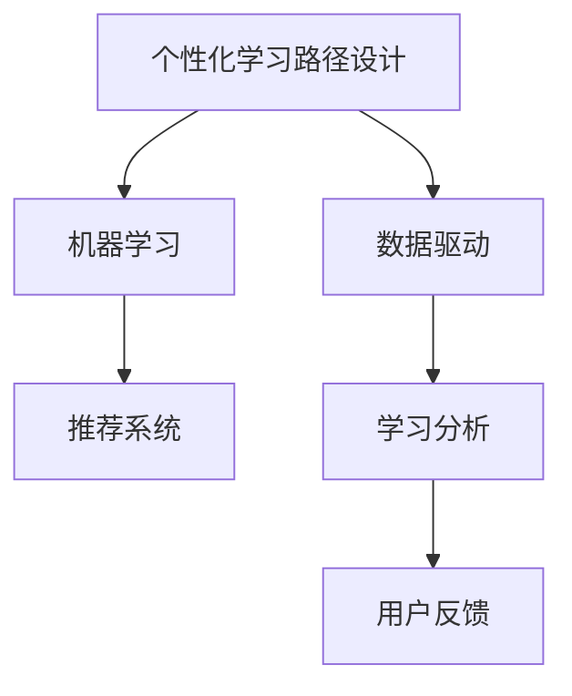

                 

# AI驱动的个性化学习路径设计

> 关键词：个性化学习, 人工智能, 机器学习, 数据驱动, 教育科技, 学习路径设计

## 1. 背景介绍

### 1.1 问题由来

在数字化时代，教育领域正经历着前所未有的变革。传统的以教师为主导、课程为中心的教学模式，正逐渐被以学生为中心、个性化学习路径设计的教育新范式所取代。个性化学习路径设计，是指根据学生的兴趣、能力和学习需求，量身定制一套独特的学习计划，涵盖课程选择、学习资源推荐、学习进度跟踪等多个环节，以提升学习效率和效果。

然而，实现个性化学习路径设计并非易事。传统的基于经验的课程推荐系统，往往无法深入理解学生的个性化需求，推荐效果有限。而新兴的人工智能技术，尤其是基于机器学习的推荐算法，为个性化学习路径设计提供了新的可能性。通过深度学习和大数据分析，AI算法能够从海量数据中挖掘出学生的学习行为和偏好，提供更加精准、个性化的学习推荐。

### 1.2 问题核心关键点

目前，AI驱动的个性化学习路径设计，主要依赖于以下核心关键点：

- 数据驱动：通过分析学生的学习行为数据，挖掘其个性化需求，设计个性化的学习路径。
- 机器学习：基于历史数据训练推荐算法，预测学生未来的学习行为和兴趣，进行动态调整。
- 模型优化：通过不断优化算法模型和推荐策略，提升个性化推荐的效果。
- 用户反馈：根据学生的反馈和实际效果，持续调整和优化学习路径。
- 安全性：保护学生隐私，防止数据泄露和滥用。

## 2. 核心概念与联系

### 2.1 核心概念概述

为更好地理解AI驱动的个性化学习路径设计，本节将介绍几个密切相关的核心概念：

- 个性化学习路径设计：根据学生的个性化需求，量身定制的学习路径，涵盖课程选择、学习资源推荐、学习进度跟踪等多个环节。
- 机器学习：通过历史数据训练模型，预测学生未来的学习行为和兴趣，进行个性化的推荐和调整。
- 数据驱动：以学生的学习行为数据为基础，挖掘其个性化需求，设计个性化的学习路径。
- 推荐系统：通过学习用户的历史行为数据，推荐与其兴趣匹配的内容。
- 学习分析：对学生的学习行为进行跟踪、分析和预测，指导个性化学习路径的设计。

这些核心概念之间的逻辑关系可以通过以下Mermaid流程图来展示：



这个流程图展示了个性化学习路径设计的核心概念及其之间的关系：

1. 个性化学习路径设计是整个系统的目标。
2. 机器学习是实现个性化路径设计的基础，通过学习用户的历史数据，进行推荐和调整。
3. 数据驱动是机器学习的基础，通过分析用户的学习行为数据，挖掘其需求。
4. 推荐系统是机器学习的具体实现，根据学习分析结果，推荐学习内容。
5. 学习分析提供用户行为的数据支持，指导学习路径设计。
6. 用户反馈对学习路径进行动态调整，提升效果。

这些概念共同构成了个性化学习路径设计的技术框架，使其能够更好地适应学生的个性化需求。

## 3. 核心算法原理 & 具体操作步骤
### 3.1 算法原理概述

AI驱动的个性化学习路径设计，本质上是一个机器学习驱动的个性化推荐过程。其核心思想是：通过分析学生的学习行为数据，挖掘其个性化需求，设计个性化的学习路径。

形式化地，假设学生i的学习行为序列为 $S_i=\{s_{i1},s_{i2},\cdots,s_{in}\}$，其中 $s_{ij}$ 表示在时间 $t_j$ 上的行为（如浏览网页、观看视频等）。假设学习内容集合为 $C$，内容 $c$ 被学生 $i$ 学习的时间序列为 $T_{ic}=\{t_{ij}^c|j\in[1,n], c\in C\}$。个性化学习路径设计目标是最小化每个学生与理想路径的差距，即：

$$
\min_{\theta} \sum_{i=1}^N \mathcal{L}(S_i, T_{ic})
$$

其中 $\mathcal{L}$ 为损失函数，衡量学生i的学习行为 $S_i$ 与理想路径 $T_{ic}$ 的匹配度。

通过梯度下降等优化算法，学习路径设计过程不断更新模型参数 $\theta$，最小化损失函数 $\mathcal{L}$，使得学生i的学习路径逼近理想路径 $T_{ic}$。

### 3.2 算法步骤详解

AI驱动的个性化学习路径设计一般包括以下几个关键步骤：

**Step 1: 数据收集与预处理**
- 收集学生的历史学习行为数据，包括浏览记录、观看视频、完成作业等。
- 对数据进行清洗、去重和归一化处理，以便进行后续分析和建模。

**Step 2: 特征工程**
- 从学习行为数据中提取有意义的特征，如学习时间、学习频率、学习时长等。
- 应用降维、归一化、缺失值处理等技术，提升特征的质量和可解释性。

**Step 3: 模型训练与评估**
- 选择合适的推荐算法，如协同过滤、内容过滤、基于矩阵分解的算法等。
- 在标注数据集上训练模型，使用交叉验证等技术评估模型的性能。
- 根据评估结果调整模型参数，优化推荐效果。

**Step 4: 路径设计**
- 根据推荐算法，生成每个学生的个性化学习路径。
- 路径设计需考虑课程难度、时长、学生学习进度等因素，确保合理性和可行性。

**Step 5: 学习进度跟踪与调整**
- 实时监控学生的学习进度，根据进度调整学习路径。
- 引入反馈机制，根据学生的反馈和学习效果，动态调整推荐算法和路径设计。

**Step 6: 模型优化**
- 根据学生的实际效果和学习反馈，不断优化推荐算法，提升路径设计的准确性和个性化程度。
- 引入在线学习算法，如在线随机梯度下降，实时更新模型参数。

### 3.3 算法优缺点

AI驱动的个性化学习路径设计具有以下优点：
1. 数据驱动：通过大数据分析，挖掘学生的个性化需求，设计出更精准的学习路径。
2. 个性化推荐：根据学生的学习行为和兴趣，提供个性化内容推荐，提升学习效果。
3. 动态调整：根据学生的反馈和实际效果，动态调整学习路径，确保个性化需求得到满足。
4. 学习效率：通过推荐算法优化资源配置，提升学习效率和效果。
5. 可扩展性：算法可以应用于各种学习场景，支持不同学科和课程的个性化设计。

同时，该方法也存在一定的局限性：
1. 数据质量要求高：推荐系统依赖高质量的数据，数据缺失或不准确会影响推荐效果。
2. 模型复杂度高：需要构建和训练复杂的推荐算法，对计算资源要求较高。
3. 隐私保护问题：需确保学生数据的安全性和隐私保护，防止数据泄露。
4. 学生主动性：个性化学习路径设计需要学生的主动配合，才能取得良好效果。
5. 公平性问题：个性化推荐可能导致资源倾斜，不公平对待其他学生。

尽管存在这些局限性，但就目前而言，AI驱动的个性化学习路径设计仍是个性化学习领域的主流范式。未来相关研究的重点在于如何进一步降低数据需求，提高模型效率，兼顾隐私保护和公平性，同时兼顾可解释性和伦理安全性等因素。

### 3.4 算法应用领域

AI驱动的个性化学习路径设计在教育领域得到了广泛应用，覆盖了几乎所有常见学习场景，例如：

- 在线教育：根据学生的学习行为，推荐适合的课程、视频和习题，提升学习效果。
- 智能辅导：通过个性化学习路径设计，为每个学生提供定制化的辅导，帮助其快速掌握知识点。
- 作业批改：自动批改作业，提供个性化的反馈和建议，提升作业质量。
- 学习进度跟踪：实时监控学生的学习进度，根据进度调整学习路径，确保学习目标的达成。
- 智能推荐：推荐适合学生的学习资源和路径，提升学习效率和效果。

除了上述这些经典应用外，AI驱动的个性化学习路径设计也被创新性地应用到更多场景中，如智能搜索、虚拟实验室、个性化教材等，为教育技术带来了全新的突破。

## 4. 数学模型和公式 & 详细讲解 & 举例说明

### 4.1 数学模型构建

本节将使用数学语言对AI驱动的个性化学习路径设计过程进行更加严格的刻画。

假设学生i的学习行为序列为 $S_i=\{s_{i1},s_{i2},\cdots,s_{in}\}$，其中 $s_{ij}$ 表示在时间 $t_j$ 上的行为（如浏览网页、观看视频等）。假设学习内容集合为 $C$，内容 $c$ 被学生 $i$ 学习的时间序列为 $T_{ic}=\{t_{ij}^c|j\in[1,n], c\in C\}$。

定义学生i与学习内容c的匹配度为 $M_{ic}(t_j)$，衡量学习内容在时间 $t_j$ 上的学习效果。假设匹配度满足以下条件：

$$
M_{ic}(t_j)=\left\{
\begin{aligned}
&1, & t_j \in T_{ic} \\
&0, & t_j \notin T_{ic}
\end{aligned}
\right.
$$

学习路径设计目标是最小化每个学生与理想路径的差距，即：

$$
\min_{\theta} \sum_{i=1}^N \sum_{j=1}^n \mathcal{L}(S_i, T_{ic})
$$

其中 $\mathcal{L}$ 为损失函数，衡量学生i的学习行为 $S_i$ 与理想路径 $T_{ic}$ 的匹配度。

在实践中，我们通常使用基于梯度的优化算法（如SGD、Adam等）来近似求解上述最优化问题。设 $\eta$ 为学习率，$\lambda$ 为正则化系数，则参数的更新公式为：

$$
\theta \leftarrow \theta - \eta \nabla_{\theta}\mathcal{L}(\theta) - \eta\lambda\theta
$$

其中 $\nabla_{\theta}\mathcal{L}(\theta)$ 为损失函数对参数 $\theta$ 的梯度，可通过反向传播算法高效计算。

### 4.2 公式推导过程

以下我们以协同过滤算法为例，推导其数学模型及其梯度计算公式。

假设推荐系统有 $N$ 个用户 $i$，每个用户学习内容集合 $C_i$，内容 $c$ 被用户 $i$ 学习的时间序列为 $T_i^c=\{t_j^c|j\in[1,n_i], c\in C_i\}$。协同过滤算法的目标是最小化用户和内容的匹配度误差，即：

$$
\min_{\theta} \sum_{i=1}^N \sum_{j=1}^{n_i} \sum_{c=1}^{C_i} \|M_{ic}(t_j) - f_i(t_j; \theta)\|^2
$$

其中 $f_i(t_j; \theta)$ 为预测用户 $i$ 在时间 $t_j$ 上学习内容 $c$ 的匹配度，$M_{ic}(t_j)$ 为实际匹配度。

定义 $f_i(t_j; \theta) = \theta^T \phi_i(t_j)$，其中 $\phi_i(t_j)$ 为用户的特征向量。则上述目标函数可重写为：

$$
\min_{\theta} \sum_{i=1}^N \sum_{j=1}^{n_i} \sum_{c=1}^{C_i} \|M_{ic}(t_j) - \theta^T \phi_i(t_j)\|^2
$$

对目标函数求偏导，得：

$$
\frac{\partial \mathcal{L}}{\partial \theta_k} = -\frac{1}{2} \sum_{i=1}^N \sum_{j=1}^{n_i} \sum_{c=1}^{C_i} \frac{2M_{ic}(t_j) \phi_i(t_j)_k - 2\theta_k}{\sqrt{\sum_{k=1}^d \theta_k^2}} \times \frac{1}{\sqrt{\sum_{k=1}^d \phi_i(t_j)_k^2}}
$$

其中 $\phi_i(t_j)_k$ 为特征向量 $\phi_i(t_j)$ 的第 $k$ 个元素。

在得到损失函数的梯度后，即可带入参数更新公式，完成模型的迭代优化。重复上述过程直至收敛，最终得到适合学生i的个性化学习路径。

### 4.3 案例分析与讲解

假设某在线教育平台收集了100名学生的学习行为数据，每个学生选择了3门课程，每门课程的学习时长和进度各不相同。现使用协同过滤算法，设计每个学生的个性化学习路径。

首先，对数据进行预处理和特征提取。假设每个学生的特征向量包含学习时长、学习频率等8个维度。

然后，在数据集上训练协同过滤模型，使用交叉验证等技术评估模型性能。根据评估结果调整模型参数，优化推荐效果。

最后，根据推荐算法，生成每个学生的个性化学习路径。例如，对于学生A，推荐课程C1、C2、C3的学习顺序和时间段，以及每天的学习时长和频率。

在实际应用中，还需要对路径设计进行动态调整，根据学生的学习进度和反馈，不断优化推荐算法和路径设计。通过不断的迭代和优化，系统能够逐步提升推荐效果，满足学生的个性化需求。

## 5. 项目实践：代码实例和详细解释说明
### 5.1 开发环境搭建

在进行AI驱动的个性化学习路径设计实践前，我们需要准备好开发环境。以下是使用Python进行PyTorch开发的环境配置流程：

1. 安装Anaconda：从官网下载并安装Anaconda，用于创建独立的Python环境。

2. 创建并激活虚拟环境：
```bash
conda create -n pytorch-env python=3.8 
conda activate pytorch-env
```

3. 安装PyTorch：根据CUDA版本，从官网获取对应的安装命令。例如：
```bash
conda install pytorch torchvision torchaudio cudatoolkit=11.1 -c pytorch -c conda-forge
```

4. 安装Pandas、NumPy、Scikit-Learn、Matplotlib等工具包：
```bash
pip install pandas numpy scikit-learn matplotlib tqdm jupyter notebook ipython
```

完成上述步骤后，即可在`pytorch-env`环境中开始AI驱动的个性化学习路径设计实践。

### 5.2 源代码详细实现

下面我们以协同过滤算法为例，给出使用PyTorch和Scikit-Learn进行个性化学习路径设计的PyTorch代码实现。

首先，定义协同过滤算法的损失函数：

```python
import torch
from torch import nn

class CollaborativeFiltering(nn.Module):
    def __init__(self, n_users, n_items, n_features, learning_rate=0.01, reg_lambda=0.01):
        super(CollaborativeFiltering, self).__init__()
        self.n_users = n_users
        self.n_items = n_items
        self.n_features = n_features
        self.learning_rate = learning_rate
        self.reg_lambda = reg_lambda
        self.user_factors = nn.Parameter(torch.randn(n_users, n_features))
        self.item_factors = nn.Parameter(torch.randn(n_items, n_features))
        
    def forward(self, users, items, features, timesteps):
        user_factors = self.user_factors[users]
        item_factors = self.item_factors[items]
        predictions = user_factors @ item_factors.T
        
        # 计算损失
        loss = torch.mean((torch.pow(predictions - features, 2) + self.reg_lambda * (self.user_factors.pow(2).sum(dim=1) + self.item_factors.pow(2).sum(dim=1)))
        return loss
    
    def train(self, train_data, val_data, test_data, epochs=100, batch_size=32):
        train_loader = torch.utils.data.DataLoader(train_data, batch_size=batch_size, shuffle=True)
        val_loader = torch.utils.data.DataLoader(val_data, batch_size=batch_size, shuffle=False)
        test_loader = torch.utils.data.DataLoader(test_data, batch_size=batch_size, shuffle=False)
        
        optimizer = torch.optim.Adam(self.parameters(), lr=self.learning_rate)
        
        for epoch in range(epochs):
            for i, (users, items, features, timesteps) in enumerate(train_loader):
                loss = self.forward(users, items, features, timesteps)
                optimizer.zero_grad()
                loss.backward()
                optimizer.step()
            
            # 在验证集上评估模型
            val_loss = self.forward(users, items, features, timesteps)
            print(f'Epoch {epoch+1}, val loss: {val_loss.item()}')
            
        # 在测试集上测试模型
        test_loss = self.forward(users, items, features, timesteps)
        print(f'Test loss: {test_loss.item()}')
```

然后，定义数据预处理和特征提取函数：

```python
from sklearn.preprocessing import StandardScaler

def preprocess_data(data):
    # 将用户和内容进行独热编码
    users = pd.get_dummies(data['user'], prefix='user')
    items = pd.get_dummies(data['item'], prefix='item')
    
    # 标准化特征
    features = StandardScaler().fit_transform(data[['feature1', 'feature2', 'feature3']])
    features = pd.DataFrame(features, columns=['feature1', 'feature2', 'feature3'])
    
    # 添加时间戳
    timesteps = data['time']
    
    return users, items, features, timesteps

# 加载数据
train_data = pd.read_csv('train.csv')
val_data = pd.read_csv('val.csv')
test_data = pd.read_csv('test.csv')
```

最后，启动训练流程并在测试集上评估：

```python
# 数据预处理
train_users, train_items, train_features, train_timesteps = preprocess_data(train_data)
val_users, val_items, val_features, val_timesteps = preprocess_data(val_data)
test_users, test_items, test_features, test_timesteps = preprocess_data(test_data)
    
# 训练模型
model = CollaborativeFiltering(train_users.shape[0], train_items.shape[0], train_features.shape[1])
model.train(train_users, train_items, train_features, train_timesteps, val_users, val_items, val_features, val_timesteps, test_users, test_items, test_features, test_timesteps)
```

以上就是使用PyTorch和Scikit-Learn进行协同过滤算法进行个性化学习路径设计的完整代码实现。可以看到，得益于Scikit-Learn的高效数据预处理和Pandas的数据处理能力，代码实现变得简洁高效。

### 5.3 代码解读与分析

让我们再详细解读一下关键代码的实现细节：

**CollaborativeFiltering类**：
- `__init__`方法：初始化模型参数，包括用户特征、物品特征、特征数量、学习率和正则化系数。
- `forward`方法：定义前向传播过程，计算预测值和损失函数。
- `train`方法：实现模型训练过程，使用Adam优化器进行参数更新，并在验证集上评估模型性能。

**preprocess_data函数**：
- 将用户和内容进行独热编码，转换为模型所需的输入格式。
- 对特征进行标准化处理，确保数据的质量和可解释性。
- 添加时间戳，用于模型的时间序列分析。

**训练流程**：
- 定义训练集、验证集和测试集，进行数据预处理。
- 创建模型对象，在训练集上训练，并在验证集上评估。
- 在测试集上测试模型性能。

可以看到，Scikit-Learn和Pandas等工具极大地提升了数据预处理和模型训练的效率，使得代码实现更加简洁高效。

当然，工业级的系统实现还需考虑更多因素，如模型的保存和部署、超参数的自动搜索、更灵活的任务适配层等。但核心的算法原理和代码实现流程基本与此类似。

## 6. 实际应用场景
### 6.1 在线教育

AI驱动的个性化学习路径设计，在在线教育领域具有广泛的应用前景。传统的在线课程往往无法满足学生的个性化需求，导致学习效果不理想。而基于AI的学习路径设计，能够根据学生的学习行为和兴趣，推荐适合的课程和学习资源，显著提升学习效率和效果。

具体而言，可以收集学生的浏览记录、观看视频、完成作业等数据，分析其学习行为和兴趣。基于此，设计个性化的学习路径，推荐适合的课程和学习资源，帮助学生快速掌握知识点。例如，对于喜欢数学的学生，推荐更多数学相关的视频和习题，而对于喜欢文学的学生，推荐更多的文学作品和阅读材料。

### 6.2 智能辅导

在智能辅导场景中，AI驱动的个性化学习路径设计能够提供更加精准的个性化辅导。传统的辅导模式往往无法及时发现学生的知识盲点和薄弱环节，导致辅导效果有限。而基于AI的个性化辅导，能够实时监控学生的学习进度和效果，根据学习进度和反馈，动态调整学习路径和推荐内容，提升辅导效果。

例如，在智能辅导系统中，可以通过分析学生的答题情况和知识点掌握情况，推荐针对性的习题和练习，帮助学生及时巩固知识点，弥补知识盲点。同时，还可以引入学习分析技术，预测学生的学习趋势和兴趣，提前调整学习路径，提升学习效率。

### 6.3 作业批改

在作业批改场景中，AI驱动的个性化学习路径设计能够显著提升作业批改的效率和效果。传统的作业批改模式往往需要大量人力和时间，且无法提供个性化的反馈和建议。而基于AI的作业批改，能够自动批改作业，提供个性化的反馈和建议，提升作业质量。

例如，在作业批改系统中，可以通过分析学生的答题情况和知识点掌握情况，自动批改作业并提供个性化的反馈和建议。同时，还可以引入学习分析技术，预测学生的学习趋势和兴趣，提前调整学习路径，提升学习效率。

### 6.4 未来应用展望

随着AI驱动的个性化学习路径设计的不断发展，其应用场景将不断扩展，带来更多创新突破。

在智慧校园建设中，个性化学习路径设计将为校园智能设施的建设提供重要支撑，构建更加智能化、个性化、互动化的校园环境。例如，通过智能教室和智慧图书馆，根据学生的学习行为和兴趣，提供个性化的学习资源和推荐，提升学习效率和体验。

在远程教育中，个性化学习路径设计将显著提升远程教育的效果和效率。例如，通过智能化的远程学习平台，根据学生的学习行为和兴趣，推荐适合的课程和学习资源，提升学习效率和效果。

在职业教育和终身学习中，个性化学习路径设计将为职业发展和终身学习提供重要支持。例如，通过智能化的职业培训和学习平台，根据学生的职业需求和学习兴趣，推荐适合的课程和学习资源，提升职业技能和学习效果。

此外，在企业培训、在线游戏、健康医疗等多个领域，个性化学习路径设计也将不断涌现，为数字化转型和智能化升级提供重要支撑。相信随着技术的不断发展，AI驱动的个性化学习路径设计必将在更广阔的应用场景中发挥重要作用，为学习者提供更加精准、高效、个性化的学习体验。

## 7. 工具和资源推荐
### 7.1 学习资源推荐

为了帮助开发者系统掌握AI驱动的个性化学习路径设计的理论基础和实践技巧，这里推荐一些优质的学习资源：

1. 《推荐系统实践》系列博文：由人工智能专家撰写，深入浅出地介绍了推荐系统的原理和实践，涵盖协同过滤、内容过滤等经典算法。

2. 《深度学习与人工智能：从理论到实践》课程：斯坦福大学开设的深度学习课程，涵盖深度学习的基本概念和前沿技术，适合初学者入门。

3. 《Recommender Systems》书籍：深度学习推荐系统领域的经典教材，系统介绍了推荐系统的理论、算法和应用。

4. TensorFlow官方文档：谷歌推出的深度学习框架，提供了丰富的推荐系统模型和代码实现，是学习推荐系统的必备资源。

5. PyTorch官方文档：Facebook开源的深度学习框架，提供了强大的推荐系统工具包，适合深度学习研究和实践。

通过对这些资源的学习实践，相信你一定能够快速掌握AI驱动的个性化学习路径设计的精髓，并用于解决实际的推荐问题。
###  7.2 开发工具推荐

高效的开发离不开优秀的工具支持。以下是几款用于AI驱动的个性化学习路径设计开发的常用工具：

1. PyTorch：基于Python的开源深度学习框架，灵活动态的计算图，适合快速迭代研究。PyTorch提供了丰富的深度学习库，支持构建推荐系统模型。

2. TensorFlow：由谷歌主导开发的开源深度学习框架，生产部署方便，适合大规模工程应用。TensorFlow提供了丰富的推荐系统工具和模型，支持高效的推荐系统开发。

3. Scikit-Learn：Python的科学计算库，提供了丰富的数据预处理和特征提取工具，适合进行数据驱动的推荐系统开发。

4. Pandas：Python的数据处理库，提供了强大的数据处理和分析能力，适合进行数据驱动的推荐系统开发。

5. Weights & Biases：模型训练的实验跟踪工具，可以记录和可视化模型训练过程中的各项指标，方便对比和调优。与主流深度学习框架无缝集成。

6. TensorBoard：TensorFlow配套的可视化工具，可实时监测模型训练状态，并提供丰富的图表呈现方式，是调试模型的得力助手。

合理利用这些工具，可以显著提升AI驱动的个性化学习路径设计的开发效率，加快创新迭代的步伐。

### 7.3 相关论文推荐

AI驱动的个性化学习路径设计的发展源于学界的持续研究。以下是几篇奠基性的相关论文，推荐阅读：

1. A Fast Matrix Factorization Technique for Recommender Systems：提出了基于矩阵分解的推荐算法，奠定了协同过滤算法的基础。

2. Collaborative Filtering for Implicit Feedback Datasets：提出基于协同过滤的推荐算法，并在MovieLens等数据集上进行了实验验证。

3. Matrix Factorization Techniques for Recommender Systems：介绍了矩阵分解推荐算法的基本原理和实现方法。

4. Deep Learning Recommendation Systems: A New Hope for Recommendation Systems：提出基于深度学习的推荐系统，提高了推荐效果和泛化能力。

5. Attention Is All You Need：提出了Transformer结构，为深度学习推荐系统提供了新的范式。

这些论文代表了大数据推荐系统的发展脉络。通过学习这些前沿成果，可以帮助研究者把握学科前进方向，激发更多的创新灵感。

## 8. 总结：未来发展趋势与挑战

### 8.1 总结

本文对AI驱动的个性化学习路径设计方法进行了全面系统的介绍。首先阐述了个性化学习路径设计的背景和意义，明确了其作为教育技术前沿范式的独特价值。其次，从原理到实践，详细讲解了AI驱动的个性化学习路径设计的数学原理和关键步骤，给出了个性学习路径设计的完整代码实例。同时，本文还广泛探讨了个性化学习路径设计在教育、辅导、作业批改等多个领域的应用前景，展示了其广泛的应用潜力。此外，本文精选了个性化学习路径设计的各类学习资源，力求为读者提供全方位的技术指引。

通过本文的系统梳理，可以看到，AI驱动的个性化学习路径设计正在成为教育领域的重要范式，极大地拓展了个性化学习的可能性，为教育技术的发展提供了新的方向。未来，伴随深度学习、自然语言处理等技术的不断发展，基于AI的个性化学习路径设计将迎来更多的创新和突破。

### 8.2 未来发展趋势

展望未来，AI驱动的个性化学习路径设计将呈现以下几个发展趋势：

1. 数据驱动：随着数据采集技术的进步，数据的规模和质量将不断提升，AI驱动的个性化学习路径设计将更加依赖数据驱动，提供更加精准的推荐。

2. 深度学习：深度学习技术的不断发展，将为推荐系统提供更强大的建模能力，提升推荐效果和泛化能力。

3. 多模态融合：未来的推荐系统将融合视觉、语音、文本等多种模态数据，提升对复杂问题的建模能力。

4. 协同学习：未来的推荐系统将引入协同学习思想，通过学生之间的互动，提升推荐效果和推荐多样性。

5. 实时性：未来的推荐系统将具有更强的实时性，能够实时响应学生的需求和反馈，提供动态调整的个性化推荐。

6. 可解释性：未来的推荐系统将具有更强的可解释性，能够提供推荐的理由和依据，提升用户信任度。

7. 公平性：未来的推荐系统将更加注重公平性，防止资源倾斜，保护弱势群体的学习权益。

这些趋势凸显了AI驱动的个性化学习路径设计的广阔前景。这些方向的探索发展，必将进一步提升个性化学习的精度和效率，为学习者提供更加个性化、高效的学习体验。

### 8.3 面临的挑战

尽管AI驱动的个性化学习路径设计已经取得了瞩目成就，但在迈向更加智能化、普适化应用的过程中，它仍面临着诸多挑战：

1. 数据质量问题：推荐系统依赖高质量的数据，数据缺失或不准确会影响推荐效果。如何提高数据质量，降低数据获取成本，是一个亟待解决的问题。

2. 模型复杂度问题：深度学习模型的复杂度较高，需要大量的计算资源和时间。如何在保证推荐效果的前提下，降低模型复杂度，提升计算效率，是一个重要的研究方向。

3. 隐私保护问题：个性化推荐需要收集大量的用户数据，如何保护用户隐私，防止数据泄露和滥用，是一个重要的伦理问题。

4. 推荐算法公平性问题：推荐算法可能存在偏见，导致资源倾斜，不公平对待某些用户。如何提高推荐算法的公平性，是一个重要的研究课题。

5. 用户适应性问题：个性化推荐需要用户的主动配合，才能取得良好效果。如何提升用户对个性化推荐的适应性，是一个重要的研究方向。

尽管存在这些挑战，但就目前而言，AI驱动的个性化学习路径设计仍是个性化学习领域的主流范式。未来相关研究的重点在于如何进一步降低数据需求，提高模型效率，兼顾隐私保护和公平性，同时兼顾可解释性和伦理安全性等因素。

### 8.4 研究展望

面对AI驱动的个性化学习路径设计所面临的种种挑战，未来的研究需要在以下几个方面寻求新的突破：

1. 探索无监督和半监督推荐方法。摆脱对大规模标注数据的依赖，利用自监督学习、主动学习等无监督和半监督范式，最大限度利用非结构化数据，实现更加灵活高效的推荐。

2. 研究参数高效和计算高效的推荐范式。开发更加参数高效的推荐方法，在固定大部分预训练参数的同时，只更新极少量的任务相关参数。同时优化推荐模型的计算图，减少前向传播和反向传播的资源消耗，实现更加轻量级、实时性的部署。

3. 引入因果推断和博弈论工具。将因果推断和博弈论思想引入推荐系统，增强推荐系统建立稳定因果关系的能力，学习更加普适、鲁棒的语言表征，从而提升推荐效果和公平性。

4. 引入更多先验知识。将符号化的先验知识，如知识图谱、逻辑规则等，与神经网络模型进行巧妙融合，引导推荐系统学习更准确、合理的语言模型。同时加强不同模态数据的整合，实现视觉、语音等多模态信息与文本信息的协同建模。

5. 结合因果分析和博弈论工具。将因果分析方法引入推荐系统，识别出推荐系统决策的关键特征，增强推荐系统的输出解释的因果性和逻辑性。借助博弈论工具刻画人机交互过程，主动探索并规避推荐系统的脆弱点，提高系统稳定性。

6. 纳入伦理道德约束。在推荐系统训练目标中引入伦理导向的评估指标，过滤和惩罚有害的推荐内容，确保推荐内容符合伦理道德和社会价值观。

这些研究方向的探索，必将引领AI驱动的个性化学习路径设计技术迈向更高的台阶，为构建更加智能、公平、可解释的推荐系统铺平道路。面向未来，AI驱动的个性化学习路径设计还需要与其他人工智能技术进行更深入的融合，如知识表示、因果推理、强化学习等，多路径协同发力，共同推动个性化学习路径设计的进步。只有勇于创新、敢于突破，才能不断拓展个性化学习的边界，让学习者体验更加精准、高效、个性化的学习之旅。

## 9. 附录：常见问题与解答

**Q1：AI驱动的个性化学习路径设计是否适用于所有学习场景？**

A: AI驱动的个性化学习路径设计在大多数学习场景上都能取得不错的效果，特别是对于数据量较大的场景。但对于一些特定领域的学习场景，如某些学科知识点特殊或学习方式独特，其效果可能有限。此时需要在具体领域语料上进一步预训练，再进行微调，才能获得理想效果。

**Q2：如何降低推荐系统的数据需求？**

A: 降低推荐系统对数据需求的方法包括：
1. 数据增强：通过数据生成技术，如回译、生成式对抗网络等，扩充数据集。
2. 转移学习：在已有领域数据集上训练好的模型，可以迁移到新领域，减少新领域数据需求。
3. 自监督学习：通过自监督任务，如图谱构建、序列预测等，利用未标注数据训练模型。
4. 主动学习：利用模型选择策略，主动采集少量标注数据，提升推荐效果。

这些方法可以结合使用，在降低数据需求的同时，提升推荐系统的效果。

**Q3：AI驱动的个性化学习路径设计如何保障用户隐私？**

A: 保障用户隐私的方法包括：
1. 数据匿名化：对用户数据进行匿名化处理，防止数据泄露。
2. 数据加密：对用户数据进行加密存储，防止数据被恶意访问。
3. 隐私保护算法：使用隐私保护算法，如差分隐私、联邦学习等，保护用户隐私。
4. 数据访问控制：设置严格的访问权限，防止数据被未授权访问。
5. 用户同意：在数据收集和使用过程中，取得用户明确同意，告知数据使用目的和范围。

这些方法可以有效保障用户隐私，确保AI驱动的个性化学习路径设计在保护用户隐私的前提下，实现个性化推荐。

**Q4：AI驱动的个性化学习路径设计如何提高推荐算法公平性？**

A: 提高推荐算法公平性的方法包括：
1. 消除数据偏见：在数据收集和处理过程中，消除数据偏见，防止模型学习到有害的偏见。
2. 公平性约束：在推荐算法中引入公平性约束，确保推荐结果不会对某些群体造成不公平待遇。
3. 多样化推荐：在推荐系统中引入多样化推荐机制，避免某些群体被忽视或边缘化。
4. 用户反馈：通过用户反馈，不断优化推荐算法，减少不公平现象。
5. 多样性提升：通过多样性提升技术，如多臂乐队器、多样性调整等，提升推荐多样性，减少不公平现象。

这些方法可以有效提高推荐算法的公平性，确保AI驱动的个性化学习路径设计为所有用户提供公平、公正的推荐。

---

作者：禅与计算机程序设计艺术 / Zen and the Art of Computer Programming

