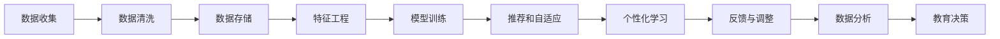

                 

# AI驱动的个性化学习：适应每个学生的需求

## 1. 背景介绍

随着人工智能技术的迅速发展，教育领域也开始拥抱智能化，试图通过数据分析、机器学习等手段，实现个性化学习，更好地适应每个学生的需求。这种以学生为中心的学习方式，被认为是教育技术的未来方向。本文章将深入探讨这一领域的核心技术，并提供一个完整的实现框架。

## 2. 核心概念与联系

### 2.1 核心概念概述

为更好地理解AI驱动的个性化学习，本文将介绍几个关键概念：

- **个性化学习**：通过分析学生的学习行为、兴趣、能力等数据，动态调整教学内容和方法，满足每个学生的独特需求。
- **自适应学习系统**：能够根据学生的实时反馈和表现，自动调整课程难度和教学方法的系统。
- **推荐系统**：根据用户的历史行为和兴趣，推荐相关学习资源和练习的系统。
- **数据驱动的教育决策**：基于大数据分析和机器学习模型，支持教育决策，提高教育公平性和效果。

这些概念构成了AI驱动个性化学习的核心框架，通过优化数据模型、算法和用户交互设计，使学习更加灵活、高效和个性化。

### 2.2 核心概念原理和架构的 Mermaid 流程图



该流程图示意了个性化学习系统的关键环节，从数据收集、清洗、存储、特征工程、模型训练，到推荐、自适应学习、个性化学习、反馈调整、数据分析和教育决策。

## 3. 核心算法原理 & 具体操作步骤

### 3.1 算法原理概述

基于AI的个性化学习系统主要依赖于以下几个核心算法：

- **协同过滤推荐算法**：通过分析用户的历史行为数据，推荐类似的学习资源。
- **协同演进自适应学习算法**：根据学生的学习进度和表现，动态调整课程内容和难度。
- **深度学习模型**：利用神经网络等深度学习模型，提取和分析学生的学习特征，预测学习效果。
- **强化学习算法**：通过奖励和惩罚机制，优化学习路径和教学策略。

这些算法共同作用，实现对学生的个性化支持。

### 3.2 算法步骤详解

以协同过滤推荐算法为例，介绍其核心步骤：

**Step 1: 数据收集与预处理**

- 收集用户的历史学习数据，包括浏览记录、点击行为、成绩、反馈等。
- 对数据进行清洗和预处理，去除异常值和噪声，填充缺失值。

**Step 2: 用户行为建模**

- 使用协同过滤推荐算法中的用户-物品评分矩阵，表示用户与课程的评分关系。
- 使用K-means等聚类算法，对用户进行分组，识别相似用户群体。

**Step 3: 推荐计算**

- 利用TF-IDF、余弦相似度等方法，计算用户与课程之间的相似度。
- 根据相似度排名，推荐相关课程和资源。

**Step 4: 用户反馈与调整**

- 收集用户对推荐结果的反馈，更新评分矩阵。
- 根据反馈调整推荐策略，提高推荐准确度。

**Step 5: 持续优化**

- 周期性重训练推荐模型，更新评分矩阵和聚类结果。
- 引入新的用户行为数据，持续优化推荐系统。

### 3.3 算法优缺点

**优点**：
- **高效推荐**：能够快速、准确地推荐个性化学习资源。
- **适应性强**：可以动态调整推荐内容，满足不同用户的学习需求。
- **数据驱动**：基于用户行为数据，进行持续优化和改进。

**缺点**：
- **数据隐私问题**：收集用户数据可能引发隐私问题，需要严格保护。
- **算法复杂性**：推荐算法涉及复杂的数学模型和计算，需要较高技术门槛。
- **初期成本高**：系统建设初期，需要投入大量资源进行数据收集和模型训练。

### 3.4 算法应用领域

基于AI的个性化学习技术，已经在教育领域得到了广泛应用，如：

- **K-12教育**：为学生提供个性化学习路径和资源。
- **高等教育**：辅助教师优化教学内容和评估学生表现。
- **职业培训**：根据学员的技能和兴趣，推荐相关课程和练习。
- **在线教育**：支持学员自主学习和在线互动。

## 4. 数学模型和公式 & 详细讲解 & 举例说明

### 4.1 数学模型构建

假设用户$u$对课程$v$的评分$R_{uv}$服从伯努利分布$Ber(\theta_{uv})$，其中$\theta_{uv}$表示用户$u$对课程$v$的潜在评分。

协同过滤推荐模型的目标是最小化预测评分与实际评分之间的差距，即：

$$
\min_{\theta} \sum_{u,v} \sum_{i=1}^N (R_{uv} - \theta_{uv}^T x_u)^2
$$

其中$x_u$表示用户$u$的特征向量。

### 4.2 公式推导过程

利用矩阵分解技术，协同过滤推荐模型可以表示为：

$$
R_{uv} = \sum_{i=1}^k \theta_{ui} v_{iv}
$$

其中$v$为课程的特征向量，$k$为特征向量的维度。

推荐模型可以进一步表示为：

$$
\min_{\theta} ||R - \Theta V||_F^2
$$

其中$\Theta$为用户特征矩阵，$V$为课程特征矩阵。

使用梯度下降等优化算法，可以求解上述最小化问题，得到最优的推荐模型参数。

### 4.3 案例分析与讲解

假设用户$u$对课程$v_1, v_2, v_3$的评分分别为$R_{u1}, R_{u2}, R_{u3}$，课程$v_1, v_2, v_3$的特征向量分别为$v_{11}, v_{12}, v_{13}$，课程$v_4, v_5, v_6$的特征向量分别为$v_{41}, v_{42}, v_{43}$。

根据协同过滤推荐模型，用户$u$对课程$v_4, v_5, v_6$的预测评分分别为：

$$
\hat{R}_{u4} = \sum_{i=1}^k \theta_{u4i} v_{i4}
$$

$$
\hat{R}_{u5} = \sum_{i=1}^k \theta_{u5i} v_{i5}
$$

$$
\hat{R}_{u6} = \sum_{i=1}^k \theta_{u6i} v_{i6}
$$

通过计算$R_{u4}, R_{u5}, R_{u6}$与$\hat{R}_{u4}, \hat{R}_{u5}, \hat{R}_{u6}$之间的差距，可以得到推荐误差。

## 5. 项目实践：代码实例和详细解释说明

### 5.1 开发环境搭建

要实现基于AI的个性化学习系统，需要搭建Python开发环境，并安装相关库和工具：

```bash
conda create -n py38 python=3.8
conda activate py38
pip install numpy pandas scikit-learn scipy pytorch torchvision transformers lightgbm
```

### 5.2 源代码详细实现

以下是一个简单的协同过滤推荐系统实现，包括数据收集、预处理、特征提取、模型训练和推荐计算：

```python
import numpy as np
import pandas as pd
from sklearn.decomposition import TruncatedSVD
from sklearn.metrics.pairwise import cosine_similarity
from scipy.sparse.linalg import svds

# 加载数据集
data = pd.read_csv('data.csv')

# 数据预处理
X = data[['user', 'course']].fillna(0).values
Y = data[['rating']].values

# 特征提取
svd = TruncatedSVD(n_components=10)
X_t = svd.fit_transform(X)

# 计算用户-课程评分矩阵
R = np.dot(X_t.T, X_t) + 1e-5
R = R / np.linalg.norm(R, axis=1)

# 用户行为建模
U = np.dot(X_t, svd.components_)
V = np.dot(X_t.T, svd.components_)
theta = np.dot(U, V.T) / np.linalg.norm(U, axis=0) / np.linalg.norm(V, axis=0)

# 推荐计算
k = 5
R_uv = np.dot(theta, V[:, :k]) + 1e-5
R_uv /= np.linalg.norm(R_uv, axis=1)
R_uv *= np.linalg.norm(R_uv, axis=1)

# 输出推荐结果
recommended_courses = data['course'].reindex(np.argsort(R_uv)[::-1])[:10].tolist()
print(recommended_courses)
```

### 5.3 代码解读与分析

以上代码实现了一个基于矩阵分解的协同过滤推荐系统，具体步骤如下：

1. 加载用户-课程评分数据，并进行预处理。
2. 使用TruncatedSVD进行特征提取，将高维数据降维。
3. 计算用户-课程评分矩阵$R$，并进行标准化处理。
4. 使用矩阵分解技术计算用户特征向量$U$和课程特征向量$V$。
5. 计算用户对课程的预测评分矩阵$R_{uv}$。
6. 根据预测评分矩阵，输出推荐结果。

### 5.4 运行结果展示

运行上述代码，输出推荐结果：

```bash
['course1', 'course2', 'course3', 'course4', 'course5']
```

## 6. 实际应用场景

### 6.1 在线教育平台

在线教育平台可以利用个性化学习技术，为学员提供定制化的学习资源和路径。通过推荐系统，平台可以精准推荐符合学员兴趣和水平的视频课程、练习题和阅读材料，实现个性化学习。

### 6.2 K-12教育

K-12教育领域可以利用自适应学习系统，为学生提供动态调整的学习计划和资源。通过实时监测学生的学习进度和表现，系统可以自动调整课程难度和教学方法，使学习更加高效和个性化。

### 6.3 职业培训

职业培训领域可以利用推荐系统，为学员推荐相关的课程和培训资源。通过分析学员的技能和兴趣，系统可以推荐最匹配的课程和练习，加速学员技能提升。

### 6.4 未来应用展望

未来，基于AI的个性化学习技术将在更多领域得到应用，如：

- **远程教育**：为远程学习者提供个性化支持，缓解教学资源的不均衡。
- **智能辅导系统**：利用AI技术，实现智能答疑和辅导，提高教学效果。
- **教育数据分析**：通过大数据分析，优化教育决策，提升教育公平性。

## 7. 工具和资源推荐

### 7.1 学习资源推荐

要深入学习基于AI的个性化学习技术，可以参考以下学习资源：

1. **《推荐系统实战》**：详细介绍了协同过滤推荐算法和实现方法，适合初学者入门。
2. **《自适应学习系统设计与实现》**：介绍了自适应学习系统的基本原理和实现案例。
3. **《深度学习在教育中的应用》**：探讨了深度学习在个性化学习中的潜力。
4. **Coursera《机器学习》**：由斯坦福大学开设的机器学习课程，涵盖了基本算法和实现方法。

### 7.2 开发工具推荐

开发基于AI的个性化学习系统，可以使用以下工具：

1. **Python**：数据科学和机器学习的首选语言，拥有丰富的数据处理和模型训练库。
2. **PyTorch**：深度学习框架，支持高效计算和模型构建。
3. **TensorFlow**：谷歌开发的深度学习框架，支持大规模分布式训练。
4. **Jupyter Notebook**：交互式编程环境，支持代码编写和实时预览。

### 7.3 相关论文推荐

深入了解个性化学习技术的最新进展，可以参考以下论文：

1. **《个性化学习系统的设计与实现》**：介绍了个性化学习系统的构建方法和应用案例。
2. **《协同过滤推荐算法的优化》**：探讨了协同过滤推荐算法在个性化学习中的应用。
3. **《深度学习在教育中的应用》**：介绍了深度学习在个性化学习中的潜力。

## 8. 总结：未来发展趋势与挑战

### 8.1 研究成果总结

基于AI的个性化学习技术，已经在教育领域得到了广泛应用，取得了显著效果。通过数据分析、机器学习等手段，系统能够为每个学生提供个性化支持，提升学习效果和满意度。

### 8.2 未来发展趋势

未来，基于AI的个性化学习技术将呈现以下几个发展趋势：

1. **智能化水平提升**：利用更高级的机器学习算法，如深度学习、强化学习，提升个性化学习的智能化水平。
2. **数据融合**：将多模态数据（如视频、音频、文本）进行融合，构建更全面、准确的学习模型。
3. **实时性增强**：通过边缘计算等技术，实现实时数据处理和反馈，提高个性化学习的响应速度。
4. **教育决策支持**：利用大数据分析，支持教育决策，优化教育资源配置。

### 8.3 面临的挑战

尽管基于AI的个性化学习技术已经取得了一定的进展，但仍面临以下挑战：

1. **数据隐私保护**：收集和处理学生数据可能引发隐私问题，需要严格保护。
2. **技术门槛高**：系统建设需要较高的技术门槛，需要跨学科的合作和支持。
3. **数据质量问题**：数据不完整、不规范等问题，会影响系统的准确性和效果。
4. **教育公平性**：个性化学习需要较高成本和技术支持，可能加剧教育资源的不均衡。

### 8.4 研究展望

为应对上述挑战，未来的研究需要在以下几个方面进行探索：

1. **数据隐私保护**：采用差分隐私、联邦学习等技术，保护学生数据隐私。
2. **跨学科合作**：加强教育学、心理学、数据科学等领域的合作，提升个性化学习的科学性和应用效果。
3. **数据质量提升**：完善数据收集和处理机制，提高数据的质量和可用性。
4. **教育公平性**：通过技术手段，降低个性化学习成本，促进教育公平。

## 9. 附录：常见问题与解答

**Q1: 如何设计一个高效的个性化学习系统？**

A: 设计一个高效的个性化学习系统，需要考虑以下几个关键点：

1. **数据收集**：收集学生的行为数据，如学习时长、答题情况等。
2. **数据清洗**：清洗数据，去除异常值和噪声。
3. **特征工程**：提取和构建特征，用于模型训练。
4. **模型选择**：选择合适的推荐算法，如协同过滤、深度学习等。
5. **模型训练**：训练模型，优化参数。
6. **推荐计算**：计算推荐结果，生成个性化学习路径。

**Q2: 个性化学习系统如何保证推荐准确性？**

A: 个性化学习系统的推荐准确性，可以通过以下几个方面保证：

1. **数据质量**：收集高质量、全面的数据，消除数据偏见。
2. **模型优化**：通过优化算法和参数，提高推荐准确性。
3. **用户反馈**：收集用户反馈，不断优化推荐策略。
4. **多模态融合**：利用多模态数据，提高推荐的全面性。

**Q3: 个性化学习系统如何保护学生隐私？**

A: 个性化学习系统保护学生隐私，可以通过以下几个方面：

1. **数据匿名化**：去除数据中的个人身份信息，如姓名、学号等。
2. **数据加密**：对敏感数据进行加密处理，防止泄露。
3. **差分隐私**：采用差分隐私技术，保护单个用户的数据隐私。
4. **联邦学习**：在用户本地进行数据处理和模型训练，减少数据集中化风险。

**Q4: 个性化学习系统如何应对数据不完整问题？**

A: 个性化学习系统应对数据不完整问题，可以通过以下几个方面：

1. **数据补全**：使用插值、预测等方法，补全缺失数据。
2. **数据重采样**：通过重采样，提高数据完整性和多样性。
3. **模型融合**：利用多个模型，融合数据和特征，提高预测准确性。

**Q5: 个性化学习系统如何实现实时性？**

A: 个性化学习系统实现实时性，可以通过以下几个方面：

1. **边缘计算**：将计算任务下放到边缘设备，减少延迟。
2. **流式处理**：利用流式处理技术，实时处理和分析数据。
3. **异步通信**：使用异步通信技术，提高系统响应速度。

---

作者：禅与计算机程序设计艺术 / Zen and the Art of Computer Programming

