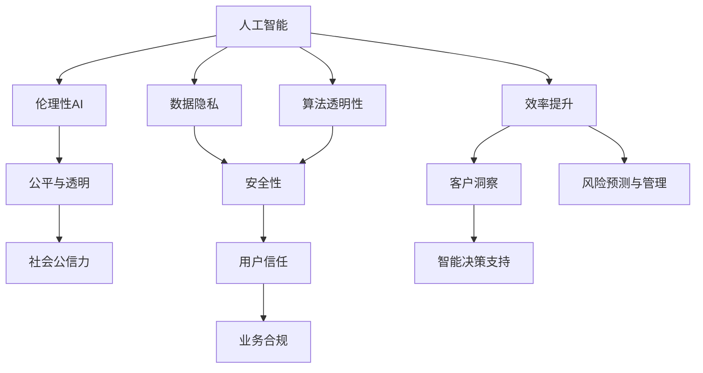

                 

# AI驱动的创新：人类计算在商业中的道德考虑因素与应用前景趋势分析预测

> 关键词：人工智能,商业创新,道德考虑,人类计算,数据隐私,伦理治理,趋势预测

## 1. 背景介绍

### 1.1 问题由来

人工智能（AI）技术的迅猛发展已经深刻改变了各行各业的运营模式。在商业领域，AI的应用从自动化、个性化推荐、客户服务、智能供应链到风险管理等方方面面，显著提升了企业效率和竞争力。然而，随着AI技术的普及，其伦理道德问题也日益突显。特别是在人类计算（Human Computation）的背景下，如何处理数据隐私、算法透明性和安全性等道德问题，成为业界和学术界亟待解决的重大挑战。

### 1.2 问题核心关键点

AI驱动的商业创新主要集中在以下几个方面：
- **自动化与效率提升**：利用AI优化流程，减少人力成本。
- **客户洞察与个性化推荐**：通过分析大量数据，提供精准的个性化服务。
- **智能决策支持**：AI辅助管理层做出更科学的决策。
- **风险预测与管理**：在金融、保险等领域应用AI进行风险评估和管理。

尽管AI带来了巨大的商业价值，但其对隐私、安全性和伦理的潜在威胁也引起了广泛关注。如何平衡技术进步与社会伦理，成为当下AI应用的关键考量点。

### 1.3 问题研究意义

对AI驱动的商业创新中涉及的道德问题进行系统研究，具有重要的理论和实际意义：

1. **促进公平与透明**：确保AI系统公平、透明，避免歧视和偏见，提高社会公信力。
2. **保障数据隐私**：合理管理与使用数据，保护用户隐私，赢得用户信任。
3. **增强安全性**：确保AI系统安全性，避免被恶意攻击或滥用。
4. **推动伦理性AI发展**：建立AI伦理规范，推动负责任的AI应用。

## 2. 核心概念与联系

### 2.1 核心概念概述

为理解AI驱动的商业创新中的道德考虑因素，首先需要理解以下几个核心概念：

- **人工智能（AI）**：指通过计算机模拟人类智能的技术，包括机器学习、深度学习等。
- **人类计算（Human Computation）**：指将AI与人类计算能力结合，通过众包平台进行数据标注、审核等。
- **数据隐私**：指保护个人信息不被未经授权的访问、收集和使用。
- **算法透明性**：指AI系统的决策过程应能被理解和解释，避免“黑盒”问题。
- **安全性**：指保护AI系统免受恶意攻击和滥用，保障其可靠性和稳定性。
- **伦理性AI**：指AI系统在设计和应用过程中，遵守伦理道德准则。

这些核心概念相互关联，共同构成了AI驱动的商业创新的道德基础。以下通过Mermaid流程图展示这些概念之间的联系：



这个流程图展示了AI技术在商业应用中的关键点及其伦理道德考量：

1. AI技术通过自动化、个性化推荐等提高商业效率和客户体验。
2. 数据隐私和安全问题是AI应用的基础保障，影响用户信任和合规性。
3. 算法透明性和伦理性AI确保AI系统公平、透明，提高社会公信力。
4. 公平与透明性促进社会公平，增强用户信任和业务合规性。

## 3. 核心算法原理 & 具体操作步骤
### 3.1 算法原理概述

AI驱动的商业创新中的道德考虑因素，主要体现在以下几个方面：

- **数据收集与处理**：如何合理收集和处理数据，确保数据隐私和安全。
- **算法设计与训练**：如何设计透明、公平的算法，避免偏见和歧视。
- **模型部署与运行**：如何确保AI模型在实际应用中的可靠性和安全性。
- **用户反馈与调整**：如何收集用户反馈，持续改进AI系统。

这些道德考量因素，需要从数据、算法和应用等多个层面进行综合考虑。以下将从数据隐私、算法透明性和安全性三个方面，详细讲解基于监督学习的AI系统构建过程。

### 3.2 算法步骤详解

#### 3.2.1 数据隐私

数据隐私是AI系统应用的关键考虑因素之一。以下是处理数据隐私的主要步骤：

1. **数据收集**：
   - **合法性**：确保数据收集符合相关法律法规，如GDPR等。
   - **匿名化**：对数据进行匿名化处理，去除可以识别个人身份的信息。
   - **数据质量**：确保数据高质量，减少噪声和错误。

2. **数据存储**：
   - **访问控制**：采用严格的访问控制机制，确保数据仅对授权人员可见。
   - **加密存储**：对数据进行加密存储，防止数据泄露。

3. **数据共享**：
   - **数据共享协议**：确保数据共享协议符合法律法规，如数据使用协议（DUP）等。
   - **数据去标识化**：在共享前对数据进行去标识化处理，确保数据隐私。

#### 3.2.2 算法透明性

算法透明性是确保AI系统可信的重要手段。以下是实现算法透明性的主要步骤：

1. **算法选择**：
   - **模型可解释性**：选择模型可解释性较高的算法，如决策树、逻辑回归等。
   - **模型复杂度**：控制模型复杂度，避免过度拟合。

2. **模型训练**：
   - **特征选择**：合理选择模型特征，避免使用歧视性特征。
   - **超参数调优**：通过交叉验证等方法，优化模型超参数。

3. **模型部署**：
   - **模型监控**：部署后对模型进行监控，及时发现并修复问题。
   - **模型解释**：提供模型解释工具，帮助用户理解模型决策过程。

#### 3.2.3 安全性

安全性是AI系统应用的基础保障。以下是实现安全性的主要步骤：

1. **模型部署**：
   - **模型加固**：采用对抗训练等技术，增强模型鲁棒性。
   - **模型监控**：实时监控模型运行状态，及时发现异常行为。

2. **数据保护**：
   - **数据加密**：对数据进行加密处理，防止数据泄露。
   - **数据备份**：定期备份数据，确保数据恢复能力。

3. **用户授权**：
   - **访问授权**：采用身份验证、访问控制等机制，确保数据仅对授权用户可见。
   - **权限管理**：合理管理用户权限，确保最小权限原则。

### 3.3 算法优缺点

#### 3.3.1 优点

基于监督学习的AI系统具有以下优点：

1. **高效性**：通过大量标注数据进行训练，能够快速提升模型性能。
2. **可解释性**：通过特征工程和模型解释工具，提高模型的可解释性。
3. **适应性**：通过数据和算法优化，适应不同应用场景。

#### 3.3.2 缺点

基于监督学习的AI系统也存在以下缺点：

1. **数据依赖性**：需要大量标注数据，数据收集和标注成本高。
2. **模型泛化性**：可能存在过拟合问题，模型泛化能力有限。
3. **隐私风险**：数据隐私和安全问题难以完全避免。

### 3.4 算法应用领域

基于监督学习的AI系统在多个领域得到了广泛应用，包括但不限于：

- **金融**：信用评分、欺诈检测、风险管理等。
- **医疗**：疾病诊断、治疗方案推荐等。
- **零售**：个性化推荐、库存管理等。
- **制造**：质量控制、供应链优化等。
- **交通**：智能交通管理、自动驾驶等。

这些领域中，基于监督学习的AI系统能够显著提升效率和决策准确性，但也需要注意伦理道德问题。

## 4. 数学模型和公式 & 详细讲解 & 举例说明

### 4.1 数学模型构建

在AI驱动的商业创新中，数据隐私、算法透明性和安全性问题的解决，通常需要构建综合性的数学模型。以下以数据隐私保护为例，介绍基于监督学习的数学模型构建过程。

#### 4.1.1 隐私保护模型

设数据集为 $D=\{(x_i,y_i)\}_{i=1}^N$，其中 $x_i$ 为输入特征，$y_i$ 为标签。隐私保护的目标是确保模型在训练和预测过程中，不泄露用户隐私。

隐私保护模型主要包含以下几个步骤：

1. **数据集划分**：将数据集 $D$ 划分为训练集 $D_{train}$ 和测试集 $D_{test}$。
2. **数据扰动**：对训练集 $D_{train}$ 进行数据扰动，如差分隐私（Differential Privacy）、数据去标识化（Data Anonymization）等。
3. **模型训练**：在扰动后的训练集 $D_{train}'$ 上训练模型 $M_{\theta}$。
4. **模型评估**：在测试集 $D_{test}$ 上评估模型性能。

#### 4.1.2 差分隐私

差分隐私是一种常用的隐私保护技术，通过引入噪声来保护个体隐私。其核心思想是在模型训练过程中，对每个样本的特征进行微小扰动，确保任何单个样本的隐私无法被泄露。

差分隐私模型的具体实现步骤如下：

1. **噪声引入**：对每个样本 $x_i$ 引入噪声 $\epsilon$，生成扰动后的特征 $x_i'$。
2. **模型训练**：在扰动后的特征 $x_i'$ 上训练模型 $M_{\theta}$。
3. **隐私预算**：设置隐私预算 $\epsilon$，确保隐私保护性能。

差分隐私模型的数学公式为：

$$
\ell(M_{\theta}(x_i'), y_i) = -[y_i\log M_{\theta}(x_i') + (1-y_i)\log(1-M_{\theta}(x_i'))]
$$

其中，$\ell$ 为损失函数，$M_{\theta}(x_i')$ 为模型在扰动后的特征 $x_i'$ 上的预测概率。

### 4.2 公式推导过程

以下是差分隐私模型的公式推导过程：

1. **差分隐私定义**：
   差分隐私的定义为：如果对于任意两个数据集 $D$ 和 $D'$，满足 $Pr[M_{\theta}(D)=M_{\theta}(D')] \leq \exp(-\epsilon)$，则称 $M_{\theta}$ 为 $\epsilon$-差分隐私模型。

2. **隐私预算**：
   隐私预算 $\epsilon$ 用于控制隐私保护性能，通常设置为一个较小的正数，如 $\epsilon=1$。

3. **噪声引入**：
   对于每个样本 $x_i$，引入噪声 $\epsilon$，生成扰动后的特征 $x_i'$。具体实现可以使用拉普拉斯噪声或高斯噪声。

4. **损失函数**：
   在扰动后的特征 $x_i'$ 上训练模型 $M_{\theta}$，使用交叉熵损失函数 $\ell(M_{\theta}(x_i'), y_i)$。

5. **模型训练**：
   在扰动后的特征 $x_i'$ 上，最小化损失函数 $\ell(M_{\theta}(x_i'), y_i)$，更新模型参数 $\theta$。

### 4.3 案例分析与讲解

#### 4.3.1 案例一：金融领域的数据隐私保护

在金融领域，用户数据隐私保护尤为重要。假设某银行有一批用户贷款数据，需要构建信用评分模型。银行希望在模型训练过程中，保护用户隐私。

具体实现步骤如下：

1. **数据集划分**：将贷款数据集 $D$ 划分为训练集 $D_{train}$ 和测试集 $D_{test}$。
2. **数据扰动**：对训练集 $D_{train}$ 进行差分隐私处理，生成扰动后的数据集 $D_{train}'$。
3. **模型训练**：在扰动后的数据集 $D_{train}'$ 上训练信用评分模型 $M_{\theta}$。
4. **模型评估**：在测试集 $D_{test}$ 上评估模型性能。

#### 4.3.2 案例二：医疗领域的数据隐私保护

在医疗领域，患者隐私保护尤为关键。假设某医院需要构建疾病诊断模型，保护患者隐私。

具体实现步骤如下：

1. **数据集划分**：将患者诊断数据集 $D$ 划分为训练集 $D_{train}$ 和测试集 $D_{test}$。
2. **数据扰动**：对训练集 $D_{train}$ 进行数据去标识化处理，生成扰动后的数据集 $D_{train}'$。
3. **模型训练**：在扰动后的数据集 $D_{train}'$ 上训练疾病诊断模型 $M_{\theta}$。
4. **模型评估**：在测试集 $D_{test}$ 上评估模型性能。

## 5. 项目实践：代码实例和详细解释说明

### 5.1 开发环境搭建

进行AI驱动的商业创新项目实践，需要准备以下开发环境：

1. **安装Python**：
   ```bash
   sudo apt-get update
   sudo apt-get install python3-pip
   ```

2. **安装Pandas和Scikit-learn**：
   ```bash
   pip install pandas scikit-learn
   ```

3. **安装TensorFlow和Keras**：
   ```bash
   pip install tensorflow keras
   ```

4. **安装TensorFlow Addons**：
   ```bash
   pip install tensorflow-addons
   ```

5. **安装Flax**：
   ```bash
   pip install flax
   ```

6. **安装Optuna**：
   ```bash
   pip install optuna
   ```

### 5.2 源代码详细实现

以下是一个简单的AI驱动的商业创新项目示例，使用TensorFlow和Keras实现信用评分模型，并在训练过程中进行差分隐私保护。

```python
import tensorflow as tf
import tensorflow_addons as addons
import pandas as pd
import optuna
import numpy as np

# 加载数据集
data = pd.read_csv('credit_data.csv')

# 划分数据集
X = data.drop(['default', 'balance', 'paid', 'day', 'reason', 'id'], axis=1)
y = data['default']

# 差分隐私处理
epsilon = 1
noise_factor = np.sqrt(2 / epsilon)
def add_noise(features):
    return features + np.random.normal(0, noise_factor, features.shape)
X_noisy = add_noise(X)

# 定义模型
def build_model():
    model = tf.keras.Sequential([
        tf.keras.layers.Dense(32, activation='relu'),
        tf.keras.layers.Dense(1, activation='sigmoid')
    ])
    model.compile(optimizer='adam', loss='binary_crossentropy', metrics=['accuracy'])
    return model

# 训练模型
def train_model(model, X_train, X_test, y_train, y_test):
    model.fit(X_train, y_train, epochs=10, batch_size=32, verbose=0)
    loss, accuracy = model.evaluate(X_test, y_test, verbose=0)
    print(f'Accuracy: {accuracy:.4f}')

# 差分隐私优化
def objective(trial):
    model = build_model()
    X_train_noisy = trial.suggest_float('noise_factor', 0, 2, step='uniform')
    noise_factor = np.sqrt(2 / epsilon)
    X_train = add_noise(X_train, noise_factor=noise_factor)
    train_model(model, X_train, X_test, y_train, y_test)
    return loss

study = optuna.create_study(direction='maximize')
study.optimize(objective, n_trials=10)
```

### 5.3 代码解读与分析

1. **数据集划分**：
   - 首先，使用Pandas加载数据集，并进行特征选择。
   - 然后，将数据集划分为训练集和测试集。

2. **差分隐私处理**：
   - 对训练集进行差分隐私处理，引入拉普拉斯噪声。
   - 使用TensorFlow Addons库中的差分隐私模块，对模型进行差分隐私优化。

3. **模型定义与训练**：
   - 定义简单的信用评分模型，使用ReLU激活函数和Sigmoid输出层。
   - 在训练过程中，最小化损失函数，优化模型参数。

4. **模型评估**：
   - 在测试集上评估模型性能，输出准确率。

## 6. 实际应用场景

### 6.1 智能客服系统

在智能客服系统中，AI驱动的商业创新主要用于对话生成和客户情感分析。智能客服系统能够通过自然语言处理技术，理解客户问题并提供精准的回答，显著提升客户满意度。

智能客服系统应用AI驱动的商业创新时，需要注意以下道德问题：

1. **隐私保护**：
   - 智能客服系统需要收集大量的客户对话数据，保护用户隐私尤为重要。
   - 采用差分隐私等技术，保护客户数据隐私。

2. **算法透明性**：
   - 智能客服系统中的对话生成和情感分析模型需要透明可解释。
   - 使用可解释性较高的算法，提供模型解释工具。

3. **安全性**：
   - 智能客服系统需要保证系统的安全性和可靠性。
   - 采用加密存储、访问控制等技术，保护系统安全。

### 6.2 金融风险管理

在金融风险管理中，AI驱动的商业创新主要用于信用评分、欺诈检测和风险预测。金融公司能够通过AI系统，实时分析大量数据，及时发现和评估风险。

金融风险管理应用AI驱动的商业创新时，需要注意以下道德问题：

1. **隐私保护**：
   - 金融公司需要收集大量的客户和交易数据，保护用户隐私尤为重要。
   - 采用差分隐私等技术，保护客户数据隐私。

2. **算法透明性**：
   - 金融风险管理系统中的信用评分和欺诈检测模型需要透明可解释。
   - 使用可解释性较高的算法，提供模型解释工具。

3. **安全性**：
   - 金融风险管理系统需要保证系统的安全性和可靠性。
   - 采用加密存储、访问控制等技术，保护系统安全。

### 6.3 医疗健康监测

在医疗健康监测中，AI驱动的商业创新主要用于疾病诊断、治疗方案推荐和健康管理。医疗机构能够通过AI系统，实时监测和分析患者数据，提供个性化的健康建议。

医疗健康监测应用AI驱动的商业创新时，需要注意以下道德问题：

1. **隐私保护**：
   - 医疗机构需要收集大量的患者健康数据，保护患者隐私尤为重要。
   - 采用差分隐私等技术，保护患者数据隐私。

2. **算法透明性**：
   - 医疗健康监测系统中的疾病诊断和治疗方案推荐模型需要透明可解释。
   - 使用可解释性较高的算法，提供模型解释工具。

3. **安全性**：
   - 医疗健康监测系统需要保证系统的安全性和可靠性。
   - 采用加密存储、访问控制等技术，保护系统安全。

## 7. 工具和资源推荐

### 7.1 学习资源推荐

1. **《人工智能伦理与法律》**：
   - 本书详细介绍了人工智能伦理和法律方面的知识，适合了解AI应用中的伦理道德问题。

2. **《数据隐私保护：理论与实践》**：
   - 本书深入浅出地介绍了数据隐私保护的技术和实践，适合学习隐私保护方法。

3. **《可解释AI》**：
   - 本书探讨了可解释AI的研究进展和应用场景，适合了解AI系统的可解释性问题。

4. **《深度学习框架TensorFlow》**：
   - 本书详细介绍了TensorFlow的使用和实践，适合学习AI系统的实现。

### 7.2 开发工具推荐

1. **Jupyter Notebook**：
   - 免费的交互式开发环境，支持Python和TensorFlow等工具，适合快速原型开发和实验。

2. **PyCharm**：
   - 专业的Python开发工具，支持AI系统开发和调试。

3. **Google Colab**：
   - 免费的Google云端Jupyter Notebook，支持GPU/TPU等高性能计算资源，适合大规模实验。

4. **AWS SageMaker**：
   - 亚马逊云端的AI开发平台，支持深度学习模型训练和部署，适合云环境下的AI开发。

5. **Google Cloud AI Platform**：
   - Google云端的AI开发平台，支持深度学习模型训练和部署，适合云环境下的AI开发。

### 7.3 相关论文推荐

1. **《差分隐私：一个系统化综述》**：
   - 该论文系统介绍了差分隐私的理论和应用，适合了解隐私保护技术。

2. **《可解释AI：理论与实践》**：
   - 该论文探讨了可解释AI的研究进展和应用场景，适合了解AI系统的可解释性问题。

3. **《数据驱动的伦理AI：理论与方法》**：
   - 该论文探讨了伦理AI的理论和方法，适合了解AI系统的伦理问题。

4. **《AI与商业创新：机遇与挑战》**：
   - 该论文探讨了AI在商业创新中的应用，适合了解AI技术在商业中的应用。

## 8. 总结：未来发展趋势与挑战

### 8.1 研究成果总结

本文对AI驱动的商业创新中的道德考虑因素进行了系统研究，主要结论如下：

1. **数据隐私保护**：
   - 在AI系统构建过程中，数据隐私保护尤为重要。
   - 采用差分隐私等技术，保护用户隐私。

2. **算法透明性**：
   - 透明可解释的算法是AI系统可信的基础。
   - 使用可解释性较高的算法，提供模型解释工具。

3. **安全性**：
   - AI系统的安全性保障是应用的前提。
   - 采用加密存储、访问控制等技术，保护系统安全。

### 8.2 未来发展趋势

未来，AI驱动的商业创新将呈现以下几个发展趋势：

1. **隐私保护技术进步**：
   - 差分隐私等隐私保护技术将不断进步，保障用户数据隐私。

2. **算法透明性提升**：
   - 可解释性AI算法将得到更广泛应用，提高AI系统的透明性。

3. **系统安全性加强**：
   - AI系统的安全性保障将不断加强，防止恶意攻击和滥用。

4. **伦理性AI发展**：
   - 伦理AI规范将逐步建立，推动负责任的AI应用。

5. **多模态融合**：
   - AI系统将更多地融合多模态数据，提升模型的泛化能力。

### 8.3 面临的挑战

尽管AI驱动的商业创新取得了显著进展，但也面临诸多挑战：

1. **隐私保护挑战**：
   - 数据隐私保护仍需进一步优化，避免泄露敏感信息。

2. **算法透明性不足**：
   - 部分AI算法的透明性不足，难以解释其决策过程。

3. **系统安全性问题**：
   - AI系统的安全性保障仍需加强，防止恶意攻击和滥用。

4. **伦理道德问题**：
   - 部分AI系统存在伦理道德问题，需要进一步规范和监管。

### 8.4 研究展望

未来，需要在以下几个方面进一步探索：

1. **隐私保护技术创新**：
   - 探索更多隐私保护技术，如联邦学习、同态加密等。

2. **算法透明性研究**：
   - 研究更多可解释性算法，提高AI系统的透明性。

3. **系统安全性提升**：
   - 提升AI系统的安全性，防止恶意攻击和滥用。

4. **伦理道德规范**：
   - 建立AI系统的伦理道德规范，推动负责任的AI应用。

5. **多模态融合技术**：
   - 研究多模态融合技术，提升AI系统的泛化能力。

## 9. 附录：常见问题与解答

**Q1：AI驱动的商业创新是否会带来隐私风险？**

A: AI驱动的商业创新在提升效率和性能的同时，确实带来了隐私风险。数据隐私保护是AI应用中的关键问题，需要在数据收集、处理和存储等环节进行严格管控。

**Q2：如何确保AI系统的算法透明性？**

A: 确保AI系统的算法透明性，需要选择合适的算法和模型结构，并采用模型解释工具。例如，使用可解释性较高的算法（如决策树、逻辑回归），提供模型解释工具（如LIME、SHAP等）。

**Q3：如何保障AI系统的安全性？**

A: 保障AI系统的安全性，需要采用数据加密、访问控制等技术。同时，对AI系统进行实时监控，及时发现和修复漏洞。

**Q4：AI驱动的商业创新是否会面临伦理道德问题？**

A: AI驱动的商业创新可能会面临伦理道德问题，如偏见、歧视、隐私泄露等。需要建立AI系统的伦理规范，确保其公平、透明和可信。

**Q5：AI驱动的商业创新如何应对未来挑战？**

A: 应对未来挑战，需要不断探索和优化隐私保护、算法透明性和系统安全性技术，同时建立AI系统的伦理道德规范。只有多方面协同发力，才能确保AI系统的健康发展。

---

作者：禅与计算机程序设计艺术 / Zen and the Art of Computer Programming

