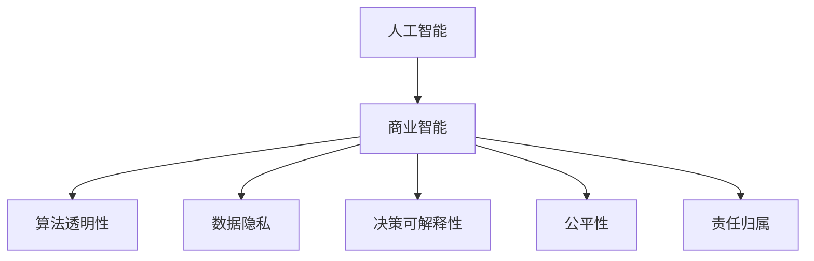

                 

## 1. 背景介绍

### 1.1 问题由来
随着人工智能(AI)技术的快速发展，人类计算在商业中的应用日益广泛，从自动化办公、智能客服、个性化推荐，到金融风险控制、医疗诊断等，AI技术正在重塑各行各业的业务模式。然而，AI的进步也伴随着一系列复杂的伦理道德问题。如何在商业应用中合理使用AI技术，确保其对社会和人类的正面影响，成为当下亟需探讨和解决的关键议题。

### 1.2 问题核心关键点
当前，AI在商业应用中面临的主要伦理道德问题包括数据隐私、算法透明度、决策可解释性、公平性、责任归属等。这些问题直接关系到AI技术的应用效果和社会接受度。只有在明确伦理道德框架的基础上，AI技术才能更好地服务于商业创新和人类福祉。

### 1.3 问题研究意义
研究AI在商业应用中的伦理道德问题，对于推动AI技术的健康发展，构建公正、透明、可信的AI系统，具有重要的理论意义和实际价值：

1. 提升AI技术的可信度。通过明确伦理道德规范，减少AI技术应用中的不确定性和偏见，增强用户信任。
2. 促进公平与包容。确保AI系统在算法设计、数据使用、决策输出等方面符合公平原则，减少歧视和偏见，促进社会包容。
3. 保障数据隐私和安全。通过数据匿名化、加密、去标识化等手段，保护用户隐私和数据安全。
4. 明确责任归属。在AI系统出现错误或造成损失时，能够明确责任主体，为司法和监管提供依据。
5. 推动伦理AI发展。通过伦理规范的制定和实施，引导AI技术向更加符合人类价值观和社会伦理的方向发展。

## 2. 核心概念与联系

### 2.1 核心概念概述

为更好地理解AI在商业应用中的伦理道德问题，本节将介绍几个关键概念：

- 人工智能(AI)：指通过计算机程序和算法，使机器模拟和实现人类智能的技术。包括机器学习、深度学习、自然语言处理、计算机视觉等多个分支。
- 商业智能(BI)：指利用数据、算法和可视化技术，支持企业决策和运营优化的过程。AI技术是BI的重要组成部分。
- 算法透明性(Algorithm Transparency)：指算法的决策过程应可以被理解和解释，用户能够明确算法的输入、处理方式和输出结果。
- 数据隐私(Privacy)：指保护个人或组织数据不被未授权访问、使用或泄露的措施。
- 决策可解释性(Explainability)：指算法输出的决策应能够被明确解释和理解，用户能够了解模型做出决策的原因。
- 公平性(Fairness)：指算法在处理数据和生成决策时，应保证不偏袒任何群体或个体，确保机会均等。
- 责任归属(Liability)：指在AI系统出现错误或造成损失时，应明确责任主体，确保法律和监管要求得到遵守。

这些概念之间的逻辑关系可以通过以下Mermaid流程图来展示：



这个流程图展示了几大核心概念之间的逻辑关系：

1. AI技术通过融入商业智能，成为企业决策和运营优化的重要工具。
2. 商业智能的各个环节，如算法设计、数据使用、决策生成等，均需要考虑伦理道德因素，确保AI应用的公平、透明和可信。
3. 数据隐私和责任归属是商业智能系统中必须严格遵守的原则，确保用户权益和系统安全。

## 3. 核心算法原理 & 具体操作步骤
### 3.1 算法原理概述

AI在商业应用中的伦理道德问题，主要集中在算法的透明性、数据隐私、决策可解释性、公平性和责任归属等方面。本节将详细阐述这些问题的算法原理和操作步骤。

### 3.2 算法步骤详解

**Step 1: 数据收集与预处理**
- 收集与业务相关的数据，包括交易记录、客户反馈、行为数据等。
- 对数据进行清洗和预处理，如去重、降噪、归一化等，确保数据质量和一致性。

**Step 2: 算法设计**
- 选择合适的算法模型，如分类、回归、聚类等，根据具体业务需求设计算法框架。
- 考虑算法的透明性和可解释性，选择易于解释的模型结构，如决策树、线性回归、规则系统等。

**Step 3: 算法训练与优化**
- 在训练数据上训练模型，优化算法参数，确保模型性能。
- 采用交叉验证、网格搜索等方法进行模型评估和调优。

**Step 4: 算法验证与测试**
- 在测试数据上验证模型性能，评估模型在不同数据分布上的表现。
- 使用A/B测试等方法，比较新算法与旧算法的差异，确保新算法优于旧算法。

**Step 5: 算法部署与监控**
- 将训练好的模型部署到生产环境中，进行业务应用。
- 实时监控模型性能和数据变化，及时调整模型参数，确保模型稳定运行。

**Step 6: 伦理合规与监管**
- 根据业务场景，制定伦理合规标准，确保算法符合法律法规和道德规范。
- 建立系统审计和风险管理机制，及时发现和纠正伦理问题。

### 3.3 算法优缺点

AI在商业应用中的伦理道德问题，主要涉及以下几个方面的算法：

**优点：**

1. 提高决策效率：AI算法能够自动化处理大量数据，快速生成决策，显著提高业务运营效率。
2. 增强决策准确性：通过精确的算法模型，AI能够提供高精度的预测和推荐，提升业务质量。
3. 支持个性化服务：AI能够根据用户行为和偏好，提供定制化的服务和推荐，提升用户体验。

**缺点：**

1. 数据隐私风险：AI系统需要大量数据训练，可能涉及用户隐私信息，存在数据泄露风险。
2. 算法透明性不足：复杂的深度学习模型，难以解释其内部决策逻辑，缺乏透明性。
3. 决策偏见与歧视：AI模型可能继承或放大数据中的偏见，导致不公平和歧视现象。
4. 责任归属不清：AI系统出错或造成损失时，责任归属难以界定，法律和监管存在挑战。

### 3.4 算法应用领域

AI在商业应用中的伦理道德问题，涉及多个领域，包括但不限于：

1. 金融领域：风险控制、信用评估、欺诈检测等，需要确保算法的公平性和透明性。
2. 医疗领域：疾病诊断、治疗推荐、患者监护等，需保护患者隐私，确保决策透明和公平。
3. 零售领域：推荐系统、库存管理、价格优化等，需避免偏见和歧视，确保消费者权益。
4. 人力资源管理：招聘、培训、绩效评估等，需保护求职者隐私，确保决策透明和公平。
5. 客户服务：智能客服、个性化推荐、情感分析等，需确保用户数据安全，提供可信的决策支持。

## 4. 数学模型和公式 & 详细讲解 & 举例说明

### 4.1 数学模型构建

在商业智能系统中，常见的数学模型包括线性回归、逻辑回归、支持向量机、决策树等。以线性回归为例，其数学模型为：

$$
y = \theta_0 + \sum_{i=1}^n \theta_i x_i
$$

其中，$y$ 为预测结果，$x_i$ 为输入特征，$\theta_i$ 为模型参数，$\theta_0$ 为截距。

### 4.2 公式推导过程

线性回归的优化目标是最小化预测误差，通常使用均方误差(MSE)作为损失函数：

$$
L(y,\hat{y}) = \frac{1}{2m} \sum_{i=1}^m (y_i - \hat{y}_i)^2
$$

其中，$m$ 为样本数量，$y_i$ 为真实标签，$\hat{y}_i$ 为模型预测结果。

通过梯度下降等优化算法，求解模型参数$\theta_i$：

$$
\theta_i \leftarrow \theta_i - \frac{\alpha}{m} \sum_{i=1}^m (y_i - \hat{y}_i)x_i
$$

其中，$\alpha$ 为学习率，控制参数更新的步长。

### 4.3 案例分析与讲解

**案例：金融风险评估**

在金融领域，AI被广泛应用于信用评估和风险控制。以信用评分为例，模型的数学模型为：

$$
\hat{y} = \beta_0 + \sum_{i=1}^n \beta_i x_i
$$

其中，$\hat{y}$ 为信用评分，$x_i$ 为输入特征（如收入、债务、信用记录等），$\beta_i$ 为模型参数，$\beta_0$ 为截距。

在模型训练过程中，需要确保算法透明性和数据隐私保护：

- 透明性：模型参数应可解释，用户能够理解其决策逻辑。
- 隐私保护：输入数据应进行匿名化处理，确保用户隐私不受侵犯。

## 5. 项目实践：代码实例和详细解释说明

### 5.1 开发环境搭建

在开发商业智能系统时，需要准备Python环境、数据集、计算资源等。以下是一般的开发环境搭建流程：

1. 安装Python：选择Python 3.x版本，建议使用Anaconda进行环境管理。
2. 安装相关库：如NumPy、Pandas、Scikit-Learn等数据处理和机器学习库。
3. 获取数据集：从公开数据源或生成数据集，存储到本地或云存储中。
4. 配置计算资源：使用本地电脑或云服务器，配置足够内存和CPU资源。

### 5.2 源代码详细实现

以下是一个简单的线性回归模型的Python实现，用于信用评分预测：

```python
import numpy as np
from sklearn.linear_model import LinearRegression
from sklearn.metrics import mean_squared_error

# 加载数据集
data = np.loadtxt('credit_data.csv', delimiter=',')

# 分割数据集
X = data[:, :-1]
y = data[:, -1]

# 初始化模型
model = LinearRegression()

# 训练模型
model.fit(X, y)

# 预测信用评分
y_pred = model.predict(X)

# 计算MSE
mse = mean_squared_error(y, y_pred)

print(f"Mean Squared Error: {mse:.2f}")
```

### 5.3 代码解读与分析

**代码解释：**

1. 导入必要的库：NumPy用于数据处理，Scikit-Learn用于模型训练和评估。
2. 加载数据集：使用NumPy加载CSV格式的数据集。
3. 分割数据集：将数据集分为特征和标签，方便模型训练。
4. 初始化模型：创建LinearRegression对象，用于拟合线性回归模型。
5. 训练模型：使用训练数据拟合模型，优化模型参数。
6. 预测信用评分：使用训练好的模型预测新样本的信用评分。
7. 计算MSE：使用均方误差评估模型预测结果。

**代码分析：**

- 数据集加载：确保数据集格式正确，存储位置方便访问。
- 模型初始化：选择合适的模型结构，并设置初始参数。
- 模型训练：使用交叉验证等方法，优化模型参数，提升模型性能。
- 模型评估：使用均方误差等指标，评估模型预测效果。
- 模型应用：将模型应用到新数据中，进行预测和评估。

### 5.4 运行结果展示

在上述代码中，计算得到的均方误差表示模型预测的准确性。例如，如果均方误差为100，则表示预测值与真实值之间的平方误差总和为100，模型预测的准确性有待提高。

## 6. 实际应用场景

### 6.1 智能客服系统

智能客服系统通过AI技术，实现自动客服问答、情感分析、意图识别等功能。在应用过程中，需要考虑以下几个伦理道德问题：

1. 数据隐私：客户与系统交互的数据应得到妥善保护，避免数据泄露和滥用。
2. 决策透明性：客服系统应向用户解释其决策逻辑，提供可解释的输出。
3. 责任归属：系统出错或造成损失时，应明确责任主体，提供用户申诉渠道。

### 6.2 个性化推荐系统

个性化推荐系统通过AI技术，根据用户历史行为和兴趣，推荐相关产品和服务。在应用过程中，需要考虑以下几个伦理道德问题：

1. 数据隐私：推荐系统需要大量用户数据，应确保数据匿名化和加密处理。
2. 决策公平性：推荐算法应避免歧视和偏见，确保推荐结果公正透明。
3. 责任归属：推荐系统出错或造成损失时，应明确责任主体，提供用户申诉渠道。

### 6.3 智能合约

智能合约通过区块链和AI技术，自动执行合同条款，减少人为干预。在应用过程中，需要考虑以下几个伦理道德问题：

1. 数据隐私：智能合约涉及交易数据，应确保数据隐私和匿名性。
2. 算法透明性：智能合约应提供透明、可解释的算法过程，增强用户信任。
3. 责任归属：智能合约出错或造成损失时，应明确责任主体，确保法律和监管要求得到遵守。

### 6.4 未来应用展望

随着AI技术的发展，未来商业应用中的伦理道德问题将更加复杂和多样。以下是几个可能的未来应用展望：

1. AI伦理委员会：成立专门机构，负责制定和监督AI应用的伦理规范。
2. 伦理AI标准：制定统一的伦理AI标准，指导企业AI系统的开发和应用。
3. 算法审计：定期对AI系统进行伦理审计，确保系统符合道德规范。
4. 用户参与：鼓励用户参与AI系统设计和测试，提升系统透明度和可信度。
5. 动态调整：根据反馈和数据变化，动态调整AI系统，确保系统持续符合伦理要求。

## 7. 工具和资源推荐

### 7.1 学习资源推荐

为了帮助开发者系统掌握AI在商业应用中的伦理道德问题，这里推荐一些优质的学习资源：

1. 《AI伦理指南》书籍：详细介绍AI技术在商业应用中的伦理道德问题，提供详细的解决思路和建议。
2. 《AI与伦理》课程：由知名专家授课，涵盖AI技术在商业、医疗、金融等多个领域的应用伦理。
3. 《AI透明度与可解释性》在线课程：讲解AI算法的透明性和可解释性问题，提供实际应用案例和解决方案。
4. 《数据隐私保护》课程：深入讲解数据隐私保护技术，如加密、去标识化等，提供最新的法律法规和实践指南。

通过这些资源的学习，相信你一定能够全面理解AI在商业应用中的伦理道德问题，并在实践中加以应用。

### 7.2 开发工具推荐

AI在商业应用中的伦理道德问题，涉及多个方面，需要多种工具支持。以下是几个常用的开发工具：

1. Python：作为AI开发的通用语言，Python拥有丰富的库和工具，如NumPy、Pandas、Scikit-Learn等。
2. Jupyter Notebook：支持Python代码的交互式执行和可视化，方便开发者进行数据处理和模型训练。
3. TensorBoard：提供模型训练和推理过程的可视化，帮助开发者监控模型性能和调试问题。
4. Weights & Biases：记录和可视化模型训练过程中的各项指标，方便对比和调优。
5. DataRobot：自动机器学习平台，提供简单易用的模型训练和调优功能。

合理利用这些工具，可以显著提升AI在商业应用中的伦理道德问题解决效率，加快创新迭代的步伐。

### 7.3 相关论文推荐

AI在商业应用中的伦理道德问题，涉及多个学科和方向，以下是几篇相关论文，推荐阅读：

1. "AI伦理：从理论到实践"：探讨AI技术在商业应用中的伦理道德问题，提供理论与实践的结合。
2. "商业智能中的数据隐私保护"：详细介绍商业智能系统中的数据隐私保护技术，提供实际案例和解决方案。
3. "算法透明性与可解释性"：深入探讨AI算法的透明性和可解释性问题，提供方法和技术支持。
4. "公平算法在商业应用中的挑战与对策"：分析公平算法在商业应用中的挑战，提供解决方案和建议。
5. "AI系统的责任归属与法律监管"：探讨AI系统在出错或造成损失时的责任归属问题，提供法律和监管建议。

这些论文代表了大语言模型微调技术的发展脉络。通过学习这些前沿成果，可以帮助研究者把握学科前进方向，激发更多的创新灵感。

## 8. 总结：未来发展趋势与挑战

### 8.1 总结

本文对AI在商业应用中的伦理道德问题进行了全面系统的介绍。首先阐述了AI技术在商业应用中的伦理道德问题，明确了数据隐私、算法透明性、决策可解释性、公平性和责任归属等关键议题。其次，从算法设计、数据处理、模型训练、应用部署等环节，详细讲解了AI伦理道德问题的解决步骤和关键技术。同时，本文还广泛探讨了AI在智能客服、个性化推荐、智能合约等实际应用场景中的伦理道德问题，展示了AI技术在商业中的广阔应用前景。

通过本文的系统梳理，可以看到，AI技术在商业应用中必须考虑伦理道德问题，才能实现其最大的社会价值。未来，AI技术应进一步融入伦理规范和法律法规，确保其在商业应用中的公正、透明和可信。

### 8.2 未来发展趋势

展望未来，AI在商业应用中的伦理道德问题将呈现以下几个发展趋势：

1. AI伦理规范的完善：逐步形成统一的AI伦理规范，指导企业AI系统的开发和应用。
2. 数据隐私保护技术的发展：引入最新的隐私保护技术，如联邦学习、差分隐私等，确保用户隐私得到保护。
3. 算法透明性和可解释性的增强：采用更加透明和可解释的算法，提升用户信任和接受度。
4. 公平算法的广泛应用：开发更多公平算法，减少偏见和歧视，确保决策公正透明。
5. 责任归属机制的完善：明确AI系统出错或造成损失时的责任归属，提供用户申诉渠道。

这些趋势将推动AI技术在商业应用中更加健康、可靠地发展，为人类社会带来更多的福祉。

### 8.3 面临的挑战

尽管AI在商业应用中取得了显著进展，但在迈向更加智能化、普适化应用的过程中，仍然面临诸多挑战：

1. 数据隐私保护：在大数据时代，如何保护用户隐私和数据安全，是AI应用中的重要挑战。
2. 算法透明性：复杂的AI模型难以解释其内部决策逻辑，如何提高算法的透明性和可解释性，是AI应用中的关键问题。
3. 公平性问题：AI模型可能继承或放大数据中的偏见，如何在保证公平性的同时，提升算法性能，是AI应用中的重要课题。
4. 责任归属不清：AI系统出错或造成损失时，责任归属难以界定，如何确保法律和监管要求得到遵守，是AI应用中的难点。
5. 伦理规范的制定：如何制定统一的伦理规范，指导企业AI系统的开发和应用，是AI应用中的挑战。

这些挑战将随着AI技术的不断发展和应用场景的拓展，显得愈加突出。只有在全面考虑伦理道德问题的基础上，AI技术才能更好地服务于商业创新和人类福祉。

### 8.4 研究展望

面对AI在商业应用中面临的伦理道德问题，未来的研究需要在以下几个方面寻求新的突破：

1. 开发透明和可解释的AI算法：采用更加透明和可解释的算法，提升用户信任和接受度。
2. 强化数据隐私保护技术：引入最新的隐私保护技术，如联邦学习、差分隐私等，确保用户隐私得到保护。
3. 制定伦理AI标准：制定统一的伦理AI标准，指导企业AI系统的开发和应用。
4. 引入公平算法：开发更多公平算法，减少偏见和歧视，确保决策公正透明。
5. 明确责任归属机制：明确AI系统出错或造成损失时的责任归属，提供用户申诉渠道。

这些研究方向的探索，将推动AI技术在商业应用中更加健康、可靠地发展，为人类社会带来更多的福祉。

## 9. 附录：常见问题与解答

**Q1：AI在商业应用中如何确保数据隐私？**

A: 确保数据隐私的主要手段包括数据匿名化、加密、去标识化等。具体措施如下：

1. 数据匿名化：去除或修改数据中的个人标识信息，如姓名、地址等。
2. 数据加密：对数据进行加密处理，确保数据在传输和存储过程中的安全性。
3. 去标识化：去除数据中的敏感信息，确保数据无法关联到具体个体。

**Q2：AI算法在商业应用中如何保证透明性？**

A: 保证算法透明性的主要手段包括模型可解释性、算法开放源码等。具体措施如下：

1. 模型可解释性：采用可解释性较强的算法模型，如决策树、线性回归等。
2. 算法开放源码：公开算法源码和训练数据，方便用户验证和审计。
3. 提供解释工具：开发易于理解的解释工具，帮助用户理解算法的决策逻辑。

**Q3：AI算法在商业应用中如何保证决策公平性？**

A: 保证决策公平性的主要手段包括数据公平处理、算法公平优化等。具体措施如下：

1. 数据公平处理：在数据预处理阶段，去除数据中的偏见和歧视信息。
2. 算法公平优化：优化算法模型，减少偏见和歧视现象，确保决策公正透明。
3. 多模型集成：采用多个模型进行集成预测，减少单一模型的不确定性和偏见。

**Q4：AI系统在商业应用中如何明确责任归属？**

A: 明确责任归属的主要手段包括合同条款、法律协议等。具体措施如下：

1. 合同条款：在合同中明确规定AI系统的使用规则和责任归属。
2. 法律协议：通过法律协议，明确AI系统出错或造成损失时的责任主体。
3. 用户申诉机制：建立用户申诉渠道，及时处理用户投诉和纠纷。

这些措施将有助于确保AI系统在商业应用中的合法合规和用户权益保护。

**Q5：AI在商业应用中如何处理伦理道德问题？**

A: 处理伦理道德问题的主要手段包括伦理规范制定、伦理审计等。具体措施如下：

1. 伦理规范制定：制定统一的伦理规范，指导企业AI系统的开发和应用。
2. 伦理审计：定期对AI系统进行伦理审计，确保系统符合道德规范。
3. 用户参与：鼓励用户参与AI系统设计和测试，提升系统透明度和可信度。

通过这些措施，可以确保AI系统在商业应用中符合伦理道德要求，实现其最大的社会价值。

---

作者：禅与计算机程序设计艺术 / Zen and the Art of Computer Programming

