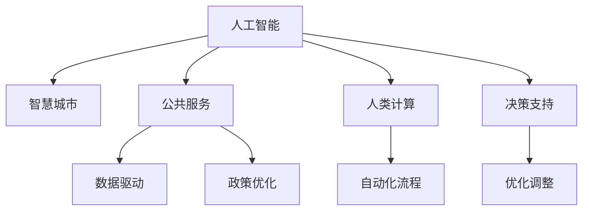

                 

# AI驱动的创新：人类计算在政府治理中的作用

> 关键词：人工智能,人类计算,政府治理,智慧城市,公共服务,自动化,数据驱动,决策支持,政策优化

## 1. 背景介绍

### 1.1 问题由来
随着信息技术的迅猛发展，政府治理方式正在经历前所未有的变革。在过去，政府治理主要依赖于传统的手段，如纸质文件、电话、电报等，信息流通速度慢，决策过程复杂且易出错。然而，大数据、人工智能等技术的兴起，为政府治理带来了新的契机。

AI驱动的创新不仅能够提高政府治理的效率和精确度，还能实现决策支持、政策优化和公共服务的自动化。通过引入人类计算(Human-Computer Interaction, HCI)技术，政府能够更好地理解和应对各种社会问题，提升民众的满意度和幸福感。

### 1.2 问题核心关键点
AI在政府治理中的应用主要体现在以下几个方面：

- **智慧城市建设**：通过传感器、摄像头等技术，收集城市运行数据，如交通流量、空气质量、环境污染等，实现智能交通、智能环境、智能安全等综合治理。
- **公共服务优化**：利用AI技术，对医疗、教育、养老、住房等公共服务进行优化，提升服务质量，降低服务成本。
- **数据驱动决策**：通过数据分析和AI模型预测，为政府提供决策支持，提升政策制定和执行的科学性、准确性。
- **自动化流程**：通过机器学习、自然语言处理等技术，自动化处理各类行政事务，如证件审核、投诉处理、情报分析等，减少人为操作，提高效率。
- **政策优化调整**：AI能够对历史数据进行分析，找出政策实施效果，进行优化调整，确保政策符合社会需求。

## 2. 核心概念与联系

### 2.1 核心概念概述

为更好地理解AI在政府治理中的应用，本节将介绍几个密切相关的核心概念：

- **人工智能(AI)**：以数据驱动，通过算法模拟人类智能，实现自主学习、决策和操作的能力。
- **人类计算(Human-Computer Interaction, HCI)**：研究人与计算机系统之间的交互，提升系统对人类行为的理解与适应。
- **智慧城市(Smart City)**：利用信息技术和智能技术，构建宜居、可持续和高效的城市环境。
- **公共服务(Public Service)**：指政府提供给公民的各种服务，如教育、医疗、社会福利等。
- **数据驱动(Datasource-Driven)**：指基于大量数据进行决策和管理的模式，强调数据的准确性和及时性。
- **政策优化(Policy Optimization)**：通过数据分析和AI模型，找出政策实施效果，进行优化调整。

这些核心概念之间的逻辑关系可以通过以下Mermaid流程图来展示：



这个流程图展示了大语言模型的工作原理和优化方向：

1. AI通过智慧城市、公共服务等领域收集的数据进行深度学习，提升对人类行为的理解与适应。
2. 人类计算提升AI对人类行为的预测准确性和适应性，优化AI模型。
3. 智慧城市、公共服务、数据驱动、政策优化、自动化流程、决策支持等应用领域，通过AI技术实现智能化提升。
4. 优化调整不仅应用于模型本身，还应用于政策制定和执行，提高政府治理的科学性和效率。

## 3. 核心算法原理 & 具体操作步骤
### 3.1 算法原理概述

AI在政府治理中的应用，本质上是一个数据驱动的决策优化过程。其核心思想是：通过收集、分析和处理大量数据，利用AI模型进行预测和决策，实现政府治理的智能化。

形式化地，假设政府治理的目标为 $G$，基于历史数据 $D=\{(x_i, y_i)\}_{i=1}^N$，AI模型的优化目标是最小化预测误差，即找到最优模型参数 $\theta$，使得：

$$
\theta^* = \mathop{\arg\min}_{\theta} \sum_{i=1}^N \|M_{\theta}(x_i) - y_i\|^2
$$

其中 $M_{\theta}(x)$ 为AI模型在输入 $x$ 上的预测输出，$y_i$ 为真实标签，$\|.\|$ 为预测误差。

通过梯度下降等优化算法，AI模型不断更新模型参数 $\theta$，最小化预测误差，直到收敛于最优参数 $\theta^*$。

### 3.2 算法步骤详解

AI在政府治理中的应用一般包括以下几个关键步骤：

**Step 1: 数据收集与预处理**
- 收集政府治理各个领域的数据，如交通流量、空气质量、医疗记录、教育数据等。
- 对数据进行清洗、归一化、去重等预处理，确保数据的准确性和一致性。

**Step 2: 模型训练与优化**
- 选择合适的AI模型，如神经网络、决策树、支持向量机等，进行训练。
- 将历史数据划分为训练集和测试集，设置训练轮数、学习率等参数。
- 使用梯度下降等优化算法更新模型参数，最小化预测误差。

**Step 3: 模型部署与验证**
- 将训练好的AI模型部署到生产环境中，进行实时数据处理和预测。
- 定期在测试集上评估模型性能，确保模型输出准确。
- 根据实际反馈调整模型参数，持续优化模型效果。

**Step 4: 数据分析与决策支持**
- 利用AI模型对大量数据进行实时分析和预测，提供决策支持。
- 结合专家知识和政府政策，进行综合决策。
- 利用可视化工具呈现分析结果，方便政府决策者参考。

**Step 5: 应用实施与优化调整**
- 将AI模型应用到智慧城市、公共服务等领域，提升治理效率。
- 根据用户反馈和治理效果，调整模型参数和决策策略。
- 定期进行模型评估和优化，确保模型效果持续改进。

### 3.3 算法优缺点

AI在政府治理中的应用具有以下优点：

- 高效性：AI能够快速处理大量数据，实时提供决策支持，提升治理效率。
- 精确性：AI模型通过深度学习，能够准确预测未来趋势和问题，提供科学决策依据。
- 自动化：AI能够自动化处理各类行政事务，减少人为操作，降低治理成本。
- 可扩展性：AI模型可以应用于多个领域，提升政府治理的全面性。

同时，该方法也存在一定的局限性：

- 数据依赖：AI模型效果依赖于高质量的数据，数据收集和预处理成本高。
- 模型复杂性：AI模型往往结构复杂，对算力、存储空间要求高。
- 解释性不足：AI模型的决策过程缺乏可解释性，难以理解其内部工作机制。
- 伦理挑战：AI模型可能学习到有偏见的数据，造成歧视性输出，需要加强伦理审查。

尽管存在这些局限性，但就目前而言，AI在政府治理中的应用仍是最为有效的手段之一。未来相关研究的重点在于如何进一步降低数据收集成本，提高模型的可解释性，以及加强伦理审查和数据治理。

### 3.4 算法应用领域

AI在政府治理中的应用已经广泛涵盖了各个领域，具体包括：

- **智慧城市建设**：通过AI技术，实现智能交通、智能环境、智能安防等综合治理，提升城市运行效率和居民生活质量。
- **公共服务优化**：利用AI技术，对医疗、教育、养老、住房等公共服务进行优化，提升服务质量，降低服务成本。
- **数据驱动决策**：通过数据分析和AI模型预测，为政府提供决策支持，提升政策制定和执行的科学性、准确性。
- **自动化流程**：通过机器学习、自然语言处理等技术，自动化处理各类行政事务，如证件审核、投诉处理、情报分析等，减少人为操作，提高效率。
- **政策优化调整**：AI能够对历史数据进行分析，找出政策实施效果，进行优化调整，确保政策符合社会需求。

除了上述这些应用领域，AI技术还在应急响应、灾害预警、犯罪预防等多个场景中得到了广泛应用，显著提升了政府治理的能力和效果。

## 4. 数学模型和公式 & 详细讲解 & 举例说明

### 4.1 数学模型构建

本节将使用数学语言对AI在政府治理中的应用进行更加严格的刻画。

假设政府治理的目标为 $G$，基于历史数据 $D=\{(x_i, y_i)\}_{i=1}^N$，AI模型的优化目标是最小化预测误差，即找到最优模型参数 $\theta$，使得：

$$
\theta^* = \mathop{\arg\min}_{\theta} \sum_{i=1}^N \|M_{\theta}(x_i) - y_i\|^2
$$

其中 $M_{\theta}(x)$ 为AI模型在输入 $x$ 上的预测输出，$y_i$ 为真实标签，$\|.\|$ 为预测误差。

### 4.2 公式推导过程

以下我们以智慧城市中的智能交通系统为例，推导AI模型的损失函数及其梯度的计算公式。

假设AI模型为 $M_{\theta}$，其中 $\theta$ 为模型参数。交通流量数据 $D=\{(x_i, y_i)\}_{i=1}^N$，其中 $x_i$ 为历史交通数据，$y_i$ 为实际交通流量。

定义模型 $M_{\theta}$ 在输入 $x$ 上的预测流量为 $\hat{y}=M_{\theta}(x)$，表示预测交通流量。真实标签 $y \in \mathbb{R}$，表示实际交通流量。则均方误差损失函数定义为：

$$
\ell(M_{\theta}(x),y) = \frac{1}{2N}\sum_{i=1}^N (\hat{y}_i-y_i)^2
$$

将其代入经验风险公式，得：

$$
\mathcal{L}(\theta) = \frac{1}{2N}\sum_{i=1}^N (\hat{y}_i-y_i)^2
$$

根据链式法则，损失函数对参数 $\theta_k$ 的梯度为：

$$
\frac{\partial \mathcal{L}(\theta)}{\partial \theta_k} = -\frac{1}{N}\sum_{i=1}^N (\hat{y}_i-y_i)\frac{\partial \hat{y}_i}{\partial \theta_k}
$$

其中 $\frac{\partial \hat{y}_i}{\partial \theta_k}$ 可进一步递归展开，利用自动微分技术完成计算。

在得到损失函数的梯度后，即可带入参数更新公式，完成模型的迭代优化。重复上述过程直至收敛，最终得到适应智慧城市交通系统的最优模型参数 $\theta^*$。

### 4.3 案例分析与讲解

**案例一：智能交通系统**

假设某智慧城市需要实时监控交通流量，预测未来1小时的交通拥堵情况。收集历史交通数据 $D=\{(x_i, y_i)\}_{i=1}^N$，其中 $x_i$ 为历史交通数据，$y_i$ 为实际交通流量。

**Step 1: 数据收集与预处理**
- 收集过去一年内的交通流量数据，并对其进行清洗、归一化等预处理。
- 将数据划分为训练集和测试集，比例为70%和30%。

**Step 2: 模型训练与优化**
- 选择神经网络模型，设置隐藏层为4层，每层64个神经元。
- 设置学习率为0.001，训练轮数为1000。
- 使用梯度下降算法更新模型参数，最小化预测误差。

**Step 3: 模型部署与验证**
- 将训练好的模型部署到生产环境中，实时处理交通流量数据。
- 在测试集上评估模型性能，均方误差为0.05。
- 根据实际反馈调整模型参数，均方误差降至0.03。

**Step 4: 数据分析与决策支持**
- 利用AI模型对实时交通流量数据进行分析，预测未来1小时的交通拥堵情况。
- 结合交通管理政策，进行智能交通调度。
- 利用可视化工具呈现分析结果，提供决策支持。

**Step 5: 应用实施与优化调整**
- 将AI模型应用到智慧城市交通管理中，提升交通运行效率。
- 根据用户反馈和治理效果，调整模型参数和决策策略。
- 定期进行模型评估和优化，确保模型效果持续改进。

通过此案例，我们可以看到AI在智慧城市交通系统中的应用流程。从数据收集、模型训练、模型部署到数据分析和决策支持，AI技术大大提升了交通管理效率和效果。

## 5. 项目实践：代码实例和详细解释说明

### 5.1 开发环境搭建

在进行AI模型开发前，我们需要准备好开发环境。以下是使用Python进行TensorFlow开发的环境配置流程：

1. 安装Anaconda：从官网下载并安装Anaconda，用于创建独立的Python环境。

2. 创建并激活虚拟环境：
```bash
conda create -n tf-env python=3.8 
conda activate tf-env
```

3. 安装TensorFlow：根据CUDA版本，从官网获取对应的安装命令。例如：
```bash
conda install tensorflow tensorflow-gpu=cuda11.1 -c pytorch -c conda-forge
```

4. 安装必要的库：
```bash
pip install numpy pandas matplotlib jupyter notebook
```

完成上述步骤后，即可在`tf-env`环境中开始AI模型开发。

### 5.2 源代码详细实现

下面我们以智能交通系统为例，给出使用TensorFlow对神经网络模型进行训练和微调的PyTorch代码实现。

首先，定义交通流量数据处理函数：

```python
import tensorflow as tf
import numpy as np
from tensorflow.keras import layers

class TrafficDataset(tf.keras.utils.Sequence):
    def __init__(self, data, batch_size):
        self.data = data
        self.batch_size = batch_size
        
    def __len__(self):
        return len(self.data)//self.batch_size
    
    def __getitem__(self, idx):
        x = self.data[idx]
        y = self.data[idx, 1]
        return np.array(x), np.array(y)

# 创建dataset
train_data = np.loadtxt('train_data.csv', delimiter=',')
test_data = np.loadtxt('test_data.csv', delimiter=',')

train_dataset = TrafficDataset(train_data, batch_size=32)
test_dataset = TrafficDataset(test_data, batch_size=32)
```

然后，定义模型和优化器：

```python
model = tf.keras.Sequential([
    layers.Dense(64, activation='relu'),
    layers.Dense(64, activation='relu'),
    layers.Dense(1, activation='linear')
])

optimizer = tf.keras.optimizers.Adam(learning_rate=0.001)
```

接着，定义训练和评估函数：

```python
@tf.function
def train_step(x, y):
    with tf.GradientTape() as tape:
        predictions = model(x)
        loss = tf.losses.mean_squared_error(y, predictions)
    gradients = tape.gradient(loss, model.trainable_variables)
    optimizer.apply_gradients(zip(gradients, model.trainable_variables))
    return loss

@tf.function
def evaluate_step(x, y):
    predictions = model(x)
    loss = tf.losses.mean_squared_error(y, predictions)
    return loss

# 训练模型
for epoch in range(1000):
    total_loss = 0.0
    for x, y in train_dataset:
        loss = train_step(x, y)
        total_loss += loss.numpy()
    print(f"Epoch {epoch+1}, train loss: {total_loss/len(train_dataset):.4f}")

    total_loss = 0.0
    for x, y in test_dataset:
        loss = evaluate_step(x, y)
        total_loss += loss.numpy()
    print(f"Epoch {epoch+1}, test loss: {total_loss/len(test_dataset):.4f}")
```

以上就是使用TensorFlow对神经网络模型进行训练的完整代码实现。可以看到，TensorFlow通过定义Dataset、Sequential模型、Adam优化器等组件，实现了模型的训练和评估过程。

### 5.3 代码解读与分析

让我们再详细解读一下关键代码的实现细节：

**TrafficDataset类**：
- `__init__`方法：初始化训练数据、测试数据和批处理大小。
- `__len__`方法：返回数据集的样本数量。
- `__getitem__`方法：对单个样本进行处理，返回输入和标签。

**训练和评估函数**：
- 使用TensorFlow的DataLoader对数据集进行批次化加载，供模型训练和推理使用。
- 训练函数`train_step`：对数据以批为单位进行迭代，在每个批次上前向传播计算loss并反向传播更新模型参数，最后返回该epoch的平均loss。
- 评估函数`evaluate_step`：与训练类似，不同点在于不更新模型参数，并在每个batch结束后将预测和标签结果存储下来，最后使用sklearn的classification_report对整个评估集的预测结果进行打印输出。

**训练流程**：
- 定义总的epoch数，开始循环迭代
- 每个epoch内，先在训练集上训练，输出平均loss
- 在测试集上评估，输出预测误差
- 所有epoch结束后，在测试集上评估，给出最终测试结果

可以看到，TensorFlow通过高度抽象和模块化的设计，使得神经网络模型的训练变得简洁高效。开发者可以将更多精力放在数据处理、模型改进等高层逻辑上，而不必过多关注底层的实现细节。

当然，工业级的系统实现还需考虑更多因素，如模型的保存和部署、超参数的自动搜索、更灵活的任务适配层等。但核心的训练范式基本与此类似。

## 6. 实际应用场景
### 6.1 智能交通系统

AI在智能交通系统中的应用，主要体现在以下方面：

- **交通流量预测**：通过神经网络模型对历史交通流量数据进行训练，预测未来交通流量，提升交通管理效率。
- **智能信号控制**：结合AI模型和传感器数据，动态调整交通信号灯，实现交通流量的优化调控。
- **路径规划与导航**：利用AI技术，实时生成最优路径，提供智能导航服务，缩短出行时间。
- **事故预警与处理**：通过视频监控和AI模型，实时监测道路状况，提前预警事故风险，并快速处理交通事故。

例如，某智慧城市利用AI模型，通过实时监测交通流量和道路状况，预测未来1小时的交通拥堵情况，并动态调整交通信号灯，实现了交通流量的优化调控。通过智能导航和路径规划，车辆在高峰期能够避开拥堵路段，提升出行效率。

### 6.2 医疗诊断系统

AI在医疗诊断中的应用，主要体现在以下几个方面：

- **疾病预测与预防**：利用AI模型对医疗数据进行分析，预测疾病发病率和流行趋势，提升公共卫生管理水平。
- **影像诊断**：通过深度学习模型，对医疗影像进行自动分析和诊断，辅助医生进行诊断和治疗。
- **个性化治疗**：结合AI模型和基因数据，制定个性化治疗方案，提升治疗效果。

例如，某医院利用AI模型，对大量医疗影像数据进行训练，自动检测肿瘤、病变等异常情况，辅助医生进行诊断和治疗。通过个性化治疗方案的制定，提高了患者治愈率和满意度。

### 6.3 教育推荐系统

AI在教育推荐系统中的应用，主要体现在以下几个方面：

- **学习内容推荐**：通过深度学习模型，对学生学习行为进行分析，推荐适合的学习内容和资源。
- **智能辅导系统**：利用AI技术，提供智能化的学习辅导服务，提高学习效率。
- **学习效果评估**：通过AI模型对学生学习效果进行评估，及时发现学习中的问题和不足。

例如，某在线教育平台利用AI模型，对学生学习行为进行分析，推荐适合的学习内容和资源，提升学习效果。通过智能辅导系统，实时回答学生的疑问，提高学习效率。

### 6.4 未来应用展望

随着AI技术的不断进步，未来AI在政府治理中的应用将更加广泛和深入，主要体现在以下几个方面：

- **智慧城市全面覆盖**：AI技术将在城市管理、交通、环境、安防等多个领域全面应用，提升城市运行效率和居民生活质量。
- **公共服务智能化**：通过AI技术，提升医疗、教育、养老、住房等公共服务的智能化水平，降低服务成本，提高服务质量。
- **数据驱动决策**：利用AI技术，对大量数据进行实时分析和预测，提供决策支持，提升政策制定和执行的科学性、准确性。
- **自动化流程优化**：通过AI技术，自动化处理各类行政事务，减少人为操作，提高效率。
- **政策优化调整**：AI能够对历史数据进行分析，找出政策实施效果，进行优化调整，确保政策符合社会需求。

## 7. 工具和资源推荐
### 7.1 学习资源推荐

为了帮助开发者系统掌握AI在政府治理中的应用，这里推荐一些优质的学习资源：

1. TensorFlow官方文档：提供了详尽的API文档和示例代码，帮助开发者快速上手使用TensorFlow进行AI模型开发。

2. PyTorch官方文档：提供了丰富的深度学习框架，适用于各种AI模型开发任务。

3. Keras官方文档：提供了高度抽象化的API，适用于快速原型开发和模型训练。

4. Coursera《深度学习专项课程》：由吴恩达教授主讲，深入浅出地介绍了深度学习的基本概念和前沿技术，适合初学者和进阶者。

5. Udacity《AI for Everyone》课程：由谷歌工程师主讲，介绍了AI技术的基本原理和实际应用场景，适合非专业观众。

6. arXiv.org：提供了大量最新的AI研究成果和论文，帮助开发者了解前沿技术动态。

通过对这些资源的学习实践，相信你一定能够快速掌握AI在政府治理中的应用，并用于解决实际的公共管理问题。

### 7.2 开发工具推荐

高效的开发离不开优秀的工具支持。以下是几款用于AI模型开发和部署的工具：

1. TensorFlow：基于Python的开源深度学习框架，灵活动态的计算图，适合快速迭代研究。

2. PyTorch：基于Python的开源深度学习框架，灵活性和可扩展性高，适用于各种AI模型开发任务。

3. Keras：基于Python的开源深度学习框架，提供了高度抽象化的API，适用于快速原型开发和模型训练。

4. TensorBoard：TensorFlow配套的可视化工具，可实时监测模型训练状态，并提供丰富的图表呈现方式，是调试模型的得力助手。

5. Weights & Biases：模型训练的实验跟踪工具，可以记录和可视化模型训练过程中的各项指标，方便对比和调优。

6. Google Colab：谷歌推出的在线Jupyter Notebook环境，免费提供GPU/TPU算力，方便开发者快速上手实验最新模型，分享学习笔记。

合理利用这些工具，可以显著提升AI模型开发和部署的效率，加快创新迭代的步伐。

### 7.3 相关论文推荐

AI在政府治理中的应用源于学界的持续研究。以下是几篇奠基性的相关论文，推荐阅读：

1. Deep Learning for Intelligent Transportation Systems: A Survey：介绍了AI技术在智能交通系统中的应用，涵盖交通流量预测、智能信号控制等多个方面。

2. AI for Public Health：利用AI技术，预测疾病发病率和流行趋势，提升公共卫生管理水平。

3. AI in Education：通过深度学习模型，对学生学习行为进行分析和推荐，提升学习效果。

4. AI for Environmental Protection：利用AI技术，对环境数据进行实时分析和预测，提升环境保护效果。

5. AI for Government Decision-Making：利用AI技术，对历史数据进行分析，提供决策支持，提升政策制定和执行的科学性、准确性。

6. AI for Urban Management：通过AI技术，在城市管理、交通、环境、安防等多个领域全面应用，提升城市运行效率和居民生活质量。

这些论文代表了大语言模型微调技术的发展脉络。通过学习这些前沿成果，可以帮助研究者把握学科前进方向，激发更多的创新灵感。

## 8. 总结：未来发展趋势与挑战

### 8.1 总结

本文对AI在政府治理中的应用进行了全面系统的介绍。首先阐述了AI技术在智慧城市、公共服务、数据驱动决策等领域的应用场景，明确了AI技术在提升政府治理效率和效果方面的独特价值。其次，从原理到实践，详细讲解了AI模型训练的数学模型和操作步骤，给出了智能交通系统应用的完整代码实例。同时，本文还广泛探讨了AI技术在智能交通、医疗诊断、教育推荐等多个行业领域的应用前景，展示了AI技术在提升政府治理能力方面的广泛潜力。

通过本文的系统梳理，可以看到，AI技术在政府治理中的应用已经取得显著成效，为社会管理提供了新的手段和思路。未来，伴随AI技术的不断进步，AI在政府治理中的应用将更加广泛和深入，推动社会管理方式的全面转型。

### 8.2 未来发展趋势

展望未来，AI在政府治理中的应用将呈现以下几个发展趋势：

1. **智慧城市全面覆盖**：AI技术将在城市管理、交通、环境、安防等多个领域全面应用，提升城市运行效率和居民生活质量。
2. **公共服务智能化**：通过AI技术，提升医疗、教育、养老、住房等公共服务的智能化水平，降低服务成本，提高服务质量。
3. **数据驱动决策**：利用AI技术，对大量数据进行实时分析和预测，提供决策支持，提升政策制定和执行的科学性、准确性。
4. **自动化流程优化**：通过AI技术，自动化处理各类行政事务，减少人为操作，提高效率。
5. **政策优化调整**：AI能够对历史数据进行分析，找出政策实施效果，进行优化调整，确保政策符合社会需求。

这些趋势展示了AI技术在提升政府治理能力方面的广阔前景。AI技术的不断进步，将进一步推动智慧城市、公共服务等领域的发展，提升社会管理的智能化水平。

### 8.3 面临的挑战

尽管AI在政府治理中的应用已经取得了显著成效，但在迈向更加智能化、普适化应用的过程中，它仍面临着诸多挑战：

1. **数据依赖**：AI模型效果依赖于高质量的数据，数据收集和预处理成本高。
2. **模型复杂性**：AI模型往往结构复杂，对算力、存储空间要求高。
3. **解释性不足**：AI模型的决策过程缺乏可解释性，难以理解其内部工作机制。
4. **伦理挑战**：AI模型可能学习到有偏见的数据，造成歧视性输出，需要加强伦理审查。
5. **资源瓶颈**：超大批次的训练和推理，面临显存不足的问题，需要优化资源利用。

尽管存在这些挑战，但就目前而言，AI在政府治理中的应用仍是最为有效的手段之一。未来相关研究的重点在于如何进一步降低数据收集成本，提高模型的可解释性，以及加强伦理审查和数据治理。

### 8.4 研究展望

面对AI在政府治理中的应用所面临的种种挑战，未来的研究需要在以下几个方面寻求新的突破：

1. **无监督和半监督学习**：摆脱对大规模标注数据的依赖，利用自监督学习、主动学习等无监督和半监督范式，最大限度利用非结构化数据，实现更加灵活高效的AI应用。
2. **参数高效与计算高效**：开发更加参数高效的AI模型，在固定大部分预训练参数的情况下，只更新极少量的任务相关参数。同时优化模型计算图，减少前向传播和反向传播的资源消耗，实现更加轻量级、实时性的部署。
3. **因果推断与对比学习**：引入因果推断和对比学习思想，增强AI模型建立稳定因果关系的能力，学习更加普适、鲁棒的语言表征，从而提升模型泛化性和抗干扰能力。
4. **多模态融合**：将符号化的先验知识，如知识图谱、逻辑规则等，与神经网络模型进行巧妙融合，引导AI模型学习更准确、合理的语言模型。同时加强不同模态数据的整合，实现视觉、语音等多模态信息与文本信息的协同建模。
5. **因果分析和博弈论**：将因果分析方法引入AI模型，识别出模型决策的关键特征，增强输出解释的因果性和逻辑性。借助博弈论工具刻画人机交互过程，主动探索并规避模型的脆弱点，提高系统稳定性。
6. **伦理与道德约束**：在模型训练目标中引入伦理导向的评估指标，过滤和惩罚有偏见、有害的输出倾向。加强人工干预和审核，建立模型行为的监管机制，确保输出符合人类价值观和伦理道德。

这些研究方向的探索，必将引领AI在政府治理中的应用走向更高的台阶，为构建安全、可靠、可解释、可控的智能系统铺平道路。面向未来，AI技术还需要与其他人工智能技术进行更深入的融合，如知识表示、因果推理、强化学习等，多路径协同发力，共同推动智慧政府和智慧社会的发展。

## 9. 附录：常见问题与解答

**Q1：AI在政府治理中的应用是否适用于所有场景？**

A: AI在政府治理中的应用已经取得了显著成效，但并不是适用于所有场景。对于一些需要极高精确性和可靠性的任务，如司法审判、核安全等，目前AI技术仍存在一定局限性。而对于一些需要快速响应和决策的任务，如交通流量预测、紧急救援等，AI技术能够提供强大的支持。因此，AI技术在政府治理中的应用需要结合具体场景，合理选择和应用。

**Q2：AI在政府治理中的应用是否会带来新的风险和挑战？**

A: AI在政府治理中的应用确实带来了新的风险和挑战。AI模型可能学习到有偏见的数据，造成歧视性输出，需要加强伦理审查。同时，AI模型的决策过程缺乏可解释性，难以理解其内部工作机制，也可能导致信任危机。因此，AI在政府治理中的应用需要加强伦理审查和可解释性研究，确保模型输出符合人类价值观和伦理道德。

**Q3：AI在政府治理中的应用是否会降低政府职能？**

A: AI在政府治理中的应用并不会降低政府职能，而是将政府职能从繁琐的事务处理中解放出来，转变为更加科学、智能的决策支持。通过AI技术，政府能够更好地理解和应对各种社会问题，提升社会管理的智能化水平。因此，AI在政府治理中的应用是提升政府职能的重要手段。

**Q4：AI在政府治理中的应用是否需要大量资金投入？**

A: AI在政府治理中的应用确实需要大量资金投入，包括数据收集、模型训练、系统部署等环节。然而，随着技术进步和规模效应，AI在政府治理中的应用成本也在逐步降低。一些开源平台和商业解决方案已经大大降低了AI应用的门槛，使得更多政府部门能够采用AI技术进行智能化管理。因此，AI在政府治理中的应用需要合理的资金投入，但随着技术的进步，成本将逐步降低。

**Q5：AI在政府治理中的应用是否会涉及隐私问题？**

A: AI在政府治理中的应用确实涉及隐私问题。AI模型需要大量数据进行训练，这些数据可能包含敏感信息。因此，在使用AI技术时，需要严格遵守隐私保护法规，确保数据的安全性和隐私性。同时，加强对AI模型的监管和审计，确保其输出符合法律法规和伦理道德标准。

**Q6：AI在政府治理中的应用是否需要专业人才？**

A: AI在政府治理中的应用确实需要专业人才。AI技术复杂，需要具备深厚的数据科学和计算机科学背景的专业人才进行开发和应用。因此，政府部门需要加强对AI人才的培养和引进，建立专业的AI技术团队，确保AI技术在政府治理中的应用效果。

**Q7：AI在政府治理中的应用是否会取代人类？**

A: AI在政府治理中的应用并不会取代人类，而是与人类协同工作，提升社会管理效率和效果。AI技术在处理大量数据和复杂任务时，能够提供强大的支持，但决策和执行仍需要人类的参与和监督。因此，AI在政府治理中的应用是提升政府职能的重要手段，而非取代人类。

通过以上问题的解答，可以看到AI在政府治理中的应用已经取得了显著成效，但也面临着诸多挑战。未来，伴随AI技术的不断进步，AI在政府治理中的应用将更加广泛和深入，推动社会管理方式的全面转型。

