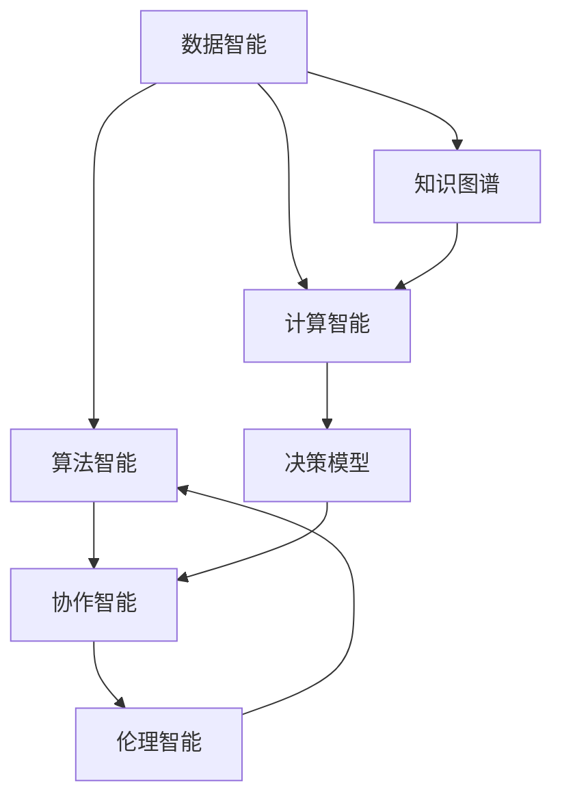

                 

# 集体智慧：解决全球性挑战的新希望

## 1. 背景介绍

### 1.1 问题由来
随着科技的迅猛发展，人类面临的全球性挑战也越来越多，如气候变化、贫困、疾病、恐怖主义、资源短缺等。这些问题复杂且相互关联，单靠个体或单一组织难以应对。而以集体智慧为代表的智能技术，正在为解决这些全球性挑战提供新的希望。

### 1.2 问题核心关键点
集体智慧是指通过利用数据、算法和计算资源，集合大规模人类的智慧与经验，进行协作与知识共享，以共同应对和解决复杂问题。其主要特点包括：

- 数据驱动：通过收集、分析和应用全球数据，提取共性问题和解决方案。
- 算法支持：应用先进的机器学习和数据分析算法，挖掘数据背后的规律和模式。
- 计算基础：依托强大的计算能力，实现大规模数据的快速处理和实时决策。
- 协作平台：构建智能化的协作平台，促进人类间的信息共享与协作。
- 伦理考虑：确保数据和算法的使用符合伦理道德规范，避免潜在风险和负面影响。

这一范式已经在各个领域得到广泛应用，如全球疫情监测、天气预报、城市交通管理、灾害预防等。集体智慧不仅有助于提高决策效率和精准性，还能加速问题解决过程，减少资源浪费，提升社会整体福祉。

### 1.3 问题研究意义
研究集体智慧的理论与实践，对于探索解决全球性挑战的新路径具有重要意义：

- 推动协作创新：通过汇集全球智慧，共同探索问题解决方案，加速科技创新进程。
- 提升决策质量：借助数据分析和机器学习，提升决策的科学性和精确性，减少决策失误。
- 优化资源配置：利用集体智慧实现资源的高效配置和利用，提升社会效益。
- 促进共享共赢：实现不同组织和个体间的知识共享，形成互惠共赢的合作关系。
- 培养跨领域人才：培养具备跨学科知识的复合型人才，提升团队整体素质。

## 2. 核心概念与联系

### 2.1 核心概念概述

为更好地理解集体智慧，本节将介绍几个关键概念：

- **数据智能(Data Intelligence)**：指通过分析和挖掘数据背后的规律，为决策提供支撑的技术和方法。
- **算法智能(Algorithm Intelligence)**：指利用机器学习和数据分析算法，自动发现数据中的模式和知识。
- **计算智能(Computational Intelligence)**：指利用强大的计算资源，实现大规模数据的快速处理和实时决策。
- **协作智能(Collaborative Intelligence)**：指通过智能化的协作平台，促进大规模人群间的信息共享与协作。
- **伦理智能(Ethical Intelligence)**：指在应用集体智慧时，确保数据和算法的使用符合伦理道德规范，避免潜在风险。

这些概念共同构成了集体智慧的基本框架，使得不同领域和层次的智慧得以有效整合和应用。

### 2.2 核心概念原理和架构的 Mermaid 流程图



这个流程图展示了数据智能、算法智能、计算智能、协作智能和伦理智能之间的联系：

1. **数据智能**：为算法智能和计算智能提供数据支撑，通过分析挖掘数据中的模式和知识。
2. **算法智能**：自动发现数据中的模式和知识，为计算智能和协作智能提供模型支持。
3. **计算智能**：依托强大的计算资源，实现数据的快速处理和实时决策。
4. **协作智能**：通过智能化的协作平台，促进大规模人群间的信息共享与协作。
5. **伦理智能**：确保数据和算法的使用符合伦理道德规范，避免潜在风险。

## 3. 核心算法原理 & 具体操作步骤

### 3.1 算法原理概述

集体智慧的实现主要依赖于以下几个算法和步骤：

1. **数据收集与预处理**：从全球不同地区和组织收集相关数据，并进行清洗和标准化处理。
2. **特征提取与建模**：利用机器学习算法提取数据特征，构建预测模型。
3. **计算与优化**：依托强大的计算资源，进行模型训练和优化。
4. **协作与共享**：通过智能协作平台，促进不同组织和个体间的信息共享与协作。
5. **评估与迭代**：定期评估模型效果，并进行迭代改进。

### 3.2 算法步骤详解

**Step 1: 数据收集与预处理**

- **数据来源**：收集全球范围内与问题相关的数据，包括历史数据、实时数据、实验数据等。
- **数据清洗**：去除噪声、填补缺失值、处理异常值，确保数据的质量和一致性。
- **数据标准化**：将不同来源的数据进行标准化处理，统一格式和单位，方便后续分析。

**Step 2: 特征提取与建模**

- **特征选择**：利用领域知识和统计方法，选择对问题预测有用的特征。
- **模型构建**：选择合适的机器学习算法（如决策树、神经网络、支持向量机等）构建预测模型。
- **模型训练**：使用收集的数据对模型进行训练，得到初步的预测结果。

**Step 3: 计算与优化**

- **计算资源**：利用高性能计算资源（如GPU、TPU等）进行模型训练和优化。
- **模型调优**：使用交叉验证、正则化、剪枝等技术优化模型，提高预测准确率。

**Step 4: 协作与共享**

- **协作平台**：构建智能化的协作平台，促进不同组织和个体间的信息共享与协作。
- **知识图谱**：利用知识图谱技术，将领域知识和专家经验整合到模型中，提升模型的普适性和鲁棒性。
- **实时反馈**：通过实时反馈机制，收集用户的反馈信息，进行模型迭代优化。

**Step 5: 评估与迭代**

- **效果评估**：定期评估模型效果，通过各种指标（如准确率、召回率、F1值等）进行评估。
- **模型迭代**：根据评估结果，进行模型迭代优化，不断提升预测准确率。

### 3.3 算法优缺点

集体智慧的算法具有以下优点：

- **数据丰富性**：得益于全球数据的多样性和广泛性，模型可以学习到更多的知识。
- **算法鲁棒性**：多种算法的组合应用，提高了模型的鲁棒性和泛化能力。
- **协作高效性**：智能协作平台促进了跨组织、跨领域的信息共享和协作，提升了问题解决的效率。

但同时也存在以下局限：

- **数据隐私**：数据收集和共享过程中，可能存在隐私泄露的风险。
- **算法复杂性**：涉及的算法和步骤繁多，增加了实现的复杂性和难度。
- **计算资源需求**：大规模数据的处理和模型的训练需要强大的计算资源，成本较高。
- **伦理风险**：数据和算法的使用需符合伦理道德规范，避免潜在风险。

### 3.4 算法应用领域

集体智慧的应用领域非常广泛，包括但不限于以下几个方面：

- **公共卫生**：利用数据智能和算法智能，进行全球疫情监测和预测，提升公共卫生决策的科学性。
- **环境保护**：通过数据分析和机器学习，监测全球气候变化和环境污染，制定科学的环保政策。
- **社会治理**：构建智能化的社会治理平台，提升社会管理的效率和效果，促进社会和谐。
- **农业生产**：利用大数据和机器学习，优化农业生产方式，提高农作物产量和质量。
- **智能交通**：通过数据收集和分析，优化交通流量，提升城市交通管理水平。
- **灾害预防**：利用数据分析和机器学习，预测自然灾害，制定科学的预防措施，减少灾害损失。

## 4. 数学模型和公式 & 详细讲解 & 举例说明

### 4.1 数学模型构建

集体智慧的数学模型可以简单表示为：

$$
\text{Model} = \text{Data} \times \text{Algorithm} + \text{Computing}
$$

其中：

- $\text{Data}$：输入的数据集，包括历史数据、实时数据等。
- $\text{Algorithm}$：应用的算法模型，如决策树、神经网络等。
- $\text{Computing}$：计算资源，如GPU、TPU等。

### 4.2 公式推导过程

以疫情监测为例，通过建立传染病模型，可以预测疫情的发展趋势。常见的传染病模型包括SIR模型、SEIR模型等。

- **SIR模型**：

$$
S' = -\beta SI
$$

$$
I' = \beta SI - \gamma I
$$

$$
R' = \gamma I
$$

其中：

- $S$：易感人群数量
- $I$：感染人群数量
- $R$：恢复或死亡人群数量
- $\beta$：感染率
- $\gamma$：恢复率

- **SEIR模型**：

$$
S' = -\beta SI - \mu S
$$

$$
E' = \beta SI - \gamma E - \mu E
$$

$$
I' = \gamma E - \sigma I - \mu I
$$

$$
R' = \sigma I + \mu I
$$

其中：

- $E$：暴露人群数量
- $\sigma$：潜伏期
- $\mu$：自然死亡率

通过解上述微分方程组，可以得到疫情发展趋势的预测结果。

### 4.3 案例分析与讲解

以COVID-19疫情为例，利用SIR模型进行预测和分析。通过收集全球各国的病例数据，进行特征提取和建模，得到初步的预测模型。使用高性能计算资源进行模型训练和优化，最终得到较为准确的疫情预测结果。通过智能协作平台，将预测结果共享给全球各国，协助制定科学防控策略。

## 5. 项目实践：代码实例和详细解释说明

### 5.1 开发环境搭建

在进行集体智慧项目实践前，我们需要准备好开发环境。以下是使用Python进行PyTorch开发的环境配置流程：

1. 安装Anaconda：从官网下载并安装Anaconda，用于创建独立的Python环境。

2. 创建并激活虚拟环境：
```bash
conda create -n pytorch-env python=3.8 
conda activate pytorch-env
```

3. 安装PyTorch：根据CUDA版本，从官网获取对应的安装命令。例如：
```bash
conda install pytorch torchvision torchaudio cudatoolkit=11.1 -c pytorch -c conda-forge
```

4. 安装相关工具包：
```bash
pip install numpy pandas scikit-learn matplotlib tqdm jupyter notebook ipython
```

完成上述步骤后，即可在`pytorch-env`环境中开始项目实践。

### 5.2 源代码详细实现

下面我们以传染病模型为例，给出使用PyTorch进行传染病预测的代码实现。

```python
import torch
import torch.nn as nn
import torch.optim as optim

# 定义SIR模型
class SIRModel(nn.Module):
    def __init__(self, num_steps, beta, gamma):
        super(SIRModel, self).__init__()
        self.num_steps = num_steps
        self.beta = beta
        self.gamma = gamma
        self.S = nn.Parameter(torch.tensor(100000.0))  # 初始易感人群数量
        self.I = nn.Parameter(torch.tensor(0.0))  # 初始感染人群数量
        self.R = nn.Parameter(torch.tensor(0.0))  # 初始恢复人群数量
        
    def forward(self):
        for t in range(self.num_steps):
            S_next = self.S - self.beta * self.S * self.I
            I_next = self.beta * self.S * self.I - self.gamma * self.I
            R_next = self.gamma * self.I
            
            self.S = S_next
            self.I = I_next
            self.R = R_next
            
        return self.S, self.I, self.R

# 加载数据
data = {'beta': 0.1, 'gamma': 0.2, 'num_steps': 100}

# 初始化模型
model = SIRModel(**data)

# 定义损失函数和优化器
criterion = nn.MSELoss()
optimizer = optim.SGD(model.parameters(), lr=0.01)

# 训练模型
for epoch in range(100):
    optimizer.zero_grad()
    S, I, R = model()
    loss = criterion(S, I, R, data['S'], data['I'], data['R'])
    loss.backward()
    optimizer.step()
    print(f'Epoch {epoch+1}, Loss: {loss:.4f}')

print(f'Final S: {model.S.item()}, I: {model.I.item()}, R: {model.R.item()}')
```

这个代码实现了使用PyTorch进行SIR模型训练的过程。

### 5.3 代码解读与分析

让我们再详细解读一下关键代码的实现细节：

**SIRModel类**：
- `__init__`方法：初始化模型参数。
- `forward`方法：实现模型的前向传播过程，依次计算易感人群、感染人群和恢复人群的数量。

**训练过程**：
- 使用`nn.MSELoss`定义损失函数，使用`SGD`优化器进行参数更新。
- 在每个epoch内，前向传播计算预测值，计算损失，反向传播更新模型参数。

**训练结果**：
- 打印每个epoch的损失值，最后输出最终的易感人群、感染人群和恢复人群数量。

## 6. 实际应用场景

### 6.1 公共卫生

在公共卫生领域，集体智慧技术可以应用于全球疫情监测、疫苗研发、疾病预测等。通过收集全球各地的疫情数据，利用数据智能和算法智能，进行实时监测和预测，提供科学决策依据。例如，利用机器学习算法分析疫苗接种效果，评估其对疫情传播的影响，辅助公共卫生政策制定。

### 6.2 环境保护

环境保护领域面临的挑战多样，如气候变化、生态破坏、资源短缺等。集体智慧技术可以通过数据分析和机器学习，监测全球环境变化，预测灾害风险，制定科学的环保政策。例如，利用遥感数据和机器学习算法，监测全球冰川变化，预测未来极端天气事件，制定应对措施。

### 6.3 社会治理

社会治理涉及众多复杂问题，如犯罪预防、公共安全、城市管理等。集体智慧技术可以构建智能化的社会治理平台，提高问题解决的效率和效果。例如，利用大数据和机器学习算法，分析犯罪数据，预测犯罪趋势，优化警务资源配置。

### 6.4 未来应用展望

未来，集体智慧技术将在更多领域得到应用，为解决全球性问题提供新的解决方案。

- **智慧医疗**：通过数据分析和机器学习，提升医疗服务质量，降低医疗成本，解决资源分配不均问题。
- **智能交通**：利用大数据和机器学习，优化交通流量，减少交通拥堵，提升城市交通管理水平。
- **农业生产**：通过数据分析和机器学习，优化农业生产方式，提高农作物产量和质量，解决粮食安全问题。
- **灾害预防**：利用数据分析和机器学习，预测自然灾害，制定科学的预防措施，减少灾害损失。

## 7. 工具和资源推荐

### 7.1 学习资源推荐

为了帮助开发者系统掌握集体智慧的理论基础和实践技巧，这里推荐一些优质的学习资源：

1. 《Data Science and Machine Learning》系列博文：由机器学习专家撰写，深入浅出地介绍了数据智能和算法智能的原理与应用。

2. CS229《机器学习》课程：斯坦福大学开设的机器学习经典课程，有Lecture视频和配套作业，带你入门机器学习领域的基本概念和算法。

3. 《Machine Learning Yearning》书籍：由Google高级工程师所著，全面介绍了机器学习和人工智能的实践技巧，涵盖从数据处理到模型训练的多个环节。

4. Kaggle竞赛平台：世界顶级的数据科学竞赛平台，汇集了大量开源数据集和模型，是学习数据分析和机器学习的绝佳资源。

5. HuggingFace官方文档：Transformer库的官方文档，提供了海量预训练模型和完整的微调样例代码，是进行数据分析和机器学习的必备资料。

通过对这些资源的学习实践，相信你一定能够快速掌握集体智慧的精髓，并用于解决实际的全球性问题。

### 7.2 开发工具推荐

高效的开发离不开优秀的工具支持。以下是几款用于集体智慧开发的常用工具：

1. PyTorch：基于Python的开源深度学习框架，灵活动态的计算图，适合快速迭代研究。广泛应用于数据分析和机器学习任务。

2. TensorFlow：由Google主导开发的开源深度学习框架，生产部署方便，适合大规模工程应用。提供了强大的计算资源支持。

3. HuggingFace Transformers库：提供了丰富的预训练模型和算法支持，是进行数据分析和机器学习任务的重要工具。

4. Weights & Biases：模型训练的实验跟踪工具，可以记录和可视化模型训练过程中的各项指标，方便对比和调优。与主流深度学习框架无缝集成。

5. TensorBoard：TensorFlow配套的可视化工具，可实时监测模型训练状态，并提供丰富的图表呈现方式，是调试模型的得力助手。

6. Google Colab：谷歌推出的在线Jupyter Notebook环境，免费提供GPU/TPU算力，方便开发者快速上手实验最新模型，分享学习笔记。

合理利用这些工具，可以显著提升集体智慧任务的开发效率，加快创新迭代的步伐。

### 7.3 相关论文推荐

集体智慧的研究源于学界的持续探索。以下是几篇奠基性的相关论文，推荐阅读：

1. "Collective Intelligence: Decentralized Collaborative Learning in Networks" by J. Leskovec, A. Ng, and M. J. Silva：介绍了分布式协作学习的基本原理和算法。

2. "Social Learning in Online Communities" by P. Werman, D. Krause, A. Sorkin, S. Datar, and A. Goldberg：探讨了在线社区中用户行为和信息传播的规律，提出了社交网络分析方法。

3. "Data-Intensive Scientific Discovery" by C. E._COUNTERS：讨论了大数据技术在科学研究中的应用，强调了数据智能的重要性。

4. "Machine Learning for Smart Cities: Research Challenges and Opportunities" by J. Wang, W. Xue, J. B. Xiong, Y. Zhang, and B. G. Cheng：探讨了机器学习在智慧城市中的应用，强调了集体智慧在提升城市管理效率方面的潜力。

这些论文代表了大数据和机器学习领域的研究进展，帮助读者理解集体智慧的理论与实践。

## 8. 总结：未来发展趋势与挑战

### 8.1 研究成果总结

本文对集体智慧的理论与实践进行了全面系统的介绍。首先阐述了集体智慧的背景、核心概念和应用前景，明确了其在解决全球性问题中的独特价值。其次，从原理到实践，详细讲解了集体智慧的数学模型和具体操作步骤，给出了具体的代码实现。同时，本文还探讨了集体智慧在公共卫生、环境保护、社会治理等多个领域的应用场景，展示了其在实际问题解决中的巨大潜力。最后，本文精选了相关学习资源和工具，力求为读者提供全方位的技术指引。

### 8.2 未来发展趋势

展望未来，集体智慧技术将呈现以下几个发展趋势：

1. **数据智能的普及**：随着数据采集技术的进步，全球数据的丰富性和多样性将不断增加，数据智能的应用将更加广泛。
2. **算法智能的深化**：深度学习和数据分析算法将不断改进，提高模型的准确性和鲁棒性，解决更复杂的问题。
3. **计算智能的提升**：高性能计算资源和分布式计算技术的发展，将使得计算智能更加强大和高效。
4. **协作智能的扩展**：智能协作平台和知识图谱技术的进步，将使得跨组织、跨领域的协作更加便捷和高效。
5. **伦理智能的强化**：数据和算法的使用将更加注重伦理道德规范，确保技术应用的安全性和公平性。

以上趋势凸显了集体智慧技术的广阔前景，未来将进一步推动全球问题的解决，提升社会福祉。

### 8.3 面临的挑战

尽管集体智慧技术已经取得了显著成就，但在应用过程中仍面临诸多挑战：

1. **数据隐私**：数据收集和共享过程中，可能存在隐私泄露的风险，需加强数据安全保护。
2. **算法复杂性**：集体智慧涉及的算法和步骤繁多，增加了实现的复杂性和难度。
3. **计算资源需求**：大规模数据的处理和模型的训练需要强大的计算资源，成本较高。
4. **伦理风险**：数据和算法的使用需符合伦理道德规范，避免潜在风险。
5. **技术融合**：集体智慧技术需与其他技术进行更深入的融合，如知识表示、因果推理、强化学习等，协同发力。

这些挑战需要技术界的不断探索和创新，才能将集体智慧技术推向更高水平。

### 8.4 研究展望

面向未来，集体智慧技术需要在以下几个方面寻求新的突破：

1. **数据采集技术**：提高数据采集的自动化和智能化水平，确保数据的丰富性和多样性。
2. **算法优化**：进一步改进机器学习和数据分析算法，提高模型的精度和鲁棒性。
3. **计算平台**：构建高性能的计算平台，支持大规模数据的快速处理和实时决策。
4. **协作机制**：构建更智能化的协作平台，促进大规模人群间的信息共享与协作。
5. **伦理治理**：制定科学的伦理治理框架，确保数据和算法的使用符合伦理道德规范。

这些研究方向将引领集体智慧技术迈向更高的台阶，为解决全球性问题提供新的解决方案。总之，只有勇于创新、敢于突破，才能不断拓展集体智慧技术的边界，让人工智能技术更好地造福全人类。

## 9. 附录：常见问题与解答

**Q1：集体智慧是否适用于所有全球性问题？**

A: 集体智慧适用于解决多种复杂问题，但并非所有全球性问题都能通过集体智慧解决。例如，一些极端问题（如大规模自然灾害）可能需要综合考虑多种因素，而不仅仅是数据和算法。

**Q2：如何确保数据采集的隐私和安全？**

A: 在数据采集过程中，需采取多种隐私保护措施，如数据匿名化、数据加密、访问控制等。同时，构建安全的数据共享平台，确保数据传输和存储的安全性。

**Q3：集体智慧的计算资源需求如何降低？**

A: 可以通过分布式计算、GPU/TPU加速等技术，降低计算资源的需求。同时，采用模型压缩、量化加速等方法，优化模型的计算效率。

**Q4：如何提高集体智慧算法的鲁棒性？**

A: 利用对抗训练、迁移学习等技术，增强算法的鲁棒性。通过多模型集成和模型融合，提高模型的泛化能力。

**Q5：如何构建智能化的协作平台？**

A: 构建协作平台时，需考虑用户接口设计、数据共享机制、任务分配策略等因素。同时，引入智能算法，实现协作过程的自动化和智能化。

**Q6：如何处理集体智慧应用中的伦理问题？**

A: 在应用集体智慧技术时，需制定科学的伦理规范，确保数据和算法的使用符合伦理道德要求。建立监管机制，定期评估和调整伦理标准。

通过以上解答，希望能更好地理解集体智慧技术的实现过程和应用前景。面对全球性挑战，集体智慧技术将继续发挥重要作用，推动人类社会的发展和进步。

