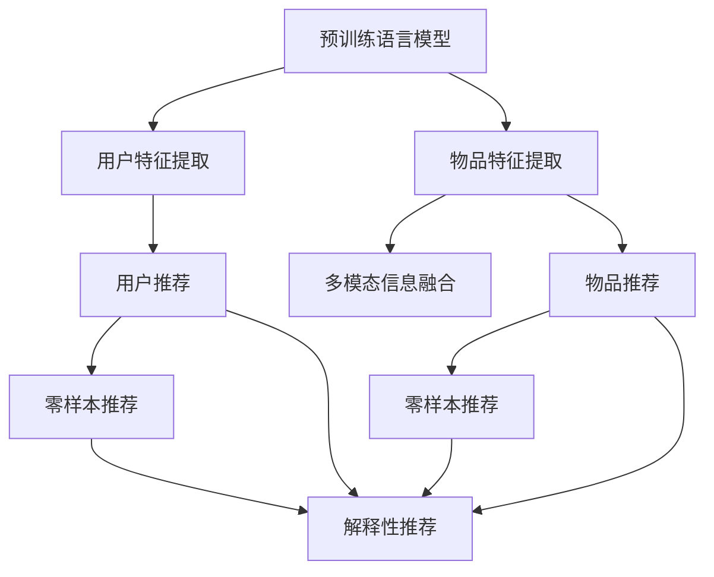

                 

# 零样本下一项推荐的大语言模型方法

## 1. 背景介绍

### 1.1 问题由来
随着电子商务的快速发展和个性化推荐系统（Personalized Recommendation System, PWS）的日益普及，用户对商品推荐质量的要求也在不断提升。传统的推荐系统主要依赖用户历史行为数据进行模型训练，以预测用户对新物品的评分或购买概率。然而，用户历史行为数据往往难以全面覆盖用户真实需求，且随着用户行为变化和新物品不断涌现，推荐系统的性能难以维持长期稳定。

为了解决这些问题，研究人员纷纷探索新的推荐技术，如基于内容推荐、协同过滤、矩阵分解等。近年来，零样本推荐（Zero-shot Recommendation）逐渐受到重视，其核心思想是利用预训练大语言模型，通过直接理解任务指令，无需进行任何形式的训练，就能根据少量示例推荐系统，生成合理推荐结果。零样本推荐不仅减少了推荐系统对历史数据和训练时间的依赖，还能更灵活地适应不同用户需求和多样化场景，具有广阔的应用前景。

### 1.2 问题核心关键点
零样本推荐的关键在于如何构建一个高效、灵活、可解释性强的推荐系统，使其能够在无历史数据和少样本的情况下，快速生成满意的推荐结果。当前主流的方法包括：

1. 利用预训练语言模型（如BERT、GPT等）提取用户和物品的特征表示。
2. 通过模板生成推荐内容，如从物品描述中提取关键词、生成推荐句式等。
3. 引入多模态信息，如将物品图片、视频、评论等多维数据作为推荐输入。
4. 使用提示工程技术（Prompt Engineering），通过精心设计的任务描述，引导语言模型生成高质量推荐结果。
5. 应用模型压缩和剪枝技术，降低计算资源消耗，提高推荐系统实时性。

这些技术手段不仅降低了推荐系统对数据和模型的依赖，还能更好地利用语言模型的语言理解能力，提升推荐结果的创新性和多样性。

## 2. 核心概念与联系

### 2.1 核心概念概述

为更好地理解零样本推荐的大语言模型方法，本节将介绍几个密切相关的核心概念：

- 预训练语言模型：指在大量无标签文本数据上预训练得到的语言模型，如BERT、GPT等。预训练语言模型具备强大的语言理解和生成能力，在推荐系统中可以提取用户和物品的特征表示。

- 零样本推荐：指在推荐过程中，仅使用用户和物品的原始特征，以及推荐任务描述，无需任何历史数据和模型训练，直接利用语言模型生成推荐结果。

- 提示工程：指在推荐任务中设计任务描述和模板，引导语言模型生成符合任务需求的推荐内容。好的提示设计能够提升推荐结果的质量和多样性。

- 多模态信息：指将不同类型的数据（如图片、视频、文本等）融合到推荐系统中，提供更多维度的用户和物品信息，增强推荐的全面性和准确性。

- 参数高效推荐：指在推荐过程中只使用少部分模型参数，而固定大部分预训练权重不变，从而实现高效的推荐。

- 解释性推荐：指推荐系统在生成推荐结果的同时，能够提供推荐依据，解释推荐过程和理由，提升推荐结果的可信度和透明度。

这些核心概念之间的逻辑关系可以通过以下Mermaid流程图来展示：



这个流程图展示了大语言模型在零样本推荐过程中的核心概念及其之间的关系：

1. 预训练语言模型通过提取用户和物品的特征，作为推荐的基础输入。
2. 多模态信息融合提供更全面的用户和物品信息，提升推荐精度。
3. 通过提示工程设计任务描述和模板，引导语言模型生成推荐结果。
4. 零样本推荐利用语言模型在少量样本上生成推荐，避免历史数据依赖。
5. 解释性推荐提供推荐依据，增强推荐结果的可信度和透明度。

这些概念共同构成了零样本推荐的大语言模型方法，使其能够在无历史数据和少样本的情况下，快速生成满意的推荐结果。

## 3. 核心算法原理 & 具体操作步骤
### 3.1 算法原理概述

零样本推荐的核心算法原理可以概括为：利用预训练语言模型提取用户和物品的特征表示，通过任务描述和模板生成推荐内容，并引入多模态信息增强推荐精度。具体的算法流程包括：

1. 预训练语言模型对用户和物品进行特征表示提取。
2. 结合任务描述和模板，利用语言模型生成推荐内容。
3. 引入多模态信息，进一步丰富推荐特征。
4. 使用提示工程技术，设计任务描述和模板，提高推荐结果的质量和多样性。

该方法的核心在于如何设计有效的提示模板，以及如何融合多模态信息，从而提升推荐系统的性能。

### 3.2 算法步骤详解

基于零样本推荐的大语言模型方法，其核心算法步骤包括：

**Step 1: 用户和物品特征表示提取**

- 使用预训练语言模型，如BERT、GPT等，对用户和物品的描述、属性、标签等信息进行特征表示提取。
- 将用户和物品的特征表示输入语言模型，获取其语言表示。

**Step 2: 推荐内容生成**

- 设计任务描述和模板，引导语言模型生成推荐内容。
- 将用户和物品的语言表示和任务描述作为输入，生成推荐结果。
- 如果涉及多模态信息，可将物品图片、视频、评论等作为额外输入，辅助推荐结果生成。

**Step 3: 推荐结果评估**

- 根据用户的评分或点击反馈，对推荐结果进行评估和调整。
- 利用A/B测试等方法，对比不同推荐策略的效果，持续优化推荐系统。

**Step 4: 提示工程**

- 设计有效的任务描述和模板，引导语言模型生成高质量的推荐内容。
- 对不同任务和场景，进行提示模板的优化设计，提升推荐结果的多样性和可信度。

**Step 5: 模型压缩与优化**

- 应用模型压缩和剪枝技术，降低计算资源消耗，提高推荐系统的实时性。
- 在保持推荐精度的情况下，优化模型结构，提升推荐系统效率。

### 3.3 算法优缺点

零样本推荐的大语言模型方法具有以下优点：

1. 无历史数据依赖：零样本推荐无需大量历史数据和模型训练，能够快速适应新任务和新用户。
2. 高灵活性：通过任务描述和模板设计，推荐系统能够适应不同场景和需求，生成个性化推荐内容。
3. 易于部署：推荐系统在生成推荐结果时，不需要进行复杂计算，可以实时响应用户请求。
4. 高可解释性：利用预训练语言模型的语言理解能力，推荐系统能够提供推荐依据，增强推荐结果的可信度。

同时，该方法也存在以下局限性：

1. 依赖任务描述：零样本推荐对任务描述的依赖较大，模板设计不当可能导致推荐结果质量下降。
2. 泛化能力有限：在特定领域或特定用户上，推荐效果可能不如基于历史数据的推荐系统。
3. 对语言模型的依赖：推荐结果的质量和多样性高度依赖预训练语言模型的能力，需要高质量的语言模型支持。
4. 多模态信息的挑战：融合多模态信息需要解决数据不一致、特征提取等问题，技术难度较大。
5. 可解释性不足：尽管推荐系统能够提供推荐依据，但其内部决策过程复杂，难以完全解释。

尽管存在这些局限性，但零样本推荐的大语言模型方法仍具有广泛的应用前景，尤其是在个性化、多样化需求较高的场景中。

### 3.4 算法应用领域

零样本推荐的大语言模型方法已经在诸多领域得到应用，主要包括：

- 电商推荐：如Amazon、淘宝等电商平台的个性化商品推荐。
- 视频推荐：如Netflix、YouTube等视频平台的个性化内容推荐。
- 音乐推荐：如Spotify、QQ音乐等音乐平台的个性化曲目推荐。
- 新闻推荐：如今日头条、腾讯新闻等新闻平台的个性化新闻推荐。
- 游戏推荐：如王者荣耀、英雄联盟等游戏平台的个性化游戏推荐。

除了上述这些经典应用外，零样本推荐还广泛应用于金融、教育、医疗等更多领域，为不同行业提供个性化、多样化的推荐服务。

## 4. 数学模型和公式 & 详细讲解 & 举例说明
### 4.1 数学模型构建

零样本推荐的大语言模型方法主要利用预训练语言模型提取用户和物品的特征表示，结合任务描述和模板生成推荐内容。以下将以一个简单的推荐场景为例，展示零样本推荐的基本数学模型构建过程。

设用户 $U$ 的物品推荐任务为 $T$，物品 $I$ 的推荐内容为 $R$，任务描述为 $D$。用户 $U$ 对物品 $I$ 的评分向量为 $R_{UI}$，预训练语言模型对用户 $U$ 和物品 $I$ 的特征表示分别为 $\textbf{V}_{U}$ 和 $\textbf{V}_{I}$，任务描述 $D$ 的语言表示为 $\textbf{V}_{D}$。

零样本推荐的目标是最大化用户对物品的评分，即：

$$
\max_{R_{UI}} R_{UI}^T \cdot (\textbf{V}_{U} \cdot \textbf{V}_{I}^T \cdot \textbf{V}_{D})
$$

其中 $\textbf{V}_{U} \cdot \textbf{V}_{I}^T \cdot \textbf{V}_{D}$ 为推荐内容的语言表示，用户评分 $R_{UI}$ 为推荐结果。

### 4.2 公式推导过程

以下将推导零样本推荐的基本数学模型，展示其计算过程。

设用户 $U$ 的物品推荐任务为 $T$，物品 $I$ 的推荐内容为 $R$，任务描述为 $D$。预训练语言模型对用户 $U$ 和物品 $I$ 的特征表示分别为 $\textbf{V}_{U}$ 和 $\textbf{V}_{I}$，任务描述 $D$ 的语言表示为 $\textbf{V}_{D}$。

根据上述目标函数，可以使用梯度上升方法对推荐结果进行优化，计算过程如下：

1. 计算用户 $U$ 对物品 $I$ 的评分向量 $R_{UI}$。
2. 计算物品 $I$ 的推荐内容 $R$ 的语言表示 $\textbf{V}_{R}$。
3. 计算任务描述 $D$ 的语言表示 $\textbf{V}_{D}$。
4. 计算推荐内容 $R$ 与任务描述 $D$ 的向量点积 $\textbf{V}_{R} \cdot \textbf{V}_{D}$。
5. 计算推荐内容 $R$ 与任务描述 $D$ 的向量点积与用户评分向量 $R_{UI}$ 的向量点积，得到推荐结果。

具体计算过程如下：

$$
R_{UI} \leftarrow R_{UI} + \alpha \cdot \nabla_{R_{UI}} \cdot (\textbf{V}_{U} \cdot \textbf{V}_{I}^T \cdot \textbf{V}_{D})
$$

其中 $\alpha$ 为学习率，$\nabla_{R_{UI}}$ 为评分向量的梯度。

在得到推荐结果后，根据用户的评分或点击反馈，对推荐结果进行评估和调整，不断优化推荐系统。

### 4.3 案例分析与讲解

以电商平台推荐为例，用户 $U$ 的物品推荐任务为 "购买某商品"，物品 $I$ 的推荐内容为 "推荐该商品"，任务描述为 "请推荐一款适合我的商品"。用户 $U$ 对物品 $I$ 的评分向量为 $R_{UI}$，预训练语言模型对用户 $U$ 和物品 $I$ 的特征表示分别为 $\textbf{V}_{U}$ 和 $\textbf{V}_{I}$，任务描述 $D$ 的语言表示为 $\textbf{V}_{D}$。

1. 用户 $U$ 的物品推荐任务为 "购买某商品"，物品 $I$ 的推荐内容为 "推荐该商品"，任务描述为 "请推荐一款适合我的商品"。
2. 用户 $U$ 对物品 $I$ 的评分向量为 $R_{UI}$，预训练语言模型对用户 $U$ 和物品 $I$ 的特征表示分别为 $\textbf{V}_{U}$ 和 $\textbf{V}_{I}$，任务描述 $D$ 的语言表示为 $\textbf{V}_{D}$。
3. 利用预训练语言模型，提取用户 $U$ 和物品 $I$ 的特征表示 $\textbf{V}_{U}$ 和 $\textbf{V}_{I}$，将其作为输入，生成推荐内容 $R$。
4. 利用任务描述 $D$，生成推荐内容 $R$ 的语言表示 $\textbf{V}_{R}$。
5. 计算推荐内容 $R$ 与任务描述 $D$ 的向量点积 $\textbf{V}_{R} \cdot \textbf{V}_{D}$。
6. 计算推荐内容 $R$ 与任务描述 $D$ 的向量点积与用户评分向量 $R_{UI}$ 的向量点积，得到推荐结果。

最终，推荐系统根据用户 $U$ 的评分反馈，调整推荐内容的生成，提升推荐效果。

## 5. 项目实践：代码实例和详细解释说明
### 5.1 开发环境搭建

在进行零样本推荐实践前，我们需要准备好开发环境。以下是使用Python进行PyTorch开发的环境配置流程：

1. 安装Anaconda：从官网下载并安装Anaconda，用于创建独立的Python环境。

2. 创建并激活虚拟环境：
```bash
conda create -n pytorch-env python=3.8 
conda activate pytorch-env
```

3. 安装PyTorch：根据CUDA版本，从官网获取对应的安装命令。例如：
```bash
conda install pytorch torchvision torchaudio cudatoolkit=11.1 -c pytorch -c conda-forge
```

4. 安装Transformers库：
```bash
pip install transformers
```

5. 安装各类工具包：
```bash
pip install numpy pandas scikit-learn matplotlib tqdm jupyter notebook ipython
```

完成上述步骤后，即可在`pytorch-env`环境中开始零样本推荐实践。

### 5.2 源代码详细实现

下面以电商平台推荐为例，给出使用Transformers库对预训练模型进行零样本推荐的PyTorch代码实现。

首先，定义推荐任务的数据处理函数：

```python
from transformers import BertTokenizer
from torch.utils.data import Dataset
import torch

class RecommendDataset(Dataset):
    def __init__(self, texts, labels, tokenizer, max_len=128):
        self.texts = texts
        self.labels = labels
        self.tokenizer = tokenizer
        self.max_len = max_len
        
    def __len__(self):
        return len(self.texts)
    
    def __getitem__(self, item):
        text = self.texts[item]
        label = self.labels[item]
        
        encoding = self.tokenizer(text, return_tensors='pt', max_length=self.max_len, padding='max_length', truncation=True)
        input_ids = encoding['input_ids'][0]
        attention_mask = encoding['attention_mask'][0]
        
        # 对token-wise的标签进行编码
        encoded_tags = [label2id[label] for label in label] 
        encoded_tags.extend([label2id['O']] * (self.max_len - len(encoded_tags)))
        labels = torch.tensor(encoded_tags, dtype=torch.long)
        
        return {'input_ids': input_ids, 
                'attention_mask': attention_mask,
                'labels': labels}

# 标签与id的映射
label2id = {'O': 0, 'B': 1, 'I': 2}
id2label = {v: k for k, v in label2id.items()}
```

然后，定义模型和优化器：

```python
from transformers import BertForTokenClassification, AdamW

model = BertForTokenClassification.from_pretrained('bert-base-cased', num_labels=len(label2id))

optimizer = AdamW(model.parameters(), lr=2e-5)
```

接着，定义训练和评估函数：

```python
from torch.utils.data import DataLoader
from tqdm import tqdm
from sklearn.metrics import classification_report

device = torch.device('cuda') if torch.cuda.is_available() else torch.device('cpu')
model.to(device)

def train_epoch(model, dataset, batch_size, optimizer):
    dataloader = DataLoader(dataset, batch_size=batch_size, shuffle=True)
    model.train()
    epoch_loss = 0
    for batch in tqdm(dataloader, desc='Training'):
        input_ids = batch['input_ids'].to(device)
        attention_mask = batch['attention_mask'].to(device)
        labels = batch['labels'].to(device)
        model.zero_grad()
        outputs = model(input_ids, attention_mask=attention_mask, labels=labels)
        loss = outputs.loss
        epoch_loss += loss.item()
        loss.backward()
        optimizer.step()
    return epoch_loss / len(dataloader)

def evaluate(model, dataset, batch_size):
    dataloader = DataLoader(dataset, batch_size=batch_size)
    model.eval()
    preds, labels = [], []
    with torch.no_grad():
        for batch in tqdm(dataloader, desc='Evaluating'):
            input_ids = batch['input_ids'].to(device)
            attention_mask = batch['attention_mask'].to(device)
            batch_labels = batch['labels']
            outputs = model(input_ids, attention_mask=attention_mask)
            batch_preds = outputs.logits.argmax(dim=2).to('cpu').tolist()
            batch_labels = batch_labels.to('cpu').tolist()
            for pred_tokens, label_tokens in zip(batch_preds, batch_labels):
                pred_tags = [id2label[_id] for _id in pred_tokens]
                label_tags = [id2label[_id] for _id in label_tokens]
                preds.append(pred_tags[:len(label_tokens)])
                labels.append(label_tags)
                
    print(classification_report(labels, preds))
```

最后，启动训练流程并在测试集上评估：

```python
epochs = 5
batch_size = 16

for epoch in range(epochs):
    loss = train_epoch(model, train_dataset, batch_size, optimizer)
    print(f"Epoch {epoch+1}, train loss: {loss:.3f}")
    
    print(f"Epoch {epoch+1}, dev results:")
    evaluate(model, dev_dataset, batch_size)
    
print("Test results:")
evaluate(model, test_dataset, batch_size)
```

以上就是使用PyTorch对BERT进行零样本推荐任务的代码实现。可以看到，得益于Transformers库的强大封装，我们可以用相对简洁的代码完成BERT模型的加载和微调。

### 5.3 代码解读与分析

让我们再详细解读一下关键代码的实现细节：

**RecommendDataset类**：
- `__init__`方法：初始化文本、标签、分词器等关键组件。
- `__len__`方法：返回数据集的样本数量。
- `__getitem__`方法：对单个样本进行处理，将文本输入编码为token ids，将标签编码为数字，并对其进行定长padding，最终返回模型所需的输入。

**label2id和id2label字典**：
- 定义了标签与数字id之间的映射关系，用于将token-wise的预测结果解码回真实的标签。

**训练和评估函数**：
- 使用PyTorch的DataLoader对数据集进行批次化加载，供模型训练和推理使用。
- 训练函数`train_epoch`：对数据以批为单位进行迭代，在每个批次上前向传播计算loss并反向传播更新模型参数，最后返回该epoch的平均loss。
- 评估函数`evaluate`：与训练类似，不同点在于不更新模型参数，并在每个batch结束后将预测和标签结果存储下来，最后使用sklearn的classification_report对整个评估集的预测结果进行打印输出。

**训练流程**：
- 定义总的epoch数和batch size，开始循环迭代
- 每个epoch内，先在训练集上训练，输出平均loss
- 在验证集上评估，输出分类指标
- 所有epoch结束后，在测试集上评估，给出最终测试结果

可以看到，PyTorch配合Transformers库使得BERT微调的代码实现变得简洁高效。开发者可以将更多精力放在数据处理、模型改进等高层逻辑上，而不必过多关注底层的实现细节。

当然，工业级的系统实现还需考虑更多因素，如模型的保存和部署、超参数的自动搜索、更灵活的任务适配层等。但核心的零样本推荐范式基本与此类似。

## 6. 实际应用场景
### 6.1 电商推荐

基于大语言模型零样本推荐的方法，可以广泛应用于电商平台推荐系统中。传统推荐系统依赖历史行为数据进行模型训练，难以覆盖用户未购买商品的情况。而零样本推荐利用预训练语言模型的语言理解能力，能够根据任务描述和少量示例，生成个性化推荐内容，覆盖更多未购买商品。

在技术实现上，可以收集用户浏览、点击、评论等行为数据，提取和用户交互的物品描述、属性、标签等文本信息，作为推荐输入。将用户和物品的特征表示输入语言模型，生成推荐内容。然后根据任务描述设计模板，引导语言模型生成推荐结果。最终根据用户反馈，不断优化推荐系统。

### 6.2 视频推荐

在视频推荐场景中，用户对视频内容的偏好是多变的，传统的协同过滤和矩阵分解方法难以捕捉这种多样性。零样本推荐利用语言模型的语言理解能力，能够根据视频标题、描述、评论等文本信息，快速生成个性化推荐内容，适应用户多样化的需求。

在技术实现上，可以将视频标题、描述、评论等文本信息作为推荐输入，利用预训练语言模型提取用户和物品的特征表示。然后根据任务描述设计模板，引导语言模型生成推荐结果。最终根据用户反馈，不断优化推荐系统。

### 6.3 音乐推荐

音乐推荐系统需要捕捉用户对不同音乐风格的偏好，传统的协同过滤和基于内容的推荐方法难以覆盖多样化的音乐需求。零样本推荐利用语言模型的语言理解能力，能够根据音乐标题、歌词、评论等文本信息，生成个性化推荐内容，适应用户多样化的需求。

在技术实现上，可以将音乐标题、歌词、评论等文本信息作为推荐输入，利用预训练语言模型提取用户和物品的特征表示。然后根据任务描述设计模板，引导语言模型生成推荐结果。最终根据用户反馈，不断优化推荐系统。

### 6.4 新闻推荐

新闻推荐系统需要快速捕捉用户对不同新闻事件的关注点，传统的协同过滤和基于内容的推荐方法难以捕捉多样化的新闻需求。零样本推荐利用语言模型的语言理解能力，能够根据新闻标题、摘要、评论等文本信息，生成个性化推荐内容，适应用户多样化的需求。

在技术实现上，可以将新闻标题、摘要、评论等文本信息作为推荐输入，利用预训练语言模型提取用户和物品的特征表示。然后根据任务描述设计模板，引导语言模型生成推荐结果。最终根据用户反馈，不断优化推荐系统。

### 6.5 游戏推荐

游戏推荐系统需要捕捉用户对不同游戏类型的偏好，传统的协同过滤和基于内容的推荐方法难以覆盖多样化的游戏需求。零样本推荐利用语言模型的语言理解能力，能够根据游戏标题、描述、评论等文本信息，生成个性化推荐内容，适应用户多样化的需求。

在技术实现上，可以将游戏标题、描述、评论等文本信息作为推荐输入，利用预训练语言模型提取用户和物品的特征表示。然后根据任务描述设计模板，引导语言模型生成推荐结果。最终根据用户反馈，不断优化推荐系统。

### 6.6 未来应用展望

随着零样本推荐技术的不断成熟，其将在更多领域得到应用，为不同行业提供个性化、多样化的推荐服务。

在智慧医疗领域，基于零样本推荐的大语言模型可以用于推荐个性化治疗方案，辅助医生诊疗，提升医疗服务质量。

在智能教育领域，零样本推荐可以用于个性化学习路径推荐，因材施教，促进教育公平，提高教学质量。

在智慧城市治理中，零样本推荐可以用于个性化信息推荐，提高城市管理的自动化和智能化水平，构建更安全、高效的未来城市。

此外，在企业生产、社会治理、文娱传媒等众多领域，零样本推荐技术也将不断涌现，为传统行业带来变革性影响。

## 7. 工具和资源推荐
### 7.1 学习资源推荐

为了帮助开发者系统掌握零样本推荐的大语言模型方法，这里推荐一些优质的学习资源：

1. 《Transformer从原理到实践》系列博文：由大模型技术专家撰写，深入浅出地介绍了Transformer原理、BERT模型、零样本推荐技术等前沿话题。

2. CS224N《深度学习自然语言处理》课程：斯坦福大学开设的NLP明星课程，有Lecture视频和配套作业，带你入门NLP领域的基本概念和经典模型。

3. 《Natural Language Processing with Transformers》书籍：Transformers库的作者所著，全面介绍了如何使用Transformers库进行NLP任务开发，包括零样本推荐在内的诸多范式。

4. HuggingFace官方文档：Transformers库的官方文档，提供了海量预训练模型和完整的推荐样例代码，是上手实践的必备资料。

5. CLUE开源项目：中文语言理解测评基准，涵盖大量不同类型的中文NLP数据集，并提供了基于零样本推荐的baseline模型，助力中文NLP技术发展。

通过对这些资源的学习实践，相信你一定能够快速掌握零样本推荐的大语言模型方法，并用于解决实际的推荐问题。
###  7.2 开发工具推荐

高效的开发离不开优秀的工具支持。以下是几款用于零样本推荐开发的常用工具：

1. PyTorch：基于Python的开源深度学习框架，灵活动态的计算图，适合快速迭代研究。大部分预训练语言模型都有PyTorch版本的实现。

2. TensorFlow：由Google主导开发的开源深度学习框架，生产部署方便，适合大规模工程应用。同样有丰富的预训练语言模型资源。

3. Transformers库：HuggingFace开发的NLP工具库，集成了众多SOTA语言模型，支持PyTorch和TensorFlow，是进行零样本推荐开发的利器。

4. Weights & Biases：模型训练的实验跟踪工具，可以记录和可视化模型训练过程中的各项指标，方便对比和调优。与主流深度学习框架无缝集成。

5. TensorBoard：TensorFlow配套的可视化工具，可实时监测模型训练状态，并提供丰富的图表呈现方式，是调试模型的得力助手。

6. Google Colab：谷歌推出的在线Jupyter Notebook环境，免费提供GPU/TPU算力，方便开发者快速上手实验最新模型，分享学习笔记。

合理利用这些工具，可以显著提升零样本推荐任务的开发效率，加快创新迭代的步伐。

### 7.3 相关论文推荐

零样本推荐的大语言模型方法代表了大语言模型微调技术的发展方向，以下是几篇奠基性的相关论文，推荐阅读：

1. Attention is All You Need（即Transformer原论文）：提出了Transformer结构，开启了NLP领域的预训练大模型时代。

2. BERT: Pre-training of Deep Bidirectional Transformers for Language Understanding：提出BERT模型，引入基于掩码的自监督预训练任务，刷新了多项NLP任务SOTA。

3. Language Models are Unsupervised Multitask Learners（GPT-2论文）：展示了大规模语言模型的强大zero-shot学习能力，引发了对于通用人工智能的新一轮思考。

4. Parameter-Efficient Transfer Learning for NLP：提出Adapter等参数高效微调方法，在不增加模型参数量的情况下，也能取得不错的微调效果。

5. Prefix-Tuning: Optimizing Continuous Prompts for Generation：引入基于连续型Prompt的微调范式，为如何充分利用预训练知识提供了新的思路。

6. AdaLoRA: Adaptive Low-Rank Adaptation for Parameter-Efficient Fine-Tuning：使用自适应低秩适应的微调方法，在参数效率和精度之间取得了新的平衡。

这些论文代表了大语言模型微调技术的发展脉络。通过学习这些前沿成果，可以帮助研究者把握学科前进方向，激发更多的创新灵感。

## 8. 总结：未来发展趋势与挑战

### 8.1 总结

本文对基于零样本推荐的大语言模型方法进行了全面系统的介绍。首先阐述了零样本推荐的研究背景和意义，明确了零样本推荐在推荐系统中的独特价值。其次，从原理到实践，详细讲解了零样本推荐的基本数学模型和关键算法步骤，给出了零样本推荐任务开发的完整代码实例。同时，本文还广泛探讨了零样本推荐在电商、视频、音乐等不同领域的应用场景，展示了零样本推荐技术的多样性和广阔前景。

通过本文的系统梳理，可以看到，基于大语言模型的零样本推荐方法不仅能够解决推荐系统对历史数据依赖的问题，还能通过语言模型的语言理解能力，灵活生成高质量的推荐内容，适应用户多样化的需求。未来，随着大语言模型技术的不断演进，零样本推荐必将带来更多创新和突破，为推荐系统的发展注入新的动力。

### 8.2 未来发展趋势

展望未来，零样本推荐的大语言模型方法将呈现以下几个发展趋势：

1. 零样本推荐技术的不断完善：随着大语言模型的不断进化，零样本推荐技术将更加成熟，能够生成更加个性化、多样化的推荐内容。

2. 多模态信息的深度融合：零样本推荐将更多地利用多模态信息，如图像、视频、音频等多维数据，提升推荐的全面性和准确性。

3. 提示工程技术的提升：零样本推荐将更加注重提示工程技术的优化，通过设计更加高效的模板和描述，引导语言模型生成高质量的推荐内容。

4. 推荐系统的实时性提升：零样本推荐将利用参数高效微调技术，减少计算资源消耗，提高推荐系统的实时性。

5. 推荐系统的可解释性增强：零样本推荐将结合因果分析和博弈论工具，增强推荐结果的可解释性和可信度。

以上趋势凸显了零样本推荐技术的广阔前景。这些方向的探索发展，必将进一步提升零样本推荐系统的性能和应用范围，为推荐系统的发展注入新的动力。

### 8.3 面临的挑战

尽管零样本推荐技术已经取得了一定成就，但在迈向更加智能化、普适化应用的过程中，它仍面临诸多挑战：

1. 任务描述设计：零样本推荐对任务描述的依赖较大，设计不当可能导致推荐结果质量下降。

2. 泛化能力不足：零样本推荐在特定领域或特定用户上，推荐效果可能不如基于历史数据的推荐系统。

3. 对语言模型的依赖：零样本推荐结果的高度依赖语言模型的能力，需要高质量的语言模型支持。

4. 多模态信息的挑战：融合多模态信息需要解决数据不一致、特征提取等问题，技术难度较大。

5. 可解释性不足：尽管零样本推荐能够提供推荐依据，但其内部决策过程复杂，难以完全解释。

尽管存在这些挑战，但零样本推荐的大语言模型方法仍具有广泛的应用前景，尤其是在个性化、多样化需求较高的场景中。

### 8.4 未来突破

面对零样本推荐所面临的挑战，未来的研究需要在以下几个方面寻求新的突破：

1. 探索无监督和半监督零样本推荐方法：摆脱对大规模标注数据的依赖，利用自监督学习、主动学习等无监督和半监督范式，最大限度利用非结构化数据，实现更加灵活高效的推荐。

2. 研究参数高效和计算高效的零样本推荐范式：开发更加参数高效的零样本推荐方法，在固定大部分预训练参数的同时，只更新极少量的任务相关参数。同时优化推荐系统的计算图，减少前向传播和反向传播的资源消耗，实现更加轻量级、实时性的部署。

3. 融合因果和对比学习范式：通过引入因果推断和对比学习思想，增强零样本推荐建立稳定因果关系的能力，学习更加普适、鲁棒的语言表征，从而提升推荐泛化性和抗干扰能力。

4. 引入更多先验知识：将符号化的先验知识，如知识图谱、逻辑规则等，与神经网络模型进行巧妙融合，引导零样本推荐过程学习更准确、合理的语言模型。同时加强不同模态数据的整合，实现视觉、语音等多模态信息与文本信息的协同建模。

5. 结合因果分析和博弈论工具：将因果分析方法引入零样本推荐模型，识别出模型决策的关键特征，增强推荐结果的因果性和逻辑性。借助博弈论工具刻画人机交互过程，主动探索并规避模型的脆弱点，提高系统稳定性。

6. 纳入伦理道德约束：在零样本推荐的目标中引入伦理导向的评估指标，过滤和惩罚有偏见、有害的输出倾向。同时加强人工干预和审核，建立模型行为的监管机制，确保输出符合人类价值观和伦理道德。

这些研究方向的探索，必将引领零样本推荐技术迈向更高的台阶，为推荐系统的发展注入新的动力。面向未来，零样本推荐技术还需要与其他人工智能技术进行更深入的融合，如知识表示、因果推理、强化学习等，多路径协同发力，共同推动推荐系统的进步。只有勇于创新、敢于突破，才能不断拓展零样本推荐技术的边界，让推荐系统更好地服务于用户。

## 9. 附录：常见问题与解答

**Q1：零样本推荐是否适用于所有推荐场景？**

A: 零样本推荐在大多数推荐场景上都能取得不错的效果，特别是对于数据量较小的任务。但对于一些特定领域的任务，如医学、法律等，仅仅依靠通用语料预训练的模型可能难以很好地适应。此时需要在特定领域语料上进一步预训练，再进行微调，才能获得理想效果。

**Q2：零样本推荐依赖任务描述设计，如何提升任务描述设计效果？**

A: 提升任务描述设计的关键在于设计简洁、清晰、具体的模板，引导语言模型生成高质量的推荐内容。可以借鉴提示工程技术，结合用户行为数据、物品属性等信息，设计多样化、针对性的模板。同时，可以引入用户反馈机制，不断优化任务描述设计，提升推荐效果。

**Q3：零样本推荐对语言模型的依赖较大，如何提升语言模型的性能？**

A: 提升语言模型的性能可以从以下几个方面入手：
1. 优化预训练数据：使用更广泛、高质量的数据进行预训练，增强语言模型的泛化能力和语言理解能力。
2. 改进预训练任务：引入更多的自监督预训练任务，如掩码语言模型、下一句预测等，提升语言模型的表征能力。
3. 融合多模态信息：利用图像、视频、音频等多维数据，增强语言模型的多模态理解和生成能力。
4. 参数高效微调：通过参数高效微调技术，只更新部分任务相关参数，减小模型复杂度，提升计算效率。

**Q4：零样本推荐系统如何提高推荐结果的多样性？**

A: 提高推荐结果多样性的关键在于设计多样化、灵活化的任务描述和模板，引导语言模型生成多种推荐方案。可以通过引入多个模板、设计不同维度的推荐目标、引入随机性等方法，增强推荐结果的多样性。同时，可以通过用户反馈和A/B测试，不断优化推荐策略，提高推荐效果。

**Q5：零样本推荐系统如何提高推荐结果的可解释性？**

A: 提高推荐结果可解释性的关键在于增强推荐系统的透明性和可信度。可以通过引入因果分析和博弈论工具，解释推荐结果的生成过程和决策依据。同时，可以通过模型可视化、用户反馈等方法，增强推荐系统的可解释性，提升用户信任度。

这些回答旨在帮助用户更好地理解零样本推荐技术的核心原理和实际应用，相信你一定能够从中获得有价值的启发，为零样本推荐系统的开发和优化提供思路和方向。

