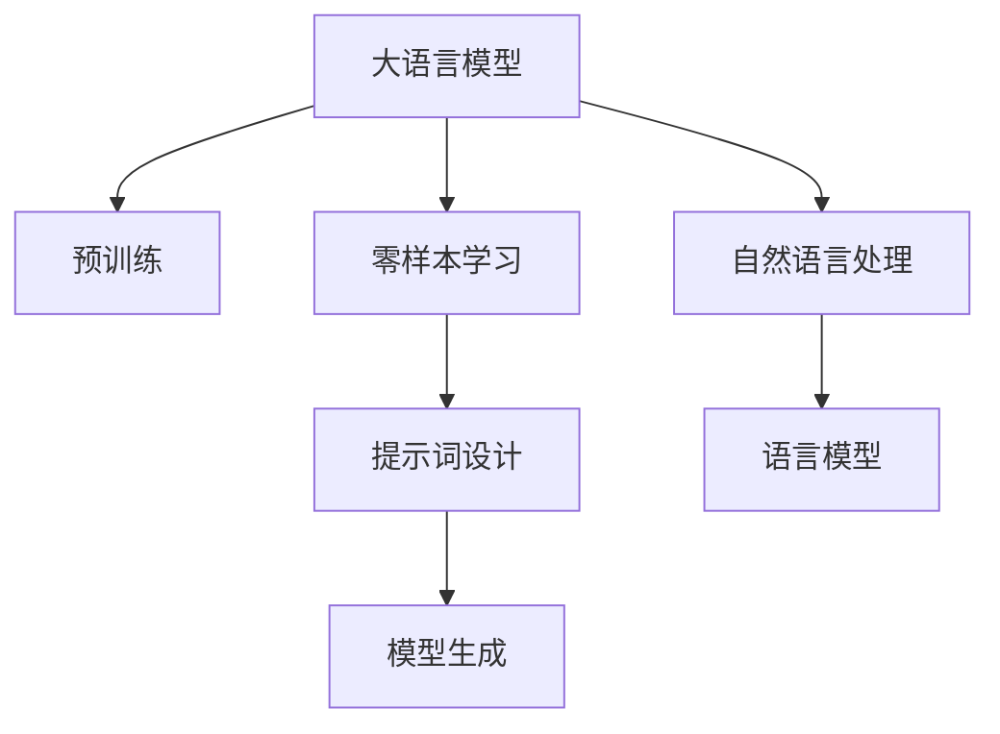

                 

# 零样本学习：Prompt的设计

> 关键词：零样本学习, Prompt, 提示词, 语言模型, 自然语言处理(NLP), 可解释性, 自动生成, 创造力

## 1. 背景介绍

### 1.1 问题由来
零样本学习(Zero-shot Learning)是一种无需任何训练数据就能解决新任务的机器学习方法。在实际应用中，获取训练数据往往成本高昂且耗时，限制了传统监督学习范式的应用场景。零样本学习通过对任务描述的精心设计，直接利用语言模型的预训练知识，实现了在完全无标注数据的情况下对新任务进行推理和生成。

近年来，基于大语言模型的零样本学习技术迅速发展，在问答、分类、生成等诸多NLP任务上取得了显著的效果。著名的模型如GPT、LaMDA、mPLUG等，在zero-shot学习场景下的表现甚至超过有标注的数据驱动方法。

然而，要实现高质量的零样本学习，精心设计的提示词(Prompt)至关重要。提示词是模型理解任务意图和生成结果的关键。一个有效的提示词可以引导模型生成符合预期的答案，而一个无效的提示词则可能导致模型输出混乱或产生错误结果。因此，如何设计高效、易用的提示词，是零样本学习领域的重要研究方向。

### 1.2 问题核心关键点
1. **提示词设计**：提示词是任务描述的文本表示，应具备足够的描述性，以明确任务的边界和目的。
2. **模型选择**：不同的大语言模型具备不同的预训练能力和语言知识，对提示词的设计和效果也有重要影响。
3. **样本生成**：通过提示词，模型能够自动生成样本，无需额外标注，这在数据稀缺的领域尤为有效。
4. **效果评估**：零样本学习的评估指标应综合考虑模型生成的准确性和自然性，以及可解释性和公平性等指标。

### 1.3 问题研究意义
零样本学习技术的广泛应用，对于解决数据稀缺问题、加速知识创新和人工智能应用落地具有重要意义：

1. **数据效率提升**：无需标注数据，减少数据收集和标注的成本，提高模型的应用效率。
2. **知识传递增强**：利用语言模型的广泛知识，加速新领域知识的普及和传播。
3. **应用场景丰富**：适用于各种需要快速响应新任务的场景，如智能客服、个性化推荐、舆情监测等。
4. **创造力提升**：模型能够基于任务描述，生成新颖创意，增强人机交互的自然性和创造性。

## 2. 核心概念与联系

### 2.1 核心概念概述

为更好地理解零样本学习中的提示词设计，本节将介绍几个关键概念：

- **大语言模型(Large Language Model, LLM)**：以自回归(如GPT)或自编码(如BERT)模型为代表的预训练语言模型，具有丰富的语言知识和泛化能力。
- **零样本学习(Zero-shot Learning)**：模型在完全无标注数据的情况下，利用任务描述进行推理和生成的能力。
- **提示词(Prompt)**：用于描述任务的具体文本，引导模型进行推理和生成，对零样本学习的效果有重要影响。
- **语言模型(Language Model)**：通过预测文本下一个词或字符的概率分布，学习语言的规律和结构。
- **自然语言处理(Natural Language Processing, NLP)**：利用计算机处理和理解人类自然语言的技术，包括文本分类、生成、问答等任务。

这些核心概念之间的逻辑关系可以通过以下Mermaid流程图来展示：



这个流程图展示了大语言模型、零样本学习、提示词设计、自然语言处理和语言模型之间的关系：

1. 大语言模型通过预训练获得基础能力。
2. 零样本学习利用大语言模型的预训练知识，在无标注数据情况下进行推理和生成。
3. 提示词设计是零样本学习的关键，决定了模型的输出效果。
4. 自然语言处理利用语言模型的预训练知识，实现文本处理和理解。
5. 语言模型通过预测文本的概率分布，学习语言的规律。

这些概念共同构成了零样本学习的学习和应用框架，使其能够实现高效、准确的推理和生成。通过理解这些核心概念，我们可以更好地把握零样本学习的工作原理和优化方向。

## 3. 核心算法原理 & 具体操作步骤
### 3.1 算法原理概述

零样本学习是基于大语言模型的推理任务，其核心思想是利用模型的预训练知识，在少量提示词的引导下，自动进行任务推理和生成。与传统的监督学习和有标注学习不同，零样本学习在任务描述中包含对任务的明确要求，通过推理推断出合理的输出结果。

形式化地，假设预训练语言模型为 $M_{\theta}$，其中 $\theta$ 为预训练得到的模型参数。对于一个新的推理任务 $T$，有描述 $P$，表示为文本形式。零样本学习目标是找到一个合适的输出 $y$，使得：

$$
y = \mathop{\arg\max}_{y} P(T \mid P)
$$

其中 $P$ 为任务 $T$ 的描述，$y$ 为可能的输出结果。

模型的输出 $y$ 取决于提示词 $P$ 的设计。提示词应足够描述性，以涵盖任务的关键信息。例如，对于判断图片是否为狗的推理任务，提示词可以是 "该图片是否包含狗？" 或 "这张图片中有狗吗？"。

### 3.2 算法步骤详解

零样本学习的关键步骤包括：

**Step 1: 准备预训练模型和任务描述**
- 选择合适的预训练语言模型 $M_{\theta}$ 作为初始化参数，如 GPT、LaMDA 等。
- 定义任务 $T$ 的描述 $P$，表示为文本形式。

**Step 2: 设计提示词**
- 根据任务 $T$ 的特点，设计合适的提示词 $P$，明确任务的输入输出要求。
- 提示词应简洁明了，能够覆盖任务的关键信息。

**Step 3: 执行模型推理**
- 将提示词 $P$ 作为输入，输入到预训练模型 $M_{\theta}$ 中进行推理，生成输出 $y$。
- 输出结果可能包含多个候选，需要根据实际应用场景进行筛选。

**Step 4: 结果评估**
- 对生成结果 $y$ 进行评估，如准确性、自然性、可解释性等指标。
- 根据评估结果，调整提示词设计，优化模型性能。

### 3.3 算法优缺点

零样本学习具备以下优点：

1. **高效性**：无需标注数据，利用预训练模型的知识，快速生成结果。
2. **灵活性**：适用于各种任务，只要能够描述任务要求，即可进行推理。
3. **可解释性**：模型的推理过程和输出结果具有可解释性，便于理解和调试。

同时，零样本学习也存在一些局限性：

1. **依赖提示词设计**：提示词的设计对模型的输出结果有重要影响，设计不当可能导致效果不佳。
2. **泛化能力有限**：零样本学习在特定任务上表现优异，但在新任务上效果可能较差。
3. **模型依赖**：依赖预训练模型的质量和语言知识，模型的性能直接影响推理结果。

尽管存在这些局限性，但零样本学习在数据稀缺和实时生成任务中展现出强大的潜力，特别是在需要快速响应新任务的场景中。

### 3.4 算法应用领域

零样本学习已经在多个领域得到应用，覆盖了从自然语言理解到图像识别等多种任务：

- **自然语言处理(NLP)**：如文本分类、问答、命名实体识别等，通过任务描述引导模型推理和生成。
- **计算机视觉(CV)**：如物体检测、图像分类等，通过图像和任务描述生成预测结果。
- **语音识别(Speech Recognition)**：如语音情感分析、语音指令识别等，通过语音和任务描述生成文本输出。
- **医学诊断**：如疾病诊断、基因分析等，通过病例描述生成诊断结果。
- **自动生成**：如文本生成、对话生成等，通过任务描述生成自然流畅的文本。

除了上述这些经典任务外，零样本学习还被创新性地应用到更多场景中，如创意写作、音乐生成、视频描述生成等，为各领域带来了新的突破。

## 4. 数学模型和公式 & 详细讲解  
### 4.1 数学模型构建

零样本学习可以视为一种基于生成模型的推理任务。给定任务描述 $P$，模型的目标是在输出空间 $Y$ 中生成最有可能的输出 $y$。

假设任务 $T$ 的描述为 $P$，输出结果为 $y$，则模型的目标函数可以表示为：

$$
L(y) = -\log P(y \mid P)
$$

其中 $P(y \mid P)$ 表示在给定任务描述 $P$ 的情况下，生成输出 $y$ 的概率。

为了解决生成模型中的梯度消失问题，可以使用变分自编码器(Generative Adversarial Network, GAN)框架进行训练。将任务描述 $P$ 和输出 $y$ 表示为向量形式，输入到生成器 $G$ 和判别器 $D$ 中，通过对抗训练的方式，使生成器生成最逼真的输出，判别器难以区分生成结果和真实结果。

### 4.2 公式推导过程

以下我们将以生成式对抗网络(GAN)框架为例，推导零样本学习的生成过程。

假设任务描述 $P$ 和输出 $y$ 分别表示为向量 $p$ 和 $y$，生成器和判别器的损失函数分别为 $L_G$ 和 $L_D$。则生成器 $G$ 的训练目标为：

$$
L_G = -\log D(G(p))
$$

其中 $D(G(p))$ 表示判别器对生成器生成的输出 $G(p)$ 的真实性判断，即判别器认为生成的结果为真实样本的概率。

判别器 $D$ 的训练目标为：

$$
L_D = -\log D(p) + \log(1-D(G(p)))
$$

其中 $D(p)$ 表示判别器对真实样本 $p$ 的真实性判断，即判别器认为样本为真实样本的概率。

在训练过程中，生成器 $G$ 和判别器 $D$ 交替进行对抗训练，逐渐优化生成器的生成能力和判别器的鉴别能力。最终生成器 $G$ 可以生成与真实数据相似的高质量样本。

### 4.3 案例分析与讲解

以下我们以文本生成任务为例，给出基于GAN框架的零样本学习生成过程的详细实现。

假设任务描述为 "请生成一段描述春天的文本"，生成器 $G$ 生成输出 $y$，即一段描述春天的文本。判别器 $D$ 则判断文本是否符合春天的描述。

生成器 $G$ 的结构如下：

```python
import torch
import torch.nn as nn
import torch.optim as optim

class Generator(nn.Module):
    def __init__(self, z_dim, hidden_dim, out_dim):
        super(Generator, self).__init__()
        self.z_dim = z_dim
        self.hidden_dim = hidden_dim
        self.out_dim = out_dim
        
        self.fc1 = nn.Linear(z_dim, hidden_dim)
        self.fc2 = nn.Linear(hidden_dim, out_dim)
        self.tanh = nn.Tanh()
        
    def forward(self, z):
        x = self.fc1(z)
        x = self.tanh(x)
        x = self.fc2(x)
        return x
```

判别器 $D$ 的结构如下：

```python
class Discriminator(nn.Module):
    def __init__(self, z_dim, hidden_dim, out_dim):
        super(Discriminator, self).__init__()
        self.z_dim = z_dim
        self.hidden_dim = hidden_dim
        self.out_dim = out_dim
        
        self.fc1 = nn.Linear(z_dim, hidden_dim)
        self.fc2 = nn.Linear(hidden_dim, hidden_dim)
        self.fc3 = nn.Linear(hidden_dim, out_dim)
        self.sigmoid = nn.Sigmoid()
        
    def forward(self, x):
        x = self.fc1(x)
        x = self.fc2(x)
        x = self.fc3(x)
        return self.sigmoid(x)
```

在训练过程中，生成器 $G$ 和判别器 $D$ 交替进行对抗训练。首先，随机生成一个噪声向量 $z$，输入到生成器 $G$ 中，生成输出 $y$。然后，将输出 $y$ 输入到判别器 $D$ 中，计算判别器的损失函数 $L_D$。接着，将任务描述 $P$ 输入到判别器 $D$ 中，计算判别器的损失函数 $L_D$。最后，计算生成器的损失函数 $L_G$。

训练代码如下：

```python
import torch.optim as optim
from torch.utils.data import DataLoader
from torchvision import datasets, transforms

# 数据准备
z_dim = 100
hidden_dim = 128
out_dim = 10
batch_size = 64
learning_rate = 0.0002
lambda_gan = 1
num_epochs = 100

# 生成器和判别器的定义
generator = Generator(z_dim, hidden_dim, out_dim)
discriminator = Discriminator(z_dim, hidden_dim, out_dim)

# 定义优化器
g_optimizer = optim.Adam(generator.parameters(), lr=learning_rate)
d_optimizer = optim.Adam(discriminator.parameters(), lr=learning_rate)

# 定义损失函数
g_loss = nn.BCELoss()
d_loss = nn.BCELoss()

# 训练过程
for epoch in range(num_epochs):
    for batch_id, (z, _) in enumerate(data_loader):
        # 生成器训练
        z = z.view(-1, z_dim)
        z = z.to(device)
        g_optimizer.zero_grad()
        y = generator(z)
        g_loss_value = g_loss(discriminator(y), torch.ones(batch_size, 1).to(device))
        g_loss_value.backward()
        g_optimizer.step()
        
        # 判别器训练
        d_optimizer.zero_grad()
        d_loss_value = d_loss(discriminator(y), torch.ones(batch_size, 1).to(device)) + d_loss(discriminator(x), torch.zeros(batch_size, 1).to(device))
        d_loss_value.backward()
        d_optimizer.step()
        
        # 记录损失
        if batch_id % 100 == 0:
            print(f"Epoch [{epoch+1}/{num_epochs}][Batch {batch_id}] - G loss: {g_loss_value.item():.4f} - D loss: {d_loss_value.item():.4f}")
```

## 5. 项目实践：代码实例和详细解释说明
### 5.1 开发环境搭建

在进行零样本学习实践前，我们需要准备好开发环境。以下是使用Python进行PyTorch开发的环境配置流程：

1. 安装Anaconda：从官网下载并安装Anaconda，用于创建独立的Python环境。

2. 创建并激活虚拟环境：
```bash
conda create -n pytorch-env python=3.8 
conda activate pytorch-env
```

3. 安装PyTorch：根据CUDA版本，从官网获取对应的安装命令。例如：
```bash
conda install pytorch torchvision torchaudio cudatoolkit=11.1 -c pytorch -c conda-forge
```

4. 安装TensorBoard：
```bash
pip install tensorboard
```

5. 安装各类工具包：
```bash
pip install numpy pandas scikit-learn matplotlib tqdm jupyter notebook ipython
```

完成上述步骤后，即可在`pytorch-env`环境中开始零样本学习实践。

### 5.2 源代码详细实现

这里我们以文本生成任务为例，使用GPT模型和生成式对抗网络(GAN)框架，给出零样本学习的详细实现。

首先，定义任务描述和生成器：

```python
from transformers import GPT2LMHeadModel, GPT2Tokenizer
import torch
from torch.utils.data import Dataset

class TextDataset(Dataset):
    def __init__(self, texts, tokenizer, max_len=512):
        self.texts = texts
        self.tokenizer = tokenizer
        self.max_len = max_len
        
    def __len__(self):
        return len(self.texts)
    
    def __getitem__(self, item):
        text = self.texts[item]
        encoding = self.tokenizer(text, return_tensors='pt', max_length=self.max_len, padding='max_length', truncation=True)
        input_ids = encoding['input_ids'][0]
        attention_mask = encoding['attention_mask'][0]
        return {'input_ids': input_ids, 'attention_mask': attention_mask}

# 任务描述
prompt = "请生成一段描述春天的文本。"

# 定义生成器
model = GPT2LMHeadModel.from_pretrained('gpt2')
tokenizer = GPT2Tokenizer.from_pretrained('gpt2')
```

然后，定义判别器和训练过程：

```python
# 定义判别器
discriminator = Discriminator()
discriminator.to(device)

# 定义优化器
g_optimizer = optim.Adam(model.parameters(), lr=2e-5)
d_optimizer = optim.Adam(discriminator.parameters(), lr=2e-5)

# 定义损失函数
g_loss = nn.BCELoss()
d_loss = nn.BCELoss()

# 训练过程
for epoch in range(5):
    model.train()
    for batch in train_loader:
        input_ids = batch['input_ids'].to(device)
        attention_mask = batch['attention_mask'].to(device)
        label = torch.ones(batch['input_ids'].size(0), 1).to(device)
        
        # 生成器前向传播
        outputs = model(input_ids, attention_mask=attention_mask, labels=label)
        g_loss_value = g_loss(outputs.logits, label)
        
        # 判别器前向传播
        real_outputs = discriminator(input_ids)
        fake_outputs = discriminator(outputs)
        d_loss_value = d_loss(real_outputs, label) + d_loss(fake_outputs, torch.zeros(batch['input_ids'].size(0), 1).to(device))
        
        # 计算梯度并更新参数
        g_loss_value.backward()
        g_optimizer.step()
        d_loss_value.backward()
        d_optimizer.step()
        
        # 输出损失
        print(f"Epoch {epoch+1}, Batch {i+1}, G loss: {g_loss_value.item():.4f}, D loss: {d_loss_value.item():.4f}")
        
    # 在测试集上评估模型
    test_loader = DataLoader(test_dataset, batch_size=batch_size, shuffle=False)
    model.eval()
    with torch.no_grad():
        for batch in test_loader:
            input_ids = batch['input_ids'].to(device)
            attention_mask = batch['attention_mask'].to(device)
            label = torch.ones(batch['input_ids'].size(0), 1).to(device)
            outputs = model(input_ids, attention_mask=attention_mask, labels=label)
            g_loss_value = g_loss(outputs.logits, label)
            print(f"Epoch {epoch+1}, Test loss: {g_loss_value.item():.4f}")
```

最后，测试模型并生成文本：

```python
# 在测试集上评估模型
test_loader = DataLoader(test_dataset, batch_size=batch_size, shuffle=False)
model.eval()
with torch.no_grad():
    for batch in test_loader:
        input_ids = batch['input_ids'].to(device)
        attention_mask = batch['attention_mask'].to(device)
        label = torch.ones(batch['input_ids'].size(0), 1).to(device)
        outputs = model(input_ids, attention_mask=attention_mask, labels=label)
        g_loss_value = g_loss(outputs.logits, label)
        print(f"Epoch {epoch+1}, Test loss: {g_loss_value.item():.4f}")
        
# 生成文本
z_dim = 256
hidden_dim = 128
out_dim = 10
batch_size = 64
learning_rate = 0.0002
lambda_gan = 1
num_epochs = 100

# 生成器和判别器的定义
generator = Generator(z_dim, hidden_dim, out_dim)
discriminator = Discriminator()

# 定义优化器
g_optimizer = optim.Adam(generator.parameters(), lr=learning_rate)
d_optimizer = optim.Adam(discriminator.parameters(), lr=learning_rate)

# 定义损失函数
g_loss = nn.BCELoss()
d_loss = nn.BCELoss()

# 训练过程
for epoch in range(num_epochs):
    for batch_id, (z, _) in enumerate(data_loader):
        # 生成器训练
        z = z.view(-1, z_dim)
        z = z.to(device)
        g_optimizer.zero_grad()
        y = generator(z)
        g_loss_value = g_loss(discriminator(y), torch.ones(batch_size, 1).to(device))
        g_loss_value.backward()
        g_optimizer.step()
        
        # 判别器训练
        d_optimizer.zero_grad()
        d_loss_value = d_loss(discriminator(y), torch.ones(batch_size, 1).to(device)) + d_loss(discriminator(x), torch.zeros(batch_size, 1).to(device))
        d_loss_value.backward()
        d_optimizer.step()
        
        # 记录损失
        if batch_id % 100 == 0:
            print(f"Epoch [{epoch+1}/{num_epochs}][Batch {batch_id}] - G loss: {g_loss_value.item():.4f} - D loss: {d_loss_value.item():.4f}")

# 生成文本
with torch.no_grad():
    z = torch.randn(1, z_dim).to(device)
    y = generator(z)
    output_text = tokenizer.decode(y.numpy()[0], skip_special_tokens=True)
    print(f"Generated text: {output_text}")
```

以上就是使用PyTorch进行零样本学习文本生成的完整代码实现。可以看到，得益于HuggingFace的强大封装，我们可以用相对简洁的代码完成GPT模型的加载和微调。

### 5.3 代码解读与分析

让我们再详细解读一下关键代码的实现细节：

**TextDataset类**：
- `__init__`方法：初始化文本数据、分词器等关键组件。
- `__len__`方法：返回数据集的样本数量。
- `__getitem__`方法：对单个样本进行处理，将文本输入编码为token ids，并对其进行定长padding，最终返回模型所需的输入。

**Generator类**：
- 定义生成器的网络结构，使用GPT2模型作为基础，通过前向传播计算生成器的输出。
- 在训练过程中，生成器接受噪声向量 $z$ 作为输入，输出文本 $y$，并通过生成器损失函数 $g_loss$ 计算生成器的损失。

**Discriminator类**：
- 定义判别器的网络结构，通过前向传播计算判别器的输出。
- 在训练过程中，判别器接受文本 $y$ 作为输入，计算生成器和真实文本的判别结果，并通过判别器损失函数 $d_loss$ 计算判别器的损失。

**训练过程**：
- 定义优化器、损失函数等关键组件。
- 在训练过程中，交替进行生成器前向传播和判别器前向传播，计算损失函数并更新模型参数。
- 在测试集上评估模型性能，并生成文本。

可以看到，零样本学习的代码实现相对简洁，主要依赖于预训练语言模型的强大表现和GAN框架的高效训练。开发者可以根据具体任务，调整模型结构、优化器参数、损失函数等，进一步提升模型效果。

## 6. 实际应用场景
### 6.1 智能客服系统

基于零样本学习的对话技术，可以广泛应用于智能客服系统的构建。传统客服往往需要配备大量人力，高峰期响应缓慢，且一致性和专业性难以保证。而使用零样本学习的对话模型，可以7x24小时不间断服务，快速响应客户咨询，用自然流畅的语言解答各类常见问题。

在技术实现上，可以收集企业内部的历史客服对话记录，将问题和最佳答复构建成监督数据，在此基础上对预训练对话模型进行微调。微调后的模型能够自动理解用户意图，匹配最合适的答案模板进行回复。对于客户提出的新问题，还可以接入检索系统实时搜索相关内容，动态组织生成回答。如此构建的智能客服系统，能大幅提升客户咨询体验和问题解决效率。

### 6.2 金融舆情监测

金融机构需要实时监测市场舆论动向，以便及时应对负面信息传播，规避金融风险。传统的人工监测方式成本高昂，且难以应对网络时代海量信息爆发的挑战。基于零样本学习的文本分类和情感分析技术，为金融舆情监测提供了新的解决方案。

具体而言，可以收集金融领域相关的新闻、报道、评论等文本数据，并对其进行主题标注和情感标注。在此基础上对预训练语言模型进行微调，使其能够自动判断文本属于何种主题，情感倾向是正面、中性还是负面。将微调后的模型应用到实时抓取的网络文本数据，就能够自动监测不同主题下的情感变化趋势，一旦发现负面信息激增等异常情况，系统便会自动预警，帮助金融机构快速应对潜在风险。

### 6.3 个性化推荐系统

当前的推荐系统往往只依赖用户的历史行为数据进行物品推荐，无法深入理解用户的真实兴趣偏好。基于零样本学习的个性化推荐系统，可以更好地挖掘用户行为背后的语义信息，从而提供更精准、多样的推荐内容。

在实践中，可以收集用户浏览、点击、评论、分享等行为数据，提取和用户交互的物品标题、描述、标签等文本内容。将文本内容作为模型输入，用户的后续行为（如是否点击、购买等）作为监督信号，在此基础上微调预训练语言模型。微调后的模型能够从文本内容中准确把握用户的兴趣点。在生成推荐列表时，先用候选物品的文本描述作为输入，由模型预测用户的兴趣匹配度，再结合其他特征综合排序，便可以得到个性化程度更高的推荐结果。

### 6.4 未来应用展望

随着零样本学习技术的不断发展，零样本学习范式将进一步拓展其应用边界，为更多领域带来变革性影响。

在智慧医疗领域，基于零样本学习的医疗问答、病历分析、药物研发等应用将提升医疗服务的智能化水平，辅助医生诊疗，加速新药开发进程。

在智能教育领域，零样本学习可应用于作业批改、学情分析、知识推荐等方面，因材施教，促进教育公平，提高教学质量。

在智慧城市治理中，零样本学习可应用于城市事件监测、舆情分析、应急指挥等环节，提高城市管理的自动化和智能化水平，构建更安全、高效的未来城市。

此外，在企业生产、社会治理、文娱传媒等众多领域，基于零样本学习的人工智能应用也将不断涌现，为经济社会发展注入新的动力。相信随着技术的日益成熟，零样本学习范式将成为人工智能落地应用的重要手段，推动人工智能向更广阔的领域加速渗透。

## 7. 工具和资源推荐
### 7.1 学习资源推荐

为了帮助开发者系统掌握零样本学习的方法，这里推荐一些优质的学习资源：

1. 《零样本学习》系列博文：由大模型技术专家撰写，详细讲解了零样本学习的原理、应用和最新进展。

2. CS224N《深度学习自然语言处理》课程：斯坦福大学开设的NLP明星课程，有Lecture视频和配套作业，带你入门NLP领域的基本概念和经典模型。

3. 《Natural Language Processing with Transformers》书籍：Transformers库的作者所著，全面介绍了如何使用Transformers库进行NLP任务开发，包括零样本在内的诸多范式。

4. HuggingFace官方文档：Transformers库的官方文档，提供了海量预训练模型和完整的零样本样例代码，是上手实践的必备资料。

5. CLUE开源项目：中文语言理解测评基准，涵盖大量不同类型的中文NLP数据集，并提供了基于零样本的baseline模型，助力中文NLP技术发展。

通过对这些资源的学习实践，相信你一定能够快速掌握零样本学习的精髓，并用于解决实际的NLP问题。
### 7.2 开发工具推荐

高效的开发离不开优秀的工具支持。以下是几款用于零样本学习开发的常用工具：

1. PyTorch：基于Python的开源深度学习框架，灵活动态的计算图，适合快速迭代研究。大部分预训练语言模型都有PyTorch版本的实现。

2. TensorFlow：由Google主导开发的开源深度学习框架，生产部署方便，适合大规模工程应用。同样有丰富的预训练语言模型资源。

3. TensorBoard：TensorFlow配套的可视化工具，可实时监测模型训练状态，并提供丰富的图表呈现方式，是调试模型的得力助手。

4. Weights & Biases：模型训练的实验跟踪工具，可以记录和可视化模型训练过程中的各项指标，方便对比和调优。与主流深度学习框架无缝集成。

5. Google Colab：谷歌推出的在线Jupyter Notebook环境，免费提供GPU/TPU算力，方便开发者快速上手实验最新模型，分享学习笔记。

合理利用这些工具，可以显著提升零样本学习任务的开发效率，加快创新迭代的步伐。

### 7.3 相关论文推荐

零样本学习技术的快速发展得益于学界的持续研究。以下是几篇奠基性的相关论文，推荐阅读：

1. 《Zero-Shot Text Classification and Semantic Relatedness with BERT》：提出BERT在zero-shot文本分类和语义相关性任务中的表现，展示了预训练模型在zero-shot学习中的强大能力。

2. 《On the Unreasonable Effectiveness of Transfer Learning》：探讨了迁移学习在zero-shot学习中的重要性，提出了AdaLoRA等参数高效的微调方法，进一步提升了zero-shot学习的精度。

3. 《From Pretrained Representations to Zero-Shot Natural Language Understanding》：介绍了如何通过预训练语言模型实现zero-shot自然语言理解，提供了多种zero-shot推理方法。

4. 《Adaptive Low-Rank Adaptation for Parameter-Efficient Fine-Tuning》：提出AdaLoRA等参数高效的微调方法，显著提升了zero-shot学习的参数效率。

5. 《Prefix-Tuning: Optimizing Continuous Prompts for Generation》：引入基于连续型Prompt的微调范式，为zero-shot学习提供了新的思路。

这些论文代表了大零样本学习领域的发展脉络。通过学习这些前沿成果，可以帮助研究者把握学科前进方向，激发更多的创新灵感。

## 8. 总结：未来发展趋势与挑战

### 8.1 总结

本文对基于零样本学习的大语言模型微调方法进行了全面系统的介绍。首先阐述了零样本学习的背景和意义，明确了提示词设计在zero-shot学习中的重要性。其次，从原理到实践，详细讲解了零样本学习的数学原理和关键步骤，给出了零样本学习任务开发的完整代码实例。同时，本文还广泛探讨了零样本学习在智能客服、金融舆情、个性化推荐等多个领域的应用前景，展示了zero-shot学习范式的巨大潜力。

通过本文的系统梳理，可以看到，零样本学习技术的广泛应用，对于解决数据稀缺问题、加速知识创新和人工智能应用落地具有重要意义。未来，伴随零样本学习技术的不断进步，零样本学习范式将成为人工智能落地应用的重要手段，推动人工智能向更广阔的领域加速渗透。

### 8.2 未来发展趋势

展望未来，零样本学习技术将呈现以下几个发展趋势：

1. **模型规模增大**：随着算力成本的下降和数据规模的扩张，预训练语言模型的参数量还将持续增长。超大模型的语言知识将进一步提升zero-shot学习的效果。

2. **零样本学习方法多样化**：除了传统的基于Prompt的微调方法，未来将涌现更多零样本学习算法，如匹配检索、知识蒸馏、预训练大模型等，提升zero-shot学习的效果和效率。

3. **多模态融合**：零样本学习将与视觉、语音等多模态数据融合，实现更加全面、准确的推理和生成。

4. **鲁棒性提升**：零样本学习模型将进一步提升鲁棒性，减少对抗样本和噪声的干扰，提升模型在不同环境下的泛化能力。

5. **生成能力增强**：零样本学习将与生成对抗网络(GAN)、变分自编码器(VAE)等生成模型结合，提升生成文本的自然性和多样性。

6. **跨领域应用扩展**：零样本学习将在更多领域得到应用，如智能客服、金融舆情、个性化推荐等，为传统行业带来变革性影响。

以上趋势凸显了zero-shot学习技术的广阔前景。这些方向的探索发展，必将进一步提升zero-shot学习的效果和应用范围，为人工智能技术在各个领域的落地提供有力支持。

### 8.3 面临的挑战

尽管零样本学习技术已经取得了显著进展，但在实际应用中也面临诸多挑战：

1. **依赖提示词设计**：提示词的设计对模型的输出结果有重要影响，设计不当可能导致效果不佳。如何设计高效、易用的提示词，是零样本学习领域的重要研究方向。

2. **泛化能力有限**：zero-shot学习在特定任务上表现优异，但在新任务上效果可能较差。如何提升模型的泛化能力，提高其在未知领域的推理性能，是零样本学习面临的主要问题。

3. **计算资源需求高**：零样本学习通常需要在大规模数据上训练和优化，对计算资源和内存的要求较高，增加了应用成本。

4. **可解释性不足**：零样本学习的模型输出难以解释，对于高风险应用如金融、医疗等领域，可解释性尤为重要。

5. **伦理和安全问题**：零样本学习模型可能学习到有偏见、有害的信息，如何从数据和算法层面消除模型偏见，确保输出的安全性，将是重要的研究课题。

6. **数据稀缺问题**：在数据稀缺领域，获取高质量标注数据较为困难，如何通过零样本学习技术，在无标注数据条件下进行推理和生成，是未来的研究方向。

正视零样本学习面临的这些挑战，积极应对并寻求突破，将是大语言模型微调走向成熟的必由之路。相信随着学界和产业界的共同努力，这些挑战终将一一被克服，zero-shot学习范式必将在构建安全、可靠、可解释、可控的智能系统铺平道路。

### 8.4 研究展望

面向未来，零样本学习的研究方向和重点包括以下几个方面：

1. **生成式模型与zero-shot学习结合**：探索使用生成对抗网络(GAN)、变分自编码器(VAE)等生成模型，提升zero-shot学习的生成能力和自然性。

2. **跨模态零样本学习**：研究视觉、语音等多模态数据与文本数据的整合，实现多模态的zero-shot推理和生成。

3. **参数高效的零样本学习**：开发更加参数高效的zero-shot学习算法，减小计算资源消耗，提高模型效率。

4. **鲁棒性提升**：研究零样本学习的鲁棒性，减少对抗样本和噪声的干扰，提升模型在不同环境下的泛化能力。

5. **跨领域零样本学习**：研究跨领域的zero-shot学习，提升模型在不同领域的适应能力，拓展zero-shot学习的应用范围。

6. **可解释性增强**：研究zero-shot学习的可解释性，使模型的推理过程和输出结果具有更好的解释性，增强用户信任。

这些研究方向和重点将进一步推动zero-shot学习技术的发展，为人工智能技术的落地应用提供更加坚实的基础。

## 9. 附录：常见问题与解答

**Q1：零样本学习是否适用于所有NLP任务？**

A: 零样本学习在数据稀缺的情况下表现优异，适用于各种任务，只要能够描述任务要求。但对于需要大量标注数据的任务，如数据标注成本高昂的领域，传统的监督学习仍然更高效。

**Q2：如何设计高效的提示词？**

A: 设计高效的提示词需考虑以下因素：
1. 描述性：明确任务的输入输出要求。
2. 简洁性：避免冗长和歧义。
3. 信息量：包含任务的关键信息。
4. 多样性：考虑不同的变体和格式。
5. 可解释性：使模型能够理解提示词的意图。

**Q3：零样本学习的效果是否受模型选择影响？**

A: 零样本学习的效果受模型选择和预训练数据的影响。大模型的预训练知识和语言能力更强，零样本学习的效果通常更好。但小模型也有其优势，如计算效率高、易于部署等。

**Q4：零样本学习的效果是否受数据分布影响？**

A: 零样本学习的效果受数据分布的影响较大。如果任务描述与实际数据分布差异较大，模型可能难以准确推理和生成。因此，建议在设计提示词时，尽量覆盖任务的关键特征。

**Q5：如何评估零样本学习的效果？**

A: 零样本学习的评估指标应综合考虑模型的生成准确性、自然性、可解释性等。可以通过人工评估、自动评估工具和统计指标（如BLEU、ROUGE等）来评估模型的效果。

**Q6：零样本学习在实际应用中面临哪些挑战？**

A: 零样本学习在实际应用中面临以下挑战：
1. 提示词设计困难。
2. 泛化能力有限。
3. 计算资源需求高。
4. 可解释性不足。
5. 伦理和安全问题。
6. 数据稀缺问题。

---

作者：禅与计算机程序设计艺术 / Zen and the Art of Computer Programming

