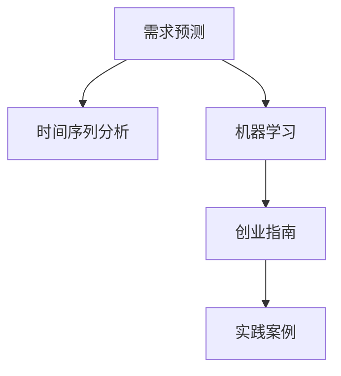

                 

# 需求预测创业：供应链优化的关键

> 关键词：需求预测,供应链优化,机器学习,时间序列分析,创业指南,实践案例

## 1. 背景介绍

### 1.1 问题由来
需求预测是供应链管理中的核心问题，其准确性直接影响库存水平、生产计划、物流安排等关键决策。传统上，需求预测依赖于历史数据和经验模型，如指数平滑、移动平均等，但这些方法存在误差较大、不够灵活等缺点。随着大数据和人工智能技术的进步，需求预测进入了新的发展阶段，机器学习算法，尤其是基于时间序列分析的模型，成为了应对这一挑战的有力工具。

### 1.2 问题核心关键点
需求预测的核心在于如何利用历史数据、时间序列特征以及外部因素，建立准确的需求预测模型，并通过模型优化提升预测精度和实时性。这不仅需要专业的算法知识和工程实践，还需要对供应链管理有深刻理解。

### 1.3 问题研究意义
研究需求预测技术，对提升供应链管理水平、降低库存成本、提高客户满意度具有重要意义：

1. **提升预测精度**：更准确的需求预测可以降低库存误差，避免积压或缺货。
2. **优化库存管理**：精细化的需求预测有助于制定合理的库存策略，提升资金周转率。
3. **提高运营效率**：精准的需求预测可以优化生产计划和物流安排，减少延误和浪费。
4. **增强决策支持**：提供更可靠的预测结果，支持供应链各环节的决策。
5. **开拓创新路径**：需求预测技术的发展为创业公司提供了新的切入点，创造了商业机会。

## 2. 核心概念与联系

### 2.1 核心概念概述

为更好地理解需求预测的核心技术，本节将介绍几个关键概念及其联系：

- **需求预测**：预测未来某段时间内产品或服务的市场需求量，是供应链管理的重要环节。
- **时间序列分析**：研究时间顺序数据，通过识别数据中的趋势、季节性、周期性等特征，进行预测。
- **机器学习**：利用算法对数据进行训练，建立预测模型，提升预测精度和泛化能力。
- **创业指南**：提供从技术开发到商业应用的全流程指导，帮助创业者在需求预测领域成功创业。
- **实践案例**：展示真实商业环境下的需求预测应用，提供可借鉴的经验。

这些概念之间的逻辑关系可以通过以下Mermaid流程图来展示：



这个流程图展示了需求预测的核心技术及其在创业过程中的应用：

1. **时间序列分析**：作为需求预测的基础技术，用于从时间序列数据中提取特征，识别趋势和周期。
2. **机器学习**：基于时间序列分析的结果，构建预测模型，提升预测精度。
3. **创业指南**：提供技术实现与商业应用的综合指导，支持创业者成功落地。
4. **实践案例**：通过具体应用场景的展示，验证技术有效性，提供实际操作方法。

## 3. 核心算法原理 & 具体操作步骤

### 3.1 算法原理概述

需求预测的核心算法包括时间序列分析、机器学习模型训练和预测等步骤。以下将详细介绍这些算法原理：

1. **时间序列分析**：通过对历史数据进行分析，识别趋势、季节性、周期性等特征，用于构建预测模型。
2. **机器学习模型**：使用训练数据集训练预测模型，使其能够根据历史数据和当前特征进行预测。
3. **预测与评估**：利用测试数据集评估模型性能，根据评估结果调整模型参数，优化预测效果。

### 3.2 算法步骤详解

**Step 1: 数据准备与预处理**

需求预测的第一步是数据准备与预处理，包括：

- 收集历史销售数据、市场趋势、季节性特征等相关信息。
- 对数据进行清洗，去除缺失值、异常值等噪音。
- 对时间序列数据进行标准化处理，使其适合用于机器学习算法。

**Step 2: 特征工程**

特征工程是构建有效预测模型的关键步骤，包括以下操作：

- 时间序列特征提取：如移动平均、季节性分量等。
- 外部因素引入：如节假日、促销活动、季节变化等。
- 统计特征提取：如均值、标准差、最大值、最小值等。
- 缺失值处理：采用插值法、均值填充等方式处理缺失值。

**Step 3: 模型选择与训练**

根据业务需求选择合适的机器学习模型进行训练，常见的模型包括：

- 线性回归：适用于平稳时间序列的预测。
- ARIMA模型：结合自回归、差分和移动平均的模型，适用于非平稳时间序列。
- LSTM神经网络：能够处理序列数据，适用于复杂时间序列的预测。
- Prophet模型：适用于时间序列中的季节性、趋势性预测。

**Step 4: 模型评估与优化**

对训练好的模型进行评估，根据评估结果进行模型优化，具体步骤包括：

- 使用测试数据集评估模型性能。
- 调整模型参数，如学习率、正则化系数等。
- 使用交叉验证等方法避免过拟合。
- 引入正则化技术，如L1正则、Dropout等。

**Step 5: 预测与部署**

将训练好的模型应用于实际需求预测中，具体步骤包括：

- 使用实时数据进行预测。
- 将预测结果反馈给供应链管理部门，优化库存、生产、物流等决策。
- 定期更新模型，保持预测模型与实际需求匹配。

### 3.3 算法优缺点

需求预测算法具有以下优点：

1. **精度高**：利用历史数据和外部因素，建立精准的预测模型。
2. **适应性强**：能够应对多种复杂场景，如非平稳时间序列、季节性变化等。
3. **自动化高**：通过算法训练和优化，减少人工干预，提升效率。

同时，这些算法也存在一些缺点：

1. **数据依赖**：预测模型的准确性高度依赖于数据质量，数据缺失或噪音会影响预测效果。
2. **复杂度**：部分模型（如神经网络）训练复杂，需要大量计算资源和时间。
3. **解释性不足**：黑盒模型难以解释其内部决策逻辑，缺乏透明度。
4. **动态变化适应性差**：当需求发生变化时，模型需要重新训练和调整，调整成本高。

## 4. 数学模型和公式 & 详细讲解 & 举例说明

### 4.1 数学模型构建

需求预测的核心数学模型包括时间序列模型和机器学习模型的构建。以下将详细介绍这些模型的数学公式和构建过程。

**时间序列模型**

常用的时间序列模型包括ARIMA、ARIMAX、Prophet等。这里以ARIMA模型为例，介绍其数学模型构建：

$$
y_t = \sum_{i=0}^{p} \alpha_i y_{t-i} + \sum_{j=1}^{d} \Delta^j(y_t) + \sum_{k=0}^{q} \beta_k \epsilon_{t-k} + \epsilon_t
$$

其中：

- $y_t$：时间 $t$ 的需求预测值。
- $\Delta$：差分算子，用于处理非平稳时间序列。
- $\epsilon_t$：随机误差项，假设独立同分布。
- $\alpha_i, \beta_k$：模型的参数。

**机器学习模型**

以LSTM神经网络为例，其数学模型如下：

$$
\begin{aligned}
h_t &= f(h_{t-1}, x_t) \\
\hat{y}_t &= g(h_t, x_t)
\end{aligned}
$$

其中：

- $h_t$：LSTM层的隐藏状态。
- $f, g$：非线性激活函数，如Tanh、ReLU等。
- $x_t$：时间序列的特征向量。
- $\hat{y}_t$：预测值。

### 4.2 公式推导过程

**ARIMA模型推导**

ARIMA模型的推导过程如下：

1. 对时间序列 $y_t$ 进行差分，得到平稳序列 $z_t = \Delta^d(y_t)$。
2. 建立自回归模型 $y_t = \sum_{i=0}^{p} \alpha_i z_{t-i} + \epsilon_t$。
3. 引入移动平均模型 $\epsilon_t = \sum_{k=0}^{q} \beta_k \epsilon_{t-k}$。
4. 将自回归和移动平均模型结合，得到ARIMA模型。

**LSTM模型推导**

LSTM模型的推导过程如下：

1. 定义LSTM单元的输入和输出。
2. 引入遗忘门、输入门和输出门等机制，控制信息流。
3. 通过迭代计算LSTM单元的状态 $h_t$。
4. 使用非线性激活函数进行预测。

### 4.3 案例分析与讲解

**案例：某电商平台的日销售额预测**

假设某电商平台每天的销售额数据如下：

| 日期     | 销售额 |
| -------- | ------ |
| 2022-01-01 | 5000   |
| 2022-01-02 | 5500   |
| 2022-01-03 | 6000   |
| ...       | ...    |
| 2022-12-31 | 7500   |

**Step 1: 数据准备与预处理**

1. 收集2022年的日销售额数据，去除异常值。
2. 对数据进行标准化处理，使其均值为0，标准差为1。

**Step 2: 特征工程**

1. 计算移动平均和季节性分量，识别趋势和周期性。
2. 引入节假日、促销活动等外部因素。
3. 计算日销售额的均值、标准差、最大值、最小值等统计特征。

**Step 3: 模型选择与训练**

1. 选择ARIMA模型进行训练，调整模型参数。
2. 使用交叉验证等方法评估模型性能。

**Step 4: 模型评估与优化**

1. 使用测试数据集评估模型性能。
2. 调整模型参数，提高预测精度。
3. 引入正则化技术，避免过拟合。

**Step 5: 预测与部署**

1. 使用训练好的模型对2023年的日销售额进行预测。
2. 将预测结果反馈给电商平台，优化库存、生产、物流等决策。
3. 定期更新模型，保持预测模型与实际需求匹配。

## 5. 项目实践：代码实例和详细解释说明

### 5.1 开发环境搭建

在进行需求预测实践前，我们需要准备好开发环境。以下是使用Python进行Scikit-learn开发的环境配置流程：

1. 安装Anaconda：从官网下载并安装Anaconda，用于创建独立的Python环境。

2. 创建并激活虚拟环境：
```bash
conda create -n demand-prediction python=3.8 
conda activate demand-prediction
```

3. 安装Scikit-learn：
```bash
conda install scikit-learn pandas numpy matplotlib
```

4. 安装各类工具包：
```bash
pip install tqdm jupyter notebook ipython
```

完成上述步骤后，即可在`demand-prediction`环境中开始需求预测实践。

### 5.2 源代码详细实现

这里我们以ARIMA模型为例，给出使用Scikit-learn进行需求预测的Python代码实现。

首先，导入必要的库和数据：

```python
import pandas as pd
import numpy as np
from statsmodels.tsa.arima_model import ARIMA
from sklearn.metrics import mean_squared_error
from sklearn.model_selection import train_test_split

# 加载数据
data = pd.read_csv('sales_data.csv', index_col='date', parse_dates=True)
```

然后，进行数据预处理和特征工程：

```python
# 去除异常值
data = data[data['销售额'] > 0]

# 标准化数据
data = (data - data.mean()) / data.std()

# 计算移动平均和季节性分量
data['ma1'] = data['销售额'].rolling(window=7).mean()
data['seasonality'] = pd.get_dummies(data['季节'], prefix='season_')

# 计算统计特征
data['mean'] = data['销售额'].mean()
data['std'] = data['销售额'].std()
data['max'] = data['销售额'].max()
data['min'] = data['销售额'].min()

# 划分训练集和测试集
train, test = train_test_split(data, test_size=0.2)
```

接下来，构建和训练ARIMA模型：

```python
# 构建ARIMA模型
model = ARIMA(train['销售额'], order=(1, 1, 1))
model_fit = model.fit()

# 预测并评估
predictions = model_fit.forecast(steps=30)
mse = mean_squared_error(test['销售额'], predictions)
print(f'Mean Squared Error: {mse:.3f}')
```

最后，可视化预测结果和评估指标：

```python
# 可视化预测结果
import matplotlib.pyplot as plt
plt.plot(train['销售额'], label='Training Set')
plt.plot(predictions, label='Predicted Values')
plt.legend()
plt.show()

# 可视化评估指标
print(f'Mean Squared Error: {mse:.3f}')
```

以上就是使用Scikit-learn对ARIMA模型进行需求预测的完整代码实现。可以看到，Scikit-learn的简单易用和高效性能，使得需求预测任务开发变得非常快捷。

### 5.3 代码解读与分析

让我们再详细解读一下关键代码的实现细节：

**数据预处理**

1. 加载数据：使用`pandas`库加载历史销售额数据，并设置日期为索引。
2. 去除异常值：去除销售额为负值或极小的样本。
3. 标准化数据：使用`statsmodels`库进行标准化处理，使数据均值为0，标准差为1。
4. 计算移动平均和季节性分量：使用`rolling`方法计算7天的移动平均，并使用`pd.get_dummies`方法创建季节性分量的哑变量。
5. 计算统计特征：计算销售额的均值、标准差、最大值、最小值。

**模型构建与训练**

1. 构建ARIMA模型：使用`ARIMA`类构建ARIMA模型，并使用`fit`方法进行训练。
2. 预测并评估：使用`forecast`方法进行30天的预测，并使用`mean_squared_error`方法计算预测误差。

**结果可视化**

1. 可视化预测结果：使用`matplotlib`库绘制训练数据和预测值。
2. 可视化评估指标：打印预测误差。

可以看到，Scikit-learn提供了丰富的机器学习工具，使得需求预测任务的开发变得非常简便。开发者可以专注于模型优化和业务逻辑，而不必过多关注底层的实现细节。

## 6. 实际应用场景

### 6.1 智能仓储管理

需求预测技术在智能仓储管理中具有重要应用价值。通过精确预测未来的需求量，可以优化库存水平，避免积压或缺货，提升仓库管理效率。

在技术实现上，可以通过建立历史销售数据、季节性变化、促销活动等时间序列模型，结合机器学习算法进行预测。微调后的预测模型，能够实时生成库存需求，指导采购和补货，提升仓储管理的智能化水平。

### 6.2 生产计划优化

生产计划是供应链管理的重要环节，需求预测直接影响生产计划的制定。通过需求预测技术，可以实时调整生产计划，避免资源浪费和生产中断。

在实际应用中，可以利用需求预测结果，动态调整生产线和工人的安排，确保生产计划的合理性和灵活性。同时，通过预测结果的实时反馈，优化供应链的库存和物流管理，提升整体运营效率。

### 6.3 供应链协同

需求预测是供应链协同的重要基础。通过精确的需求预测，供应链各环节可以更好地协调合作，提升整体响应速度和效率。

在需求预测的指导下，上游供应商可以根据预测结果提前备货，确保生产的连续性和稳定性。下游物流公司可以根据预测结果优化运输计划，降低运输成本，提高配送速度。

### 6.4 未来应用展望

随着需求预测技术的不断发展，其在供应链管理中的应用前景更加广阔：

1. **实时化**：需求预测将更加实时化，能够实时反映市场变化，快速响应需求波动。
2. **跨领域融合**：需求预测技术将与大数据、物联网等技术结合，实现全链条信息协同。
3. **智能化**：需求预测模型将更加智能化，具备更强的自适应和学习能力。
4. **个性化**：需求预测将更好地结合用户行为数据，提供更精准的个性化服务。
5. **平台化**：需求预测技术将嵌入供应链管理平台，提供一站式解决方案。

这些发展趋势将进一步推动需求预测技术的进步，为供应链管理带来更高效、更灵活、更智能的解决方案。

## 7. 工具和资源推荐

### 7.1 学习资源推荐

为了帮助开发者系统掌握需求预测的理论基础和实践技巧，这里推荐一些优质的学习资源：

1. 《Python时间序列分析》系列博文：深入浅出地介绍了时间序列分析的基本概念和常用算法。
2. 《机器学习实战》书籍：全面介绍了机器学习算法的基本原理和实现方法，包括时间序列预测。
3. Scikit-learn官方文档：提供了丰富的机器学习算法和工具，帮助开发者快速上手。
4 Kaggle竞赛：通过参与实际需求预测竞赛，积累实战经验，提高预测精度。
5 Udacity课程：提供系统化的时间序列分析和机器学习课程，涵盖从理论到实践的各个方面。

通过对这些资源的学习实践，相信你一定能够快速掌握需求预测的精髓，并用于解决实际的供应链管理问题。

### 7.2 开发工具推荐

高效的开发离不开优秀的工具支持。以下是几款用于需求预测开发的常用工具：

1. Scikit-learn：基于Python的开源机器学习库，提供了丰富的算法和工具。
2. Pandas：用于数据处理和分析的Python库，支持时间序列数据处理。
3. TensorFlow：由Google主导的深度学习框架，适合大规模工程应用。
4. Jupyter Notebook：交互式的开发环境，支持实时数据处理和可视化。
5. TensorBoard：TensorFlow配套的可视化工具，可实时监测模型训练状态。

合理利用这些工具，可以显著提升需求预测任务的开发效率，加快创新迭代的步伐。

### 7.3 相关论文推荐

需求预测技术的发展源于学界的持续研究。以下是几篇奠基性的相关论文，推荐阅读：

1. 《ARIMA: Approximate Autoregressive Integrated Moving Average》：提出了ARIMA模型的基本框架，是时间序列分析的奠基性工作。
2. 《Prophet: A Probabilistic Forecasting Model for Time Series》：介绍了Prophet模型的原理和实现，展示了其在实际应用中的有效性。
3 《LSTM: A Search Space Odyssey Through Recurrent Neural Networks for Large-Scale Time Series Prediction》：展示了LSTM神经网络在时间序列预测中的优势。
4 《Explainable Artificial Intelligence》：探讨了AI模型可解释性的重要性，为需求预测技术的可持续发展提供了指导。
5 《AI for Supply Chain》：介绍了AI在供应链管理中的应用，包括需求预测、库存管理等。

这些论文代表了大数据和机器学习在需求预测领域的发展脉络。通过学习这些前沿成果，可以帮助研究者把握学科前进方向，激发更多的创新灵感。

## 8. 总结：未来发展趋势与挑战

### 8.1 总结

本文对需求预测技术进行了全面系统的介绍。首先阐述了需求预测在供应链管理中的重要性，明确了需求预测在提升库存管理、优化生产计划、促进供应链协同等方面的独特价值。其次，从原理到实践，详细讲解了时间序列分析、机器学习模型训练和预测等核心步骤，给出了需求预测任务开发的完整代码实例。同时，本文还广泛探讨了需求预测技术在智能仓储、生产计划优化、供应链协同等多个行业领域的应用前景，展示了需求预测范式的巨大潜力。

通过本文的系统梳理，可以看到，需求预测技术正在成为供应链管理的重要工具，极大地提升了供应链管理的智能化水平，降低了成本，提高了效率。未来，伴随需求预测技术的持续演进，相信供应链管理将迎来更高效、更智能的新时代。

### 8.2 未来发展趋势

展望未来，需求预测技术将呈现以下几个发展趋势：

1. **实时化**：需求预测将更加实时化，能够实时反映市场变化，快速响应需求波动。
2. **跨领域融合**：需求预测技术将与大数据、物联网等技术结合，实现全链条信息协同。
3. **智能化**：需求预测模型将更加智能化，具备更强的自适应和学习能力。
4. **个性化**：需求预测将更好地结合用户行为数据，提供更精准的个性化服务。
5. **平台化**：需求预测技术将嵌入供应链管理平台，提供一站式解决方案。

这些趋势凸显了需求预测技术的广阔前景。这些方向的探索发展，必将进一步提升供应链管理系统的性能和应用范围，为供应链优化带来更高效、更灵活、更智能的解决方案。

### 8.3 面临的挑战

尽管需求预测技术已经取得了瞩目成就，但在迈向更加智能化、普适化应用的过程中，它仍面临着诸多挑战：

1. **数据依赖**：需求预测的准确性高度依赖于数据质量，数据缺失或噪音会影响预测效果。
2. **模型复杂度**：部分模型（如神经网络）训练复杂，需要大量计算资源和时间。
3. **解释性不足**：黑盒模型难以解释其内部决策逻辑，缺乏透明度。
4. **动态变化适应性差**：当需求发生变化时，模型需要重新训练和调整，调整成本高。
5. **技术门槛高**：需求预测技术涉及时间序列分析、机器学习等多个领域，对从业者的技术要求高。

这些挑战需要我们在技术、算法、工程等多个层面进行深入研究和优化，才能将需求预测技术真正落地应用。

### 8.4 研究展望

面对需求预测技术所面临的种种挑战，未来的研究需要在以下几个方面寻求新的突破：

1. **数据质量提升**：通过数据清洗、数据增强等技术，提升数据质量和完整性，减少预测误差。
2. **模型简化与优化**：开发更加简单高效的模型，提升模型的可解释性和泛化能力。
3. **动态更新机制**：引入在线学习、增量学习等技术，实现模型的动态更新和优化。
4. **跨领域融合**：将需求预测与物联网、大数据等技术结合，实现供应链全链条信息协同。
5. **人机协同**：引入人工干预和辅助决策，增强需求预测模型的可靠性和灵活性。
6. **个性化需求预测**：结合用户行为数据，提供更精准的个性化预测服务。

这些研究方向的探索，必将引领需求预测技术迈向更高的台阶，为供应链管理带来更高效、更智能、更可靠的技术支撑。总之，需求预测技术的未来发展前景广阔，需要我们在技术、算法、工程等多个层面进行深入研究和实践，方能真正实现需求预测技术的落地应用。

## 9. 附录：常见问题与解答

**Q1: 需求预测的核心是什么？**

A: 需求预测的核心是通过对历史数据和时间序列特征的分析，建立准确的需求预测模型，提升预测精度和实时性。

**Q2: 常用的需求预测模型有哪些？**

A: 常用的需求预测模型包括ARIMA、LSTM、Prophet等。ARIMA适用于平稳时间序列，LSTM适用于复杂时间序列，Prophet适用于季节性趋势性预测。

**Q3: 如何进行数据预处理？**

A: 数据预处理包括数据清洗、异常值处理、标准化处理、特征工程等步骤。利用Python的Pandas库和Scikit-learn库，可以快速高效地完成数据预处理。

**Q4: 需求预测的优化策略有哪些？**

A: 需求预测的优化策略包括模型选择、参数优化、正则化、特征工程等。使用Scikit-learn和TensorFlow等工具，可以快速构建和优化预测模型。

**Q5: 需求预测在供应链管理中的作用是什么？**

A: 需求预测在供应链管理中具有重要作用，可以优化库存管理、生产计划、物流安排等关键决策，提升整体运营效率。

---

作者：禅与计算机程序设计艺术 / Zen and the Art of Computer Programming

