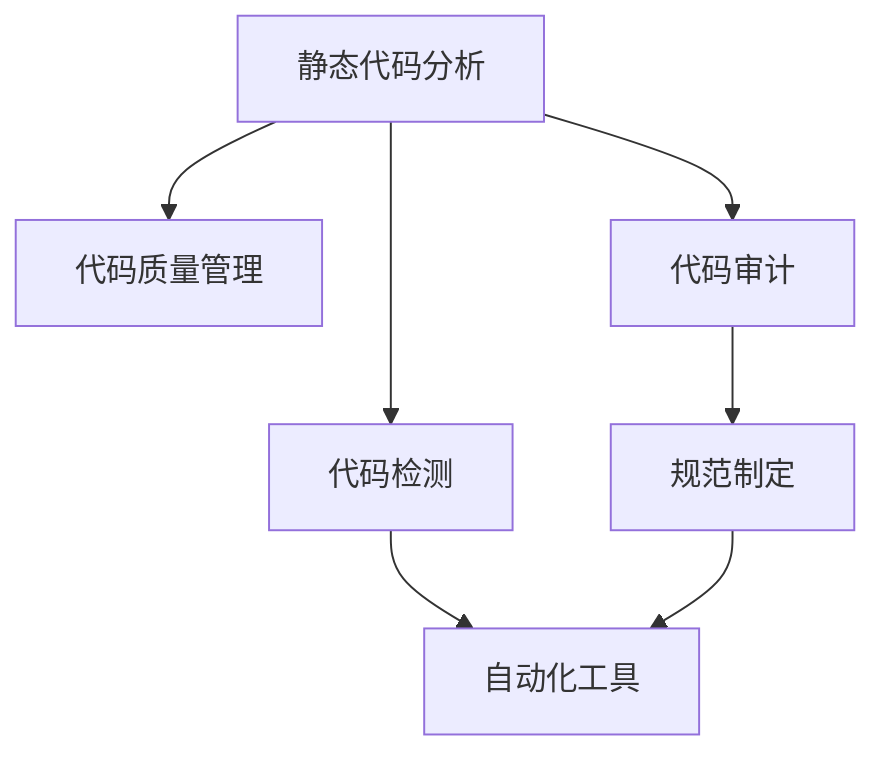

                 

# 静态代码分析：提高代码质量的工具

> 关键词：静态代码分析,代码质量管理,代码审计,代码检测,编程规范

## 1. 背景介绍

### 1.1 问题由来
软件开发是一个复杂且充满挑战的过程。编程错误、漏洞、性能问题、可读性差、不统一的代码风格等问题常常困扰着开发团队。这些问题不仅影响了开发效率和代码质量，还可能带来严重的安全风险和维护成本。静态代码分析作为代码质量管理的一种重要手段，能够有效地识别和解决这些潜在问题，提升软件质量和开发效率。

### 1.2 问题核心关键点
静态代码分析（Static Code Analysis）是指在代码编写阶段，通过自动化工具对代码进行静态扫描，以检测潜在的错误、漏洞和安全问题。它的主要优点包括：

- **早期发现问题**：在代码编写阶段就发现潜在问题，减少了后期修改的工作量。
- **成本效益**：自动化工具可以快速、高效地扫描大量代码，减少人力成本。
- **一致性**：通过统一的规则和标准，提升代码的编写质量和风格一致性。
- **安全防护**：静态分析能够检测出许多常见的安全漏洞，如SQL注入、XSS等，提升系统的安全性。

尽管静态代码分析有诸多优点，但也存在一些挑战：

- **规则制定的困难**：制定一套全面、准确、可执行的编程规范和检测规则需要大量的经验和专业技能。
- **误报率高**：有时规则过于严格会导致大量误报，影响开发效率。
- **规则更新**：随着技术的发展，需要不断更新检测规则，以应对新的安全威胁和编程规范的变化。

### 1.3 问题研究意义
研究静态代码分析的核心概念、技术和实践，对于提升代码质量、减少开发风险、提高开发效率、保障软件安全具有重要意义：

1. **代码质量提升**：通过早期检测和修复问题，提升代码的可维护性和可读性。
2. **安全防护**：及时发现并修复安全漏洞，保障系统的安全性和稳定性。
3. **成本节约**：通过自动化工具减少人工审计和后期维护的工作量，降低开发和维护成本。
4. **规范统一**：通过统一的规则和标准，提升团队协作效率和代码风格的一致性。
5. **技术革新**：推动静态代码分析技术的发展和应用，提升技术水平。

## 2. 核心概念与联系

### 2.1 核心概念概述

为了更好地理解静态代码分析的原理和应用，本节将介绍几个关键的概念：

- **静态代码分析（Static Code Analysis）**：指在不运行代码的情况下，对代码进行静态扫描，检测代码中的错误、漏洞和安全问题。
- **代码质量管理（Code Quality Management）**：通过自动化工具和持续集成（CI）流程，对代码进行管理和优化，以提升代码质量和开发效率。
- **代码审计（Code Audit）**：指对代码进行详细审查，以识别潜在的安全问题、性能瓶颈和代码质量问题。
- **代码检测（Code Detection）**：指使用自动化工具对代码进行扫描，检测出不符合规范的代码，并进行修复。
- **编程规范（Programming Standards）**：指在代码编写过程中遵循的一系列规则和指南，如编码风格、命名规范、注释规范等。

这些核心概念之间的逻辑关系可以通过以下Mermaid流程图来展示：



这个流程图展示了一些核心概念之间的关系：

1. 静态代码分析是对代码进行静态扫描的过程，是代码质量管理和代码审计的基础。
2. 代码质量管理通过自动化工具和持续集成流程，对代码进行管理和优化。
3. 代码审计是详细审查代码的过程，包括静态代码分析和手动审计。
4. 代码检测是指使用自动化工具检测不符合规范的代码。
5. 编程规范是制定代码编写规则和标准的基础，为代码检测和代码审计提供依据。

这些概念共同构成了代码质量管理的框架，使得开发者能够高效、准确地管理和优化代码质量。

## 3. 核心算法原理 & 具体操作步骤
### 3.1 算法原理概述

静态代码分析的核心算法原理包括以下几个方面：

- **规则制定**：制定一套全面、准确、可执行的编程规范和检测规则。
- **代码扫描**：使用自动化工具对代码进行静态扫描，检测出不符合规范的代码。
- **风险评估**：根据检测出的问题类型和严重程度，评估其对代码质量和系统安全的风险。
- **修复建议**：提供修复问题的具体建议，指导开发者进行代码修改。

### 3.2 算法步骤详解

静态代码分析的一般步骤如下：

**Step 1: 规则制定**
- 根据项目的编程规范和最佳实践，制定一套全面、准确的检测规则。
- 这些规则应该覆盖代码的各个方面，如语法错误、安全漏洞、性能瓶颈等。

**Step 2: 规则配置**
- 将检测规则配置到静态代码分析工具中，如SonarQube、Checkstyle、ESLint等。
- 根据项目的特定需求，调整规则的优先级和敏感度。

**Step 3: 代码扫描**
- 使用静态代码分析工具对代码库进行扫描，识别出不符合规范的代码。
- 工具通常会提供详细的报告，包括违规代码的位置、类型、严重程度等信息。

**Step 4: 风险评估**
- 根据检测出的问题类型和严重程度，评估其对代码质量和系统安全的风险。
- 设置风险评估指标，如代码质量得分、安全风险等级等。

**Step 5: 修复建议**
- 提供修复问题的具体建议，指导开发者进行代码修改。
- 建议应尽可能详细，包括修复代码的示例和相关链接。

**Step 6: 持续集成和自动化**
- 将静态代码分析集成到持续集成（CI）流程中，如Jenkins、GitLab CI等。
- 在每次代码提交或合并时，自动运行静态代码分析工具，确保代码质量。

### 3.3 算法优缺点

静态代码分析方法具有以下优点：

- **效率高**：自动化工具可以快速扫描大量代码，减少人工审计的工作量。
- **全面性**：覆盖代码的各个方面，包括语法错误、安全漏洞、性能瓶颈等。
- **客观性**：基于规则的检测结果，避免人工审计的主观性偏差。
- **可扩展性**：随着技术的发展，可以不断更新和扩展检测规则。

同时，该方法也存在一些局限性：

- **规则制定的困难**：需要丰富的经验和专业技能，才能制定出全面、准确、可执行的规则。
- **误报率高**：过于严格的规则可能导致大量误报，影响开发效率。
- **静态扫描的局限性**：无法检测运行时动态产生的错误和问题。
- **复杂性**：对于复杂的业务逻辑和算法，静态分析可能无法完全覆盖所有情况。

### 3.4 算法应用领域

静态代码分析在软件开发领域有着广泛的应用，具体包括：

- **代码质量管理**：通过自动化工具对代码进行管理和优化，提升代码质量。
- **安全防护**：检测和修复代码中的安全漏洞，提升系统的安全性。
- **性能优化**：检测和修复代码中的性能瓶颈，提升系统的响应速度。
- **代码审计**：对代码进行详细审查，确保代码符合规范和标准。
- **团队协作**：通过统一的规则和标准，提升团队协作效率和代码风格的一致性。

除了软件开发领域，静态代码分析还在以下领域得到应用：

- **医疗系统**：检测医疗系统的代码质量和安全性，保障患者隐私和医疗数据安全。
- **金融系统**：检测金融系统的代码质量和安全性，防止金融犯罪和数据泄露。
- **政府机构**：检测政府机构的代码质量和安全性，保障公共服务的安全性和稳定性。
- **教育系统**：检测教育系统的代码质量和安全性，提升教学质量和数据安全。

静态代码分析技术的发展和应用，为软件开发和各个领域的系统建设提供了强有力的保障。

## 4. 数学模型和公式 & 详细讲解  
### 4.1 数学模型构建

静态代码分析的数学模型主要涉及以下几个方面：

- **代码质量评估模型**：通过一系列指标对代码质量进行评估，如代码重复率、复杂度、规范性等。
- **风险评估模型**：根据检测出的问题类型和严重程度，评估其对代码质量和系统安全的风险。
- **修复建议模型**：提供修复问题的具体建议，指导开发者进行代码修改。

### 4.2 公式推导过程

以下我们以代码质量评估模型为例，推导其公式和计算过程。

假设代码库中共有 $N$ 个文件，每个文件包含 $M$ 行代码。定义以下变量：

- $R_i$：第 $i$ 个文件的重复代码行数。
- $C_i$：第 $i$ 个文件的复杂度得分。
- $S_i$：第 $i$ 个文件的规范性得分。
- $Q_i$：第 $i$ 个文件的代码质量得分。

则代码质量评估模型的数学公式为：

$$
Q_i = w_R \times R_i + w_C \times C_i + w_S \times S_i
$$

其中 $w_R$、$w_C$、$w_S$ 为权重系数，表示重复代码、复杂度、规范性的重要程度。

对于整个代码库的代码质量评估，可以计算其平均质量得分：

$$
Q_{avg} = \frac{1}{N} \sum_{i=1}^N Q_i
$$

公式推导过程如下：

1. **代码质量评估**：通过静态代码分析工具对每个文件进行评估，计算出其重复代码行数、复杂度得分和规范性得分。
2. **权重设置**：根据项目的特点和需求，设置重复代码、复杂度、规范性的权重系数。
3. **计算代码质量得分**：根据公式计算每个文件的代码质量得分，并计算整个代码库的平均质量得分。

### 4.3 案例分析与讲解

**案例分析：某金融系统的代码质量评估**

某金融系统包含 $N=1000$ 个文件，每个文件包含 $M=500$ 行代码。通过静态代码分析工具，对每个文件的重复代码行数、复杂度得分和规范性得分进行了评估，得到以下数据：

| 文件编号 | 重复代码行数 | 复杂度得分 | 规范性得分 |
| --- | --- | --- | --- |
| 1 | 50 | 8 | 9 |
| 2 | 20 | 7 | 10 |
| ... | ... | ... | ... |
| 1000 | 30 | 6 | 8 |

根据上述数据，假设 $w_R=0.3$、$w_C=0.4$、$w_S=0.3$，计算每个文件的代码质量得分和整个代码库的平均质量得分。

**代码质量评估结果：**

| 文件编号 | 代码质量得分 | 平均质量得分 |
| --- | --- | --- |
| 1 | 7.5 | 7.5 |
| 2 | 7.4 | 7.5 |
| ... | ... | ... |
| 1000 | 7.2 | 7.5 |

通过代码质量评估模型，可以发现某些文件存在较多的重复代码或复杂的逻辑，需要进行优化和重构。同时，整个代码库的平均质量得分约为7.5，表明代码质量整体较好。

**修复建议模型：**

对于检测出的问题，可以提供具体的修复建议，以指导开发者进行代码修改。例如，对于重复代码问题，可以建议开发者进行重构，将重复代码合并到一个函数或类中。对于复杂度问题，可以建议开发者使用函数封装、模块化等技术，降低代码的复杂度。对于规范性问题，可以建议开发者遵循统一的编程规范，如PEP8（Python编程规范）、Kotlin风格指南等。

## 5. 项目实践：代码实例和详细解释说明
### 5.1 开发环境搭建

在进行静态代码分析实践前，我们需要准备好开发环境。以下是使用Python进行SonarQube开发的环境配置流程：

1. 安装Anaconda：从官网下载并安装Anaconda，用于创建独立的Python环境。

2. 创建并激活虚拟环境：
```bash
conda create -n sonarqube-env python=3.8 
conda activate sonarqube-env
```

3. 安装SonarQube：从官网获取并按照官方文档进行安装。

4. 安装各种插件和依赖：
```bash
pip install sonarqube
```

5. 安装各类工具包：
```bash
pip install pygments numpy pandas scikit-learn matplotlib tqdm jupyter notebook ipython
```

完成上述步骤后，即可在`sonarqube-env`环境中开始代码实例。

### 5.2 源代码详细实现

下面我们以SonarQube为例，给出使用Python实现静态代码分析的代码实现。

首先，定义代码质量评估函数：

```python
from sonarqube import SonarQube
from sonarqube import Collection
import os

def code_quality_analysis():
    # 初始化SonarQube客户端
    sonar = SonarQube("http://localhost:9000", "admin", "admin")

    # 获取项目ID
    project_id = sonar.get_project_id("my_project")

    # 获取项目代码质量数据
    collection = Collection(sonar, project_id)
    collection.set_lines_from_file("my_project/src/my_module.py")
    collection.set_lines_from_file("my_project/tests/my_test.py")

    # 计算代码质量得分
    code_quality_score = collection.get_code_quality_score()
    print("代码质量得分：", code_quality_score)

    # 获取代码质量报告
    code_quality_report = collection.get_code_quality_report()
    print("代码质量报告：", code_quality_report)
```

然后，定义代码质量检测函数：

```python
from sonarqube import SonarQube
from sonarqube import Collection
import os

def code_quality_check():
    # 初始化SonarQube客户端
    sonar = SonarQube("http://localhost:9000", "admin", "admin")

    # 获取项目ID
    project_id = sonar.get_project_id("my_project")

    # 获取项目代码质量检测结果
    collection = Collection(sonar, project_id)
    collection.set_lines_from_file("my_project/src/my_module.py")
    collection.set_lines_from_file("my_project/tests/my_test.py")

    # 获取代码质量检测报告
    code_quality_report = collection.get_code_quality_report()
    print("代码质量检测报告：", code_quality_report)

    # 获取代码质量问题列表
    code_quality_issues = collection.get_code_quality_issues()
    for issue in code_quality_issues:
        print("代码质量问题：", issue)
```

最后，启动代码质量检测流程：

```python
code_quality_check()
```

以上就是使用SonarQube进行静态代码分析的完整代码实现。可以看到，通过SonarQube，开发者可以轻松地对代码进行质量评估和检测，及时发现并修复潜在问题，提升代码质量。

### 5.3 代码解读与分析

让我们再详细解读一下关键代码的实现细节：

**代码质量评估函数**：
- 初始化SonarQube客户端，设置API连接地址、用户名和密码。
- 获取项目ID，根据项目名称查询并获取对应的项目ID。
- 创建代码质量收集对象，设置代码文件路径，并计算代码质量得分和报告。
- 输出代码质量得分和报告，供开发者查看。

**代码质量检测函数**：
- 初始化SonarQube客户端，设置API连接地址、用户名和密码。
- 获取项目ID，根据项目名称查询并获取对应的项目ID。
- 创建代码质量收集对象，设置代码文件路径，并获取代码质量检测报告。
- 输出代码质量检测报告和问题列表，供开发者修复和优化。

这些代码示例展示了如何使用SonarQube进行静态代码分析，其核心在于将代码文件加载到SonarQube的代码质量收集对象中，并调用相应的方法进行质量评估和检测。

## 6. 实际应用场景
### 6.1 软件开发生命周期管理

在软件开发生命周期中，静态代码分析可以发挥重要作用：

- **需求分析阶段**：通过静态代码分析工具，对已有代码进行扫描，评估其质量和规范性，为需求分析提供依据。
- **设计阶段**：通过静态代码分析工具，检测设计方案的合理性和可行性，指导设计工作。
- **开发阶段**：通过持续集成（CI）流程，自动化地运行静态代码分析工具，确保每次代码提交的质量。
- **测试阶段**：通过静态代码分析工具，检测代码中的潜在问题和漏洞，保障测试覆盖率。
- **维护阶段**：通过静态代码分析工具，检测代码中的复杂度和重复度，优化代码结构，提高维护效率。

### 6.2 自动化安全检测

静态代码分析技术在自动化安全检测中也有重要应用：

- **SQL注入检测**：通过静态代码分析工具，检测代码中的SQL注入漏洞。
- **XSS攻击检测**：通过静态代码分析工具，检测代码中的XSS攻击漏洞。
- **缓冲区溢出检测**：通过静态代码分析工具，检测代码中的缓冲区溢出漏洞。
- **敏感数据泄露检测**：通过静态代码分析工具，检测代码中的敏感数据泄露问题。

通过静态代码分析，可以在开发阶段及时发现和修复安全漏洞，避免潜在的风险。

### 6.3 代码审查和协作

静态代码分析还可以用于代码审查和团队协作：

- **代码审查**：通过静态代码分析工具，对代码进行自动审查，检测不符合规范的代码，减少人工审查的工作量。
- **代码风格统一**：通过静态代码分析工具，检测代码风格的一致性，提升团队协作效率。
- **代码重构**：通过静态代码分析工具，检测代码中的重复代码和复杂度问题，指导开发者进行代码重构，提升代码质量。

## 7. 工具和资源推荐
### 7.1 学习资源推荐

为了帮助开发者系统掌握静态代码分析的理论基础和实践技巧，这里推荐一些优质的学习资源：

1. 《静态代码分析：提高代码质量的工具》系列博文：由静态代码分析专家撰写，深入浅出地介绍了静态代码分析的原理、工具和实践技巧。

2. CS500《软件工程与系统构建》课程：斯坦福大学开设的软件工程课程，涵盖了静态代码分析、代码质量管理等多个主题，提供了丰富的案例和实战经验。

3. 《Software Testing and Verification》书籍：该书详细介绍了软件测试和验证的技术，包括静态代码分析、代码审查等，提供了丰富的理论和实践知识。

4. SonarQube官方文档：SonarQube的官方文档，提供了全面的API文档和用户指南，帮助开发者快速上手使用。

5. Checkstyle官方文档：Checkstyle的官方文档，提供了详细的配置和使用指南，帮助开发者进行代码规范检查。

通过对这些资源的学习实践，相信你一定能够快速掌握静态代码分析的精髓，并用于解决实际的开发问题。

### 7.2 开发工具推荐

高效的开发离不开优秀的工具支持。以下是几款用于静态代码分析开发的常用工具：

1. SonarQube：一个开源的静态代码分析平台，支持多种编程语言和开发框架，提供丰富的质量评估和检测功能。
2. Checkstyle：一个开源的Java代码质量检查工具，能够检测代码中的规范性问题，支持多种编程规范。
3. ESLint：一个开源的JavaScript代码质量检查工具，支持代码规范检查和风格统一。
4. StyleCop：一个开源的C#代码质量检查工具，能够检测代码中的规范性问题，支持多种编程规范。
5. PMD：一个开源的Java代码质量检查工具，能够检测代码中的复杂度、重复度等问题。

合理利用这些工具，可以显著提升静态代码分析的开发效率，加快创新迭代的步伐。

### 7.3 相关论文推荐

静态代码分析技术的发展源于学界的持续研究。以下是几篇奠基性的相关论文，推荐阅读：

1. "Automated Debugging of Java Programs"（Jones, 1987）：介绍了静态代码分析技术的基本原理和应用场景。

2. "Software Fault Detection Using Extended Tracing Techniques"（Walker, 1986）：提出了使用静态代码分析技术检测软件缺陷的方法。

3. "Static Code Analysis for Software Evolution"（B uncertain, 2018）：探讨了静态代码分析技术在软件演进过程中的应用。

4. "Security Testing of Mobile Applications Using Static Analysis"（Chen et al., 2017）：介绍了静态代码分析技术在移动应用安全检测中的应用。

5. "Static Code Analysis for Large Scale Software Evolution"（Fu et al., 2020）：探讨了静态代码分析技术在大规模软件演进中的应用。

这些论文代表了大规模语言模型微调技术的发展脉络。通过学习这些前沿成果，可以帮助研究者把握学科前进方向，激发更多的创新灵感。

## 8. 总结：未来发展趋势与挑战
### 8.1 总结

本文对静态代码分析方法进行了全面系统的介绍。首先阐述了静态代码分析的背景和意义，明确了其提高代码质量、减少开发风险、提高开发效率、保障软件安全的独特价值。其次，从原理到实践，详细讲解了静态代码分析的数学模型、关键步骤和实践技巧，给出了静态代码分析任务开发的完整代码实例。同时，本文还广泛探讨了静态代码分析在软件开发、安全检测、代码审查等各个领域的应用前景，展示了其广阔的应用前景。

通过本文的系统梳理，可以看到，静态代码分析技术正在成为软件开发和各个领域的系统建设的重要保障。随着静态代码分析技术的不断发展，代码质量和开发效率将进一步提升，软件系统的安全性将得到更好地保障。

### 8.2 未来发展趋势

展望未来，静态代码分析技术将呈现以下几个发展趋势：

1. **自动化程度提升**：随着机器学习和人工智能技术的发展，静态代码分析将逐渐从规则驱动向模型驱动转变，提升自动化程度和准确性。
2. **多语言支持扩展**：静态代码分析将从单一编程语言扩展到多语言支持，如Java、Python、C++等，提供更加全面的代码质量评估和检测。
3. **实时分析与反馈**：静态代码分析将结合持续集成（CI）流程，实现实时分析与反馈，提升开发效率和代码质量。
4. **动态分析与检测**：静态代码分析将结合动态分析技术，检测运行时动态产生的错误和问题，提升系统的鲁棒性和安全性。
5. **人工智能辅助**：静态代码分析将结合人工智能技术，如机器学习、自然语言处理等，提供更加智能化的质量评估和检测。

以上趋势凸显了静态代码分析技术的广阔前景。这些方向的探索发展，必将进一步提升代码质量、开发效率和系统安全性，为软件开发和各个领域的系统建设提供强有力的保障。

### 8.3 面临的挑战

尽管静态代码分析技术已经取得了瞩目成就，但在迈向更加智能化、普适化应用的过程中，它仍面临着诸多挑战：

1. **规则制定的困难**：制定一套全面、准确、可执行的编程规范和检测规则需要大量的经验和专业技能。
2. **误报率高**：过于严格的规则可能导致大量误报，影响开发效率。
3. **静态扫描的局限性**：无法检测运行时动态产生的错误和问题。
4. **复杂性**：对于复杂的业务逻辑和算法，静态分析可能无法完全覆盖所有情况。
5. **多语言支持**：对不同编程语言的支持和适配，需要投入大量的时间和资源。

正视静态代码分析面临的这些挑战，积极应对并寻求突破，将是大语言模型微调技术走向成熟的必由之路。相信随着学界和产业界的共同努力，这些挑战终将一一被克服，静态代码分析必将在构建安全、可靠、可解释、可控的智能系统中扮演越来越重要的角色。

### 8.4 研究展望

面对静态代码分析所面临的种种挑战，未来的研究需要在以下几个方面寻求新的突破：

1. **规则制定的自动化**：探索规则制定的自动化方法，如机器学习、数据驱动等，减少人工规则制定的工作量。
2. **误报率降低**：开发更加智能化的规则引擎，降低误报率，提升开发效率。
3. **动态分析技术**：结合动态分析技术，检测运行时动态产生的错误和问题，提升系统的鲁棒性和安全性。
4. **多语言支持**：开发多语言支持的静态代码分析工具，提升对多种编程语言的支持和适配。
5. **智能辅助工具**：结合人工智能技术，如机器学习、自然语言处理等，提供更加智能化的质量评估和检测。

这些研究方向的探索，必将引领静态代码分析技术迈向更高的台阶，为软件开发和各个领域的系统建设提供强有力的保障。面向未来，静态代码分析技术还需要与其他人工智能技术进行更深入的融合，如知识表示、因果推理、强化学习等，多路径协同发力，共同推动静态代码分析技术的发展和应用。只有勇于创新、敢于突破，才能不断拓展静态代码分析的边界，让软件系统更加智能、可靠、高效。

## 9. 附录：常见问题与解答
**Q1：静态代码分析是否适用于所有编程语言？**

A: 静态代码分析可以适用于绝大多数编程语言，如Java、Python、C++等。不同编程语言的静态代码分析工具和方法可能有所不同，需要根据具体语言的特点进行适配。

**Q2：静态代码分析的误报率如何控制？**

A: 控制误报率需要优化规则配置和参数设置。可以通过调整规则的敏感度、设置例外规则、使用启发式规则等方式，降低误报率。同时，结合动态分析工具，可以提高误报率控制的准确性。

**Q3：静态代码分析能否检测所有安全漏洞？**

A: 静态代码分析可以检测大部分常见安全漏洞，如SQL注入、XSS等。但对于复杂的攻击方式和新型的漏洞，可能需要结合动态分析工具和人工审查，进行更加深入的检测。

**Q4：静态代码分析对性能影响大吗？**

A: 静态代码分析对性能的影响主要取决于规则配置和分析工具的选择。如果规则配置得当，工具优化良好，静态代码分析对性能的影响可以控制在合理范围内。

**Q5：静态代码分析是否会影响代码风格一致性？**

A: 静态代码分析可以帮助检测代码风格的一致性问题，并提供修复建议。但最终的代码风格一致性仍需要开发团队的共同维护和遵守。

通过这些问题的解答，相信你能够更加全面地了解静态代码分析的原理和应用，并在实践中灵活应用，提升代码质量和开发效率。

