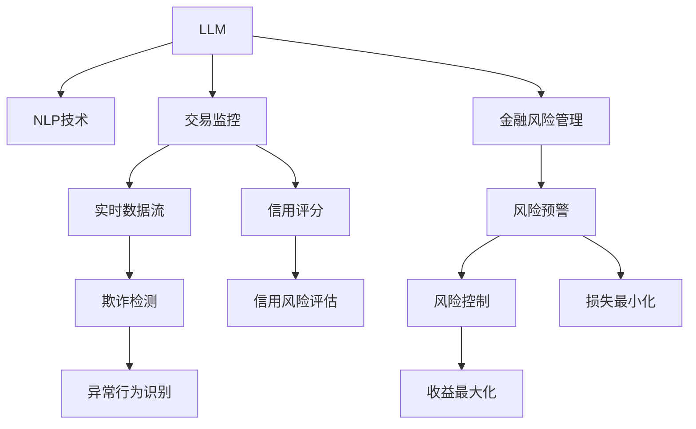

                 

# 风险管理：LLM 在金融行业中的应用

> 关键词：大语言模型(LLM), 金融风险管理, 自然语言处理(NLP), 交易监控, 欺诈检测, 信用评分

## 1. 背景介绍

### 1.1 问题由来
金融行业面临复杂多变的环境，风险管理是其核心环节之一。传统的风险管理方式依赖于大量人工分析和数据处理，效率低下且易出错。随着大数据和人工智能技术的发展，自然语言处理(NLP)技术逐渐成为风险管理中的重要工具。特别是基于大语言模型(LLM)的NLP技术，以其强大的语义理解和推理能力，在金融风险管理中展现出巨大潜力。

### 1.2 问题核心关键点
LLM在金融行业中的应用主要围绕以下几个核心问题展开：

1. 如何高效处理海量金融文本数据，提取关键信息？
2. 如何利用LLM进行金融风险识别和预警？
3. 如何保证LLM在金融场景中的决策过程可解释性和透明度？
4. 如何在保持LLM高效性的同时，确保其在高风险环境中的稳健性？
5. 如何通过LLM提升金融服务质量，降低运营成本？

### 1.3 问题研究意义
通过LLM在金融行业中的应用，可以显著提升风险管理的效率和准确性，降低人力成本，提升金融产品的创新和竞争力。此外，LLM的语义理解和推理能力，也有助于金融服务质量的提升，为金融客户带来更好的用户体验。

## 2. 核心概念与联系

### 2.1 核心概念概述

为更好地理解LLM在金融风险管理中的应用，本节将介绍几个密切相关的核心概念：

- 大语言模型(LLM)：以Transformer结构为代表的大规模预训练语言模型。通过在大规模无标签文本语料上进行预训练，学习通用的语言表示，具备强大的语言理解和生成能力。

- 自然语言处理(NLP)：利用计算机技术处理和理解人类语言的技术，包括文本分类、情感分析、信息抽取等。

- 金融风险管理：通过识别和评估金融活动中的潜在风险，制定相应策略和措施，以最小化损失和最大化收益的过程。

- 交易监控：实时监控金融交易数据，识别异常交易，预防欺诈和洗钱等非法行为。

- 欺诈检测：基于历史交易数据和客户行为，识别可能的欺诈行为，及时预警并采取措施。

- 信用评分：评估客户的信用风险，用于贷款审批、风险控制等场景。

这些核心概念之间的逻辑关系可以通过以下Mermaid流程图来展示：



这个流程图展示了大语言模型和金融风险管理的核心概念及其之间的关系：

1. LLM通过预训练获得语言表示能力。
2. 通过NLP技术，对金融文本数据进行分类、情感分析、实体抽取等处理。
3. 交易监控和欺诈检测利用LLM处理实时数据，识别异常行为。
4. 信用评分通过LLM处理客户数据，评估信用风险。
5. 金融风险管理利用LLM和NLP技术，进行风险识别和预警。
6. 风险预警和控制帮助金融机构最小化损失，最大化收益。

这些概念共同构成了LLM在金融风险管理中的应用框架，使其能够更好地处理金融领域的复杂问题和数据。

## 3. 核心算法原理 & 具体操作步骤
### 3.1 算法原理概述

LLM在金融风险管理中的应用，主要基于以下核心算法原理：

- **文本数据预处理**：收集金融领域相关的文本数据，如新闻报道、社交媒体评论、客户服务记录等，进行分词、去除停用词、词性标注等预处理操作。

- **特征抽取**：利用LLM对预处理后的文本进行特征抽取，提取关键的实体、情感、事件等信息。

- **异常检测与行为识别**：通过训练LLM，识别异常交易行为、欺诈行为等，构建风险预警系统。

- **信用评分与风险评估**：利用LLM处理客户行为数据，构建信用评分模型，评估客户的信用风险。

- **决策与控制**：基于LLM的风险识别和预警结果，制定相应的风险管理策略，如资金冻结、账户暂停等，以控制金融风险。

### 3.2 算法步骤详解

#### 3.2.1 文本数据预处理

**Step 1: 数据收集与清洗**
- 从金融市场、新闻、社交媒体等渠道收集相关文本数据。
- 使用Python的NLTK、SpaCy等库进行文本预处理，如分词、去除停用词、词性标注等。

**Step 2: 数据标注**
- 对部分数据进行人工标注，如识别关键实体、情感极性、事件类型等。
- 使用标准的数据标注工具如Labelbox、Prodigy等。

**Step 3: 特征构建**
- 将标注后的文本数据转化为机器学习模型可处理的特征向量。
- 可以提取的特征包括词频、TF-IDF、情感极性、实体关系等。

#### 3.2.2 特征抽取

**Step 4: 模型选择与训练**
- 选择合适的预训练语言模型，如BERT、GPT等。
- 在标注数据上进行微调，使用交叉熵损失函数，优化器如AdamW。

**Step 5: 特征抽取**
- 将金融文本输入到微调后的LLM模型中，输出语义表示。
- 利用模型的语义表示，提取关键的实体、情感、事件等信息。

#### 3.2.3 异常检测与行为识别

**Step 6: 异常行为识别**
- 收集训练集中的异常交易行为数据，如大额交易、频繁转账、异地交易等。
- 使用微调后的LLM模型对实时交易数据进行分类，识别异常行为。

**Step 7: 欺诈检测**
- 收集历史欺诈案例数据，标注特征如IP地址、交易时间、交易金额等。
- 利用微调后的LLM模型进行分类，构建欺诈检测系统。

#### 3.2.4 信用评分与风险评估

**Step 8: 信用评分模型**
- 收集客户历史行为数据，如消费记录、贷款还款记录等。
- 使用微调后的LLM模型，提取客户行为特征，构建信用评分模型。

**Step 9: 风险评估**
- 使用信用评分模型对新客户进行风险评估，确定其信用等级。
- 结合风险评估结果，制定相应的贷款审批策略。

#### 3.2.5 决策与控制

**Step 10: 风险预警**
- 对异常行为和欺诈行为进行实时预警，通过邮件、短信等方式通知相关人员。

**Step 11: 风险控制**
- 根据风险评估结果，采取相应的风险控制措施，如冻结账户、降低授信额度等。
- 利用机器学习算法进行动态调整，优化风险控制策略。

### 3.3 算法优缺点

LLM在金融风险管理中的应用具有以下优点：

1. **高效处理大量文本数据**：LLM能够快速处理大规模文本数据，提取关键信息，提升风险管理的效率。

2. **强大的语义理解能力**：LLM具备强大的语义理解能力，能够准确识别交易中的异常行为和欺诈行为。

3. **多模态数据处理**：LLM可以处理多模态数据，如文本、图像、语音等，提升综合风险管理能力。

4. **灵活性与可扩展性**：LLM可以灵活扩展到不同类型的金融风险管理任务，如市场风险、流动性风险、操作风险等。

但同时也存在以下缺点：

1. **数据依赖性高**：LLM的效果很大程度上依赖于标注数据的质量和数量，标注成本较高。

2. **模型复杂度高**：预训练和微调过程需要大量的计算资源，模型复杂度较高。

3. **模型泛化能力有限**：LLM的泛化能力有限，面对未知的新情况，可能存在误判或过拟合风险。

4. **可解释性不足**：LLM模型决策过程不透明，难以解释其内部工作机制。

5. **安全性问题**：LLM模型可能学习到有害信息或偏见，存在一定的安全性风险。

### 3.4 算法应用领域

LLM在金融风险管理中的应用，覆盖了以下主要领域：

- **交易监控**：实时监控金融交易数据，识别异常行为，预防欺诈和洗钱等非法行为。

- **欺诈检测**：基于历史交易数据和客户行为，识别可能的欺诈行为，及时预警并采取措施。

- **信用评分**：评估客户的信用风险，用于贷款审批、风险控制等场景。

- **市场分析**：分析金融市场新闻、公告、评论等信息，预测市场走势，进行风险评估。

- **客户服务**：通过客户服务记录，进行情感分析、实体抽取等，提升客户体验。

## 4. 数学模型和公式 & 详细讲解  
### 4.1 数学模型构建

在金融风险管理中，LLM主要应用于文本分类、实体抽取、情感分析等任务。这里以文本分类任务为例，介绍LLM的基本数学模型构建。

假设输入文本为$x$，输出为$y \in \{0,1\}$，表示是否为正常交易行为。设$M_{\theta}$为预训练语言模型，输出为$\hat{y}=M_{\theta}(x)$。

定义交叉熵损失函数：

$$
\ell(M_{\theta}(x),y) = -[y\log \hat{y} + (1-y)\log (1-\hat{y})]
$$

最小化损失函数得到：

$$
\theta^* = \mathop{\arg\min}_{\theta} \frac{1}{N} \sum_{i=1}^N \ell(M_{\theta}(x_i),y_i)
$$

其中$N$为样本数。

### 4.2 公式推导过程

以下我们以二分类任务为例，推导交叉熵损失函数及其梯度的计算公式。

假设模型$M_{\theta}$在输入$x$上的输出为$\hat{y}=M_{\theta}(x) \in [0,1]$，表示样本属于正类的概率。真实标签$y \in \{0,1\}$。则二分类交叉熵损失函数定义为：

$$
\ell(M_{\theta}(x),y) = -[y\log \hat{y} + (1-y)\log (1-\hat{y})]
$$

将其代入损失函数公式，得：

$$
\mathcal{L}(\theta) = -\frac{1}{N}\sum_{i=1}^N [y_i\log M_{\theta}(x_i)+(1-y_i)\log(1-M_{\theta}(x_i))]
$$

根据链式法则，损失函数对参数$\theta$的梯度为：

$$
\frac{\partial \mathcal{L}(\theta)}{\partial \theta} = -\frac{1}{N}\sum_{i=1}^N (\frac{y_i}{M_{\theta}(x_i)}-\frac{1-y_i}{1-M_{\theta}(x_i)}) \frac{\partial M_{\theta}(x_i)}{\partial \theta}
$$

其中$\frac{\partial M_{\theta}(x_i)}{\partial \theta}$可进一步递归展开，利用自动微分技术完成计算。

在得到损失函数的梯度后，即可带入参数更新公式，完成模型的迭代优化。重复上述过程直至收敛，最终得到适应下游任务的最优模型参数$\theta^*$。

### 4.3 案例分析与讲解

以信用评分任务为例，介绍LLM在金融风险管理中的应用。

假设客户行为数据为$(x_i,y_i)$，其中$x_i$为行为特征，$y_i$为信用评分。模型的输入为$x_i$，输出为$\hat{y}=M_{\theta}(x_i)$。

定义损失函数：

$$
\ell(M_{\theta}(x_i),y_i) = -[y_i\log \hat{y} + (1-y_i)\log (1-\hat{y})]
$$

最小化损失函数得到：

$$
\theta^* = \mathop{\arg\min}_{\theta} \frac{1}{N} \sum_{i=1}^N \ell(M_{\theta}(x_i),y_i)
$$

利用梯度下降算法，不断更新模型参数$\theta$，最小化损失函数，得到信用评分模型。

## 5. 项目实践：代码实例和详细解释说明
### 5.1 开发环境搭建

在进行LLM应用实践前，我们需要准备好开发环境。以下是使用Python进行PyTorch开发的环境配置流程：

1. 安装Anaconda：从官网下载并安装Anaconda，用于创建独立的Python环境。

2. 创建并激活虚拟环境：
```bash
conda create -n pytorch-env python=3.8 
conda activate pytorch-env
```

3. 安装PyTorch：根据CUDA版本，从官网获取对应的安装命令。例如：
```bash
conda install pytorch torchvision torchaudio cudatoolkit=11.1 -c pytorch -c conda-forge
```

4. 安装Transformers库：
```bash
pip install transformers
```

5. 安装各类工具包：
```bash
pip install numpy pandas scikit-learn matplotlib tqdm jupyter notebook ipython
```

完成上述步骤后，即可在`pytorch-env`环境中开始LLM的应用实践。

### 5.2 源代码详细实现

下面我们以信用评分任务为例，给出使用Transformers库对BERT模型进行微调的PyTorch代码实现。

首先，定义信用评分任务的数据处理函数：

```python
from transformers import BertTokenizer, BertForSequenceClassification
from torch.utils.data import Dataset
import torch

class CreditScoreDataset(Dataset):
    def __init__(self, texts, scores, tokenizer, max_len=128):
        self.texts = texts
        self.scores = scores
        self.tokenizer = tokenizer
        self.max_len = max_len
        
    def __len__(self):
        return len(self.texts)
    
    def __getitem__(self, item):
        text = self.texts[item]
        score = self.scores[item]
        
        encoding = self.tokenizer(text, return_tensors='pt', max_length=self.max_len, padding='max_length', truncation=True)
        input_ids = encoding['input_ids'][0]
        attention_mask = encoding['attention_mask'][0]
        
        return {'input_ids': input_ids, 
                'attention_mask': attention_mask,
                'scores': torch.tensor(score, dtype=torch.float32)}
```

然后，定义模型和优化器：

```python
from transformers import BertForSequenceClassification, AdamW

model = BertForSequenceClassification.from_pretrained('bert-base-cased', num_labels=2)

optimizer = AdamW(model.parameters(), lr=2e-5)
```

接着，定义训练和评估函数：

```python
from torch.utils.data import DataLoader
from tqdm import tqdm
from sklearn.metrics import roc_auc_score

device = torch.device('cuda') if torch.cuda.is_available() else torch.device('cpu')
model.to(device)

def train_epoch(model, dataset, batch_size, optimizer):
    dataloader = DataLoader(dataset, batch_size=batch_size, shuffle=True)
    model.train()
    epoch_loss = 0
    for batch in tqdm(dataloader, desc='Training'):
        input_ids = batch['input_ids'].to(device)
        attention_mask = batch['attention_mask'].to(device)
        scores = batch['scores'].to(device)
        model.zero_grad()
        outputs = model(input_ids, attention_mask=attention_mask, labels=scores)
        loss = outputs.loss
        epoch_loss += loss.item()
        loss.backward()
        optimizer.step()
    return epoch_loss / len(dataloader)

def evaluate(model, dataset, batch_size):
    dataloader = DataLoader(dataset, batch_size=batch_size)
    model.eval()
    preds, labels = [], []
    with torch.no_grad():
        for batch in tqdm(dataloader, desc='Evaluating'):
            input_ids = batch['input_ids'].to(device)
            attention_mask = batch['attention_mask'].to(device)
            batch_labels = batch['scores']
            outputs = model(input_ids, attention_mask=attention_mask)
            batch_preds = outputs.logits.argmax(dim=1).to('cpu').tolist()
            batch_labels = batch_labels.to('cpu').tolist()
            for pred, label in zip(batch_preds, batch_labels):
                preds.append(pred)
                labels.append(label)
                
    return roc_auc_score(labels, preds)
```

最后，启动训练流程并在测试集上评估：

```python
epochs = 5
batch_size = 16

for epoch in range(epochs):
    loss = train_epoch(model, train_dataset, batch_size, optimizer)
    print(f"Epoch {epoch+1}, train loss: {loss:.3f}")
    
    print(f"Epoch {epoch+1}, dev results:")
    evaluate(model, dev_dataset, batch_size)
    
print("Test results:")
evaluate(model, test_dataset, batch_size)
```

以上就是使用PyTorch对BERT进行信用评分任务微调的完整代码实现。可以看到，得益于Transformers库的强大封装，我们可以用相对简洁的代码完成BERT模型的加载和微调。

### 5.3 代码解读与分析

让我们再详细解读一下关键代码的实现细节：

**CreditScoreDataset类**：
- `__init__`方法：初始化文本、标签、分词器等关键组件。
- `__len__`方法：返回数据集的样本数量。
- `__getitem__`方法：对单个样本进行处理，将文本输入编码为token ids，将标签转换为模型可处理的浮点数形式。

**模型和优化器**：
- 使用BertForSequenceClassification和AdamW进行模型定义和优化器配置。

**训练和评估函数**：
- 使用PyTorch的DataLoader对数据集进行批次化加载，供模型训练和推理使用。
- 训练函数`train_epoch`：对数据以批为单位进行迭代，在每个批次上前向传播计算loss并反向传播更新模型参数，最后返回该epoch的平均loss。
- 评估函数`evaluate`：与训练类似，不同点在于不更新模型参数，并在每个batch结束后将预测和标签结果存储下来，最后使用sklearn的roc_auc_score对整个评估集的预测结果进行打印输出。

**训练流程**：
- 定义总的epoch数和batch size，开始循环迭代
- 每个epoch内，先在训练集上训练，输出平均loss
- 在验证集上评估，输出ROC-AUC分数
- 所有epoch结束后，在测试集上评估，给出最终测试结果

可以看到，PyTorch配合Transformers库使得BERT微调的代码实现变得简洁高效。开发者可以将更多精力放在数据处理、模型改进等高层逻辑上，而不必过多关注底层的实现细节。

当然，工业级的系统实现还需考虑更多因素，如模型的保存和部署、超参数的自动搜索、更灵活的任务适配层等。但核心的微调范式基本与此类似。

## 6. 实际应用场景
### 6.1 智能客服系统

基于LLM的智能客服系统能够实时监控客户服务记录，进行情感分析和实体抽取，从而提升客户体验和服务质量。具体而言，系统可以对客服对话进行文本分类，识别客户情绪是积极还是消极，同时提取关键实体如订单号、产品信息等，提供精准的客户服务支持。

在技术实现上，可以收集企业内部的历史客服对话记录，将问题-答复对作为监督数据，在此基础上对预训练语言模型进行微调。微调后的语言模型能够自动理解客户意图，匹配最合适的回答，甚至在客户提出新问题时，能够提供合适的解决方案或建议。

### 6.2 金融舆情监测

金融市场充满风险，舆情监测是金融风险管理的重要环节之一。基于LLM的舆情监测系统能够实时抓取新闻、评论等金融信息，进行情感分析和实体抽取，及时预警潜在的市场风险。

具体而言，系统可以将金融市场新闻、公告、评论等文本数据作为输入，利用微调后的LLM模型进行情感分析和实体抽取，识别出市场情绪是乐观还是悲观，以及关键实体如上市公司、行业等。对于情绪异常和实体变化的情况，系统及时发出预警，帮助金融决策者及时应对市场变化，降低风险。

### 6.3 信用评分与风险评估

基于LLM的信用评分系统可以高效处理客户历史行为数据，进行信用风险评估。系统可以通过对客户消费记录、还款记录等行为数据进行文本分类和情感分析，识别出客户的信用风险等级。对于高风险客户，系统自动采取相应的风险控制措施，如冻结账户、提高授信额度等，避免潜在的金融风险。

在技术实现上，可以收集客户历史行为数据，将其转化为金融文本，利用微调后的LLM模型进行分类和情感分析，得到客户的信用评分。结合评分结果，系统自动进行风险评估，制定相应的贷款审批策略。

### 6.4 未来应用展望

随着LLM技术的发展，其在金融风险管理中的应用将不断深化和拓展。未来可能的发展趋势包括：

1. **多模态数据融合**：LLM不仅处理文本数据，还能处理图像、视频、语音等多模态数据，提升综合风险管理能力。

2. **实时风险预警**：利用LLM的实时处理能力，构建实时风险预警系统，及时识别异常交易和欺诈行为，提高金融系统的安全性。

3. **个性化金融服务**：基于LLM的个性化推荐技术，提供个性化的金融服务，如定制化保险产品、投资策略等，提升客户满意度。

4. **AI驱动的决策支持**：将LLM与决策支持系统结合，利用AI技术提供决策依据，辅助金融决策者进行风险评估和决策制定。

5. **跨领域知识整合**：将LLM与知识图谱、规则库等专家知识结合，构建更加全面、准确的金融风险管理系统。

以上趋势凸显了LLM在金融风险管理中的广阔前景，未来将有更多的应用场景涌现，为金融行业带来新的变革。

## 7. 工具和资源推荐
### 7.1 学习资源推荐

为了帮助开发者系统掌握LLM在金融风险管理中的应用，这里推荐一些优质的学习资源：

1. 《自然语言处理基础》系列博文：由大模型技术专家撰写，介绍NLP基础理论与实践，包括文本分类、情感分析、实体抽取等。

2. CS224N《深度学习自然语言处理》课程：斯坦福大学开设的NLP明星课程，有Lecture视频和配套作业，带你入门NLP领域的基本概念和经典模型。

3. 《自然语言处理与深度学习》书籍：深度学习领域的经典书籍，涵盖NLP基础、模型架构、算法原理等，适合进一步深入学习。

4. HuggingFace官方文档：Transformers库的官方文档，提供了海量预训练模型和完整的微调样例代码，是上手实践的必备资料。

5. GitHub上的NLP项目：如NLTK、SpaCy等，提供了丰富的NLP工具和资源，方便开发者快速上手。

通过对这些资源的学习实践，相信你一定能够快速掌握LLM在金融风险管理中的应用，并用于解决实际的金融问题。
###  7.2 开发工具推荐

高效的开发离不开优秀的工具支持。以下是几款用于LLM应用开发的常用工具：

1. PyTorch：基于Python的开源深度学习框架，灵活动态的计算图，适合快速迭代研究。大部分预训练语言模型都有PyTorch版本的实现。

2. TensorFlow：由Google主导开发的开源深度学习框架，生产部署方便，适合大规模工程应用。同样有丰富的预训练语言模型资源。

3. Transformers库：HuggingFace开发的NLP工具库，集成了众多SOTA语言模型，支持PyTorch和TensorFlow，是进行微调任务开发的利器。

4. Weights & Biases：模型训练的实验跟踪工具，可以记录和可视化模型训练过程中的各项指标，方便对比和调优。与主流深度学习框架无缝集成。

5. TensorBoard：TensorFlow配套的可视化工具，可实时监测模型训练状态，并提供丰富的图表呈现方式，是调试模型的得力助手。

6. Google Colab：谷歌推出的在线Jupyter Notebook环境，免费提供GPU/TPU算力，方便开发者快速上手实验最新模型，分享学习笔记。

合理利用这些工具，可以显著提升LLM应用开发的效率，加快创新迭代的步伐。

### 7.3 相关论文推荐

LLM在金融行业中的应用源于学界的持续研究。以下是几篇奠基性的相关论文，推荐阅读：

1. Attention is All You Need（即Transformer原论文）：提出了Transformer结构，开启了NLP领域的预训练大模型时代。

2. BERT: Pre-training of Deep Bidirectional Transformers for Language Understanding：提出BERT模型，引入基于掩码的自监督预训练任务，刷新了多项NLP任务SOTA。

3. Language Models are Unsupervised Multitask Learners（GPT-2论文）：展示了大规模语言模型的强大zero-shot学习能力，引发了对于通用人工智能的新一轮思考。

4. Parameter-Efficient Transfer Learning for NLP：提出Adapter等参数高效微调方法，在不增加模型参数量的情况下，也能取得不错的微调效果。

5. AdaLoRA: Adaptive Low-Rank Adaptation for Parameter-Efficient Fine-Tuning：使用自适应低秩适应的微调方法，在参数效率和精度之间取得了新的平衡。

这些论文代表了大语言模型在金融行业中的应用研究进展。通过学习这些前沿成果，可以帮助研究者把握学科前进方向，激发更多的创新灵感。

## 8. 总结：未来发展趋势与挑战
### 8.1 总结

本文对基于LLM的金融风险管理方法进行了全面系统的介绍。首先阐述了LLM和金融风险管理的研究背景和意义，明确了LLM在金融场景中的应用价值。其次，从原理到实践，详细讲解了LLM在金融风险管理中的核心算法和操作步骤，给出了LLM应用任务开发的完整代码实例。同时，本文还广泛探讨了LLM在金融场景中的实际应用场景，展示了其在金融行业中的广阔前景。

通过本文的系统梳理，可以看到，基于LLM的金融风险管理技术正在成为金融行业的重要工具，极大地提升了风险管理的效率和准确性，降低了人力成本，提升了金融产品的创新和竞争力。未来，伴随LLM技术的不断发展，金融风险管理将迎来更多创新应用，为金融行业带来新的变革。

### 8.2 未来发展趋势

展望未来，基于LLM的金融风险管理技术将呈现以下几个发展趋势：

1. **高效处理多模态数据**：LLM不仅可以处理文本数据，还能处理图像、视频、语音等多模态数据，提升综合风险管理能力。

2. **实时风险预警**：利用LLM的实时处理能力，构建实时风险预警系统，及时识别异常交易和欺诈行为，提高金融系统的安全性。

3. **个性化金融服务**：基于LLM的个性化推荐技术，提供个性化的金融服务，如定制化保险产品、投资策略等，提升客户满意度。

4. **AI驱动的决策支持**：将LLM与决策支持系统结合，利用AI技术提供决策依据，辅助金融决策者进行风险评估和决策制定。

5. **跨领域知识整合**：将LLM与知识图谱、规则库等专家知识结合，构建更加全面、准确的金融风险管理系统。

以上趋势凸显了LLM在金融风险管理中的广阔前景，未来将有更多的应用场景涌现，为金融行业带来新的变革。

### 8.3 面临的挑战

尽管基于LLM的金融风险管理技术已经取得了瞩目成就，但在迈向更加智能化、普适化应用的过程中，它仍面临着诸多挑战：

1. **数据依赖性高**：LLM的效果很大程度上依赖于标注数据的质量和数量，标注成本较高。

2. **模型复杂度高**：预训练和微调过程需要大量的计算资源，模型复杂度较高。

3. **模型泛化能力有限**：LLM的泛化能力有限，面对未知的新情况，可能存在误判或过拟合风险。

4. **可解释性不足**：LLM模型决策过程不透明，难以解释其内部工作机制。

5. **安全性问题**：LLM模型可能学习到有害信息或偏见，存在一定的安全性风险。

6. **实时性能问题**：在金融交易和舆情监测等实时场景下，LLM模型需要具备高效的推理速度，以支持实时决策。

### 8.4 研究展望

面对基于LLM的金融风险管理技术所面临的挑战，未来的研究需要在以下几个方面寻求新的突破：

1. **无监督和半监督学习**：探索无监督和半监督学习方法，摆脱对大规模标注数据的依赖，利用自监督学习、主动学习等无监督和半监督范式，最大限度利用非结构化数据，实现更加灵活高效的金融风险管理。

2. **参数高效和计算高效的微调方法**：开发更加参数高效和计算高效的微调方法，在固定大部分预训练参数的同时，只更新极少量的任务相关参数。同时优化微调模型的计算图，减少前向传播和反向传播的资源消耗，实现更加轻量级、实时性的部署。

3. **跨领域知识整合**：将LLM与知识图谱、规则库等专家知识结合，构建更加全面、准确的金融风险管理系统。

4. **可解释性增强**：研究如何增强LLM模型的可解释性，使其决策过程透明，便于理解和调试。

5. **安全性保障**：开发安全机制，如数据脱敏、对抗训练等，保障模型在金融场景中的安全性。

6. **实时性能优化**：通过模型裁剪、量化加速等技术，优化LLM在金融场景中的推理性能，支持实时决策。

这些研究方向的探索，必将引领基于LLM的金融风险管理技术迈向更高的台阶，为构建安全、可靠、可解释、可控的金融智能系统铺平道路。面向未来，LLM在金融行业的应用还需与其他AI技术进行更深入的融合，如因果推理、强化学习等，多路径协同发力，共同推动金融智能化的发展。

## 9. 附录：常见问题与解答

**Q1：金融数据为何难以标注？**

A: 金融数据通常包含敏感信息，标注难度较大。此外，金融数据量大且分布广泛，标注成本高昂。因此，探索无监督和半监督学习等方法，利用自监督学习、主动学习等手段，以减少对标注数据的依赖，是大模型在金融行业应用的关键。

**Q2：LLM在金融风险管理中是否面临数据偏见问题？**

A: 是的，LLM模型可能学习到金融数据中的偏见，如性别歧视、种族歧视等。因此，在使用LLM进行金融风险管理时，需要对数据进行仔细筛选和处理，确保数据集的多样性和公平性。同时，在模型训练过程中引入偏见检测和纠正机制，保障模型的公平性和公正性。

**Q3：如何提高LLM在金融场景中的实时性能？**

A: 通过模型裁剪、量化加速等技术，可以显著提升LLM在金融场景中的推理速度，支持实时决策。同时，通过多任务学习、模型融合等手段，可以提高LLM的并行处理能力和计算效率。

**Q4：如何保障LLM在金融场景中的安全性？**

A: 引入数据脱敏、对抗训练等技术，可以有效防止模型学习到有害信息或偏见，保障模型在金融场景中的安全性。同时，建立模型行为的监管机制，确保输出的合规性和合法性。

**Q5：LLM在金融场景中的可解释性如何提升？**

A: 研究如何增强LLM模型的可解释性，使其决策过程透明，便于理解和调试。可以通过特征重要性分析、模型可视化等手段，提升模型的可解释性。

---

作者：禅与计算机程序设计艺术 / Zen and the Art of Computer Programming

