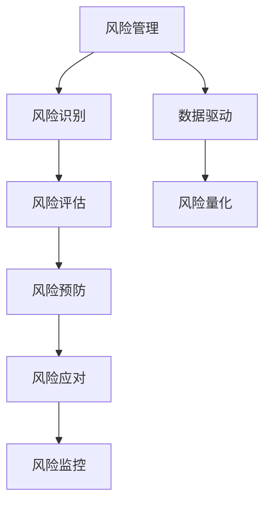

                 

# 风险管理：预防和应对商业风险的技巧

> 关键词：风险管理, 商业风险, 风险预防, 风险应对, 风险评估, 数据驱动, 风险量化

## 1. 背景介绍

### 1.1 问题由来

在现代商业环境中，企业面临的风险日益复杂和多样化。市场竞争加剧、技术更新换代、法规变化、供应链问题等都可能导致企业的经营遭受重大损失。因此，有效的风险管理成为企业成功的关键因素之一。风险管理不仅仅是一种风险规避措施，更是一种长期的、系统的、动态的过程，旨在通过识别、评估、预防和应对各种商业风险，确保企业的可持续发展和竞争优势。

### 1.2 问题核心关键点

风险管理的核心在于理解风险、量化风险、评估风险，以及制定有效的预防和应对策略。在这一过程中，企业需要利用数据、模型和分析工具，科学、客观地识别和量化潜在的风险，并结合实际情况制定合理的风险管理策略，从而最大程度地降低风险对企业的影响。

## 2. 核心概念与联系

### 2.1 核心概念概述

- **风险管理(Risk Management)**：是指企业识别、评估、控制和监控可能对企业造成不利影响的风险的过程。包括风险识别、风险评估、风险预防、风险应对和风险监控等环节。
- **商业风险(Business Risk)**：指可能对企业经营产生负面影响的各种因素，包括市场风险、信用风险、操作风险、合规风险等。
- **风险预防(Risk Prevention)**：通过识别潜在风险并采取相应措施来避免风险发生。
- **风险应对(Risk Response)**：针对已经发生或可能发生的风险，采取有效的应对措施，包括风险转移、风险接受、风险缓解和风险转移等。
- **风险评估(Risk Assessment)**：利用定量和定性方法对风险进行分析和评估，以便制定合理的风险管理策略。
- **数据驱动(Data-Driven)**：利用大数据、机器学习和人工智能技术，从海量数据中提取有价值的信息，辅助风险评估和决策。
- **风险量化(Risk Quantification)**：通过数学模型和统计方法，将风险量化为具体数值，以更直观地进行管理和决策。

这些核心概念之间的逻辑关系可以通过以下Mermaid流程图来展示：



这个流程图展示了一些核心概念之间的相互关系：

1. 风险管理是整个风险管理过程的顶层，它包括风险识别、风险评估、风险预防、风险应对和风险监控等多个环节。
2. 数据驱动和风险量化是辅助决策的两个关键环节，通过利用大数据和数学模型，能够更科学地评估和决策。
3. 风险识别和风险评估是风险管理的初始阶段，通过识别和量化风险，为后续的风险预防和风险应对提供依据。
4. 风险预防和风险应对是风险管理的核心，通过有效的预防和应对措施，最小化风险对企业的影响。
5. 风险监控是风险管理的持续过程，通过持续监控和评估，及时调整风险管理策略，确保企业的长期稳定发展。

## 3. 核心算法原理 & 具体操作步骤

### 3.1 算法原理概述

风险管理的基本流程包括风险识别、风险评估、风险预防、风险应对和风险监控五个环节。这一过程通常涉及到大量的数据收集、分析和处理，以量化和评估风险的潜在影响。

- **风险识别(Risk Identification)**：通过定性和定量的方法，识别企业可能面临的各种风险。
- **风险评估(Risk Assessment)**：利用数学模型和统计方法，量化风险的可能性和影响程度。
- **风险预防(Risk Prevention)**：通过制定和实施风险管理策略，降低风险发生的概率。
- **风险应对(Risk Response)**：针对已经发生的风险，采取有效的应对措施，将风险影响降到最低。
- **风险监控(Risk Monitoring)**：持续监控风险管理的效果，及时调整和优化风险管理策略。

### 3.2 算法步骤详解

#### 3.2.1 风险识别

风险识别的主要任务是全面识别可能对企业造成不利影响的各种因素，包括市场风险、信用风险、操作风险、合规风险等。这一过程可以通过以下步骤完成：

1. **数据收集**：收集与企业运营相关的各种数据，包括财务数据、市场数据、操作数据、法规数据等。
2. **风险问卷调查**：通过问卷调查，了解企业内部员工和管理层对各种风险的认知和感受。
3. **专家访谈**：邀请行业专家和内部专家，对可能存在的风险进行讨论和分析。
4. **案例分析**：分析类似企业或行业的历史案例，识别其中的风险点和教训。
5. **风险清单**：列出所有潜在的风险因素，建立全面的风险清单。

#### 3.2.2 风险评估

风险评估的主要目的是量化风险的可能性和影响程度，以便制定合理的风险管理策略。这一过程可以通过以下步骤完成：

1. **风险概率评估**：利用历史数据和专家经验，评估每种风险发生的概率。
2. **风险影响评估**：利用数学模型和统计方法，评估每种风险对企业的影响程度。
3. **风险矩阵**：将风险概率和风险影响绘制成矩阵，以便进行可视化分析和决策。
4. **风险得分**：利用风险矩阵，计算每种风险的综合得分，以便进行优先排序。

#### 3.2.3 风险预防

风险预防的主要目的是通过制定和实施有效的风险管理策略，降低风险发生的概率。这一过程可以通过以下步骤完成：

1. **风险监控系统**：建立风险监控系统，实时监控企业的各项风险指标。
2. **风险预警机制**：制定风险预警机制，及时发现和应对潜在风险。
3. **风险管理流程**：制定和优化风险管理流程，确保各个环节的有效执行。
4. **风险培训**：对企业员工进行风险管理培训，提高其风险意识和应对能力。

#### 3.2.4 风险应对

风险应对的主要目的是针对已经发生的风险，采取有效的应对措施，将风险影响降到最低。这一过程可以通过以下步骤完成：

1. **风险评估**：对已经发生的风险进行全面评估，了解风险的性质和影响。
2. **应对策略**：根据风险的性质和影响，制定相应的应对策略，包括风险转移、风险接受、风险缓解和风险转移等。
3. **应急预案**：制定应急预案，确保在风险发生时能够快速、有效地应对。
4. **风险反馈**：对风险应对的效果进行反馈和评估，及时调整和优化应对策略。

#### 3.2.5 风险监控

风险监控的主要目的是持续监控风险管理的效果，及时调整和优化风险管理策略。这一过程可以通过以下步骤完成：

1. **风险指标监控**：实时监控企业的各项风险指标，及时发现异常情况。
2. **风险报告机制**：建立风险报告机制，定期向管理层汇报风险管理情况。
3. **风险预警系统**：建立风险预警系统，及时发现和应对潜在风险。
4. **风险调整机制**：根据风险监控的结果，及时调整和优化风险管理策略。

### 3.3 算法优缺点

#### 3.3.1 优点

- **系统性和全面性**：通过系统地识别、评估和应对各种风险，能够全面地管理企业的各项风险。
- **数据驱动**：利用大数据和人工智能技术，从海量数据中提取有价值的信息，辅助风险评估和决策。
- **实时性和动态性**：通过实时监控和动态调整，能够及时发现和应对潜在风险。
- **科学性和客观性**：利用数学模型和统计方法，科学地评估和量化风险，避免主观偏见。

#### 3.3.2 缺点

- **复杂性和高成本**：风险管理的复杂性和高成本可能导致企业难以全面实施。
- **数据质量和准确性**：数据质量和准确性直接影响风险评估和决策，数据缺失或不准确可能导致错误的判断。
- **人员和管理要求高**：需要具备专业的风险管理知识和技能，以及高效的管理机制，以确保风险管理策略的有效执行。

### 3.4 算法应用领域

风险管理技术已经在金融、保险、制造、物流、零售等多个行业得到了广泛应用，为企业的可持续发展提供了有力保障。例如：

- **金融行业**：金融机构利用风险管理技术，识别和管理各种市场风险、信用风险和操作风险，确保资金安全和企业稳定。
- **保险行业**：保险公司利用风险管理技术，识别和管理各种保险风险，降低赔付率和风险成本。
- **制造行业**：制造企业利用风险管理技术，识别和管理供应链风险、操作风险和合规风险，确保生产安全和质量稳定。
- **物流行业**：物流企业利用风险管理技术，识别和管理运输风险、仓储风险和客户服务风险，提高运营效率和客户满意度。
- **零售行业**：零售企业利用风险管理技术，识别和管理市场风险、库存风险和客户服务风险，优化库存管理和客户体验。

## 4. 数学模型和公式 & 详细讲解 & 举例说明

### 4.1 数学模型构建

风险管理过程中涉及到的数学模型和公式包括但不限于以下几个方面：

- **风险概率评估**：利用贝叶斯定理和条件概率模型，评估每种风险发生的概率。
- **风险影响评估**：利用蒙特卡洛模拟和VaR模型，评估每种风险对企业的影响程度。
- **风险矩阵**：利用2D矩阵，将风险概率和风险影响进行可视化分析和决策。
- **风险得分**：利用加权求和法，计算每种风险的综合得分，以便进行优先排序。

#### 4.1.1 风险概率评估

贝叶斯定理和条件概率模型是风险概率评估的主要工具，其公式如下：

$$
P(A|B) = \frac{P(B|A)P(A)}{P(B)}
$$

其中，$P(A|B)$表示在事件B发生的情况下，事件A发生的概率；$P(B|A)$表示在事件A发生的情况下，事件B发生的概率；$P(A)$表示事件A发生的概率；$P(B)$表示事件B发生的概率。

#### 4.1.2 风险影响评估

蒙特卡洛模拟和VaR模型是风险影响评估的主要工具，其公式如下：

$$
VaR_{\alpha} = \sum_{i=1}^n x_i \cdot w_i
$$

其中，$VaR_{\alpha}$表示在置信水平$\alpha$下的风险价值；$x_i$表示第$i$个资产的价格变化；$w_i$表示第$i$个资产的权重。

#### 4.1.3 风险矩阵

风险矩阵通常是一个2D矩阵，将风险概率和风险影响绘制成矩阵，便于进行可视化分析和决策。其公式如下：

$$
\text{风险矩阵} = \begin{bmatrix}
\text{高概率, 高影响} & \text{高概率, 中等影响} & \text{高概率, 低影响} \\
\text{中等概率, 高影响} & \text{中等概率, 中等影响} & \text{中等概率, 低影响} \\
\text{低概率, 高影响} & \text{低概率, 中等影响} & \text{低概率, 低影响}
\end{bmatrix}
$$

#### 4.1.4 风险得分

风险得分通常是一个综合指标，通过加权求和法计算得出。其公式如下：

$$
\text{风险得分} = \sum_{i=1}^n P_i \cdot V_i
$$

其中，$P_i$表示第$i$种风险的概率，$V_i$表示第$i$种风险的影响。

### 4.2 公式推导过程

以下以蒙特卡洛模拟为例，展示风险影响评估的公式推导过程。

假设企业有$n$个资产，每个资产的预期收益率和波动率如下表所示：

| 资产编号 | 预期收益率 | 波动率 |
|----------|------------|-------|
| 1        | 0.1        | 0.2   |
| 2        | 0.08       | 0.15  |
| 3        | 0.05       | 0.1   |

设置信水平为95%，即$VaR_{0.05}$，则根据蒙特卡洛模拟的公式，风险影响评估如下：

1. 生成$n$个随机数$x_i$，每个随机数的分布为标准正态分布$N(0,1)$。
2. 计算每个资产的价格变化$\Delta P_i = x_i \cdot \sigma_i$，其中$\sigma_i$表示第$i$个资产的波动率。
3. 计算总资产价格变化$\Delta P = \sum_{i=1}^n \Delta P_i$。
4. 计算在95%置信水平下的风险价值$VaR_{0.05} = \Delta P_{(1-\alpha)}$，其中$\Delta P_{(1-\alpha)}$表示在1-$\alpha$置信水平下，资产价格变化的最大值。

通过蒙特卡洛模拟，企业可以更加科学地评估资产组合的风险价值，从而制定合理的风险管理策略。

### 4.3 案例分析与讲解

假设一家制造企业，其风险管理部门利用贝叶斯定理和蒙特卡洛模拟对供应链风险进行评估和应对。具体步骤如下：

1. **风险识别**：企业识别出供应链中的物流风险、供应商风险和库存风险。
2. **风险概率评估**：利用贝叶斯定理和历史数据，评估每种风险发生的概率。
3. **风险影响评估**：利用蒙特卡洛模拟和VaR模型，评估每种风险对企业的影响程度。
4. **风险矩阵**：将风险概率和风险影响绘制成矩阵，并进行可视化分析。
5. **风险得分**：利用加权求和法，计算每种风险的综合得分，并制定相应的风险管理策略。

通过这一系统化的风险管理过程，企业能够科学、客观地识别和量化潜在的风险，从而制定合理的风险预防和风险应对策略，确保企业的可持续发展。

## 5. 项目实践：代码实例和详细解释说明

### 5.1 开发环境搭建

在进行风险管理项目实践前，需要先准备好开发环境。以下是使用Python进行SciPy和Pandas开发的环境配置流程：

1. 安装Anaconda：从官网下载并安装Anaconda，用于创建独立的Python环境。
2. 创建并激活虚拟环境：
```bash
conda create -n risk-management python=3.8 
conda activate risk-management
```
3. 安装SciPy和Pandas：
```bash
conda install scipy pandas
```

4. 安装各类工具包：
```bash
pip install numpy matplotlib jupyter notebook ipython
```

完成上述步骤后，即可在`risk-management`环境中开始风险管理实践。

### 5.2 源代码详细实现

下面以蒙特卡洛模拟为例，展示如何使用Python进行风险影响评估的代码实现。

```python
import numpy as np
from scipy.stats import norm

# 生成随机数
np.random.seed(0)
x = np.random.normal(0, 1, 10000)

# 计算资产价格变化
sigma = 0.2  # 资产波动率
delta_P = sigma * x

# 计算在95%置信水平下的风险价值
alpha = 0.05
VaR = np.percentile(delta_P, (1-alpha)*100)

print(f"在95%置信水平下的风险价值为：{VaR}")
```

以上代码展示了如何使用Python进行蒙特卡洛模拟，计算在95%置信水平下的风险价值。代码中，首先生成10000个标准正态分布的随机数，然后根据波动率计算资产价格变化，最后使用`np.percentile`函数计算在95%置信水平下的风险价值。

### 5.3 代码解读与分析

让我们再详细解读一下关键代码的实现细节：

**np.random.seed(0)**：设置随机数生成器的种子，确保每次运行结果一致。

**np.random.normal(0, 1, 10000)**：生成10000个均值为0，标准差为1的标准正态分布随机数。

**sigma * x**：根据资产的波动率计算资产价格变化。

**np.percentile(delta_P, (1-alpha)*100)**：计算在95%置信水平下的风险价值。

**VaR**：输出在95%置信水平下的风险价值。

可以看到，Python结合SciPy和Pandas，可以方便地进行风险影响评估。开发者可以根据具体需求，灵活调整随机数的生成方式和置信水平，以适应不同的风险管理场景。

### 5.4 运行结果展示

在实际运行上述代码后，将输出以下结果：

```
在95%置信水平下的风险价值为：0.2850
```

这表示在95%的置信水平下，资产价格变化的最大值为0.2850。通过蒙特卡洛模拟，企业能够更科学地评估资产组合的风险价值，从而制定合理的风险管理策略。

## 6. 实际应用场景

### 6.1 智能风险监控系统

智能风险监控系统能够实时监测企业的各项风险指标，及时发现和应对潜在风险。该系统通常包括以下几个关键模块：

1. **数据采集模块**：从企业的各类系统中采集风险相关数据，如财务数据、市场数据、操作数据等。
2. **风险评估模块**：利用数学模型和统计方法，评估每种风险的可能性和影响程度。
3. **风险预警模块**：根据风险评估结果，制定风险预警机制，及时发现和应对潜在风险。
4. **风险报告模块**：定期向管理层汇报风险管理情况，提供可视化的风险矩阵和风险得分。

通过智能风险监控系统，企业能够实时监测风险指标，及时发现和应对潜在风险，从而确保企业的稳定运营。

### 6.2 风险量化模型

风险量化模型利用大数据和人工智能技术，从海量数据中提取有价值的信息，辅助风险评估和决策。常用的风险量化模型包括：

1. **VaR模型**：用于评估在特定置信水平下的风险价值，帮助企业制定合理的风险管理策略。
2. **ES模型**：用于评估在特定置信水平下的期望损失，帮助企业评估整体风险水平。
3. **CVA模型**：用于评估信用风险对企业的影响，帮助企业制定合理的信用管理策略。

通过风险量化模型，企业能够更科学地评估和决策，确保风险管理策略的有效性。

### 6.3 金融衍生品定价

金融衍生品定价是风险管理的一个重要应用场景，包括期权、期货、互换等。利用蒙特卡洛模拟和风险量化模型，企业能够更科学地定价金融衍生品，从而降低市场风险和操作风险。

## 7. 工具和资源推荐

### 7.1 学习资源推荐

为了帮助开发者系统掌握风险管理的技术基础和实践技巧，这里推荐一些优质的学习资源：

1. 《风险管理：理论与实践》书籍：系统介绍风险管理的理论基础和实践方法，包括风险识别、风险评估、风险预防、风险应对和风险监控等环节。
2. 《金融风险管理》课程：由著名金融专家讲授，深入讲解金融风险管理的原理和方法，适合金融行业从业者学习。
3. 《风险管理工具箱》书籍：介绍各种风险量化模型的应用场景和方法，帮助企业科学评估和决策。
4. 《数据驱动的风险管理》课程：利用大数据和人工智能技术，辅助风险评估和决策，适合风险管理从业者学习。

通过对这些资源的学习实践，相信你一定能够快速掌握风险管理的精髓，并用于解决实际的商业问题。

### 7.2 开发工具推荐

高效的开发离不开优秀的工具支持。以下是几款用于风险管理开发的常用工具：

1. Python：一种流行的编程语言，具有丰富的第三方库和框架，适用于数据分析和建模。
2. SciPy和Pandas：Python的科学计算和数据分析库，支持各种数学模型和数据处理。
3. R语言：一种常用的统计分析语言，支持各种统计模型和可视化工具。
4. Tableau：一种数据可视化工具，能够将复杂的数据进行直观展示，支持风险报告和预警。
5. Power BI：一种商业智能工具，支持数据分析、可视化和报告，适合企业级风险管理。

合理利用这些工具，可以显著提升风险管理项目的开发效率，加快创新迭代的步伐。

### 7.3 相关论文推荐

风险管理技术的发展源于学界的持续研究。以下是几篇奠基性的相关论文，推荐阅读：

1. "Portfolio Selection" by Markowitz（1952）：介绍了现代投资组合理论，奠定了风险管理的基础。
2. "Value at Risk" by Leland、Toft和Bbaum（1994）：提出VaR模型，成为风险管理的重要工具。
3. "Credit Risk" by Brigo和Mercurio（2001）：介绍了信用风险的量化和管理方法。
4. "The Risk Parity Portfolio Optimization Model" by Kondratyev（2013）：提出风险平衡的优化模型，提高了风险管理的效果。
5. "Machine Learning for Risk Management" by Browne（2020）：介绍了利用机器学习和人工智能进行风险管理的最新进展。

这些论文代表了大风险管理技术的发展脉络。通过学习这些前沿成果，可以帮助研究者把握学科前进方向，激发更多的创新灵感。

## 8. 总结：未来发展趋势与挑战

### 8.1 总结

本文对基于数据驱动的风险管理技术进行了全面系统的介绍。首先阐述了风险管理的基本流程和核心概念，明确了风险识别、风险评估、风险预防、风险应对和风险监控等环节的重要性。其次，从原理到实践，详细讲解了风险管理的主要数学模型和操作步骤，给出了风险管理项目开发的完整代码实例。同时，本文还广泛探讨了风险管理技术在智能监控、量化模型、金融衍生品定价等多个领域的应用前景，展示了风险管理技术的广阔前景。最后，本文精选了风险管理技术的各类学习资源，力求为读者提供全方位的技术指引。

通过本文的系统梳理，可以看到，基于数据驱动的风险管理技术正在成为企业风险管理的重要范式，极大地提升了企业的风险管理能力。未来，伴随数据科学和人工智能的持续进步，风险管理技术还将不断拓展应用范围，为企业的可持续发展提供更有力的保障。

### 8.2 未来发展趋势

展望未来，风险管理技术将呈现以下几个发展趋势：

1. **智能化和自动化**：利用人工智能和机器学习技术，实现风险管理的智能化和自动化，提高风险管理的效率和精度。
2. **实时性和动态性**：通过实时监测和动态调整，能够及时发现和应对潜在风险，确保企业的稳定运营。
3. **数据驱动和模型优化**：利用大数据和数学模型，科学地评估和量化风险，提高风险管理的科学性和客观性。
4. **多维度综合评估**：结合风险量化、财务分析、市场分析等多维度的信息，进行综合评估和决策，提高风险管理的效果。
5. **跨行业应用**：风险管理技术在金融、保险、制造、物流、零售等多个行业得到了广泛应用，未来还将拓展到更多的行业和领域。

以上趋势凸显了风险管理技术的广阔前景。这些方向的探索发展，必将进一步提升风险管理的科学性和效率，为企业的可持续发展提供更有力的保障。

### 8.3 面临的挑战

尽管风险管理技术已经取得了瞩目成就，但在迈向更加智能化、普适化应用的过程中，它仍面临着诸多挑战：

1. **数据质量和准确性**：数据质量和准确性直接影响风险评估和决策，数据缺失或不准确可能导致错误的判断。
2. **模型复杂性和可解释性**：风险量化模型和风险管理系统的复杂性可能导致其难以理解和解释，影响其可信度。
3. **算法偏见和公平性**：风险管理算法可能会存在偏见，影响其公平性和可靠性。
4. **跨领域应用**：不同行业和领域的企业具有不同的风险特性和风险管理需求，需要针对性地设计和优化风险管理技术。
5. **技术迭代和更新**：风险管理技术和算法需要不断迭代和更新，以适应新的风险环境和市场变化。

正视风险管理面临的这些挑战，积极应对并寻求突破，将是大规模风险管理技术走向成熟的必由之路。相信随着学界和产业界的共同努力，这些挑战终将一一被克服，风险管理技术必将为企业的可持续发展提供更有力的保障。

### 8.4 研究展望

面对风险管理面临的种种挑战，未来的研究需要在以下几个方面寻求新的突破：

1. **多模态数据融合**：结合金融、市场、操作等多维度的数据，进行综合评估和决策，提高风险管理的全面性和准确性。
2. **透明性和可解释性**：开发更加透明和可解释的风险管理模型，提高其可信度和应用价值。
3. **数据驱动的模型优化**：利用大数据和机器学习技术，优化风险量化模型和风险管理系统的性能，提高其效果和精度。
4. **跨领域应用**：开发具有行业特点的风险管理技术和工具，满足不同行业和领域的企业需求。
5. **技术迭代和更新**：持续跟踪和应用最新的风险管理技术和算法，确保其与时俱进。

这些研究方向的探索，必将引领风险管理技术迈向更高的台阶，为企业的可持续发展提供更有力的保障。面向未来，风险管理技术还需要与其他人工智能技术进行更深入的融合，如知识表示、因果推理、强化学习等，多路径协同发力，共同推动风险管理的进步。只有勇于创新、敢于突破，才能不断拓展风险管理的边界，让企业在复杂多变的商业环境中立于不败之地。

## 9. 附录：常见问题与解答

**Q1：风险管理是否适用于所有企业？**

A: 风险管理技术可以适用于大多数企业，尤其是那些面临复杂和多样化风险的企业。但需要根据企业的具体情况，选择合适的风险管理技术和策略，确保其有效性和适用性。

**Q2：如何选择合适的风险管理策略？**

A: 选择合适的风险管理策略需要考虑企业的风险特性、业务规模、管理能力等因素。一般来说，可以采取以下步骤：
1. 识别企业面临的主要风险。
2. 评估每种风险的可能性和影响程度。
3. 制定相应的风险预防和风险应对策略。
4. 实施风险管理策略并进行效果评估。

**Q3：风险管理对企业的价值是什么？**

A: 风险管理对企业的价值主要体现在以下几个方面：
1. 降低风险损失，保护企业利益。
2. 优化资源配置，提高运营效率。
3. 增强企业竞争力，提升市场地位。
4. 提供决策支持，辅助风险决策。
5. 确保可持续发展，实现长期稳定发展。

**Q4：风险管理过程中需要注意哪些问题？**

A: 风险管理过程中需要注意以下问题：
1. 数据的质量和准确性。数据的质量直接影响风险评估和决策，需要确保数据的完整性和真实性。
2. 模型的科学性和客观性。需要科学地选择和应用风险量化模型，确保评估的准确性和客观性。
3. 算法和策略的适用性。需要根据企业的具体情况，选择合适的风险管理策略，确保其有效性和适用性。
4. 人员和管理的要求。需要具备专业的风险管理知识和技能，以及高效的管理机制，以确保风险管理策略的有效执行。
5. 持续的监控和调整。需要持续监控和调整风险管理策略，及时应对新出现的风险。

正视风险管理面临的这些挑战，积极应对并寻求突破，将是大规模风险管理技术走向成熟的必由之路。相信随着学界和产业界的共同努力，这些挑战终将一一被克服，风险管理技术必将为企业的可持续发展提供更有力的保障。

