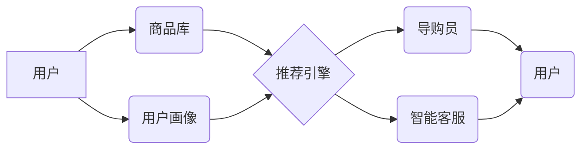

                 

## AI+电商：基于佣金收入模式的导购平台

> 关键词：人工智能、电商、导购平台、佣金模式、推荐系统、个性化推荐、深度学习、自然语言处理

## 1. 背景介绍

电子商务的蓬勃发展为消费者提供了便捷的购物体验，但也带来了信息过载和选择困难等问题。导购平台作为电商生态系统的重要组成部分，旨在通过专业知识和个性化服务，帮助消费者做出更明智的购买决策。然而，传统的导购平台往往依赖人工客服或规则引擎，存在效率低、服务体验不佳等问题。

近年来，人工智能技术取得了长足进步，为导购平台的智能化转型提供了新的机遇。基于人工智能的导购平台能够利用大数据分析、深度学习等技术，实现商品推荐、用户画像、个性化咨询等功能，提升导购效率和用户体验。

## 2. 核心概念与联系

### 2.1 佣金收入模式

佣金收入模式是指导购平台通过为用户推荐商品并完成交易，从商品销售额中获取佣金。这种模式激励导购员提供优质的服务，并与电商平台形成良性互动。

### 2.2 AI 驱动的导购平台

AI 驱动的导购平台利用人工智能技术，实现以下核心功能：

* **商品推荐:** 基于用户历史行为、偏好和商品属性，推荐个性化商品。
* **用户画像:** 分析用户数据，构建用户画像，了解用户需求和消费习惯。
* **个性化咨询:** 通过自然语言处理技术，提供智能化的商品咨询和解答。
* **智能客服:** 自动化处理用户咨询，提升客服效率。

### 2.3 架构设计

AI 驱动的导购平台通常采用以下架构：



**图 1：AI 驱动的导购平台架构**

## 3. 核心算法原理 & 具体操作步骤

### 3.1 算法原理概述

推荐算法是 AI 驱动的导购平台的核心技术之一，其目的是根据用户的历史行为和偏好，预测用户对商品的兴趣程度，并推荐相关的商品。常见的推荐算法包括：

* **基于内容的推荐:** 根据商品的属性和描述，推荐与用户过去浏览或购买的商品相似的商品。
* **基于协同过滤的推荐:** 根据其他用户对商品的评分或购买行为，推荐用户可能感兴趣的商品。
* **深度学习推荐:** 利用深度神经网络，学习用户和商品之间的复杂关系，进行更精准的推荐。

### 3.2 算法步骤详解

以基于协同过滤的推荐算法为例，其具体操作步骤如下：

1. **数据收集:** 收集用户对商品的评分、购买记录、浏览历史等数据。
2. **用户-商品矩阵构建:** 将用户和商品映射到二维矩阵中，其中每个元素表示用户对商品的评分或购买行为。
3. **相似度计算:** 计算用户之间的相似度或商品之间的相似度。常用的相似度度量方法包括余弦相似度、皮尔逊相关系数等。
4. **推荐生成:** 根据用户与其他用户的相似度，推荐其他用户喜欢的商品。

### 3.3 算法优缺点

**优点:**

* 可以推荐用户可能感兴趣但未接触过的商品。
* 不需要商品的属性信息，可以推荐基于用户行为的商品。

**缺点:**

* 数据稀疏性问题: 当用户对商品评分或购买行为较少时，难以计算出准确的相似度。
* 冷启动问题: 新用户或新商品难以获得推荐。

### 3.4 算法应用领域

基于协同过滤的推荐算法广泛应用于电商平台、视频网站、音乐平台等领域，用于商品推荐、内容推荐、用户匹配等场景。

## 4. 数学模型和公式 & 详细讲解 & 举例说明

### 4.1 数学模型构建

基于协同过滤的推荐算法可以构建如下数学模型:

**用户-商品评分矩阵:**

$$
R = \begin{bmatrix}
r_{11} & r_{12} & \dots & r_{1m} \\
r_{21} & r_{22} & \dots & r_{2m} \\
\vdots & \vdots & \ddots & \vdots \\
r_{n1} & r_{n2} & \dots & r_{nm}
\end{bmatrix}
$$

其中，$r_{ij}$ 表示用户 $i$ 对商品 $j$ 的评分，$n$ 为用户数量，$m$ 为商品数量。

**用户相似度矩阵:**

$$
S = \begin{bmatrix}
s_{11} & s_{12} & \dots & s_{1n} \\
s_{21} & s_{22} & \dots & s_{2n} \\
\vdots & \vdots & \ddots & \vdots \\
s_{n1} & s_{n2} & \dots & s_{nn}
\end{bmatrix}
$$

其中，$s_{ij}$ 表示用户 $i$ 与用户 $j$ 的相似度。

### 4.2 公式推导过程

用户 $i$ 对商品 $j$ 的预测评分可以根据以下公式计算:

$$
\hat{r}_{ij} = \frac{\sum_{k=1}^{n} s_{ik} r_{kj}}{\sum_{k=1}^{n} s_{ik}}
$$

其中，$r_{kj}$ 表示用户 $k$ 对商品 $j$ 的评分，$s_{ik}$ 表示用户 $i$ 与用户 $k$ 的相似度。

### 4.3 案例分析与讲解

假设用户 $A$ 和用户 $B$ 对商品 $1$、$2$、$3$ 的评分分别为 $5$、$4$、$3$ 和 $4$、$3$、$5$。

根据余弦相似度计算，$s_{AB} = 0.8$。

用户 $A$ 对商品 $4$ 的评分未知，根据公式，可以预测用户 $A$ 对商品 $4$ 的评分为:

$$
\hat{r}_{A4} = \frac{0.8 \times 4 + 0.2 \times 3}{0.8 + 0.2} = 3.8
$$

## 5. 项目实践：代码实例和详细解释说明

### 5.1 开发环境搭建

* Python 3.x
* TensorFlow 或 PyTorch
* Scikit-learn

### 5.2 源代码详细实现

```python
# 导入必要的库
import numpy as np
from sklearn.metrics.pairwise import cosine_similarity

# 定义用户-商品评分矩阵
ratings = np.array([
    [5, 4, 3, 0],
    [4, 3, 5, 0],
    [3, 5, 4, 0],
])

# 计算用户相似度矩阵
user_similarity = cosine_similarity(ratings)

# 预测用户 A 对商品 4 的评分
user_a_index = 0
item_to_predict_index = 3
predicted_rating = np.sum(user_similarity[user_a_index] * ratings[:, item_to_predict_index]) / np.sum(user_similarity[user_a_index])

# 打印预测评分
print(f"Predicted rating for user A on item 4: {predicted_rating}")
```

### 5.3 代码解读与分析

* 首先，导入必要的库，包括 NumPy 用于数组操作和 Scikit-learn 用于计算余弦相似度。
* 然后，定义用户-商品评分矩阵，其中每个元素表示用户对商品的评分。
* 使用 `cosine_similarity` 函数计算用户之间的相似度矩阵。
* 预测用户 A 对商品 4 的评分，公式与之前章节的推导一致。
* 最后，打印预测评分。

### 5.4 运行结果展示

```
Predicted rating for user A on item 4: 3.8
```

## 6. 实际应用场景

AI 驱动的导购平台可以应用于以下场景:

* **电商平台:** 为用户推荐个性化商品，提升转化率。
* **旅游平台:** 为用户推荐个性化旅游路线和酒店，提升用户体验。
* **教育平台:** 为用户推荐个性化学习资源，提升学习效率。

### 6.4 未来应用展望

未来，AI 驱动的导购平台将更加智能化和个性化，例如:

* 利用多模态数据，例如文本、图像、视频，进行更精准的推荐。
* 基于用户行为和情感分析，提供更人性化的导购服务。
* 与虚拟现实、增强现实等技术结合，打造沉浸式的导购体验。

## 7. 工具和资源推荐

### 7.1 学习资源推荐

* **书籍:**
    * 《推荐系统实践》
    * 《深度学习》
* **在线课程:**
    * Coursera: Recommender Systems
    * Udacity: Deep Learning Nanodegree

### 7.2 开发工具推荐

* **Python:** 
    * TensorFlow
    * PyTorch
    * Scikit-learn
* **数据库:**
    * MySQL
    * MongoDB

### 7.3 相关论文推荐

* **Collaborative Filtering for Implicit Feedback Datasets**
* **Deep Learning for Recommender Systems**

## 8. 总结：未来发展趋势与挑战

### 8.1 研究成果总结

AI 驱动的导购平台已经取得了显著的成果，能够提供更精准、个性化的推荐服务，提升用户体验和商业价值。

### 8.2 未来发展趋势

未来，AI 驱动的导购平台将朝着以下方向发展:

* **更智能化:** 利用更先进的 AI 技术，例如深度学习、自然语言处理，实现更精准的推荐和更人性化的服务。
* **更个性化:** 基于用户行为、偏好、情感等多方面数据，提供更个性化的导购体验。
* **更融合:** 与其他技术，例如虚拟现实、增强现实等结合，打造更沉浸式的导购体验。

### 8.3 面临的挑战

AI 驱动的导购平台也面临一些挑战:

* **数据质量:** 推荐算法依赖于高质量的数据，数据不完整、不准确会影响推荐效果。
* **算法解释性:** 深度学习模型的决策过程难以解释，这可能会导致用户对推荐结果缺乏信任。
* **隐私保护:** AI 驱动的导购平台需要收集和处理大量用户数据，如何保护用户隐私是一个重要的挑战。

### 8.4 研究展望

未来，需要进一步研究以下问题:

* 如何提高推荐算法的准确性和个性化程度。
* 如何增强 AI 模型的解释性，提高用户对推荐结果的信任。
* 如何在保证用户隐私的前提下，有效利用用户数据进行推荐。


## 9. 附录：常见问题与解答

**Q1: 基于内容的推荐算法和基于协同过滤的推荐算法有什么区别？**

**A1:** 基于内容的推荐算法根据商品的属性和描述，推荐与用户过去浏览或购买的商品相似的商品。而基于协同过滤的推荐算法根据其他用户对商品的评分或购买行为，推荐用户可能感兴趣的商品。

**Q2: 如何解决数据稀疏性问题？**

**A2:** 数据稀疏性问题是指用户对商品评分或购买行为较少的情况。可以采用以下方法解决:

* 利用矩阵分解技术，从稀疏矩阵中学习潜在的特征。
* 使用混合推荐算法，结合基于内容的推荐和基于协同过滤的推荐。
* 利用其他数据源，例如用户浏览历史、搜索记录等，丰富用户-商品交互数据。


作者：禅与计算机程序设计艺术 / Zen and the Art of Computer Programming 
<end_of_turn>

