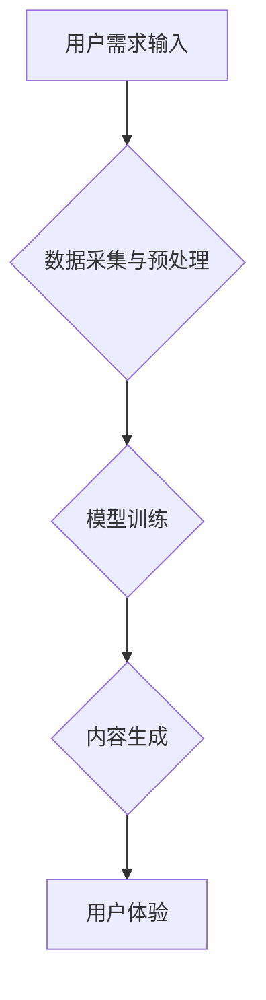

                 

## AIGC重塑旅游出行业

> 关键词：AIGC、旅游业、人工智能、内容创作、个性化推荐、智能客服、虚拟旅游、旅游规划

## 1. 背景介绍

旅游业作为全球重要的经济支柱产业，近年来一直面临着快速发展和转型升级的挑战。传统旅游模式逐渐被消费者所诟病，例如信息获取困难、行程安排单一、体验缺乏个性化等问题。而人工智能技术的蓬勃发展，特别是AIGC（人工智能生成内容）技术的出现，为旅游业带来了前所未有的机遇。AIGC能够自动生成高质量的旅游内容，例如文字、图片、视频等，并根据用户的需求进行个性化定制，从而重塑旅游出行的体验。

## 2. 核心概念与联系

**2.1  AIGC概述**

AIGC是指利用人工智能技术自动生成各种类型的文本、图像、音频、视频等内容。它通过训练大量的文本、图像等数据，学习内容的生成规律，并利用深度学习算法生成新的内容。AIGC技术涵盖了自然语言处理（NLP）、计算机视觉（CV）、语音识别（ASR）等多个领域，并不断融合发展。

**2.2  AIGC与旅游业的结合**

AIGC技术可以应用于旅游业的各个环节，例如：

* **内容创作：**自动生成旅游攻略、景点介绍、旅行故事等内容，丰富旅游平台的内容供给。
* **个性化推荐：**根据用户的旅行偏好、历史记录等信息，推荐个性化的旅游线路、酒店、景点等。
* **智能客服：**利用聊天机器人技术，为游客提供24小时在线咨询服务，解答旅行疑问，提供行程安排等帮助。
* **虚拟旅游：**利用3D建模和VR技术，打造虚拟旅游体验，让用户在家就能感受旅游的乐趣。
* **旅游规划：**根据用户的需求和预算，自动规划个性化的旅游行程，包括交通、住宿、景点等安排。

**2.3  AIGC流程图**



## 3. 核心算法原理 & 具体操作步骤

**3.1  算法原理概述**

AIGC的核心算法主要包括：

* **自然语言生成模型（NLG）：**用于生成文本内容，例如GPT-3、BERT等。
* **图像生成模型（IG）：**用于生成图像内容，例如DALL-E 2、Stable Diffusion等。
* **视频生成模型（VG）：**用于生成视频内容，例如Meta's Make-A-Video等。

这些模型通常基于深度学习技术，利用大量的训练数据学习内容的生成规律，并通过解码器生成新的内容。

**3.2  算法步骤详解**

1. **数据采集与预处理：**收集大量相关数据，例如旅游文本、图片、视频等，并进行清洗、格式化、标注等预处理工作。
2. **模型训练：**选择合适的模型架构，并利用训练数据进行模型训练，调整模型参数，使其能够生成高质量的内容。
3. **内容生成：**根据用户的需求输入，利用训练好的模型生成相应的旅游内容，例如旅游攻略、景点介绍、行程安排等。
4. **内容评估与优化：**对生成的內容进行评估，例如流畅度、准确性、原创性等，并根据评估结果进行模型优化，不断提升内容质量。

**3.3  算法优缺点**

**优点：**

* **自动化生成：**可以自动生成大量高质量的旅游内容，节省人力成本。
* **个性化定制：**可以根据用户的需求进行个性化定制，提供更符合用户偏好的内容。
* **实时更新：**可以实时更新内容，保持内容的时效性。

**缺点：**

* **数据依赖：**AIGC模型的性能依赖于训练数据的质量和数量。
* **内容偏见：**训练数据可能存在偏见，导致生成的內容也存在偏见。
* **缺乏创造力：**AIGC模型生成的內容虽然高质量，但缺乏真正的创造力。

**3.4  算法应用领域**

AIGC技术在旅游业的应用领域非常广泛，例如：

* **旅游平台：**为旅游平台提供个性化推荐、智能客服、虚拟旅游等服务。
* **旅行社：**帮助旅行社自动生成旅游攻略、行程安排等内容，提高工作效率。
* **酒店：**利用AIGC技术为酒店客人提供个性化的服务，例如推荐餐厅、景点等。
* **景区：**利用AIGC技术打造虚拟景区，吸引更多游客。

## 4. 数学模型和公式 & 详细讲解 & 举例说明

**4.1  数学模型构建**

AIGC模型通常基于概率模型，例如语言模型、图像模型等。这些模型通过学习数据中的概率分布，预测下一个词、像素等。

**4.2  公式推导过程**

例如，语言模型的训练目标是最大化似然函数，即预测训练数据中出现的词序列的概率。

$$
\mathcal{L} = \prod_{i=1}^{N} p(w_i | w_{1:i-1})
$$

其中，$N$是训练数据的长度，$w_i$是第$i$个词，$w_{1:i-1}$是前$i-1$个词。

**4.3  案例分析与讲解**

例如，GPT-3模型使用Transformer架构，并通过自回归的方式生成文本。它利用注意力机制学习文本中的上下文关系，并根据上下文预测下一个词。

## 5. 项目实践：代码实例和详细解释说明

**5.1  开发环境搭建**

AIGC项目开发环境通常需要包含以下软件：

* Python编程语言
* 深度学习框架，例如TensorFlow、PyTorch
* 数据处理工具，例如Pandas、NumPy
* 虚拟环境管理工具，例如conda、venv

**5.2  源代码详细实现**

由于篇幅限制，这里只提供一个简单的AIGC文本生成代码示例：

```python
import tensorflow as tf

# 定义一个简单的文本生成模型
model = tf.keras.Sequential([
    tf.keras.layers.Embedding(input_dim=10000, output_dim=128),
    tf.keras.layers.LSTM(128),
    tf.keras.layers.Dense(10000, activation='softmax')
])

# 训练模型
model.compile(loss='sparse_categorical_crossentropy', optimizer='adam')
model.fit(x_train, y_train, epochs=10)

# 生成文本
seed_text = "The quick brown fox"
for _ in range(10):
    predictions = model.predict(tf.expand_dims(seed_text, 0))
    predicted_index = tf.argmax(predictions[0]).numpy()
    predicted_word = vocabulary[predicted_index]
    seed_text += " " + predicted_word
```

**5.3  代码解读与分析**

该代码示例使用TensorFlow框架构建了一个简单的文本生成模型。模型包含嵌入层、LSTM层和全连接层。嵌入层将单词转换为向量表示，LSTM层学习文本的上下文关系，全连接层预测下一个词的概率。

**5.4  运行结果展示**

运行该代码后，会生成一个基于输入文本的续写文本。

## 6. 实际应用场景

**6.1  个性化旅游推荐**

AIGC可以根据用户的旅行偏好、历史记录等信息，推荐个性化的旅游线路、酒店、景点等。例如，如果用户喜欢历史文化旅游，AIGC可以推荐一些历史悠久的古迹、博物馆等景点。

**6.2  智能客服**

AIGC可以利用聊天机器人技术，为游客提供24小时在线咨询服务，解答旅行疑问，提供行程安排等帮助。例如，游客可以通过聊天机器人查询航班信息、酒店预订等。

**6.3  虚拟旅游**

AIGC可以利用3D建模和VR技术，打造虚拟旅游体验，让用户在家就能感受旅游的乐趣。例如，用户可以通过VR眼镜体验著名的旅游景点，例如埃菲尔铁塔、万里长城等。

**6.4  未来应用展望**

AIGC技术在旅游业的应用前景广阔，未来可能在以下方面得到更广泛的应用：

* **更个性化的旅游体验：**AIGC可以根据用户的需求和喜好，定制个性化的旅游行程、酒店住宿、餐饮安排等。
* **更智能的旅游服务：**AIGC可以提供更智能的旅游服务，例如自动翻译、语音导航、实时路况查询等。
* **更丰富的旅游内容：**AIGC可以自动生成各种类型的旅游内容，例如旅游攻略、景点介绍、旅行故事等，丰富旅游平台的内容供给。

## 7. 工具和资源推荐

**7.1  学习资源推荐**

* **书籍：**
    * 《深度学习》
    * 《自然语言处理》
    * 《计算机视觉》
* **在线课程：**
    * Coursera
    * edX
    * Udacity

**7.2  开发工具推荐**

* **深度学习框架：**
    * TensorFlow
    * PyTorch
* **数据处理工具：**
    * Pandas
    * NumPy
* **文本处理工具：**
    * NLTK
    * SpaCy

**7.3  相关论文推荐**

* **GPT-3论文：**
    * https://arxiv.org/abs/2005.14165
* **DALL-E 2论文：**
    * https://openai.com/blog/dall-e-2/
* **Stable Diffusion论文：**
    * https://arxiv.org/abs/2112.10752

## 8. 总结：未来发展趋势与挑战

**8.1  研究成果总结**

AIGC技术在旅游业的应用取得了显著成果，例如个性化推荐、智能客服、虚拟旅游等。这些应用能够提高旅游体验、提升服务效率、丰富旅游内容。

**8.2  未来发展趋势**

未来AIGC技术在旅游业的应用将更加深入和广泛，例如：

* **更智能的旅游规划：**AIGC可以根据用户的需求和预算，自动规划更智能、更个性化的旅游行程。
* **更沉浸式的虚拟旅游：**AIGC可以利用增强现实（AR）和虚拟现实（VR）技术，打造更沉浸式的虚拟旅游体验。
* **更个性化的旅游营销：**AIGC可以根据用户的兴趣爱好，生成更精准的旅游营销内容。

**8.3  面临的挑战**

AIGC技术在旅游业的应用也面临一些挑战，例如：

* **数据安全和隐私保护：**AIGC模型需要大量用户数据进行训练，如何保证数据安全和隐私保护是一个重要问题。
* **内容原创性和可信度：**AIGC生成的內容虽然高质量，但缺乏真正的创造力，如何提高内容的原创性和可信度是一个挑战。
* **伦理问题：**AIGC技术可能带来一些伦理问题，例如算法偏见、内容虚假等，需要引起重视和解决。

**8.4  研究展望**

未来研究方向包括：

* **开发更安全、更可靠的AIGC模型：**研究更有效的隐私保护机制，提高模型的鲁棒性和安全性。
* **提升AIGC内容的原创性和可信度：**探索新的算法和技术，提高AIGC生成的內容的原创性和可信度。
* **解决AIGC技术带来的伦理问题：**制定相应的伦理规范和法律法规，引导AIGC技术健康发展。


## 9. 附录：常见问题与解答

**9.1  AIGC生成的內容是否真实可靠？**

AIGC生成的內容虽然高质量，但并非完全真实可靠。用户需要对AIGC生成的內容进行判断和核实。

**9.2  AIGC技术会取代人类工作吗？**

AIGC技术可以自动化一些重复性工作，但不会完全取代人类工作。人类仍然需要发挥创造力、判断力和解决问题的能力。

**9.3  如何学习AIGC技术？**

可以学习深度学习、自然语言处理、计算机视觉等相关知识，并利用开源工具和平台进行实践。

作者：禅与计算机程序设计艺术 / Zen and the Art of Computer Programming 


<end_of_turn>

