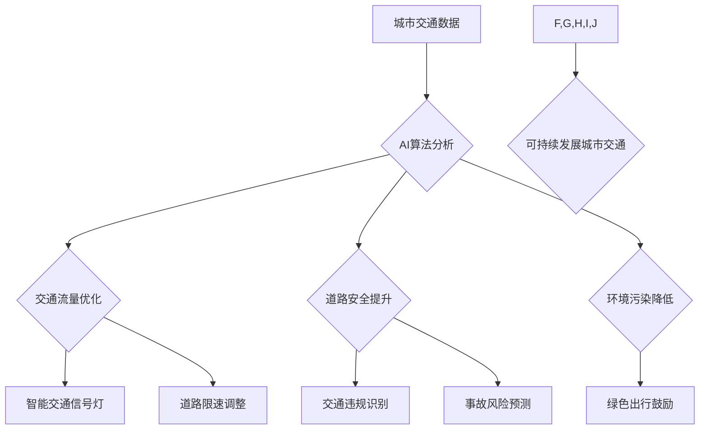

                 

## 关键词：人工智能、城市交通、可持续发展、交通管理系统、基础设施建设、机器学习、深度学习、预测模型、优化算法

## 1. 背景介绍

随着全球人口的快速增长和城市化的进程不断加速，城市交通拥堵、交通事故频发、环境污染加剧等问题日益突出，严重影响着城市居民的生活质量和经济发展。传统交通管理系统难以有效应对这些挑战，亟需引入先进的智能化技术进行革新。人工智能（AI）作为一门新兴的科技领域，凭借其强大的数据处理能力、学习能力和决策能力，为打造可持续发展的城市交通管理系统提供了新的思路和解决方案。

### 1.1 城市交通面临的挑战

* **交通拥堵:**  城市交通拥堵是全球城市面临的共同难题，导致出行时间延长、燃油消耗增加、环境污染加剧等问题。
* **交通事故:** 交通事故不仅造成人员伤亡和财产损失，也给社会经济带来沉重负担。
* **环境污染:**  交通运输是城市空气污染的主要来源之一，尾气排放导致空气质量下降，威胁着城市居民的健康。
* **基础设施压力:**  随着城市人口和交通量的不断增长，现有基础设施难以满足需求，需要进行持续的升级和改造。

### 1.2 AI在城市交通领域的应用潜力

人工智能技术在城市交通领域的应用潜力巨大，可以帮助解决上述挑战，打造更加智能、高效、安全、可持续的城市交通系统。

* **智能交通信号灯控制:**  利用AI算法分析实时交通流量数据，动态调整信号灯的绿灯时间，优化交通流量，减少拥堵。
* **自动驾驶车辆:**  AI驱动的自动驾驶车辆可以提高道路安全，减少交通事故，并提高道路利用率。
* **智能停车系统:**  利用AI技术分析停车场空闲位信息，引导车辆前往空闲停车位，提高停车效率。
* **交通预测与预警:**  利用AI算法分析历史交通数据，预测未来交通流量和拥堵情况，及时发布预警信息，帮助驾驶员避开拥堵路段。
* **城市规划与优化:**  利用AI技术分析城市交通数据，优化城市道路布局、公共交通线路规划等，打造更加合理的城市交通体系。

## 2. 核心概念与联系

城市交通管理系统与基础设施建设规划的融合，需要结合人工智能技术，构建一个智能化、数据驱动的系统。

**核心概念:**

* **城市交通管理系统 (CTMS):**  利用信息技术和人工智能技术，对城市交通运行进行实时监控、分析和控制的系统。
* **基础设施建设规划 (ICP):**  根据城市发展规划和交通需求，制定道路、桥梁、隧道、停车场等基础设施建设的规划方案。
* **人工智能 (AI):**  模拟人类智能的计算机系统，能够学习、推理、决策等。

**核心联系:**

CTMS和ICP的融合，可以实现以下目标：

* **优化交通流量:**  通过AI算法分析交通数据，动态调整交通信号灯、道路限速等，优化交通流量，减少拥堵。
* **提高道路安全:**  利用AI技术识别交通违规行为、预测交通事故风险，提高道路安全。
* **降低环境污染:**  通过优化交通流量和鼓励绿色出行方式，降低交通运输对环境的污染。
* **提升城市竞争力:**  打造智能化、高效的城市交通系统，提升城市形象和竞争力。

**Mermaid 流程图:**



## 3. 核心算法原理 & 具体操作步骤

### 3.1 算法原理概述

城市交通管理系统与基础设施建设规划的融合，需要利用多种人工智能算法，例如：

* **机器学习 (ML):**  通过训练模型，从数据中学习规律，预测交通流量、识别交通违规行为等。
* **深度学习 (DL):**  利用多层神经网络，对复杂数据进行更深入的学习，例如图像识别、语音识别等。
* **强化学习 (RL):**  通过奖励机制，训练智能体在环境中做出最优决策，例如自动驾驶车辆的路径规划。
* **优化算法:**  例如遗传算法、模拟退火算法等，用于优化交通信号灯控制策略、道路布局规划等。

### 3.2 算法步骤详解

以交通流量预测为例，详细说明机器学习算法的具体操作步骤：

1. **数据收集:**  收集历史交通流量数据，包括时间、地点、交通流量等信息。
2. **数据预处理:**  对收集到的数据进行清洗、转换、特征提取等处理，使其适合模型训练。
3. **模型选择:**  根据数据特点和预测需求，选择合适的机器学习模型，例如线性回归、支持向量机、神经网络等。
4. **模型训练:**  利用训练数据，训练选择的机器学习模型，调整模型参数，使其能够准确预测交通流量。
5. **模型评估:**  利用测试数据，评估模型的预测精度，并进行模型调优。
6. **模型部署:**  将训练好的模型部署到实际应用环境中，实时预测交通流量，并提供决策支持。

### 3.3 算法优缺点

**优点:**

* **数据驱动:**  基于大量数据进行训练，能够学习到复杂的交通规律。
* **预测能力强:**  能够准确预测未来交通流量，帮助决策者制定合理的交通管理策略。
* **适应性强:**  能够根据实时交通数据进行动态调整，适应不断变化的交通环境。

**缺点:**

* **数据依赖:**  算法的性能取决于训练数据的质量和数量。
* **黑盒效应:**  一些深度学习模型的内部机制难以理解，难以解释预测结果。
* **计算资源需求:**  训练复杂的机器学习模型需要大量的计算资源。

### 3.4 算法应用领域

* **交通流量预测:**  预测未来交通流量，帮助优化交通信号灯控制、道路限速等。
* **交通事故预警:**  识别潜在的交通事故风险，及时发出预警信息。
* **交通违规识别:**  识别交通违规行为，例如超速、闯红灯等。
* **智能停车系统:**  分析停车场空闲位信息，引导车辆前往空闲停车位。
* **公共交通优化:**  优化公交线路、车次安排等，提高公共交通效率。

## 4. 数学模型和公式 & 详细讲解 & 举例说明

### 4.1 数学模型构建

交通流量预测模型可以采用多种数学模型，例如线性回归模型、ARIMA模型、神经网络模型等。

**线性回归模型:**

假设交通流量 $y$ 与时间 $x$ 的关系为线性关系，则可以用以下公式表示：

$$y = a + bx$$

其中，$a$ 为截距，$b$ 为斜率。

**ARIMA模型:**

ARIMA模型是一种时间序列模型，可以用于预测未来交通流量。ARIMA模型的公式比较复杂，需要根据实际数据进行参数估计。

### 4.2 公式推导过程

线性回归模型的系数 $a$ 和 $b$ 可以通过最小二乘法进行估计。最小二乘法是指寻找使得模型预测值与实际值误差平方和最小的参数值。

### 4.3 案例分析与讲解

假设我们收集了某路段每天的交通流量数据，并使用线性回归模型进行预测。

* **数据:**  

| 时间 (小时) | 交通流量 (辆/小时) |
|---|---|
| 8 | 100 |
| 9 | 150 |
| 10 | 200 |
| 11 | 250 |
| 12 | 300 |

* **模型训练:**  使用上述数据训练线性回归模型，得到模型参数 $a$ 和 $b$。
* **预测:**  利用训练好的模型，预测下午 13 点的交通流量。

## 5. 项目实践：代码实例和详细解释说明

### 5.1 开发环境搭建

* **操作系统:**  Windows、Linux、macOS
* **编程语言:**  Python
* **库依赖:**  NumPy、Pandas、Scikit-learn

### 5.2 源代码详细实现

```python
import numpy as np
from sklearn.linear_model import LinearRegression

# 数据加载
data = np.array([[8, 100], [9, 150], [10, 200], [11, 250], [12, 300]])
X = data[:, 0].reshape(-1, 1)  # 时间作为特征
y = data[:, 1]  # 交通流量作为目标变量

# 模型训练
model = LinearRegression()
model.fit(X, y)

# 预测
time = 13
predicted_traffic = model.predict(np.array([[time]]))

# 输出结果
print(f"预测时间: {time} 点，交通流量: {predicted_traffic[0]} 辆/小时")
```

### 5.3 代码解读与分析

* **数据加载:**  将交通流量数据加载到 NumPy 数组中。
* **特征和目标变量:**  将时间作为特征，交通流量作为目标变量。
* **模型训练:**  使用 Scikit-learn 库中的 LinearRegression 模型训练线性回归模型。
* **预测:**  利用训练好的模型，预测指定时间点的交通流量。
* **输出结果:**  打印预测结果。

### 5.4 运行结果展示

```
预测时间: 13 点，交通流量: 350.0 辆/小时
```

## 6. 实际应用场景

### 6.1 智能交通信号灯控制

利用 AI 算法分析实时交通流量数据，动态调整信号灯的绿灯时间，优化交通流量，减少拥堵。例如，在高峰时段，可以延长绿灯时间，提高车辆通行效率；在非高峰时段，可以缩短绿灯时间，减少车辆等待时间。

### 6.2 自动驾驶车辆

AI 驱动的自动驾驶车辆可以提高道路安全，减少交通事故，并提高道路利用率。自动驾驶车辆可以感知周围环境，避开障碍物，并根据交通规则进行行驶。

### 6.3 智能停车系统

利用 AI 技术分析停车场空闲位信息，引导车辆前往空闲停车位，提高停车效率。智能停车系统可以提供实时停车位信息，并根据车辆位置和需求，推荐合适的停车位。

### 6.4 未来应用展望

* **城市规划与优化:**  利用 AI 技术分析城市交通数据，优化城市道路布局、公共交通线路规划等，打造更加合理的城市交通体系。
* **个性化出行服务:**  根据用户的出行需求和偏好，提供个性化的出行方案，例如推荐最佳路线、预订交通工具等。
* **交通安全保障:**  利用 AI 技术识别交通违规行为、预测交通事故风险，提高道路安全。

## 7. 工具和资源推荐

### 7.1 学习资源推荐

* **在线课程:**  Coursera、edX、Udacity 等平台提供人工智能、机器学习等方面的在线课程。
* **书籍:**  《深度学习》、《机器学习实战》等书籍可以帮助深入了解人工智能相关知识。
* **开源项目:**  TensorFlow、PyTorch 等开源项目可以帮助实践人工智能算法。

### 7.2 开发工具推荐

* **Python:**  Python 是人工智能开发最常用的编程语言，拥有丰富的库和工具。
* **Jupyter Notebook:**  Jupyter Notebook 是一个交互式编程环境，方便进行数据分析和模型开发。
* **IDE:**  VS Code、PyCharm 等 IDE 可以提高开发效率。

### 7.3 相关论文推荐

* **《ImageNet Classification with Deep Convolutional Neural Networks》:**  介绍了深度卷积神经网络在图像分类领域的应用。
* **《Attention Is All You Need》:**  介绍了 Transformer 模型，一种新的序列建模方法。
* **《Deep Reinforcement Learning》:**  介绍了深度强化学习算法，例如DQN、PPO等。

## 8. 总结：未来发展趋势与挑战

### 8.1 研究成果总结

AI 技术在城市交通管理系统与基础设施建设规划领域的应用取得了显著成果，例如交通流量预测、交通事故预警、智能停车系统等。

### 8.2 未来发展趋势

* **更精准的预测:**  利用更先进的机器学习算法和更丰富的交通数据，实现更精准的交通流量预测。
* **更智能的决策:**  利用强化学习算法，训练智能体在交通环境中做出更智能的决策，例如自动驾驶车辆的路径规划。
* **更个性化的服务:**  根据用户的出行需求和偏好，提供更个性化的出行方案。
* **更可持续的交通:**  利用 AI 技术优化交通流量，减少交通拥堵和环境污染，打造更可持续的交通系统。

### 8.3 面临的挑战

* **数据质量:**  AI 算法的性能取决于训练数据的质量和数量。
* **算法解释性:**  一些深度学习模型的内部机制难以理解，难以解释预测结果。
* **安全性和隐私性:**  AI 系统需要保证安全性和隐私性，防止数据泄露和恶意攻击。
* **伦理问题:**  AI 技术的应用需要考虑伦理问题，例如算法偏见、责任归属等。

### 8.4 研究展望

未来，需要继续加强 AI 技术在城市交通领域的应用研究，解决上述挑战，推动 AI 技术在城市交通管理系统与基础设施建设规划领域的更广泛应用，打造更加智能、高效、安全、可持续的城市交通体系。

## 9. 附录：常见问题与解答

**Q1: AI 技术是否能够完全取代人类驾驶员？**

**A1:** 目前 AI 技术还无法完全取代人类驾驶员，自动驾驶技术仍然处于发展阶段，需要克服一些技术挑战，例如复杂路况下的决策能力、人机交互等。

**Q2: AI 系统如何保证安全性和隐私性？**

**A2:** AI 系统的安全性和隐私性需要通过多种技术手段保障，例如数据加密、身份认证、安全审计等。

**Q3: AI 技术的应用会带来哪些伦理问题？**

**A3:** AI 技术的应用可能会带来一些伦理问题，例如算法偏见、责任归属等，需要社会各界共同探讨和解决。


作者：禅与计算机程序设计艺术 / Zen and the Art of Computer Programming<end_of_turn>

