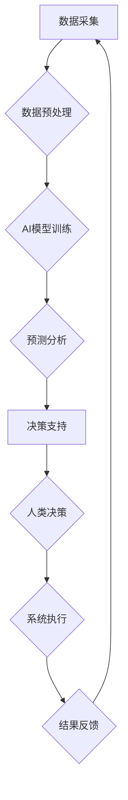

                 

## AI与人类计算：打造可持续发展的城市基础设施建设

> 关键词：人工智能、城市基础设施、可持续发展、人类计算、数据驱动、优化算法、机器学习、深度学习、预测建模

## 1. 背景介绍

城市化进程的加速和人口规模的不断增长，对城市基础设施提出了前所未有的挑战。传统的基础设施建设模式面临着效率低下、资源浪费、环境污染等问题，难以满足现代城市发展的需求。人工智能（AI）技术的快速发展为城市基础设施建设提供了新的机遇和可能性。AI能够通过分析海量数据、识别模式、预测趋势，帮助我们构建更加智能、高效、可持续的城市基础设施。

城市基础设施涵盖广泛的领域，包括交通运输、能源供应、水资源管理、环境监测、公共安全等。这些领域都面临着各自的挑战，例如交通拥堵、能源短缺、水资源枯竭、环境污染等。AI技术可以应用于这些领域，帮助我们解决这些问题，提高城市基础设施的运行效率和服务水平。

## 2. 核心概念与联系

**2.1 人工智能与城市基础设施**

人工智能（AI）是指模拟人类智能行为的计算机系统。AI技术包括机器学习、深度学习、自然语言处理、计算机视觉等多个分支。这些技术可以应用于城市基础设施建设，例如：

* **智能交通管理:** 利用机器学习算法分析交通流量数据，预测交通拥堵情况，优化交通信号灯控制，提高交通效率。
* **智能能源管理:** 利用预测建模技术预测能源需求，优化能源分配，减少能源浪费。
* **智能水资源管理:** 利用传感器数据监测水资源状况，预测水资源需求，优化水资源分配，提高水资源利用效率。
* **智能环境监测:** 利用计算机视觉技术监测环境污染情况，及时预警环境问题。

**2.2 人类计算与城市基础设施**

人类计算是指利用人类的智慧和经验来解决复杂问题。在城市基础设施建设中，人类计算与AI技术可以相互补充，协同工作。例如：

* **数据分析与决策支持:** AI技术可以分析海量数据，提供决策支持，但最终的决策权仍然在人类手中。
* **系统设计与优化:** AI技术可以帮助我们设计更加智能的城市基础设施系统，但系统的设计和优化还需要人类的智慧和经验。
* **风险管理与应急响应:** AI技术可以帮助我们识别潜在的风险，但最终的风险管理和应急响应仍然需要人类的判断和决策。

**2.3 AI与人类计算协同架构**



## 3. 核心算法原理 & 具体操作步骤

**3.1 算法原理概述**

在城市基础设施建设中，常用的AI算法包括机器学习、深度学习、强化学习等。

* **机器学习:** 通过训练模型，让模型从数据中学习规律，并根据学习到的规律进行预测或分类。例如，可以使用机器学习算法预测交通流量、识别违章停车等。
* **深度学习:** 是一种更高级的机器学习算法，利用多层神经网络来模拟人类大脑的学习过程。深度学习算法能够处理更加复杂的数据，例如图像、语音、文本等。例如，可以使用深度学习算法识别交通信号灯、语音控制交通设备等。
* **强化学习:** 通过奖励机制，让模型学习最佳的行为策略。例如，可以使用强化学习算法优化交通信号灯控制策略，减少交通拥堵。

**3.2 算法步骤详解**

以机器学习算法为例，其基本步骤包括：

1. **数据收集:** 收集与城市基础设施相关的各种数据，例如交通流量数据、能源消耗数据、水资源数据等。
2. **数据预处理:** 对收集到的数据进行清洗、转换、特征提取等操作，使其能够被机器学习算法使用。
3. **模型选择:** 根据具体应用场景选择合适的机器学习算法，例如线性回归、逻辑回归、决策树、支持向量机等。
4. **模型训练:** 使用训练数据训练选择的机器学习模型，调整模型参数，使其能够准确地预测或分类。
5. **模型评估:** 使用测试数据评估模型的性能，例如准确率、召回率、F1-score等。
6. **模型部署:** 将训练好的模型部署到实际应用场景中，例如部署到交通管理系统、能源管理系统等。

**3.3 算法优缺点**

* **优点:**

    * 能够处理海量数据，发现隐藏的模式和规律。
    * 能够自动学习和优化，提高效率和准确性。
    * 能够提供个性化服务，满足不同用户的需求。

* **缺点:**

    * 需要大量的训练数据，数据质量对模型性能有重要影响。
    * 模型训练过程复杂，需要专业的技术人员进行操作。
    * 模型解释性较差，难以理解模型的决策过程。

**3.4 算法应用领域**

* **智能交通管理:** 交通流量预测、拥堵预警、信号灯优化、自动驾驶等。
* **智能能源管理:** 能源需求预测、能源分配优化、智能电网等。
* **智能水资源管理:** 水资源需求预测、水资源分配优化、漏水检测等。
* **智能环境监测:** 环境污染监测、灾害预警、资源管理等。

## 4. 数学模型和公式 & 详细讲解 & 举例说明

**4.1 数学模型构建**

在城市基础设施建设中，可以使用数学模型来描述系统行为、预测未来趋势、优化系统参数等。例如，可以使用线性回归模型来预测交通流量，可以使用差分方程模型来模拟水资源流动的过程。

**4.2 公式推导过程**

以交通流量预测为例，可以使用线性回归模型进行预测。模型的公式如下：

$$y = mx + c$$

其中：

* $y$ 是预测的交通流量
* $x$ 是时间变量
* $m$ 是斜率，表示交通流量随时间的变化趋势
* $c$ 是截距，表示交通流量的基准值

模型参数 $m$ 和 $c$ 可以通过最小二乘法进行估计。

**4.3 案例分析与讲解**

假设我们收集了某条道路的交通流量数据，数据如下：

| 时间 (小时) | 交通流量 (辆/小时) |
|---|---|
| 8 | 100 |
| 9 | 150 |
| 10 | 200 |
| 11 | 250 |
| 12 | 300 |

我们可以使用线性回归模型对这些数据进行拟合，得到模型参数 $m$ 和 $c$。然后，我们可以使用这个模型来预测未来某个时间段的交通流量。

## 5. 项目实践：代码实例和详细解释说明

**5.1 开发环境搭建**

* 操作系统: Ubuntu 20.04
* Python 版本: 3.8
* 必要的库: pandas, numpy, scikit-learn

**5.2 源代码详细实现**

```python
import pandas as pd
from sklearn.linear_model import LinearRegression

# 加载数据
data = pd.read_csv('traffic_data.csv')

# 准备数据
X = data[['时间']]
y = data[['交通流量']]

# 创建线性回归模型
model = LinearRegression()

# 训练模型
model.fit(X, y)

# 预测未来时间段的交通流量
future_time = pd.DataFrame({'时间': [13]})
predicted_traffic = model.predict(future_time)

# 打印预测结果
print(f'预测的交通流量: {predicted_traffic[0]}')
```

**5.3 代码解读与分析**

* 首先，我们使用 pandas 库加载交通流量数据。
* 然后，我们使用 scikit-learn 库中的 LinearRegression 类创建线性回归模型。
* 接着，我们使用 model.fit() 方法训练模型，将数据 X 和 y 作为输入。
* 训练完成后，我们可以使用 model.predict() 方法预测未来时间段的交通流量。

**5.4 运行结果展示**

运行代码后，会输出预测的交通流量值。

## 6. 实际应用场景

**6.1 智能交通管理**

* **交通流量预测:** 利用 AI 算法预测交通流量，帮助交通管理部门优化交通信号灯控制策略，减少交通拥堵。
* **拥堵预警:** 利用 AI 算法分析交通流量数据，识别拥堵区域，及时向驾驶员发出预警，避免交通拥堵。
* **自动驾驶:** 利用 AI 算法控制车辆行驶，实现自动驾驶，提高交通效率和安全性。

**6.2 智能能源管理**

* **能源需求预测:** 利用 AI 算法分析历史能源消耗数据，预测未来能源需求，帮助能源公司优化能源分配，减少能源浪费。
* **智能电网:** 利用 AI 算法控制电力系统，实现智能化管理，提高电力系统的可靠性和效率。

**6.3 智能水资源管理**

* **水资源需求预测:** 利用 AI 算法分析历史水资源消耗数据，预测未来水资源需求，帮助水资源管理部门优化水资源分配，提高水资源利用效率。
* **漏水检测:** 利用 AI 算法分析水管压力和流量数据，识别漏水点，及时进行维修，减少水资源浪费。

**6.4 未来应用展望**

随着 AI 技术的不断发展，其在城市基础设施建设中的应用将更加广泛和深入。例如，未来可能会出现以下应用场景：

* **城市大脑:** 利用 AI 技术整合城市各领域的數據，构建城市大脑，实现城市智能化管理。
* **个性化城市服务:** 利用 AI 技术提供个性化的城市服务，例如个性化的交通路线规划、个性化的能源管理方案等。
* **可持续发展城市:** 利用 AI 技术推动城市可持续发展，例如优化城市能源结构、减少城市碳排放等。

## 7. 工具和资源推荐

**7.1 学习资源推荐**

* **在线课程:** Coursera, edX, Udacity 等平台提供丰富的 AI 课程。
* **书籍:** 《深度学习》、《机器学习实战》等书籍是学习 AI 的经典教材。
* **开源项目:** TensorFlow, PyTorch 等开源项目提供了丰富的 AI 工具和资源。

**7.2 开发工具推荐**

* **Python:** Python 是 AI 开发最常用的编程语言。
* **Jupyter Notebook:** Jupyter Notebook 是一个交互式编程环境，方便进行 AI 开发和调试。
* **TensorFlow:** TensorFlow 是一个开源的机器学习框架，支持多种 AI 算法。
* **PyTorch:** PyTorch 是另一个开源的机器学习框架，以其灵活性和易用性而闻名。

**7.3 相关论文推荐**

* **《ImageNet Classification with Deep Convolutional Neural Networks》:** 这篇论文介绍了 AlexNet 模型，标志着深度学习在图像识别领域的突破。
* **《Attention Is All You Need》:** 这篇论文介绍了 Transformer 模型，彻底改变了自然语言处理领域。
* **《Deep Reinforcement Learning》:** 这篇论文综述了强化学习领域的发展，并介绍了多种经典算法。

## 8. 总结：未来发展趋势与挑战

**8.1 研究成果总结**

近年来，AI技术在城市基础设施建设领域取得了显著成果，例如交通流量预测、能源管理优化、水资源管理等。这些成果为城市的可持续发展提供了新的思路和方法。

**8.2 未来发展趋势**

* **模型更加复杂:** 未来 AI 模型将更加复杂，能够处理更加复杂的数据，并提供更加精准的预测和决策支持。
* **边缘计算:** AI 计算将更加靠近数据源，实现边缘计算，提高计算效率和实时性。
* **多模态融合:** AI 将融合多种数据类型，例如图像、语音、文本等，提供更加全面的城市服务。

**8.3 面临的挑战**

* **数据质量:** AI 模型的性能依赖于数据质量，如何获取高质量的数据是未来一个重要的挑战。
* **模型解释性:** AI 模型的决策过程往往难以理解，如何提高模型的解释性是另一个重要的挑战。
* **伦理问题:** AI 技术的应用可能会带来一些伦理问题，例如隐私保护、算法偏见等，需要认真思考和解决。

**8.4 研究展望**

未来，我们需要继续加强 AI 技术的研究和应用，探索 AI 在城市基础设施建设中的更多应用场景，并积极应对 AI 技术带来的挑战，推动城市的可持续发展。


## 9. 附录：常见问题与解答

**9.1 如何选择合适的 AI 算法？**

选择合适的 AI 算法取决于具体的应用场景和数据特点。例如，对于预测连续数值的数据，可以使用线性回归模型；对于分类问题，可以使用决策树模型或支持向量机模型。

**9.2 如何评估 AI 模型的性能？**

可以使用多种指标来评估 AI 模型的性能，例如准确率、召回率、F1-score等。

**9.3 如何解决 AI 模型的过拟合问题？**

过拟合是指 AI 模型在训练数据上表现很好，但在测试数据上表现较差。解决过拟合问题的方法包括：

* 减少模型复杂度
* 增加训练数据量
* 使用正则化技术

**9.4 如何保证 AI 模型的公平性和可解释性？**

保证 AI 模型的公平性和可解释性需要从多个方面入手，例如：

* 使用公平的训练数据
* 采用可解释的 AI 算法
* 对 AI 模型进行透明度评估

作者：禅与计算机程序设计艺术 / Zen and the Art of Computer Programming 


<end_of_turn>

