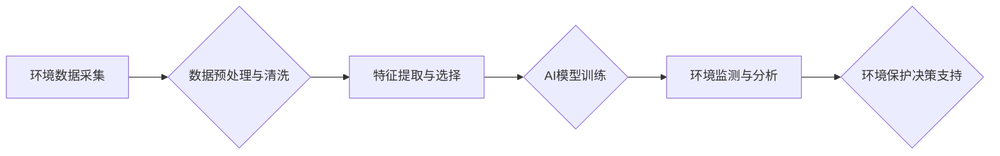

                 

## AI在环境监测和保护中的作用

> 关键词：人工智能、环境监测、机器学习、深度学习、计算机视觉、自然语言处理、环境保护

## 1. 背景介绍

全球环境问题日益严峻，气候变化、污染、资源枯竭等挑战对人类社会和生态系统构成严重威胁。传统环境监测方法往往受限于人力、时间和成本等因素，难以实现全面、实时、精准的监测。而人工智能（AI）技术的快速发展为环境监测和保护提供了新的机遇和可能性。

AI技术，特别是机器学习和深度学习，能够从海量环境数据中提取有价值的信息，识别环境变化趋势，预测潜在风险，并为环境保护决策提供科学依据。

## 2. 核心概念与联系

### 2.1 环境监测与保护

环境监测是指对环境要素进行系统、定量、连续的测量和分析，以了解环境状况、变化趋势和潜在风险。环境保护是指采取措施和行动，减少对环境的污染和破坏，维护生态平衡和人类健康。

### 2.2 人工智能技术

人工智能（AI）是指模拟人类智能行为的计算机系统。AI技术涵盖了多个领域，包括机器学习、深度学习、自然语言处理、计算机视觉等。

### 2.3 AI在环境监测和保护中的应用

AI技术可以应用于环境监测和保护的各个环节，例如：

* **数据采集和处理:** AI算法可以自动识别和提取环境数据，例如气象数据、水质数据、土壤数据等，并进行预处理和分析。
* **环境变化趋势分析:** AI模型可以分析历史环境数据，识别环境变化趋势，预测未来环境状况。
* **污染源识别和定位:** AI算法可以识别和定位污染源，帮助环境监管部门采取措施控制污染。
* **生态系统监测和保护:** AI技术可以监测生态系统变化，识别濒危物种，为生态保护提供决策支持。

**Mermaid 流程图**



## 3. 核心算法原理 & 具体操作步骤

### 3.1 算法原理概述

在环境监测和保护领域，常用的AI算法包括：

* **机器学习:** 
    * **监督学习:** 利用标记数据训练模型，例如分类、回归等。
    * **无监督学习:** 从未标记数据中发现模式，例如聚类、降维等。
    * **强化学习:** 通过试错学习，优化策略，例如机器人控制、游戏AI等。
* **深度学习:** 利用多层神经网络，学习更复杂的特征表示，例如卷积神经网络（CNN）、循环神经网络（RNN）等。

### 3.2 算法步骤详解

以环境污染物检测为例，使用深度学习算法的具体操作步骤如下：

1. **数据采集:** 收集环境样本数据，例如水、空气、土壤等，并进行标注，标记污染物类型和浓度。
2. **数据预处理:** 对数据进行清洗、标准化、归一化等处理，去除噪声和异常值，提高模型训练效果。
3. **特征提取:** 利用CNN等算法提取环境样本图像或信号的特征，例如颜色、纹理、波形等。
4. **模型训练:** 利用训练数据训练深度学习模型，例如CNN，使其能够识别不同类型的污染物和预测其浓度。
5. **模型评估:** 利用测试数据评估模型性能，例如准确率、召回率、F1-score等。
6. **模型部署:** 将训练好的模型部署到实际环境中，用于实时监测和预警污染物。

### 3.3 算法优缺点

**优点:**

* **高精度:** 深度学习算法能够学习复杂的特征表示，提高污染物检测的精度。
* **自动化:** AI算法可以自动化环境监测任务，减少人工成本和时间。
* **实时性:** AI模型可以实时分析环境数据，及时发现异常情况。

**缺点:**

* **数据依赖:** 深度学习算法需要大量高质量数据进行训练，数据不足或数据质量低会影响模型性能。
* **解释性差:** 深度学习模型的决策过程较为复杂，难以解释模型的预测结果。
* **计算资源需求:** 训练深度学习模型需要大量的计算资源，成本较高。

### 3.4 算法应用领域

* **水质监测:** 检测水体中的污染物，例如重金属、农药、细菌等。
* **空气质量监测:** 检测空气中的污染物，例如PM2.5、二氧化硫、氮氧化物等。
* **土壤污染监测:** 检测土壤中的污染物，例如重金属、有机污染物等。
* **野生动物监测:** 利用图像识别技术识别和跟踪野生动物，监测其种群数量和分布。
* **森林火灾监测:** 利用卫星遥感数据和AI算法监测森林火灾风险，及时预警和扑救。

## 4. 数学模型和公式 & 详细讲解 & 举例说明

### 4.1 数学模型构建

在环境监测和保护中，常用的数学模型包括：

* **时间序列模型:** 用于预测环境要素的未来变化趋势，例如ARIMA模型、SARIMA模型等。
* **空间统计模型:** 用于分析环境要素的空间分布特征，例如克里格插值、空间自回归模型等。
* **生态系统模型:** 用于模拟生态系统之间的相互作用，例如食物网模型、能量流模型等。

### 4.2 公式推导过程

以ARIMA模型为例，其预测公式如下：

$$y_t = c + \sum_{i=1}^p \phi_i y_{t-i} + \sum_{j=1}^q \theta_j \epsilon_{t-j} + \epsilon_t$$

其中：

* $y_t$ 是时间t的预测值。
* $c$ 是截距项。
* $\phi_i$ 是自回归系数。
* $q$ 是移动平均系数。
* $\epsilon_t$ 是随机误差项。

### 4.3 案例分析与讲解

利用ARIMA模型预测空气质量指数（AQI）的未来变化趋势。

假设我们收集了过去10年的AQI数据，并使用ARIMA模型进行拟合。模型拟合结果表明，AQI的时间序列具有明显的季节性变化，并且存在一定的趋势。

根据模型预测结果，我们可以预测未来一周的AQI值，并为相关部门提供决策支持，例如制定空气污染防治措施。

## 5. 项目实践：代码实例和详细解释说明

### 5.1 开发环境搭建

* 操作系统：Windows/Linux/macOS
* Python版本：3.6+
* 必要的库：NumPy、Pandas、Scikit-learn、TensorFlow/PyTorch等

### 5.2 源代码详细实现

以下是一个使用Python和Scikit-learn库进行环境污染物检测的简单代码示例：

```python
import numpy as np
from sklearn.model_selection import train_test_split
from sklearn.linear_model import LogisticRegression
from sklearn.metrics import accuracy_score

# 加载环境数据
data = np.loadtxt('environment_data.csv', delimiter=',')

# 分割数据
X = data[:, :-1]  # 特征数据
y = data[:, -1]  # 标签数据
X_train, X_test, y_train, y_test = train_test_split(X, y, test_size=0.2, random_state=42)

# 训练模型
model = LogisticRegression()
model.fit(X_train, y_train)

# 预测结果
y_pred = model.predict(X_test)

# 计算准确率
accuracy = accuracy_score(y_test, y_pred)
print('模型准确率:', accuracy)
```

### 5.3 代码解读与分析

* 该代码首先加载环境数据，并将其分割为训练集和测试集。
* 然后，使用逻辑回归模型训练模型，并使用测试集评估模型性能。
* 最后，打印模型的准确率。

### 5.4 运行结果展示

运行该代码后，会输出模型的准确率。

## 6. 实际应用场景

### 6.1 水质监测

* 利用AI算法分析水质数据，识别水体污染源，监测水质变化趋势。
* 开发智能水质监测设备，实时监测水质参数，并发出预警信号。

### 6.2 空气质量监测

* 利用AI算法分析空气质量数据，预测空气污染程度，发布空气质量预报。
* 开发智能空气质量监测设备，实时监测空气污染物浓度，并提供健康建议。

### 6.3 土壤污染监测

* 利用AI算法分析土壤数据，识别土壤污染源，监测土壤污染程度。
* 开发智能土壤监测设备，实时监测土壤污染物浓度，并提供土壤修复方案。

### 6.4 生态系统监测

* 利用AI算法分析野生动物图像数据，识别和跟踪野生动物，监测其种群数量和分布。
* 利用AI算法分析卫星遥感数据，监测森林覆盖率、植被变化等生态系统指标。

### 6.5 未来应用展望

* **更精准的预测:** 利用更先进的AI算法，例如深度学习，提高环境变化趋势的预测精度。
* **更智能的决策支持:** 开发基于AI的决策支持系统，为环境保护决策提供更科学的依据。
* **更广泛的应用场景:** 将AI技术应用于更多环境监测和保护领域，例如海洋环境监测、气候变化监测等。

## 7. 工具和资源推荐

### 7.1 学习资源推荐

* **在线课程:** Coursera、edX、Udacity等平台提供人工智能、机器学习等相关课程。
* **书籍:** 《深度学习》、《机器学习实战》等书籍。
* **开源社区:** TensorFlow、PyTorch等开源社区提供丰富的学习资源和代码示例。

### 7.2 开发工具推荐

* **Python:** 广泛应用于人工智能开发，拥有丰富的库和工具。
* **Jupyter Notebook:** 用于编写和执行Python代码，方便进行数据分析和模型开发。
* **TensorFlow/PyTorch:** 深度学习框架，用于训练和部署深度学习模型。

### 7.3 相关论文推荐

* **Nature:** https://www.nature.com/
* **Science:** https://www.science.org/
* **arXiv:** https://arxiv.org/

## 8. 总结：未来发展趋势与挑战

### 8.1 研究成果总结

AI技术在环境监测和保护领域取得了显著成果，例如提高了污染物检测精度、预测了环境变化趋势、为环境保护决策提供科学依据等。

### 8.2 未来发展趋势

* **更强大的AI算法:** 研究更先进的AI算法，例如强化学习、迁移学习等，提高环境监测和保护的效率和准确性。
* **更丰富的环境数据:** 收集和整合更多环境数据，例如卫星遥感数据、传感器数据等，为AI模型提供更全面的信息。
* **更智能的应用场景:** 将AI技术应用于更多环境监测和保护领域，例如海洋环境监测、气候变化监测等。

### 8.3 面临的挑战

* **数据质量问题:** 环境数据往往存在噪声、缺失值等问题，需要进行有效的数据清洗和预处理。
* **模型解释性问题:** 深度学习模型的决策过程较为复杂，难以解释模型的预测结果，需要研究更可解释的AI算法。
* **计算资源需求:** 训练深度学习模型需要大量的计算资源，成本较高，需要探索更有效的计算方法。

### 8.4 研究展望

未来，AI技术将在环境监测和保护领域发挥越来越重要的作用，为构建更加可持续的未来贡献力量。


## 9. 附录：常见问题与解答

**Q1: AI技术在环境监测和保护中有哪些优势？**

**A1:** AI技术在环境监测和保护中具有以下优势：

* 高精度：AI算法能够学习复杂的特征表示，提高环境监测的精度。
* 自动化：AI算法可以自动化环境监测任务，减少人工成本和时间。
* 实时性：AI模型可以实时分析环境数据，及时发现异常情况。

**Q2: AI技术在环境监测和保护中有哪些局限性？**

**A2:** AI技术在环境监测和保护中也存在一些局限性：

* 数据依赖：AI算法需要大量高质量数据进行训练，数据不足或数据质量低会影响模型性能。
* 解释性差：深度学习模型的决策过程较为复杂，难以解释模型的预测结果。
* 计算资源需求：训练深度学习模型需要大量的计算资源，成本较高。

**Q3: 如何选择合适的AI算法用于环境监测和保护？**

**A3:** 选择合适的AI算法需要根据具体应用场景和数据特点进行选择。例如，对于分类任务，可以使用支持向量机、决策树等算法；对于回归任务，可以使用线性回归、神经网络等算法。

**Q4: 如何评估AI模型在环境监测和保护中的性能？**

**A4:** 评估AI模型性能可以使用多种指标，例如准确率、召回率、F1-score等。

**Q5: 未来AI技术在环境监测和保护领域的发展趋势是什么？**

**A5:** 未来AI技术在环境监测和保护领域的发展趋势包括：

* 更强大的AI算法
* 更丰富的环境数据
* 更智能的应用场景


作者：禅与计算机程序设计艺术 / Zen and the Art of Computer Programming 
<end_of_turn>

