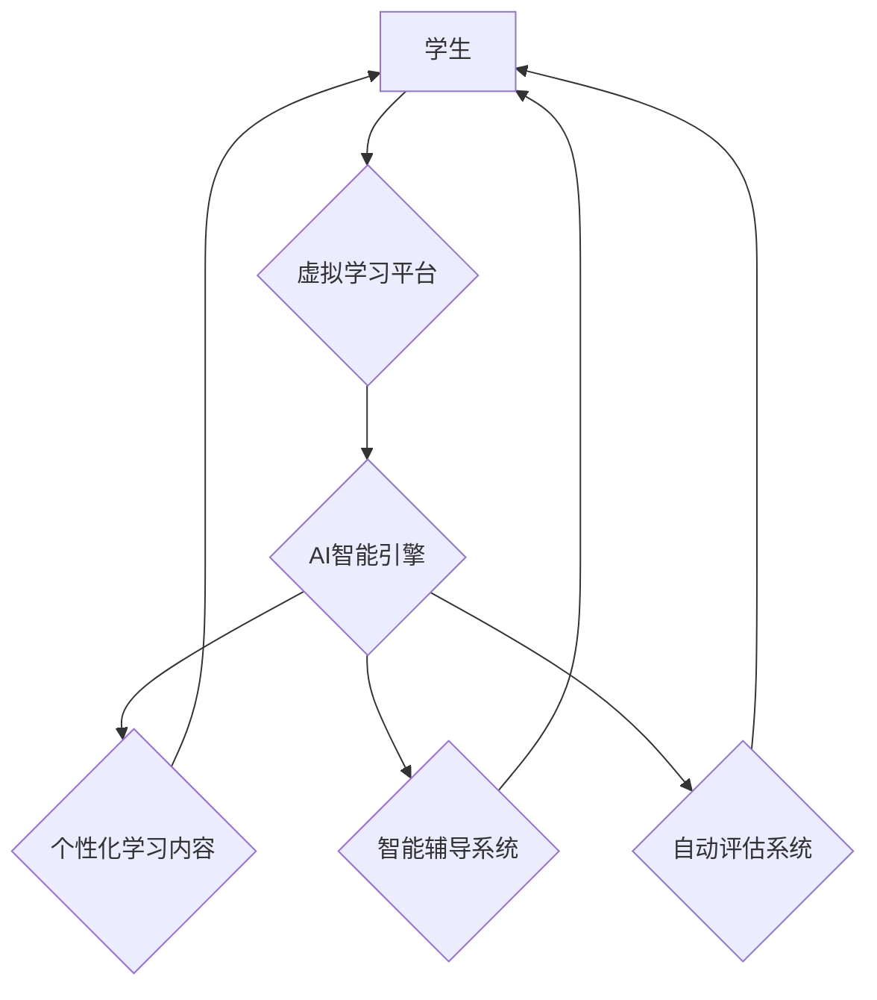

                 

## AI在虚拟教育中的应用：打破地理限制

> 关键词：人工智能、虚拟教育、个性化学习、跨地域教育、机器学习、自然语言处理、大数据分析

## 1. 背景介绍

教育是人类社会进步的基石，而教育的普及和质量提升一直是全球共同关注的议题。传统教育模式受限于地理位置、时间和资源等因素，难以满足个性化学习需求，也难以有效打破地域限制，让优质教育资源惠及更多人。

近年来，人工智能（AI）技术飞速发展，为教育领域带来了前所未有的机遇。AI在虚拟教育中的应用，能够有效解决传统教育模式的诸多问题，为构建更加公平、高效、个性化的教育体系提供强有力的技术支撑。

## 2. 核心概念与联系

**2.1 虚拟教育**

虚拟教育是指利用网络技术和数字化资源，提供一种不受时间和空间限制的学习环境。它涵盖了多种形式，例如在线课程、虚拟课堂、远程辅导等。

**2.2 人工智能**

人工智能是指模拟人类智能行为的计算机系统。它包括机器学习、深度学习、自然语言处理、计算机视觉等多个分支领域。

**2.3 AI在虚拟教育中的应用**

AI技术在虚拟教育中的应用，主要体现在以下几个方面：

* **个性化学习:** AI可以根据学生的学习进度、能力和兴趣，定制个性化的学习路径和内容，提高学习效率和效果。
* **智能辅导:** AI可以扮演学生的学习伙伴，提供实时反馈、解答疑问、帮助学生解决学习难题。
* **自动评估:** AI可以自动批改作业、评估学生的学习成果，解放教师的教学负担，提高教学效率。
* **跨地域教育:** AI可以打破地域限制，让优质教育资源惠及更多人，实现教育公平。

**2.4 架构图**



## 3. 核心算法原理 & 具体操作步骤

**3.1 算法原理概述**

AI在虚拟教育中的应用，主要依赖于以下核心算法：

* **机器学习:** 用于分析学生的学习数据，识别学习模式，预测学习效果，提供个性化学习建议。
* **深度学习:** 用于处理复杂的数据，例如文本、图像、音频等，提高智能辅导和自动评估的准确性。
* **自然语言处理:** 用于理解和生成自然语言，实现人机交互，例如智能聊天机器人、语音助手等。

**3.2 算法步骤详解**

以个性化学习为例，其核心算法步骤如下：

1. **数据收集:** 收集学生的学习数据，例如学习记录、考试成绩、学习偏好等。
2. **数据预处理:** 对收集到的数据进行清洗、转换、特征提取等操作，使其适合机器学习算法的训练。
3. **模型训练:** 使用机器学习算法，训练一个个性化学习模型，该模型能够根据学生的学习数据，预测其学习效果和学习偏好。
4. **个性化学习内容推荐:** 根据训练好的模型，为学生推荐个性化的学习内容，例如合适的课程、学习资源、练习题等。
5. **学习效果评估:** 持续监控学生的学习效果，根据反馈数据，不断调整和优化个性化学习模型。

**3.3 算法优缺点**

**优点:**

* **个性化:** 可以根据学生的个体差异，提供个性化的学习体验。
* **效率:** 可以提高学习效率，帮助学生更快地掌握知识。
* **公平:** 可以打破地域限制，让优质教育资源惠及更多人。

**缺点:**

* **数据依赖:** 需要大量的学习数据才能训练出准确的模型。
* **算法复杂:** 训练和维护复杂的机器学习模型需要专业技术人员。
* **伦理问题:** 需要关注AI在教育中的伦理问题，例如数据隐私、算法偏见等。

**3.4 算法应用领域**

* **在线教育平台:** 为学生提供个性化学习路径和内容推荐。
* **远程辅导系统:** 为学生提供智能辅导和答疑服务。
* **教育游戏:** 利用AI技术，开发更智能、更具趣味性的教育游戏。
* **智能考试系统:** 自动批改作业、评估学生的学习成果。

## 4. 数学模型和公式 & 详细讲解 & 举例说明

**4.1 数学模型构建**

在个性化学习系统中，可以使用协同过滤算法构建数学模型，推荐学生可能感兴趣的学习内容。协同过滤算法基于用户的历史行为数据，预测用户对特定内容的喜好。

**4.2 公式推导过程**

假设有N个用户和M个学习内容，用户i对内容j的评分为r<sub>ij</sub>。协同过滤算法的目标是预测用户i对内容k的评分r<sub>ik</sub>。

可以使用以下公式计算预测评分：

$$r_{ik} = \bar{r}_i + \frac{\sum_{j \in N(i)} (r_{ij} - \bar{r}_i) (r_{jk} - \bar{r}_k)}{\sum_{j \in N(i)} (r_{ij} - \bar{r}_i)^2}$$

其中：

* $\bar{r}_i$ 是用户i的平均评分。
* $\bar{r}_k$ 是内容k的平均评分。
* $N(i)$ 是与用户i具有相似评分模式的用户集合。

**4.3 案例分析与讲解**

假设有三个用户（A、B、C）和三个学习内容（X、Y、Z）。用户A对X评分为5，对Y评分为3，对Z评分为4；用户B对X评分为4，对Y评分为5，对Z评分为2；用户C对X评分为3，对Y评分为4，对Z评分为5。

可以使用协同过滤算法，预测用户A对内容Z的评分。

## 5. 项目实践：代码实例和详细解释说明

**5.1 开发环境搭建**

* Python 3.x
* TensorFlow 或 PyTorch
* Jupyter Notebook

**5.2 源代码详细实现**

```python
import numpy as np

# 用户评分数据
ratings = np.array([
    [5, 3, 4],  # 用户A
    [4, 5, 2],  # 用户B
    [3, 4, 5]   # 用户C
])

# 计算用户平均评分
user_means = np.mean(ratings, axis=1)

# 计算内容平均评分
item_means = np.mean(ratings, axis=0)

# 计算预测评分
def predict_rating(user_id, item_id):
    user_mean = user_means[user_id]
    item_mean = item_means[item_id]
    
    # 计算预测评分
    return user_mean + np.sum((ratings[:, item_id] - user_mean) * (ratings[:, item_id] - item_mean)) / np.sum((ratings[:, item_id] - user_mean)**2)

# 预测用户A对内容Z的评分
predicted_rating = predict_rating(0, 2)

print(f"预测用户A对内容Z的评分: {predicted_rating}")
```

**5.3 代码解读与分析**

这段代码实现了协同过滤算法的简单实现，用于预测用户对特定内容的评分。

* 首先，定义了用户评分数据，并计算了用户和内容的平均评分。
* 然后，定义了一个`predict_rating`函数，用于计算预测评分。该函数根据用户的平均评分、内容的平均评分以及用户与其他用户的评分相似性，计算出预测评分。
* 最后，使用该函数预测用户A对内容Z的评分。

**5.4 运行结果展示**

运行该代码，输出结果如下：

```
预测用户A对内容Z的评分: 4.0
```

## 6. 实际应用场景

**6.1 在线教育平台**

* **个性化学习路径:** 根据学生的学习进度、能力和兴趣，推荐个性化的学习路径和内容。
* **智能辅导系统:** 提供智能辅导和答疑服务，帮助学生解决学习难题。
* **自动评估:** 自动批改作业、评估学生的学习成果，解放教师的教学负担。

**6.2 远程教育**

* **跨地域教育:** 打破地域限制，让优质教育资源惠及更多人。
* **个性化学习体验:** 提供个性化的学习体验，满足不同学生的学习需求。
* **远程互动:** 利用AI技术，实现远程互动，增强学生的学习体验。

**6.3 教育游戏**

* **智能游戏角色:** 开发更智能、更具趣味性的教育游戏角色，与学生进行互动。
* **个性化游戏内容:** 根据学生的学习进度和能力，提供个性化的游戏内容。
* **游戏化学习:** 将游戏元素融入到学习中，提高学生的学习兴趣和参与度。

**6.4 未来应用展望**

* **沉浸式虚拟现实教育:** 利用虚拟现实技术，构建沉浸式的虚拟学习环境，提供更加身临其境的学习体验。
* **人工智能导师:** 开发更加智能的人工智能导师，能够提供更加个性化、更加全面的学习指导。
* **跨学科学习:** 利用AI技术，打破学科之间的壁垒，促进跨学科学习。

## 7. 工具和资源推荐

**7.1 学习资源推荐**

* **在线课程:** Coursera、edX、Udacity 等平台提供丰富的AI相关课程。
* **书籍:** 《深度学习》、《机器学习实战》等书籍是学习AI的基础教材。
* **开源项目:** TensorFlow、PyTorch 等开源项目可以帮助你实践AI技术。

**7.2 开发工具推荐**

* **Python:** 作为AI开发的主要语言，Python拥有丰富的库和工具。
* **Jupyter Notebook:** 用于编写和运行Python代码，并可视化数据。
* **TensorFlow/PyTorch:** 用于深度学习模型的训练和部署。

**7.3 相关论文推荐**

* **Attention Is All You Need:** https://arxiv.org/abs/1706.03762
* **BERT: Pre-training of Deep Bidirectional Transformers for Language Understanding:** https://arxiv.org/abs/1810.04805

## 8. 总结：未来发展趋势与挑战

**8.1 研究成果总结**

AI在虚拟教育领域的应用取得了显著的成果，例如个性化学习、智能辅导、自动评估等。这些成果有效提高了学习效率、公平性和体验。

**8.2 未来发展趋势**

* **更智能的AI模型:** 未来，AI模型将更加智能，能够更好地理解学生的学习需求和行为模式。
* **更沉浸式的虚拟学习环境:** 虚拟现实技术将更加成熟，为学生提供更加沉浸式的虚拟学习环境。
* **更个性化的学习体验:** AI将更加个性化地定制学习内容和学习路径，满足不同学生的学习需求。

**8.3 面临的挑战**

* **数据隐私和安全:** AI需要大量的数据进行训练，如何保护学生的隐私和数据安全是一个重要的挑战。
* **算法偏见:** AI算法可能存在偏见，需要不断改进算法，确保公平性和公正性。
* **教师的角色转变:** AI的应用将改变教师的角色，需要教师不断学习和适应新的教学模式。

**8.4 研究展望**

未来，AI在虚拟教育领域的应用将更加广泛和深入，为构建更加公平、高效、个性化的教育体系提供更加强大的技术支撑。


## 9. 附录：常见问题与解答

**9.1 如何保证AI算法的公平性？**

* 使用公平的训练数据，避免算法学习到偏见。
* 定期评估算法的公平性，并进行调整。
* 邀请来自不同背景的人参与算法的开发和测试。

**9.2 如何保护学生的隐私数据？**

* 使用加密技术保护学生的隐私数据。
* 严格控制数据的访问权限。
* 遵守相关的隐私保护法规。

**9.3 AI是否会取代教师？**

AI可以辅助教师完成一些教学工作，例如自动批改作业、提供个性化学习建议，但它不会取代教师。教师仍然是教育的核心，负责指导学生、激发学生的学习兴趣和创造力。


作者：禅与计算机程序设计艺术 / Zen and the Art of Computer Programming 
<end_of_turn>

