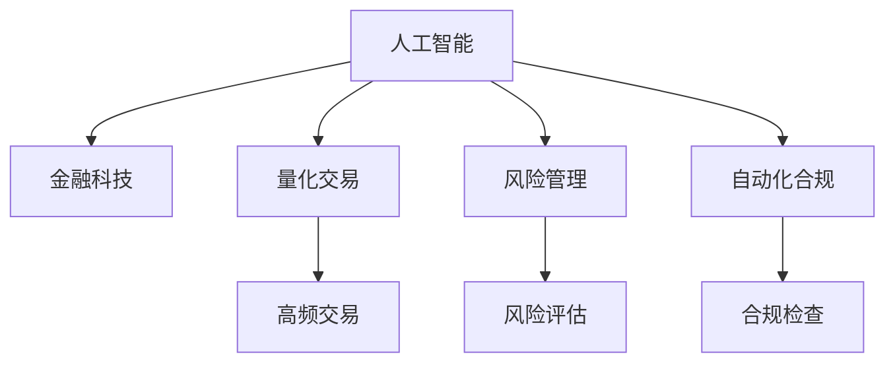

                 

# AI驱动的创新：人类计算在金融行业的应用趋势

> 关键词：人工智能(AI), 金融科技(Fintech), 人类计算(Human Computing), 量化交易, 风险管理, 自动化合规

## 1. 背景介绍

### 1.1 问题由来
在金融行业中，传统的数据处理和分析方式逐渐难以应对市场波动、风险管理、客户需求等复杂而动态的变化。金融从业者需要高效、精确地处理大量数据，进行投资决策、风险评估、合规检查等，这对技术和算法提出了很高的要求。

当前，人工智能(AI)技术在金融领域的应用已经逐渐深入，从智能投顾到量化交易，再到风险评估，AI技术都在重塑金融行业的运行方式。人类计算(Human Computing)，即利用人类智慧和能力，结合AI技术，成为金融行业创新的新方向。

### 1.2 问题核心关键点
人类计算的核心在于将人类智慧和能力与AI技术的优势结合起来，高效、准确地处理金融数据，为决策提供支持。这一过程中，涉及以下几个核心点：

- **数据处理**：收集、存储和处理海量金融数据，为AI模型提供高质量的输入。
- **算法优化**：选择合适的AI算法，优化模型参数，提高预测和决策的准确性。
- **人机协作**：结合人类专家知识，利用AI辅助决策，提升决策效果。
- **风险控制**：通过AI技术识别和评估风险，制定有效的风险管理策略。
- **合规管理**：利用AI进行自动化合规检查，确保金融活动符合法规要求。

### 1.3 问题研究意义
金融行业的复杂性和动态性决定了AI和人类计算的重要性。通过AI技术，金融行业可以实现自动化、精确化的数据处理和决策支持；通过人类智慧，确保决策的合理性和创造性。

人类计算技术不仅能提升金融行业的效率和准确性，还能为新兴金融服务和产品提供创新基础。因此，探讨AI驱动的人类计算在金融行业的应用趋势，具有重要意义：

- **提升效率**：通过高效的数据处理和智能决策，大幅提升金融服务的响应速度和操作效率。
- **降低成本**：自动化和智能化的操作，减少人力成本，提升资源利用率。
- **增强竞争力**：利用先进技术手段，提升金融机构的市场竞争力和客户满意度。
- **促进创新**：结合人机协作，开发新的金融产品和服务，开拓市场空间。
- **保障合规**：自动化合规检查，降低合规风险，确保金融活动的合法合规。

## 2. 核心概念与联系

### 2.1 核心概念概述

为更好地理解人类计算在金融行业的应用，本节将介绍几个密切相关的核心概念：

- **人工智能(AI)**：利用算法和模型，模拟和扩展人类智能，实现自动化的决策和任务执行。
- **金融科技(Fintech)**：应用AI、大数据、区块链等技术，提升金融服务的效率和安全性。
- **量化交易**：利用数学模型和算法，通过大量高频交易获取收益，是AI在金融领域的重要应用。
- **风险管理**：通过AI技术评估和控制金融风险，包括信用风险、市场风险等。
- **自动化合规**：利用AI技术自动化合规检查，确保金融活动的合法合规。
- **数据科学**：涉及数据收集、存储、处理、分析等多个环节，是AI应用的基础。

这些核心概念之间的逻辑关系可以通过以下Mermaid流程图来展示：



这个流程图展示了几类核心概念及其之间的关系：

1. AI技术在金融科技中的应用，涵盖了量化交易、风险管理、自动化合规等多个方向。
2. 量化交易利用AI进行高频交易和策略优化。
3. 风险管理通过AI技术进行风险评估和控制。
4. 自动化合规借助AI实现自动化合规检查。
5. AI在金融科技中的应用，离不开数据科学的支持。

这些概念共同构成了AI驱动的人类计算在金融行业的整体框架，使其能够高效、精确地处理金融数据，支持各种金融活动。

## 3. 核心算法原理 & 具体操作步骤

### 3.1 算法原理概述

人类计算的核心算法原理在于利用AI技术处理和分析金融数据，结合人类智慧进行决策支持。其核心思想是：

1. **数据预处理**：收集和清洗金融数据，处理缺失值、异常值，提取特征。
2. **模型选择和训练**：选择合适的AI模型，利用历史数据进行训练，优化模型参数。
3. **人机协作**：将AI模型的输出结果结合人类专家知识，进行决策和验证。
4. **风险评估和控制**：利用AI技术进行风险评估和模拟，制定风险管理策略。
5. **自动化合规**：通过AI技术进行自动化合规检查，确保符合法规要求。

### 3.2 算法步骤详解

人类计算的应用流程通常包括以下几个关键步骤：

**Step 1: 数据收集与预处理**
- 收集历史交易数据、市场数据、新闻信息等，并进行清洗和特征提取。
- 处理缺失值、异常值，进行数据归一化、标准化等处理。

**Step 2: 模型选择与训练**
- 选择合适的AI模型，如线性回归、决策树、神经网络等。
- 利用历史数据进行模型训练，调整模型参数，提升模型准确性。

**Step 3: 人机协作与决策支持**
- 将AI模型的输出结果结合人类专家知识，进行综合分析和决策。
- 建立人机协作机制，如专家系统、智能顾问等，提高决策效率和准确性。

**Step 4: 风险评估与控制**
- 利用AI技术进行风险评估，识别高风险交易和市场。
- 制定风险控制策略，如止损点设置、仓位控制等，降低风险。

**Step 5: 自动化合规与监控**
- 利用AI技术进行自动化合规检查，确保符合法规要求。
- 建立监控机制，实时跟踪金融活动，及时发现违规行为。

### 3.3 算法优缺点

人类计算具有以下优点：
1. **高效性**：通过AI技术，可以大幅提升数据处理和决策的速度和准确性。
2. **准确性**：结合人类专家知识，提高决策的合理性和创造性。
3. **自动化**：自动化合规检查和风险评估，减少人工干预。
4. **灵活性**：可以灵活调整模型和策略，适应市场变化。

同时，该方法也存在一定的局限性：
1. **数据依赖**：高质量数据的获取和处理是关键，数据质量直接影响模型性能。
2. **模型复杂性**：选择合适的模型和参数调整需要一定的技术和经验。
3. **解释性不足**：AI模型的输出结果可能缺乏可解释性，难以理解和验证。
4. **道德和法律风险**：自动化的合规检查和决策可能带来新的法律和道德风险。

尽管存在这些局限性，但就目前而言，人类计算在金融行业中的应用前景广阔，能够显著提升金融服务的效率和安全性。

### 3.4 算法应用领域

人类计算技术在金融行业的应用领域非常广泛，涵盖了以下几个主要方向：

- **投资决策**：通过量化交易和智能投顾，自动化决策，提升投资效果。
- **风险管理**：利用AI进行风险评估和控制，降低风险。
- **合规检查**：通过自动化合规检查，确保金融活动符合法规要求。
- **客户服务**：利用智能客服和智能推荐系统，提升客户体验和满意度。
- **市场分析**：通过AI技术进行市场分析，提供投资建议和市场洞察。

这些应用领域展示了人类计算在金融行业的多样性和深度，为金融服务的创新提供了新的可能性。

## 4. 数学模型和公式 & 详细讲解 & 举例说明

### 4.1 数学模型构建

本节将使用数学语言对人类计算在金融行业的应用进行更加严格的刻画。

记金融市场数据为 $\mathcal{D} = \{(x_i, y_i)\}_{i=1}^N$，其中 $x_i$ 为市场特征， $y_i$ 为市场价格。目标是对市场进行预测，即找到最优的函数 $f$，使得预测值 $\hat{y}$ 与真实值 $y$ 的误差最小。常用的预测模型包括线性回归、神经网络等。

定义预测模型的损失函数为 $\ell(y, \hat{y})$，则在数据集 $\mathcal{D}$ 上的经验风险为：

$$
\mathcal{L}(f) = \frac{1}{N}\sum_{i=1}^N \ell(y_i, f(x_i))
$$

目标是最小化经验风险，即找到最优模型 $f$：

$$
f^* = \mathop{\arg\min}_{f} \mathcal{L}(f)
$$

在实践中，我们通常使用梯度下降等优化算法来近似求解上述最优化问题。设 $\eta$ 为学习率，则参数的更新公式为：

$$
\theta \leftarrow \theta - \eta \nabla_{\theta}\mathcal{L}(f)
$$

其中 $\nabla_{\theta}\mathcal{L}(f)$ 为损失函数对模型参数的梯度，可通过反向传播算法高效计算。

### 4.2 公式推导过程

以下我们以线性回归模型为例，推导预测市场价格的经验风险公式及其梯度计算公式。

假设市场数据 $x_i$ 可以表示为一个 $d$ 维向量，即 $x_i \in \mathbb{R}^d$。市场价格 $y_i$ 可以表示为一个标量，即 $y_i \in \mathbb{R}$。设预测模型 $f(x_i) = \theta^T \phi(x_i)$，其中 $\theta \in \mathbb{R}^d$ 为模型参数，$\phi(x_i)$ 为特征映射函数，将原始特征映射到高维空间。

线性回归模型的损失函数为均方误差，即：

$$
\ell(y, \hat{y}) = \frac{1}{2}(y - \hat{y})^2
$$

其中 $\hat{y} = f(x_i) = \theta^T \phi(x_i)$。则经验风险公式为：

$$
\mathcal{L}(\theta) = \frac{1}{N}\sum_{i=1}^N \frac{1}{2}(y_i - \theta^T \phi(x_i))^2
$$

目标是最小化经验风险，即找到最优参数 $\theta$：

$$
\theta^* = \mathop{\arg\min}_{\theta} \mathcal{L}(\theta)
$$

根据链式法则，损失函数对参数 $\theta_k$ 的梯度为：

$$
\frac{\partial \mathcal{L}(\theta)}{\partial \theta_k} = -\frac{1}{N}\sum_{i=1}^N (y_i - \hat{y}_i) \phi_k(x_i)
$$

其中 $\phi_k(x_i)$ 表示特征映射函数对 $x_i$ 的第 $k$ 个特征的导数。

在得到损失函数的梯度后，即可带入参数更新公式，完成模型的迭代优化。重复上述过程直至收敛，最终得到适应金融市场的最优模型参数 $\theta^*$。

### 4.3 案例分析与讲解

以股票市场的量化交易为例，分析线性回归模型在股票价格预测中的应用。

假设市场数据 $x_i$ 包括股票的市盈率、市净率、行业指数等特征，市场价格 $y_i$ 为股票的每日收盘价。通过线性回归模型对历史数据进行拟合，得到市场价格预测公式：

$$
\hat{y} = \theta^T \phi(x_i) = \sum_{k=1}^d \theta_k \phi_k(x_i)
$$

其中 $\phi_k(x_i)$ 表示特征映射函数对 $x_i$ 的第 $k$ 个特征的映射。

将预测公式应用于新数据，即可得到市场价格的预测值 $\hat{y}$。在实际应用中，可以通过滚动窗口等方法，进行短期和长期的股票价格预测。

线性回归模型的优点在于简单高效，适用于处理线性关系的数据。但在线性关系复杂的非线性数据上，其表现可能不佳。因此，在金融行业，更多的使用神经网络等复杂模型进行预测。

## 5. 项目实践：代码实例和详细解释说明

### 5.1 开发环境搭建

在进行量化交易实践前，我们需要准备好开发环境。以下是使用Python进行Pandas和Scikit-learn开发的环境配置流程：

1. 安装Anaconda：从官网下载并安装Anaconda，用于创建独立的Python环境。

2. 创建并激活虚拟环境：
```bash
conda create -n quant_trading python=3.8 
conda activate quant_trading
```

3. 安装必要的库：
```bash
conda install pandas scikit-learn scipy statsmodels joblib jupyter notebook ipython
```

4. 安装TensorFlow或PyTorch（可选）：
```bash
conda install tensorflow==2.7
# 或
conda install torch torchvision torchaudio cudatoolkit=11.1 -c pytorch -c conda-forge
```

5. 安装必要的依赖：
```bash
pip install TA-Lib yfinance ibapi
```

完成上述步骤后，即可在`quant_trading`环境中开始量化交易实践。

### 5.2 源代码详细实现

这里以一个简单的股票价格预测模型为例，展示如何使用Python和Scikit-learn进行量化交易的实现。

首先，导入必要的库：

```python
import pandas as pd
import numpy as np
import matplotlib.pyplot as plt
import seaborn as sns
from sklearn.linear_model import LinearRegression
from sklearn.metrics import mean_squared_error
import yfinance as yf
import TA指标
```

然后，定义数据处理和模型训练函数：

```python
def load_data(ticker, start_date, end_date):
    data = yf.Ticker(ticker)
    df = data.history(start=start_date, end=end_date)
    df['close'] = df['Close'] / df['Close'].iloc[0] - 1  # 标准化处理
    return df

def split_data(df, ratio=0.7):
    train = df.sample(frac=ratio)
    test = df.drop(train.index)
    return train, test

def train_model(df_train, features):
    X = df_train[features].values
    y = df_train['price'].values
    model = LinearRegression()
    model.fit(X, y)
    return model

def evaluate_model(model, df_test):
    X_test = df_test[features].values
    y_test = df_test['price'].values
    y_pred = model.predict(X_test)
    mse = mean_squared_error(y_test, y_pred)
    return mse

def plot_results(df, y_pred):
    plt.figure(figsize=(10, 6))
    sns.lineplot(data=df, x='date', y='price')
    sns.lineplot(data=df, x='date', y=y_pred, linestyle='--', color='red')
    plt.legend(['Actual', 'Predicted'])
    plt.show()
```

接下来，进行数据加载和模型训练：

```python
ticker = 'AAPL'
start_date = '2020-01-01'
end_date = '2022-12-31'

df = load_data(ticker, start_date, end_date)
features = ['open', 'high', 'low', 'volume']
train, test = split_data(df, ratio=0.7)

model = train_model(train, features)
mse = evaluate_model(model, test)

print(f'Mean Squared Error: {mse:.4f}')
```

最后，展示预测结果：

```python
plot_results(df, y_pred)
```

以上就是使用Python和Scikit-learn对股票价格进行预测的完整代码实现。可以看到，通过简单的线性回归模型，我们便能够在量化交易中实现基本的市场预测。

### 5.3 代码解读与分析

让我们再详细解读一下关键代码的实现细节：

**load_data函数**：
- 使用yfinance库获取指定股票的历史数据。
- 将收盘价进行标准化处理，便于后续分析。

**split_data函数**：
- 将数据集分为训练集和测试集，设定划分比例为70:30。

**train_model函数**：
- 使用训练集数据进行模型训练，返回训练好的模型。

**evaluate_model函数**：
- 使用测试集数据进行模型评估，返回均方误差。

**plot_results函数**：
- 使用matplotlib和seaborn库绘制实际价格与预测价格的对比图，直观展示模型效果。

代码展示了量化交易中最基础的市场预测模型，从数据加载、模型训练、结果评估到可视化展示，每个步骤都详细解释，帮助理解量化交易的核心流程。

当然，实际的量化交易系统还需要考虑更多因素，如数据清洗、特征工程、模型调优、回测等。但核心的量化交易模型构建与本文类似。

## 6. 实际应用场景

### 6.1 智能投顾

智能投顾是量化交易的重要应用方向，利用AI技术为用户提供智能化的投资建议。智能投顾系统通常由三个部分组成：数据收集、模型训练和投资建议。

**数据收集**：收集市场数据、用户行为数据、经济指标等，为模型提供输入。

**模型训练**：通过历史数据训练AI模型，预测市场趋势和用户偏好。

**投资建议**：结合市场数据和用户偏好，生成个性化的投资策略和建议。

例如，可以使用线性回归模型预测市场趋势，使用决策树模型分析用户投资偏好，通过集成学习生成综合的智能投顾建议。

### 6.2 风险管理

风险管理是金融行业的重要任务，通过AI技术进行风险评估和控制，可以显著提升风险管理效果。

**风险评估**：利用机器学习模型评估信用风险、市场风险等，识别高风险交易和市场。

**风险控制**：根据风险评估结果，制定风险控制策略，如仓位控制、止损点设置等。

例如，可以使用随机森林模型评估信用风险，使用支持向量机(SVM)模型评估市场风险，通过集成学习生成综合的风险评估结果，制定相应的风险控制策略。

### 6.3 自动化合规

金融行业需要定期进行合规检查，确保金融活动符合法规要求。自动化合规技术可以大幅提高合规检查的效率和准确性。

**自动化合规检查**：利用AI技术进行自动化合规检查，识别违规行为和潜在的合规风险。

**异常告警**：根据合规检查结果，及时发现并处理异常情况，避免违规行为。

例如，可以使用规则引擎结合AI模型进行自动化合规检查，使用自然语言处理(NLP)技术处理合规文档，识别违规行为和潜在的合规风险。

### 6.4 未来应用展望

随着AI技术的不断发展，人类计算在金融行业的应用前景广阔，未来可能包括以下几个方向：

1. **多资产管理**：结合AI和人类智慧，实现多资产组合管理和投资策略优化，提升资产配置效果。
2. **高频交易**：利用AI技术进行高频交易策略优化，提升交易效率和收益。
3. **智能风控**：通过AI技术进行智能风险控制，实现更精准的风险评估和控制。
4. **智能审计**：利用AI技术进行自动化审计，提升审计效率和准确性。
5. **金融创新**：利用AI技术开发新的金融产品和服务，如智能投顾、智能合约等。

这些应用方向展示了人类计算在金融行业的广阔前景，为金融服务的创新提供了新的可能性。

## 7. 工具和资源推荐

### 7.1 学习资源推荐

为了帮助开发者系统掌握人类计算在金融行业的应用，这里推荐一些优质的学习资源：

1. **《Python for Finance》**：介绍Python在金融行业的应用，包括量化交易、风险管理等。
2. **《Machine Learning Yearning》**：深入讲解机器学习在金融行业的应用，包括数据预处理、模型选择、结果评估等。
3. **Coursera《金融科技》课程**：涵盖金融科技的多个方面，包括区块链、智能投顾、金融创新等。
4. **Kaggle量化交易竞赛**：通过实际数据和竞赛，学习量化交易的实际应用。
5. **Alfredo Canziani《金融计算》**：详细介绍金融计算的原理和方法，包括量化交易、风险管理等。

通过对这些资源的学习实践，相信你一定能够快速掌握人类计算在金融行业的应用技术，并用于解决实际的金融问题。

### 7.2 开发工具推荐

高效的开发离不开优秀的工具支持。以下是几款用于金融科技开发常用的工具：

1. **Python**：作为金融科技开发的主流语言，Python提供了丰富的库和框架，如Pandas、Scikit-learn、TensorFlow等。
2. **Jupyter Notebook**：提供交互式编程环境，方便开发和调试。
3. **TensorBoard**：用于监控和可视化模型的训练过程，帮助优化模型。
4. **Amazon SageMaker**：提供云端机器学习平台，方便模型训练和部署。
5. **Google Cloud AI Platform**：提供云端的机器学习平台，支持大规模数据处理和模型训练。
6. **IB API**：提供实时的股票数据接口，方便进行高频交易和市场分析。

合理利用这些工具，可以显著提升金融科技开发的效率和效果，快速迭代和优化金融模型。

### 7.3 相关论文推荐

人类计算技术的发展得益于学界的持续研究。以下是几篇奠基性的相关论文，推荐阅读：

1. **《Quantitative Financial Economics: A Primer》**：介绍量化金融的基本概念和方法，包括量化交易、风险管理等。
2. **《Machine Learning in Finance》**：综述机器学习在金融领域的应用，包括量化交易、风险管理、自动化合规等。
3. **《A Survey of Machine Learning Techniques for Financial Forecasting》**：综述机器学习在金融预测中的应用，包括线性回归、神经网络等。
4. **《Financial Time Series Forecasting: Theory and Practice》**：详细介绍金融时间序列预测的方法和实践。
5. **《The Future of Financial Technology》**：展望金融科技的未来发展，包括自动化合规、智能投顾等方向。

这些论文代表了大数据、机器学习在金融行业的发展脉络。通过学习这些前沿成果，可以帮助研究者把握学科前进方向，激发更多的创新灵感。

## 8. 总结：未来发展趋势与挑战

### 8.1 总结

本文对人类计算在金融行业的应用进行了全面系统的介绍。首先阐述了人类计算的核心思想和应用场景，明确了其在金融行业中的重要性和潜力。其次，从原理到实践，详细讲解了量化交易、风险管理、自动化合规等核心技术，给出了实际的量化交易代码实现。同时，本文还广泛探讨了人类计算在金融行业的多样化应用前景，展示了其广阔的应用空间。

通过本文的系统梳理，可以看到，人类计算技术在金融行业中的作用日趋重要，通过AI技术处理和分析金融数据，结合人类智慧进行决策支持，大大提升了金融服务的效率和安全性。未来，伴随AI技术的持续演进，人类计算技术必将在金融行业扮演更加重要的角色。

### 8.2 未来发展趋势

展望未来，人类计算在金融行业的发展趋势如下：

1. **智能化程度提升**：随着AI技术的不断进步，金融模型的智能化程度将进一步提升，能够更加准确地预测市场趋势和用户行为。
2. **自动化和协同化增强**：自动化合规、智能投顾等技术将更加普及，实现人机协同的智能决策。
3. **跨领域融合**：结合大数据、区块链、云计算等技术，实现跨领域的金融创新和服务升级。
4. **伦理和法律监管加强**：随着技术的广泛应用，伦理和法律问题将更加凸显，需要建立完善的监管机制。
5. **用户体验优化**：结合NLP、计算机视觉等技术，提升金融服务的用户体验，增强客户粘性。
6. **技术集成和融合**：未来的金融科技将更多地集成和融合各种技术和工具，形成完整的生态系统。

以上趋势展示了人类计算在金融行业的广阔前景，为金融服务的创新提供了新的可能性。

### 8.3 面临的挑战

尽管人类计算在金融行业的应用前景广阔，但在迈向更加智能化、普适化应用的过程中，仍面临诸多挑战：

1. **数据质量问题**：金融数据的复杂性和不确定性决定了高质量数据获取的难度，数据质量直接影响模型的预测效果。
2. **模型复杂性**：选择合适的模型和参数调整需要一定的技术和经验，模型的复杂性可能导致过拟合或欠拟合。
3. **系统稳定性和鲁棒性**：金融系统的稳定性和鲁棒性要求极高，需要确保模型的可靠性和可解释性。
4. **法律和伦理风险**：自动化的合规检查和决策可能带来新的法律和伦理风险，需要建立完善的监管机制。
5. **技术集成难度**：金融系统涉及多种技术和工具，集成难度较大，需要建立统一的标准和接口。
6. **用户体验设计**：金融服务的用户体验设计需要结合技术和用户需求，确保系统易用性和便捷性。

这些挑战需要多方协同努力，才能进一步推动人类计算技术在金融行业的应用。

### 8.4 研究展望

面对人类计算在金融行业面临的挑战，未来的研究需要在以下几个方面寻求新的突破：

1. **数据治理和质量提升**：建立完善的数据治理机制，提升金融数据的可用性和可靠性。
2. **模型简化和优化**：开发更加简洁和高效的模型，避免过拟合和欠拟合，提高模型预测的准确性。
3. **系统稳定性和鲁棒性增强**：通过技术手段提高系统的稳定性和鲁棒性，确保金融系统的可靠性和安全性。
4. **法律和伦理问题研究**：建立完善的法律和伦理框架，确保技术的合规性和安全性。
5. **技术集成和融合优化**：建立统一的标准和接口，实现多种技术和工具的无缝集成。
6. **用户体验设计优化**：结合技术和用户需求，优化用户体验，增强客户粘性。

这些研究方向的探索，必将引领人类计算技术在金融行业的应用走向新的高度，为金融服务的创新和升级提供新的动力。面向未来，人类计算技术还需要与其他人工智能技术进行更深入的融合，如知识表示、因果推理、强化学习等，多路径协同发力，共同推动金融行业的数字化转型。

## 9. 附录：常见问题与解答

**Q1：人类计算在金融行业是否仅限于量化交易和风险管理？**

A: 虽然量化交易和风险管理是人类计算在金融行业的重要应用方向，但人类计算技术的应用范围远不止于此。除了量化交易和风险管理，还可以应用于智能投顾、自动化合规、智能审计、金融创新等多个方向。未来，随着技术的不断进步，人类计算技术将进一步拓展其应用边界，为金融服务的创新提供更多可能性。

**Q2：量化交易中的风险控制主要有哪些方法？**

A: 量化交易中的风险控制主要包括以下几种方法：

1. **止损点设置**：根据模型预测和风险评估结果，设置合理的止损点，避免过度亏损。
2. **仓位控制**：根据模型预测和风险评估结果，控制交易仓位，避免过度集中。
3. **多样化策略**：通过多策略组合，分散风险，提高整体收益的稳定性。
4. **回测和验证**：通过历史数据回测和验证模型效果，确保模型的稳定性和可靠性。
5. **模型集成和优化**：结合多种模型进行集成学习，提高模型的鲁棒性和准确性。

这些风险控制方法结合量化交易的自动化和智能化，能够有效降低交易风险，提高收益的稳定性。

**Q3：如何评估量化交易模型的性能？**

A: 量化交易模型的性能评估主要包括以下几个方面：

1. **历史回测**：通过历史数据回测模型效果，评估模型的稳定性和可靠性。
2. **实盘测试**：通过实盘交易验证模型效果，评估模型的实际效果。
3. **风险收益比**：通过风险收益比评估模型的投资效果，确保收益与风险匹配。
4. **模型复杂度**：通过模型复杂度评估模型的优化程度，避免过拟合和欠拟合。
5. **信号质量**：通过信号质量评估模型的交易信号质量，确保信号的有效性和可靠性。

综合以上几个方面的评估，可以全面了解量化交易模型的性能，优化模型效果。

**Q4：自动化合规检查中如何避免误判和漏判？**

A: 自动化合规检查中避免误判和漏判的方法包括：

1. **规则引擎结合AI**：通过规则引擎对合规文档进行初步筛选，再通过AI模型进行精细化检测，减少误判和漏判。
2. **多层次检测**：利用多层次的检测机制，对合规文档进行多轮检测，提高检测的准确性。
3. **人工复核**：引入人工复核机制，对AI模型检测结果进行复核，及时发现和纠正误判和漏判。
4. **模型集成和优化**：结合多种模型进行集成学习，提高模型的鲁棒性和准确性。
5. **动态更新模型**：根据法规和政策的变化，动态更新合规检测模型，确保合规检测的及时性和准确性。

这些方法通过多层次、多维度、动态更新的检测机制，可以有效避免误判和漏判，确保合规检查的准确性。

**Q5：人类计算在金融行业的应用中如何平衡效率和合规？**

A: 在金融行业中，平衡效率和合规是关键问题。以下是一些方法：

1. **自动化合规**：利用AI技术进行自动化合规检查，提高合规检查的效率。
2. **实时监控和告警**：建立实时监控和告警机制，及时发现并处理合规问题，避免违规行为。
3. **规则引擎结合AI**：通过规则引擎对合规文档进行初步筛选，再通过AI模型进行精细化检测，提高合规检查的效率和准确性。
4. **人工复核**：引入人工复核机制，对AI模型检测结果进行复核，确保合规检查的准确性。
5. **模型集成和优化**：结合多种模型进行集成学习，提高模型的鲁棒性和准确性。

这些方法通过多层次、多维度、动态更新的检测机制，可以有效平衡效率和合规，确保金融活动的合法合规。

---

作者：禅与计算机程序设计艺术 / Zen and the Art of Computer Programming

