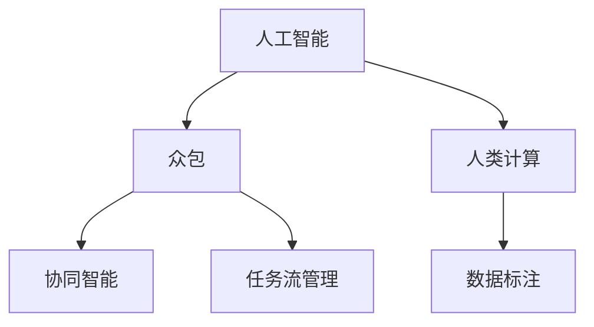

                 

# AI驱动的创新：众包与人类计算

> 关键词：AI, 众包, 人类计算, 协作创新, 协同智能, 人机交互, 用户生成内容, 众包平台, 人工智能, 自动化, 数据标注

## 1. 背景介绍

在信息技术快速发展的今天，人工智能(AI)与人类计算的结合成为了推动创新和社会进步的关键动力。AI的强大计算能力结合人类的创意与智慧，开启了全新的智能创新范式。众包（Crowdsourcing）作为当前最为流行的一种协同创新模式，利用广泛的互联网用户群体来参与数据标注、模型训练、产品设计等任务，极大地加速了AI技术的迭代与应用。

### 1.1 问题由来

众包的概念最初源自网络社交平台，指通过网络聚集大量的志愿者来共同完成某一任务。随着技术的进步和应用场景的扩展，众包已经从最初的简单任务（如文章校对、图片标签）逐步扩展到更加复杂和专业的领域（如医疗诊断、金融分析）。众包的优势在于：
1. 降低成本：以较低的成本快速获取大量高质量数据。
2. 提高效率：并行处理海量任务，加快创新速度。
3. 促进协作：通过全球用户共同参与，共享智慧与经验。

但众包也面临一些挑战：
1. 数据质量：众包结果常常存在一定程度的偏差和噪声。
2. 用户参与：需要激励机制吸引更多用户参与。
3. 平台维护：需投入大量资源管理和维护平台。

### 1.2 问题核心关键点

众包模式的成功关键在于如何高效地组织和管理众包任务，并从中提取高价值的信息与见解。其核心包括以下几个方面：

- **任务设计**：众包任务必须具有明确的目标和规则，确保用户能够快速理解并执行。
- **激励机制**：合理的激励措施可以吸引更多用户参与，并提高任务完成质量。
- **平台建设**：构建可靠、易用的众包平台，提供良好的用户体验。
- **数据清洗与标注**：对众包结果进行后处理，去噪提纯，获得高质量数据。
- **用户参与管理**：通过算法和机制优化用户参与，提升整体任务完成质量。

本文将详细介绍众包机制的核心算法原理，并结合实际案例展示其操作步骤和应用领域。同时，本文也将对众包系统可能面临的优缺点进行深入分析，为进一步的优化和改进提供参考。

## 2. 核心概念与联系

### 2.1 核心概念概述

为了更好地理解AI驱动的众包模式，本节将介绍几个紧密相关的核心概念：

- **人工智能**：通过计算机科学和算法模拟人脑进行信息处理、模式识别、智能决策等任务的智能系统。
- **众包**：通过互联网平台将特定任务分配给大量不具名的网络用户，通过集体的协作来完成。
- **人类计算**：利用普通大众或专业用户来处理大量计算密集型任务，以提高效率和降低成本。
- **协同智能**：通过人机协同的方式，结合人类的智慧和AI的计算能力，实现更高效、更准确的智能创新。
- **数据标注**：利用众包平台对数据进行标签、注释、分类等操作，提供给机器学习算法训练使用。
- **任务流管理**：通过自动化流程和算法，对众包任务进行优化调度和管理。

这些概念之间存在着紧密的联系，共同构成了AI驱动的众包模式的理论基础。

### 2.2 核心概念原理和架构的 Mermaid 流程图



该流程图展示了众包模式在AI驱动下的工作流程。人工智能通过数据标注技术从众包平台获取大量数据，人类计算利用这些数据进行复杂任务处理，协同智能结合人机优势，任务流管理则通过算法自动化流程，优化整个系统的效率和效果。

## 3. 核心算法原理 & 具体操作步骤

### 3.1 算法原理概述

AI驱动的众包模式，本质上是一种基于协同智能的计算范式。其核心思想是：通过网络平台汇聚广大用户的智慧，利用AI技术对任务进行高效处理，最终形成高价值的创新成果。

具体来说，AI驱动的众包系统包括数据获取、任务设计、用户参与、数据清洗、模型训练和应用反馈等环节。系统通过AI技术对众包结果进行分析和优化，提升整体任务完成质量，并逐步迭代改进。

### 3.2 算法步骤详解

AI驱动的众包模式主要包含以下步骤：

**Step 1: 数据获取**

- 通过众包平台收集用户提交的任务结果，数据形式包括文本、图片、语音等。
- 使用爬虫技术自动化地从社交媒体、论坛、博客等公开数据源中获取相关数据。

**Step 2: 任务设计**

- 设计明确、可执行的众包任务，如数据标注、图像分类、文本生成等。
- 任务应具有清晰的定义和规范，确保用户能够快速理解并完成任务。

**Step 3: 用户参与**

- 建立激励机制，如奖励金、徽章、排名等，吸引更多用户参与众包任务。
- 使用推荐算法优化任务分配，将合适的任务推送给最匹配的用户。

**Step 4: 数据清洗与标注**

- 对用户提交的结果进行后处理，去除噪声和错误，确保数据质量。
- 使用机器学习算法对数据进行标注和分类，提升标注效率和准确性。

**Step 5: 模型训练**

- 利用清洗后的数据训练AI模型，如文本分类、图像识别、语音识别等。
- 使用半监督学习、迁移学习等技术提升模型的泛化能力。

**Step 6: 应用反馈**

- 将训练好的AI模型应用于实际应用场景中，提升业务效率和效果。
- 通过用户反馈不断改进众包任务和系统，提升整体质量。

### 3.3 算法优缺点

AI驱动的众包模式具有以下优点：

- **效率高**：通过集体的智慧和AI的计算能力，快速处理大量任务。
- **成本低**：利用众包平台降低人力和物质成本，提高资源利用率。
- **灵活性高**：用户参与灵活，可适应不同类型的任务。

但该模式也存在一些缺点：

- **数据质量**：用户提交的数据可能存在偏差和噪声，影响模型训练效果。
- **用户管理**：需要设计合理的激励和筛选机制，管理用户参与。
- **平台维护**：系统需要投入大量资源进行维护和管理。

### 3.4 算法应用领域

AI驱动的众包模式在多个领域得到了广泛应用，以下是几个典型的应用案例：

**医疗诊断**

- 通过众包平台收集医生和普通用户的医疗意见，用于辅助诊断和治疗方案的制定。
- 利用机器学习技术对众包数据进行分析，生成诊断建议，提升医疗水平。

**金融分析**

- 通过众包平台收集用户对市场事件的看法和预测，用于金融模型的构建。
- 利用AI技术对众包结果进行挖掘，发现市场趋势和投资机会。

**产品设计**

- 通过众包平台收集用户的反馈和意见，用于新产品设计。
- 利用机器学习技术分析用户数据，优化产品功能和设计。

**语言学习**

- 通过众包平台收集用户的学习记录和反馈，用于语言学习模型的优化。
- 利用AI技术对众包结果进行分析和改进，提升语言学习效果。

以上案例展示了AI驱动的众包模式在不同领域的应用潜力，为解决复杂问题提供了新的思路和方法。

## 4. 数学模型和公式 & 详细讲解

### 4.1 数学模型构建

为更好地理解AI驱动的众包模式，我们将其建模为一个组合优化问题。假设系统需要处理的任务数量为 $N$，用户数量为 $M$，每个用户处理任务的效率为 $e_i$，处理任务的质量为 $q_i$，用户参与激励为 $r_i$。设 $\mathcal{T}$ 为所有用户参与的任务集合，$\mathcal{R}$ 为所有用户收到的激励集合，则系统的优化目标为：

$$
\min_{\mathcal{T}, \mathcal{R}} \left( \sum_{i=1}^M r_i \right) \quad \text{subject to} \quad \sum_{i=1}^M e_i \cdot \mathbf{1}_{\mathcal{T}}(i) = N
$$

其中 $\mathbf{1}_{\mathcal{T}}(i)$ 表示用户 $i$ 是否参与了任务 $\mathcal{T}$ 的计算。

### 4.2 公式推导过程

为了简化计算，我们可以使用贪心算法求解上述优化问题。首先，按照用户效率和质量从高到低进行排序，然后依次分配任务给每个用户。具体步骤如下：

1. 对用户按照效率和质量进行排序，得到排序后的用户集合 $U$。
2. 从效率和质量最高的用户开始，依次分配任务，直到所有任务完成。
3. 计算所有用户的总激励，记为 $R$。

对于每个用户 $i$，其得到的激励 $r_i$ 可以表示为：

$$
r_i = \sum_{t \in \mathcal{T}} q_t \cdot \mathbf{1}_{\mathcal{T}}(i)
$$

其中 $q_t$ 表示任务 $t$ 的质量。

### 4.3 案例分析与讲解

考虑一个简单的例子：假设系统需要处理 $10$ 个图片分类任务，用户数量为 $5$。用户的效率和质量如下表所示：

| 用户编号 | 效率 $e_i$ | 质量 $q_i$ | 激励 $r_i$ |
| --- | --- | --- | --- |
| 1 | 0.9 | 0.95 | 10 |
| 2 | 0.8 | 0.90 | 8 |
| 3 | 0.7 | 0.85 | 6 |
| 4 | 0.6 | 0.80 | 4 |
| 5 | 0.5 | 0.75 | 2 |

按照效率和质量排序后，分配任务如下：

1. 用户1：处理3个任务，激励 $10 \times 3 = 30$
2. 用户2：处理2个任务，激励 $8 \times 2 = 16$
3. 用户3：处理2个任务，激励 $6 \times 2 = 12$
4. 用户4：处理1个任务，激励 $4 \times 1 = 4$
5. 用户5：处理1个任务，激励 $2 \times 1 = 2$

总激励 $R = 30 + 16 + 12 + 4 + 2 = 62$。

## 5. 项目实践：代码实例和详细解释说明

### 5.1 开发环境搭建

在进行AI驱动的众包实践前，我们需要准备好开发环境。以下是使用Python进行众包平台开发的流程：

1. 安装Anaconda：从官网下载并安装Anaconda，用于创建独立的Python环境。

2. 创建并激活虚拟环境：
```bash
conda create -n crowdsource-env python=3.8 
conda activate crowdsource-env
```

3. 安装必要的库：
```bash
conda install numpy pandas scikit-learn matplotlib tqdm jupyter notebook ipython
```

4. 搭建数据库：安装MySQL、PostgreSQL等数据库，用于存储众包任务和用户数据。

5. 搭建众包平台：使用Flask等Web框架搭建众包平台，提供用户注册、任务发布、结果提交等功能。

6. 搭建数据标注系统：使用Natural Language Toolkit (NLTK)、spaCy等工具，对用户提交的数据进行标注和清洗。

7. 搭建AI模型训练系统：使用TensorFlow、PyTorch等深度学习框架，对清洗后的数据进行模型训练。

完成上述步骤后，即可在`crowdsource-env`环境中开始众包实践。

### 5.2 源代码详细实现

下面以一个简单的众包平台为例，展示如何利用Python实现数据标注和AI模型训练：

**1. 用户注册与任务发布**

```python
from flask import Flask, request, jsonify

app = Flask(__name__)

# 用户注册
@app.route('/register', methods=['POST'])
def register():
    user_data = request.json
    # 将用户信息存入数据库
    # ...

# 任务发布
@app.route('/submit_task', methods=['POST'])
def submit_task():
    task_data = request.json
    # 将任务信息存入数据库
    # ...
    return jsonify({'status': 'success'})
```

**2. 用户参与与任务分配**

```python
# 获取用户和任务信息
def get_users_and_tasks():
    users = get_users_from_db()
    tasks = get_tasks_from_db()
    return users, tasks

# 分配任务
def assign_tasks(users, tasks):
    # 根据用户效率和质量分配任务
    # ...
    return assigned_tasks
```

**3. 数据标注与清洗**

```python
# 数据标注
def annotate_data(data):
    # 对数据进行标注和清洗
    # ...
    return annotated_data

# 数据清洗
def clean_data(data):
    # 去除噪声和错误数据
    # ...
    return cleaned_data
```

**4. 模型训练与优化**

```python
# 数据预处理
def preprocess_data(data):
    # 对数据进行标准化和归一化
    # ...
    return preprocessed_data

# 模型训练
def train_model(data):
    # 使用深度学习框架训练模型
    # ...
    return trained_model

# 模型优化
def optimize_model(model, data):
    # 使用半监督学习、迁移学习等技术优化模型
    # ...
    return optimized_model
```

### 5.3 代码解读与分析

让我们对关键代码进行解读：

**用户注册与任务发布**

- 通过Flask框架实现Web接口，方便用户注册和发布任务。
- 使用`request.json`获取请求体中的用户和任务信息。
- 将用户信息存入数据库，并发布任务信息到数据库。

**用户参与与任务分配**

- `get_users_and_tasks`函数获取所有用户和任务信息。
- `assign_tasks`函数根据用户效率和质量分配任务。
- 具体分配策略可以使用贪心算法或优化算法实现。

**数据标注与清洗**

- `annotate_data`函数对数据进行标注和清洗，去除噪声和错误数据。
- 可以使用机器学习算法如TextBlob、spaCy等进行标注。
- 标注结果需要经过人工审核，确保质量。

**模型训练与优化**

- `preprocess_data`函数对数据进行预处理，标准化和归一化处理。
- `train_model`函数使用深度学习框架如TensorFlow、PyTorch等进行模型训练。
- `optimize_model`函数使用半监督学习、迁移学习等技术优化模型。

### 5.4 运行结果展示

运行上述代码后，众包平台可以正常接收用户注册、任务发布、数据标注和模型训练的请求，并返回相应的结果。具体展示如下：

**用户注册**

```
POST /register
Content-Type: application/json

{
    "user_name": "Alice",
    "password": "abc123"
}
```

**任务发布**

```
POST /submit_task
Content-Type: application/json

{
    "task_name": "image_classification",
    "data": "https://example.com/image.jpg"
}
```

**用户参与与任务分配**

```
GET /tasks
Content-Type: application/json

{
    "tasks": [
        {
            "id": 1,
            "name": "image_classification",
            "data": "https://example.com/image.jpg"
        },
        {
            "id": 2,
            "name": "text_classification",
            "data": "https://example.com/text.txt"
        }
    ]
}
```

**数据标注与清洗**

```
POST /annotate_data
Content-Type: application/json

{
    "data": "https://example.com/text.txt"
}
```

**模型训练与优化**

```
POST /train_model
Content-Type: application/json

{
    "data": "https://example.com/data.csv"
}
```

以上代码展示了使用Python搭建一个简单的众包平台的过程，包括用户注册、任务发布、数据标注和模型训练等关键功能。

## 6. 实际应用场景

### 6.1 智能医疗

在智能医疗领域，AI驱动的众包模式可以用于辅助医生进行诊断和治疗。通过众包平台，收集医生和普通用户的医疗意见，用于辅助诊断和治疗方案的制定。利用机器学习技术对众包数据进行分析，生成诊断建议，提升医疗水平。

### 6.2 金融分析

在金融分析领域，AI驱动的众包模式可以用于市场预测和风险评估。通过众包平台收集用户对市场事件的看法和预测，用于金融模型的构建。利用AI技术对众包结果进行挖掘，发现市场趋势和投资机会。

### 6.3 产品设计

在产品设计领域，AI驱动的众包模式可以用于用户需求收集和产品测试。通过众包平台收集用户的反馈和意见，用于新产品设计。利用机器学习技术分析用户数据，优化产品功能和设计。

### 6.4 语言学习

在语言学习领域，AI驱动的众包模式可以用于个性化学习方案制定。通过众包平台收集用户的学习记录和反馈，用于语言学习模型的优化。利用AI技术对众包结果进行分析和改进，提升语言学习效果。

## 7. 工具和资源推荐

### 7.1 学习资源推荐

为了帮助开发者系统掌握AI驱动的众包模式的理论基础和实践技巧，这里推荐一些优质的学习资源：

1. **《人工智能：一种现代方法》**：这本书是人工智能领域的经典教材，系统介绍了AI的原理、算法和应用。
2. **Coursera《机器学习》课程**：由斯坦福大学教授Andrew Ng主讲的机器学习课程，适合初学者入门。
3. **Kaggle数据科学竞赛**：Kaggle平台上有大量公开数据集和比赛，适合实践AI驱动的众包模式。
4. **DeepLearning.AI**：由Andrew Ng创办的深度学习课程平台，提供系统学习AI驱动的众包模式的课程。
5. **Github开源项目**：Github上有大量开源项目，展示了AI驱动的众包模式的应用实现。

### 7.2 开发工具推荐

高效的开发离不开优秀的工具支持。以下是几款用于AI驱动的众包开发的常用工具：

1. **Flask**：轻量级的Web框架，适合快速搭建众包平台。
2. **TensorFlow**：Google开发的深度学习框架，适合复杂的模型训练和优化。
3. **PyTorch**：Facebook开发的深度学习框架，适合灵活的模型设计和实验。
4. **MySQL**：流行的关系型数据库，适合存储和管理众包任务和用户数据。
5. **AWS Lambda**：云服务提供商AWS的函数计算服务，适合自动化的众包任务调度。

### 7.3 相关论文推荐

AI驱动的众包模式的研究方向包含多个领域，以下是几篇奠基性的相关论文，推荐阅读：

1. **Crowdsourcing on Amazon Mechanical Turk**：Chen等人通过实证研究，展示了Amazon Mechanical Turk平台在众包任务中的应用效果。
2. **Crowdsourcing on Social Media: Framing Crowdsourcing Tasks to Harness Social Media**：Wang等人通过社交媒体数据，提出了新的众包任务设计方法。
3. **Crowdsourcing Recommendations: A Meta-Analysis of Literature and Future Research Directions**：Jamali等人系统综述了众包推荐系统的研究进展，提出了未来研究方向。

这些论文代表了大数据、AI驱动的众包模式的发展脉络。通过学习这些前沿成果，可以帮助研究者把握学科前进方向，激发更多的创新灵感。

## 8. 总结：未来发展趋势与挑战

### 8.1 总结

本文对AI驱动的众包模式进行了全面系统的介绍。首先阐述了AI驱动的众包模式的理论基础和实际应用，明确了其在高价值信息获取、复杂任务处理和创新加速方面的重要价值。其次，从原理到实践，详细讲解了众包模式的核心算法原理和操作步骤，给出了AI驱动的众包系统开发的完整代码实例。同时，本文还广泛探讨了众包系统可能面临的优缺点，为进一步的优化和改进提供参考。

通过本文的系统梳理，可以看到，AI驱动的众包模式利用互联网技术和大数据优势，大幅提升了AI系统的高效性和灵活性，为各行各业带来了新的创新契机。未来，伴随技术的不断进步和应用场景的拓展，AI驱动的众包模式必将在更广泛领域发挥其独特优势。

### 8.2 未来发展趋势

展望未来，AI驱动的众包模式将呈现以下几个发展趋势：

1. **自动化程度提升**：随着AI技术的发展，众包系统的自动化水平将不断提高，减少人工干预。
2. **任务多样性增加**：众包任务将涵盖更多领域，如自然语言处理、计算机视觉、机器人等。
3. **用户参与模式改进**：基于区块链等技术，众包平台将提升用户参与的透明性和安全性。
4. **跨领域协作**：AI驱动的众包模式将与其他技术如大数据、物联网等结合，形成更强大的综合应用。

以上趋势凸显了AI驱动的众包模式的广阔前景。这些方向的探索发展，必将进一步提升AI系统的高效性和灵活性，为各行各业带来新的创新契机。

### 8.3 面临的挑战

尽管AI驱动的众包模式已经取得了一定的成就，但在迈向更加智能化、普适化应用的过程中，它仍面临诸多挑战：

1. **数据质量**：众包结果可能存在偏差和噪声，影响模型训练效果。
2. **用户管理**：需要设计合理的激励和筛选机制，管理用户参与。
3. **平台维护**：系统需要投入大量资源进行维护和管理。
4. **隐私保护**：用户数据隐私和安全问题需要重视。
5. **法律和伦理**：众包平台需要符合相关法律法规和伦理标准。

### 8.4 研究展望

面对AI驱动的众包模式所面临的挑战，未来的研究需要在以下几个方面寻求新的突破：

1. **数据质量优化**：引入更多先验知识，如知识图谱、逻辑规则等，优化众包结果。
2. **用户参与机制改进**：设计更有效的激励和筛选机制，提高用户参与度和数据质量。
3. **平台自动化**：引入AI技术优化众包任务分配和调度，提升整体效率。
4. **隐私保护**：采用匿名化、加密等技术保护用户数据隐私。
5. **法律和伦理**：研究众包平台法律合规和伦理标准，确保系统安全性和透明度。

这些研究方向将推动AI驱动的众包模式向更加高效、灵活、安全的方向发展，为各行各业提供更强大的智能支持。

## 9. 附录：常见问题与解答

**Q1：AI驱动的众包模式是否适用于所有任务？**

A: AI驱动的众包模式适用于大多数需要大量数据和协作的任务，如数据标注、图像分类、产品设计等。但对于一些需要专业知识或高精度要求的任务，如医学诊断、金融预测等，需要结合专业知识和专家系统，进行更深入的AI驱动创新。

**Q2：如何选择合适的激励措施？**

A: 激励措施需要根据任务特性和用户需求进行设计。一般来说，经济激励如奖励金、徽章、排名等较为常用，但也可以结合非物质激励如荣誉、知名度等。

**Q3：如何提高众包平台的用户参与度？**

A: 可以通过优化任务设计、增加平台互动、引入社交网络效应等手段，提升用户参与度。同时，设计合理的激励机制，如即时奖励、任务排名等，可以进一步吸引用户参与。

**Q4：如何处理众包平台的数据隐私和安全问题？**

A: 需要采用匿名化、加密等技术保护用户数据隐私。同时，平台需要遵守相关法律法规，如GDPR、CCPA等，确保数据安全和用户权益。

**Q5：未来AI驱动的众包模式将面临哪些挑战？**

A: 数据质量、用户管理、平台维护、隐私保护、法律和伦理等方面仍需进一步研究突破。未来，需要结合AI技术、法律法规等多方面手段，提升AI驱动的众包模式的稳定性和安全性。

综上所述，AI驱动的众包模式通过集合互联网用户智慧与AI技术，实现了高价值信息的获取和复杂任务的解决，推动了各行各业的智能化创新。未来，随着技术的不断进步和应用场景的拓展，AI驱动的众包模式必将在更广泛领域发挥其独特优势，为各行各业带来新的创新契机。

---

作者：禅与计算机程序设计艺术 / Zen and the Art of Computer Programming

