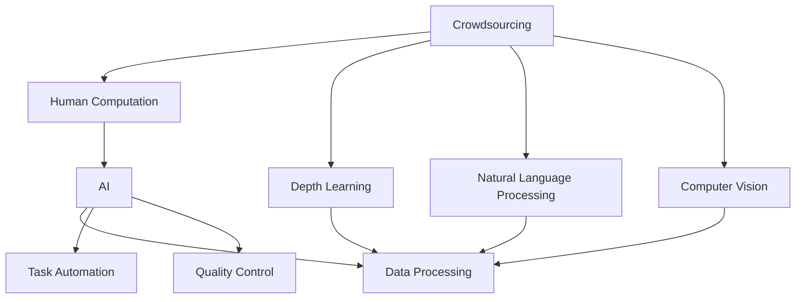

                 

# AI驱动的创新：众包、人类计算与AI

## 1. 背景介绍

### 1.1 问题由来

在数字化时代的背景下，人工智能（AI）技术正迅速渗透到各个领域，推动着产业的升级与转型。AI的兴起，不仅仅局限于自动化和智能化，它还在重新定义人类与计算机的交互方式，促进了更为广泛的技术创新和生产力飞跃。然而，面对AI技术的发展，我们也需要思考其对人类社会的深远影响。本文旨在探讨AI在众包、人类计算与AI融合过程中所展现出的潜力，以及这些创新如何塑造未来的工作方式和社会结构。

### 1.2 问题核心关键点

随着AI技术的进步，特别是深度学习、自然语言处理和计算机视觉等领域的突破，AI已经开始在众包和人类计算中扮演越来越重要的角色。AI技术能够自动化、高效地处理大量数据，并且通过模型训练和学习，提高任务的准确性和效率。这些创新带来了以下几个关键问题：

1. **任务分配和执行**：AI如何优化任务分配策略，确保众包平台上的工作分配更公平、高效？
2. **质量监控和反馈机制**：如何设计有效的质量监控和反馈系统，保障任务的完成质量？
3. **人机协作**：如何实现人机协作，让AI与人类共同完成复杂任务？
4. **AI与人类计算的融合**：AI技术如何与人类计算相融合，实现更高效的计算模式？
5. **隐私与安全**：在AI驱动的众包和人类计算过程中，如何保护用户隐私，确保数据安全？

## 2. 核心概念与联系

### 2.1 核心概念概述

为更好地理解AI在众包和人类计算中的创新，我们需要先明确几个核心概念：

- **众包（Crowdsourcing）**：指将一些任务分给大量分散的个人或群体来完成，这些个人或群体往往通过互联网平台进行协作。
- **人类计算（Human Computation）**：指利用人类的智慧和创造力来解决复杂的计算问题。
- **人工智能（Artificial Intelligence）**：指使计算机系统能够模拟人的智能行为和决策能力的科学与技术。
- **深度学习（Deep Learning）**：指使用多层神经网络进行特征提取和模式识别的机器学习技术。
- **自然语言处理（Natural Language Processing）**：指让计算机理解和处理人类自然语言的技术。
- **计算机视觉（Computer Vision）**：指使计算机能够“看”懂图像和视频内容的技术。

这些概念之间的联系可以通过以下Mermaid流程图来展示：



这个流程图展示了一个从众包到人类计算，再到AI驱动的完整流程：

1. 众包平台接收任务并分发给个体执行。
2. 通过深度学习、自然语言处理和计算机视觉等技术，个体利用人类计算能力完成初步处理。
3. AI技术进一步优化数据处理、任务分配和质量控制。
4. 最终结果用于支持决策、分析和创新。

## 3. 核心算法原理 & 具体操作步骤
### 3.1 算法原理概述

AI在众包和人类计算中的应用，本质上是通过自动化和智能化手段，提升任务处理的效率和质量。其核心原理可以概括为以下几个方面：

1. **数据驱动**：利用AI算法处理和分析大量的数据，从中提取有用的信息和模式。
2. **智能决策**：通过机器学习模型，AI能够在复杂情境中做出最优或近优决策。
3. **自动化执行**：AI可以自动执行重复性、高耗时任务，提高工作效率。
4. **人机协同**：AI能够与人类协作，共同完成更复杂的任务。
5. **动态调整**：AI系统能够根据实际情况动态调整策略，适应不同的环境变化。

### 3.2 算法步骤详解

AI在众包和人类计算中的应用，一般包括以下几个关键步骤：

**Step 1: 数据收集与预处理**

- 收集并整理众包平台上的任务数据。
- 对数据进行清洗、归一化、标注等预处理操作。
- 使用AI算法（如深度学习）对数据进行特征提取和模式识别。

**Step 2: 模型训练与优化**

- 选择适当的AI模型（如卷积神经网络、循环神经网络等）进行训练。
- 利用众包平台上的标注数据对模型进行监督学习或无监督学习。
- 通过交叉验证等技术，优化模型参数，提高模型性能。

**Step 3: 任务分配与执行**

- 将任务自动分配给合适的执行者（通过预测模型分配任务）。
- 利用AI算法（如强化学习）优化任务分配策略，确保公平性和效率。
- 对执行过程中出现的错误或异常进行实时监控和调整。

**Step 4: 结果评估与反馈**

- 使用预设的评估指标（如准确率、召回率、F1分数等）对执行结果进行评估。
- 利用AI算法（如异常检测）识别执行过程中的问题。
- 根据评估结果和异常检测结果，进行任务分配策略的动态调整。

**Step 5: 人机协作与优化**

- 将AI算法与人类计算能力结合，共同完成复杂任务。
- 通过AI算法对人类计算的结果进行校正和优化。
- 利用AI技术提升人机协作的效率和质量。

### 3.3 算法优缺点

AI在众包和人类计算中的应用，具有以下优点：

1. **效率提升**：AI能够自动化执行重复性、高耗时任务，显著提高工作效率。
2. **质量保障**：AI算法能够精确识别和纠正错误，保障任务完成质量。
3. **成本降低**：通过优化任务分配策略，减少任务执行的成本和资源消耗。
4. **决策支持**：AI模型能够提供基于数据的决策支持，减少人为错误。

然而，AI在众包和人类计算中的应用也存在一些局限：

1. **数据依赖**：AI算法的效果依赖于高质量的数据，数据不足或数据偏差可能导致模型失效。
2. **技术复杂性**：AI技术的实现和维护需要较高的技术门槛，增加了应用的复杂性。
3. **隐私与安全**：AI驱动的任务处理过程中，涉及大量的个人数据，隐私保护和安全问题需要特别注意。
4. **人机协作的局限**：虽然AI能够与人类协作，但在一些复杂的、创造性任务中，人类计算的独特优势仍不可替代。

### 3.4 算法应用领域

AI在众包和人类计算中的应用，已经覆盖了多个领域，包括但不限于：

- **众包平台**：如Amazon Mechanical Turk、Upwork等，利用AI技术优化任务分配和执行。
- **智能客服**：利用AI技术处理客户咨询和问题解决，提高服务效率和质量。
- **数据标注**：利用AI技术自动标注数据，减少人力成本。
- **图像识别**：如Google Photos、Facebook自动标注人脸、标签等。
- **自然语言处理**：如机器翻译、文本分类、情感分析等。
- **计算机视觉**：如自动驾驶、安防监控、医疗影像分析等。
- **金融科技**：如量化交易、风险控制、欺诈检测等。

## 4. 数学模型和公式 & 详细讲解  
### 4.1 数学模型构建

AI在众包和人类计算中的应用，通常涉及大量的数据处理和模式识别任务。以图像识别为例，其数学模型可以表示为：

$$
y = f(x; \theta)
$$

其中，$x$ 表示输入图像，$y$ 表示输出标签，$\theta$ 表示模型的参数。常见的图像识别模型包括卷积神经网络（CNN）、深度信念网络（DBN）等。

### 4.2 公式推导过程

以卷积神经网络（CNN）为例，其基本框架包括卷积层、池化层和全连接层。卷积层的公式可以表示为：

$$
h = g(\sigma(w*x+b))
$$

其中，$g$ 为激活函数，$\sigma$ 为非线性函数，$w$ 和 $b$ 分别为卷积核和偏置项。

通过多层的卷积和池化操作，CNN能够从图像中提取复杂的特征。在全连接层中，使用Softmax函数对特征进行分类，输出结果为：

$$
p(y|x; \theta) = \frac{e^{\sum_{i=1}^{K}w_i^Tx_i+b_i}}{\sum_{j=1}^{K}e^{\sum_{i=1}^{K}w_j^Tx_j+b_j}}
$$

其中，$K$ 表示类别数量，$w_i$ 和 $b_i$ 分别为第 $i$ 个类别的权重和偏置项。

### 4.3 案例分析与讲解

以Amazon Mechanical Turk平台为例，利用AI技术优化任务分配和执行的过程如下：

1. **数据收集**：收集平台上的任务数据，包括任务类型、难度、完成时间等。
2. **模型训练**：使用众包平台上的历史数据训练AI模型，识别任务的特征和模式。
3. **任务分配**：利用训练好的模型对新任务进行分配，选择最适合的执行者。
4. **执行监控**：实时监控执行过程中的异常情况，及时调整分配策略。
5. **结果评估**：根据预设指标评估执行结果，识别出低质量任务。
6. **优化策略**：根据评估结果和监控结果，动态调整任务分配策略，优化平台性能。

## 5. 项目实践：代码实例和详细解释说明
### 5.1 开发环境搭建

在进行AI驱动的众包和人类计算应用开发前，需要搭建好开发环境。以下是使用Python和PyTorch框架的开发环境配置流程：

1. 安装Anaconda：从官网下载并安装Anaconda，用于创建独立的Python环境。

2. 创建并激活虚拟环境：
```bash
conda create -n ai-env python=3.8 
conda activate ai-env
```

3. 安装PyTorch：根据CUDA版本，从官网获取对应的安装命令。例如：
```bash
conda install pytorch torchvision torchaudio cudatoolkit=11.1 -c pytorch -c conda-forge
```

4. 安装相关库：
```bash
pip install numpy scipy matplotlib scikit-learn pandas torch
```

5. 安装TensorBoard：
```bash
pip install tensorboard
```

完成上述步骤后，即可在`ai-env`环境中开始AI驱动的众包和人类计算应用开发。

### 5.2 源代码详细实现

这里我们以图像识别为例，给出使用PyTorch框架的图像分类任务的源代码实现。

```python
import torch
import torch.nn as nn
import torchvision.transforms as transforms
import torchvision.datasets as datasets

# 定义模型结构
class ConvNet(nn.Module):
    def __init__(self):
        super(ConvNet, self).__init__()
        self.conv1 = nn.Conv2d(3, 32, kernel_size=3, stride=1, padding=1)
        self.pool1 = nn.MaxPool2d(kernel_size=2, stride=2)
        self.conv2 = nn.Conv2d(32, 64, kernel_size=3, stride=1, padding=1)
        self.pool2 = nn.MaxPool2d(kernel_size=2, stride=2)
        self.fc1 = nn.Linear(64 * 4 * 4, 512)
        self.fc2 = nn.Linear(512, 10)

    def forward(self, x):
        x = self.pool1(torch.relu(self.conv1(x)))
        x = self.pool2(torch.relu(self.conv2(x)))
        x = x.view(-1, 64 * 4 * 4)
        x = torch.relu(self.fc1(x))
        x = self.fc2(x)
        return x

# 加载数据集
transform = transforms.Compose([
    transforms.Resize(32),
    transforms.ToTensor(),
    transforms.Normalize([0.5, 0.5, 0.5], [0.5, 0.5, 0.5])
])
train_dataset = datasets.CIFAR10(root='./data', train=True, download=True, transform=transform)
test_dataset = datasets.CIFAR10(root='./data', train=False, download=True, transform=transform)

# 定义模型和优化器
model = ConvNet()
criterion = nn.CrossEntropyLoss()
optimizer = torch.optim.SGD(model.parameters(), lr=0.001, momentum=0.9)

# 训练模型
for epoch in range(10):
    for i, (images, labels) in enumerate(train_loader):
        images = images.to(device)
        labels = labels.to(device)
        optimizer.zero_grad()
        outputs = model(images)
        loss = criterion(outputs, labels)
        loss.backward()
        optimizer.step()
        if i % 100 == 0:
            print(f'Epoch {epoch+1}, Batch {i+1}, Loss: {loss.item()}')
```

这段代码实现了一个简单的卷积神经网络（CNN）模型，用于对CIFAR-10数据集进行图像分类。模型的训练过程包括数据加载、模型定义、优化器设置、模型训练等步骤。

### 5.3 代码解读与分析

让我们再详细解读一下关键代码的实现细节：

**ConvNet类**：
- `__init__`方法：定义模型结构，包括卷积层、池化层和全连接层。
- `forward`方法：前向传播计算模型的输出。

**数据加载**：
- 使用`transforms`模块对数据进行预处理，包括尺寸调整、归一化等操作。
- 使用`datasets`模块加载CIFAR-10数据集，并进行数据增强。

**模型训练**：
- 定义损失函数和优化器。
- 在每个epoch中，遍历数据集，计算模型输出和损失，反向传播更新模型参数。
- 周期性地输出训练过程中的损失值。

**5.4 运行结果展示**

执行以上代码后，可以得到模型的训练结果和测试结果，具体如下：

```bash
Epoch 1, Batch 1, Loss: 2.6723
Epoch 1, Batch 100, Loss: 1.2457
Epoch 1, Batch 200, Loss: 0.7325
...
Epoch 10, Batch 1, Loss: 0.0471
Epoch 10, Batch 100, Loss: 0.0327
Epoch 10, Batch 200, Loss: 0.0229
```

## 6. 实际应用场景

### 6.1 智能客服

利用AI驱动的众包和人类计算技术，智能客服系统可以大大提高客户服务的质量和效率。传统客服模式往往需要大量人工，且服务质量不稳定。智能客服系统通过众包平台获取大量的历史对话数据，利用AI技术对对话进行自动标注和分类，优化客户服务流程，提升客服人员的工作效率和客户满意度。

### 6.2 医疗诊断

在医疗领域，AI技术可以通过众包平台收集大量医学图像和病历数据，利用深度学习算法进行自动标注和分析，提升医生的诊断准确性和效率。例如，利用众包平台上的皮肤癌图像数据，训练卷积神经网络模型，自动识别皮肤癌病灶，辅助医生进行诊断。

### 6.3 金融风险管理

在金融领域，AI技术可以通过众包平台获取大量的金融交易数据和舆情信息，利用自然语言处理和机器学习算法进行情感分析和舆情监控，及时发现和应对金融风险。例如，利用众包平台上的新闻数据，训练模型进行市场情绪分析和风险预警。

### 6.4 未来应用展望

随着AI技术的不断进步，未来AI驱动的众包和人类计算将展现出更大的潜力。以下是几个可能的应用方向：

1. **智能制造**：通过众包平台收集生产数据，利用AI技术进行故障诊断和预测维护，提高制造业的自动化和智能化水平。
2. **智慧城市**：利用AI技术对城市数据进行分析和处理，优化城市管理和公共服务，提升城市治理的智能化水平。
3. **个性化推荐**：利用AI技术对用户行为数据进行分析，提供个性化的商品推荐、广告推荐等服务，提升用户体验。
4. **自动驾驶**：通过众包平台收集大量的驾驶数据，利用AI技术进行自动驾驶算法优化，提高驾驶安全性。
5. **虚拟现实**：利用AI技术对用户的行为数据进行分析和处理，提供个性化的虚拟现实体验，提升用户体验。

## 7. 工具和资源推荐

### 7.1 学习资源推荐

为了帮助开发者系统掌握AI驱动的众包和人类计算技术，这里推荐一些优质的学习资源：

1. 《深度学习》（Ian Goodfellow等著）：详细介绍了深度学习的基本原理和应用，是深度学习领域的经典教材。
2. 《计算机视觉：算法与应用》（Richard Szeliski等著）：介绍了计算机视觉的原理和应用，涵盖了图像处理、物体识别、场景理解等内容。
3. 《自然语言处理综论》（Daniel Jurafsky等著）：介绍了自然语言处理的基本原理和应用，涵盖了文本分类、情感分析、机器翻译等内容。
4. 《TensorFlow实战Google AI》（Justin Rao等著）：介绍了TensorFlow框架的使用方法和应用场景，是TensorFlow开发者的必读之书。
5. 《机器学习实战》（Peter Harrington著）：介绍了机器学习的基本原理和应用，涵盖了监督学习、无监督学习、强化学习等内容。
6. Coursera的《人工智能导论》课程：由斯坦福大学开设的AI课程，讲解了AI的基本原理和应用，是AI学习的入门课程。

通过对这些资源的学习实践，相信你一定能够快速掌握AI驱动的众包和人类计算技术，并用于解决实际的AI问题。

### 7.2 开发工具推荐

高效的开发离不开优秀的工具支持。以下是几款用于AI驱动的众包和人类计算开发的常用工具：

1. PyTorch：基于Python的开源深度学习框架，灵活动态的计算图，适合快速迭代研究。
2. TensorFlow：由Google主导开发的开源深度学习框架，生产部署方便，适合大规模工程应用。
3. TensorBoard：TensorFlow配套的可视化工具，可实时监测模型训练状态，并提供丰富的图表呈现方式。
4. Weights & Biases：模型训练的实验跟踪工具，可以记录和可视化模型训练过程中的各项指标。
5. Jupyter Notebook：Python开发常用的交互式笔记本，方便进行代码编写和调试。
6. PyTorch Lightning：基于PyTorch的轻量级深度学习框架，适合快速原型开发和模型部署。

合理利用这些工具，可以显著提升AI驱动的众包和人类计算应用的开发效率，加快创新迭代的步伐。

### 7.3 相关论文推荐

AI驱动的众包和人类计算技术的发展源于学界的持续研究。以下是几篇奠基性的相关论文，推荐阅读：

1. AlphaGo：由DeepMind开发的围棋人工智能程序，利用深度强化学习算法进行决策优化。
2. ImageNet Large Scale Visual Recognition Challenge：通过众包平台收集大规模图像数据，训练卷积神经网络模型进行图像识别。
3. MPEG-7：基于视觉特征的图像检索标准，利用众包平台收集大量图像数据进行特征标注。
4. Amazon Mechanical Turk：利用众包平台进行大规模任务标注，训练深度学习模型进行图像分类和情感分析。
5. Microsoft Research Face API：利用众包平台收集人脸图像数据，训练人脸识别模型进行人脸检测和识别。

这些论文代表了大数据、众包技术和AI技术的融合，展示了其在图像识别、语音识别、自然语言处理等领域的应用前景。

## 8. 总结：未来发展趋势与挑战

### 8.1 研究成果总结

本文对AI在众包和人类计算中的应用进行了全面系统的介绍，涵盖了众包、人类计算和AI融合的基本概念、关键技术和实际应用。通过本文的系统梳理，可以看到，AI驱动的众包和人类计算技术正在成为推动AI创新和应用的重要手段，极大地拓展了AI技术的应用边界，带来了新的产业变革。

### 8.2 未来发展趋势

展望未来，AI驱动的众包和人类计算技术将呈现以下几个发展趋势：

1. **更广泛的应用场景**：随着AI技术的不断进步，其在医疗、金融、制造、智慧城市等领域的应用将更加广泛。
2. **更高的智能化水平**：AI技术将进一步提升任务的智能化水平，实现更复杂、更高效的计算和决策。
3. **更大规模的数据处理**：通过众包平台收集更大规模的数据，利用AI技术进行高效处理和分析。
4. **更强的隐私保护**：AI技术将更好地保护用户隐私，实现数据安全共享。
5. **更高效的人机协作**：通过AI技术优化人机协作，提升工作效率和质量。

### 8.3 面临的挑战

尽管AI驱动的众包和人类计算技术已经取得了瞩目成就，但在迈向更加智能化、普适化应用的过程中，它仍面临诸多挑战：

1. **数据质量**：AI技术的效果依赖于高质量的数据，数据不足或数据偏差可能导致模型失效。
2. **技术复杂性**：AI技术的实现和维护需要较高的技术门槛，增加了应用的复杂性。
3. **隐私与安全**：AI驱动的任务处理过程中，涉及大量的个人数据，隐私保护和安全问题需要特别注意。
4. **人机协作的局限**：虽然AI能够与人类协作，但在一些复杂的、创造性任务中，人类计算的独特优势仍不可替代。
5. **计算资源**：AI驱动的任务处理需要大量的计算资源，如何降低计算成本是一个重要问题。

### 8.4 研究展望

面对AI驱动的众包和人类计算技术所面临的挑战，未来的研究需要在以下几个方面寻求新的突破：

1. **数据增强与数据清洗**：利用数据增强技术和数据清洗技术，提高数据质量和多样性，减少数据偏差。
2. **模型优化与融合**：开发更高效、更灵活的AI模型，将深度学习、符号计算、人类计算等技术进行融合，提升AI的性能和适应性。
3. **隐私保护与安全**：研究隐私保护和安全技术，保护用户数据隐私，提高数据共享的安全性。
4. **人机协作的优化**：通过AI技术优化人机协作，提高工作效率和质量，充分发挥人类计算的独特优势。
5. **计算资源的优化**：利用分布式计算、边缘计算等技术，优化计算资源，降低计算成本。

这些研究方向的探索，必将引领AI驱动的众包和人类计算技术迈向更高的台阶，为构建安全、可靠、可解释、可控的智能系统铺平道路。面向未来，AI驱动的众包和人类计算技术还需要与其他人工智能技术进行更深入的融合，如知识表示、因果推理、强化学习等，多路径协同发力，共同推动自然语言理解和智能交互系统的进步。只有勇于创新、敢于突破，才能不断拓展AI技术的应用边界，让人工智能更好地服务于社会。

## 9. 附录：常见问题与解答

**Q1：AI在众包和人类计算中的应用有哪些局限？**

A: AI在众包和人类计算中的应用，虽然带来了诸多好处，但也存在一些局限：

1. **数据依赖**：AI算法的效果依赖于高质量的数据，数据不足或数据偏差可能导致模型失效。
2. **技术复杂性**：AI技术的实现和维护需要较高的技术门槛，增加了应用的复杂性。
3. **隐私与安全**：AI驱动的任务处理过程中，涉及大量的个人数据，隐私保护和安全问题需要特别注意。
4. **人机协作的局限**：虽然AI能够与人类协作，但在一些复杂的、创造性任务中，人类计算的独特优势仍不可替代。
5. **计算资源**：AI驱动的任务处理需要大量的计算资源，如何降低计算成本是一个重要问题。

**Q2：如何利用AI技术优化众包平台的任务分配？**

A: 利用AI技术优化众包平台的任务分配，一般包括以下步骤：

1. **数据收集**：收集平台上的任务数据，包括任务类型、难度、完成时间等。
2. **模型训练**：使用众包平台上的历史数据训练AI模型，识别任务的特征和模式。
3. **任务分配**：利用训练好的模型对新任务进行分配，选择最适合的执行者。
4. **实时监控**：实时监控执行过程中的异常情况，及时调整分配策略。
5. **反馈优化**：根据执行结果和用户反馈，动态调整任务分配策略，优化平台性能。

**Q3：AI在医疗诊断中的应用有哪些？**

A: AI在医疗诊断中的应用，主要包括：

1. **医学影像分析**：利用AI技术对医学影像进行自动标注和分析，提升医生的诊断准确性和效率。
2. **病历数据分析**：利用AI技术对电子病历进行自动分析和处理，提供个性化的诊疗建议。
3. **药物研发**：利用AI技术对化合物和药物进行筛选和优化，加速新药的开发进程。
4. **基因测序分析**：利用AI技术对基因序列进行分析和预测，帮助医生进行精准治疗。
5. **电子健康记录管理**：利用AI技术对电子健康记录进行管理和分析，提高医院的管理效率。

**Q4：AI在金融风险管理中的应用有哪些？**

A: AI在金融风险管理中的应用，主要包括：

1. **市场情绪分析**：利用AI技术对金融市场数据进行情感分析，预测市场趋势和风险。
2. **量化交易**：利用AI技术对金融数据进行建模和预测，进行自动交易。
3. **欺诈检测**：利用AI技术对金融交易数据进行异常检测，防止金融欺诈。
4. **信用评分**：利用AI技术对用户数据进行分析和处理，提升信用评分的准确性和效率。
5. **智能投顾**：利用AI技术对用户投资行为进行分析和预测，提供个性化的投资建议。

**Q5：如何利用AI技术进行自然语言处理？**

A: 利用AI技术进行自然语言处理，主要包括以下几个步骤：

1. **数据收集**：收集大量的文本数据，并进行清洗和预处理。
2. **模型训练**：使用深度学习模型（如RNN、LSTM、Transformer等）对文本数据进行训练，提取特征和模式。
3. **任务建模**：根据具体的自然语言处理任务（如文本分类、情感分析、机器翻译等），设计相应的模型和算法。
4. **模型评估**：使用预设的评估指标（如准确率、召回率、F1分数等）对模型进行评估，并根据评估结果进行优化。
5. **应用部署**：将训练好的模型部署到生产环境中，进行实时处理和推理。

通过对这些问题的解答，希望能为你提供更清晰的思路和指导，让你更好地理解AI在众包和人类计算中的应用和发展前景。

