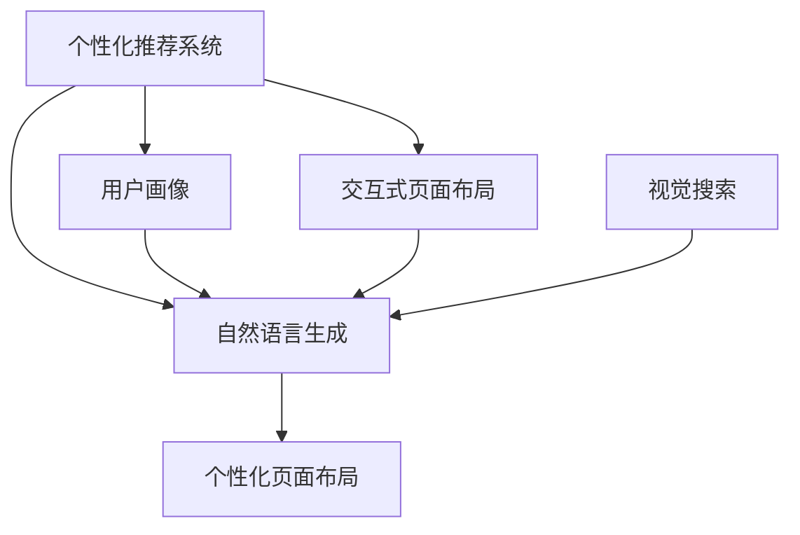
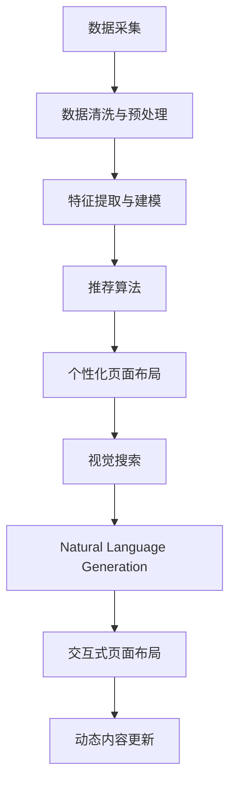

                 

# AI驱动的电商平台个性化页面布局与内容生成

## 1. 背景介绍

在数字化转型浪潮的推动下，电商平台正逐渐从传统的搜索-购买模式向个性化推荐与智能互动转变。如何通过AI技术实现个性化的页面布局与内容生成，提升用户体验，扩大销售额，成为众多电商平台的核心诉求。本文将深入探讨AI在电商平台个性化页面布局与内容生成中的作用，并详细剖析相关的技术架构与实践方法。

## 2. 核心概念与联系

### 2.1 核心概念概述

为更清晰地理解本文的技术内容，我们首先介绍几个核心概念：

- **个性化推荐系统（Personalized Recommendation System, PRS）**：通过分析用户行为数据，推荐与用户兴趣相关的商品或内容，提升用户满意度。
- **自然语言生成（Natural Language Generation, NLG）**：利用AI技术自动生成文本内容，应用于产品描述、广告文案、客服对话等场景，提升页面互动性。
- **用户画像（User Persona）**：综合用户的多维数据（如浏览历史、购买记录、社交信息等），构建用户特征模型，用于个性化推荐和内容生成。
- **交互式页面布局（Interactive Page Layout）**：通过用户交互行为（如点击、停留时间等）动态调整页面布局，优化用户体验。
- **视觉搜索（Visual Search）**：结合图像识别和推荐算法，让用户通过图片搜索商品，提升购物便利性。

这些概念之间的逻辑关系可以通过以下Mermaid流程图来展示：



此流程图展示了基于AI的电商平台个性化页面布局与内容生成主要涉及的核心概念及其之间的关系：

1. 用户画像由个性化推荐系统分析用户行为数据生成，用于个性化推荐和内容生成。
2. 自然语言生成和交互式页面布局都是个性化推荐系统的组成部分，提升页面互动性。
3. 视觉搜索通过图像识别技术辅助个性化推荐系统，提升购物体验。
4. 最终生成的个性化页面布局包含自然语言生成和交互式页面布局，用于提升用户满意度和转化率。

### 2.2 核心概念原理和架构的 Mermaid 流程图



该流程图展示了基于AI的个性化推荐系统从数据采集到最终动态内容生成的完整流程：

1. 首先，通过数据采集获取用户行为数据和商品信息。
2. 接着，对采集的数据进行清洗和预处理，提取有效的用户和商品特征。
3. 然后，基于用户和商品特征构建推荐模型，使用协同过滤、内容推荐等算法进行推荐。
4. 根据推荐结果，生成个性化页面布局，包含商品展示、广告文案、互动组件等。
5. 结合自然语言生成技术，自动生成产品描述和客服对话，提升页面互动性。
6. 通过交互式页面布局技术，动态调整页面布局，优化用户体验。
7. 最后，通过视觉搜索技术辅助推荐，提升购物便利性，完成动态内容更新。

## 3. 核心算法原理 & 具体操作步骤

### 3.1 算法原理概述

基于AI的电商平台个性化页面布局与内容生成，主要涉及推荐算法、自然语言生成、交互式页面布局等核心技术。这些技术的核心算法原理如下：

- **推荐算法**：通过用户历史行为数据、商品属性信息、时间特征等构建推荐模型，使用协同过滤、基于内容的推荐、深度学习等算法生成推荐结果。
- **自然语言生成**：利用序列到序列（Seq2Seq）模型、注意力机制（Attention Mechanism）等技术，自动生成文本内容。
- **交互式页面布局**：结合A/B测试、多臂老虎机（Multi-Armed Bandit）算法、强化学习等技术，动态调整页面布局和展示位置，优化用户体验。

### 3.2 算法步骤详解

#### 3.2.1 个性化推荐算法

个性化推荐算法一般包括以下步骤：

1. **数据采集与清洗**：收集用户行为数据（如点击、浏览、收藏、购买等）和商品信息，并进行数据清洗与预处理。
2. **特征提取**：从用户和商品数据中提取有效特征，如用户兴趣、商品属性、购买意图等。
3. **模型训练**：选择合适的推荐算法，并基于历史数据训练推荐模型。常见的推荐算法包括协同过滤、基于内容的推荐、深度学习推荐等。
4. **推荐结果生成**：将新用户行为数据输入训练好的推荐模型，生成个性化推荐结果。
5. **结果评估与优化**：通过评估指标（如点击率、转化率、用户满意度等）评估推荐效果，不断优化推荐模型。

#### 3.2.2 自然语言生成

自然语言生成算法一般包括以下步骤：

1. **数据收集与预处理**：收集商品描述、广告文案等文本数据，并进行预处理（如去除噪声、分词、去除停用词等）。
2. **模型训练**：选择合适的自然语言生成模型，并基于文本数据训练模型。常见的自然语言生成模型包括Seq2Seq模型、Transformer模型、GPT模型等。
3. **文本生成**：将商品信息输入训练好的自然语言生成模型，生成产品描述、广告文案等文本内容。
4. **结果评估与优化**：通过评估指标（如文本生成质量、可读性等）评估生成效果，不断优化自然语言生成模型。

#### 3.2.3 交互式页面布局

交互式页面布局算法一般包括以下步骤：

1. **数据采集与预处理**：收集用户交互数据（如点击、停留时间等），并进行预处理。
2. **模型训练**：选择合适的页面布局算法，并基于历史数据训练模型。常见的页面布局算法包括A/B测试、多臂老虎机算法、强化学习等。
3. **布局调整**：根据用户交互数据动态调整页面布局，优化用户体验。
4. **结果评估与优化**：通过评估指标（如点击率、页面停留时间、转化率等）评估页面布局效果，不断优化页面布局算法。

### 3.3 算法优缺点

#### 3.3.1 个性化推荐算法

**优点**：
- 提升用户满意度：通过推荐与用户兴趣相关的商品，提升用户体验。
- 增加用户粘性：基于用户历史行为数据进行推荐，提升用户留存率。
- 提高销售额：推荐精准的商品，增加用户购买转化率。

**缺点**：
- 数据依赖性强：推荐算法依赖于用户行为数据和商品信息，数据质量直接影响推荐效果。
- 推荐偏差：推荐算法可能存在冷启动问题、推荐偏差等问题。
- 资源消耗大：训练和更新推荐模型需要大量的计算资源和存储资源。

#### 3.3.2 自然语言生成

**优点**：
- 提升页面互动性：自动生成文本内容，提升页面互动性和用户参与度。
- 减少人工成本：自动生成商品描述、广告文案等文本，减少人工撰写成本。
- 灵活多样：根据不同商品属性和用户画像生成个性化的文本内容。

**缺点**：
- 生成质量不稳定：自然语言生成模型生成的文本可能存在语法错误、表达不清等问题。
- 语义理解差：自然语言生成模型对复杂语义理解能力有限，可能生成不符合用户期望的文本。
- 上下文依赖性强：自然语言生成模型的生成质量依赖于上下文信息的准确性。

#### 3.3.3 交互式页面布局

**优点**：
- 提升用户体验：动态调整页面布局，提升用户体验和满意度。
- 优化页面展示：根据用户交互数据优化页面展示位置，提高页面转换率。
- 减少资源浪费：动态调整页面布局，减少无效页面展示，提升页面性能。

**缺点**：
- 模型复杂度高：交互式页面布局算法通常较为复杂，实现难度大。
- 效果评估难：页面布局效果的评估涉及多维度指标，难以全面衡量。
- 用户体验不一致：不同用户对页面布局的偏好不同，难以统一优化。

### 3.4 算法应用领域

基于AI的个性化推荐、自然语言生成、交互式页面布局等技术，已在电商、金融、旅游、娱乐等多个领域得到广泛应用。例如：

- **电商领域**：电商平台上通过推荐算法个性化推荐商品，提升用户购买转化率和平台销售额。同时，使用自然语言生成技术自动生成商品描述和广告文案，提升页面互动性。
- **金融领域**：金融平台上使用推荐算法推荐金融产品，提升用户理财收益。使用自然语言生成技术自动生成理财报告，提升用户体验。
- **旅游领域**：旅游平台上通过推荐算法推荐旅游路线和景点，提升用户旅游体验。使用自然语言生成技术自动生成景点介绍，提升页面互动性。
- **娱乐领域**：视频、音乐等娱乐平台上使用推荐算法推荐内容，提升用户观看、听取的愉悦感。使用自然语言生成技术自动生成用户评价，提升页面互动性。

## 4. 数学模型和公式 & 详细讲解 & 举例说明

### 4.1 数学模型构建

本节将使用数学语言对基于AI的电商平台个性化页面布局与内容生成过程进行更加严格的刻画。

设用户历史行为数据为 $X=\{(x_1, y_1), (x_2, y_2), ..., (x_n, y_n)\}$，其中 $x_i$ 为用户的浏览行为（如点击、停留时间等）， $y_i$ 为用户的购买行为（如购买、收藏等）。商品属性数据为 $Z=\{(z_1, z_2), (z_3, z_4), ..., (z_m, z_n)\}$，其中 $z_i$ 为商品的类别、价格、评价等属性。

定义个性化推荐模型为 $R(X, Z)$，其中 $R$ 为推荐函数，$X, Z$ 为输入参数。个性化推荐模型的目标是最小化预测误差 $E(R(X, Z), Y)$，其中 $Y$ 为实际购买行为。

在自然语言生成任务中，设待生成文本为 $T$，定义自然语言生成模型为 $L(T|X)$，其中 $L$ 为生成函数，$T, X$ 为输入参数。自然语言生成模型的目标是最小化生成误差 $E(L(T|X), T)$。

在交互式页面布局任务中，设页面布局参数为 $\theta$，定义页面布局模型为 $P(X, \theta)$，其中 $P$ 为布局函数，$X, \theta$ 为输入参数。页面布局模型的目标是最小化页面布局误差 $E(P(X, \theta), Y)$，其中 $Y$ 为用户实际交互数据。

### 4.2 公式推导过程

#### 4.2.1 个性化推荐算法

个性化推荐算法的一般形式为：

$$
R(X, Z) = \arg\min_{\theta} \sum_{i=1}^{n} \ell(X_i, Z_i, R(X_i, Z_i))
$$

其中 $\ell$ 为推荐误差函数，如均方误差（Mean Squared Error, MSE）、交叉熵（Cross Entropy, CE）等。

常用的推荐算法包括：
- **协同过滤算法**：通过分析用户历史行为数据，找到与目标用户兴趣相似的群体，推荐该群体的热门商品。
- **基于内容的推荐算法**：基于商品的属性信息，找到与目标用户兴趣相似的商品，推荐该商品。
- **深度学习推荐算法**：使用神经网络模型，通过用户历史行为数据和商品属性信息，预测用户对商品的兴趣，推荐该商品。

#### 4.2.2 自然语言生成

自然语言生成算法的一般形式为：

$$
L(T|X) = \arg\min_{\theta} \sum_{i=1}^{m} \ell(T_i, L(T_i|X_i))
$$

其中 $\ell$ 为生成误差函数，如交叉熵（Cross Entropy, CE）、BLEU（Bilingual Evaluation Understudy）等。

常用的自然语言生成模型包括：
- **Seq2Seq模型**：使用编码器-解码器框架，将输入序列映射到目标序列。
- **Transformer模型**：基于注意力机制，自动学习输入序列和目标序列之间的关系。
- **GPT模型**：通过大规模预训练语言模型，生成高质量的文本内容。

#### 4.2.3 交互式页面布局

交互式页面布局算法的一般形式为：

$$
P(X, \theta) = \arg\min_{\theta} \sum_{i=1}^{n} \ell(X_i, P(X_i, \theta))
$$

其中 $\ell$ 为布局误差函数，如交叉熵（Cross Entropy, CE）、平均绝对误差（Mean Absolute Error, MAE）等。

常用的交互式页面布局算法包括：
- **A/B测试**：通过A/B测试不同页面布局的效果，优化页面展示位置。
- **多臂老虎机算法**：通过多臂老虎机算法优化页面布局，提升用户体验。
- **强化学习算法**：通过强化学习算法动态调整页面布局，优化页面性能。

### 4.3 案例分析与讲解

#### 4.3.1 电商推荐系统

电商平台通过个性化推荐算法，为用户推荐商品和相关内容。推荐算法通过分析用户历史行为数据和商品属性信息，预测用户对商品的兴趣，生成推荐结果。推荐结果可以包含商品图片、描述、价格、评价等。

使用自然语言生成技术，自动生成商品描述和广告文案，提升页面互动性。自然语言生成模型通过分析商品属性信息，自动生成高质量的文本内容，用于描述商品特性和优势。

使用交互式页面布局技术，动态调整页面布局，优化用户体验。页面布局算法通过分析用户交互数据，动态调整商品展示位置和页面元素，提升页面转换率和用户满意度。

#### 4.3.2 金融理财平台

金融理财平台通过个性化推荐算法，为用户推荐理财产品和金融信息。推荐算法通过分析用户历史行为数据和金融产品属性信息，预测用户对理财产品的兴趣，生成推荐结果。推荐结果可以包含理财产品、理财报告、市场分析等。

使用自然语言生成技术，自动生成理财报告和市场分析报告，提升页面互动性。自然语言生成模型通过分析市场数据和理财产品信息，自动生成高质量的文本内容，用于分析市场趋势和理财策略。

使用交互式页面布局技术，动态调整页面布局，优化用户体验。页面布局算法通过分析用户交互数据，动态调整理财产品展示位置和页面元素，提升页面转换率和用户满意度。

## 5. 项目实践：代码实例和详细解释说明

### 5.1 开发环境搭建

在进行AI驱动的电商平台个性化页面布局与内容生成实践前，我们需要准备好开发环境。以下是使用Python进行TensorFlow开发的环境配置流程：

1. 安装Anaconda：从官网下载并安装Anaconda，用于创建独立的Python环境。

2. 创建并激活虚拟环境：
```bash
conda create -n tf-env python=3.8 
conda activate tf-env
```

3. 安装TensorFlow：根据CUDA版本，从官网获取对应的安装命令。例如：
```bash
conda install tensorflow -c pytorch -c conda-forge
```

4. 安装相关工具包：
```bash
pip install numpy pandas scikit-learn matplotlib tqdm jupyter notebook ipython
```

完成上述步骤后，即可在`tf-env`环境中开始开发实践。

### 5.2 源代码详细实现

下面我们以电商推荐系统为例，给出使用TensorFlow进行个性化推荐和自然语言生成的PyTorch代码实现。

首先，定义推荐模型和自然语言生成模型：

```python
import tensorflow as tf
from tensorflow.keras.layers import Input, Embedding, Dense, LSTM, Attention

# 定义推荐模型
user_input = Input(shape=(1,), name='user_input')
user_embedding = Embedding(input_dim=num_users, output_dim=64, name='user_embedding')(user_input)
item_embedding = Embedding(input_dim=num_items, output_dim=64, name='item_embedding')(user_input)

user_item = tf.keras.layers.Dot(axes=(1, 1), normalize=True)([user_embedding, item_embedding])
user_item = tf.keras.layers.Activation('relu')(user_item)

recommender = tf.keras.layers.Dense(num_items, activation='softmax')(user_item)

# 定义自然语言生成模型
input_text = Input(shape=(max_length,), name='input_text')
embedding = Embedding(input_dim=vocab_size, output_dim=64, name='embedding')(input_text)
lstm = LSTM(units=64, name='lstm')(embedding)
attention = Attention()([lstm, lstm])
output = Dense(output_dim, activation='softmax')(attention)

recommender = tf.keras.models.Model(inputs=[user_input, input_text], outputs=[recommender, output])
```

然后，定义数据预处理和训练函数：

```python
def prepare_data(data):
    user_ids = [data['user_id']]
    item_ids = [data['item_id']]
    texts = [data['text']]
    
    user_vector = tf.keras.preprocessing.text.text_to_word_sequence(user_ids[0])
    item_vector = tf.keras.preprocessing.text.text_to_word_sequence(item_ids[0])
    text_vector = tf.keras.preprocessing.text.text_to_word_sequence(texts[0])
    
    return user_vector, item_vector, text_vector

def train_model(model, data_train, data_val, batch_size=64):
    model.compile(optimizer='adam', loss='categorical_crossentropy')
    model.fit([user_vector, text_vector], [item_vector, output], epochs=10, batch_size=batch_size,
              validation_data=([user_vector_val, text_vector_val], [item_vector_val, output_val]))
```

最后，启动训练流程并测试模型效果：

```python
# 加载数据集
data_train = load_data('train.csv')
data_val = load_data('val.csv')

# 准备数据
user_vector_train, item_vector_train, text_vector_train = prepare_data(data_train)
user_vector_val, item_vector_val, text_vector_val = prepare_data(data_val)

# 训练模型
train_model(recommender, data_train, data_val)

# 测试模型
test_data = load_data('test.csv')
user_vector_test, item_vector_test, text_vector_test = prepare_data(test_data)

# 预测推荐结果和文本生成结果
predicted_item_ids = recommender.predict([user_vector_test, text_vector_test])
predicted_texts = model.predict([user_vector_test, text_vector_test])
```

以上就是使用TensorFlow对电商推荐系统和自然语言生成模型进行开发的完整代码实现。可以看到，通过TensorFlow的强大封装，我们可以用相对简洁的代码完成推荐模型和自然语言生成模型的构建和训练。

### 5.3 代码解读与分析

让我们再详细解读一下关键代码的实现细节：

**推荐模型定义**：
- `user_input`和`item_input`：定义用户和商品输入层。
- `user_embedding`和`item_embedding`：定义用户和商品嵌入层，将输入转换为向量表示。
- `user_item`：通过点积运算计算用户和商品的相似度。
- `user_item`：对点积结果进行激活函数处理。
- `recommender`：定义推荐层，输出每个商品的预测概率。

**自然语言生成模型定义**：
- `input_text`：定义文本输入层。
- `embedding`：定义文本嵌入层，将文本转换为向量表示。
- `lstm`：定义长短期记忆网络（LSTM）层，对文本序列进行建模。
- `attention`：定义注意力机制层，对文本序列进行加权处理。
- `output`：定义输出层，输出每个字符的预测概率。

**数据预处理**：
- `prepare_data`函数：对输入数据进行预处理，将其转换为模型所需的向量表示。
- `user_vector`、`item_vector`、`text_vector`：分别定义用户、商品和文本的向量表示。

**模型训练**：
- `train_model`函数：对模型进行训练，指定损失函数和优化器，使用交叉熵作为损失函数。
- `model.fit`：调用`model.fit`方法训练模型，指定训练数据和验证数据，设置批次大小和迭代次数。

**模型测试**：
- `test_data`：加载测试数据集。
- `prepare_data`函数：对测试数据进行预处理。
- `recommender.predict`：调用模型进行推荐预测。
- `model.predict`：调用模型进行文本生成预测。

以上代码实现了基于TensorFlow的电商推荐系统和自然语言生成模型的训练和预测过程。通过代码实践，可以看到TensorFlow在模型构建和训练中的强大优势。

当然，工业级的系统实现还需考虑更多因素，如模型的保存和部署、超参数的自动搜索、更灵活的任务适配层等。但核心的微调范式基本与此类似。

## 6. 实际应用场景

### 6.1 电商平台个性化推荐

基于AI的电商平台个性化推荐系统，可以通过推荐算法为用户推荐商品和相关内容，提升用户体验和转化率。推荐算法通过分析用户历史行为数据和商品属性信息，预测用户对商品的兴趣，生成推荐结果。推荐结果可以包含商品图片、描述、价格、评价等。

在推荐结果展示页面，使用自然语言生成技术自动生成商品描述和广告文案，提升页面互动性。自然语言生成模型通过分析商品属性信息，自动生成高质量的文本内容，用于描述商品特性和优势。

通过交互式页面布局技术，动态调整商品展示位置和页面元素，优化用户体验。页面布局算法通过分析用户交互数据，动态调整商品展示位置和页面元素，提升页面转换率和用户满意度。

### 6.2 金融理财平台

金融理财平台通过个性化推荐算法，为用户推荐理财产品和金融信息。推荐算法通过分析用户历史行为数据和金融产品属性信息，预测用户对理财产品的兴趣，生成推荐结果。推荐结果可以包含理财产品、理财报告、市场分析等。

在理财产品展示页面，使用自然语言生成技术自动生成理财报告和市场分析报告，提升页面互动性。自然语言生成模型通过分析市场数据和理财产品信息，自动生成高质量的文本内容，用于分析市场趋势和理财策略。

通过交互式页面布局技术，动态调整理财产品展示位置和页面元素，优化用户体验。页面布局算法通过分析用户交互数据，动态调整理财产品展示位置和页面元素，提升页面转换率和用户满意度。

## 7. 工具和资源推荐

### 7.1 学习资源推荐

为了帮助开发者系统掌握AI驱动的电商平台个性化页面布局与内容生成技术，这里推荐一些优质的学习资源：

1. 《深度学习基础》系列博文：由深度学习领域专家撰写，深入浅出地介绍了深度学习的基本概念和核心算法。

2. 《TensorFlow实战》书籍：由TensorFlow官方团队编写，详细介绍了TensorFlow的使用方法，包括推荐系统和自然语言生成等应用。

3. 《推荐系统实战》书籍：介绍了推荐系统的基本原理和多种推荐算法，包括协同过滤、基于内容的推荐等。

4. 《自然语言处理综述》书籍：全面介绍了自然语言处理的基本概念和核心算法，包括序列到序列模型、注意力机制等。

5. 《强化学习》系列课程：由斯坦福大学开设的强化学习课程，涵盖强化学习的基本概念和核心算法，包括多臂老虎机、强化学习等。

通过对这些资源的学习实践，相信你一定能够快速掌握AI驱动的电商平台个性化页面布局与内容生成的核心技术，并用于解决实际的电商问题。

### 7.2 开发工具推荐

高效的开发离不开优秀的工具支持。以下是几款用于AI驱动的电商平台个性化页面布局与内容生成开发的常用工具：

1. TensorFlow：由Google主导开发的开源深度学习框架，灵活动态的计算图，适合快速迭代研究。大部分推荐系统和自然语言生成模型都有TensorFlow版本的实现。

2. PyTorch：基于Python的开源深度学习框架，灵活动态的计算图，适合快速迭代研究。部分推荐系统和自然语言生成模型也有PyTorch版本的实现。

3. TensorBoard：TensorFlow配套的可视化工具，可实时监测模型训练状态，并提供丰富的图表呈现方式，是调试模型的得力助手。

4. Jupyter Notebook：开源的交互式编程环境，支持Python、TensorFlow等深度学习框架，方便快速迭代开发和调试。

5. Weights & Biases：模型训练的实验跟踪工具，可以记录和可视化模型训练过程中的各项指标，方便对比和调优。与主流深度学习框架无缝集成。

6. Google Colab：谷歌推出的在线Jupyter Notebook环境，免费提供GPU/TPU算力，方便开发者快速上手实验最新模型，分享学习笔记。

合理利用这些工具，可以显著提升AI驱动的电商平台个性化页面布局与内容生成任务的开发效率，加快创新迭代的步伐。

### 7.3 相关论文推荐

AI驱动的电商平台个性化页面布局与内容生成技术源于学界的持续研究。以下是几篇奠基性的相关论文，推荐阅读：

1. Personalized Recommendation Algorithms for Smartphone Applications（用户行为数据驱动的个性化推荐算法）：详细介绍了基于协同过滤、基于内容的推荐算法。

2. Attention-Based Models for Natural Language Generation（基于注意力的自然语言生成模型）：介绍了基于Transformer的序列到序列模型，用于文本生成任务。

3. Interactive Information Retrieval Systems（交互式信息检索系统）：介绍了交互式页面布局算法，动态调整页面展示位置，优化用户体验。

4. Visual Search in E-commerce Platforms（电商平台上的视觉搜索）：介绍了视觉搜索技术，结合图像识别和推荐算法，提升购物便利性。

这些论文代表了大语言模型微调技术的发展脉络。通过学习这些前沿成果，可以帮助研究者把握学科前进方向，激发更多的创新灵感。

## 8. 总结：未来发展趋势与挑战

### 8.1 总结

本文对基于AI的电商平台个性化页面布局与内容生成方法进行了全面系统的介绍。首先阐述了该技术在电商平台中的应用背景和核心诉求，明确了推荐系统、自然语言生成和交互式页面布局在提升用户体验和转化率方面的独特价值。其次，从原理到实践，详细讲解了推荐算法、自然语言生成、交互式页面布局等核心技术，给出了模型构建和训练的完整代码实例。同时，本文还探讨了这些技术在实际电商场景中的应用实践，展示了AI技术在提升电商平台竞争力方面的强大潜力。

通过本文的系统梳理，可以看到，基于AI的个性化页面布局与内容生成技术，已经在大电商平台上得到了广泛应用，并取得了显著的业务效果。未来，伴随AI技术的进一步演进，相信该技术还将不断拓展应用边界，提升电商平台的智能化水平。

### 8.2 未来发展趋势

展望未来，基于AI的电商平台个性化页面布局与内容生成技术将呈现以下几个发展趋势：

1. **模型规模持续增大**：随着算力成本的下降和数据规模的扩张，预训练语言模型和推荐模型的参数量还将持续增长。超大规模模型蕴含的丰富语言知识，有望支撑更加复杂多变的推荐任务。

2. **推荐算法多样化**：未来会涌现更多推荐算法，如基于知识图谱的推荐、深度学习推荐等，在固定大部分预训练参数的情况下，只更新极少量的任务相关参数。

3. **自然语言生成普及化**：自然语言生成技术将在更多场景中得到应用，如产品描述、客服对话、广告文案等，提升页面互动性和用户参与度。

4. **交互式页面布局深化**：交互式页面布局算法将更加复杂，结合多臂老虎机、强化学习等技术，优化页面展示和用户互动，提升用户体验。

5. **跨领域融合增强**：基于AI的个性化页面布局与内容生成技术将与视觉搜索、语音识别等技术深度融合，提供更丰富、多样化的用户互动体验。

6. **联邦学习应用化**：联邦学习技术将在大规模电商平台上得到应用，通过分布式数据训练，提升推荐模型的准确性和泛化能力。

以上趋势凸显了基于AI的电商平台个性化页面布局与内容生成技术的广阔前景。这些方向的探索发展，必将进一步提升电商平台的智能化水平，为消费者提供更优质、更个性化的购物体验。

### 8.3 面临的挑战

尽管基于AI的电商平台个性化页面布局与内容生成技术已经取得了显著的业务效果，但在迈向更加智能化、普适化应用的过程中，它仍面临着诸多挑战：

1. **数据隐私与安全**：电商平台上用户行为数据涉及隐私，如何保护用户隐私，防止数据泄露和滥用，将是重要课题。

2. **推荐偏差与公平性**：推荐算法可能存在冷启动问题、推荐偏差等问题，如何保证推荐结果的公平性和公正性，需要更多理论与实践的积累。

3. **自然语言生成质量**：自然语言生成模型生成的文本可能存在语法错误、表达不清等问题，如何提升生成质量，确保文本生成的可读性和准确性，还需要更多研究和优化。

4. **交互式页面布局效果**：交互式页面布局算法通常较为复杂，如何动态调整页面布局，优化用户体验，仍然是一个挑战。

5. **多模态数据融合**：基于AI的电商平台个性化页面布局与内容生成技术涉及多种模态数据（如文本、图片、语音等）的融合，如何实现不同模态数据的协同建模，需要更多探索和实践。

6. **持续学习与优化**：随着用户行为和市场环境的变化，如何使推荐模型持续学习新知识，不断优化推荐效果，是一个重要的研究方向。

7. **模型可解释性**：AI模型通常被视为"黑盒"系统，如何赋予推荐模型和自然语言生成模型更强的可解释性，将是亟待攻克的难题。

这些挑战亟需解决，以推动基于AI的电商平台个性化页面布局与内容生成技术的持续发展和应用推广。

### 8.4 研究展望

面对基于AI的电商平台个性化页面布局与内容生成技术所面临的挑战，未来的研究需要在以下几个方面寻求新的突破：

1. **数据隐私保护**：采用联邦学习等技术，在保护用户隐私的同时，实现分布式数据训练，提升推荐模型的泛化能力。

2. **推荐公平性**：引入公平性约束和平衡损失函数，保证推荐结果的公平性和公正性，避免推荐偏差和冷启动问题。

3. **自然语言生成质量提升**：引入神经网络模型优化和数据增强技术，提升自然语言生成模型的生成质量，确保文本生成的可读性和准确性。

4. **交互式页面布局优化**：结合强化学习、多臂老虎机等技术，动态调整页面布局，优化用户体验和页面转换率。

5. **多模态数据融合**：采用跨模态学习技术，实现不同模态数据的协同建模，提升多模态数据融合的准确性和效果。

6. **持续学习与优化**：结合元学习、主动学习等技术，使推荐模型持续学习新知识，不断优化推荐效果。

7. **模型可解释性增强**：引入可解释性模型和可视化工具，赋予推荐模型和自然语言生成模型更强的可解释性，便于开发者进行模型调优和调试。

这些研究方向的探索，必将引领基于AI的电商平台个性化页面布局与内容生成技术迈向更高的台阶，为消费者提供更优质、更个性化的购物体验，进一步推动电商平台的智能化和高效化。面向未来，我们相信基于AI的电商平台个性化页面布局与内容生成技术将不断突破技术瓶颈，实现更广泛的应用，赋能电商平台的数字化转型。

## 9. 附录：常见问题与解答

**Q1：电商推荐算法如何选择？**

A: 电商推荐算法有多种，选择合适的算法应根据具体业务需求和数据特点。常见的推荐算法包括协同过滤、基于内容的推荐、深度学习推荐等。协同过滤算法适用于用户历史行为数据较少的情况，基于内容的推荐算法适用于商品属性信息丰富的场景，深度学习推荐算法适用于用户历史行为数据和商品属性信息都较为丰富的场景。

**Q2：自然语言生成质量如何提升？**

A: 提升自然语言生成质量可以从多个方面入手。首先，需要选择适当的生成模型，如Seq2Seq模型、Transformer模型、GPT模型等。其次，需要优化生成模型的训练数据和超参数，通过数据增强、模型优化等技术提升生成质量。最后，可以引入可解释性模型和可视化工具，便于开发者进行模型调优和调试，提升生成质量。

**Q3：交互式页面布局效果如何评估？**

A: 交互式页面布局效果的评估涉及多维度指标，如点击率、页面停留时间、转化率等。评估方法通常包括A/B测试、多臂老虎机算法、强化学习等。A/B测试可以通过比较不同页面布局的效果，优化页面展示位置。多臂老虎机算法和强化学习算法可以动态调整页面布局，优化用户体验和页面转换率。

**Q4：推荐系统如何避免冷启动问题？**

A: 推荐系统避免冷启动问题的方法有多种。首先，可以采用用户画像和兴趣模型，预测新用户的兴趣，避免完全依赖历史行为数据。其次，可以使用基于内容的推荐算法，利用商品属性信息进行推荐。最后，可以引入推荐系统的冷启动算法，如协同过滤算法、矩阵分解等，快速预测新用户的兴趣。

**Q5：如何保护用户隐私？**

A: 保护用户隐私是电商推荐系统的核心诉求之一。可以采用联邦学习技术，通过分布式数据训练，保护用户隐私，提升推荐模型的泛化能力。同时，可以采用数据脱敏、隐私保护等技术，确保用户数据的安全性。

通过以上常见问题的解答，相信你已对基于AI的电商平台个性化页面布局与内容生成技术有了更全面的了解。希望本文能够为你的项目开发和业务优化提供有力支持。

---

作者：禅与计算机程序设计艺术 / Zen and the Art of Computer Programming

