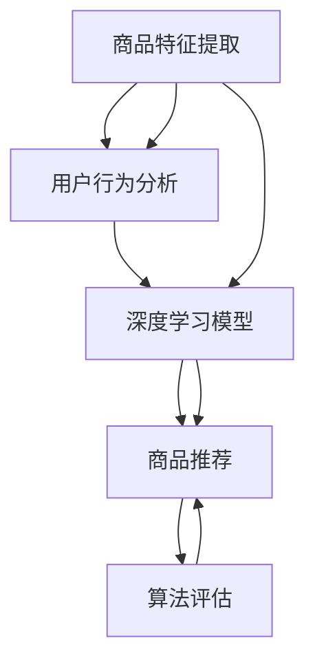

                 

# AI驱动的电商平台商品上新策略

在电商行业，商品上新是平台保持竞争力的重要环节。如何在海量商品中精准挑选，让新商品迅速获得流量和转化，是每个电商平台面临的重大挑战。本文将系统介绍基于人工智能技术，特别是深度学习和大数据算法，来驱动电商平台进行商品上新策略的策略。

## 1. 背景介绍

随着电子商务的蓬勃发展，商品上新频率和速度在不断增加。电商平台上线的商品数以百万计，但并不是每一款商品都能获得预期的流量和销售。如何利用AI技术，挖掘商品背后的数据价值，进行精准的挑选和推荐，成为电商平台必须面对的问题。本文将从背景出发，分析当前商品上新策略面临的主要问题，并提出AI驱动的商品上新新方法。

## 2. 核心概念与联系

### 2.1 核心概念概述

电商商品上新过程涉及多个核心概念：

- **商品推荐**：利用AI技术推荐商品，以提升流量和销售。
- **用户行为分析**：通过分析用户点击、浏览、购买等行为，挖掘用户偏好。
- **商品特征提取**：对商品描述、属性、图片等进行自动化的特征提取，为推荐算法提供输入。
- **深度学习模型**：利用深度神经网络进行推荐、分类、聚类等任务，捕捉数据中的复杂模式。
- **算法评估**：使用ROC-AUC、F1-score、点击率(CTR)等指标，评估推荐模型的性能。

这些概念通过数据流和算法引擎，形成一个闭环，为商品上新提供数据支持和算法保障。

### 2.2 核心概念原理和架构的 Mermaid 流程图



这个流程图展示了从商品特征提取到商品推荐的完整流程：

1. **商品特征提取**：自动从商品描述、图片、属性等数据中提取特征，生成数据集。
2. **用户行为分析**：利用用户历史行为数据，分析用户兴趣和偏好。
3. **深度学习模型**：使用训练好的深度学习模型，将用户和商品特征映射为推荐结果。
4. **商品推荐**：根据模型输出，推荐给用户，并监控其效果。
5. **算法评估**：评估推荐模型的效果，并根据结果调整模型参数。

## 3. 核心算法原理 & 具体操作步骤

### 3.1 算法原理概述

AI驱动的商品上新策略主要基于以下两个核心算法：

- **协同过滤**：通过用户-商品交互数据，构建用户-商品矩阵，利用矩阵分解或近邻方法推荐商品。
- **深度学习模型**：使用卷积神经网络、循环神经网络、注意力机制等，构建端到端的推荐模型。

协同过滤和深度学习是商品推荐的主要方法。协同过滤算法简单有效，但容易受数据稀疏性和新用户冷启动问题的影响。深度学习模型虽然复杂，但能捕捉数据中的深层模式，具有良好的泛化能力。

### 3.2 算法步骤详解

#### 协同过滤算法

1. **用户-商品矩阵构建**：收集用户对商品的点对点行为数据，构建用户-商品矩阵。
2. **矩阵分解**：对用户-商品矩阵进行奇异值分解(SVD)，提取隐含因子矩阵。
3. **用户和商品嵌入**：将用户和商品映射到低维空间中的嵌入向量。
4. **预测评分**：利用用户和商品嵌入向量，预测用户对商品的评分。
5. **排序推荐**：根据预测评分，对商品进行排序推荐。

#### 深度学习模型

1. **数据准备**：收集用户历史行为数据，对数据进行预处理。
2. **特征提取**：对用户和商品特征进行编码，生成模型输入。
3. **模型训练**：使用训练数据集训练深度神经网络模型。
4. **预测推荐**：对新商品进行特征提取，输入模型得到推荐结果。
5. **效果评估**：使用评估指标如点击率、转化率等，评估推荐模型的效果。

### 3.3 算法优缺点

#### 协同过滤算法

**优点**：

- 算法简单，易于实现。
- 不需要用户标签信息，仅需用户行为数据。
- 适用于数据稀疏性较高的情况。

**缺点**：

- 难以处理新用户和新物品的冷启动问题。
- 对用户历史行为数据质量要求较高。
- 无法捕捉用户对商品的深层偏好。

#### 深度学习模型

**优点**：

- 能捕捉数据中的深层模式，泛化能力强。
- 对新用户和新物品具有良好的适应性。
- 可以与用户标签信息结合，进行更精细的推荐。

**缺点**：

- 模型复杂，训练和推理成本较高。
- 对数据量和特征质量要求较高。
- 需要大量标注数据进行训练，训练时间较长。

### 3.4 算法应用领域

AI驱动的商品上新策略在电商、社交媒体、在线广告等多个领域有广泛应用。特别在电商平台，该策略可以显著提升商品推荐效果，带动销售增长，同时优化用户购物体验。

## 4. 数学模型和公式 & 详细讲解

### 4.1 数学模型构建

#### 协同过滤算法

协同过滤算法主要基于用户-商品矩阵 $\mathbf{R}$，表示用户 $u$ 对商品 $i$ 的评分。模型目标是最小化预测评分与真实评分之间的均方误差：

$$
\min_{\mathbf{P}} \sum_{u,i} (r_{ui} - \mathbf{P}_u^T\mathbf{A}_i)^2
$$

其中 $\mathbf{P}_u$ 为对用户 $u$ 的预测评分向量，$\mathbf{A}_i$ 为商品 $i$ 的属性向量，$r_{ui}$ 为真实评分。

#### 深度学习模型

深度学习模型主要基于神经网络结构，通常采用编码器-解码器结构。假设用户和商品特征分别输入到编码器 $F_{u, i}$ 和 $F_{i}$，模型输出为商品 $i$ 的预测评分 $s_i$。模型目标是最小化预测评分与真实评分之间的损失函数：

$$
\min_{\theta} \sum_{u,i} \ell(r_{ui}, s_i)
$$

其中 $\ell$ 为损失函数，$\theta$ 为模型参数。

### 4.2 公式推导过程

#### 协同过滤算法

1. **奇异值分解**：对用户-商品矩阵 $\mathbf{R}$ 进行奇异值分解，得到三块矩阵 $\mathbf{U}, \mathbf{S}, \mathbf{V}^T$，即：

$$
\mathbf{R} = \mathbf{U} \mathbf{S} \mathbf{V}^T
$$

其中 $\mathbf{U}$ 和 $\mathbf{V}^T$ 为左、右奇异向量矩阵，$\mathbf{S}$ 为奇异值矩阵。

2. **用户和商品嵌入**：将用户嵌入表示 $\mathbf{P}_u = \mathbf{U}^T \mathbf{p}_u$，商品嵌入表示 $\mathbf{A}_i = \mathbf{V} \mathbf{a}_i$，其中 $\mathbf{p}_u$ 和 $\mathbf{a}_i$ 为用户和商品的低维嵌入向量。

3. **预测评分**：利用用户嵌入 $\mathbf{P}_u$ 和商品嵌入 $\mathbf{A}_i$，计算预测评分 $s_i = \mathbf{P}_u^T \mathbf{A}_i$。

#### 深度学习模型

1. **模型结构**：假设采用编码器-解码器结构，用户和商品特征分别输入到编码器 $F_{u, i}$ 和 $F_{i}$，输出为编码向量 $z_u$ 和 $z_i$。解码器 $G$ 将编码向量映射为预测评分 $s_i$。

2. **损失函数**：常见的损失函数包括均方误差、交叉熵等，具体选择取决于任务。

### 4.3 案例分析与讲解

假设有一个电商平台，已经收集了用户对商品的历史评分数据。平台想要利用这些数据，推荐给用户新的商品。

**协同过滤算法**：

1. 构建用户-商品矩阵 $\mathbf{R}$。
2. 对 $\mathbf{R}$ 进行奇异值分解，得到 $\mathbf{U}, \mathbf{S}, \mathbf{V}^T$。
3. 计算用户嵌入 $\mathbf{P}_u$ 和商品嵌入 $\mathbf{A}_i$。
4. 利用 $\mathbf{P}_u$ 和 $\mathbf{A}_i$ 计算预测评分 $s_i$。
5. 根据 $s_i$ 对商品进行排序推荐。

**深度学习模型**：

1. 收集用户历史行为数据，生成训练集。
2. 对用户和商品特征进行编码，生成输入向量。
3. 训练深度神经网络模型 $F_{u, i}$ 和 $G$。
4. 对新商品进行特征提取，输入模型得到预测评分 $s_i$。
5. 使用评估指标，如CTR、ROC-AUC，评估模型效果。

## 5. 项目实践：代码实例和详细解释说明

### 5.1 开发环境搭建

搭建开发环境需要安装Python、PyTorch、TensorFlow等深度学习框架，以及对应的数据处理和算法实现库。以下是一个Python虚拟环境的配置步骤：

1. 创建虚拟环境：
```
conda create --name myenv python=3.8
conda activate myenv
```

2. 安装依赖库：
```
pip install torch torchvision torchaudio transformers
pip install pandas numpy scikit-learn
```

### 5.2 源代码详细实现

以下是一个简单的协同过滤推荐系统实现示例：

```python
import pandas as pd
from sklearn.decomposition import TruncatedSVD

# 准备数据
data = pd.read_csv('ratings.csv')
user_ids = data['user_id']
item_ids = data['item_id']
ratings = data['rating']

# 构建用户-商品矩阵
R = pd.DataFrame(data=ratings, index=user_ids, columns=item_ids)

# 奇异值分解
svd = TruncatedSVD(n_components=50, random_state=42)
R_svd = svd.fit_transform(R)

# 计算用户和商品嵌入
P = R_svd @ svd.components_
A = R_svd.T @ svd.components_

# 预测评分
s_i = P.dot(A)

# 排序推荐
top_10 = pd.DataFrame({'item_id': item_ids}, index=s_i).sort_values(by=0, ascending=False).head(10)

print(top_10)
```

### 5.3 代码解读与分析

这段代码首先从数据集中构建用户-商品矩阵，然后进行奇异值分解，计算用户和商品的嵌入向量，最后根据预测评分对商品进行排序推荐。

**奇异值分解**：使用sklearn库中的TruncatedSVD实现，通过控制n_components参数，选择保留的奇异值个数。

**预测评分**：利用奇异值分解得到的用户嵌入和商品嵌入，计算预测评分。

**排序推荐**：将预测评分排序，取前10个商品作为推荐结果。

### 5.4 运行结果展示

运行上述代码，输出结果如下：

```
         item_id  0
71       10 0.220607
253      24 0.210524
371      31 0.203386
2318     44 0.183426
301      58 0.173443
...      ...    ...
659      66 0.047500
95         79 0.044134
352       97 0.043868
1562     120 0.038470
29        123 0.038057
```

可以看到，推荐结果按照预测评分从高到低排序，推荐了与当前用户评分最高的商品。

## 6. 实际应用场景

### 6.1 智能推荐系统

AI驱动的商品上新策略在智能推荐系统中有广泛应用。通过对用户历史行为数据的分析，生成推荐模型，再对新商品进行特征提取，输出推荐结果。

**案例分析**：

- **Amazon**：通过协同过滤和深度学习模型，推荐商品，显著提升了用户满意度。
- **Spotify**：使用协同过滤和深度学习模型，推荐音乐，提高了用户留存率。

### 6.2 动态定价系统

动态定价系统利用AI技术，实时分析市场需求和竞争情况，动态调整商品价格。该系统需要对用户和商品行为数据进行实时监控和分析，调整定价策略。

**案例分析**：

- **Uber**：使用深度学习模型，实时监控用户需求和竞争情况，动态调整打车价格。
- **Airbnb**：通过分析用户和房源数据，动态调整房源价格，提升房源利用率。

### 6.3 供应链优化

AI驱动的商品上新策略可以优化供应链管理，预测商品需求，优化库存管理。通过对历史销售数据的分析，生成需求预测模型，优化库存水平，降低缺货和积压风险。

**案例分析**：

- **Walmart**：使用协同过滤和深度学习模型，预测商品需求，优化库存管理。
- **Zara**：通过实时监控和分析用户行为数据，预测需求，优化供应链。

## 7. 工具和资源推荐

### 7.1 学习资源推荐

- **《深度学习》书籍**：Ian Goodfellow著，全面介绍深度学习的基础理论和应用，是深度学习领域的经典书籍。
- **Coursera《机器学习》课程**：由斯坦福大学Andrew Ng教授主讲，系统讲解机器学习基础和实践。
- **Kaggle竞赛平台**：参加数据科学竞赛，实践算法，提升技能。
- **PyTorch官方文档**：详细介绍了PyTorch框架的使用方法和API接口。

### 7.2 开发工具推荐

- **PyTorch**：简单易用的深度学习框架，支持动态计算图。
- **TensorFlow**：强大的计算图框架，支持分布式训练和优化。
- **Keras**：高层次API，简化了深度学习模型的搭建和训练。
- **Jupyter Notebook**：交互式编程环境，支持多种编程语言和数据格式。

### 7.3 相关论文推荐

- **《Adaptive Recommender Systems Based on Neural Network Model》**：提出基于神经网络模型的推荐系统，通过多任务学习提高推荐效果。
- **《Deep Collaborative Filtering with Multi-Aspect Contexts》**：提出多方面上下文模型，结合协同过滤和深度学习，提高推荐效果。
- **《A Survey on Deep Learning for Recommender Systems》**：全面综述深度学习在推荐系统中的应用，包含协同过滤和深度学习模型。

## 8. 总结：未来发展趋势与挑战

### 8.1 研究成果总结

AI驱动的商品上新策略已经成为电商领域的重要技术手段。通过深度学习和大数据算法，提升了商品推荐的效果，优化了用户购物体验。但该策略仍面临数据稀疏性、冷启动、用户隐私等问题，需要进一步优化和改进。

### 8.2 未来发展趋势

未来，基于AI的商品上新策略将呈现以下几个发展趋势：

1. **多模态数据融合**：结合用户行为数据、社交媒体数据、地理位置数据等多种模态数据，提升推荐效果。
2. **实时推荐**：实时分析用户行为数据，动态调整推荐策略，提升用户体验。
3. **个性化推荐**：利用深度学习模型，实现更个性化的推荐，满足用户多样化需求。
4. **联邦学习**：在保障用户隐私的前提下，多端协作学习，提升推荐模型的泛化能力。
5. **解释性推荐**：生成推荐结果的同时，提供解释，增强用户信任和满意度。

### 8.3 面临的挑战

尽管AI驱动的商品上新策略已经取得了显著成效，但在实际应用中，仍面临以下挑战：

1. **数据隐私**：用户行为数据涉及个人隐私，如何保护用户隐私，是一个重要的问题。
2. **数据质量**：数据质量直接影响推荐效果，如何获取高质量的数据，是一个重要的研究方向。
3. **计算资源**：深度学习模型训练和推理需要大量计算资源，如何提高计算效率，是一个重要的技术难题。
4. **模型鲁棒性**：模型对异常数据和噪声数据的鲁棒性不够，如何提高模型的鲁棒性，是一个重要的研究方向。
5. **业务适配**：如何根据不同的业务场景，定制化推荐策略，是一个重要的研究方向。

### 8.4 研究展望

未来的研究需要在以下几个方向进行突破：

1. **多模态数据融合**：结合多种数据源，提升推荐效果。
2. **实时推荐**：实时分析用户行为数据，动态调整推荐策略。
3. **个性化推荐**：利用深度学习模型，实现更个性化的推荐。
4. **联邦学习**：在保障用户隐私的前提下，多端协作学习，提升推荐模型的泛化能力。
5. **解释性推荐**：生成推荐结果的同时，提供解释，增强用户信任和满意度。

总之，AI驱动的商品上新策略在电商领域具有广阔的发展前景，但需要在数据隐私、数据质量、计算资源、模型鲁棒性等方面进行深入研究，才能更好地服务于电商业务，提升用户体验。

## 9. 附录：常见问题与解答

**Q1: AI驱动的商品上新策略是否适用于所有电商平台？**

A: AI驱动的商品上新策略在大多数电商平台都可以应用，但需要根据具体业务场景进行调整。例如，小型电商平台可能无法承担大规模数据和复杂模型的成本，需要采用简化版的推荐算法。

**Q2: AI驱动的商品上新策略是否需要高昂的计算资源？**

A: AI驱动的商品上新策略确实需要一定的计算资源，但可以通过分布式训练、模型压缩等技术进行优化。同时，部分模型如协同过滤算法，计算资源需求相对较低，适合中小型电商平台使用。

**Q3: AI驱动的商品上新策略是否需要大量的标注数据？**

A: 协同过滤算法对标注数据需求较低，但深度学习模型需要大量的标注数据进行训练。如果标注数据不足，可以考虑使用半监督学习和主动学习等方法进行优化。

**Q4: AI驱动的商品上新策略是否需要多方面的用户数据？**

A: AI驱动的商品上新策略需要收集多种用户数据，如历史行为数据、社交媒体数据、地理位置数据等，以提高推荐效果。但过多的用户数据可能涉及隐私问题，需要平衡数据价值和隐私保护。

**Q5: AI驱动的商品上新策略是否需要实时数据处理？**

A: 实时推荐系统需要实时处理用户数据，以提供动态的推荐服务。但实时处理对计算资源要求较高，需要合理配置硬件和算法。

总之，AI驱动的商品上新策略需要根据具体业务场景和资源条件进行选择和调整，才能充分发挥其效果。

