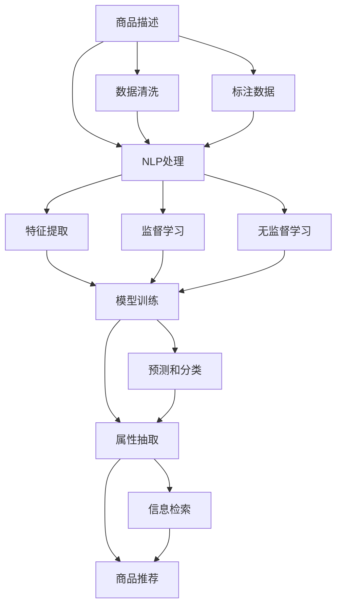

                 

# AI驱动的电商平台商品属性抽取

在当今电子商务蓬勃发展的时代，电商平台已经成为了人们购物的主要渠道。为了更好地满足用户需求，电商平台不仅提供丰富的商品种类，还通过商品描述、图片、评价等多种形式为消费者提供详细的商品信息。然而，商品描述中常常包含大量无关属性，导致用户在检索商品时容易受到干扰，影响用户体验。因此，商品属性抽取技术应运而生，旨在从商品描述中自动抽取有用的属性信息，辅助电商平台进行更精准的商品推荐和搜索。本文将详细介绍AI驱动的电商平台商品属性抽取技术，探讨其原理与实施方法，以及面临的挑战和未来展望。

## 1. 背景介绍

### 1.1 问题由来
随着互联网的普及，电商平台逐渐成为人们获取商品信息的重要来源。然而，电商平台上的商品描述往往冗长且杂乱，用户需要花费大量时间筛选并理解商品信息。为了提升用户体验，商品属性抽取技术应运而生。通过自动抽取商品的关键属性信息，商品属性抽取能够帮助用户快速找到所需商品，同时也为电商平台的商品推荐和搜索提供了支持。

商品属性抽取技术主要应用于以下场景：
- **商品推荐**：根据用户历史浏览记录，自动抽取商品属性信息，推荐相似商品。
- **智能搜索**：通过属性抽取技术，构建商品的属性索引，实现更加精准的搜索功能。
- **库存管理**：实时抽取商品属性信息，更新商品数据库，优化库存管理。

### 1.2 问题核心关键点
商品属性抽取的核心问题在于如何从商品描述中自动识别和提取关键属性信息。常见的关键属性包括尺寸、颜色、材质、品牌等。基于AI的商品属性抽取技术，主要通过自然语言处理和机器学习等手段，实现自动化的属性信息抽取和分类。

实现商品属性抽取的核心步骤包括：
1. **数据预处理**：对商品描述进行分词、去停用词、词性标注等处理。
2. **特征提取**：通过词袋模型、TF-IDF、Word2Vec等方法，将文本转换为数值特征向量。
3. **模型训练**：利用机器学习算法，如支持向量机、随机森林、深度学习等，训练分类模型。
4. **属性抽取**：利用训练好的模型，对商品描述进行属性分类和抽取。

## 2. 核心概念与联系

### 2.1 核心概念概述

为了更好地理解商品属性抽取技术，本节将介绍几个密切相关的核心概念：

- **自然语言处理（Natural Language Processing, NLP）**：涉及计算机处理自然语言的方法和技术，包括分词、词性标注、命名实体识别、情感分析等。
- **机器学习（Machine Learning, ML）**：通过数据驱动的方法，让机器从数据中学习规律，实现预测和分类等任务。
- **深度学习（Deep Learning, DL）**：基于神经网络，通过多层次的特征提取和数据表示，实现复杂的模型训练和预测。
- **迁移学习（Transfer Learning）**：将一个任务学到的知识迁移到另一个任务，通过预训练模型提升新任务的表现。
- **属性抽取（Attribute Extraction）**：从文本中识别和提取特定属性信息的过程，常用于商品描述处理、信息检索等领域。
- **商品推荐系统（Recommendation System）**：根据用户行为和商品特征，推荐用户可能感兴趣的商品。

这些核心概念之间的逻辑关系可以通过以下Mermaid流程图来展示：



这个流程图展示了大语言模型的核心概念及其之间的关系：

1. 商品描述经过自然语言处理和特征提取后，送入模型训练模块。
2. 训练好的模型用于属性抽取，获取商品的关键属性信息。
3. 提取出的属性信息用于商品推荐和信息检索。
4. 数据清洗和标注数据的准备是整个流程的基础。

## 3. 核心算法原理 & 具体操作步骤

### 3.1 算法原理概述

商品属性抽取的本质是通过文本挖掘和机器学习，从商品描述中自动抽取属性信息的过程。其核心思想是：将商品描述转换为计算机可处理的形式，利用机器学习模型从中识别和分类属性信息。

常见的商品属性抽取方法包括：
1. **规则匹配**：通过编写正则表达式或手动编写规则，提取特定格式的文本信息。
2. **基于词典的方法**：利用预先构建的词典，匹配商品描述中的属性关键词，进行属性抽取。
3. **基于统计的方法**：通过词频统计、TF-IDF等方法，从文本中提取重要特征。
4. **基于机器学习的方法**：利用机器学习模型，如决策树、随机森林、支持向量机等，从文本中学习属性分类规则。
5. **基于深度学习的方法**：通过深度神经网络，如卷积神经网络（CNN）、循环神经网络（RNN）、Transformer等，实现更加复杂的特征提取和分类任务。

### 3.2 算法步骤详解

基于深度学习的商品属性抽取主要包括以下几个关键步骤：

**Step 1: 数据预处理**
- 对商品描述进行分词、去停用词、词性标注等处理，构建词汇表。
- 将处理后的文本转换为数值特征向量，如词袋模型、TF-IDF等。

**Step 2: 模型选择与训练**
- 选择合适的深度学习模型，如CNN、RNN、Transformer等。
- 利用标注数据训练模型，调整模型超参数，优化模型性能。

**Step 3: 特征提取**
- 利用训练好的模型，对商品描述进行特征提取，得到文本的特征向量。

**Step 4: 属性分类**
- 利用分类模型，如SVM、随机森林等，对特征向量进行分类，得到商品属性标签。

**Step 5: 结果后处理**
- 对分类结果进行后处理，去除噪声和重复信息，构建属性词典。
- 将属性信息整合到商品数据库中，更新商品索引。

### 3.3 算法优缺点

基于深度学习的商品属性抽取方法具有以下优点：
1. 自动化程度高：通过机器学习模型自动完成属性抽取，减少了人工干预。
2. 泛化能力强：深度学习模型能够学习到更加复杂的特征，适应不同领域的商品描述。
3. 鲁棒性好：深度模型具有较强的泛化能力，能够适应数据分布的变化。

但同时，深度学习模型也存在一些缺点：
1. 计算成本高：深度学习模型参数量大，训练和推理需要大量计算资源。
2. 需要大量标注数据：深度学习模型需要大量标注数据进行训练，标注成本高。
3. 黑盒模型：深度学习模型难以解释其内部的决策过程，缺乏可解释性。

### 3.4 算法应用领域

商品属性抽取技术在电商平台中有着广泛的应用，主要包括以下几个方面：

1. **商品推荐**：通过抽取商品属性信息，构建商品的属性索引，提高推荐系统的精准度。
2. **信息检索**：利用属性信息优化搜索算法，实现更加精准的搜索功能。
3. **库存管理**：实时抽取商品属性信息，更新商品数据库，优化库存管理。
4. **广告投放**：通过分析商品属性信息，进行精准的广告投放，提高广告效果。
5. **市场分析**：利用属性信息分析市场趋势，为决策提供数据支持。

## 4. 数学模型和公式 & 详细讲解

### 4.1 数学模型构建

本节将使用数学语言对基于深度学习的商品属性抽取过程进行更加严格的刻画。

假设商品描述为文本 $x$，其对应的属性标签为 $y \in \{1, 2, \cdots, K\}$，其中 $K$ 为属性种类数。商品属性抽取的目标是训练一个模型 $f(x)$，使其能够预测文本 $x$ 对应的属性标签 $y$。

定义模型 $f(x)$ 在文本 $x$ 上的预测概率为 $\hat{y}=f(x)$，则分类任务的损失函数为：

$$
L(f(x)) = -\sum_{y=1}^K y \log f(x)
$$

其中 $f(x)$ 可以通过深度神经网络模型进行计算。

### 4.2 公式推导过程

以下我们以基于Transformer的商品属性抽取模型为例，推导其损失函数及其梯度的计算公式。

假设商品描述 $x$ 被输入到Transformer模型中，经过编码器（Encoder）和解码器（Decoder）后，得到特征向量 $h$。模型 $f(x)$ 预测文本 $x$ 对应的属性标签 $y$ 的概率为：

$$
\hat{y} = \text{softmax}(f(x))
$$

其中 $\text{softmax}(\cdot)$ 表示softmax函数，将向量 $f(x)$ 转换为概率分布。

模型的损失函数 $L(f(x))$ 定义为：

$$
L(f(x)) = -\log \hat{y}(y)
$$

其中 $y$ 为实际属性标签，$\hat{y}(y)$ 表示模型预测的 $y$ 对应的概率。

根据链式法则，损失函数对模型参数 $\theta$ 的梯度为：

$$
\frac{\partial L(f(x))}{\partial \theta} = -\frac{\partial \log \hat{y}(y)}{\partial f(x)} \frac{\partial f(x)}{\partial \theta}
$$

其中 $\frac{\partial f(x)}{\partial \theta}$ 为模型 $f(x)$ 对参数 $\theta$ 的梯度，可通过反向传播算法高效计算。

在得到损失函数的梯度后，即可带入参数更新公式，完成模型的迭代优化。重复上述过程直至收敛，最终得到适应属性抽取任务的最优模型参数 $\theta^*$。

## 5. 项目实践：代码实例和详细解释说明

### 5.1 开发环境搭建

在进行商品属性抽取项目实践前，我们需要准备好开发环境。以下是使用Python进行PyTorch开发的环境配置流程：

1. 安装Anaconda：从官网下载并安装Anaconda，用于创建独立的Python环境。

2. 创建并激活虚拟环境：
```bash
conda create -n pytorch-env python=3.8 
conda activate pytorch-env
```

3. 安装PyTorch：根据CUDA版本，从官网获取对应的安装命令。例如：
```bash
conda install pytorch torchvision torchaudio cudatoolkit=11.1 -c pytorch -c conda-forge
```

4. 安装TensorFlow：由Google主导开发的开源深度学习框架，生产部署方便，适合大规模工程应用。同样有丰富的预训练语言模型资源。

5. 安装Transformers库：HuggingFace开发的NLP工具库，集成了众多SOTA语言模型，支持PyTorch和TensorFlow，是进行商品属性抽取任务开发的利器。

6. 安装各类工具包：
```bash
pip install numpy pandas scikit-learn matplotlib tqdm jupyter notebook ipython
```

完成上述步骤后，即可在`pytorch-env`环境中开始商品属性抽取实践。

### 5.2 源代码详细实现

下面我们以基于Transformer的商品属性抽取模型为例，给出使用PyTorch代码实现。

首先，定义属性标签和词典：

```python
import torch
from torch.utils.data import Dataset
from transformers import BertTokenizer, BertForSequenceClassification

# 定义属性标签
labels = ['尺寸', '颜色', '材质', '品牌', '价格', '功能']

# 创建词典
tokenizer = BertTokenizer.from_pretrained('bert-base-uncased')

# 将属性标签转换为数值标签
label2idx = {label: i for i, label in enumerate(labels)}
```

然后，定义数据集和数据处理函数：

```python
class ProductDataset(Dataset):
    def __init__(self, products, tokenizer):
        self.products = products
        self.tokenizer = tokenizer
        
    def __len__(self):
        return len(self.products)
    
    def __getitem__(self, item):
        product = self.products[item]
        
        # 将商品描述转换为token ids
        encoding = self.tokenizer(product['description'], return_tensors='pt', max_length=128, padding='max_length', truncation=True)
        input_ids = encoding['input_ids'][0]
        attention_mask = encoding['attention_mask'][0]
        
        # 获取属性标签
        label = label2idx[product['attribute']]
        
        return {'input_ids': input_ids, 
                'attention_mask': attention_mask,
                'labels': torch.tensor(label, dtype=torch.long)}
```

接着，定义模型和优化器：

```python
# 定义属性分类模型
model = BertForSequenceClassification.from_pretrained('bert-base-uncased', num_labels=len(label2idx))

# 定义优化器
optimizer = torch.optim.Adam(model.parameters(), lr=2e-5)
```

最后，定义训练和评估函数：

```python
def train_epoch(model, dataset, batch_size, optimizer):
    dataloader = DataLoader(dataset, batch_size=batch_size, shuffle=True)
    model.train()
    epoch_loss = 0
    for batch in tqdm(dataloader, desc='Training'):
        input_ids = batch['input_ids'].to(device)
        attention_mask = batch['attention_mask'].to(device)
        labels = batch['labels'].to(device)
        model.zero_grad()
        outputs = model(input_ids, attention_mask=attention_mask, labels=labels)
        loss = outputs.loss
        epoch_loss += loss.item()
        loss.backward()
        optimizer.step()
    return epoch_loss / len(dataloader)

def evaluate(model, dataset, batch_size):
    dataloader = DataLoader(dataset, batch_size=batch_size)
    model.eval()
    preds, labels = [], []
    with torch.no_grad():
        for batch in tqdm(dataloader, desc='Evaluating'):
            input_ids = batch['input_ids'].to(device)
            attention_mask = batch['attention_mask'].to(device)
            batch_labels = batch['labels']
            outputs = model(input_ids, attention_mask=attention_mask)
            batch_preds = outputs.logits.argmax(dim=2).to('cpu').tolist()
            batch_labels = batch_labels.to('cpu').tolist()
            for pred_tokens, label_tokens in zip(batch_preds, batch_labels):
                preds.append(pred_tokens[:len(label_tokens)])
                labels.append(label_tokens)
                
    print(classification_report(labels, preds))
```

完成上述步骤后，即可在`pytorch-env`环境中开始商品属性抽取实践。

### 5.3 代码解读与分析

让我们再详细解读一下关键代码的实现细节：

**ProductDataset类**：
- `__init__`方法：初始化商品列表和分词器。
- `__len__`方法：返回商品列表的长度。
- `__getitem__`方法：对单个商品进行处理，将商品描述转换为token ids，并获取属性标签。

**label2idx字典**：
- 将属性标签转换为数值标签，方便模型训练。

**训练和评估函数**：
- 使用PyTorch的DataLoader对数据集进行批次化加载，供模型训练和推理使用。
- 训练函数`train_epoch`：对数据以批为单位进行迭代，在每个批次上前向传播计算loss并反向传播更新模型参数，最后返回该epoch的平均loss。
- 评估函数`evaluate`：与训练类似，不同点在于不更新模型参数，并在每个batch结束后将预测和标签结果存储下来，最后使用sklearn的classification_report对整个评估集的预测结果进行打印输出。

**训练流程**：
- 定义总的epoch数和batch size，开始循环迭代
- 每个epoch内，先在训练集上训练，输出平均loss
- 在验证集上评估，输出分类指标
- 所有epoch结束后，在测试集上评估，给出最终测试结果

可以看到，PyTorch配合Transformers库使得商品属性抽取的代码实现变得简洁高效。开发者可以将更多精力放在数据处理、模型改进等高层逻辑上，而不必过多关注底层的实现细节。

当然，工业级的系统实现还需考虑更多因素，如模型的保存和部署、超参数的自动搜索、更灵活的任务适配层等。但核心的抽取范式基本与此类似。

## 6. 实际应用场景

### 6.1 智能推荐系统

商品属性抽取技术可以广泛应用于智能推荐系统中。通过从商品描述中抽取属性信息，构建商品的属性索引，推荐系统可以更加精准地匹配用户需求，提高推荐效果。

在技术实现上，可以收集用户的历史浏览记录和点击行为，结合商品的属性信息，构建用户-商品关联矩阵。利用机器学习算法，如协同过滤、深度学习等，对关联矩阵进行预测，推荐用户可能感兴趣的商品。

### 6.2 个性化搜索

商品属性抽取技术可以帮助电商平台实现更加精准的搜索功能。用户可以通过属性筛选，快速找到符合自己需求的商品。

在搜索算法中，可以利用商品的属性信息构建索引，优化搜索逻辑。例如，用户可以筛选价格区间、品牌、颜色等属性，缩小搜索结果范围。商品属性抽取技术使得搜索算法能够更加灵活地处理用户查询，提高搜索效率。

### 6.3 库存管理

通过实时抽取商品属性信息，电商平台可以更精准地管理库存。例如，根据商品属性信息，动态调整商品的数量和位置，优化仓储布局，减少缺货和库存积压。

在库存管理系统，可以利用属性信息进行库存预警和优化。例如，当某商品的属性信息发生变动时，自动更新库存记录，确保数据的实时性和准确性。

### 6.4 未来应用展望

随着商品属性抽取技术的不断进步，未来将在更多领域得到应用，为电商平台带来变革性影响。

在智慧零售领域，基于商品属性抽取的推荐系统、搜索算法、库存管理等技术，将极大地提升购物体验和运营效率，促进零售行业的智能化转型。

在智慧城市治理中，利用商品属性抽取技术，可以实现对城市商品供需情况的实时监测和预测，为城市管理提供数据支持。例如，通过分析城市的商品流通情况，优化城市物资调配，提高应急物资的供应效率。

此外，在金融、医疗、教育等众多领域，商品属性抽取技术也将有广泛的应用前景。通过抽取商品的属性信息，可以为各领域提供更加精准的数据支持，提升决策的科学性和效率。

## 7. 工具和资源推荐

### 7.1 学习资源推荐

为了帮助开发者系统掌握商品属性抽取的理论基础和实践技巧，这里推荐一些优质的学习资源：

1. 《深度学习入门》系列博文：由大模型技术专家撰写，深入浅出地介绍了深度学习的基本概念和前沿技术，包括商品属性抽取在内的大模型应用。

2. CS231n《卷积神经网络》课程：斯坦福大学开设的计算机视觉明星课程，涵盖卷积神经网络的基本原理和应用，对商品属性抽取中的特征提取部分有详细的讲解。

3. 《自然语言处理综述》书籍：全面介绍了自然语言处理的基本概念和经典模型，对商品属性抽取中的文本处理和分类部分有深入的讲解。

4. HuggingFace官方文档：Transformers库的官方文档，提供了海量预训练模型和完整的商品属性抽取样例代码，是上手实践的必备资料。

5. TAC-OBJ-CMD Dataset：多商品属性分类数据集，用于训练和评估商品属性抽取模型，提供丰富的标注数据和实验指导。

通过对这些资源的学习实践，相信你一定能够快速掌握商品属性抽取的精髓，并用于解决实际的电商平台问题。

### 7.2 开发工具推荐

高效的开发离不开优秀的工具支持。以下是几款用于商品属性抽取开发的常用工具：

1. PyTorch：基于Python的开源深度学习框架，灵活动态的计算图，适合快速迭代研究。大部分预训练语言模型都有PyTorch版本的实现。

2. TensorFlow：由Google主导开发的开源深度学习框架，生产部署方便，适合大规模工程应用。同样有丰富的预训练语言模型资源。

3. Transformers库：HuggingFace开发的NLP工具库，集成了众多SOTA语言模型，支持PyTorch和TensorFlow，是进行商品属性抽取任务开发的利器。

4. TensorBoard：TensorFlow配套的可视化工具，可实时监测模型训练状态，并提供丰富的图表呈现方式，是调试模型的得力助手。

5. Weights & Biases：模型训练的实验跟踪工具，可以记录和可视化模型训练过程中的各项指标，方便对比和调优。与主流深度学习框架无缝集成。

合理利用这些工具，可以显著提升商品属性抽取任务的开发效率，加快创新迭代的步伐。

### 7.3 相关论文推荐

商品属性抽取技术的发展源于学界的持续研究。以下是几篇奠基性的相关论文，推荐阅读：

1. Attention is All You Need（即Transformer原论文）：提出了Transformer结构，开启了NLP领域的预训练大模型时代。

2. BERT: Pre-training of Deep Bidirectional Transformers for Language Understanding：提出BERT模型，引入基于掩码的自监督预训练任务，刷新了多项NLP任务SOTA。

3. Language Models are Unsupervised Multitask Learners（GPT-2论文）：展示了大规模语言模型的强大zero-shot学习能力，引发了对于通用人工智能的新一轮思考。

4. Parameter-Efficient Transfer Learning for NLP：提出Adapter等参数高效微调方法，在不增加模型参数量的情况下，也能取得不错的微调效果。

5. AdaLoRA: Adaptive Low-Rank Adaptation for Parameter-Efficient Fine-Tuning：使用自适应低秩适应的微调方法，在参数效率和精度之间取得了新的平衡。

这些论文代表了大语言模型微调技术的发展脉络。通过学习这些前沿成果，可以帮助研究者把握学科前进方向，激发更多的创新灵感。

## 8. 总结：未来发展趋势与挑战

### 8.1 总结

本文对基于深度学习的商品属性抽取技术进行了全面系统的介绍。首先阐述了商品属性抽取问题的背景和重要性，明确了属性抽取在电商平台中的应用场景和核心问题。其次，从原理到实践，详细讲解了深度学习商品属性抽取的数学模型和实现方法，给出了商品属性抽取任务开发的完整代码实例。同时，本文还广泛探讨了商品属性抽取技术在多个行业领域的应用前景，展示了其巨大的潜力。此外，本文精选了商品属性抽取技术的各类学习资源，力求为读者提供全方位的技术指引。

通过本文的系统梳理，可以看到，基于深度学习的商品属性抽取技术正在成为电商平台的核心技术之一，极大地提升了商品推荐的精准度和搜索效率，为电商平台的智能化转型提供了有力支持。未来，伴随深度学习模型和算法的发展，商品属性抽取技术必将进一步拓展其应用范围，推动电商平台的进一步创新和优化。

### 8.2 未来发展趋势

展望未来，商品属性抽取技术将呈现以下几个发展趋势：

1. 模型规模持续增大。随着算力成本的下降和数据规模的扩张，深度学习模型的参数量还将持续增长。超大规模语言模型蕴含的丰富语言知识，有望支撑更加复杂多变的商品描述处理。

2. 微调方法日趋多样。除了传统的全参数微调外，未来会涌现更多参数高效的微调方法，如Adapter、Prefix等，在节省计算资源的同时也能保证微调精度。

3. 持续学习成为常态。随着商品描述数据分布的变化，商品属性抽取模型也需要持续学习新知识以保持性能。如何在不遗忘原有知识的同时，高效吸收新数据信息，将成为重要的研究课题。

4. 标注样本需求降低。受启发于提示学习(Prompt-based Learning)的思路，未来的商品属性抽取方法将更好地利用深度学习模型的语言理解能力，通过更加巧妙的任务描述，在更少的标注样本上也能实现理想的属性抽取效果。

5. 多模态微调崛起。当前的商品属性抽取主要聚焦于文本数据，未来会进一步拓展到图像、视频、语音等多模态数据微调。多模态信息的融合，将显著提升商品属性抽取模型的鲁棒性和泛化能力。

6. 模型通用性增强。经过海量商品的预训练和多领域任务的微调，未来的商品属性抽取模型将具备更强的泛化性和适应性，逐步迈向通用人工智能(AGI)的目标。

以上趋势凸显了商品属性抽取技术的广阔前景。这些方向的探索发展，必将进一步提升电商平台的技术水平，为消费者提供更加优质的购物体验。

### 8.3 面临的挑战

尽管商品属性抽取技术已经取得了显著进展，但在迈向更加智能化、普适化应用的过程中，仍面临诸多挑战：

1. 标注成本瓶颈。虽然深度学习模型能够自动抽取商品属性信息，但仍需大量的标注数据进行训练和验证。对于部分小众商品，获取高质量标注数据的成本较高。如何进一步降低标注成本，提升模型的泛化能力，仍是一大难题。

2. 模型鲁棒性不足。商品描述文本存在大量噪声和干扰信息，模型的鲁棒性不足可能导致属性抽取的准确性降低。如何在噪声环境中提高模型的鲁棒性，需要进一步探索。

3. 推理效率有待提高。深度学习模型虽然精度高，但在实际部署时往往面临推理速度慢、内存占用大等效率问题。如何优化模型结构，提高推理效率，优化资源占用，将是重要的优化方向。

4. 可解释性亟需加强。深度学习模型通常是一个"黑盒"系统，难以解释其内部的决策过程，缺乏可解释性。对于电商平台的决策和监管，可解释性尤为重要。如何赋予模型更强的可解释性，将是亟待攻克的难题。

5. 安全性有待保障。深度学习模型难免会学习到有偏见、有害的信息，通过属性抽取传递到电商平台上，可能产生误导性、歧视性的输出。如何从数据和算法层面消除模型偏见，避免恶意用途，确保输出的安全性，也将是重要的研究课题。

6. 知识整合能力不足。现有的商品属性抽取模型往往局限于商品描述文本，难以灵活吸收和运用更广泛的先验知识。如何让属性抽取过程更好地与外部知识库、规则库等专家知识结合，形成更加全面、准确的信息整合能力，还有很大的想象空间。

正视商品属性抽取面临的这些挑战，积极应对并寻求突破，将是大模型微调技术走向成熟的必由之路。相信随着学界和产业界的共同努力，这些挑战终将一一被克服，商品属性抽取技术必将为电商平台带来更大的价值。

### 8.4 研究展望

面对商品属性抽取所面临的种种挑战，未来的研究需要在以下几个方面寻求新的突破：

1. 探索无监督和半监督学习范式。摆脱对大规模标注数据的依赖，利用自监督学习、主动学习等无监督和半监督范式，最大限度利用非结构化数据，实现更加灵活高效的商品属性抽取。

2. 研究参数高效和计算高效的微调范式。开发更加参数高效的微调方法，在固定大部分预训练参数的同时，只更新极少量的任务相关参数。同时优化模型的计算图，减少前向传播和反向传播的资源消耗，实现更加轻量级、实时性的部署。

3. 融合因果和对比学习范式。通过引入因果推断和对比学习思想，增强商品属性抽取模型建立稳定因果关系的能力，学习更加普适、鲁棒的商品描述特征，从而提升模型的泛化性和抗干扰能力。

4. 引入更多先验知识。将符号化的先验知识，如知识图谱、逻辑规则等，与神经网络模型进行巧妙融合，引导商品属性抽取过程学习更准确、合理的商品描述特征。同时加强不同模态数据的整合，实现视觉、语音等多模态信息与文本信息的协同建模。

5. 结合因果分析和博弈论工具。将因果分析方法引入商品属性抽取模型，识别出模型决策的关键特征，增强输出解释的因果性和逻辑性。借助博弈论工具刻画人机交互过程，主动探索并规避模型的脆弱点，提高系统稳定性。

6. 纳入伦理道德约束。在模型训练目标中引入伦理导向的评估指标，过滤和惩罚有偏见、有害的输出倾向。同时加强人工干预和审核，建立模型行为的监管机制，确保输出的安全性。

这些研究方向的探索，必将引领商品属性抽取技术迈向更高的台阶，为电商平台带来更多的价值和创新。面向未来，商品属性抽取技术还需要与其他人工智能技术进行更深入的融合，如知识表示、因果推理、强化学习等，多路径协同发力，共同推动电商平台的智能化转型。只有勇于创新、敢于突破，才能不断拓展商品属性抽取的边界，让智能技术更好地造福电商平台。

## 9. 附录：常见问题与解答

**Q1：商品属性抽取是否适用于所有商品描述？**

A: 商品属性抽取技术主要适用于商品描述中包含明确属性信息的文本。对于一些模糊或无明确属性描述的商品，如艺术品、古董等，其属性信息难以标准化和抽取，因此商品属性抽取效果可能不佳。

**Q2：如何提升商品属性抽取的鲁棒性？**

A: 提升商品属性抽取的鲁棒性可以从以下几个方面入手：
1. 数据增强：通过添加噪声、回译等方法，扩充训练数据集，增强模型的泛化能力。
2. 正则化：使用L2正则、Dropout等技术，防止模型过拟合，提升鲁棒性。
3. 对抗训练：引入对抗样本，训练模型对噪声和干扰有更强的抵抗能力。
4. 多任务学习：结合多个商品属性抽取任务，共同训练模型，提高鲁棒性。

**Q3：商品属性抽取在落地部署时需要注意哪些问题？**

A: 将商品属性抽取模型转化为实际应用，还需要考虑以下因素：
1. 模型裁剪：去除不必要的层和参数，减小模型尺寸，加快推理速度。
2. 量化加速：将浮点模型转为定点模型，压缩存储空间，提高计算效率。
3. 服务化封装：将模型封装为标准化服务接口，便于集成调用。
4. 弹性伸缩：根据请求流量动态调整资源配置，平衡服务质量和成本。
5. 监控告警：实时采集系统指标，设置异常告警阈值，确保服务稳定性。

商品属性抽取技术的落地应用需要多方面的考虑和优化，只有从数据、算法、工程、业务等多个维度协同发力，才能真正实现模型的高效部署和应用。

---

作者：禅与计算机程序设计艺术 / Zen and the Art of Computer Programming

