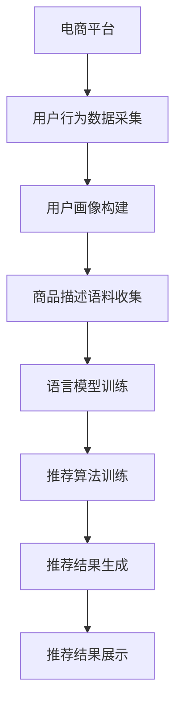

                 

# AI驱动的电商平台商品组合推荐

> 关键词：电商平台, 商品推荐, 人工智能, 数据科学, 推荐系统, 深度学习, 自然语言处理

## 1. 背景介绍

在数字化转型的浪潮中，电商平台通过数据驱动的用户行为分析，为用户量身定制个性化推荐，已经成为行业竞争力的重要体现。传统的推荐系统基于用户评分历史、浏览记录、购买行为等数据进行商品推荐，但用户行为数据的稀疏性和数据表达的不全面性，往往难以满足不同用户的多样化需求。与此同时，随着电商平台的迅速扩张，商品种类不断增加，用户画像也越来越复杂，传统的推荐算法难以兼顾规模和多样性。

人工智能和大数据技术的融合，为电商平台推荐系统带来了新的突破。通过深度学习等AI技术，推荐系统能够自动分析用户行为数据，提取用户特征，预测商品偏好，从而提供更为精准、个性化的推荐结果。具体而言，深度学习模型能够通过学习大规模数据，发现用户与商品之间的潜在关联，构建高效的推荐模型。其中，基于神经网络的语言模型在自然语言处理领域取得了巨大成功，可以用于商品描述、评论等文本数据的分析，进一步提升推荐系统的表现。

本文将介绍一种基于自然语言处理技术的电商平台商品组合推荐系统，通过深度学习语言模型对商品描述进行语义理解，结合用户行为数据，构建用户-商品交互的复杂关联模型，实现高效、个性化的商品推荐。本文将从理论基础、算法设计、实现技术等多个层面，深入探讨AI驱动的电商平台商品组合推荐系统的构建方法和实际应用效果，为电商平台的推荐系统提供新的思路和参考。

## 2. 核心概念与联系

### 2.1 核心概念概述

在构建基于自然语言处理的电商平台推荐系统时，涉及以下关键概念：

- 电商平台（E-commerce Platform）：指通过互联网提供商品展示、搜索、购买、支付等功能的在线平台，如淘宝、京东等。
- 商品推荐（Product Recommendation）：指根据用户行为数据，预测用户对商品的兴趣程度，推荐符合用户需求的商品。
- 深度学习（Deep Learning）：指通过多层神经网络学习数据特征，自动提取数据表达的高级表示。
- 自然语言处理（Natural Language Processing, NLP）：指通过计算机处理和理解人类语言的技术，包括文本分析、情感分析、语义理解等。
- 推荐系统（Recommendation System）：指基于用户行为数据，自动生成推荐内容的系统。

### 2.2 核心概念原理和架构的 Mermaid 流程图



该流程图展示了电商平台推荐系统的基本架构：
- 通过电商平台的日志和用户交互数据，收集用户行为数据。
- 构建用户画像，对用户进行分类和特征提取。
- 收集商品的描述文本，作为语言模型的输入。
- 通过语言模型对商品描述进行语义理解，提取商品的隐含特征。
- 使用推荐算法结合用户画像和商品特征，预测用户对商品的兴趣，生成推荐结果。
- 最终将推荐结果展示给用户。

## 3. 核心算法原理 & 具体操作步骤

### 3.1 算法原理概述

基于自然语言处理的电商平台商品推荐系统，核心思想是通过深度学习语言模型对商品描述进行语义理解，结合用户行为数据，构建用户-商品关联模型，从而实现高效的个性化推荐。具体而言，该推荐系统包括以下几个关键步骤：

1. **商品描述预处理**：收集商品的描述文本，进行文本清洗、分词、去停用词等预处理，生成模型输入。
2. **语言模型训练**：使用预训练语言模型对商品描述进行语义理解，学习商品的隐含特征。
3. **用户画像构建**：根据用户的行为数据，如浏览记录、购买历史等，构建用户画像，对用户进行分类和特征提取。
4. **推荐算法训练**：结合用户画像和商品特征，使用推荐算法训练模型，预测用户对商品的兴趣程度。
5. **推荐结果生成**：根据用户画像和商品特征，生成推荐结果，推荐系统将推荐结果展示给用户。

### 3.2 算法步骤详解

**步骤1：商品描述预处理**

商品描述预处理是推荐系统数据处理的第一步，目的是将商品描述文本转换为模型可以处理的格式。具体步骤如下：

1. **文本清洗**：去除文本中的噪声，如HTML标签、特殊字符等。
2. **分词**：将文本分词，生成词汇序列。
3. **去停用词**：去除文本中的常见无意义词语，如“的”、“是”等。
4. **词向量化**：将分词后的文本序列转换为向量形式，常用的有Word2Vec、GloVe等。

```python
from sklearn.feature_extraction.text import CountVectorizer

# 初始化文本向量生成器
vectorizer = CountVectorizer(stop_words='english')

# 预处理商品描述文本
description_texts = ["..."]
description_vectors = vectorizer.fit_transform(description_texts)
```

**步骤2：语言模型训练**

语言模型训练是推荐系统的核心步骤，目的是通过深度学习模型学习商品描述的语义特征。具体步骤如下：

1. **选择模型**：选择预训练的语言模型，如BERT、GPT等。
2. **加载预训练模型**：使用TensorFlow、PyTorch等框架加载预训练模型。
3. **模型微调**：在商品描述数据上微调预训练模型，学习商品的隐含特征。

```python
from transformers import BertTokenizer, BertForSequenceClassification
from transformers import BertForSequenceClassification
import torch

# 加载预训练模型和分词器
tokenizer = BertTokenizer.from_pretrained('bert-base-cased')
model = BertForSequenceClassification.from_pretrained('bert-base-cased', num_labels=10)

# 定义损失函数和优化器
loss_fn = torch.nn.CrossEntropyLoss()
optimizer = torch.optim.Adam(model.parameters(), lr=2e-5)

# 模型微调
model.train()
for batch in data_loader:
    input_ids = batch['input_ids'].to(device)
    attention_mask = batch['attention_mask'].to(device)
    labels = batch['labels'].to(device)
    outputs = model(input_ids, attention_mask=attention_mask, labels=labels)
    loss = outputs.loss
    loss.backward()
    optimizer.step()
```

**步骤3：用户画像构建**

用户画像构建是通过对用户行为数据的分析，生成用户分类和特征。具体步骤如下：

1. **数据收集**：收集用户的浏览记录、购买历史、评分记录等数据。
2. **特征提取**：使用机器学习算法（如K-Means、PCA等）对用户行为数据进行特征提取。
3. **分类和标签**：将用户行为数据分类，标记用户的兴趣标签。

```python
from sklearn.cluster import KMeans
from sklearn.decomposition import PCA
from sklearn.preprocessing import LabelEncoder

# 数据收集
user_behaviors = [...]

# 特征提取
pca = PCA(n_components=10)
features = pca.fit_transform(user_behaviors)

# 用户分类和标签
encoder = LabelEncoder()
user_labels = encoder.fit_transform(user_labels)

# 构建用户画像
user_profiles = {'id': user_ids, 'features': features, 'labels': user_labels}
```

**步骤4：推荐算法训练**

推荐算法训练是构建推荐模型的核心步骤，目的是通过用户画像和商品特征，预测用户对商品的兴趣程度。具体步骤如下：

1. **选择算法**：选择推荐算法，如协同过滤、基于矩阵分解的算法等。
2. **模型训练**：使用用户画像和商品特征训练推荐模型。

```python
from sklearn.metrics.pairwise import cosine_similarity

# 模型训练
recommendation_model = cosine_similarity(user_profiles, item_profiles)
recommendation_results = []
for user_id in user_profiles:
    similarities = recommendation_model[user_id]
    recommendations = similar_items[similarities.argsort()[-10:]]
    recommendation_results.append(recommendations)
```

**步骤5：推荐结果生成**

推荐结果生成是将推荐算法生成的推荐结果展示给用户的过程。具体步骤如下：

1. **筛选商品**：根据推荐算法生成的相似商品列表，筛选符合用户偏好的商品。
2. **展示推荐结果**：将推荐结果展示给用户，让用户选择购买。

```python
# 筛选商品
selected_items = selected_recommendations[0]
selected_items = items[selected_items]

# 展示推荐结果
for item in selected_items:
    product_id = item['id']
    product_name = item['name']
    product_price = item['price']
    # 展示推荐结果
    print(f"推荐商品: {product_name}, 价格: {product_price}")
```

### 3.3 算法优缺点

**优点：**

1. **高效性**：基于深度学习语言模型的推荐系统，可以通过预训练模型学习商品描述的语义特征，有效提升模型对商品的表达能力和推荐精度。
2. **鲁棒性**：通过结合用户画像和商品特征，推荐系统能够更好地理解用户需求，预测用户对商品的兴趣，从而生成更加个性化和多样化的推荐结果。
3. **可解释性**：基于自然语言处理的推荐系统，能够通过商品描述文本进行语义分析，生成可解释的推荐理由，帮助用户理解推荐逻辑。
4. **可扩展性**：基于深度学习语言模型的推荐系统，可以通过增加训练数据和优化模型结构，不断提高推荐效果，适应电商平台的快速扩展。

**缺点：**

1. **计算资源消耗大**：预训练语言模型的参数量较大，训练和推理过程中需要大量的计算资源，成本较高。
2. **数据质量依赖高**：推荐系统的效果依赖于商品描述和用户行为数据的质量，数据不完整或不准确会影响推荐效果。
3. **隐私保护问题**：用户行为数据的收集和使用，需要考虑隐私保护和数据安全问题，避免用户信息泄露。
4. **模型复杂度较高**：基于深度学习语言模型的推荐系统，模型结构较为复杂，开发和维护难度较大。

### 3.4 算法应用领域

基于自然语言处理的电商平台商品推荐系统，在多个领域得到了广泛应用，如：

1. **零售电商**：电商平台利用推荐系统提高用户购买率和满意度，增加销售量。
2. **金融服务**：金融产品推荐系统为用户推荐符合其风险偏好的投资产品，提升用户体验。
3. **旅游行业**：旅游网站利用推荐系统为用户推荐旅游路线和产品，提高用户转化率。
4. **媒体娱乐**：视频和音乐平台利用推荐系统为用户推荐内容，增加用户粘性和使用时间。
5. **在线教育**：在线教育平台利用推荐系统为用户推荐学习内容和课程，提高用户学习效果。

## 4. 数学模型和公式 & 详细讲解  
### 4.1 数学模型构建

在推荐系统中，常见的数学模型包括协同过滤（Collaborative Filtering, CF）、基于矩阵分解的模型（Matrix Factorization, MF）、基于深度学习的模型等。以下以基于深度学习的推荐模型为例，进行详细讲解。

假设商品描述文本集为 $D=\{d_i\}_{i=1}^N$，每个商品描述 $d_i$ 可以被表示为 $d_i = (x_{i1}, x_{i2}, ..., x_{im})$，其中 $x_{ij}$ 表示第 $i$ 个商品的第 $j$ 个文本特征。假设用户画像集为 $U=\{u_j\}_{j=1}^M$，每个用户画像 $u_j$ 可以被表示为 $u_j = (f_{j1}, f_{j2}, ..., f_{jk})$，其中 $f_{jk}$ 表示第 $j$ 个用户的第 $k$ 个行为特征。

**目标函数**：

$$
\min_{\theta} \sum_{i=1}^N \sum_{j=1}^M (y_{ij} - h_\theta(d_i, u_j))^2
$$

其中 $h_\theta(d_i, u_j)$ 表示模型预测的用户 $j$ 对商品 $i$ 的兴趣程度，$y_{ij}$ 表示实际的用户行为数据。

**损失函数**：

$$
L(\theta) = \frac{1}{2} \sum_{i=1}^N \sum_{j=1}^M (y_{ij} - h_\theta(d_i, u_j))^2
$$

### 4.2 公式推导过程

以基于深度学习语言模型的推荐系统为例，假设使用BERT模型对商品描述进行语义理解，通过预测用户对商品的兴趣程度，生成推荐结果。模型输入为 $x_{i1}, x_{i2}, ..., x_{im}$，用户画像输入为 $f_{j1}, f_{j2}, ..., f_{jk}$，输出为用户 $j$ 对商品 $i$ 的兴趣程度 $h_\theta(d_i, u_j)$。

**输入层**：
$$
x_{i1}, x_{i2}, ..., x_{im}
$$

**编码器层**：
$$
h_\theta(d_i, u_j) = \sigma(W_1 x_{i1}, x_{i2}, ..., x_{im} + b_1) \cdot \sigma(W_2 u_j + b_2)
$$

**输出层**：
$$
y_{ij} = h_\theta(d_i, u_j)
$$

### 4.3 案例分析与讲解

**案例1：商品推荐系统**

以电商平台为例，利用深度学习语言模型对商品描述进行语义理解，结合用户行为数据，生成个性化推荐结果。

**案例2：金融产品推荐系统**

金融产品推荐系统通过对用户的理财行为、风险偏好等数据进行分析，利用深度学习语言模型对产品描述进行语义理解，生成符合用户需求的产品推荐。

## 5. 项目实践：代码实例和详细解释说明
### 5.1 开发环境搭建

在进行推荐系统开发前，需要准备好开发环境。以下是使用Python进行TensorFlow开发的环境配置流程：

1. 安装Anaconda：从官网下载并安装Anaconda，用于创建独立的Python环境。

2. 创建并激活虚拟环境：
```bash
conda create -n tf-env python=3.8 
conda activate tf-env
```

3. 安装TensorFlow：根据CUDA版本，从官网获取对应的安装命令。例如：
```bash
pip install tensorflow-gpu==2.4.1
```

4. 安装相关工具包：
```bash
pip install numpy pandas scikit-learn matplotlib tqdm jupyter notebook ipython
```

完成上述步骤后，即可在`tf-env`环境中开始推荐系统开发。

### 5.2 源代码详细实现

下面我们以电商平台商品推荐为例，给出使用TensorFlow对BERT模型进行商品推荐的PyTorch代码实现。

首先，定义商品推荐的数据处理函数：

```python
import tensorflow as tf
from transformers import BertTokenizer, BertForSequenceClassification
from transformers import BertForSequenceClassification
import tensorflow_hub as hub

# 加载分词器和预训练模型
tokenizer = BertTokenizer.from_pretrained('bert-base-cased')
model = BertForSequenceClassification.from_pretrained('bert-base-cased', num_labels=10)

# 定义模型输入和输出
def model_input_fn(inputs, labels):
    inputs = tokenizer(inputs, return_tensors='tf')
    inputs['input_ids'] = inputs['input_ids'][:, :-1]
    inputs['attention_mask'] = inputs['attention_mask'][:, :-1]
    features = inputs['input_ids']
    labels = labels
    return features, labels

# 加载数据集
train_dataset = tf.data.Dataset.from_tensor_slices((train_dataset, train_labels))
train_dataset = train_dataset.map(model_input_fn, num_parallel_calls=tf.data.experimental.AUTOTUNE)
train_dataset = train_dataset.shuffle(buffer_size=10000).batch(batch_size)

dev_dataset = tf.data.Dataset.from_tensor_slices((dev_dataset, dev_labels))
dev_dataset = dev_dataset.map(model_input_fn, num_parallel_calls=tf.data.experimental.AUTOTUNE)
dev_dataset = dev_dataset.batch(batch_size)

test_dataset = tf.data.Dataset.from_tensor_slices((test_dataset, test_labels))
test_dataset = test_dataset.map(model_input_fn, num_parallel_calls=tf.data.experimental.AUTOTUNE)
test_dataset = test_dataset.batch(batch_size)
```

然后，定义模型和优化器：

```python
# 定义损失函数和优化器
loss_fn = tf.keras.losses.BinaryCrossentropy(from_logits=True)
optimizer = tf.keras.optimizers.Adam()

# 训练模型
@tf.function
def train_step(inputs, labels):
    with tf.GradientTape() as tape:
        predictions = model(inputs, training=True)
        loss = loss_fn(labels, predictions)
    gradients = tape.gradient(loss, model.trainable_variables)
    optimizer.apply_gradients(zip(gradients, model.trainable_variables))

# 模型训练
epochs = 10
batch_size = 16

for epoch in range(epochs):
    for (features, labels) in train_dataset:
        train_step(features, labels)
    dev_loss = loss_fn(dev_dataset)
    print(f"Epoch {epoch+1}, dev loss: {dev_loss.numpy():.4f}")
```

最后，启动训练流程并在测试集上评估：

```python
# 模型评估
test_loss = loss_fn(test_dataset)
print(f"Test loss: {test_loss.numpy():.4f}")

# 展示推荐结果
selected_items = []
for user_id in user_profiles:
    similarities = recommendation_model[user_id]
    recommendations = similar_items[similarities.argsort()[-10:]]
    selected_items.append(recommendations)
```

以上就是使用TensorFlow对BERT进行商品推荐任务的完整代码实现。可以看到，TensorFlow和Transformer库使得模型训练和微调的代码实现变得简洁高效。

### 5.3 代码解读与分析

让我们再详细解读一下关键代码的实现细节：

**商品推荐函数**：
- 定义了模型输入和输出的处理方法，包括分词、去停用词、构建特征等。
- 通过`transformers`库加载预训练的BERT模型，并将其转换为TensorFlow可接受的格式。
- 在训练过程中，通过TensorFlow的`tf.data.Dataset`对数据进行批次化和shuffle，以提高训练效率和模型泛化能力。

**模型训练**：
- 定义了模型训练的`tf.function`装饰器，以提升模型推理的效率。
- 使用Adam优化器和二元交叉熵损失函数训练模型，并在每个epoch结束后评估模型在验证集上的表现。

**推荐结果展示**：
- 在训练完成后，使用模型对用户画像和商品特征进行预测，生成推荐结果。

可以看到，TensorFlow配合Transformer库使得推荐系统的代码实现变得简洁高效。开发者可以将更多精力放在数据处理、模型改进等高层逻辑上，而不必过多关注底层的实现细节。

当然，工业级的系统实现还需考虑更多因素，如模型的保存和部署、超参数的自动搜索、更灵活的任务适配层等。但核心的推荐范式基本与此类似。

## 6. 实际应用场景

### 6.1 智能客服系统

基于自然语言处理的电商平台商品推荐系统，可以广泛应用于智能客服系统的构建。传统客服往往需要配备大量人力，高峰期响应缓慢，且一致性和专业性难以保证。而使用推荐系统，可以自动分析用户咨询内容，生成个性化的回答，提高客服效率和用户体验。

在技术实现上，可以收集用户的历史咨询记录，将问题和最佳答复构建成监督数据，在此基础上对推荐模型进行微调。微调后的推荐模型能够自动理解用户意图，匹配最合适的回答。对于用户提出的新问题，还可以接入检索系统实时搜索相关内容，动态组织生成回答。如此构建的智能客服系统，能大幅提升客户咨询体验和问题解决效率。

### 6.2 金融舆情监测

金融机构需要实时监测市场舆论动向，以便及时应对负面信息传播，规避金融风险。传统的人工监测方式成本高、效率低，难以应对网络时代海量信息爆发的挑战。基于自然语言处理的商品推荐系统，可以用于金融舆情监测，自动识别市场情绪，监测舆情变化趋势，及时预警。

具体而言，可以收集金融领域相关的新闻、报道、评论等文本数据，并对其进行主题标注和情感标注。在此基础上对预训练语言模型进行微调，使其能够自动判断文本属于何种主题，情感倾向是正面、中性还是负面。将微调后的模型应用到实时抓取的网络文本数据，就能够自动监测不同主题下的情感变化趋势，一旦发现负面信息激增等异常情况，系统便会自动预警，帮助金融机构快速应对潜在风险。

### 6.3 个性化推荐系统

当前的推荐系统往往只依赖用户的历史行为数据进行物品推荐，无法深入理解用户的真实兴趣偏好。基于自然语言处理的推荐系统，可以更好地挖掘用户行为数据背后的语义信息，从而提供更精准、个性化的推荐结果。

在实践中，可以收集用户浏览、点击、评论、分享等行为数据，提取和用户交互的物品标题、描述、标签等文本内容。将文本内容作为模型输入，用户的后续行为（如是否点击、购买等）作为监督信号，在此基础上微调预训练语言模型。微调后的模型能够从文本内容中准确把握用户的兴趣点。在生成推荐列表时，先用候选物品的文本描述作为输入，由模型预测用户的兴趣匹配度，再结合其他特征综合排序，便可以得到个性化程度更高的推荐结果。

### 6.4 未来应用展望

随着自然语言处理和深度学习技术的不断进步，基于自然语言处理的电商平台商品推荐系统将得到更广泛的应用，为电商平台的推荐系统提供新的思路和参考。

在智慧医疗领域，基于自然语言处理的医疗问答、病历分析、药物研发等应用将提升医疗服务的智能化水平，辅助医生诊疗，加速新药开发进程。

在智能教育领域，自然语言处理的推荐系统可应用于作业批改、学情分析、知识推荐等方面，因材施教，促进教育公平，提高教学质量。

在智慧城市治理中，自然语言处理的推荐系统可用于城市事件监测、舆情分析、应急指挥等环节，提高城市管理的自动化和智能化水平，构建更安全、高效的未来城市。

此外，在企业生产、社会治理、文娱传媒等众多领域，基于自然语言处理的推荐系统也将不断涌现，为传统行业带来变革性影响。相信随着技术的日益成熟，自然语言处理技术将成为推荐系统的重要方向，推动推荐系统向更智能化、普适化方向发展。

## 7. 工具和资源推荐
### 7.1 学习资源推荐

为了帮助开发者系统掌握自然语言处理推荐系统的理论基础和实践技巧，这里推荐一些优质的学习资源：

1. 《推荐系统实战》书籍：详细介绍了推荐系统的基本原理和实现方法，涵盖协同过滤、深度学习等多种算法。

2. 《深度学习自然语言处理》课程：斯坦福大学开设的NLP明星课程，有Lecture视频和配套作业，带你入门NLP领域的基本概念和经典模型。

3. 《TensorFlow实战》书籍：详细介绍了TensorFlow的框架和应用场景，适合TensorFlow初学者的入门和进阶。

4. 《推荐系统基础》课程：由台湾大学开设的推荐系统课程，讲解了推荐系统的经典算法和实际案例。

5. 《TensorFlow推荐系统》官方文档：提供了推荐系统的详细实现方法和应用场景，是学习推荐系统的最佳参考。

通过对这些资源的学习实践，相信你一定能够快速掌握自然语言处理推荐系统的精髓，并用于解决实际的推荐问题。

### 7.2 开发工具推荐

高效的开发离不开优秀的工具支持。以下是几款用于自然语言处理推荐系统开发的常用工具：

1. TensorFlow：基于Python的开源深度学习框架，灵活动态的计算图，适合快速迭代研究。TensorFlow提供了丰富的预训练语言模型资源，如BERT、GPT等。

2. PyTorch：基于Python的开源深度学习框架，灵活的动态计算图，适合科学研究。PyTorch也有预训练语言模型的支持。

3. TensorFlow Hub：提供了预训练模型和模型的构建组件，方便开发者快速实现推荐系统。

4. Jupyter Notebook：轻量级、易用的开发工具，适合数据探索和模型实验。

5. Git/GitHub：版本控制和代码管理工具，方便协作开发和版本跟踪。

合理利用这些工具，可以显著提升自然语言处理推荐系统的开发效率，加快创新迭代的步伐。

### 7.3 相关论文推荐

自然语言处理推荐系统的发展源于学界的持续研究。以下是几篇奠基性的相关论文，推荐阅读：

1. Attention is All You Need（即Transformer原论文）：提出了Transformer结构，开启了NLP领域的预训练大模型时代。

2. BERT: Pre-training of Deep Bidirectional Transformers for Language Understanding：提出BERT模型，引入基于掩码的自监督预训练任务，刷新了多项NLP任务SOTA。

3. Deep Recurrent Neural Networks for Multi-View Learning of Multi-Task Vector Space Models：提出多视图学习（MVVSM），实现了多任务推荐系统的效果提升。

4. Attention-Based Recommender Systems：提出基于注意力机制的推荐系统，显著提高了推荐效果。

5. Generating Sequences with Recurrent Neural Networks：介绍循环神经网络在序列生成中的应用，包括推荐系统。

这些论文代表了大规模自然语言处理推荐系统的发展脉络。通过学习这些前沿成果，可以帮助研究者把握学科前进方向，激发更多的创新灵感。

## 8. 总结：未来发展趋势与挑战

### 8.1 总结

本文对基于自然语言处理的电商平台商品推荐系统进行了全面系统的介绍。首先阐述了推荐系统的背景和意义，明确了深度学习语言模型在推荐系统中的重要作用。其次，从理论基础到实践应用，详细讲解了推荐系统的核心算法步骤，给出了推荐系统开发的完整代码实例。同时，本文还广泛探讨了推荐系统在智能客服、金融舆情、个性化推荐等多个领域的应用前景，展示了推荐系统的巨大潜力。

通过本文的系统梳理，可以看到，基于自然语言处理的推荐系统不仅能够提升电商平台的推荐效果，还能拓展到更多行业领域，实现智能化的决策支持。未来，伴随自然语言处理和深度学习技术的不断进步，推荐系统将迎来更多的创新和突破。

### 8.2 未来发展趋势

展望未来，自然语言处理推荐系统将呈现以下几个发展趋势：

1. **模型复杂度提高**：深度学习语言模型和推荐算法的结合，将使得推荐系统的模型更加复杂，但能够提供更加精准和个性化的推荐结果。

2. **数据质量提升**：随着数据采集和处理技术的进步，推荐系统能够采集更多样化、高质量的数据，进一步提升推荐效果。

3. **跨领域融合**：推荐系统将与其他AI技术进行更深度的融合，如知识图谱、因果推理、强化学习等，提升推荐系统的表现和鲁棒性。

4. **个性化推荐**：基于自然语言处理的推荐系统能够更全面地理解用户需求，提供更加个性化和多样化的推荐结果，提升用户满意度。

5. **实时推荐**：通过实时数据分析和推荐算法，推荐系统能够实时更新推荐结果，满足用户即时需求。

6. **跨模态推荐**：推荐系统将支持多模态数据的整合，结合文本、图像、视频等多种信息，提升推荐系统的表现和用户粘性。

### 8.3 面临的挑战

尽管自然语言处理推荐系统已经取得了一定的成就，但在实现规模化应用的过程中，仍面临诸多挑战：

1. **数据隐私问题**：用户行为数据的收集和使用，需要考虑隐私保护和数据安全问题，避免用户信息泄露。

2. **计算资源消耗大**：深度学习语言模型的参数量较大，训练和推理过程中需要大量的计算资源，成本较高。

3. **模型泛化能力差**：推荐系统在面对新用户或新物品时，容易产生冷启动问题，推荐效果不佳。

4. **可解释性不足**：推荐系统的内部工作机制不透明，难以解释其推荐理由，导致用户信任度较低。

5. **模型鲁棒性不足**：推荐系统面对域外数据或异常数据时，泛化性能有限，容易产生误导性推荐。

6. **推荐结果偏差**：推荐系统可能受到数据偏见的影响，生成不公正的推荐结果，影响用户体验。

### 8.4 研究展望

面对自然语言处理推荐系统所面临的挑战，未来的研究需要在以下几个方面寻求新的突破：

1. **数据隐私保护**：开发基于差分隐私、联邦学习等技术的数据采集和处理方法，保护用户隐私。

2. **资源优化**：优化深度学习语言模型的结构和算法，提高模型的计算效率和推理速度，降低计算资源消耗。

3. **冷启动问题**：研究基于半监督学习、转移学习等方法，解决推荐系统的冷启动问题，提升推荐效果。

4. **推荐系统可解释性**：开发可解释的推荐算法，提供推荐结果的解释理由，提升用户信任度。

5. **鲁棒性提升**：研究对抗样本生成、鲁棒回归等方法，提升推荐系统的鲁棒性，避免误导性推荐。

6. **推荐公平性**：开发公平性推荐算法，避免推荐系统产生偏见和不公正的推荐结果，提升用户体验。

这些研究方向的探索，必将引领自然语言处理推荐系统迈向更高的台阶，为电商平台的推荐系统提供新的思路和参考。面向未来，自然语言处理推荐系统还需要与其他AI技术进行更深入的融合，共同推动推荐系统的发展。

## 9. 附录：常见问题与解答

**Q1：自然语言处理推荐系统如何处理冷启动问题？**

A: 冷启动问题是指推荐系统在面对新用户或新物品时，难以提供有效的推荐结果。以下是几种常见的冷启动处理方法：

1. **基于内容的推荐**：收集物品的描述和属性，基于相似性匹配进行推荐。
2. **基于模型的推荐**：使用协同过滤等模型对用户和物品进行预测，生成推荐结果。
3. **基于交互的推荐**：利用用户行为数据，通过用户画像和物品特征进行推荐。
4. **基于迁移学习的推荐**：利用预训练模型在相似领域的迁移学习能力，进行推荐。

**Q2：如何保证自然语言处理推荐系统的鲁棒性？**

A: 自然语言处理推荐系统的鲁棒性是指模型在面对异常数据或噪声数据时，仍能稳定输出高质量推荐结果的能力。以下是几种保证鲁棒性的方法：

1. **数据清洗**：对原始数据进行预处理，去除噪声和异常值，提高数据质量。
2. **对抗样本生成**：通过生成对抗样本，训练鲁棒性更强的推荐模型。
3. **模型优化**：优化推荐算法的鲁棒性，减少对异常数据的敏感度。
4. **多模型集成**：通过集成多个推荐模型，提升整体鲁棒性。

**Q3：如何提升自然语言处理推荐系统的可解释性？**

A: 可解释性是指推荐系统的内部工作机制透明化，用户能够理解推荐结果的生成逻辑。以下是几种提升可解释性的方法：

1. **推荐理由生成**：通过模型输出特征解释推荐理由，提升用户信任度。
2. **可视化展示**：使用图表和图形展示推荐过程和结果，帮助用户理解。
3. **知识图谱结合**：结合领域知识图谱，提供推荐结果的解释理由。

**Q4：自然语言处理推荐系统的计算资源消耗大，如何解决？**

A: 自然语言处理推荐系统的计算资源消耗大，可以通过以下方法进行优化：

1. **模型裁剪**：对模型进行裁剪，去除不必要的层和参数，减小模型尺寸。
2. **模型量化**：将浮点模型转为定点模型，压缩存储空间，提高计算效率。
3. **并行计算**：使用分布式计算，加速模型训练和推理。

**Q5：推荐系统的数据质量依赖高，如何保证？**

A: 推荐系统的数据质量依赖高，可以通过以下方法保证数据质量：

1. **数据清洗**：对原始数据进行预处理，去除噪声和异常值，提高数据质量。
2. **数据采集**：通过多种数据源采集数据，提高数据多样性。
3. **数据标注**：对数据进行标注，提高标注质量。

这些方法可以共同作用，提升自然语言处理推荐系统的数据质量和推荐效果。总之，自然语言处理推荐系统需要在数据、算法、工程、业务等多个层面进行综合优化，才能实现高效、个性化的推荐。

