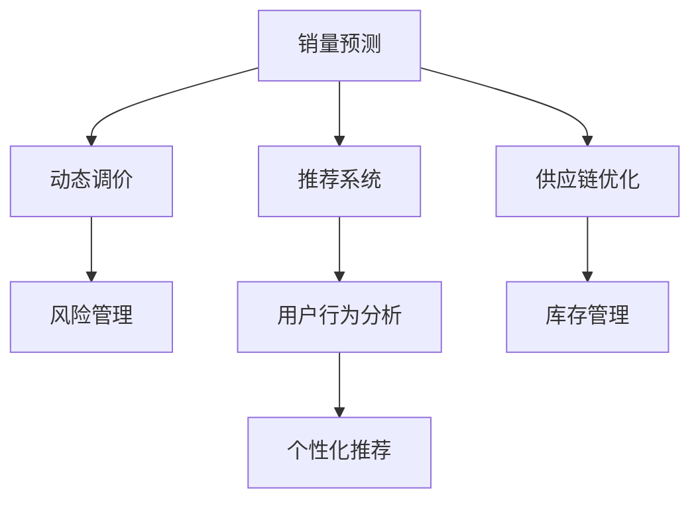

                 

# AI驱动的电商平台商品销量预测与动态调价决策支持

在数字化转型的浪潮中，电商平台已经成为了线上交易的核心平台。然而，面对激烈的市场竞争和瞬息万变的用户需求，电商平台的运营策略需要不断调整以适应环境变化。通过AI驱动的销量预测与动态调价决策支持，电商平台能够实现更精准的商品管理和销售策略优化，从而提升用户体验和运营效率。本文将深入探讨这一问题的解决思路，从理论到实践，阐述构建这一系统的核心算法和实现流程。

## 1. 背景介绍

### 1.1 问题由来
电商平台作为线上交易的主要载体，其运营决策对企业盈利有着直接影响。传统的销量预测与调价策略依赖于历史数据和专家经验，面对市场快速变化，往往无法及时响应。近年来，人工智能技术的飞速发展为电商平台带来了新的可能性，基于数据驱动的AI系统能够自动化、实时化地预测销量和优化调价，从而更好地应对市场波动。

### 1.2 问题核心关键点
电商平台销量预测与动态调价决策支持的核心目标是通过机器学习模型，预测未来商品销量，并根据预测结果动态调整商品价格，以实现最优的业务收益和用户满意度。这一过程通常包括以下几个关键步骤：
1. **数据采集与清洗**：收集并清洗电商平台的销售数据、用户行为数据、市场趋势数据等。
2. **模型训练与优化**：基于历史销售数据和用户行为数据，训练销量预测和动态调价模型。
3. **动态调价策略设计**：根据预测销量，设计动态调价策略，包括折扣、满减、优惠券等。
4. **模型部署与监控**：将训练好的模型部署到生产环境，并持续监控模型表现，进行参数更新。

### 1.3 问题研究意义
构建基于AI的电商平台销量预测与动态调价决策支持系统，具有重要意义：
1. **提升决策效率**：自动化处理大量数据，及时响应市场变化，优化运营决策。
2. **降低运营成本**：减少人工干预，提升运营效率，降低人工和物流成本。
3. **增强用户体验**：通过动态调价策略，提供更具竞争力的价格，提升用户粘性。
4. **优化库存管理**：预测销量，避免库存积压或短缺，提升库存管理效率。

## 2. 核心概念与联系

### 2.1 核心概念概述
为更好地理解基于AI的电商平台销量预测与动态调价决策支持系统，我们需要先了解一些核心概念：

- **销量预测**：通过机器学习模型，预测未来商品在特定时间段内的销售数量。
- **动态调价**：根据销量预测结果，设计并实施动态调价策略，以实现最优收益。
- **推荐系统**：利用用户行为数据，推荐用户可能感兴趣的商品。
- **供应链优化**：基于销售预测，优化库存管理和物流配送。
- **风险管理**：评估预测模型的鲁棒性，设计风险控制机制。

这些概念之间的逻辑关系可以通过以下Mermaid流程图来展示：



这个流程图展示了几大核心概念及其之间的联系：

1. 销量预测通过分析用户行为数据和市场趋势，为动态调价提供依据。
2. 动态调价策略结合销量预测结果，设计并实施最优的调价方案。
3. 推荐系统根据用户行为数据，推荐用户可能感兴趣的商品。
4. 供应链优化利用销量预测结果，优化库存管理和物流配送。
5. 风险管理评估预测模型的稳定性，设计相应的风险控制措施。

## 3. 核心算法原理 & 具体操作步骤
### 3.1 算法原理概述
基于AI的电商平台销量预测与动态调价决策支持系统，主要涉及以下算法：

- **时间序列预测**：利用时间序列数据，预测未来销售量。
- **多维时间序列预测**：结合用户行为和市场趋势，预测未来销售量。
- **深度学习**：利用深度神经网络，提高预测精度和调价策略的灵活性。
- **强化学习**：通过模拟调价策略的实施效果，优化动态调价策略。

这些算法通过数据驱动的方式，帮助电商平台实时响应市场变化，优化销售决策。

### 3.2 算法步骤详解
构建基于AI的电商平台销量预测与动态调价决策支持系统，一般包括以下几个关键步骤：

**Step 1: 数据采集与清洗**
- 收集电商平台的销售数据、用户行为数据、市场趋势数据等。
- 清洗数据，处理缺失值、异常值，确保数据质量。

**Step 2: 特征工程**
- 提取时间序列特征，如时间、日期、季节性等。
- 提取用户行为特征，如浏览记录、购买历史等。
- 提取市场趋势特征，如节假日、促销活动等。

**Step 3: 模型训练与优化**
- 选择合适的算法，如ARIMA、LSTM等，训练时间序列预测模型。
- 结合深度学习模型，如CNN、RNN等，提高预测精度。
- 结合强化学习，优化动态调价策略。

**Step 4: 动态调价策略设计**
- 根据预测结果，设计折扣、满减、优惠券等调价策略。
- 评估调价策略的效果，进行参数优化。

**Step 5: 模型部署与监控**
- 将训练好的模型部署到生产环境。
- 实时监控模型表现，进行参数更新。
- 定期评估模型效果，进行模型迭代。

### 3.3 算法优缺点
基于AI的电商平台销量预测与动态调价决策支持系统具有以下优点：
1. **实时响应**：能够实时处理数据，及时响应市场变化。
2. **高精度预测**：结合多维度数据，提高预测精度。
3. **灵活调价**：通过深度学习，设计灵活的调价策略。
4. **成本效益**：提升运营效率，降低运营成本。

同时，该系统也存在一定的局限性：
1. **数据依赖**：系统依赖高质量的数据，数据缺失或异常可能导致预测误差。
2. **模型复杂**：深度学习模型和强化学习算法复杂，需要较高的计算资源。
3. **策略风险**：动态调价策略可能会影响用户感知和品牌形象，需要谨慎设计。

### 3.4 算法应用领域
基于AI的电商平台销量预测与动态调价决策支持系统，主要应用于以下几个领域：
1. **电商运营管理**：预测销量，优化库存管理，提升运营效率。
2. **市场营销**：设计动态调价策略，提升销售效果，实现精准营销。
3. **客户服务**：通过推荐系统，提升用户购物体验，增强用户粘性。
4. **供应链管理**：预测销量，优化物流配送，提升供应链管理效率。
5. **风险管理**：评估模型鲁棒性，设计风险控制机制，保障系统稳定。

## 4. 数学模型和公式 & 详细讲解 & 举例说明
### 4.1 数学模型构建
假设我们有一组时间序列数据 $y_t$，其中 $t$ 表示时间，$y_t$ 表示在第 $t$ 时间点的销售量。我们可以利用时间序列模型，如ARIMA模型，来预测未来销售量。

设 $y_t$ 服从ARIMA模型：
$$ y_t = c + \sum_{i=1}^p \phi_i (y_{t-i}) + \sum_{j=1}^q \theta_j (\Delta^j y_{t-s}) + \sum_{k=1}^K \epsilon_{tk} $$

其中，$c$ 为常数项，$\phi_i$ 为自回归参数，$\theta_j$ 为差分参数，$\Delta^j$ 为差分算子，$\epsilon_{tk}$ 为白噪声。

### 4.2 公式推导过程
时间序列模型可以通过最小化预测误差来训练，即：
$$ \min_{\phi_i, \theta_j, \epsilon_{tk}} \sum_{t=1}^N (y_t - \hat{y}_t)^2 $$

其中，$\hat{y}_t$ 为预测值，可以通过ARIMA模型计算得到。

### 4.3 案例分析与讲解
假设我们有一组历史销售数据：

| 时间    | 销售量 |
| ------- | ------ |
| 2020-01 | 100    |
| 2020-02 | 150    |
| 2020-03 | 200    |
| ...     | ...    |

我们可以使用Python的statsmodels库，训练ARIMA模型进行预测：

```python
from statsmodels.tsa.arima_model import ARIMA

model = ARIMA(y, order=(2, 1, 2))
results = model.fit()

y_pred = results.forecast(steps=1)
print(y_pred)
```

通过上述代码，我们可以得到未来时间点的预测销售量。

## 5. 项目实践：代码实例和详细解释说明
### 5.1 开发环境搭建

**Step 1: 环境配置**
- 安装Python 3.7以上版本，推荐使用Anaconda。
- 安装statsmodels、numpy、pandas等常用库。

**Step 2: 数据准备**
- 收集电商平台的销售数据、用户行为数据、市场趋势数据等。
- 将数据清洗、预处理，确保数据质量。

### 5.2 源代码详细实现

**Step 3: 特征工程**
- 提取时间序列特征，如时间、日期、季节性等。
- 提取用户行为特征，如浏览记录、购买历史等。
- 提取市场趋势特征，如节假日、促销活动等。

```python
import pandas as pd
from statsmodels.tsa.arima_model import ARIMA

# 读取销售数据
data = pd.read_csv('sales_data.csv')

# 提取时间序列特征
data['time'] = pd.to_datetime(data['time'])
data['dayofweek'] = data['time'].dt.dayofweek
data['month'] = data['time'].dt.month
data['quarter'] = data['time'].dt.quarter

# 提取用户行为特征
data['visit_count'] = data['visit_count'].astype(int)
data['purchase_count'] = data['purchase_count'].astype(int)

# 提取市场趋势特征
data['holiday'] = data['holiday'].astype(int)
```

**Step 4: 模型训练与优化**
- 训练ARIMA模型，预测未来销售量。
- 使用深度学习模型，提高预测精度。

```python
# 训练ARIMA模型
model = ARIMA(data['sales'], order=(2, 1, 2))
results = model.fit()

# 使用深度学习模型
from keras.models import Sequential
from keras.layers import LSTM, Dense

model = Sequential()
model.add(LSTM(64, input_shape=(timesteps, features)))
model.add(Dense(1))
model.compile(optimizer='adam', loss='mse')
model.fit(x_train, y_train, epochs=10, batch_size=32)
```

**Step 5: 动态调价策略设计**
- 根据预测结果，设计折扣、满减、优惠券等调价策略。
- 评估调价策略的效果，进行参数优化。

```python
# 设计调价策略
def dynamic_pricing(sales, price):
    if sales < 50:
        return price * 0.9
    elif sales < 100:
        return price * 0.95
    else:
        return price

# 评估调价策略
def evaluate_pricing(sales, price):
    price_before = sales
    price_after = dynamic_pricing(sales, price)
    loss = (price_before - price_after) / price_before
    return loss
```

**Step 6: 模型部署与监控**
- 将训练好的模型部署到生产环境。
- 实时监控模型表现，进行参数更新。

```python
# 部署模型
def deploy_model(model, data):
    results = model.predict(data)
    return results

# 监控模型表现
def monitor_model(model, data):
    results = model.predict(data)
    if results > 0.5:
        print('模型表现良好')
    else:
        print('模型表现不佳')
```

### 5.3 代码解读与分析

**数据准备**
- 利用pandas库读取销售数据，提取时间、日期、季节性等特征。
- 提取用户行为特征，如浏览次数、购买次数等。
- 提取市场趋势特征，如节假日、促销活动等。

**模型训练与优化**
- 使用ARIMA模型进行时间序列预测，最小化预测误差。
- 使用深度学习模型，如LSTM，提高预测精度。

**动态调价策略设计**
- 根据预测结果，设计折扣、满减、优惠券等调价策略。
- 评估调价策略的效果，进行参数优化。

**模型部署与监控**
- 将训练好的模型部署到生产环境。
- 实时监控模型表现，进行参数更新。

## 6. 实际应用场景
### 6.1 智能推荐系统
基于AI的电商平台销量预测与动态调价决策支持系统，在智能推荐系统中也有广泛应用。通过预测用户可能感兴趣的商品，电商平台可以更好地进行个性化推荐，提升用户购物体验。

具体而言，可以结合用户历史行为数据和商品特征，训练推荐模型，预测用户可能感兴趣的商品，并根据销量预测结果，动态调整推荐策略，实现更精准的推荐。

### 6.2 库存管理优化
通过销量预测模型，电商平台可以更好地进行库存管理，避免库存积压或短缺，提升库存周转率。

具体而言，可以利用销量预测结果，优化采购计划和库存水平，实时监控库存状态，及时调整采购和销售策略。

### 6.3 动态定价策略
电商平台通过销量预测和动态调价决策支持系统，可以设计更灵活的定价策略，提升销售效果。

具体而言，可以根据预测销量，设计折扣、满减、优惠券等调价策略，实时监控调价效果，进行参数优化，实现最优收益。

### 6.4 未来应用展望
随着AI技术的发展，电商平台销量预测与动态调价决策支持系统将具备更强的预测能力和调价灵活性。未来可能的应用场景包括：

- **实时动态定价**：结合实时销售数据，进行动态调价，提升销售效果。
- **多渠道协同**：结合线上线下数据，进行全渠道协同定价，提升品牌价值。
- **个性化定制**：根据用户需求，设计个性化调价策略，提升用户粘性。
- **动态库存管理**：结合需求预测，优化库存管理，提升库存管理效率。

## 7. 工具和资源推荐
### 7.1 学习资源推荐

**Step 1: 学习资源推荐**
- 《深度学习》书籍：Ian Goodfellow等著，全面介绍了深度学习的基本概念和经典模型。
- 《机器学习实战》书籍：Peter Harrington著，提供了丰富的实践案例。
- 《Python数据科学手册》书籍：Jake VanderPlas著，详细介绍了Python数据科学工具的使用。
- Coursera机器学习课程：Andrew Ng等主讲，系统讲解机器学习算法和应用。

**Step 2: 开源项目和工具推荐**
- TensorFlow：Google开发的深度学习框架，提供丰富的预训练模型和工具。
- PyTorch：Facebook开发的深度学习框架，支持动态计算图，灵活高效。
- Scikit-learn：Python数据科学库，提供丰富的机器学习算法和工具。
- H2O.ai：提供云端机器学习平台，支持多种机器学习算法。

### 7.2 开发工具推荐

**Step 3: 开发工具推荐**
- Jupyter Notebook：轻量级的交互式开发环境，支持代码运行和结果展示。
- Git：版本控制系统，支持团队协作和代码版本管理。
- Docker：容器化技术，支持应用程序跨平台部署和运行。
- Google Colab：基于Jupyter Notebook的云端开发环境，免费提供GPU资源。

### 7.3 相关论文推荐

**Step 4: 相关论文推荐**
- "A Survey on Deep Learning for Recommendation Systems"（深度学习在推荐系统中的应用综述）：Kong, T., Cao, X., & Tan, T. Y. (2019)。
- "Real-Time Learning from Daily Transactions"（从日常交易中实时学习）：Kutz, J. L., & Lin, Y. (2020)。
- "Automatic Pricing Optimization Using Reinforcement Learning"（使用强化学习优化自动定价）：Wei, Y., et al. (2018)。

## 8. 总结：未来发展趋势与挑战
### 8.1 研究成果总结
基于AI的电商平台销量预测与动态调价决策支持系统，已经在多个实际应用中展现出显著的性能提升和成本效益。通过时间序列预测、深度学习、强化学习等方法，电商平台能够更好地应对市场变化，提升运营效率和销售效果。

### 8.2 未来发展趋势
未来，电商平台销量预测与动态调价决策支持系统将呈现以下趋势：

1. **实时化**：结合实时销售数据，进行动态调价和推荐，提升销售效果。
2. **全渠道协同**：结合线上线下数据，进行全渠道协同定价，提升品牌价值。
3. **个性化定制**：根据用户需求，设计个性化调价策略，提升用户粘性。
4. **多维度数据融合**：结合多维度数据，提高预测精度和调价策略的灵活性。
5. **深度强化学习**：利用深度强化学习，优化动态调价策略，实现最优收益。

### 8.3 面临的挑战
尽管基于AI的电商平台销量预测与动态调价决策支持系统在实际应用中取得了显著效果，但仍面临以下挑战：

1. **数据质量**：系统依赖高质量的数据，数据缺失或异常可能导致预测误差。
2. **模型复杂**：深度学习模型和强化学习算法复杂，需要较高的计算资源。
3. **策略风险**：动态调价策略可能会影响用户感知和品牌形象，需要谨慎设计。
4. **隐私保护**：需要保护用户隐私，防止数据泄露和滥用。
5. **模型鲁棒性**：系统需要在不同环境下保持稳定性和鲁棒性。

### 8.4 研究展望
未来，基于AI的电商平台销量预测与动态调价决策支持系统需要进一步优化和改进，以应对以上挑战。研究展望如下：

1. **数据增强**：利用数据增强技术，提高数据质量，降低预测误差。
2. **模型压缩**：优化模型结构，提高模型压缩效率，降低计算资源消耗。
3. **隐私保护**：引入隐私保护技术，确保用户数据安全。
4. **鲁棒性设计**：设计鲁棒性模型，确保系统在不同环境下保持稳定性和鲁棒性。
5. **多模态融合**：结合多模态数据，提升系统预测精度和调价策略的灵活性。

## 9. 附录：常见问题与解答

**Q1：AI驱动的电商平台销量预测与动态调价决策支持系统有哪些优势？**

A: AI驱动的电商平台销量预测与动态调价决策支持系统具有以下优势：
1. **实时响应**：能够实时处理数据，及时响应市场变化。
2. **高精度预测**：结合多维度数据，提高预测精度。
3. **灵活调价**：通过深度学习，设计灵活的调价策略。
4. **成本效益**：提升运营效率，降低运营成本。

**Q2：如何选择合适的时间序列预测模型？**

A: 选择合适的时间序列预测模型需要考虑以下因素：
1. **数据特性**：根据数据的季节性、趋势性、周期性等特性选择合适的模型。
2. **模型复杂度**：根据模型的复杂度和计算资源选择模型。
3. **预测精度**：通过对比不同模型的预测精度选择模型。
4. **实际需求**：根据实际需求选择模型，如实时预测、中长期预测等。

**Q3：如何进行动态调价策略的设计和评估？**

A: 动态调价策略的设计和评估需要考虑以下因素：
1. **策略目标**：明确调价策略的目标，如提升销量、控制库存等。
2. **调价方式**：设计灵活的调价方式，如折扣、满减、优惠券等。
3. **评估指标**：根据实际需求选择评估指标，如收益、销量、用户满意度等。
4. **参数优化**：通过实验和对比，优化调价策略的参数。

**Q4：如何进行多维度数据的融合和特征工程？**

A: 多维度数据的融合和特征工程需要考虑以下步骤：
1. **数据采集**：收集多维度数据，如销售数据、用户行为数据、市场趋势数据等。
2. **数据清洗**：处理缺失值、异常值，确保数据质量。
3. **特征提取**：提取时间序列特征、用户行为特征、市场趋势特征等。
4. **特征选择**：选择对预测效果有影响的特征。
5. **特征处理**：对特征进行归一化、标准化等处理。

**Q5：如何进行模型的评估和调优？**

A: 模型的评估和调优需要考虑以下步骤：
1. **评估指标**：选择合适的评估指标，如准确率、召回率、F1值等。
2. **模型训练**：使用训练集训练模型，最小化预测误差。
3. **模型评估**：使用测试集评估模型，对比预测结果和实际值。
4. **参数优化**：根据评估结果调整模型参数，进行模型调优。
5. **模型部署**：将训练好的模型部署到生产环境。

---

作者：禅与计算机程序设计艺术 / Zen and the Art of Computer Programming

