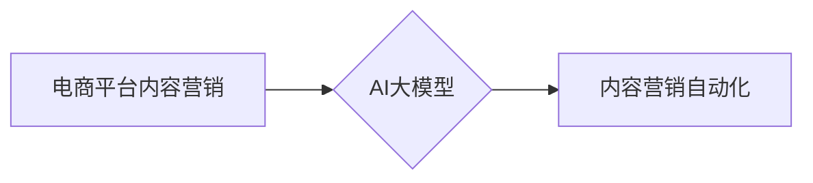

                 

## AI大模型在电商平台内容营销自动化中的应用

> 关键词：AI大模型、电商平台、内容营销、自动化、自然语言处理、机器学习、深度学习、推荐系统

## 1. 背景介绍

随着电商平台的蓬勃发展，内容营销已成为企业获取用户、提升品牌知名度和促进销售的重要手段。然而，传统的内容营销模式往往依赖人工创作，效率低下，成本高昂。而随着人工智能技术的快速发展，特别是大模型技术的突破，AI大模型在电商平台内容营销自动化中的应用逐渐成为热点。

AI大模型，是指在海量数据上训练的具有强大泛化能力的深度学习模型，能够理解和生成人类语言，并完成复杂的认知任务。在电商平台内容营销领域，AI大模型可以自动生成产品描述、广告文案、社交媒体内容等，大幅提升内容创作效率，降低成本，同时还能根据用户画像和行为数据，精准推送个性化内容，提升用户体验和转化率。

## 2. 核心概念与联系

### 2.1  电商平台内容营销

电商平台内容营销是指在电商平台上通过各种形式的内容，如产品描述、广告文案、图文、视频等，吸引用户关注，提升品牌形象，最终促进销售。

### 2.2  AI大模型

AI大模型是指在海量数据上训练的深度学习模型，具有强大的泛化能力和学习能力，能够理解和生成人类语言，并完成复杂的认知任务。常见的AI大模型包括GPT-3、BERT、LaMDA等。

### 2.3  内容营销自动化

内容营销自动化是指利用技术手段，自动完成内容创作、发布、推广等流程，提高效率和精准度。

**核心概念与联系流程图:**



## 3. 核心算法原理 & 具体操作步骤

### 3.1  算法原理概述

AI大模型在电商平台内容营销自动化中的应用主要基于以下核心算法：

* **自然语言处理 (NLP):** 用于理解和生成人类语言，包括文本分类、情感分析、文本摘要、机器翻译等。
* **机器学习 (ML):** 用于从数据中学习模式，并进行预测或分类，例如用户画像分析、内容推荐、广告投放优化等。
* **深度学习 (DL):** 用于构建更复杂的模型，例如生成式对抗网络 (GAN) 用于生成高质量的图片和视频内容。

### 3.2  算法步骤详解

1. **数据收集与预处理:** 收集电商平台相关数据，如产品信息、用户行为数据、市场趋势等，并进行清洗、格式化和标注等预处理工作。
2. **模型训练:** 利用收集到的数据训练AI大模型，例如使用GPT-3生成产品描述，使用BERT进行广告文案优化，使用推荐算法进行个性化内容推荐。
3. **模型评估与优化:** 对训练好的模型进行评估，并根据评估结果进行调整和优化，提高模型的准确率、效率和鲁棒性。
4. **内容生成与发布:** 利用训练好的模型自动生成各种电商平台内容，并通过自动化工具进行发布和推广。
5. **效果监测与分析:** 持续监测内容营销的效果，分析用户反馈和数据指标，并根据分析结果进行调整和改进。

### 3.3  算法优缺点

**优点:**

* **提高效率:** 自动化内容创作流程，大幅提升内容生产效率。
* **降低成本:** 减少人工创作成本，提高资源利用率。
* **精准化营销:** 根据用户画像和行为数据，精准推送个性化内容，提升用户体验和转化率。
* **数据驱动:** 基于数据分析，不断优化内容策略，提升营销效果。

**缺点:**

* **数据依赖:** AI大模型的性能依赖于训练数据的质量和数量。
* **伦理风险:** 内容生成可能存在偏见、虚假信息等伦理风险，需要谨慎处理。
* **技术门槛:** 训练和部署AI大模型需要一定的技术门槛。

### 3.4  算法应用领域

* **产品描述生成:** 自动生成产品描述，提高产品信息丰富度和吸引力。
* **广告文案创作:** 根据目标用户和产品特点，自动生成精准的广告文案。
* **社交媒体内容运营:** 自动生成社交媒体内容，提高用户互动和品牌曝光度。
* **个性化推荐:** 根据用户兴趣和行为数据，推荐个性化的产品和内容。
* **客户服务自动化:** 利用聊天机器人等技术，自动回复客户咨询，提高服务效率。

## 4. 数学模型和公式 & 详细讲解 & 举例说明

### 4.1  数学模型构建

在电商平台内容营销自动化中，常用的数学模型包括：

* **推荐系统模型:** 基于用户行为数据和商品特征，预测用户对商品的兴趣和购买意愿。常用的推荐算法包括协同过滤、基于内容的推荐、深度学习推荐等。
* **自然语言理解模型:** 用于理解用户输入的文本信息，例如文本分类、情感分析、意图识别等。常用的模型包括BERT、RoBERTa、XLNet等。
* **生成式模型:** 用于生成新的文本内容，例如产品描述、广告文案、社交媒体内容等。常用的模型包括GPT-3、T5、BART等。

### 4.2  公式推导过程

推荐系统模型的评分预测公式是一个典型的例子：

$$
r_{ui} = \beta_0 + \beta_1 * u_i + \beta_2 * i_j + \beta_3 * u_i * i_j
$$

其中：

* $r_{ui}$ 表示用户 $u$ 对商品 $i$ 的评分。
* $\beta_0$ 是截距项。
* $\beta_1$、$\beta_2$、$\beta_3$ 是模型参数，需要通过训练数据学习得到。
* $u_i$ 是用户 $u$ 的特征向量。
* $i_j$ 是商品 $j$ 的特征向量。

### 4.3  案例分析与讲解

假设我们有一个电商平台，想要推荐用户喜欢的商品。我们可以使用协同过滤算法构建推荐系统模型。

首先，收集用户对商品的评分数据，并将其表示为用户-商品评分矩阵。然后，根据用户的评分历史，计算用户与其他用户的相似度，以及商品与其他商品的相似度。

最后，根据用户的相似用户和商品的相似商品，预测用户对未评分商品的评分，并推荐用户可能感兴趣的商品。

## 5. 项目实践：代码实例和详细解释说明

### 5.1  开发环境搭建

* Python 3.7+
* TensorFlow/PyTorch
* NLTK/SpaCy
* Jupyter Notebook

### 5.2  源代码详细实现

以下是一个使用GPT-3生成产品描述的代码示例：

```python
import openai

# 设置OpenAI API密钥
openai.api_key = "YOUR_API_KEY"

# 定义产品信息
product_name = "智能手机"
product_features = ["高性能处理器", "高分辨率屏幕", "长续航电池"]

# 使用GPT-3生成产品描述
response = openai.Completion.create(
    engine="text-davinci-003",
    prompt=f"请描述一款名为{product_name}的智能手机，其特点是{', '.join(product_features)}。",
    max_tokens=150,
    temperature=0.7
)

# 打印生成的描述
print(response.choices[0].text)
```

### 5.3  代码解读与分析

* 首先，导入必要的库，并设置OpenAI API密钥。
* 然后，定义产品信息，包括产品名称和产品特点。
* 使用`openai.Completion.create()`函数调用GPT-3 API，生成产品描述。
* `engine`参数指定使用的GPT-3模型，`prompt`参数指定输入提示，`max_tokens`参数限制生成的文本长度，`temperature`参数控制文本的随机性。
* 最后，打印生成的描述。

### 5.4  运行结果展示

运行该代码后，将输出一个关于智能手机的描述，例如：

> 这款名为智能手机的智能手机，拥有高性能处理器，可以流畅运行各种应用程序。其高分辨率屏幕，带来清晰细腻的视觉体验。长续航电池，让你无需频繁充电，尽情享受使用乐趣。

## 6. 实际应用场景

### 6.1  电商平台内容营销

* **自动生成产品描述:** 提高产品信息丰富度和吸引力，节省人工成本。
* **个性化推荐:** 根据用户画像和行为数据，推荐个性化的产品和内容，提升用户体验和转化率。
* **社交媒体内容运营:** 自动生成社交媒体内容，提高用户互动和品牌曝光度。

### 6.2  客户服务自动化

* **聊天机器人:** 利用AI大模型构建聊天机器人，自动回复客户咨询，提高服务效率。
* **智能客服:** 分析客户问题，提供精准的解决方案，提升客户满意度。

### 6.3  市场营销分析

* **舆情监测:** 分析用户对品牌和产品的评价，及时了解市场动态。
* **广告投放优化:** 根据用户画像和行为数据，优化广告投放策略，提高广告效果。

### 6.4  未来应用展望

随着AI技术的不断发展，AI大模型在电商平台内容营销自动化中的应用将更加广泛和深入，例如：

* **更精准的个性化推荐:** 利用更先进的推荐算法和用户画像分析技术，提供更精准的个性化推荐。
* **更生动的互动体验:** 利用AI大模型生成更生动的虚拟形象和交互场景，提升用户体验。
* **更智能的营销策略:** 利用AI大模型分析市场数据和用户行为，制定更智能的营销策略。

## 7. 工具和资源推荐

### 7.1  学习资源推荐

* **斯坦福大学CS224N自然语言处理课程:** https://web.stanford.edu/class/cs224n/
* **DeepLearning.AI深度学习课程:** https://www.deeplearning.ai/
* **HuggingFace Transformers库文档:** https://huggingface.co/docs/transformers/index

### 7.2  开发工具推荐

* **TensorFlow:** https://www.tensorflow.org/
* **PyTorch:** https://pytorch.org/
* **OpenAI API:** https://beta.openai.com/docs/api-reference

### 7.3  相关论文推荐

* **BERT: Pre-training of Deep Bidirectional Transformers for Language Understanding:** https://arxiv.org/abs/1810.04805
* **GPT-3: Language Models are Few-Shot Learners:** https://arxiv.org/abs/2005.14165
* **Attention Is All You Need:** https://arxiv.org/abs/1706.03762

## 8. 总结：未来发展趋势与挑战

### 8.1  研究成果总结

AI大模型在电商平台内容营销自动化领域取得了显著成果，例如：

* 自动生成高质量的产品描述和广告文案，提高营销效率。
* 提供个性化推荐，提升用户体验和转化率。
* 自动化客户服务，提高服务效率。

### 8.2  未来发展趋势

* **模型规模和能力的提升:** 未来，AI大模型的规模和能力将进一步提升，能够处理更复杂的任务，生成更高质量的内容。
* **多模态内容生成:** AI大模型将能够处理多种模态数据，例如文本、图像、音频等，生成更丰富的多模态内容。
* **更精准的个性化推荐:** 利用更先进的推荐算法和用户画像分析技术，提供更精准的个性化推荐。

### 8.3  面临的挑战

* **数据安全和隐私保护:** AI大模型的训练需要大量数据，如何保证数据安全和隐私保护是一个重要挑战。
* **算法偏见和伦理风险:** AI大模型可能存在算法偏见，导致不公平的结果，需要谨慎处理伦理风险。
* **模型解释性和可控性:** AI大模型的决策过程往往难以解释，如何提高模型的解释性和可控性是一个重要研究方向。

### 8.4  研究展望

未来，AI大模型在电商平台内容营销自动化领域将继续发挥重要作用，并带来更多创新应用。需要加强对AI技术的研发和应用，并关注其伦理和社会影响，确保AI技术能够安全、有效地服务于人类社会。

## 9. 附录：常见问题与解答

### 9.1  Q1: 如何选择合适的AI大模型？

**A1:** 选择合适的AI大模型需要根据具体应用场景和需求进行考虑。例如，生成产品描述需要选择文本生成能力强的模型，如GPT-3，而进行用户画像分析需要选择语义理解能力强的模型，如BERT。

### 9.2  Q2: 如何解决AI大模型训练数据不足的问题？

**A2:** 可以采用数据增强技术，例如文本 paraphrasing、数据合成等，增加训练数据量。也可以利用迁移学习技术，将预训练模型在特定任务上进行微调，降低对训练数据的依赖。

### 9.3  Q3: 如何评估AI大模型的性能？

**A3:** 可以使用多种指标来评估AI大模型的性能，例如准确率、召回率、F1-score、BLEU等。具体的指标选择需要根据任务类型和需求进行调整。


作者：禅与计算机程序设计艺术 / Zen and the Art of Computer Programming 
<end_of_turn>

